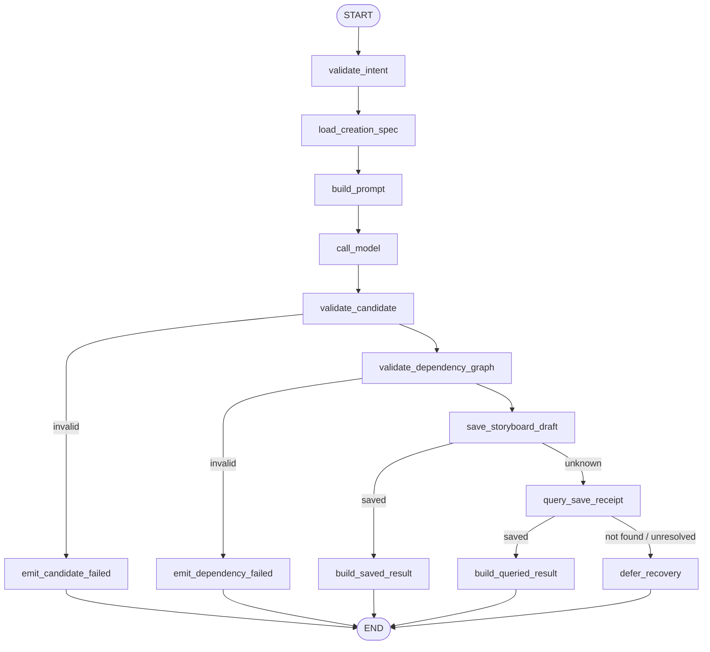
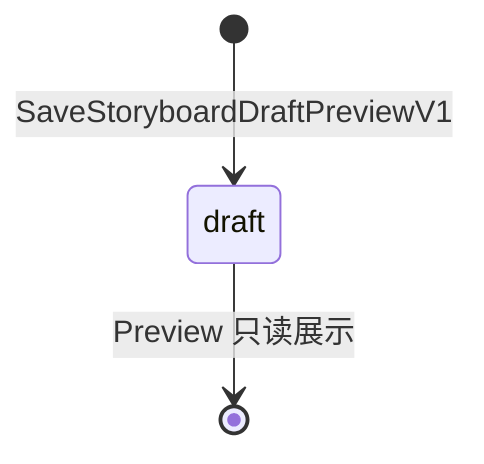

# `plan_storyboard` Tool-enabled Runtime 最小 Profile 设计

> 文档状态：Approved for Development Preview / 不授权生产实现
>
> Profile：`plan_storyboard.runtime.v2preview1`
>
> Tool Definition：`plan_storyboard.v2preview1`
>
> Graph Key：`plan_storyboard_graph_v2preview1`
>
> 设计与产品行为批准日期：2026-07-17
>
> Owner：Business 拥有 Storyboard Draft；Agent 拥有 Input/Run/Receipt/Event 与 Graph 执行
>
> 批准依据：用户要求继续按统一开发计划推进并使用多 Agent 分工。本批准只覆盖本文 exact-set，不改变完整生产 `plan_storyboard.v1alpha1` 的 Draft 结论。

关联文档：[唯一开发计划](../../requirements/full-function-smoke-development-plan.md)、[完整生产 Storyboard Graph Tool 设计](graphtool/plan_storyboard-design.md)、[`analyze_materials.runtime.v2preview1`](analyze-materials-runtime-v2-design.md)、[AIGC 跨 Module 契约目录](../cross-module/aigc-contract-catalog.md)。

## 1. 本批目标与批准结论

本 Profile 只完成一条可启动、可操作、可恢复的 Storyboard Draft 纵切：

1. 用户从当前 Project Workspace 已显示的 CreationSpec Draft 发起结构化 `plan_storyboard.preview.intent.v1`；
2. HTTP 只校验身份、Owner、CSRF、幂等和严格 DTO，并把 typed Input 持久化；
3. 后台 Processor 经 PostgreSQL Session HOL、Lease/Fence 和唯一主 Eino ChatModelAgent 调用唯一 `plan_storyboard` Graph Tool；
4. Graph 只读取当前用户、当前 Project 下指定版本的 CreationSpec Draft，生成严格候选，校验局部引用和依赖 DAG；
5. Business 在隔离的 Preview 聚合中保存一个不可变 Storyboard Draft JSON 与 Command Receipt，状态固定为 `draft`；
6. Agent first-write-wins 冻结 Router Model、Graph Model、Tool Result 和安全 Card，并通过 Snapshot/SSE 恢复；
7. 本地 Fake Router 与 Fake Planning Model 是本批唯一模型路由，不调用真实 Provider。

本批准明确不包含：MaterialAnalysis、修订已有 Storyboard、锁定内容/Asset Binding、Diff、激活、Approval、计费、Prompt 生成、Operation/Batch/Job、Worker、媒体 Provider、生产静态 Catalog 注册。

## 2. 当前事实与隔离边界

- CreationSpec Preview 已把严格 `creation_spec.draft.v1` 保存到 Business PostgreSQL，可按 Owner、Project、ID、version、digest 读取；本 Profile 消费 Draft，不伪装为生产设计要求的 Active。
- `analyze_materials.runtime.v2preview1` 已验证 typed ingress、单 Tool Registry、两层 Model Receipt、Tool Receipt、Projection/SSE/Card 和全 Source HOL；本 Profile 可以复用工程模式，但必须使用专用表、Source、Context、Receipt 和配置。
- 完整 `plan_storyboard.v1alpha1` 仍是生产 Draft，要求 Active CreationSpec、可选 MaterialAnalysis、计费、双 Approval、Revision/Diff/锁/绑定保护；本 Profile 不得把这些目标能力写成当前事实。
- 本 Profile 与 `plan_creation_spec.v1preview1`、`user_message.runtime.v2preview1`、`analyze_materials.runtime.v2preview1` 互斥启用。生产统一 Lane Dispatcher 未实现前，不并行运行多个 source-filtered Processor。

## 3. 用户入口与严格 Intent

唯一用户入口：

```text
POST /api/v1/agent/sessions/:session_id/plan-storyboard-previews
  -> Business BFF 重验 Principal、Project/Session Owner、CSRF
  -> POST /internal/v1/workspaces/sessions/:session_id/plan-storyboard-previews
  -> Agent 校验 internal assertion scope `plan_storyboard.preview.write`
  -> 单事务写 typed Intent、Input、Turn Context、Run identity、open Receipt、accepted Event
  -> 202 pending/replayed
```

公开 Enqueue DTO `plan_storyboard.preview.enqueue-request.v1` exact-set：

```json
{
  "schema_version": "plan_storyboard.preview.enqueue-request.v1",
  "creation_spec_ref": {
    "id": "<uuidv7>",
    "version": 1,
    "content_digest": "<sha256>"
  },
  "tool_intent": {
    "schema_version": "plan_storyboard.preview.intent.v1",
    "planning_instruction": "将当前创作规范规划为节奏清晰的故事板",
    "target_duration_seconds": 60
  }
}
```

约束：

- `creation_spec_ref` 必须来自当前 Workspace 的权威 CreationSpec Card，不提供自由文本 ID 产品入口；BFF 先验证 Owner，Agent 再把 ID/version/digest 冻结为可信 Turn Context，绝不暴露到模型可控 Tool Schema；
- CreationSpec version 本批固定为 `1`，且保存前再次比对 Business content digest；
- `planning_instruction` 为 NFC、1～1000 字符，不得包含可信身份、资源版本或授权；
- `target_duration_seconds` 可选，存在时为 5～600；总时长 Validator 允许不超过 `max(2 秒, 5%)` 的舍入误差；
- BFF 与 Agent 都拒绝未知字段、重复字段、尾随 JSON、非规范 UUIDv7、非法 Unicode 和超限正文；
- `session_input.source_type = plan_storyboard_preview`，`message_id = NULL`，不创建或篡改 `session_message`。

同一 `Session + Idempotency-Key` 同义重放返回首次稳定身份，异义返回 `409 IDEMPOTENCY_CONFLICT`。首次事务预分配 `input_id/turn_id/run_id/tool_call_id/router_model_call_id/graph_model_call_id/business_command_id/accepted_event_id/terminal_event_id`，并把 `creation_spec_ref` 与 canonical `tool_intent` 分栏冻结；重试、重启和 Takeover 不换 ID。

## 4. Business 读取与写入契约

### 4.1 只读规划上下文

`GetStoryboardPlanningContextPreviewV1` 输入 exact-set：`schema_version/request_id/user_id/project_id/creation_spec_ref{id/version/content_digest}`。

返回 `storyboard.planning-context.preview.v1`：

- CreationSpec `id/project_id/version/status/content_digest/content`；
- 只允许 `status=draft`、`schema_version=creation_spec.draft.v1`；
- Owner、Project、ID 或版本任一不匹配都返回安全 `NOT_FOUND` 或 `VERSION_CONFLICT`，不泄漏跨用户资源存在性；
- 单次 Repository 查询完成 Owner + exact resource 读取，不循环 SQL。

### 4.2 Storyboard Draft 内容

模型只生成局部键，禁止生成 UUID、状态、版本、摘要、Prompt、Asset 或 Job：

```text
StoryboardCandidate
  title / summary
  sections[1..8]
    key=section_1..section_8 / title / objective
  elements[1..24]
    local_key=element_1..element_24
    section_key / order / type / title / narrative_purpose
    duration_seconds / source_phase_key / dependency_local_keys[0..8]
  slots[0..96]
    local_key=slot_1..slot_96 / element_key / type / purpose / required
```

稳定枚举：

- Element type：`scene|shot|narration|caption|audio`；
- Slot type：`image|video|audio|voiceover|caption`；
- 文本上限：根 title 120、summary 1000、Section title 100/objective 500、Element title 120/narrative purpose 1000、Slot purpose 500 个 Unicode scalar；全部必须为 NFC、无边界空白或控制字符；
- `source_phase_key` 必须引用 CreationSpec 的现有 phase；
- Element 总数 1～24，Slot 总数 0～96，依赖只可引用候选 local key，必须无环；
- 全部 Element 的总时长必须为 5～600 秒；指定 `target_duration_seconds` 时再叠加 `max(2 秒, 5%)` 的误差约束；
- 每个 Section 至少包含一个 Element，每个 Element 最多包含四个 Slot；
- `order` 在全局为从 1 开始的连续整数，Section 顺序由数组位置冻结；
- Business `encoding/json` canonical Content 必须不超过 64 KiB，Agent 与前端按相同 HTML escape 和 UTF-8 字节语义预校验；
- 候选不得包含最终媒体 Prompt、Provider 参数或 Asset Binding。

局部 `section/element/slot` key 只服务本 Preview 内容内的确定性引用，不宣称是生产稳定 ID。Business 只为整个 `storyboard_preview_draft` 分配一个 UUIDv7；生产 Revision/Element/Slot 的稳定身份必须在完整生产设计获批后另行实现。

### 4.3 保存命令与幂等

`SaveStoryboardDraftPreviewV1` 在一个 Business 事务内保存：

- `business.storyboard_preview_draft`：Owner、Project、CreationSpec version/digest、状态 `draft`、版本 `1`、严格内容 JSON/digest 与来源 Tool/Prompt/Validator；
- `business.storyboard_preview_command_receipt`：`command_id + request_digest` first-write-wins 安全结果。

保存 Guard：Owner/Project/CreationSpec ID、version、status 与 content digest 必须仍等于读取快照；local-key、引用、顺序和 DAG 全部由 Business 复核。两张表不占用生产 `storyboard/revision/element/slot` 命名，所有逻辑引用不建物理外键；表列具有中文 COMMENT。

同 command 同 digest 返回原 Storyboard Draft；同 command 异 digest 冲突。Save 结果未知时 Agent 只能先 `QueryStoryboardDraftCommandPreviewV1` 查询原 `business_command_id + request_digest`；只有 Business 权威 `not_found` 且持久化重发预算允许时，才可同键同正文有界重发。首批可把自动重发上限冻结为 1。

## 5. Graph State 与 Tool 契约

### 5.1 Tool Definition

```text
profile = plan_storyboard.runtime.v2preview1
executable_tools = [plan_storyboard]
tool_definition = plan_storyboard.v2preview1
intent_schema = plan_storyboard.preview.intent.v1
candidate_schema = storyboard.preview.candidate.v1
result_schema = plan_storyboard.preview.result.v1
return_directly = true
```

启动时 Registry 必须 exact-match 恰好一个 Tool；缺失、重复、额外 Tool、Schema/Info 不一致全部失败关闭。静态生产 Catalog 仍显示 `unavailable/DESIGN_REVIEW_PENDING`。

### 5.2 Typed Graph State

`PlanStoryboardPreviewState` 字段及 Owner：

| 字段 | Owner/来源 | 写节点 | 关键不变量 |
|---|---|---|---|
| `trusted_context` | Runtime | 初始化器 | 不可被模型覆盖，含 user/project/session/input/run/tool/command/fence |
| `creation_spec_ref` | Business BFF/Runtime | 初始化器 | 可信资源 ID/version/digest，不进入 Tool Schema |
| `intent` / `intent_digest` | typed ingress | `validate_intent` | 只含 planning fields，与入队密文、摘要一致 |
| `creation_spec_context` | Business RPC | `load_creation_spec` | Owner、Draft version/digest exact-match |
| `prompt_messages` | Agent Prompt | `build_prompt` | 最小 CreationSpec 内容与用户 instruction |
| `model_message` / `candidate` | Graph Fake Model | `call_model` | 不含 UUID/状态/Prompt/Asset |
| `validation_report` | Agent | `validate_candidate` / `validate_dependency_graph` | 字段、枚举、时长、引用、DAG 确定性验证 |
| `save_outcome` | Business RPC | `save_storyboard_draft` / `query_save_receipt` | saved/unknown/unresolved 判别联合 |
| `result` / `error` | Agent | `build_saved_result` / `build_queried_result` / 两个 `emit_*_failed` | completed/failed/recovery_pending 唯一结果 |

State 只存在于单次 Graph 调用；PostgreSQL Receipt 和 Business Draft 才是权威恢复事实，不使用 Eino Checkpoint 冒充业务状态。

## 6. Graph 流程与稳定 Node 清单



Graph 使用 Eino `compose.Graph`、经典 `*schema.Message` 和 `AllPredecessor` 无环 DAG。Save unknown 只查询一次原命令后结束本次 Graph；后续同键重发由 Processor 在新的 Claim 中依据持久化预算恢复，Graph 内不形成 RPC 循环。不得无限纠错或无限 RPC 重试。

| Node Key | 类型 | 单一职责 | 副作用/回执 | 失败目标 |
|---|---|---|---|---|
| `validate_intent` | Guard Lambda | 严格解码和规范化 Intent | 无 | 契约错误 |
| `load_creation_spec` | Query Lambda/RPC | 单次读取 Owner 校验后的 Draft | RPC 查询回执 | not found/version conflict |
| `build_prompt` | Prompt Node | 构造冻结版本的最小 Prompt | Prompt digest | render failed |
| `call_model` | ChatModel Node | 生成一个无 UUID 的候选 | Graph Model Receipt | model failed |
| `validate_candidate` | Validator Lambda | 校验字段、枚举、phase、数量、时长 | Validator version | invalid candidate |
| `validate_dependency_graph` | Validator Lambda | 引用转换、拓扑排序和 Slot 归属复核 | DAG validator | cycle/invalid ref |
| `save_storyboard_draft` | Command Lambda/RPC | 同事务保存 Business Draft | Business Command Receipt | unknown/conflict |
| `query_save_receipt` | Query Lambda/RPC | 查询原命令结果并决定同键有界重发 | 不创建新命令 | unresolved/conflict |
| `build_saved_result` | Result Lambda | 为 Save 直接成功生成 completed Result/Card | Tool Result Freeze | contract failure |
| `build_queried_result` | Result Lambda | 为 Query 消除 Unknown Outcome 生成 completed Result/Card | Tool Result Freeze | contract failure |
| `emit_candidate_failed` | Error Lambda | 生成候选协议失败的稳定、安全 Tool Result | Tool Result Freeze | END |
| `emit_dependency_failed` | Error Lambda | 生成依赖图失败的稳定、安全 Tool Result | Tool Result Freeze | END |
| `defer_recovery` | Recovery Lambda | 返回非终态恢复标记，不伪造 Tool Result | prepared receipt | Processor 延迟恢复 |

上述 13 个 Node 的互斥分支各自使用独立终点，禁止让两个互斥 Branch 共同指向同一 Node；这是 `AllPredecessor` 下避免不可达等待的启动期拓扑约束。

`graph.go` 只组装拓扑、Node options 与分支；ChatModel、Validator、RPC Command、Receipt 与 Result 构建分别实现并可独立测试。

## 7. 运行时 Context、Receipt 与状态机

### 7.1 不可变 Turn Context

`plan_storyboard.turn_context.v2preview1` 至少冻结：

```text
profile/context_schema_version
session_id/input_id/turn_id/run_id/tool_call_id/business_command_id
user_id/project_id/intent_ciphertext/intent_key_version/intent_digest
creation_spec_id/creation_spec_version/creation_spec_content_digest
access_scope_ref/digest
tool_registry_ref/digest / tool_definition_ref/digest
intent/candidate/result schema refs
prompt_ref/digest / validator_ref/digest / dag_validator_ref/digest
router_model_route_ref/digest / planning_model_route_ref/digest
runtime_policy_ref/digest / budget_ref/digest / context_digest
```

Context、Run identity、open Tool Receipt 与 Accepted Event 在入队事务 append-once；Claim/retry/restart 只能认证解密并复验原 pins。

### 7.2 Model 与 Tool Receipt

```text
Router Model Receipt: reserved -> completed | failed
Graph Model Receipt:  reserved -> completed | failed
Tool Receipt:         open -> prepared -> completed | failed
                                  \-> business_unknown -> completed | failed
```

- Router 只产生一个稳定 `plan_storyboard` ToolCall，逐字复制认证后的 Intent，`ReturnDirectly=true`，无第二次 Router 调用；
- Graph Model 调用恰好一次；首批没有纠错 Model、Retry、Failover 或真实 Provider unknown；
- 完整 Business 命令正文密文、request digest 与重发预算必须在 Save RPC 前冻结到 prepared Receipt；
- Tool completed/failed first-write-wins；投影失败只补 Projection/Event，不重调 Router、Graph Model 或 Business RPC；
- `recovery_pending` 是 Processor 内部非终态，不写成 completed/failed Tool Result。

### 7.3 Agent 执行状态

```text
Input: pending -> claimed -> running -> resolved | dead | recovery_pending
       recovery_pending -> claimed
Run:   created -> running -> completed | failed | recovery_pending
```

Tool 的确定性业务 `failed` 仍可让 Input `resolved`；只有密文损坏、Context/Receipt 冲突、Eino 契约破坏或技术尝试耗尽进入 Runtime `dead`。旧 Fence、非 Owner 和非 HOL 写入必须零增量。

## 8. Business Storyboard Draft 状态机



| Aggregate/Owner | 原状态 | 命令 | Guard | 目标状态 | 幂等/事务 |
|---|---|---|---|---|---|
| StoryboardPreviewDraft/Business | 不存在 | 保存 Preview Draft | Owner、CreationSpec Draft version/digest、局部 key/引用/DAG 全合法 | `draft` | `command_id + request_digest`，Draft/Receipt 单事务 |

本 Profile 没有 `reviewing/active/rejected/superseded`。Draft 不能被 `write_prompts` 生产 Profile、媒体生成或发布流程当作 Active；后续升级必须新建版本化迁移与明确激活/修订状态机，不能原地改写本批语义。

## 9. Projection、事件与前端

事件 exact-set：

```text
plan_storyboard.preview.accepted
plan_storyboard.preview.completed
plan_storyboard.preview.failed
plan_storyboard.preview.runtime_failed
```

Snapshot nullable 字段为 `plan_storyboard_preview`。Card `storyboard.preview.card.v1` exact-set：

- 公共：`input_id/turn_id/run_id/tool_call_id/status/result_code/updated_at`；
- completed：`storyboard_preview_id/project_id/creation_spec_ref/version/content_digest/title/summary/sections/elements/slots`；
- failed：`failure_kind=tool|runtime/summary/retryable`；
- 不包含 Prompt、模型原文、Intent 密文、内部错误、Provider metadata、Access Scope、Business Command 正文或 Secret。

前端入口只出现在存在当前 CreationSpec Draft Card 时；表单自动绑定其 ID/version，用户只填写 planning instruction 与可选目标时长。Snapshot/SSE 共用严格递归 Parser 和 reducer；未知字段、Schema、状态、Element/Slot 枚举或引用失败关闭。硬刷新恢复同一 Card；accepted 不得覆盖 terminal。

## 10. 配置与本地启用门禁

```text
DORA_AGENT_PLAN_STORYBOARD_RUNTIME_ENABLED=false
DORA_AGENT_PLAN_STORYBOARD_RUNTIME_PROFILE=plan_storyboard.runtime.v2preview1
DORA_BUSINESS_PLAN_STORYBOARD_RUNTIME_ENABLED=false
```

启用必须同时满足：

- `DORA_ENV=local`；Business/Agent HTTP 与 RPC 为 loopback；
- PostgreSQL DSN 指向本地专用数据库；
- 双端 flag/profile exact-match；
- `DORA_AGENT_PLAN_SPEC_PREVIEW_ENABLED=false`；
- `DORA_AGENT_USER_MESSAGE_RUNTIME_ENABLED=false`；
- `DORA_AGENT_ANALYZE_MATERIALS_RUNTIME_ENABLED=false`；
- 静态 Catalog 继续不可用；SSE 上限足以容纳最大合法 Card。

宿主机直接连接 Docker 已暴露的 PostgreSQL `127.0.0.1:15432`、Redis `127.0.0.1:16379`、etcd `127.0.0.1:12379`。canonical Smoke 不访问 Docker Socket、Compose、`psql` 或 `redis-cli`。

## 11. 明确禁止项

- 从 QuickCreate 或 `user_message` 自由文本自动推断 Storyboard Intent；
- 消费 Active/生产 Storyboard 语义，或把 Draft 冒充 Active；
- MaterialAnalysis、Evidence、Asset、Binding、锁定内容、Revision 修订或 Diff；
- 最终 Prompt、媒体 Provider、Operation/Batch/Job/Worker；
- 计费、Approval、Interrupt/Resume、Checkpoint 业务真源；
- 真实 DeepSeek、Retry/Failover、Model unknown 自动重发；
- 第二个 Tool、动态 Tool Search、子 Agent、DeepAgent、AgentAsTool；
- 共享/生产环境启用，或以本地 Trial Evidence 宣称生产可用。

## 12. 实施批次与验收

| 批次 | 初始状态 | 交付 |
|---|---|---|
| `M0` | **已批准** | 本文、Profile、Intent/Result、Graph/State/业务状态机和禁止项 exact-set |
| `M1` | **已完成** | Business Storyboard Draft Migration/Repository/Service/Foundation RPC、Agent Graph Tool Core 与 RPC Adapter；真实 PostgreSQL 并发验收通过，默认不注册 |
| `M2` | **已完成（本地 Fake）** | typed ingress、全 Source HOL/Fence、单 Tool ChatModelAgent、两层 Model/Tool Receipt、Unknown Outcome 有界恢复与真实 PostgreSQL 并发验收 |
| `M3` | **已完成** | BFF、Workspace Form、严格 Snapshot/SSE/Card 与硬刷新恢复；Business/Agent required-mode PostgreSQL 契约通过 |
| `M4` | **已完成** | 最终源码 Run `20260717T010209Z-81125` 以真实 PostgreSQL/Redis/etcd + Business/Agent/Vite/Chromium 通过 16/16 canonical Trial 断言；脱敏 Evidence 权限 `0600` |

最低验收：

1. 同键并发/重放只有一组 Input/Context/Run/Receipt/Event 和一个 Business Storyboard Draft；异义 409；
2. 指定 CreationSpec 必须属于同 Owner/Project、状态 draft、version/digest exact-match；
3. Registry 恰好一个 Tool，Router 与 Graph Model 各恰好一次，ReturnDirectly 后无二次 Router；
4. Candidate 字段/枚举/phase/数量/时长、局部引用、依赖 DAG 与 Slot 归属全部由独立 Validator 复核；
5. Business 单事务保存隔离的 Preview Draft/Receipt，无物理 FK、无 N+1、中文 COMMENT 完整；
6. Save 响应丢失只查询原命令；同键有界恢复不更换 Draft ID 或正文；
7. 冻结 Tool Result 后崩溃只补 Projection/Event，不重调模型或 Business Save；
8. Snapshot/SSE/Card、断线重连、硬刷新和 Agent 重启恢复同一 Storyboard Preview Draft；
9. MaterialAnalysis、Approval、Billing、Operation/Batch/Job/Worker 增量为零，静态 Catalog 仍 unavailable；
10. 三 Module `GOWORK=off test/race/vet/build`、前端 test/build 和三条既有 canonical 回归保持通过；
11. 新 canonical Smoke 只保存脱敏 ID、摘要、计数和布尔断言，Evidence 权限 `0600`，证明源码零漂移和端口清理。

当前结论：**`M0`～`M4` 已按 Development Preview exact-set 完成。最终源码 Run `20260717T010209Z-81125` 已证明空 Lane、可信 CreationSpec Draft、Storyboard Snapshot/SSE/Card、硬刷新、Agent 重启恢复、源码零漂移和运行时清理；完整生产 `plan_storyboard.v1alpha1` 仍为 Draft，任何实现或 Trial 都不得把生产 Catalog、计费、Approval、Active Storyboard 或生产发布标记为已完成。**
