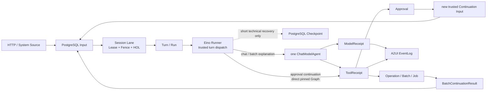
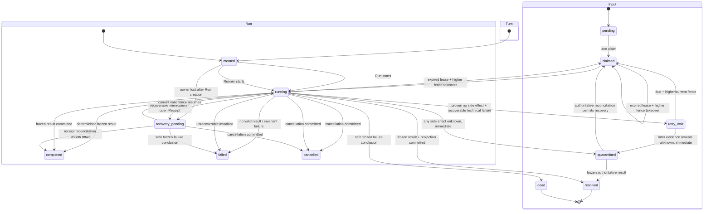
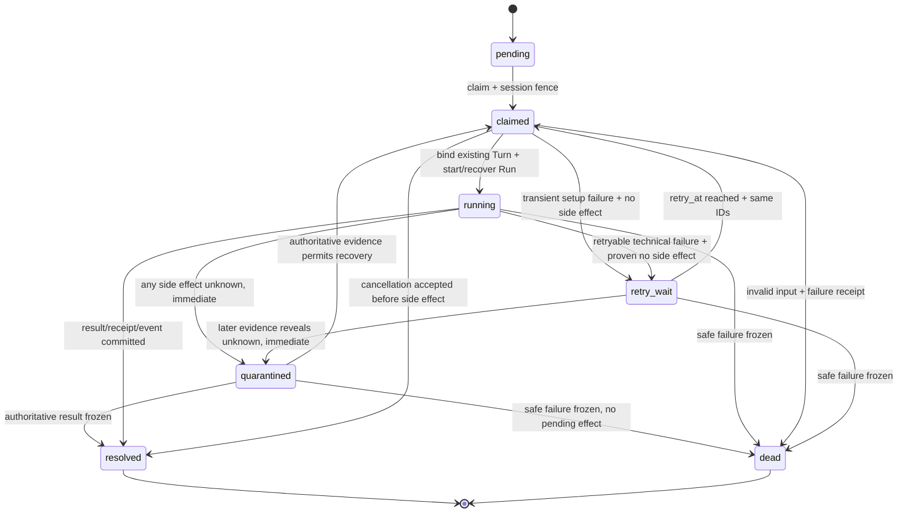
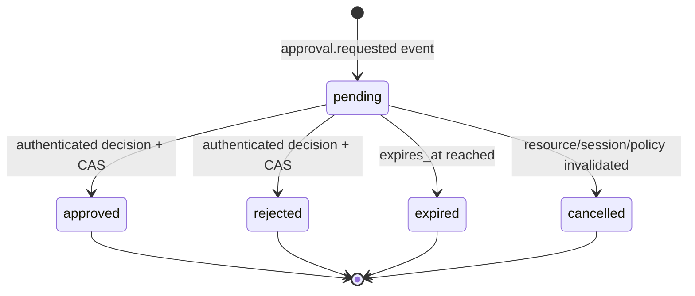

# Agent Runner 与 PostgreSQL Session Lane v1 设计评审

> 文档状态：Draft / W2-R01 已有 Agent-owned Review Ready Corpus；W2-R02 已有 Agent-owned Executable Draft；W2-R03 待评审
>
> 契约基线：`aigc.contract.v1alpha1`
>
> 设计日期：2026-07-14
>
> 适用范围：`agent/cmd/agent-service` 的单主 Agent Runner、PostgreSQL Session Lane、Input/Turn/Run、Model/Tool Receipt、Approval Continuation、Checkpoint、A2UI/Event、Budget/Cancel
>
> 实现门禁：本文未标记 Approved。评审通过前不得据此创建 Go 生产实现、SQL Migration、IDL 或前端执行契约。

## 1. 评审目标

本文冻结 Agent 通用运行契约，使六个 Agent-facing Graph Tool 能共享同一套可恢复、可审计、可重放的运行底座，并为前后端全功能冒烟提供明确的失败与恢复语义。

本文要解决：

- `GraphToolResultV1`、ToolReceipt、Approval、Operation/Batch/Job、Turn/Run 与业务资源状态互不混用；
- 一个 Session 同一时间只有一个输入取得执行权，严格 Head-of-Line（HOL），并以 PostgreSQL Lease/Fence 阻止旧进程回写；
- Input、Turn、Run、模型调用、Tool 调用、事件投影均有稳定身份和 first-write-wins 回执；
- 正式 Approval 持久化，批准后创建新的可信 Continuation Input/Turn，不长期悬挂 Graph；
- `billable_execution` Continuation 必须引用原 ToolCall 的 `parent_request_semantic_digest`，并复用其冻结 Intent、Definition/Schema、业务 `execution_digest` 和 Tool Pin；模型不得重新生成参数；
- Checkpoint 仅承担短期技术恢复，不成为 Approval、Operation、Receipt 或业务状态的权威来源；
- A2UI/Event 可持久化重放，未知组件和动作 fail closed；
- 模型、Tool、Business RPC、Provider、数据库提交响应未知时不盲重放副作用；
- 预算、取消、超时、优雅停机和租约丢失沿统一父上下文传播。

本文不负责：

- 六个 Graph Tool 的业务节点、Graph State 和领域状态机；
- Business 的创作领域表、计费表和 Asset/Binding；
- Worker 的 Provider Attempt/Upload Receipt；
- 具体 UI 布局、Provider SDK、模型、价格、超时和并发配置值；
- 在本文中批准 Eino 依赖、生成 SQL 或确定最终 IDL 字段类型。

## 2. 当前实现事实与目标形态

### 2.1 当前实现事实（2026-07-14）

| 能力 | 当前事实 | 不能据此推断的目标能力 |
|---|---|---|
| Session | 已有 W0 Session 基础 | 不代表已有可执行 Runner 或完整多轮语义 |
| `session_runtime_lease` | 表已存在，但明确是空 W0 租约骨架 | 不代表已有 Claim、Heartbeat、Fence 校验或 Recovery Scanner |
| `session_input` | Schema 有 `pending/claimed/running/retry_wait/resolved/dead` | 生产路径目前只写 `pending`，不存在状态处理器 |
| Input Source | 当前约束只允许 `user_message` | 尚无 `ApprovalContinuationResult`、`BatchContinuationResult`；`ResumeRequested` 已在 W2-R02 候选中改为绑定当前 HOL 的持久化恢复控制命令，不作为后序普通 Input |
| Turn/Run | 未实现 | 没有稳定 Turn/Run 重试或取消语义 |
| Receipt | ModelReceipt、ToolReceipt 未实现 | 不能安全宣称模型/Tool 可回放或可解决 unknown outcome |
| Approval | 未实现 | 前端确认、自然语言确认均不是正式授权 |
| Checkpoint | 未实现 | 已独立锁定 Eino 依赖，但没有 Runner 或 PostgreSQL CheckpointStore |
| A2UI | Agent 后端未实现 | 前端遗留 `/api/aigc/**` 资产没有匹配后端，不是目标契约承诺 |

### 2.2 目标形态

目标只部署一个经典 `ChatModelAgent`，由生产 Runner 驱动；所有输入先进入 PostgreSQL Session Lane，形成稳定 Input/Turn/Run，模型与 Tool 副作用先冻结 Receipt，再投影 EventLog。Approval 和异步 Operation 跨越调用生命周期，Graph/Checkpoint 不跨业务等待。



### 2.3 实现前置门禁

1. 本文与 `docs/design/cross-module/aigc-contract-catalog.md` 评审冻结；
2. 通过独立依赖 PR 精确锁定 `github.com/cloudwego/eino v0.9.10` 与已审核 Adapter，并验证 Go、Kitex/Gin/Telemetry 兼容性；业务实现 PR 不得隐式修改依赖；
3. 所有新表、字段、约束、索引采用向前 Migration，禁止回改现有 W0 Migration；
4. HTTP/SSE/Action DTO、Event Schema、受影响跨 Module 契约分别评审；
5. 前端遗留 A2UI 接口另行迁移，不通过兼容旧接口来倒推后端权威模型。

## 3. 不可变原则和状态空间分离

### 3.1 权威来源

- PostgreSQL 是 Session、Input、Turn、Run、Receipt、Approval、Checkpoint、EventLog 的唯一权威来源；
- Redis 只能做唤醒、通知、缓存和削峰，丢失后必须从 PostgreSQL 恢复；
- 模型输出、Tool 参数、A2UI Action、日志和 Checkpoint 都不能授予身份、权限、预算或 Approval；
- Business 领域资源状态只能通过 Business RPC/Event 查询，Agent 不复制其权威状态机；
- Worker Provider 状态通过版本化持久化消费契约回传，Agent 不根据 SSE 或 Redis 猜终态。

### 3.2 独立状态空间

| 对象 | 状态或阶段 | 含义 |
|---|---|---|
| `GraphToolResultV1` | `completed/accepted/waiting_user/partial/failed/cancelled` | 一次 Tool 调用对模型可见的冻结语义结果 |
| ToolReceipt | `write_state=open/frozen`，另存 `result_status` | 回执写入完整性；不是业务执行状态 |
| Approval | `pending/approved/rejected/expired/cancelled` | 授权决策历史；消费是单独事实 |
| Operation/Batch/Job | `pending/running/completed/partial_failed/failed/cancelled` 等 | 长生命周期异步执行状态 |
| Input | 当前 W0：`pending/claimed/running/retry_wait/resolved/dead`；目标候选另增 `quarantined` | `quarantined` 是阻塞 HOL 的 unknown-outcome 隔离态，需向前 Migration |
| Turn | `created/running/completed/failed/cancelled` | 一次用户或可信系统语义回合 |
| Run | `created/running/recovery_pending/completed/failed/cancelled` | Runner 的一次稳定执行实例；`recovery_pending` 表示必须恢复或核对的非终态，副作用 unknown 未消除时可与 Input `quarantined` 一同持续存在 |
| Business Resource | 各领域独立状态 | CreationSpec、Storyboard、Prompt、Asset 等业务真相 |

禁止：

- 把 `accepted` 当成 Operation 已完成；
- 把 `waiting_user` 存为长期占用 Session Lane 的 Run 状态；
- 把 `approved` 改写为 `consumed` 而丢失决策历史；
- 把 ToolReceipt `frozen` 当成 Tool 的业务成功；
- 把 Checkpoint 存在当成 Approval、计费或派发成功；
- 把 Graph Node 成功当成 Business Resource 已激活。

## 4. `GraphToolResultV1` 与 ToolReceipt

### 4.1 固定语义

`GraphToolResultV1` 是小而稳定、可机读、不可变的语义投影。大对象只返回权威 Resource 引用。每个结果必须先冻结 ToolReceipt，之后才能返回模型或投影 A2UI。

| 状态 | 必须满足 | 禁止 |
|---|---|---|
| `completed` | 本次有界工作完成；`receipt_ref`；按业务需要含 `resource_refs` | pending Approval、活动 Operation、把写入尝试当完成 |
| `accepted` | `operation_ref`；原子派发/受理回执；`receipt_ref` | 宣称最终完成、缺少 Operation、只有 Redis 消息 |
| `waiting_user` | `approval_ref`；Approval 权威状态为 `pending`；`receipt_ref` | 同时携带待执行动作的 `operation_ref`、自然语言授权 |
| `partial` | 至少一个成功 `resource_ref`；稳定 Warning/失败明细；`receipt_ref` | 没有成功结果或失败明细、用 partial 隐藏 unknown outcome |
| `failed` | 稳定 `result_code`；明确 `retryable`；`receipt_ref` | 原始栈、Provider 原始响应、把历史资源伪装为本次成功 |
| `cancelled` | 明确取消发生阶段；`receipt_ref` | 承诺退款、回滚或外部 Operation 一定已停止 |

### 4.2 固定结果向量

占位符示例已由独立 [`GraphToolResultV1 与 ToolReceipt 可执行契约 v1`](./graph-tool-result-receipt-contract-v1.md) 和共享 raw Corpus 取代。六个合法状态、一个 Unicode canonical edge 和一个已解决副作用取消向量共八个合法向量现在全部使用真实 UUIDv7、typed Warning、exact Ref、Canonical JSON 和 `dora.graph_tool_result.v1` 结果摘要；同一 Corpus 由 Go 测试消费，后续供 TS 投影测试复用。

本节不再允许“同版本增加可选字段”。`graph_tool_result.v1` 是 exact-set；新增字段、状态、枚举或参数必须升级 Schema/Registry 并重新评审。

### 4.3 非法组合

原八类候选已扩展为可执行契约中的 `GTR-N01..N40`、`TR-N01..N13` 与 `TR-E01..E13`，覆盖严格 JSON、Unicode/UUID、跨层与同层稳定错误优先级、JS safe integer、版本/字段、ResultCode/取消阶段 Registry、typed Warning、状态矩阵、pinned prepared/resolved slot 与 effect class、Fence/Version、全状态 result digest/ref evidence 和 frozen write guard。完整表见 [`graph-tool-result-receipt-contract-v1.md` 第 5 节](./graph-tool-result-receipt-contract-v1.md#5-非法组合与固定拒绝分类)。

`completed` 仍关联 pending Approval/活动 Operation、Approval 在 freeze 前失效、unknown outcome 错误终结、Result status 更新其他聚合等依赖权威状态的组合，必须在后续 Repository/PostgreSQL 集成测试拒绝，不能只靠 JSON 校验器代替。

### 4.4 ToolReceipt first-write-wins

ToolReceipt 的稳定业务键为：

```text
(session_id, turn_id, tool_call_id)
```

用户和项目由可信 Session/Turn 冻结上下文校验，不从模型输入取值。ToolReceipt 必须把请求语义和执行结果拆成两个不可互改的摘要空间。

每个外部副作用阶段还必须在调用前持久化 `execution_slot`：稳定 `ref_slot/slot_ordinal/ref_type/ref_schema_version/authority_owner/idempotency_key/request_digest/query_contract`，状态先为 `prepared`。pinned Definition 的 slot policy 还必须固定 `effect_class=side_effect/evidence_only`；失败/取消检查按该 policy 分类，不能用硬编码 ref type 猜测。只有外部响应或权威查询确认后，原 slot 才能一次性进入 `resolved` 并生成 `resolved_ref_digest`。`execution_refs` 是 resolved slot 的权威投影；不存在 prepared slot 时不得发送副作用。

reserve、resolve 和 freeze 必须在同一 Agent PostgreSQL 事务里共同锁定父 Receipt 的 `write_state=open + expected receipt_version + stored owner fence` 并令 version `+1`；命令 Fence 必须与父行精确相等，任意自行提高的 Fence 也拒绝。合法更高 Fence 接管是 W2-R02 的独立 Lease/恢复 CAS，不由普通 Receipt 命令隐式完成。同义 slot/ref 重放只读且不增版本；该父行互斥是禁止 frozen 后 late append 的必要条件。精确 Snapshot、摘要域和状态向量见 [`graph-tool-result-receipt-contract-v1.md`](./graph-tool-result-receipt-contract-v1.md)。

`request_semantic_digest` 在任何 Tool/Graph 副作用前冻结，至少覆盖：

- 规范化 Tool Intent；
- Tool Pin：`tool_key/definition_version/schema_version`；
- 可信 `user_id/project_id/session_id/turn_id/run_id`；
- 输入资源版本、内容摘要和精确目标集合；
- 请求进入前已存在的 Approval/Quote/Budget 授权引用及版本；
- 影响请求语义的 Registry/Policy/Budget 版本。

`execution_refs` 是 Receipt 处于 `open` 时的追加式阶段权威引用账本。PromptArtifact、ModelReceipt、Quote、Approval、ApprovalConsumptionReceipt、Charge、Business Write Receipt、Resource Version、Operation/Batch、Dispatch 等在执行中产生或核对出的权威引用，必须先以稳定 `ref_slot` 写入 `execution_refs`；唯一键候选为 `(tool_receipt_id, ref_slot)`。只有数据库当前有效最高 Fence owner 可以 CAS append-once：同 slot 且同 `ref_digest` 返回原引用，同 slot 但不同 digest 返回 `TOOL_EXECUTION_REF_CONFLICT`，不得覆盖、删除或换 slot 规避冲突。`execution_refs` 不进入也不重算 `request_semantic_digest`，但为恢复阶段和冻结结果提供权威证据。

`result_status/result_digest/result_refs` 只能在 `open -> frozen` 的同一次 CAS 中写入一次。`result_digest` 覆盖完整 Canonical Result：Schema、status、code、summary、retryable、Warnings、所有嵌套 Ref 和当前 ToolReceipt ID，不只覆盖状态/ref 子集；每个 `result_ref` 必须是冻结时从既有 `execution_refs` 按结果 Schema 白名单确定性投影出的逐值相等引用，允许只公开其中安全且与结果有关的子集，禁止凭内存结果、模型文本或新下游调用临时补造。`waiting_user/completed/partial` 与 `accepted` 一样必须逐值验证 evidence；`failed` 与副作用前取消必须证明 ledger 不含已提交副作用，副作用后取消则必须把全部已解决副作用 slot 作为内部 result refs exact-set；冻结后 `execution_refs` 和结果字段都不可再追加。Continuation 子 Receipt 的 `request_semantic_digest` 必须覆盖签名 Decision/Source、新 Turn/Run 因果身份及 `parent_request_semantic_digest`，因此不要求与父 Receipt 字节相等；但父 Intent、Tool Pin、Definition/Schema、业务 `execution_digest` 和资源 exact-set 必须逐值继承，不得借机改变原动作。

回执写入规则：

1. 执行前插入或锁定 `write_state=open` 的 Receipt，并不可变保存 `request_semantic_digest`、Tool Pin、原 Run/Turn 引用；此时 `execution_refs` 是非 null 空集合，`result_status/result_digest/result_refs` 均为空；
2. 执行所有副作用时使用由该 Receipt 派生的稳定幂等键；
3. 每个阶段在调用前冻结 slot/幂等身份，调用或权威查询后由当前有效 Fence 将返回的权威 Receipt/Resource append-once 写入 `execution_refs`；响应未知时不得写猜测引用；
4. 根据下游权威查询解决响应未知；任何副作用仍 unknown 时 Receipt 保持 `open`，Input 必须立即进入 `quarantined`、Run 进入或保持 `recovery_pending`；
5. 完整结果的 `result_status/result_digest/result_refs` 和审计字段一次性 CAS 为 `frozen`，其中 `result_refs` 只能投影既有 `execution_refs`，不得修改请求字段或在冻结时调用下游补引用；
6. 同稳定键、同 `request_semantic_digest` 的调用：`frozen` 直接返回已冻结结果；`open` 只恢复/核对原阶段，不能重新初始化或清空 `execution_refs`；
7. 同稳定键、不同 `request_semantic_digest` 返回 `TOOL_RECEIPT_CONFLICT`，绝不覆盖；已冻结回放还必须校验存储结果匹配 `result_digest`；
8. `open` Receipt 不允许盲目重跑，必须按 `execution_refs` 缺失的稳定 slot 查询 Model/Business/Operation/Dispatch Receipt；
9. Receipt 冻结与同数据库 EventLog/Outbox 投影尽量同事务；无法同事务时由可重放投影器读取 frozen Receipt 补投，不能再次调用模型或 Tool。

### 4.5 ToolReceipt 规范状态迁移表（六 Tool 共同引用）

六个 Graph Tool 设计必须逐行引用本表，不得各自发明 `open/frozen`、阶段引用或 unknown-outcome 语义。表中的“可重试”只指以原稳定身份进行权威查询或已证明安全的技术恢复，不允许生成新业务意图。

| Aggregate/Owner | 权威来源 | 原状态 | 触发事件 | 执行方 | Guard/动作 | 目标状态 | 终态/可重试 | 事务/幂等键 | Fence/版本/Outbox | 失败处理 |
|---|---|---|---|---|---|---|---|---|---|---|
| ToolReceipt / Agent | Agent PostgreSQL | 不存在 | 已冻结 ToolCall 或受信 Continuation 准备执行 | Runner Receipt Service | 校验可信 Session/Turn/Run、Tool Pin、Intent、预算；计算并写不可变 `request_semantic_digest`，初始化空 `execution_refs` | `open` | 非终态；仅原身份可恢复 | 插入事务；`(session_id, turn_id, tool_call_id)` first-write-wins | 当前 Session fence；receipt version=1；不发业务 Outbox | 同键同请求摘要读取原记录；异摘要 `TOOL_RECEIPT_CONFLICT`；旧 fence 拒绝 |
| ToolReceipt / Agent | Agent PostgreSQL + 下游权威 Receipt/Resource | `open` | 某执行阶段得到 PromptArtifact/Model/Quote/Approval/Consumption/Charge/Business Write/Resource/Operation/Dispatch 权威引用 | 当前有效 Fence 的 Runner 或 Recovery Owner | 预先冻结 `ref_slot`；按权威响应构造 `ref_digest`；CAS append-once，禁止修改请求字段 | `open` | 非终态；同 slot 同 digest 可重放 | `(tool_receipt_id, ref_slot)` first-write-wins；与本地阶段标记同 Agent 事务 | 当前最高 fence + expected receipt version；只写必要 Projection Marker | 同 slot 同 digest 返回原引用；异 digest `TOOL_EXECUTION_REF_CONFLICT`；响应未知不得写猜测 ref，立即隔离 Input/Run |
| ToolReceipt / Agent | Agent PostgreSQL + 权威查询契约 | `open` | 进程恢复、RPC 响应丢失或 Lease 接管 | 当前有效 Fence 的 Recovery Owner | 只读既有 `execution_refs` 和稳定幂等身份；逐 slot 查询；已提交结果按上一行 append；证明未开始才允许从安全节点继续 | `open` | 非终态；有界权威核对可重试 | 复用原业务键，不创建新 ToolReceipt/ToolCall | 更高 fence 接管须记录 recovery evidence 和 receipt CAS version；不重复 Outbox | 任一副作用仍 unknown：同一提交中 Input→`quarantined`、Run→/保持 `recovery_pending`；禁止先写 `retry_wait` |
| ToolReceipt / Agent | Agent PostgreSQL | `open` | 形成合法 `completed/partial` GraphToolResult | Runner Receipt Service | 校验全部结果引用已存在于 `execution_refs` 且逐值一致；一次写 `result_status/result_refs/result_digest` | `frozen` | 终态；只读同义重放 | `open -> frozen` CAS；原 Receipt key | 当前 fence + expected receipt version；同事务 EventLog/Projection Marker | 引用缺失/冲突不得冻结；无 unknown 且可证明安全则冻结失败结果，否则隔离 |
| ToolReceipt / Agent | Agent PostgreSQL | `open` | pending Approval 已持久化，形成合法 `waiting_user` Result | Runner Receipt Service | Approval ref 必须已 append 到 `execution_refs`；禁止同时存在待执行 Operation ref | `frozen` | 终态；只读同义重放 | `open -> frozen` CAS；原 Receipt key | 当前 fence/version；Approval/Event Projection 同事务或 Marker | Approval 非 pending、版本/摘要不符则不冻结 waiting_user；按是否存在 unknown 决定安全失败或隔离 |
| ToolReceipt / Agent | Agent PostgreSQL | `open` | Operation/Dispatch 已原子提交，形成合法 `accepted` Result | Runner Receipt Service | Operation/Batch/Dispatch refs 必须已 append 到 `execution_refs`；不得把 Redis 唤醒当证据 | `frozen` | 终态；只读同义重放 | `open -> frozen` CAS；原 Receipt key | 当前 fence/version；Dispatch Outbox 与 Operation 权威事务已可查询 | 派发未知立即隔离；只有权威查询确认提交后才冻结 accepted |
| ToolReceipt / Agent | Agent PostgreSQL | `open` | 形成确定性 `failed/cancelled` Result | Runner Receipt Service | 必须证明不存在未决/未知副作用；failed/副作用前取消要求空副作用账本，副作用后取消要求全部 resolved slot 的内部 result refs exact-set | `frozen` | 终态；只读同义重放 | `open -> frozen` CAS；原 Receipt key | 当前 fence/version；EventLog/Projection Marker | 无法证明安全终结则不得冻结 failed/cancelled，保持 open 并隔离 Input/Run |
| ToolReceipt / Agent | Agent PostgreSQL | `open` | 瞬时技术失败且权威证据证明没有副作用发送或提交 | Runner/Recovery Owner | 保存技术失败证据和 `retry_at`；不改请求、execution/result 字段 | `open` | 非终态；有界技术重试 | 原 Receipt/Run/Input 身份 | 当前 fence/version；无业务 Outbox | Input 可进 `retry_wait`、Run `recovery_pending`；若后来发现 unknown，立即转 quarantined，不等待预算耗尽 |
| ToolReceipt / Agent | Agent PostgreSQL | `frozen` | 同 key 同 `request_semantic_digest` 重放 | Query/Runner | 校验冻结结果重新计算后匹配 `result_digest`，只读返回 | `frozen` | 终态；可无限同义读取 | 原 Receipt key；不写新回执 | 不需要新 fence 写入；不得重发 Event/Outbox，投影缺失由 Marker 补投 | 摘要损坏/不一致 fail closed 并告警，不重跑 Model/Tool |
| ToolReceipt / Agent | Agent PostgreSQL | `open/frozen` | 同 key 异 `request_semantic_digest`、旧 fence 或非法状态写入 | 任意调用方 | 不执行、不覆盖、不追加 execution/result refs | 原状态 | 否 | 原唯一键和 CAS 条件 | fence/version 校验失败；不发 Outbox | 返回稳定 conflict/stale-fence，记录最小审计；若原执行仍 unknown 维持隔离 |

## 5. 持久化对象、身份和因果关系

### 5.1 对象关系

```text
Session
  └─ Input (enqueue_seq, source_type, source_id)
       ├─ deterministic projection receipt (optional)
       └─ Turn
            └─ Run
                 ├─ ModelReceipt (ordinal / attempt)
                 ├─ ToolReceipt (tool_call_id)
                 ├─ Checkpoint (short recovery only)
                 └─ EventLog (projection)
ToolReceipt
  ├─ Approval ── ApprovalConsumptionReceipt ── new Continuation Input/Turn
  └─ Operation/Batch/Job ── BatchContinuationResult Input
```

### 5.2 稳定身份

| 身份 | 生命周期 | 技术重试规则 |
|---|---|---|
| `session_id` | 完整会话 | 不变 |
| `input_id` | 一条用户或可信系统输入 | Claim/进程重启不变 |
| `source_id` | 外部请求/Approval Decision/Batch Barrier 的稳定去重键 | 同 Source 重投返回原 Input |
| `turn_id` | 一次语义回合 | 同一 Input 技术重试不新建 |
| `run_id` | 该 Turn 的 Runner 执行实例 | 短期技术恢复不新建；显式用户 Retry 才创建新 Turn/Run |
| `graph_run_id` | 一次 Tool Graph 调用 | Receipt 驱动恢复时保持原身份 |
| `tool_call_id` | 模型输出中已完全冻结的 Tool Call | 相同回放不重新编号 |
| `model_receipt_id` | 一个稳定模型调用逻辑位点 | Provider Attempt 可增加，逻辑 Receipt 不变 |

### 5.3 Input 类型

目标至少支持：

| `source_type` | 来源 | 执行方式 |
|---|---|---|
| `UserMessage` | 已认证用户 HTTP | 创建 `turn_kind=chat`，由唯一 ChatModelAgent 执行 |
| `ApprovalContinuationResult` | Agent Approval Decision/Invalidation 事务 | approve，以及必须调用 Business `Decide*(action=reject)` 的 reject，创建 `turn_kind=approval_continuation` 的受信系统 Turn/Run，由 Runner 走原 pinned Graph 的确定性分支；仅需 Agent 本地失效/投影的 reject/expire/cancel 不创建 Turn/Run；所有分支均不调用模型 |
| `BatchContinuationResult` | Agent Inbox/Batch Barrier | 默认确定性投影；仅确需语义解释时创建 `turn_kind=batch_explanation` 的新模型 Turn |

所有系统输入必须有稳定 `source_id`，并保留真实来源类型，禁止伪装成用户消息。当前 `session_input.source_type=user_message` 约束只能通过新的向前 Migration 扩展。

`ResumeRequested` v1 是绑定当前 HOL `input_id/run_id` 的持久化控制命令，不分配新的 `enqueue_seq`，也不创建第二个 Turn/Run。若把它排在原 `running/quarantined` Input 之后，会形成严格 HOL 自锁。该控制命令的 Command Receipt、权限和审计仍待生产契约评审。

### 5.4 Input → Turn → Run 候选状态机与终结映射

本文冻结候选语义，不冻结 SQL 枚举名。Input 以 W0 已声明的 `pending/claimed/running/retry_wait/resolved/dead` 为基础，并新增目标候选 `quarantined`；该状态只能由新的向前 Migration 引入。Turn 候选状态为 `created/running/completed/failed/cancelled`；Run 候选状态为 `created/running/recovery_pending/completed/failed/cancelled`。`recovery_pending/quarantined` 都不是等待 Approval 或 Operation 的业务状态：前者描述 Run 必须恢复或核对且尚不能终结，后者描述 Input 存在尚未消除的副作用未知性并持续阻塞 HOL。



对象迁移必须在一个受当前 Session Fence 保护的提交中保持下表不变量：

“需 Turn 的 Input”包括 `UserMessage`、approve 后确定性调用 pinned Graph 的 `ApprovalContinuationResult`、需要调用 Business `Decide*(action=reject)` 的 reject Continuation，以及经服务端策略判定确需语义解释的 `BatchContinuationResult`；其中只有 `turn_kind=chat/batch_explanation` 进入 ChatModelAgent，`turn_kind=approval_continuation` 绝不进入模型。仅做 Agent 本地失效/投影的 reject/expire/cancel Approval 和可直接展示的批次终态属于无 Turn 的确定性系统 Input，且不得在该无 Run 路径执行跨 Module 副作用。该分类由可信 Source 类型、Approval action type 和版本化服务端策略决定，不能由模型或前端自由字段决定。

| 触发 | Input 迁移 | Turn 迁移 | Run 迁移 | 必须同时提交的证据 |
|---|---|---|---|---|
| 需 Turn 的 Input 入队 | 新建 `pending` | 同事务新建带稳定 `turn_kind` 的 `created` | 不创建 | SourceID、enqueue_seq、可信来源摘要、稳定 TurnID、turn_kind |
| 确定性系统 Input 入队 | 新建 `pending` | 不创建 | 不创建 | SourceID、enqueue_seq、可信来源摘要、投影类型 |
| Claim 后准备执行 | `pending/retry_wait -> claimed` | 复用同一 `created/running` Turn | 新建 `created`，或复用原 `recovery_pending` Run | owner、当前 fence、冻结边界版本 |
| Runner 真正启动 | `claimed -> running` | `created -> running`，恢复时保持 `running` | `created/recovery_pending -> running` | start receipt、budget digest、当前 fence |
| Lease 到期后接管 | `claimed/running -> claimed`，仅允许接管事务使用 | 保持原 `created/running` | 已存在时 `created/running -> recovery_pending`；尚未创建则保持不存在 | 旧 Lease 已到期、单调更高 fence、`recovered_from_fence`、原 Receipt 引用 |
| `completed` 或合法 `partial` Result | `running -> resolved` | `running -> completed` | `running/recovery_pending -> completed` | frozen ToolReceipt、EventLog/Projection Marker、`resolution_code` |
| `waiting_user` Result | `running -> resolved` | `running -> completed` | `running/recovery_pending -> completed` | frozen `waiting_user` ToolReceipt、pending Approval、`resolution_code=waiting_user` |
| `accepted` Result | `running -> resolved` | `running -> completed` | `running/recovery_pending -> completed` | frozen `accepted` ToolReceipt、Operation/Dispatch Receipt、`resolution_code=accepted` |
| 确定性 `failed` Result | `running -> resolved` | `running -> completed` | `running/recovery_pending -> completed` | frozen `failed` ToolReceipt、稳定错误码；执行已确定性收口 |
| 可恢复技术失败/进程中断且已证明无未知副作用 | `claimed/running -> retry_wait` | 保持 `created/running` | `created/running -> recovery_pending` | 权威证据证明相关副作用未发送/未提交、retry_at、阶段标记、open/frozen Receipt 引用、失败预算 |
| 任一副作用 Unknown Outcome | 发现时从 `claimed/running/retry_wait` 立即原子迁移为 `quarantined` | 保持 `running` | `created/running -> recovery_pending` 或保持 `recovery_pending` | 阶段证据、下游查询身份、隔离原因、下一恢复/人工动作；不得先进入 retry_wait，持续阻塞 HOL |
| 取消已权威提交且没有未知副作用 | 先记录 cancel；非 owned 的 `pending/retry_wait` 先 cancel-specific Claim；再由 `claimed/running -> resolved` | `created/running -> cancelled` | 已创建则 `created/running/recovery_pending -> cancelled`；Claim 前取消不补造 Run | cancel command receipt/version、当前 owner/fence、阶段、冻结取消结论和 `resolution_code=cancelled` |
| 安全失败终结 | `claimed/running/retry_wait/quarantined -> dead` | `created/running -> failed` | `created/running/recovery_pending -> failed` | 已冻结 InputFailureReceipt/失败 ToolReceipt、EventLog/Projection Marker，并证明不存在未决副作用 |
| 无需模型的 Batch/拒绝/过期/取消确定性投影 | `claimed -> running -> resolved` | 不创建 | 不创建 | Projection Receipt/EventLog；不得为了文案调用模型 |

`waiting_user` 和 `accepted` 都会确定性结束当前 Graph、Run、Turn 和 Input，并释放 Lane；前者的后续因果入口是新的 `ApprovalContinuationResult` Input，后者的后续因果入口是新的 `BatchContinuationResult` Input。它们绝不能让原 Run 保持 `running/recovery_pending`。一个已经冻结的 `GraphToolResultV1{status=failed}` 同样代表 Runner 成功产生确定性结果，因此 Run/Turn 记为 `completed`。Run/Turn `failed` 和 Input `dead` 只有在失败结论已冻结、事件可投影且能证明没有未知副作用时才允许提交；否则必须留在 `recovery_pending/quarantined`，不得释放 HOL。

### 5.5 Turn 冻结边界

Turn 开始前冻结：

- 可见消息边界与消息摘要；
- 已认证用户、项目、Session 和资源访问范围；
- Prompt/Skill Published Snapshot；
- Tool Catalog/Executable Registry 版本及本 Turn Tool Pin；
- 模型路由、重试/Failover 策略、Budget/Billing 策略版本；
- 当前资源版本、Approval/Quote/Operation 引用；
- Deadline、Trace 和审计上下文。

技术重试必须复用冻结快照。配置热更新只能影响后续新 Turn，不能改变正在恢复的 Run 语义。

## 6. PostgreSQL Session Lane

### 6.1 严格 HOL

每个 Session 按持久化 `enqueue_seq` 串行处理。Claim 只能选择最小的非终态 Input；后续 Input 不能绕过 `pending/claimed/running/retry_wait/quarantined` 的头部输入。



`resolved` 表示输入已得到权威处理结论，结论可为 completed、waiting_user、accepted、failed 或 cancelled；Input 状态不复制 GraphToolResult。`dead` 是可释放 HOL 的终态，因此提交前必须已有冻结的 ToolReceipt 或 InputFailureReceipt、可重放 EventLog/Projection Marker，并证明不存在未决/未知副作用。外部副作用一旦 unknown 就必须立即进入非终态 `quarantined` 持续阻塞 HOL；自动核对预算只改变扫描退避或升级人工的时点，不能延迟隔离，更不能用 `dead` 放行后续输入。

### 6.2 Claim、Lease 与 Fence

Claim 必须在短事务内完成：

1. 锁定 Session Lane 及其最小非终态 Input；
2. 若存在未到期且不属于当前进程的 Lease，立即放弃；
3. 取得新的 Session Lease ownership epoch 时令 `fence_token` 精确 `+1`；Heartbeat 只续租并递增 Lease Version，不改变 Fence；
4. CAS Input `pending/retry_wait -> claimed`，记录 owner、fence、attempt 和 lease；cancel-requested 的非 owned Head 也先执行 cancel-specific Claim；`quarantined -> claimed` 必须有权威核对的 `effect_not_started/effect_committed` 结论，人工指令或普通 Scanner 不得自动解除隔离；
5. 提交后才在数据库事务外启动 Runner。

每一次对 Turn、Run、Receipt、Checkpoint、EventLog 和 Input 终态的写入都必须验证：

```text
session_id + input_id + lease_owner + fence_token + lease_until > database_now + expected_input_status
```

Heartbeat 只延长当前 owner/fence 的 Lease。Lease 丢失或 Heartbeat CAS 失败时，进程必须立刻取消 Runner 上下文并停止提交；即使旧模型/Tool 晚到，也只能隔离为 stale evidence，不能覆盖新 owner 的权威记录。

### 6.3 HOL、重试和恢复

- `retry_wait` 和 `quarantined` 都占据头部；`retry_wait` 只允许用于已有权威证据证明相关副作用未发送或未提交的瞬时技术失败，等待 `retry_at`/取消/安全终结；一旦任一副作用出现 unknown outcome，必须在同一状态提交中立即改为 `quarantined` 并让 Run 进入或保持 `recovery_pending`，不能先以 retry_wait 消耗预算；`quarantined` 必须等待权威核对消除未知性，不能因预算耗尽或人工超时直接转 terminal；
- Recovery Scanner 从 PostgreSQL 扫描到期 Lease、到期 retry、`recovery_pending` Run 和孤立 `open` Receipt，不依赖 Redis；Scanner 只发现候选，真正恢复前必须先取得 Session 当前有效 Lease；
- Lease 到期接管在短事务中锁定 Session/Input/Run，验证旧 Lease 已到期，递增为单调更高 Fence，将旧 owner 的 `claimed/running` Input 迁移为当前 owner 的 `claimed`；已有 Run 则 `created/running -> recovery_pending`，尚无 Run 则保持不存在并在后续正常创建。随后恢复同一个 Input/Turn/Run 和 Receipt，不创建第二套身份；
- 只有数据库中当前有效且最高 `fence_token` 的 owner 可以推进 `recovery_pending` Run 或 `open` Receipt。恢复方必须保持 Receipt key、`request_semantic_digest`、Tool Pin、Intent 和业务幂等键不可变，只追加 `recovered_from_fence/recovery_fence` 等恢复证据；
- 对 `open` Receipt，当前高 Fence owner 先按阶段 slot、`execution_refs` 和下游 Receipt 查询：若权威副作用已提交，则 append-once 记录原权威引用，再从既有 execution refs 投影结果并 `open -> frozen`，随后收口 Run/Turn/Input；若能证明副作用从未开始，则 `recovery_pending -> running` 后从原安全节点继续；若任一副作用仍是 unknown outcome，则在同一提交中保持 Receipt `open`、Run `recovery_pending` 并让 Input **立即**进入 `quarantined`，不得先进入 `retry_wait`、盲目重放或转 `dead`；若 `request_semantic_digest`/Tool Pin 冲突，只有证明副作用未开始并冻结失败结论后才能转 Run/Turn `failed`、Input `dead`，否则同样立即隔离；
- 任何旧 Fence owner 对 Input、Turn、Run、所有 Receipt（含 Model、Tool、Approval Consumption）、Checkpoint、EventLog 或 Projection Marker 的 CAS 写入都必须返回 stale-fence 冲突；晚到模型/Tool/Provider 结果只能由当前高 Fence owner 作为隔离证据核对，旧进程不得直接落权威表；
- 即使是当前高 Fence owner，也不能覆盖已经 `frozen` 的 Receipt，不能改变 `open` Receipt 的冻结输入或 `request_semantic_digest`；只能按稳定 slot append-once 写已证明的 `execution_refs`，并在所有结果证据齐全后从 execution refs 一次性投影 `result_status/result_digest/result_refs` 完成 `open -> frozen`；
- 不支持后续消息抢占当前运行输入；用户可发取消请求，但后续输入仍按顺序等待取消落为权威结论；
- 运行中的等待 Approval 会冻结 `waiting_user` Result 并将 Input/Turn/Run 终结，从而释放 Lane；Approval 决策以新 Input 重新排队；
- 长期 Operation 在 `accepted` 后释放 Lane，终态以新 Batch Continuation 输入排队；
- 当前 W0 Lease 为空骨架，以上行为全部属于目标，不得在评审前声称已实现。

### 6.4 并发 Tool Pin

用户在同一 Session 并发提交不同 Tool Pin 时，每个请求形成独立 Input 并按 `enqueue_seq` 排队。服务端必须：

- 校验 Tool Catalog 可见性与 Executable Registry 可执行性；
- 在对应 Turn 中冻结 `tool_key/definition_version/schema_version/request_semantic_digest`；
- 禁止后续 Registry 更新改写已经排队或运行的 Pin；
- 禁止模型把 Pin 替换为另一个 Tool，或通过参数覆盖版本；
- 自然语言未显式 Pin 时，也要在模型输出完全拼接后解析并冻结实际 Tool Pin，再生成 ToolReceipt。

## 7. Runner 和单主 Agent

### 7.1 运行约束

- 生产只允许由 Eino Runner 驱动一个经典 `ChatModelAgent`，消息模型固定为经典 `*schema.Message`；禁止绕过 Runner 直接调用 Agent；
- Runner 按受信 `turn_kind` 分派：`chat/batch_explanation` 才进入 ChatModelAgent；`approval_continuation` 在同一 Runner/Lane/Run 管控下直接调用已冻结 pinned Graph。HTTP、Decision Handler 和 Processor 均不得直接调用 Graph；
- 不引入 DeepAgent、Subagent、AgentAsTool、动态 Tool、Filesystem/Shell 或通用 HTTP Tool；
- 每个 Run 使用独立父 `context.WithCancel`/deadline，不复用已取消上下文；
- Runner 事件必须持续消费到终态；Streaming 输出必须完整拼接、校验和冻结后，才能解析 Tool Call 或投影前端；
- AgentEvent 先映射成 Agent 内部版本化事件，不把框架原始事件、Graph State 或 Checkpoint 暴露给前端；
- Tool、Model 和中间件共享可信 Turn Snapshot，但任何模型可控字段不能覆盖身份、权限、预算、Approval 或 Tool Pin；
- 系统 Continuation 通过类型化 Input、因果 Receipt 和系统事件进入历史，不伪造 User/Assistant Message，也不补造 Assistant ToolCall/Tool Result 配对；后续模型只读取经版本化投影生成的可见事件摘要；
- 中间件由单一 Composition Root 显式组装并做顺序测试；最低不变量是 Model Receipt 先于历史归一化、ToolCall 历史修复先于 Tool Reduction、Tool Reduction 先于 Summarization、临时 Turn Context 在 Summarization 后注入、Tool Exception 最后稳定映射错误并脱敏；
- Retry/Failover 的唯一 owner 在实现评审中固定，禁止多层同时重试。

### 7.2 推荐执行顺序

1. Lane Claim 绑定入队时已创建的稳定 Input/Turn，并创建或恢复同一 Run；
2. 冻结 Turn Snapshot 与 Budget；
3. 创建 Runner、绑定 cancel/deadline 和事件消费者；
4. `chat/batch_explanation` 分支在模型请求前创建 ModelReceipt，并完全消费、冻结模型输出；
5. `approval_continuation` 分支跳过模型，从原 ToolReceipt/Approval 读取保护输入，创建链接原 Receipt 的子 ToolReceipt；
6. 模型分支对 Tool Call 冻结 Tool Pin/Intent 并创建 ToolReceipt；Continuation 分支冻结自己的请求摘要，同时记录并校验原 `parent_request_semantic_digest`，逐值继承原 Intent、Tool Pin 和业务 `execution_digest`；
7. 执行 Graph，所有副作用按 Receipt 幂等键；
8. 冻结 GraphToolResult/ToolReceipt；
9. 将 Receipt 投影为版本化 EventLog/A2UI；
10. CAS Run、Turn、Input 终态并释放 Lease；
11. 投影或通知失败由 Scanner 重放，不再次运行 Model/Tool。

## 8. ModelReceipt

### 8.1 逻辑键和命名空间

普通 Agent 模型调用逻辑键：

```text
(turn_id, model_call_ordinal)
```

Graph 内模型调用命名空间至少包含：

```text
tool_key + graph_run_id + node_key + prompt_version + model_call_ordinal
```

每次 Provider Attempt 是逻辑 ModelReceipt 的子记录；Retry/Failover 增加 Attempt，不改变逻辑位点。

### 8.2 写入阶段

| 阶段 | 必须持久化 |
|---|---|
| 请求前 | request digest、模型路由/参数摘要、Prompt/消息边界摘要、预算快照、逻辑 ordinal |
| 已发送 | Provider、Attempt、发送时间、Provider request/idempotency 标识（若支持） |
| 流式接收 | 可恢复的块序号/摘要或受控缓冲策略；不得把未完整输出执行为 Tool Call |
| 冻结 | 完整规范化输出或受控对象引用、output digest、token/usage、finish reason、终态 |
| 投影 | EventLog cursor/revision 或可重放投影标记 |

### 8.3 Unknown outcome

- 请求未证明发送：同逻辑键按策略安全重试；
- 已发送但响应丢失：优先用 Provider request/idempotency 标识查询；
- Provider 不支持权威查询且无法证明未执行：标记 `UNKNOWN_OUTCOME`，在同一状态提交中立即将 Input 迁移为 `quarantined`、Run 迁移为或保持 `recovery_pending`，不能先进入 `retry_wait`，也不能盲目增加可能计费的请求；
- 收到部分流后中断：不得执行未完整 Tool Call；按适配器能力恢复或进入受控 Failover，必须计入同一预算与 Receipt；
- Retry/Failover 只有一个 owner，所有 Attempt 都计入调用、token、时间和费用上限。

## 9. Approval 与持久化 Continuation

### 9.1 Approval 状态机



`approval.requested` 是事件名，持久化初始状态是 `pending`。写 Consumption Receipt 不是 Approval 状态迁移；`approved` 决策历史不可被 `consumed` 覆盖。一次性 Approval 是否可再次使用，通过冻结策略和独立 Receipt 唯一约束判断。

Approval 至少冻结：

- 用户、项目、Session、原 Turn/Run/ToolReceipt/ToolCall；
- `action_type`、精确目标集合、资源 ID/version/content digest；
- Tool Pin、Intent Digest、ToolReceipt `request_semantic_digest`、Definition/Schema 版本；
- Quote/Charge 摘要、最大金额、币种或积分口径；
- 创建、到期、状态变更和失效时间；
- Approval Version、来源 Card、原 Run/Turn/ToolReceipt/ToolCall；
- 一次性/可复用策略和最大消费次数。

Decision ID/Actor/Action/Card Revision/Decision Digest 属于不可变 Decision Receipt；Expiry/Cancel owner、来源事件和幂等键属于不可变 Invalidation Receipt。Approval 聚合只保留状态、版本和这些 Receipt 的引用，不保存消费键、消费时间或消费次数。

v1 至少区分以下 Approval Action Type；具体枚举仍需跨 Module 契约评审：

| 类型 | 绑定内容 | Continuation 行为 |
|---|---|---|
| `candidate_activation` | 候选资源 ID/version/content digest、基线版本和精确目标集合 | 调用对应 `Decide*Candidate`，只能激活被冻结候选 |
| `billable_execution` | 原 ToolReceipt/ToolCall、冻结 Intent/Tool Pin、Quote/金额上限、资源与目标摘要 | 先写消费回执，再按原业务幂等身份扣费/派发，禁止模型重造参数 |
| `irreversible_resource_change` | 动作、资源版本、影响范围和回滚/无回滚说明 | 仅执行被批准的固定动作，不扩大范围 |

Approval 默认有效期为 24 小时；高风险、价格波动或短期 Quote 场景只能由版本化政策配置更短有效期。任何延长或续期都必须形成新 Approval，不能修改原 `expires_at` 延续旧签名。

#### Approval Consumption Receipt

消费时间、`consumption_key` 和已消费次数不属于 Approval 决策聚合。每次进入实际副作用边界前先写入不可变 Consumption Receipt，其稳定键为 `(approval_id, consumption_key)`，并冻结覆盖动作、目标、金额、Tool Pin 和 Intent 的 `consumption_digest`：

- 同键且同 digest：first-write-wins，返回原 Consumption Receipt；
- 同键但不同 digest：返回 `APPROVAL_CONSUMPTION_CONFLICT`，不覆盖、不执行；
- 一次性策略：除复合键外，数据库还必须限制同一 `approval_id` 最多存在一条 Consumption Receipt，调用方更换 key 不能绕过；
- 可复用策略：按 Approval 冻结的最大次数和作用域逐条 CAS 写 Receipt；次数由 Receipt 聚合查询得出，不回写 Approval 决策状态；
- 任何消费后 Approval 的决策状态仍为 `approved`，不能变为 `consumed`。

### 9.2 Approval 规范状态迁移表（六 Tool 共同引用）

#### Decision 与新 Continuation Input

`ApprovalDecisionRequestV1` 只接受 `schema_version/request_id/decision_id/approval_id/approval_version/action/card_id/card_revision`；`decision_id` 是客户端重试必须复用的稳定 UUIDv7，`action` 只允许结构化 `approve/reject`。用户、项目、资源、金额和摘要均由服务端按 Approval 查询，不接受 DTO 覆盖。

| 迁移 | 唯一 owner | 幂等键 | Continuation SourceID |
|---|---|---|---|
| `pending -> approved/rejected` | 已认证 Approval Decision Handler | `(approval_id, decision_id)`；同 decision digest 回放，异义冲突 | `approval-decision:{approval_id}:{decision_id}` |
| `pending -> expired` | Agent Approval Expiry Scanner | `(approval_id, approval_version, expires_at)` | `approval-expiry:{approval_id}:{approval_version}:{expires_at}` |
| `pending -> cancelled` | Agent Approval Invalidation Processor，来源为资源/Session/Policy 事件或受权系统命令 | `(approval_id, source_event_id)` | `approval-cancel:{approval_id}:{source_event_id}` |

每种迁移必须在一个 Agent PostgreSQL 事务中：校验 owner/用户项目范围或受信事件、CAS 当前 `pending + approval_version`、写不可变 Decision/Invalidation Receipt、以表中稳定 SourceID first-write-wins 创建 `ApprovalContinuationResult` Input、写 EventLog/Outbox 或 Projection Marker。事务响应丢失时按幂等键和 SourceID查询原 Receipt/Input；同键异义冲突，不重复状态迁移或 Input。

Expiry Scanner 只能处理 `now >= expires_at` 的 pending Approval；Invalidation Processor 必须验证来源 Event/Command 的签名、类型和资源版本。已经 `approved` 的 Approval 不通过后台任务改写为 `cancelled`；尚未消费时由 Continuation 执行前的权限、资源、价格和政策复核 fail closed，并记录执行失败证据。

过期、取消以及只需 Agent 本地失效的 reject Input 只走确定性 Event/A2UI 投影，不执行原副作用。候选资源等 Business Owner 要求落拒绝事实时，reject Input 必须创建受信系统 Turn/Run，由 Runner 进入原 pinned Graph 的确定性 reject 分支并调用对应 `Decide*(action=reject)`；只携带不可变 Decision Receipt，明确禁止创建或发送 ApprovalConsumptionReceipt。Approve Input 同样创建受信系统 Turn/Run并排在 Session Lane 尾部，由 Runner 直接进入已 pin Graph。两者都不是模型 ReAct Turn；任何 Business RPC 响应 unknown 均立即隔离 Input/Run。自然语言“确认”不能进入本状态机。

原 ToolReceipt 已以 `waiting_user` 冻结，必须保持不可变。需要执行 Owner 写入的 approve/reject 新系统 Turn 创建一个子 ToolReceipt：键为 `(session_id, continuation_turn_id, original_tool_call_id)`，并保存 `root_tool_receipt_id/original_run_id/approval_id/parent_request_semantic_digest` 因果引用；它不是新的逻辑 ToolCall。子 Receipt 自己的 `request_semantic_digest` 覆盖签名 Decision/Source、新 Turn/Run 因果身份和父摘要；父 Intent、Tool Pin、Definition/Schema、业务 `execution_digest` 及资源 exact-set 必须逐值继承。本次 Continuation 执行产生或核对出的 Decision、Consumption、Charge、Business Write、Operation、Resource 等引用先按稳定 slot append-once 写入子 Receipt 的 `execution_refs`，再在 `open -> frozen` 时确定性投影为 `result_refs/result_digest`。实际计费/派发继续使用由原逻辑 ToolCall 和原 `execution_digest` 派生的业务幂等键。这样既保留新 Turn 的独立审计和结果回执，又不会覆盖原等待审批回执或制造第二个副作用意图。

#### `billable_execution` 冻结输入不变量

批准后的新 Turn 是 `turn_kind=approval_continuation` 的受信系统因果回合，不是模型 Turn，也不运行 ReAct 重新设计原动作。Processor 仍先通过同一 PostgreSQL Lane Claim，Runner 创建稳定 Run/子 ToolReceipt、绑定 Fence/预算/取消并消费事件，然后直接调用原 ToolReceipt pin 的 Graph 入口。它不得伪造 User Message、Assistant ToolCall 或 Tool Result 历史；完成事实只通过类型化 Input、Receipt 和 EventLog 进入后续上下文。Continuation 必须包含服务端生成、调用方不可覆盖的保护输入或权威引用：

| 字段 | 约束 |
|---|---|
| `original_tool_receipt_id` | 定位原 ToolReceipt，必须属于同用户/项目/Session |
| `original_turn_id/original_run_id` | 保留因果链和审计，不从前端接受 |
| `original_tool_call_id` | 复用原稳定 ToolCall，不创建新的副作用键 |
| `parent_request_semantic_digest` | 必须等于原 Receipt 的请求摘要；子 Receipt 以它绑定原动作，但子请求摘要还包含新的 Decision/Source/Turn/Run 因果 |
| `execution_digest` | 必须继承原 ToolCall 冻结的业务执行摘要；不能由 Continuation 的新因果 ID 重算 |
| `tool_pin` | 精确 `tool_key/definition_version/schema_version`，必须等于原 Receipt |
| `intent_digest` | 等于原规范化 Intent digest |
| `protected_intent_ref` | 指向 Agent 受控、加密或最小权限存储的冻结 Intent，或指向足以无歧义重建的权威资源引用 |
| `trusted_context_digest` | 用户、项目、资源范围、Policy/Budget 快照摘要 |
| `resource_refs` | 精确 ID/version/content digest/目标集合 |
| `approval_id/version/decision_id` | 必须是已批准且当前有效的权威决策 |
| `quote_or_charge_ref` | 金额与有效期必须仍在 Approval 覆盖范围 |

Continuation 执行前必须：

1. 读取原 ToolReceipt、原 Turn Snapshot 和 Approval，不信任 Continuation Payload 的重复字段；
2. 校验所有者、项目、Session、原 Run/ToolCall、Tool Pin、Intent Digest、`parent_request_semantic_digest`、原 `execution_digest` 和资源版本；
3. 校验 Definition/Schema 仍可用；若已撤销或安全下线，fail closed 并要求新意图；
4. 校验 Approval 未过期/撤销、消费策略允许、Quote/金额仍受覆盖；
5. 使用原冻结 Intent/权威引用执行，不调用模型重生参数，不允许前端补写参数；
6. 创建或恢复链接原 Receipt 的 `open` 子 ToolReceipt，复用 `original_tool_call_id` 及原 Receipt 派生的业务幂等身份；新 Continuation Turn 只新增因果引用，不制造第二个逻辑 ToolCall 或计费/派发意图；
7. approve 在实际副作用边界用 `approval_id + consumption_key` CAS 写 Consumption Receipt，并在同一 Agent 事务把 Decision/Consumption 引用按稳定 slot append-once 写入子 Receipt `execution_refs`；reject 明确禁止写 Consumption Receipt；
8. `candidate_activation` 的 approve 调 Business `Decide*` 时必须携带并逐字段绑定不可变 Decision Receipt 与已认证 Agent 生成的 `ApprovalConsumptionReceiptV1`；reject 只携带不可变 Decision Receipt，Business 收到 Consumption Receipt 必须拒绝；
9. 同消费键且同 `consumption_digest` 重放原结果；同键异义冲突并停止。Business 响应按原幂等键查询，权威引用 append execution slot；仍 unknown 时立即隔离 Input/Run。

Continuation 继承原 ToolCall 的 Budget/Billing Policy digest 和 Approval 覆盖的费用/影响上限，并在同一因果预算账本下分配子预算；新 Turn/Run 不能重置、提高或绕过原迭代、Tool、时间、费用和异步任务上限。其 Run、Receipt、EventLog、取消和 unknown-outcome 恢复规则与普通 Runner 分支相同，只是明确没有 ModelReceipt。

日志、Event 和 A2UI 只记录必要 ID、版本和 digest，不复制保护 Intent、完整 Prompt、Token、密钥或敏感业务数据。

#### 规范 11 列状态迁移表

Approval 决策状态与消费事实严格分离。六个 Graph Tool 的 Approval 章节必须引用本表；`approve/reject` 是 Decision Action，`ApprovalConsumptionReceiptV1` 只属于 approve 进入实际副作用前的消费事实，绝不能出现在 reject 请求中。

| Aggregate/Owner | 权威来源 | 原状态 | 触发事件 | 执行方 | Guard/动作 | 目标状态 | 终态/可重试 | 事务/幂等键 | Fence/版本/Outbox | 失败处理 |
|---|---|---|---|---|---|---|---|---|---|---|
| Approval / Agent | Agent PostgreSQL + Frozen ToolReceipt | 不存在 | Graph 形成待用户结构化决策的冻结候选 | 当前有效 Fence 的 Runner/Approval Service | 校验用户/项目/Session、原 ToolReceipt、动作、资源/目标/金额摘要、期限与策略；创建不可变 Approval 和 pending Card 投影 | `pending` | 非终态；等待 Decision/失效 | ApprovalID UUIDv7；来源 `(tool_receipt_id, approval_slot)` append-once | 当前 Session fence + Approval version=1；EventLog/Projection Marker 与 Agent 事务提交 | 同来源同 digest 返回原 Approval；异 digest 冲突；创建响应 unknown 先查原 slot，不重复创建 |
| Approval / Agent | Agent PostgreSQL | `pending` | 已认证 `ApprovalDecisionRequestV1{action=approve}` | Approval Decision Handler | 校验 actor scope、card/revision、`approval_version`、未过期和 Decision digest；CAS 并写不可变 Decision Receipt/Continuation Input | `approved` | 决策终态；同义 Decision 可重放；执行尚未消费 | `(approval_id, decision_id)` first-write-wins；状态、Decision Receipt、SourceID Input 同事务 | CAS approval_version；Decision Handler 不依赖 Lane fence；写 EventLog/Outbox 或 Marker | 同键同 digest 返回原 Decision/Input；异 digest 冲突；RPC 响应 unknown 查询原 Receipt/SourceID |
| Approval / Agent | Agent PostgreSQL | `pending` | 已认证 `ApprovalDecisionRequestV1{action=reject}` | Approval Decision Handler | 同 approve 的身份/版本/Card 校验；写不可变 reject Decision Receipt 和稳定 Continuation Input；不得创建 Consumption Receipt | `rejected` | 决策终态；同义 Decision 可重放 | `(approval_id, decision_id)` first-write-wins；单 Agent 事务 | CAS approval_version；EventLog/Outbox 或 Marker | 收到/发现 Consumption Receipt 即契约冲突并停止；同键异义拒绝 |
| Approval / Agent | Agent PostgreSQL | `pending` | `now >= expires_at` | Approval Expiry Scanner | CAS 版本/期限，写不可变 Expiry Receipt 和稳定本地投影 Input | `expired` | 终态；Scanner 可同义重放 | `(approval_id, approval_version, expires_at)` | CAS approval_version；无需 Session fence 执行原动作；EventLog/Marker | 未到期、非 pending 或版本变化跳过；不消费、不执行原动作 |
| Approval / Agent | Agent PostgreSQL | `pending` | 受信资源/Session/Policy 失效事件 | Approval Invalidation Processor | 校验签名来源、类型、资源版本；CAS 并写 Invalidation Receipt/稳定 Input | `cancelled` | 终态；同来源可重放 | `(approval_id, source_event_id)` | CAS approval_version；Inbox/Outbox/Event Marker | 来源不可信、版本不符或已终态时拒绝/幂等读取；不消费原动作 |
| Approval / Agent + ConsumptionReceipt / Agent | Agent PostgreSQL | `approved` | approve Continuation 即将越过实际副作用边界 | 当前有效 Fence 的 Runner/Consumption Service | 重新查询权限、资源/目标/Quote/政策；按冻结策略写不可变 Consumption Receipt；一次性 Approval 另以 approval_id 唯一；引用 append 子 ToolReceipt execution slot | `approved` | Approval 决策保持终态；Consumption 同义可重放 | `(approval_id, consumption_key)` + `consumption_digest`；一次性另 `approval_id` 唯一 | 当前 Continuation Session fence、Approval version 和 child receipt version；不改 Approval 状态，不单独伪造 Business Outbox | 同键同 digest 返回原 Consumption；异 digest/超次数/版本变化冲突；未取得 Receipt 不得调用 approve 副作用 |
| Approval / Agent + Business Resource / Business | `approved` Approval、Decision Receipt、Consumption Receipt、Business PostgreSQL | `approved` | `Decide*Candidate(action=approve)` 或其他受批准副作用 | 当前有效 Fence 的 Runner 调已认证 Business RPC | 请求必须同时携带不可变 Decision Receipt 和已认证 Agent 生成的 `ApprovalConsumptionReceiptV1`；Business 逐字段验证 user/project/action/resource/target/version/digest/金额范围后 first-write-wins 写业务结果 | `approved` | Approval 不变；Business 结果按原键可查询 | 对应 BIZ-AIGC 幂等键 + Decision/Consumption 身份 | Agent 当前 fence 只授权 Agent 本地推进；Business 使用自身 resource version/事务/Outbox；返回 ref append child execution slot | Business 缺任一 Receipt、字段不符或已失效则失败关闭；响应 unknown 立即 Input quarantined + Run recovery_pending，按原业务键查询 |
| Approval / Agent + Business Resource / Business | `rejected` Approval、Decision Receipt、Business PostgreSQL | `rejected` | `Decide*Candidate(action=reject)` 需要持久化 Owner 拒绝事实 | 当前有效 Fence 的确定性 Continuation Runner 调已认证 Business RPC | 只携带不可变 reject Decision Receipt；Business 逐字段验证 user/project/action/resource/target/version/digest；明确拒绝任何 Consumption Receipt | `rejected` | Approval 不变；Business 拒绝结果按原键可查询 | 对应 BIZ-AIGC reject 幂等键 + Decision identity | Continuation 当前 fence；Business resource version/事务/Outbox；返回 ref append child execution slot | 出现 Consumption Receipt、字段/版本不符即失败关闭；响应 unknown 立即隔离 Input/Run，不重复拒绝写 |
| Approval / Agent | Agent PostgreSQL | `approved/rejected/expired/cancelled` | 重复 Decision、失效事件、资源/价格/策略后续变化或非法迁移 | Handler/Scanner/Runner | 同一稳定键同 digest 只读原 Receipt；禁止覆盖终态、禁止 `approved -> consumed/cancelled` | 原状态 | 终态；仅同义查询可重试 | 原 Decision/Invalidation/Consumption key | expected approval version；投影缺失只补 Event/Marker | 异义返回稳定 conflict；已批准但未消费且环境变化由 Continuation fail closed 并创建新 Approval，不改旧 digest |

### 9.3 状态变化和失效

资源版本、目标集合、价格、金额、Tool Definition/Schema、权限或政策发生语义变化时，原 Approval 不能自动迁移。处理方式是将仍 `pending` 的 Approval 转为 `cancelled` 或让已批准但未消费的执行校验失败，创建新候选/Quote/Approval。不得通过更新原 Approval digest 保留旧签名。

## 10. Checkpoint：仅短期技术恢复

### 10.1 允许用途

- 同一个稳定 Run 的进程重启、优雅停机和短暂基础设施故障恢复；
- 受控的短期 Graph Interrupt/Resume，仅限不跨越正式业务审批和长任务等待的技术点；
- 恢复同一 Graph State、Node 进度和已冻结的 Model/Tool Receipt 引用。

### 10.2 禁止用途

- 等待用户 Approval；
- 保存 Operation/Batch/Job 的权威状态；
- 替代 ToolReceipt、ModelReceipt、Business Resource 或 A2UI EventLog；
- 在 Checkpoint 中持久化 Secret、完整敏感 Prompt 或未分类原始 Provider 响应；
- Checkpoint 读取失败后直接当作全新 Run 重跑可能产生副作用的 Node。

### 10.3 契约

- 生产 CheckpointStore 必须是 PostgreSQL；内存或 Redis 只能用于测试/缓存，不能作为生产真相；
- Checkpoint 逻辑身份绑定 `session_id/input_id/turn_id/run_id/graph_run_id` 及 Graph/Node/State schema version，不把 Fence 写进不可接管的逻辑主键；每个不可变 revision 另存 `checkpoint_epoch/revision/provenance_fence/parent_revision`；
- 普通写入只允许数据库当前有效最高 Fence owner 以当前 epoch/revision CAS 追加；`provenance_fence` 记录产生该 revision 的 Fence，不授予旧 owner 后续写权限；
- 更高 Fence 接管时可只读加载同一逻辑身份下最后一个已提交的旧 Fence revision，校验 Receipt、Graph/Node/State version 和数据分类后，CAS 创建以旧 revision 为 parent、`provenance_fence=当前高 Fence` 的新 checkpoint epoch/revision；Runner 只能从这个新 epoch Resume，不能直接在旧 epoch 上续写；
- 新 epoch CAS 成功后，任何旧 Fence owner 的 Checkpoint/Receipt/Run/Event 写入都返回 stale-fence；旧 Checkpoint 保留为 provenance，不被覆盖；
- 写入、接管、读取和 Resume 都验证当前 Session Fence、所有者、Run 状态和逻辑映射 ID；
- 自定义 Graph State 使用稳定 `schema.RegisterName` 注册名和显式 schema version，升级时提供兼容解码或拒绝恢复；
- Resume 输入不能覆盖冻结身份、权限、预算、Tool Pin、Intent 或 Receipt；
- Checkpoint 与 Receipt 不原子时，恢复先查询 Receipt，已冻结 Node 不重复执行；
- terminal Run 的 Checkpoint 默认保留 7 天后清理，具体保留策略待安全/运维评审；审计 Receipt/Event 按独立保留策略；
- 解码失败、版本不兼容或 Fence 失效时 fail closed，进入人工审计或受控新 Turn，不盲重跑。

正式 Approval 的默认路径始终是结束当前 Graph，写 `waiting_user` ToolReceipt，释放 Lane，批准后创建新的 Continuation Turn。

## 11. A2UI 与 EventLog

本节只冻结 Runner 到 EventLog/A2UI 的运行边界，**不表示 W2-R08 已关闭**。独立产物 [`a2ui-event-action-contract-v1.md`](./a2ui-event-action-contract-v1.md) 已形成 Draft，仍须联合评审并至少冻结：

- 版本化 Component/Card 白名单、字段数据分类和未知组件 fail-closed 行为；
- Event、Card Revision、Action Request/Receipt DTO，以及 Approval/Operation Action 的权限和防重放；
- 统一 Error Envelope、稳定错误码、HTTP/SSE 终态映射和安全降级文案参数；
- `request_id/trace_id/input_id/turn_id/run_id/tool_receipt_id/action_receipt_id` 的关联规则；
- 前后端契约测试 Fixture、未知版本/未知 Action 负例，以及生产与冒烟禁止本地 Mock、静默回退或遗留 `/api/aigc/**` fallback 的门禁。

该独立契约 Approved 前，本文的 A2UI 测试项只是待评审要求，不能作为 W2-R08 完成证据，也不能据此开放可执行 Action。

### 11.1 权威 EventLog

Agent PostgreSQL EventLog 至少包含：

- `event_id/schema_version/session_id/seq/occurred_at/event_type`；
- `input_id/turn_id/run_id/tool_receipt_id` 等因果引用；
- Card/Component 的稳定 ID、revision 和可展示 payload；
- 投影来源 Receipt/Approval/Operation 的版本与 digest；
- 数据分类、过期/替换关系和 Trace ID。

每个 Session 的 `seq` 单调递增。SSE 使用 Cursor 重放，客户端按 Event ID 和 Card Revision 幂等应用。Redis/PubSub 只能通知“有新 Event”，断线、重复和乱序都以 PostgreSQL EventLog 为准。

### 11.2 投影规则

- Model/Tool 输出完全冻结后才能生成 A2UI；
- Receipt/Approval/Operation 状态变化与 EventLog 同 Agent DB 时同事务写入，或写 Outbox/Projection Marker 由 Scanner 补投；
- 投影失败只重放投影，不重新调用模型、Tool、Business 或 Provider；
- 前端通过查询 API 获取权威 Run/Approval/Operation 终态，不能从最后一条 SSE 猜测；
- 不向前端暴露 Eino AgentEvent、Graph State、Checkpoint、内部 Tool 参数和 Secret。

### 11.3 未知组件和动作

- 客户端遇到未知主版本、组件类型或 Action 类型必须 fail closed：不渲染为可点击授权、不提交猜测字段；
- 服务端收到未知 Action、过期 Card Revision、未知 Approval Version 或跨用户/项目引用时拒绝；
- Action 只携带稳定 Card/Approval/Operation ID 和版本，身份、权限、金额、资源摘要由服务端重新查询；
- 重复 Action 使用稳定 `action_id` 返回原结果；
- 前端遗留 `/api/aigc/**` 资产必须迁移到本契约评审后的版本化 API，不能被视为当前后端事实。

## 12. Unknown Outcome 恢复矩阵

| 边界 | 权威证据 | 恢复规则 |
|---|---|---|
| Lane Claim 提交响应丢失 | Session Lease/Fence + Input 状态 | 查询当前 owner/fence；不得用新 Input 替代 |
| Run/Turn 终态提交响应丢失 | Run/Turn/Input 行版本 | 查询后复用；旧 Fence 禁止补写 |
| 模型请求响应丢失 | ModelReceipt + Provider request/idempotency 标识 | 先查询 Provider；无法证明未执行则立即 Input→`quarantined`、Run→/保持 `recovery_pending`，不先 retry_wait、不盲重发 |
| 流式模型输出中断 | ModelReceipt chunk/attempt evidence | 未完全冻结不得执行 Tool；按唯一 Retry owner 和预算恢复 |
| Tool 调用响应丢失 | ToolReceipt `request_semantic_digest/execution_refs/result_digest/result_refs` + 下游业务 Receipt | 按原 slot/幂等键查询并 append-once 记录权威 execution ref；仍 unknown 立即隔离 Input/Run；同请求摘要恢复，不同请求摘要冲突；冻结结果只能从 execution refs 投影，请求摘要不变 |
| Business RPC 超时 | Business 权威 Receipt/Resource 版本 | 调对应 Get/Query；仍 unknown 立即隔离 Input/Run；禁止再次扣费或重复创建 |
| Approval Decision 响应丢失 | Approval Version + Decision Receipt + Continuation SourceID | 相同 Decision ID 返回原记录，不重复决策/Input |
| Approval 消费响应丢失 | ApprovalConsumptionReceipt | 查询原消费结果；仍 unknown 立即隔离 Input/Run；不把 `approved` 改为新状态 |
| Dispatch 提交响应丢失 | Operation/Dispatch Outbox/Job | 查询原 Operation/Outbox；仍 unknown 立即隔离 Input/Run；确认已提交后 Recovery Scanner 补投同一 Job，禁止新 Operation |
| Worker/Provider 响应未知 | Worker/Provider Receipt，经 Job Contract 回传 | 由 Worker 契约解决；Agent 不猜测 Provider 终态 |
| EventLog 写入/推送失败 | Frozen Receipt/Projection Marker | 重放投影；Redis 消息可丢，不重新执行业务 |
| Checkpoint 写入/读取/接管失败 | Run + Receipt + logical checkpoint ID + epoch/revision/provenance fence | 当前高 Fence 从旧 revision CAS 新 epoch 后才能 Resume；失败则 fail closed，旧 owner 禁止续写，禁止当全新 Graph 重跑 |
| Lease 丢失时晚到结果 | 更高 Session Fence | 隔离 stale evidence，不覆盖新 owner |
| Batch Continuation 重复 | Batch ID + barrier version/event ID | Inbox/SourceID 去重；确定性投影或原 Turn 复用 |

矩阵中任何边界一旦存在无法排除的外部副作用或计费未知性，必须在同一状态提交中让 Run 进入或保持 `recovery_pending`、Input **立即**进入 `quarantined` 并持续阻塞 HOL；自动核对预算只控制查询频率、退避和何时升级人工处置，不改变已经隔离的状态。只有取得权威终态，或证明副作用从未开始并冻结安全失败结论，才能离开隔离并进入 `resolved/dead` 或受控恢复。

## 13. Budget、取消、超时与停机

### 13.1 冻结预算

每个 Turn/Run 冻结 Budget Snapshot 和 digest，至少包含：

- 最大 Agent 迭代次数；
- 最大逻辑模型调用数、Provider Attempt 数、Tool 调用数；
- 输入/输出/总 Token 上限；
- 总墙钟时间、单模型/Tool/Graph deadline；
- 同步计费上限、异步 Operation/Job 上限；
- 并发上限和允许的 Retry/Failover 策略；
- 取消/超时后的安全收尾策略。

计数和费用证据随 Model/Tool Receipt 持久化。技术重试、Failover 和恢复不刷新预算；同一逻辑调用的所有 Attempt 累计计入。预算不足时在下一副作用前失败，返回稳定结果码。

### 13.2 取消

- 取消请求先持久化 `cancel_requested_at/version/reason_code`，再通知运行进程；
- Runner、模型、Tool、Graph、RPC 使用同一父 cancel/deadline；
- 外部 Provider/Business 副作用若已越过不可撤销边界，取消只能停止后续动作并等待/查询权威终态；
- `cancelled` 不承诺退款、回滚或外部任务已停止；计费与收入确认由 Business 权威规则处理；
- Input 在副作用前取消可 `resolved` 并记录取消结论；不可确定的副作用进入 Receipt 查询/恢复路径；
- Session Lease/Fence 丢失视同强制 cancel，旧 owner 不再提交；
- v1 不允许后续输入无条件抢占当前输入。

### 13.3 优雅停机

1. 停止 Claim 新 Input；
2. 继续 Heartbeat 已持有 Lease；
3. 在配置的 drain deadline 内完成安全终态或写技术 Checkpoint/Receipt；
4. 超时则取消 Runner，冻结可证明的 Receipt 状态；
5. 只释放当前 owner/fence 的 Lease；
6. 新进程以更高 Fence 恢复同一 Input/Turn/Run。

## 14. 安全、隐私与可观测性

### 14.1 安全与数据

- 保护 Intent、Prompt、模型完整输出等按数据分类存储；需要长期恢复的冻结输入采用加密、对象级权限和最小保留；
- 日志、Event、Trace、Metric 只记录稳定 ID、版本、digest、状态、耗时、计数和错误码；
- Provider/API Secret 不进入 Receipt、Checkpoint、Event、Prompt、A2UI 或普通日志；
- A2UI Action 和 Continuation 中的用户/项目/金额/摘要只作定位提示，服务端必须查询权威记录；
- 审批、消费、计费、派发、取消、Fence 拒绝和人工恢复均写不可变审计记录。

### 14.2 指标

建议指标使用有界标签，不使用 Session/User/Prompt 等高基数字段：

- Lane backlog、最老 HOL age、Claim/Lease/Fence 冲突；
- Input 各状态数量和 retry/quarantined/dead 原因、最老 quarantine age；
- Run latency、cancel、budget exhausted；
- Model/Tool Receipt open age、unknown outcome、replay/conflict；
- Approval pending/expired/decision/consumption conflict；
- Checkpoint save/load/version failure；
- Event projection lag、SSE replay、unknown A2UI version/action；
- stale fence write rejection 和 Recovery Scanner 修复数量。

## 15. 测试与全功能冒烟门禁

### 15.1 GraphToolResult/Receipt 契约测试

- [x] 八个合法向量覆盖六状态、Unicode canonical edge 与已解决副作用取消，并逐字段/摘要校验；
- [x] 测试专用 Corpus 已拒绝 `GTR-N01..N40`、`TR-N01..N13` 并执行 `TR-E01..E13`，覆盖严格 JSON、状态矩阵、Registry、slot/ref/effect class、Fence/Version、全状态 evidence、digest 和 frozen guard；依赖权威数据库状态的组合仍待 Repository 集成测试；
- [ ] 同 ToolReceipt key + 同 `request_semantic_digest` 返回字节级等价语义结果；
- [ ] 同 key + 不同 `request_semantic_digest` 返回冲突且不覆盖；
- [ ] 后生成 PromptArtifact/Model/Approval/Consumption/Quote/Charge/Business Write/Operation/Resource 先按稳定 slot append-once 写 `execution_refs`；同 slot 同 digest 重放、异 digest 冲突；不能改变请求摘要；
- [ ] `result_status/result_digest/result_refs` 只在 `open -> frozen` 一次写入，且每个 result ref 均可逐值追溯到既有 execution ref；
- [ ] 在副作用前、执行中、下游提交后、Receipt 冻结前分别注入崩溃；
- [ ] Event 投影重试不调用 Model/Tool；
- [ ] `accepted` 只能由原子派发证据产生，`waiting_user` 只能由 pending Approval 产生。

### 15.2 Session Lane 测试

W2-R02 已新增独立 [`PostgreSQL Session Lane 与 Runner Runtime 可执行契约 v1`](./session-lane-runtime-contract-v1.md)、[`Session Lane Ingress 与 Command Receipt 可执行契约 v1`](./session-lane-ingress-command-contract-v1.md) 与测试专用 Corpus：前者以 60 条向量覆盖纯状态迁移、HOL、Fence 纪元、Takeover、Effect State 防降级、绑定目标 Input/Run 与 Cancel Version 的 first-write-wins/Claim 前取消、PG Scan trigger 和 Drain Handoff 候选；后者以 42 条向量固定 `enqueue_input_v1` 的全局 CommandID、Source/Class、alias Receipt、原子创建、重放与查询候选，并以独立测试固定推进态冻结结果和损坏 Receipt fail-closed。`evidence_kind/digest` 仍只是分支夹具，Ingress 也未执行真实事务/Redis；下列清单仍按“生产 Repository/Runner/故障注入完成”口径保持未勾选，不能用纯模型冒充 PostgreSQL 集成、lost-wake 恢复或 `SMK-017` 证据。

- [ ] 同 Session 100 个并发输入只按 `enqueue_seq` 执行；
- [ ] 不同 Session 可并发且互不阻塞；
- [ ] `retry_wait/quarantined` 严格阻塞后续输入；`retry_wait` 仅用于已证明无未知副作用的瞬时技术失败，任一 unknown outcome 立即进入 `quarantined/recovery_pending`；自动核对预算耗尽只升级人工处置，不能改变隔离或转 `dead` 放行 HOL；
- [ ] Claim 提交响应丢失后查询恢复同 Input；
- [ ] Lease 过期后新 owner Fence 单调增加，旧 owner 所有写入被拒绝；
- [ ] Lease 到期接管执行 `Input running -> claimed`、`Run running -> recovery_pending`，恢复后使用原 Turn/Run/Receipt 身份；
- [ ] 当前高 Fence owner 对 open Receipt 分别覆盖“下游已提交、证明未开始、仍未知、摘要冲突”四条恢复分支；
- [ ] 旧 Fence 晚到结果不能冻结 open Receipt，当前高 Fence 也不能覆盖 frozen Receipt 或改变冻结摘要；
- [ ] Input 仅在冻结失败 Receipt/Event 投影且证明无未知副作用后进入 `dead`；否则保持 `quarantined/recovery_pending`；
- [ ] Claim、Runner 启动、模型调用、Tool 调用、终态提交各阶段进程崩溃可恢复；
- [ ] 技术重试保持 InputID/TurnID/RunID/Receipt key；
- [ ] 并发不同 Tool Pin 分别冻结且 HOL 顺序不变；
- [ ] 取消当前输入不会让后续输入在取消权威提交前越过；
- [ ] `waiting_user`/`accepted` 结束当前 Run 并释放 Lane。

### 15.3 Model/Tool/Runner 测试

- [ ] 模型 Streaming 未完全冻结前不执行 Tool Call；
- [ ] ModelReceipt logical ordinal 与 Provider Attempt 分离；
- [ ] Retry/Failover 只有一个 owner，并共享预算；
- [ ] Provider 响应未知且不可查询时 fail closed，不盲重发；
- [ ] Tool Pin、可信身份、预算、Approval 不能被模型参数覆盖；
- [ ] Runner Event 消费到终态，Stream/资源正确关闭；
- [ ] Race、超时、cancel propagation 和 goroutine 泄漏检查通过。

### 15.4 Approval/Continuation 测试

- [ ] 初始状态只能是 `pending`，`approval.requested` 只作为事件；
- [ ] approve/reject/expire/cancel 状态迁移和 CAS 正确；
- [ ] `approved` 消费后仍为 `approved`，Consumption Receipt 不可变；
- [ ] 重复 Decision ID 返回原结果；同 Consumption key + 同 digest 回放，同 key + 异义 digest 冲突；
- [ ] 一次性 Approval 即使更换 `consumption_key` 也只能产生一条 Consumption Receipt；
- [ ] 四个 `Decide*` 的 approve 请求同时携带不可变 Decision Receipt 与已认证 Agent 生成的 `ApprovalConsumptionReceiptV1`，Business 逐字段校验；任一缺失/不符失败关闭；
- [ ] 四个 `Decide*` 的 reject 请求只携带不可变 reject Decision Receipt；出现 Consumption Receipt 必须拒绝且不得消耗 Approval；
- [ ] Decision DTO 缺失/复用异义 `decision_id` 被拒绝；Decision/Expiry/Cancel 各 owner、幂等键、事务与 Continuation SourceID 逐项验证；
- [ ] 过期、跨用户、跨项目、版本冲突、Card Revision 过期全部拒绝；
- [ ] 新 Continuation Turn 能定位原 ToolReceipt/Run/Turn；
- [ ] Continuation 子 Receipt 正确绑定 `parent_request_semantic_digest`，并精确复用原 Intent Digest、Definition/Schema、Tool Pin、业务 `execution_digest` 和幂等键；新因果 ID 只改变子请求摘要，不改变原动作；
- [ ] 模型、前端和 Continuation Payload 均不能替换保护参数；
- [ ] approved Continuation 由 Runner 直接调用原 pinned Graph，不产生 ModelReceipt，不伪造 User/Assistant ToolCall/Result 历史，仍受 Lane/Fence/Budget/Cancel/Event 管控；
- [ ] 资源/价格/权限变化使原 Approval fail closed；
- [ ] 拒绝、过期、取消不执行原副作用。

### 15.5 Checkpoint 测试

- [ ] PostgreSQL CheckpointStore 在进程重启后恢复同一 Run；
- [ ] 自定义 State 注册名、schema version、兼容/拒绝路径固定；
- [ ] Fence、用户、项目、Run 不匹配时拒绝 Resume；
- [ ] 高 Fence 接管只读旧 `provenance_fence` revision，CAS 新 checkpoint epoch 后 Resume；旧 Fence 续写被拒绝且旧 revision 不被覆盖；
- [ ] Checkpoint 中不存在 Secret 和禁止持久化的数据；
- [ ] Checkpoint 丢失/损坏不会绕过 Receipt 重跑副作用；
- [ ] terminal Run 默认 7 天清理策略可配置、可观测；
- [ ] Approval/Operation 等待不依赖 Checkpoint 存活。

### 15.6 A2UI/Event、预算和取消测试

- [ ] EventLog 每 Session `seq` 单调，SSE 断线按 Cursor 重放；
- [ ] 重复 Event/Card Revision 幂等；
- [ ] Redis 通知丢失后 PostgreSQL 扫描仍可交付；
- [ ] 未知 A2UI 主版本、组件和 Action fail closed 且不可点击授权；
- [ ] Event 投影故障可从 Receipt 恢复；
- [ ] Budget 调用/token/time/charge/operation 上限在重试后不重置；
- [ ] cancel 在模型、Tool、RPC、Graph 和 graceful shutdown 各阶段传播；
- [ ] 取消不伪造退款/回滚，外部 Operation 继续按权威状态结算。

### 15.7 Migration 与集成测试

- [ ] 不修改现有 W0 Migration；所有变化以向前 Migration 实现并有 Down 风险说明；
- [ ] 从当前空 Lease、仅 pending Input 的真实数据状态升级通过；
- [ ] `source_type` 扩展、`quarantined` 非终态、Receipt 双摘要、append-only execution ref slot/result projection、Checkpoint epoch/provenance、唯一键、HOL Claim 索引、Fence CAS、保留/清理索引通过 PostgreSQL 集成测试；
- [x] 独立 Eino 依赖批已按 [`eino-dependency-lock-review-v1.md`](./eino-dependency-lock-review-v1.md) 精确锁定 Eino `v0.9.10` / DeepSeek Adapter `v0.1.6`，完成经典 Message、DAG Compile/Invoke、直接/关键传递依赖许可证和现有三 Module 构建验证；该结论不授权 Runtime；
- [x] Agent 单 Module 已在 `GOWORK=off` 下通过 test、race、vet 和 `agent-service` build，不依赖根 `go.work` 隐式解析；
- [ ] Eino Runtime 实际装配后完成 Kitex/Gin/Telemetry Callback、Trace 上下文和中间件顺序集成验证；
- [ ] 与 Business/Worker 的 Receipt、Approval、Operation/Event 契约测试通过；
- [ ] 35 条 SMK-P0 场景能够从 HTTP 输入走到 SSE/A2UI/权威查询，并覆盖重连、重放和 unknown outcome。

## 16. 评审清单与未关闭决策

### 16.1 必须确认的设计

- [ ] Agent 评审确认 GraphToolResult、ToolReceipt、Approval、Operation、Turn/Run 状态空间分离；
- [ ] Agent 评审确认严格 HOL、无无条件抢占、Lease/Fence 和旧 owner 回写隔离；
- [ ] Agent/安全评审确认冻结 Intent 的加密、访问控制、数据分类和保留期限；
- [ ] Agent/Business 评审确认 Approval Consumption Receipt 与 billable execution 的逐字段校验；
- [ ] 前端/Agent 评审确认 A2UI Schema、Action DTO、未知类型 fail-closed 和迁移策略；
- [ ] 运维评审确认 Lease TTL、Heartbeat、Recovery Scanner、Checkpoint/Event 保留和告警；
- [ ] 财务/产品评审确认 Budget、取消、失败不退款和 unknown outcome 人工处置。

### 16.2 未关闭决策

1. 新表、字段、唯一键、HOL Claim SQL、Fence CAS、分区/清理索引的精确向前 Migration；
2. W2-R01 可执行契约已达到 Agent-owned Review Ready，但仍需 Agent/Business/安全/运维/财务和跨 Module 目录审核；测试专用 DTO 不得直接转为生产 GORM/HTTP/IDL；
3. `BatchContinuationResult` 进入确定性无 Turn 投影或 `batch_explanation` 模型 Turn 的版本化服务端分类规则；
4. 各模型 Provider 的 request/idempotency 查询能力，以及不支持查询时的人工 unknown-outcome 流程；
5. `protected_intent_ref` 的存储介质、加密密钥轮换、访问审计和保留期限；
6. W2-R08 独立 [`a2ui-event-action-contract-v1.md`](./a2ui-event-action-contract-v1.md) 已产出 Draft，但 Component 白名单、Event/Action DTO、Error Envelope、RequestID-Receipt 关联、无 Mock/fallback 门禁和旧 `/api/aigc/**` 迁移窗口尚未联合 Approved；
7. Approval 类型、默认 24 小时有效期的例外、金额范围与一次性/可复用策略；
8. Lease TTL、Heartbeat 间隔、Drain deadline、Checkpoint 7 天保留的最终配置；
9. Turn/Run、Operation/Batch/Job 的最终状态表、错误码和取消映射；
10. Budget 的具体默认值、模型/Tool/Graph 分层上限和费用人工恢复授权。

## 17. 当前评审结论

当前结论：**Draft，待评审，不通过实现门禁。**

本文已经给出 W2-R01/R02/R03 的候选基线：GraphToolResult 与 Receipt/Approval/Operation 状态分离、PostgreSQL Session Lane 和严格 HOL、Model/Tool Receipt、持久化 Approval 与确定性系统 Continuation Turn、Checkpoint 短期技术恢复、EventLog 运行边界、unknown outcome、预算/取消和测试矩阵。W2-R08 的独立 A2UI 契约也已形成 Draft。但第 16.2 节决策和 A2UI 第 14 节决策均未关闭，且未完成跨 Module、前端、安全、运维和财务评审，因此不得标记 Approved，也不得创建对应 Go、SQL、IDL 或生产前端动作实现。
