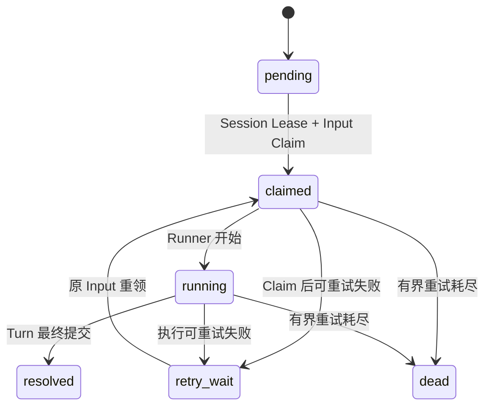

# Agent Session / Input / EventLog 基础评审包

> 文档状态：W0 冻结子集已批准；Transport/Runner 候选仍待专项评审
>
> 版本：`agent.session-event.v1alpha1`
>
> 更新日期：2026-07-14
>
> 覆盖范围：`SMK-002`、`SMK-003`、`SMK-004` 所需的 Session Bootstrap、首 Message/Input、Command Receipt、EventLog 与 SSE
>
> 实现门禁：W0 已冻结范围以 [W0 身份与工作台契约 v1](../cross-module/w0-identity-workspace-contract-v1.md) 为准，允许实现 Session/Event Migration、Domain 和 Repository；IDL/RPC、HTTP/SSE、Eino Agent、Runner、Graph Tool、A2UI 业务投影与 Worker 仍不得由本批提前实现。

## 1. 目标和结论

本评审包只解决第一条工作台纵向链路的 Agent 权威事实：

1. 接收 Business 已鉴权、已持久化的 Project 初始化命令；
2. 幂等创建一个默认 Session；
3. 非空 Prompt 原子创建一条 User Message 和一个待处理 Input；
4. 空 Prompt 不创建 Message、Input、Turn、Invocation 或费用事实；
5. 将 Session 和 Input 接受结果写入可恢复 EventLog；
6. 让前端按高水位、Cursor 和 EventLog 真源完成刷新与 SSE 重连。

W0 持久化方向已按冻结契约落地：Agent 现有 Session/空 Skill Snapshot/Message/Input/Lease/Command Receipt/EventLog 表、Ensure Service/Repository、固定摘要向量与真实 PostgreSQL 契约测试。Session RPC Server、Workspace/SSE 与 Runner 仍未实现，本评审包中超出冻结子集的内容仍是候选。

## 2. 范围与 Owner

| 事实 | Owner | 本切片处理 |
| --- | --- | --- |
| User、认证会话、Project、Project provisioning | Business | Agent 只接受可信 RPC Context，不复制 User/Project 表 |
| Session、Session Skill Snapshot、Message、Input、Command Receipt | Agent | 本文设计并由 `agent/migrations` 管理；W0 冻结显式空快照 |
| Turn、Run、Model/Tool Receipt | Agent | 只保留后续扩展边界，W0 不创建虚假 Turn/Run |
| EventLog、Session Seq、SSE Tail | Agent | 本文设计，PostgreSQL 为权威来源 |
| Storyboard、Asset | Business | SSE 只发资源刷新引用/版本，不成为业务真源 |
| Skill Snapshot、Graph Tool、Approval、Operation/Job | Agent/Business 各自 Owner | 不进入 W0 实现 |

Agent 不直连 Business 数据库，不引用 `business/internal/**`，不接受浏览器提交的 `user_id`。Business→Agent RPC 中的 User/Project Context 必须来自 Business 已认证命令，并通过服务间身份、超时和审计校验。

## 3. 场景边界

### 3.1 SMK-002：非空 Prompt

- Business 先提交 Project、幂等回执和 Outbox，再以稳定 `command_id` 调 Agent；
- Agent 在一个本地事务内创建 Session、User Message、Input、Command Receipt 和接受事件；
- 同一命令并发或重放 100 次，只返回同一 `session_id/input_id`；
- 同一 `command_id` 不同语义摘要稳定冲突；
- Redis 唤醒不是成功条件，Input 已落 PostgreSQL 才算已接受；
- W0 只保证 Input 可恢复待处理，不把尚未接入的 Runner/Turn 描述为已执行。

### 3.2 SMK-003：空 Prompt

- 创建 Session 和 Session Created Event；
- `initial_prompt` 经过 Business 和 Agent 一致的 Unicode 空白检查后视为缺失；
- 不创建 Message、Input、Turn、Run、Skill Invocation、Operation 或费用引用；
- Session 仍处于可接收未来 UserMessage 的有效状态；
- 前端静态欢迎语不写入 Message/EventLog 真源。

### 3.3 SMK-004：刷新与重连

- Agent Workspace Snapshot 返回 Chat/A2UI 高层投影和 `event_high_watermark`；
- 前端完成快照后从高水位建立 SSE，避免快照与实时连接之间出现事件缺口；
- SSE 始终先执行 `seq > cursor ORDER BY seq` 的 PostgreSQL 补读，再进入通知 + 周期 Poll；
- 重复 Event 只应用一次，旧 Session 的延迟响应不能污染新 Session；
- Storyboard/Asset 版本缺口回源 Business Read API，不用 EventLog 替代 Business 真源。

## 4. Business→Agent RPC 候选

IDL Source 由 Agent 拥有，候选位置为 `agent/api/thrift/session/v1/session.thrift`。Business 只使用生成 Client 和本 Module Mapper，不导入 Agent 内部类型。

### 4.1 `EnsureProjectSessionV1`

候选请求字段：

| 字段 | 说明 |
| --- | --- |
| `command_id` | Business Outbox 稳定 UUIDv7，同一技术重试不变 |
| `request_digest` | 规范化命令语义摘要，用于同键异义冲突 |
| `project_id` | Business Project ID，只作逻辑引用 |
| `owner_user_id` | Business 认证后的 Project Owner User ID，不接受浏览器覆盖 |
| `initial_prompt` | 可选首 Prompt；内部加密传输，禁止日志记录 |
| `prompt_digest` | Prompt 摘要，用于 Receipt 和审计，不代替原文 |
| `skill_snapshot_mode` | W0 固定为 `empty`，不能省略 Session 创建时的冻结事实 |
| `requested_at` | Business 接受时间，UTC |
| `request_id/trace_id` | 关联字段，不进入业务唯一语义 |

候选响应字段：`command_id`、`session_id`、可选 `message_id/input_id`、`result=created|replayed`、`result_version`、`accepted_at`。

Agent 必须按冻结 Canonical Schema 独立执行 Unicode 空白规范化并重算请求摘要，不能信任调用方提供的 `request_digest`。RPC Handler 只做服务间认证、DTO 校验、调用 Service 和错误映射。不得在 Handler 中直接使用 GORM、启动 Runner 或等待模型。

### 4.2 `QueryProjectSessionCommandV1`

输入稳定 `command_id`、预期 `request_digest` 和必要的可信调用方上下文，输出：

- `not_found`：Agent 权威数据库不存在已提交 Receipt；
- `completed`：返回冻结的 Session/Message/Input 结果；
- `conflict`：同 Command 的摘要不一致；
- 不返回原始 Prompt、内部错误堆栈或数据库信息。

Unknown Outcome 处理顺序固定为：查询原命令结果 → 已完成则重放 → 未找到才使用原 `command_id/request_digest` 重试 Ensure。禁止生成新 Command ID 盲重试。

## 5. 数据模型候选

### 5.1 `sessions`

关键列：`id`、`project_id`、`user_id`、`status`、`version`、`created_at`、`updated_at`、可选 `archived_at`。

- 主键为应用生成 UUIDv7；
- `project_id` 为 Business 逻辑外键，唯一约束保证 v1 一个 Project 只有一个默认 Session；
- `user_id` 只用于 Agent 授权和可信 Context，不复制 User 资料；
- Session 状态候选：`active`、`archived`；运行忙闲不压入 Session 生命周期状态。

### 5.2 `session_messages`

关键列：`id`、`session_id`、`message_seq`、`role`、`content_ciphertext/content_key_version` 或评审后的受控内容引用、`content_digest`、`source_kind`、`source_id`、`created_at`。

- Message append-only；
- W0 只允许受信 RPC 创建首个 `role=user` Message；
- 唯一 `(session_id,message_seq)` 和 `(session_id,source_kind,source_id)`；
- 完整用户正文不进入普通日志、Trace、Receipt 或 EventLog Payload。

### 5.3 `session_skill_snapshots`

关键列：`session_id`、`snapshot_kind`、`snapshot_digest`、`published_snapshot_refs`、`created_at`。

- Session 创建必须原子冻结 Skill Snapshot，不能因为 W0 未实现 Skill 就省略；
- W0 使用显式 `snapshot_kind=empty` 和稳定空集合摘要；
- 未来非空快照只能来自 Business published snapshot 契约，并通过前向 Migration/版本化 DTO 扩展；
- 已有 Session 的 Snapshot 不随后续发布变化。

### 5.4 `session_inputs`

关键列：`id`、`session_id`、`source_type`、`source_id`、`message_id`、`status`、`enqueue_seq`、`attempts`、`available_at`、`lease_owner`、`lease_until`、`fence_token`、`created_at/updated_at`。

完整目标状态候选：



W0 只创建 `pending`，不实现 Claim/Runner。完整状态统一为 `pending/claimed/running/retry_wait/resolved/dead`；取消属于独立命令/终止语义，不能随意压入未评审的 Input 状态。Session Lease/Fence 使用独立 `session_runtime_leases` 事实，至少绑定 `session_id/lease_owner/lease_until/fence_token/version`，不得只依赖 Input 行 Lease。

### 5.5 `session_command_receipts`

关键列：`command_id`、`command_type`、`request_digest`、`session_id`、可选 `message_id/input_id`、`result_version`、`completed_at`。

- `command_id` 主键，first-write-wins；
- 同键同摘要返回冻结结果，同键不同摘要返回 Conflict；
- Receipt 不保存原始 Prompt；
- Session/Message/Input 与 Receipt 在同一 Agent 事务提交。

### 5.6 Session 序号 Counter

`session_sequence_counters` 关键列：`session_id`、`last_message_seq`、`last_input_enqueue_seq`、`updated_at`。Message Seq 和 Input Enqueue Seq 分别在本地事务中锁定 Counter 后分配，保证同一 Session 并发追加仍单调且唯一。

### 5.7 `session_event_counters` 与 `session_event_log`

Counter 关键列：`session_id`、`last_seq`、`min_available_seq`、`updated_at`。`min_available_seq` 只有在归档/保留策略提交后推进，用于权威判断 Cursor 是否过期。

EventLog 关键列：`event_id`、`session_id`、`seq`、`event_type`、`schema_version`、`source_kind`、`source_id`、`projection_index`、`aggregate_type/id/version`、`payload`、`created_at`。

- 唯一 `(session_id,seq)`；
- 唯一 `(session_id,source_kind,source_id,event_type,projection_index)`，允许同一业务来源产生固定顺序的多个前端投影；
- AppendOnce 在同一事务中锁定/更新 Counter、查重 Source、分配 Seq 并插入 Event；
- 内部 Redis/进程通知不分配 Seq，只提示 Tail 有新记录；
- Payload 是严格版本化前端投影，不暴露原始 AgentEvent、Checkpoint、Graph State 或 Provider Payload。

## 6. Agent 本地事务

`EnsureProjectSessionV1` 推荐事务顺序：

1. 按 `command_id` 查询 Receipt；命中后比较 Digest 并重放或冲突；
2. 校验同 `project_id` 是否已有默认 Session；若来自相同业务语义则复用，否则冲突并审计；
3. 创建 Session 并冻结显式空 Skill Snapshot；
4. 锁定 Session Sequence Counter；非空 Prompt 分配 Message/Input Seq 并创建首 Message 和 `pending` Input，空 Prompt 跳过；
5. AppendOnce `session.created`，非空时再 AppendOnce `session.input.accepted`；
6. 写完成 Receipt；
7. 一次提交；提交后才发送 Redis/进程唤醒。

事务中禁止调用 Business RPC、Redis、模型、Runner 或外部服务。事务失败不发布通知，也不留下部分 Session/Input。

## 7. HTTP 与 SSE 候选

候选路径仍需同源 Gateway 与 API 评审：

| 能力 | 候选路径 | 结果 |
| --- | --- | --- |
| Session Metadata | `GET /api/v1/agent/sessions/{session_id}` | Session 安全 DTO、Project 引用、状态 |
| Workspace Snapshot | `GET /api/v1/agent/sessions/{session_id}/workspace` | Chat/A2UI 高层投影、`event_high_watermark` |
| Event Stream | `GET /api/v1/agent/sessions/{session_id}/events` | 按 Cursor 补读后 Tail |

原始 Cookie 只到同源 Gateway/Business Auth Resolver，不进入 Agent RPC DTO。Gateway 向 Agent 注入短期、签名、Audience/Method/Path 绑定的内部身份断言；Agent 通过受认证内部连接接收并本地校验，再检查 `principal.user_id == session.user_id`。浏览器不能直接设置可信 Header。SSE 必须按断言 TTL 有界重连/重新鉴权，退出和账号禁用的最大失效延迟需安全评审冻结。

### 7.1 Cursor

- Query `after_seq` 和合法整数 `Last-Event-ID` 同时存在时取较大值；
- 非法、负数或大于当前高水位的 Cursor 返回稳定参数错误，不静默回退；
- `a2ui.ready/stream.ready` 不设置 SSE `id`，不提前推进浏览器游标；
- 只有 EventLog 行在成功 write/flush 后才能推进连接内游标；
- 断线后客户端仍用最后确认 Seq 重连。

### 7.2 Snapshot 高水位

Snapshot 必须在可说明的一致性边界返回 `event_high_watermark`。前端加载完成后从该值连接；若加载期间已有新事件，SSE 通过 `seq > high_watermark` 补齐。

### 7.3 Cursor 过期与 Reset

在线保留窗口导致 Cursor 早于 `min_available_seq` 时，推荐发送不带 SSE `id` 的版本化 `stream.reset` 控制事件并关闭连接，字段至少包含 `reason=cursor_expired`、`snapshot_required=true`、`min_available_seq`、`latest_seq`。前端连接器收到后必须进入 terminal/reset 状态、停止当前自动重连，完成新 Snapshot 后显式创建新连接并使用新高水位。

EventSource 无法可靠读取握手响应正文，因此 401/403/404、Reset 和可重试传输失败的识别方式必须与前端实现共同评审；不得在永久错误上无限重连。

### 7.4 Tail 和慢消费者

- 每次先有界批量查询 PostgreSQL，再等待通知或周期 Poll；
- 通知丢失由 Poll 补偿；
- 单连接发送缓冲、批量大小、心跳和最长连接时间来自配置；
- 慢消费者超过预算时安全断开，客户端从最后确认 Cursor 恢复；
- Client 取消必须传播，查询和写入错误必须结束当前连接并关闭资源。

## 8. Event v1 最小集合

W0 只建议冻结：

| Event Type | 来源 | 用户可见含义 |
| --- | --- | --- |
| `session.created` | Ensure Command | 默认工作台已建立 |
| `session.input.accepted` | 非空首 Input | 用户输入已可靠持久化，等待处理 |
| `stream.ready` | 连接控制，不落 EventLog | 历史缺口已补齐，进入 Tail |
| `stream.reset` | 连接控制，不落 EventLog | Cursor 已过期，需要完整回源 |

控制事件不占 Session Seq。未来 Chat/A2UI/Storyboard/Asset/Run 事件由各 Owner 的专项契约扩展，不能用任意 Map 绕过版本和白名单。

## 9. Migration 与索引门禁

建议按稳定性拆分前向 Migration：Session/Command Receipt、Message/Input、Event Counter/Log。每张表和每列必须有中文 COMMENT，说明状态、敏感等级、逻辑外键和时间语义。

必须验证：

- Schema 为 `agent`，所有表显式限定 Schema；
- 无 `FOREIGN KEY`、`REFERENCES` 或数据库级联；
- 主键 UUIDv7，时间为 `timestamptz` UTC；
- `project_id`、`user_id`、`session_id` 等逻辑关联有匹配查询索引；
- Command、Source Key、Session Seq 有唯一约束；
- Event Tail 使用 `(session_id,seq)` 索引，无不受限扫描；
- 空库 Up、上一版本升级、Down、COMMENT、索引和并发锁测试通过；
- 启动不使用 AutoMigrate，Readiness 能识别 Schema 未就绪。

## 10. 推荐包路径与实现批次

候选功能包：

```text
agent/
├── api/thrift/session/v1/
├── internal/session/
├── internal/sessioninput/
├── internal/sessioncommand/
├── internal/sessionevent/
├── internal/authclient/
├── internal/sessionrpc/
└── internal/sessionhttp/
```

推荐顺序：

1. 冻结 RPC/HTTP/Event DTO 和错误码；
2. 评审 Migration 与状态机；
3. 实现 Entity/Repository/Service 及事务测试；
4. 实现 Agent Kitex Server、服务注册和 Business Client 契约测试；
5. 实现 Auth Resolve Client 与 Session HTTP；
6. 实现 Event Tail/SSE；
7. 接前端 Snapshot/重连；
8. 建 `SMK-002～004` API/UI Evidence。

## 11. 测试清单

### 11.1 Domain/Repository

- 非空/各种 Unicode 空白 Prompt；
- 同 Command 同摘要 100 并发只创建一个 Session/Input；
- 同 Command 异摘要冲突；
- Session/Input/Receipt/Event 原子回滚；
- Source Key 重放不分配新 Seq；
- 同 Session 并发 Append 的 Seq 唯一、连续且单调；
- PostgreSQL 真实锁、唯一约束和索引查询。

### 11.2 RPC/Auth

- Create 成功、重放、冲突、超时前后提交、Query not-found/completed；
- Business 仅按原 Command 重试；
- 无服务身份、伪造 User/Project、过期 Deadline 失败关闭；
- 身份断言有效、伪造、过期、Audience/Method/Path 不匹配、用户不匹配，以及 Gateway/Auth Resolver 不可用。

### 11.3 SSE

- Snapshot 和高水位之间追加事件不丢失；
- Last-Event-ID/after_seq、重复 Event、通知丢失、周期 Poll；
- Cursor 过期 Reset、非法 Cursor、401/403/404 永久错误；
- 慢消费者、取消、重连、旧 Session 回调隔离；
- EventLog 重放不触发模型、Tool、Provider、费用或 A2UI Action。

### 11.4 Evidence

Evidence 至少包含：同键 100 次响应、Agent 唯一 Session/Message/Input/Receipt、连续 Event Seq、SSE Timeline、断线前后 Cursor、空 Prompt 的负向表计数，以及脱敏 RequestID/TraceID。不得保存 Cookie、Prompt 正文或内部 RPC Payload。

## 12. 阻塞与主 Agent 决策

| ID | 决策/阻塞 | 推荐 | 未关闭影响 |
| --- | --- | --- | --- |
| SE-DEC-001 | QuickCreate 首次响应是否必须含 Session ID | **已关闭**：首次允许只返回 `project_id + provisioning`，ready 后由 Bootstrap 返回 Session ID | 不同步等待 Agent |
| SE-DEC-002 | RPC IDL Owner | **已关闭**：Agent owns Session IDL，Business 生成 Client | 下一批可按 Frozen 契约生成代码 |
| SE-DEC-003 | Session ID 生成 Owner | **已关闭**：Agent 生成并冻结在 Command Receipt | Business 不预写 Agent 聚合 ID |
| SE-DEC-004 | 跨库成功语义 | **已关闭**：Business 原子接受，Agent 最终恰好一次建立 Session/Input | 不存在跨 PostgreSQL 原子事务 |
| SE-BLK-001 | Gateway/Business Auth Resolver 未设计 | 同源 Gateway 解析 Opaque Cookie 并注入短期身份断言 | Agent HTTP/SSE 不能上线为匿名入口 |
| SE-BLK-002 | 首 Prompt 加密暂存、传输和清除策略未定 | **Schema 子集已关闭**：Business 加密 Outbox，Agent 使用版本化 AEAD Envelope，成功 Receipt 后清除，正文不进 Receipt/Event | 下一批实现两端 KMS/Envelope Adapter |
| SE-BLK-003 | Session/Input/Runner 完整状态机未评审 | W0 只创建最小 `pending` Input，Runner 字段后续前向迁移 | 不得把 W0 Input 宣称为已执行 Turn |
| SE-DEC-005 | Snapshot 聚合方式 | **已关闭**：前端协调 Business/Agent 两个 Read Model；暂不让 Agent 聚合 Business | 避免 Agent 变相拥有 Storyboard/Asset 真源 |
| SE-DEC-006 | Cursor 过期协议 | **已关闭**：无 ID 的 `stream.reset` + 完整 Snapshot + 新高水位 | 前端 Client 已实现终止旧流 |
| SE-BLK-004 | Event 在线保留与归档读取未定 | 以配置策略冻结最小在线 Seq 和回源能力 | 无法稳定判定 Cursor 是否过期 |
| SE-BLK-005 | W0 Event v1 Schema 尚未跨端签字 | **已关闭**：持久事件 `session.created/session.input.accepted`，控制事件 `stream.ready/stream.reset`，未知版本失败关闭 | 新事件必须走前向版本化契约 |
| SE-BLK-006 | Gateway 身份断言协议与 Key 轮换未设计 | 原始 Cookie 留在 Gateway/Business，Agent 只验短期 Audience-bound Assertion | Agent HTTP/SSE 不能开始生产实现 |

## 13. 评审结论

推荐采用“Business Project/Outbox → Agent Ensure Command → Agent 本地原子 Session/Input/Receipt/Event → PostgreSQL Cursor SSE”的链路。它能在不引入跨库事务、不依赖 Redis 权威性、也不提前实现 Eino Runner 的前提下，建立 `SMK-002～004` 的可靠底座。

当前仍是 **Draft / Review Package**。关闭第 12 节决策并完成 Business、Agent、前端、测试、安全评审前，只能继续细化契约和测试向量，不能把 Session/Event 领域能力标为已实现或可冒烟。
