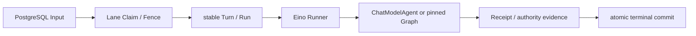

# PostgreSQL Session Lane 与 Runner Runtime 可执行契约 v1

> 文档状态：Agent-owned Executable Draft / W2-R02，未 Approved
>
> 设计日期：2026-07-14
>
> 适用范围：Agent Service 的 Session Input、Turn、Run、Lease/Fence、取消、恢复与停机边界
>
> 实现门禁：本文和 Corpus 只冻结候选语义。跨角色评审通过前，不得据此创建生产 Repository、Migration、HTTP/IDL 或宣称 `SMK-017/018` 已通过。

## 1. 目的和当前事实

本文把 [`runner-session-lane-review-v1.md`](./runner-session-lane-review-v1.md) 的 W2-R02 候选语义收敛为一个可执行的纯状态模型，先消除 Turn/Run 创建时点、HOL、Lease/Fence、Unknown Outcome、Cancel 和 Drain 的歧义，再进入 PostgreSQL Repository 设计。

截至 2026-07-14，生产事实仍是：

- `session_runtime_lease` 只是 W0 空租约骨架；
- `session_input` 生产路径只创建 `user_message/pending`，没有 Processor；
- Turn、Run、Runtime、Recovery Scanner 和 PostgreSQL CheckpointStore 尚未实现；
- Eino `v0.9.10` 已锁定，但当前只有依赖与兼容测试，没有生产 Runner 装配；
- Redis input wake、Cancel API 和 Agent drain 协议均未实现。

因此，本批新增的 Go 类型全部位于 `_test.go`，JSON 只存于 `agent/tests/contract/testdata/w2_r02`。

## 2. 本版固定决策

### 2.1 身份和创建时点

1. 需 Turn 的 Input 入队时，在同一事务创建稳定 `turn_id` 和 `Turn{status=created}`；
2. 首次成功 `claim_head` 时创建稳定 `run_id` 和 `Run{status=created}`；
3. Retry、进程重启、Takeover、Drain Handoff 和权威核对都复用原 `input_id/turn_id/run_id`；
4. 显式用户 Retry 是新业务输入，才允许创建新 Input/Turn/Run；
5. 不需 Turn 的确定性系统投影不创建 Turn/Run，也不得在该路径执行跨 Module 副作用。

`ResumeRequested` v1 不再作为排在原活动 Input 后面的普通 Session Input。它必须是绑定当前 HOL `input_id/run_id` 的持久化恢复控制命令，否则会被严格 HOL 永久挡在自己要恢复的 Input 之后。Approval 和 Batch 的后续业务事实仍以新的 `ApprovalContinuationResult/BatchContinuationResult` Input 排队。

### 2.2 严格 HOL

Head 是按 `enqueue_seq` 最小的非终态 Input：

```text
non_terminal = pending | claimed | running | retry_wait | quarantined
terminal     = resolved | dead
```

Claim 先选 Head，再判断它是否可执行；绝不从“当前可执行集合”挑一个更晚 Input。于是：

- 未到期的 `retry_wait` 返回 `head_not_due`，不跳过；
- `quarantined` 持续阻塞，只有权威核对明确得到 `effect_not_started/effect_committed` 之一才可推进；仍 unknown 或仅有人工指令都不能解除；
- cancel request 只记录意图，权威取消提交前仍阻塞后续 Input；
- Source 类型、优先级、Redis wake 顺序和进程本地 Buffer 都不能改变 `enqueue_seq` 顺序。

不同 Session 没有全局 Lane Lock，可以并发执行；同 Session 同时最多一个有效 Lease/Fence Owner。

### 2.3 Lease、Fence 与数据库时间

`session_runtime_lease` 是唯一 Lease TTL 真源。`session_input.lease_owner/fence_token` 在后续 Migration 中若保留，只表示 Claim provenance，不能独立续租或判断过期；`lease_until` 不形成第二套真源。

Fence 是所有权纪元：

| 动作 | `fence_token` | `lease.version` |
|---|---:|---:|
| 首次领取空 Lane | `+1` | `+1` |
| 当前 Owner Heartbeat | 不变 | `+1` |
| 到期 Takeover | `+1` | `+1` |
| 安全释放后领取同一或下一 Head | `+1` | `+1` |
| 普通命令自行提交更高 Fence | 拒绝 | 不变 |

所有时间条件使用同一 PostgreSQL 事务内的数据库时间：

- `lease_until <= database_now` 视为已过期；
- `available_at <= database_now` 视为 retry 已到期；
- 所有 Owner 写除了校验 owner/fence/version，还必须校验 `lease_until > database_now`；
- 旧 Lease 已到期但 Takeover 尚未发生时，旧 Owner 也无权提交。

Heartbeat 只允许当前 owner、精确 fence、精确 lease version；CAS 零行后本地立即取消 Runner，并停止所有权威写入。

### 2.4 Eino 边界



Eino Runner 只执行已经成功 Claim 的一个稳定 Run。Eino TurnLoop 的 `Push/Buffer/Preempt` 是进程内语义，不是 Session Input 真源，v1 禁止用 Preempt 实现后续输入抢占。Eino CheckPointStore 只有 `Get/Set/Delete` 能力，生产适配必须额外绑定 Session/Input/Run、owner/fence、checkpoint epoch/revision 和 provenance fence，并以 PostgreSQL CAS 保护。

### 2.5 唯一终态提交拓扑

同一 Agent PostgreSQL 事务必须完成：

1. 冻结 Result/Failure/Cancel Receipt；
2. 写不可变 Projection Marker；
3. CAS Run、Turn、Input 终态；
4. 仅由当前 owner/fence 释放 Lease。

EventLog 可在同事务直接追加，也可由 Marker 异步投影；无论哪种部署方式，Marker 都是终态事务的必备事实。投影失败只重放 Marker，禁止重新调用 Model、Tool、Business、Charge 或 Provider。

固定终结映射：

| 权威结论 | Input | Turn | Run |
|---|---|---|---|
| `completed/partial/waiting_user/accepted/failed` Tool Result | `resolved` | `completed` | `completed` |
| 已安全提交的取消 | `resolved` | `cancelled` | `cancelled` |
| Runner/协议不变量失败，且有冻结 Failure Receipt、Marker、无 unknown | `dead` | `failed` | `failed` |
| 任一副作用仍 unknown | `quarantined` | 保持 `running` | `recovery_pending` |

`waiting_user` 和 `accepted` 都结束当前 Run 并释放 Lane；后续事实通过新的 Continuation Input 进入。`GraphToolResult{status=failed}` 是一次确定性完成的 Tool 结果，不等于 Runner 崩溃。

## 3. 状态和命令 exact-set

### 3.1 状态

- Input：`pending/claimed/running/retry_wait/quarantined/resolved/dead`
- Turn：`created/running/completed/failed/cancelled`
- Run：`created/running/recovery_pending/completed/failed/cancelled`
- Processor 命令前置状态：`accepting/draining/stopped`；当前纯模型只验证命令前置条件，不证明真实 Readiness 或进程生命周期迁移
- Lease：`idle(owner=nil, until=nil)` 或 `held(owner, until)`；历史 Fence 永不归零

### 3.2 当前可执行 Corpus 命令

Corpus v1 固定以下十个状态命令：

1. `claim_head`
2. `start_run`
3. `renew_lease`
4. `mark_retry_wait`
5. `quarantine_unknown`
6. `takeover_expired_lease`
7. `record_cancel_request`
8. `commit_cancellation`
9. `finalize_result`
10. `prepare_drain_handoff`

`enqueue_input_v1` 的全局 CommandID、Source/Class 映射、原子创建、重放与查询已转入独立 [`Session Lane Ingress 与 Command Receipt 可执行契约 v1`](./session-lane-ingress-command-contract-v1.md) 和测试专用 Corpus；它不进入本状态迁移 Corpus。10 个 Lane 控制命令与 `resume_requested_v1` 的 Receipt 仍未冻结，Ingress 纯模型也不代替生产 Repository 评审。

### 3.3 错误优先级

写命令按以下优先级失败，防止不同实现对同一非法请求返回漂移结果：

1. Schema/命令字段非法；
2. 命令幂等键异义；
3. Session 和可信 Source 不合法；
4. owner/fence、lease version、数据库时间，其中 `STALE_FENCE` 先于业务状态；
5. Input version、HOL、状态、retry 到期条件；
6. Turn/Run version 和状态；
7. Receipt/Projection/Recovery Evidence；
8. Cancel/Unknown Outcome 安全性；
9. 内部不变量。

Corpus 当前固定的拒绝类为：

```text
SESSION_LANE_DRAINING
SESSION_LEASE_VERSION_CONFLICT
SESSION_INPUT_NOT_HEAD
SESSION_INPUT_STATE_CONFLICT
SESSION_LANE_HEAD_NOT_DUE
SESSION_LANE_LEASE_HELD
RECOVERY_EVIDENCE_REQUIRED
UNKNOWN_OUTCOME_UNRESOLVED
STALE_FENCE
SESSION_LEASE_EXPIRED
SESSION_INPUT_VERSION_CONFLICT
TURN_STATE_CONFLICT
RUN_STATE_CONFLICT
TERMINAL_EVIDENCE_REQUIRED
CANCEL_REQUEST_REQUIRED
CANCEL_REQUEST_CONFLICT
SESSION_LANE_INVARIANT_VIOLATION
```

这些是测试候选错误类，不是已发布 HTTP/IDL Error Registry。命名在对外契约评审时仍可升级版本，但同一 Corpus 版本内不得改义。

## 4. Claim、恢复、取消和 Drain

### 4.1 Claim

`claim_head` 在短事务中：

1. 锁 Session Lease 和最小非终态 Input；
2. 验证 Processor 正在 accepting；
3. 验证 Head 状态、retry 时间和 quarantine/handoff evidence；
4. 只有 Lane idle 或已到期才建立新 ownership epoch，Fence 精确 `+1`；
5. 将 Input 绑定 owner/fence 并增加 attempt；首次 Claim 同事务创建稳定 Run；
6. 提交后才在事务外创建 Eino Runner。

Redis wake 和 PostgreSQL Scanner 都只能触发同一个 Claim 事务。Redis 消息丢失、重复、过期或早于事务提交到达，都不能改变持久化事实。Scanner 必须在 Redis 完全不可用时仍可发现 Head；需求基线固定 Redis 恢复 `P95 ≤ 30s`，后续运维评审只冻结扫描配置和测量方法，不能放宽该 SLO。当前 Corpus 只证明 `postgres_scan` 与 `redis_wake` 共用迁移入口，没有制造 Redis 故障、执行 Scanner SQL 或证明 30 秒恢复。

### 4.2 Retry 与 Unknown Outcome

- `retry_wait` 只接受“权威证明相关副作用未发送或未提交”的 Evidence，并原子令 Run 进入 `recovery_pending` 后释放 Lease；
- 任一副作用 unknown 必须立即 `Input -> quarantined`、`Run -> recovery_pending`，然后释放 Lease；
- 扫描预算耗尽只升级人工处置，不得把 quarantine 改成 `dead` 放行 HOL；
- 恢复只能得到三种结论：`effect_committed` 则补记原 authority ref 后冻结；`effect_not_started` 才能从原安全节点恢复；仍 unknown 则继续隔离。仅有 `manual_recovery_authorization` 不得启动 Runner。

### 4.3 Takeover

Takeover 只能在数据库确认 `lease_until <= database_now` 后：

- 新 Owner 取得精确 `old_fence + 1`；
- `Input claimed/running -> claimed`；
- 已有 `Run created/running -> recovery_pending`；
- 记录 `recovered_from_fence`；
- 复用所有稳定身份、Receipt key、Tool Pin、请求摘要和业务幂等键。

旧 Owner 对 Input、Turn、Run、Model/Tool Receipt、Checkpoint、EventLog、Marker 和 Release 的写入全部返回 stale fence。当前高 Fence 也不能覆盖 frozen Receipt 或改变冻结摘要。

### 4.4 Cancel

`record_cancel_request` 是不释放 HOL 的持久化控制事实，需要稳定 command ID、request digest、目标 Input/Run 和 expected cancel/input version；同 ID/同 digest 只读回放，异 digest 冲突。Runner 看见新 cancel version 后传播同一父 context；但 Eino `CancelError/Wait` 只证明框架停止，不证明业务已安全取消。

非 owned 的 `pending/retry_wait` Head 必须先由 accepting Processor 执行 cancel-specific `claim_head`，建立当前 Lease/Fence；Claim 前尚无 Run 时不为取消补造 Run。只有当前 owner/fence、已冻结取消结论、Marker 和无 unresolved unknown 时，`commit_cancellation` 才能将 Input/Turn/Run 收口。已经发生的副作用不得伪造退款或回滚；unknown 时只记录 cancel intent，继续 quarantine。

### 4.5 Drain

1. `accepting -> draining` 后 Readiness false、停止 Claim；
2. 对已持有 Run 继续 Heartbeat 和消费 Runner Event；
3. deadline 内允许自然终结；
4. deadline 强制路径先持久化 Cancel Request，再执行 safe-point cancel，必要时升级 Immediate；deadline 前主动安全 handoff 不要求伪造 Cancel Request；
5. 只有终态已提交，或 `recovery_pending/quarantined + durable handoff receipt` 已写入，才主动释放 Lease；技术 Checkpoint 单独存在不能证明副作用安全；
6. Checkpoint 失败或 unknown 未解决时停止 Heartbeat，等待到期 Takeover，不能为“干净停机”伪造终态。

无 unknown 的 handoff 将 Input 保持为 HOL `claimed`、Run 置为 `recovery_pending`，释放 Lease 后由新 Owner 以更高 Fence 和 durable handoff evidence 继续原身份。

需求基线固定收到退出信号后 5 秒内停止接收或 Claim，Drain 最长默认 60 秒；后续只能冻结配置键、测量点和允许的更严格值，不能放宽基线。当前纯状态 Corpus 未持久化 Processor 生命周期、Readiness、deadline 或 checkpoint revision，因此不作为该 SLO 的通过证据。

## 5. Corpus 和当前证据

共享 Corpus：

- `agent/tests/contract/testdata/w2_r02/session_lane_v1.json`
- `agent/tests/contract/testdata/w2_r02/manifest.json`
- `agent/tests/contract/session_lane_v1_corpus_test.go`

Corpus Manifest 的文件摘要保留 `sha256:` 标签；`source_digest/request_digest/evidence_digest` 等 Session 业务摘要统一使用裸 64 位 lowercase hex，与现有 Agent PostgreSQL 摘要字段和 Ingress 子契约一致。

Ingress/Command Receipt 子契约使用独立 Corpus 和 Manifest，避免把入队事务与 Owner/Fence 状态迁移混成一个模型；详见 [`session-lane-ingress-command-contract-v1.md`](./session-lane-ingress-command-contract-v1.md)。

当前 60 条 exact-set 向量包含：

- 29 条正向迁移：Claim、Run Start、Heartbeat 不换 Fence、safe retry、`retry_wait -> quarantined`、`effect_not_started/effect_committed` 权威恢复、已确认 Effect 跨 Takeover 保留、Claim 后未 Start 的 Takeover、终态、下一 Head、到期 Takeover、绑定目标 Input/Run 的 Cancel first-write-wins/Claim 前取消、PG Scan trigger、draining heartbeat 和 durable handoff 候选；
- 31 条拒绝：后序越过 HOL、retry 未到期、quarantine/人工指令无权恢复、`resolved` Effect 禁止重新隔离、unknown Effect 缺权威 safe point、旧 Owner 写、cancel 尚未提交/异义重放/目标 Run 或 Cancel Version 冲突、draining/stopped 门禁、有效或仍由旧 Owner 持有的过期 Lease 竞争、精确到期拒写、Lease/Input/Turn/Run Version 冲突、Heartbeat 绑定/只延长、缺 Evidence、提前 Takeover、伪造更高 Fence 和无 cancel request。

每条带 Run 的正向摘要显式固定 `run_effect_state`；Snapshot Validator 另有跨 Input/Turn Run 引用、`retry_wait + resolved effect` 非法组合拒绝测试，避免恢复路径在错误 Run 上写入或把已确认 Effect 降级而仍然“假绿”。

Corpus 中的 `evidence_kind/evidence_digest` 只是用于固定状态分支的测试夹具判别符，不是权威 Receipt、Projection Marker、Checkpoint 或 authority ref。本批不声称摘要字符串能证明副作用安全；Repository Corpus 必须把 Evidence 绑定到 Session/Input/Run/Fence 和真实权威记录。

纯模型使用逻辑 tick；生产实现必须用 PostgreSQL 时间，不能照搬进程时钟。Corpus 固定的是迁移语义，不是 GORM Model、SQL 字段或公开 DTO。

## 6. 进入生产实现前的未关闭项

1. `enqueue_input_v1` 已有测试专用 first-write-wins 候选，但真实 Repository/并发/故障注入仍未实现；10 个 Lane 控制命令与 `resume_requested_v1` 的 Receipt、响应丢失回放仍未关闭；
2. Source/Turn kind、resolution code、Cancel reason 的最终 Registry；
3. 100 个不同 Input 的同 Session 严格顺序、跨 Session 并发和双 Processor CAS/race 测试；
4. PostgreSQL Claim/Heartbeat/Takeover/Terminal SQL、索引、前向 Migration 和真实数据库时间测试；
5. Eino Runner/Cancel/Checkpoint wrapper 的装配、事件 drain、goroutine 泄漏与旧 Fence Set/Delete 拒绝测试；
6. Redis wake envelope、Scanner SQL/周期、Readiness 与完全不可用启动策略；
7. Cancel HTTP/IDL、权限、审计、重放和多请求冲突；
8. Receipt/Marker/EventLog 的 Repository 原子性与 crash-point 故障注入；
9. SMK-017 黑盒 Evidence Schema 和脚本；
10. SMK-018 的 Worker Job Lease、Provider unknown、Upload/Finalize 属于 W3，不由 W2-R02 提前关闭。

## 7. 当前结论

本批将 W2-R02 从纯文字 Draft 推进到 **Agent-owned Executable Draft**：核心状态、Lease/Fence 纪元、严格 HOL、Takeover、Cancel first-write-wins/非抢占、PG Scan trigger 和 Drain Handoff 候选已有共享 Corpus 约束；`enqueue_input_v1` 的独立逻辑候选见 Ingress 子契约。由于权威 Evidence、Processor 生命周期与第 6 节仍未关闭，本文不是 Review Ready 或 Approved，生产 Runner/Repository/Migration 和 `SMK-017/018` 均仍未完成。
