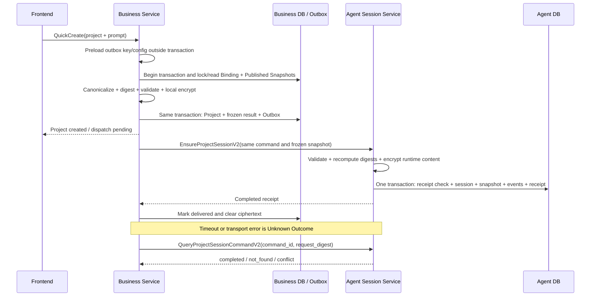

# Agent Session Skill Snapshot v2 设计评审

> 文档状态：**条件通过，可作为 W1-B1 实现基线**
>
> 评审范围：Project Session Bootstrap v2、Session Skill Snapshot 持久化、幂等与 Unknown Outcome
>
> 不在范围：Graph、Runner、Tool Executable Registry、Tool 调用、TurnLoop、HITL 生产实现
>
> 上游契约：[W1 Skill 与 Tool 入口契约 v1](../cross-module/w1-skill-tool-entry-contract-v1.md)
>
> 兼容基线：[Agent Session / Event Foundation 设计复核](./session-event-foundation-review.md)

## 1. 评审结论

W1-B1 采用“**追加 v2 RPC + 扩展 Snapshot Header + 新增 Snapshot Item 表 + V1/V2 双读写**”方案。现有 W0 的 `EnsureProjectSessionV1`、`QueryProjectSessionCommandV1`、空 Snapshot 语义和已落库数据保持不变；非空 Skill Snapshot 只允许通过 v2 写入。

本设计评审结论为条件通过。满足以下实现门禁后，可以开始 IDL、Migration、Repository、Service 和跨 Module 测试实现：

1. Business W1-A1 与 [Project Skill Binding Producer 契约](../cross-module/project-skill-binding-contract-v1.md)冻结 Published Snapshot、Project Skill Binding、Business 内部 typed `ResolveProjectSkillSnapshotsV1` 和加密 Bootstrap v2 Outbox，并与本文 Canonical Digest golden vector 对齐；W1 不注册 Agent→Business 当前态 Resolve RPC。
2. Business 与 Agent 同时采用 `session_skill_snapshot_limits.v1` 配置剖面；Business 的发送上限不得大于 Agent 的接收上限。
3. W1 的 `public_tool_refs` 必须为空；启用非空值前必须另行冻结 Public Tool 契约和安全评审。
4. 本阶段不得建立 Executable Registry，不得把 `allowed_graph_tool_keys` 当作已注册、已编译或可调用证明。

本方案没有发现阻断 W0 兼容的契约冲突。需要重点避免的实现错误是：V2 失败后降级调用 V1、重试时重新解析最新 Published Snapshot、把明文 Skill 内容写入 Business Outbox/Agent JSONB，以及把 Definition Catalog 等同 Executable Registry。

## 2. 目标与不变量

### 2.1 目标

- QuickCreate 在同一个 Business 事务中冻结 Project、Published Skill 解析结果和 Outbox 命令。
- Agent 使用一个事务原子创建 Session、Snapshot Header、Snapshot Items、可选首条 Message/Input、Event、Counter/Lease 和 Command Receipt。
- 相同 `command_id + request_digest` 可安全重放；相同 `command_id` 不同摘要稳定冲突。
- Business 在 RPC Unknown Outcome 后能够通过 Query v2 收敛，而不是创建新命令或重新解析 Skill。
- Session 后续始终读取创建时快照，不受 Draft、Published Snapshot 或 Project Binding 后续变化影响。
- W0 的空 Snapshot digest `sha256("[]")` 和空 Session 行完全兼容。

### 2.2 不变量

1. Business 是 Draft、Published Snapshot、Project Binding 和 Business Outbox 的唯一写入者。
2. Agent 是 Session Skill Snapshot Header/Item 和 Session Command Receipt 的唯一写入者。
3. 跨 Module 只传递 Thrift DTO；禁止引用其他 Module 的 `internal` 包。
4. 数据库事务内禁止 RPC、KMS、etcd、网络或文件系统 I/O。
5. Snapshot 一经创建不可更新；治理失效通过 `governance_epoch` 和后续独立治理机制处理，不回写历史 Snapshot。
6. `public_tool_refs=[]` 是 W1 的强约束，不是“暂时没有匹配项”。
7. `allowed_graph_tool_keys` 只是 Skill 能力声明的快照，不代表 Tool 已注册或可执行。

## 3. 所有权与数据流



Business Outbox 持有可重试的唯一冻结输入。Agent 已提交但响应丢失时，Receipt 是权威结果；Agent 未提交时，Business 只能重发同一 Outbox 内容，不能重新查询当前 Skill 绑定。

## 4. Thrift v2 精确建议

### 4.1 兼容策略

在 Agent-owned `agent/api/thrift/session/v1/session.thrift` 中**追加** v2 类型和方法，保留现有 package、service、V1 类型、字段号和异常结构。追加方法对新客户端可见，旧客户端不受影响；滚动发布期间旧服务端会对新方法返回 unknown method，因此 Business 启用 V2 前必须完成 Agent 全量升级和能力门禁。

现有 `SESSION_RPC_SCHEMA_VERSION="session.rpc.v1"` 与 `AGENT_SESSION_SERVICE_NAME="dora.agent.session.v1"` 保持不变；V2 通过 method 名和 request/response `schema_version` 演进，不为同一业务端口注册第二个服务名。

不要修改 V1 request 的字段 10，不要把 V1 的空 Snapshot 隐式解释成非空 Snapshot，也不要让 V2 方法在失败时自动调用 V1。

### 4.2 schema version 常量

| 语义 | 固定值 |
| --- | --- |
| Ensure v2 | `ensure_project_session.v2` |
| Query v2 | `query_project_session_command.v2` |
| Session Snapshot | `session_skill_snapshot.v1` |
| Runtime Content | `skill_runtime_content.v1` |

### 4.3 类型与字段号

以下是实现时应直接采用的字段号建议。新 struct 可以从字段 1 重新编号；不得复用或改变任何既有 V1 struct 内的字段语义。

```thrift
enum SessionSkillSnapshotKindV1 {
  EMPTY = 1,
  PUBLISHED_REFS = 2,
}

enum SkillNamespaceV1 {
  SYSTEM = 1,
  USER = 2,
}

enum SkillGuidanceApplicabilityV1 {
  ENABLED = 1,
  NOT_APPLICABLE = 2,
}

struct CapabilityGuidanceV1 {
  1: required SkillGuidanceApplicabilityV1 applicability,
  2: required string guidance,
  3: required string not_applicable_reason,
}

struct SkillExampleV1 {
  1: required string input,
  2: required string output,
}

struct SkillRuntimeContentV1 {
  1: required string schema_version,
  2: required string name,
  3: required string input_description,
  4: required string output_description,
  5: required string invocation_rules,
  6: required CapabilityGuidanceV1 plan_creation_spec,
  7: required CapabilityGuidanceV1 analyze_materials,
  8: required CapabilityGuidanceV1 plan_storyboard,
  9: required CapabilityGuidanceV1 generate_media,
  10: required CapabilityGuidanceV1 write_prompts,
  11: required CapabilityGuidanceV1 assemble_output,
  12: required list<SkillExampleV1> examples,
  13: required list<string> starter_prompts,
}

struct PublicToolSnapshotRefV1 {
  1: required string ref_id,
  2: required string ref_digest,
}

struct PublishedSkillSnapshotRefV1 {
  1: required i32 load_order,
  2: required i32 priority,
  3: required SkillNamespaceV1 namespace,
  4: required string skill_id,
  5: required string publisher_user_id,
  6: required string published_snapshot_id,
  7: required i64 publication_revision,
  8: required string definition_schema_version,
  9: required string content_digest,
  10: required string runtime_content_schema_version,
  11: required string runtime_content_digest,
  12: required SkillRuntimeContentV1 runtime_content,
  13: required list<string> allowed_graph_tool_keys,
  14: required list<PublicToolSnapshotRefV1> public_tool_refs,
  15: required string permission_snapshot_digest,
  16: required string runtime_policy_ref,
  17: required i64 governance_epoch,
  18: required i64 published_at_unix_ms,
}

struct SessionSkillSnapshotV1 {
  1: required string schema_version,
  2: required SessionSkillSnapshotKindV1 snapshot_kind,
  3: required i32 skill_count,
  4: required string snapshot_set_digest,
  5: required list<PublishedSkillSnapshotRefV1> skills,
}

struct EnsureProjectSessionRequestV2 {
  1: required string schema_version,
  2: required string request_id,
  3: required string command_id,
  4: required string request_digest,
  5: required string project_id,
  6: required string owner_user_id,
  7: required CreationSourceV1 creation_source,
  8: optional string initial_prompt,
  9: required string prompt_digest,
  10: required SessionSkillSnapshotV1 skill_snapshot,
  11: required i64 requested_at_unix_ms,
}

struct ProjectSessionReceiptV2 {
  1: required string command_id,
  2: required string session_id,
  3: optional string message_id,
  4: optional string input_id,
  5: required i32 result_version,
  6: required i64 completed_at_unix_ms,
  7: required string skill_snapshot_digest,
  8: required i32 skill_count,
}

struct EnsureProjectSessionResponseV2 {
  1: required string schema_version,
  2: required string request_id,
  3: required EnsureDispositionV1 disposition,
  4: required ProjectSessionReceiptV2 receipt,
}

struct QueryProjectSessionCommandRequestV2 {
  1: required string schema_version,
  2: required string request_id,
  3: required string command_id,
  4: required string expected_request_digest,
}

struct QueryProjectSessionCommandResponseV2 {
  1: required string schema_version,
  2: required string request_id,
  3: required QueryProjectSessionCommandStatusV1 status,
  4: optional ProjectSessionReceiptV2 receipt,
}

service AgentSessionServiceV1 {
  // Existing V1 methods remain byte-for-byte unchanged.
  EnsureProjectSessionResponseV2 EnsureProjectSessionV2(
    1: EnsureProjectSessionRequestV2 request,
  ) throws (1: SessionServiceExceptionV1 service_error),

  QueryProjectSessionCommandResponseV2 QueryProjectSessionCommandV2(
    1: QueryProjectSessionCommandRequestV2 request,
  ) throws (1: SessionServiceExceptionV1 service_error),
}
```

如果 Thrift 编译器不允许在文档片段中二次声明同名 service，实际 IDL 应把两个 V2 方法追加到现有 `AgentSessionServiceV1` service block，而不是创建第二个同名 service。

### 4.4 字段校验

- 所有 ID 使用小写、连字符齐全的规范 UUIDv7 字符串；禁止空白和 nil UUID。
- `skill_count == len(skills)`。
- `EMPTY` 当且仅当 `skill_count=0`、`skills=[]` 且 digest 为 `sha256("[]")`。
- `PUBLISHED_REFS` 当且仅当 `skill_count>0`。
- `load_order` 必须是无重复的稠密序列 `1..skill_count`；wire 顺序必须按 `load_order ASC, skill_id ASC`。
- `priority >= 0`；优先级和最终 `load_order` 的业务决策属于 Business，Agent 不重新排序。
- `runtime_content.schema_version == runtime_content_schema_version == "skill_runtime_content.v1"`。
- Agent 必须重算 `runtime_content_digest` 和 `snapshot_set_digest`。`content_digest` 与 `permission_snapshot_digest` 是 Business-owned 不透明摘要，Agent 校验格式并把它们纳入 set digest，但不尝试从 Runtime 子集反推完整 Definition。
- `runtime_content.name` 是上游冻结列表中的 `display_name` 投影，值来源于 Published `SkillDefinitionV1.name`；它不是第二个可独立编辑的名称字段。
- `allowed_graph_tool_keys` 无重复，只能取冻结的六个 Graph Tool key，并与 `ENABLED` guidance 集合严格一致。
- W1 中 `public_tool_refs` 必须为非 nil 空列表。
- `request_digest` 不包含 `request_id`、`command_id`、`requested_at_unix_ms` 或明文 prompt；它表达业务语义，而不是某次传输。
- `request_id` 仅用于一次调用追踪，重试可变化；`command_id` 和 `request_digest` 必须保持不变。

V2 推荐错误码至少包括：`INVALID_ARGUMENT`、`COMMAND_CONFLICT`、`COMMAND_VERSION_CONFLICT`、`PROJECT_SESSION_CONFLICT`、`SNAPSHOT_DIGEST_MISMATCH`、`SNAPSHOT_LIMIT_EXCEEDED`、`CONTENT_PROTECTION_UNAVAILABLE` 和 `PERSISTENCE_UNAVAILABLE`。沿用现有稳定异常 envelope，不把数据库错误或密钥信息透出边界。

## 5. Canonical Digest

### 5.1 通用编码规则

所有摘要均为小写 64 位十六进制 SHA-256。Canonical 字节规则如下：

1. 字符串先转 UTF-8 NFC；只有上游字段契约明确要求时才 trim，不能在 Business 与 Agent 两边各自猜测 trim 规则。
2. UUID 输出规范小写字符串；枚举输出本文定义的小写 token，不输出 Thrift 数值。
3. 使用无 BOM、无缩进、无空格、无换行的 compact JSON；禁止 HTML escape。
4. 对象字段严格按本文给定顺序输出；不能通过 Go `map` 序列化。
5. 数字只允许十进制整数；布尔为 `true/false`；禁止浮点、科学计数、`null` 数组和省略字段。
6. `examples` 按 Business W1-A1 的 `input ASC, output ASC` Canonical 顺序，`starter_prompts` 按 UTF-8 字节序升序；`allowed_graph_tool_keys` 保留冻结产品顺序；`public_tool_refs` 在未来启用时按 `ref_id ASC, ref_digest ASC` 排序。Agent 不得在收到 Published Snapshot 后重新采用另一套排序规则。
7. `skills` 必须在 Business 完成解析并分配稠密 `load_order` 后，按 `load_order ASC, skill_id ASC` 输出。Agent 只验证，不改变顺序。
8. 禁止对 Thrift binary、Protobuf bytes、JSONB 原始文本、密文或数据库行直接求语义摘要。

### 5.2 Runtime Content digest 字段顺序

`runtime_content_digest` 对下列对象求 SHA-256，字段顺序固定：

```text
schema_version
name
input_description
output_description
invocation_rules
plan_creation_spec
analyze_materials
plan_storyboard
generate_media
write_prompts
assemble_output
examples
starter_prompts
```

每个 Capability Guidance 对象固定为 `applicability, guidance, not_applicable_reason`；每个 Example 固定为 `input, output`。`ENABLED` 要求 guidance 非空且 reason 为空；`NOT_APPLICABLE` 要求 guidance 为空且 reason 非空。

### 5.3 Snapshot set digest 字段顺序

`snapshot_set_digest` 不包含 Runtime 明文，避免摘要输入重复且便于跨服务独立验证。对按稳定顺序排列的 item metadata 数组求 SHA-256；每个对象字段顺序固定为：

```text
load_order
priority
namespace
skill_id
publisher_user_id
published_snapshot_id
publication_revision
definition_schema_version
content_digest
runtime_content_schema_version
runtime_content_digest
allowed_graph_tool_keys
public_tool_refs
permission_snapshot_digest
runtime_policy_ref
governance_epoch
published_at_unix_ms
```

空集合的 canonical bytes 永远是两个字节 `[]`，因此继续使用 W0 已冻结的 digest：

```text
4f53cda18c2baa0c0354bb5f9a3ecbe5ed12ab4d8e11ba873c2f11161202b945
```

### 5.4 Ensure v2 request digest 字段顺序

`request_digest` 对以下对象求 SHA-256，字段顺序固定：

```text
schema_version
project_id
owner_user_id
creation_source
prompt_present
prompt_digest
skill_snapshot_schema_version
skill_snapshot_kind
skill_count
skill_snapshot_digest
```

`prompt_digest` 继续沿用 W0 规则：缺少 prompt 或 NFC 后为纯 Unicode 空白时，`prompt_present=false` 且 digest 为**空字符串**；存在非空 prompt 时，对 NFC 后、保留边界空格的 UTF-8 字节求 SHA-256。空字符串和纯空白输入均折叠为 absent，不存在单独的 present-but-empty 语义。

## 6. Golden vectors

### 6.1 Fixture

公共 fixture：

```text
project_id       = 019f0000-0000-7000-8000-0000000000ab
owner_user_id    = 019f0000-0000-7000-8000-0000000000cd
creation_source  = quick_create
prompt raw       = " e\u0301 "
prompt NFC       = " é "
prompt_digest    = 273f7787225c057d3b40cecfdad67cefd35e4b0fa95eacff5668011fc44497df
```

非空 fixture 的两个 Business-owned 摘要由固定 ASCII fixture 生成：

```text
sha256("skill-definition-v1-fixture")
  = dc18b1bbe2824f462cbef7373e48074d609cdd4d57897dd87e1b26c85b96d513
sha256("permission-fixture")
  = 3317ba4d31b6b64d9c9248495a225da4ca1c4bd738cb403289d9108fe05d9d25
```

### 6.2 Runtime Content vector

Canonical JSON，末尾无换行：

```json
{"schema_version":"skill_runtime_content.v1","name":"Prompt helper","input_description":"text","output_description":"prompt","invocation_rules":"Use for prompt writing.","plan_creation_spec":{"applicability":"not_applicable","guidance":"","not_applicable_reason":"not used"},"analyze_materials":{"applicability":"not_applicable","guidance":"","not_applicable_reason":"not used"},"plan_storyboard":{"applicability":"not_applicable","guidance":"","not_applicable_reason":"not used"},"generate_media":{"applicability":"not_applicable","guidance":"","not_applicable_reason":"not used"},"write_prompts":{"applicability":"enabled","guidance":"Write concise prompts.","not_applicable_reason":""},"assemble_output":{"applicability":"not_applicable","guidance":"","not_applicable_reason":"not used"},"examples":[],"starter_prompts":["Improve this prompt."]}
```

```text
runtime_content_digest
  = d81700e078c331dc271db6d9c7c169f75f48f9fd89f944671883316044594168
```

### 6.3 Non-empty Snapshot vector

Canonical metadata array，末尾无换行：

```json
[{"load_order":1,"priority":100,"namespace":"user","skill_id":"019f0000-0000-7000-8000-000000000101","publisher_user_id":"019f0000-0000-7000-8000-000000000102","published_snapshot_id":"019f0000-0000-7000-8000-000000000103","publication_revision":2,"definition_schema_version":"skill_definition.v1","content_digest":"dc18b1bbe2824f462cbef7373e48074d609cdd4d57897dd87e1b26c85b96d513","runtime_content_schema_version":"skill_runtime_content.v1","runtime_content_digest":"d81700e078c331dc271db6d9c7c169f75f48f9fd89f944671883316044594168","allowed_graph_tool_keys":["write_prompts"],"public_tool_refs":[],"permission_snapshot_digest":"3317ba4d31b6b64d9c9248495a225da4ca1c4bd738cb403289d9108fe05d9d25","runtime_policy_ref":"skill-runtime-policy:v1","governance_epoch":3,"published_at_unix_ms":1784011500123}]
```

```text
snapshot_set_digest
  = 69ef1ba7ca41c90986204308043cb4587097ce3d4edbcea921b00eafc7cdfcdc
```

### 6.4 Empty Ensure v2 vector

```json
{"schema_version":"ensure_project_session.v2","project_id":"019f0000-0000-7000-8000-0000000000ab","owner_user_id":"019f0000-0000-7000-8000-0000000000cd","creation_source":"quick_create","prompt_present":true,"prompt_digest":"273f7787225c057d3b40cecfdad67cefd35e4b0fa95eacff5668011fc44497df","skill_snapshot_schema_version":"session_skill_snapshot.v1","skill_snapshot_kind":"empty","skill_count":0,"skill_snapshot_digest":"4f53cda18c2baa0c0354bb5f9a3ecbe5ed12ab4d8e11ba873c2f11161202b945"}
```

```text
request_digest
  = 904b88d91a452522b95b0925e61ac94d93e89def4af29944ff563a4ff9ffc1b5
```

### 6.5 Non-empty Ensure v2 vector

```json
{"schema_version":"ensure_project_session.v2","project_id":"019f0000-0000-7000-8000-0000000000ab","owner_user_id":"019f0000-0000-7000-8000-0000000000cd","creation_source":"quick_create","prompt_present":true,"prompt_digest":"273f7787225c057d3b40cecfdad67cefd35e4b0fa95eacff5668011fc44497df","skill_snapshot_schema_version":"session_skill_snapshot.v1","skill_snapshot_kind":"published_refs","skill_count":1,"skill_snapshot_digest":"69ef1ba7ca41c90986204308043cb4587097ce3d4edbcea921b00eafc7cdfcdc"}
```

```text
request_digest
  = 2dcc22f80c546ff992c2f3d82a9252adc338deb1d4805b14f9477f66bdab52f1
```

### 6.6 Golden test 生成规则

- Business 和 Agent 各自使用本 Module 的 typed canonical encoder 生成上述五类 bytes 和 digest；测试不得共享生产 canonical 包，避免“同一个错误实现互相通过”。
- 测试 fixture 直接写语义字段，不把上面的 canonical JSON 反序列化后再计算。
- 每个 canonical encoder 额外覆盖 NFC、absent/纯 Unicode 空白折叠、数组顺序、字段顺序、nil list、未知 enum 和整数边界。
- golden 变更必须作为跨 Module 契约变更评审，禁止为了让测试通过而直接替换 digest。

## 7. Business Outbox 加密边界

### 7.1 事务前与事务内

Business 在打开 QuickCreate 数据库事务前只完成 prompt 规范化、ID/时间准备、limits 配置校验，以及 Business Outbox 专用 key/encryptor 的预加载。KMS/keyring 获取属于事务外 I/O。

Business 在同一个数据库事务中：

1. 锁定或按稳定隔离级别读取 Project Skill Binding 及其 Published Snapshots，冻结确切 revision。
2. 构造 typed Runtime Content、重算所有 runtime/set/request digest 并校验 limits。
3. 构造 `session_bootstrap_outbox_payload.v2` 明文，其中可以包含 initial prompt 和完整 `SessionSkillSnapshotV1`。
4. 使用事务前已就绪的本地 encryptor 执行 AES-256-GCM；每次加密使用新的随机 nonce。
5. 原子写入 Project、冻结绑定结果和 Outbox。

事务内只允许数据库操作和有界的本地 CPU/内存运算，禁止 KMS、RPC、etcd、文件或其他外部 I/O。加密、limits 校验或写入任一步失败时，Project 和 Outbox 必须整体回滚。

### 7.2 AAD 与持久化

Outbox v2 AAD 使用 compact canonical JSON，字段顺序固定为：

```text
schema_version
command_id
project_id
owner_user_id
request_digest
skill_snapshot_digest
```

Outbox 表只保存可调度元数据、摘要和加密 envelope：`algorithm`、`key_version`、`nonce`、`ciphertext_and_tag`。禁止保存 initial prompt、Runtime Content、guidance、examples 或 starter prompts 的明文 JSON/JSONB 副本。

`payload_digest` 可以对版本化 Outbox plaintext canonical bytes 求 SHA-256，用于损坏检测；它不替代 `request_digest` 的幂等语义。日志只允许打印 `command_id`、`project_id`、`schema_version`、`request_digest`、`skill_snapshot_digest`、数量和字节数。

### 7.3 发送与清理

- Dispatcher 在事务外解密 Outbox，并发送 V2 RPC。
- V2 失败不得降级为 V1；旧服务端 unknown method 按可重试 rollout 错误处理。
- 只有收到并校验 completed V2 receipt，或 Query v2 返回 completed，Business 才能把 Outbox 标记 delivered。
- 标记 delivered 与清空 `algorithm/key_version/nonce/ciphertext_and_tag` 必须在同一个 Business 事务中完成，同时记录 `payload_cleared_at`。
- 保留 command/request/snapshot digest、skill count、attempt 和 receipt 审计字段。
- Unknown Outcome、Query unavailable 或 `not_found` 尚未重试成功时，密文不得清空。
- 未投递 Outbox 的 key 丢失是不可自动恢复的告警，不允许跳过 Snapshot 或生成空 Snapshot。

## 8. Agent 持久化 Schema

### 8.1 Snapshot Header 扩展

扩展现有 `agent.session_skill_snapshot`，建议新增：

| 列 | 类型 | 约束/用途 |
| --- | --- | --- |
| `schema_version` | `varchar(64)` | 非空，W1 固定 `session_skill_snapshot.v1` |
| `skill_count` | `integer` | 非空，数据库 CHECK `0..32`；应用层再按 effective config 校验 |

保留既有 `session_id`、`snapshot_kind`、`snapshot_digest`、`published_snapshot_refs` 和 `created_at`。语义调整如下：

- 既有 W0 行回填 `schema_version=session_skill_snapshot.v1`、`skill_count=0`，其他值不变。
- `snapshot_kind` CHECK 从仅允许 `empty` 扩展为 `empty|published_refs`。
- Header 组合 CHECK 固定为：`empty` 必须 count=0 且 refs=`[]`；`published_refs` 必须 count>0 且 `jsonb_array_length(refs)=skill_count`。
- `published_snapshot_refs` 对 V2 保存按 load order 排列的轻量审计 projection，例如 `load_order/skill_id/published_snapshot_id/publication_revision`；它不是 Runtime 读取真源，也不能对 JSONB 原始 bytes 求 digest。
- Header 的 `snapshot_digest` 必须由 typed Snapshot Items 重算；`skill_count` 必须与 Item 行数一致。

### 8.2 Snapshot Item 新表

建议新增 `agent.session_skill_snapshot_item`：

| 列 | 类型 | 约束/用途 |
| --- | --- | --- |
| `session_id` | `uuid` | 逻辑关联 Session，不建物理 FK |
| `load_order` | `integer` | `>0`，与 session 组成 PK |
| `priority` | `integer` | `>=0` |
| `namespace` | `varchar(16)` | `system|user` |
| `skill_id` | `uuid` | Business Skill ID |
| `publisher_user_id` | `uuid` | 发布者 |
| `published_snapshot_id` | `uuid` | 不可变 Published Snapshot ID |
| `publication_revision` | `bigint` | `>0` |
| `definition_schema_version` | `varchar(64)` | 版本化 Definition |
| `content_digest` | `char(64)` | Published Definition 的小写 SHA-256 |
| `runtime_content_schema_version` | `varchar(64)` | W1 固定 v1 |
| `runtime_content_digest` | `char(64)` | 明文 canonical digest |
| `runtime_content_ciphertext` | `bytea` | Agent 加密后的 Runtime Content |
| `runtime_content_key_version` | `varchar(128)` | 解密所需 key version |
| `allowed_graph_tool_keys` | `jsonb` | 非空数组，只是声明快照 |
| `public_tool_refs` | `jsonb` | W1 必须 `[]` |
| `permission_snapshot_digest` | `char(64)` | 权限快照摘要 |
| `runtime_policy_ref` | `varchar(256)` | 冻结 policy ref |
| `governance_epoch` | `bigint` | `>=0` |
| `published_at_unix_ms` | `bigint` | `>0`，保留 Canonical 原始整数 |
| `created_at` | `timestamptz` | UTC |

约束与索引：

- 主键 `(session_id, load_order)`。
- 唯一键 `(session_id, skill_id)` 和 `(session_id, published_snapshot_id)`。
- 审计索引 `(skill_id, published_snapshot_id)`；Session 读取由主键前缀覆盖。
- digest 使用小写十六进制 CHECK；JSONB 使用 array type CHECK。
- 不建立跨表物理外键，遵循 Agent 当前 Session/Event Foundation 约束；Repository 负责同事务一致性。

Agent 落库前把 `SkillRuntimeContentV1` 编成本文 canonical bytes，再使用 Agent 专用 Skill Snapshot content key 加密。可以复用现有 AES-256-GCM/keyring 基础设施，但必须使用独立 purpose/AAD domain：

```text
session_skill_snapshot_item.v1
session_id
skill_id
published_snapshot_id
runtime_content_digest
```

禁止把明文 Runtime Content 写入 Header JSONB、Item JSONB、Event payload、Receipt 或日志。解密后必须重算 `runtime_content_digest`；不匹配即按损坏数据失败，不静默跳过该 Skill。

### 8.3 Command Receipt 扩展

扩展现有 `agent.session_command_receipt`：

| 列 | 类型 | 兼容策略 |
| --- | --- | --- |
| `skill_snapshot_digest` | `char(64)` | V1 行回填 empty digest |
| `skill_count` | `integer` | V1 行回填 0 |

`command_type` CHECK 追加数据库稳定 token `ensure_project_session_v2`，不要把已有 `ensure_project_session_v1` receipt 改写为 V2。V2 Query 只把 `command_type=ensure_project_session_v2` 的 receipt 解释为 completed；同 command ID 命中 V1 receipt 时返回 `COMMAND_VERSION_CONFLICT`。数据库 token 使用下划线，RPC `schema_version` 使用点分版本，二者不能混写。

### 8.4 Forward migration

实现时新增独立 Migration，不修改 W0 已执行的 Migration：

1. Header 新增 nullable `schema_version`、`skill_count`。
2. 对既有行回填 v1 schema、count=0，并验证全部为 empty digest。
3. 设置 NOT NULL、DEFAULT 和 count CHECK；替换 snapshot kind CHECK，并更新 Header 及变更列的中文 COMMENT。
4. 创建 Item 表、唯一约束、CHECK 和索引。
5. Receipt 新增 nullable digest/count，回填 V1 empty 值，再设置 NOT NULL/CHECK。
6. 扩展 receipt command type CHECK。
7. Migration 在提交前执行一致性断言，异常时整体回滚。

发布顺序必须为：Schema expand → Agent 双版本 binary 全量上线并验证 capability → Business v2 producer/dispatcher 上线 → 开启 V2 feature flag。Contract/drop 类清理不属于 W1。

### 8.5 Rollback migration

Down Migration 必须是 fail-safe，而不是丢弃已创建的非空 Snapshot：

1. 使用 `DO` block 检查 `session_skill_snapshot_item`、`snapshot_kind=published_refs` 或 V2 receipt 是否存在。
2. 任一存在即 `RAISE EXCEPTION`，拒绝 schema down；不得把非空 Snapshot 改写成 empty。
3. 只有完全没有 V2 数据时，才允许删除 Item 表和新增列，并恢复 W0 CHECK。

运行时回滚先关闭 Business V2 feature flag，再回滚到仍支持 V1/V2 读和 Query 的 Agent 双版本 binary。已有 V2 数据时只能保留 expand schema；若必须 down，需要独立、经审计的数据导出/迁移方案。

## 9. Agent Repository 事务

### 9.1 事务外准备

Service/Repository 打开数据库事务前完成：

- transport DTO 校验、NFC 和 typed canonical encoding；
- runtime/set/request digest 独立重算；
- limits 校验；
- 一次批量准备所有 Runtime Content 密文；
- UUID/time 生成和 Event payload 构造。

可以先做 receipt preflight：只根据 `command_id + request_digest + command_type` 查询已有 receipt。命中稳定 replay/conflict 时直接返回，避免在重放路径依赖加密 key；preflight miss 仍必须在写事务内再次加锁检查，不能替代事务内幂等。

### 9.2 单事务写入

事务内严格执行：

1. 获取 command advisory transaction lock。
2. 查询 Receipt；同 type+digest 返回 replay，不同 digest 或版本返回稳定 conflict。
3. 查询 Project 对应 Session；已有相同 Session 语义返回稳定结果，语义冲突失败。
4. 创建 Session。
5. 创建 Snapshot Header。
6. 使用一次 batch insert 创建全部 Snapshot Items；禁止逐 Skill N 次 SQL。
7. 初始化 Counter/Lease。
8. 可选创建 initial Message/Input。
9. 追加冻结 Event。
10. 创建 V2 Receipt，写入 snapshot digest/count/result version。
11. 提交并返回 receipt。

任一步失败整体回滚。事务内禁止加密、解密、RPC、KMS 或 service discovery。

空 Snapshot 路径写 Header 但不写 Item，继续保持 W0 空集合 digest；不得为了“初始化 Loader”创建空 instructions、空 Event、空 Tool 或伪造 Agent Turn。

### 9.3 读取

Session Snapshot 读取固定为至多两条 SQL：

1. 读取 Header。
2. 当 `skill_count>0` 时按 `(session_id, load_order)` 读取 Items，使用 `limit=max_items+1` 防御损坏数据。

读取后校验 count、稠密 load order、解密、runtime digest、set digest。禁止按 Item N 次回查 Business，也禁止在 Session 运行时读取当前 Project Binding。Snapshot 的 Runtime 装载属于后续独立实现；W1-B1 仅提供不可变读取契约。

## 10. V1/V2 共存与 Unknown Outcome

### 10.1 新旧 RPC 共存

- W0 客户端继续调用 V1；V1 只创建 empty Snapshot。
- W1 Business 对 `session_bootstrap_outbox_payload.v2` 只调用 V2。
- V2 即使 `skill_count=0` 也按 V2 receipt/摘要处理；不能把命令转换成 V1。
- 同一个 `command_id` 在 V1/V2 之间全局唯一；版本不匹配是 conflict，不是 replay。
- auth middleware、method allowlist、metrics 和 tracing 必须显式加入两个 V2 method name。
- Agent 全量升级完成前，Business V2 feature flag 保持关闭；不能依赖负载均衡“碰巧命中新实例”。

### 10.2 Unknown Outcome 状态机

1. `EnsureProjectSessionV2` 返回 completed：校验 command、snapshot digest/count，清理 Outbox 密文。
2. timeout、EOF、连接重置或可重试服务错误：状态进入 unknown，调用 Query v2。
3. Query `completed`：校验 receipt 后清理 Outbox。
4. Query `not_found`：使用同一个 command、request digest 和同一 Outbox 密文解出的 Snapshot 重发 Ensure v2。
5. Query `conflict`：停止自动重试并告警；禁止创建新 command 掩盖冲突。
6. Query unavailable：保留 Outbox，退避重试 Query；不能先重发再查询。

Agent 已提交而响应丢失时，Query 必须完全依赖 Receipt 返回相同 receipt。Business 重试期间不得重新执行 `ResolveProjectSkillSnapshots`，否则 Published 状态变化会把同一 command 变成不同 request digest。

## 11. 大小与数量上限

Business 和 Agent 使用版本化配置剖面 `session_skill_snapshot_limits.v1`。代码只引用配置，不散落 magic number；启动时验证默认值不超过协议 hard ceiling。

| 配置项 | 建议默认值 | 协议 hard ceiling | 校验位置 |
| --- | ---: | ---: | --- |
| `max_items` | 16 | 32 | Business resolve、Agent transport/read |
| `max_runtime_content_bytes_per_item` | 64 KiB | 128 KiB | 两端 canonical bytes |
| `max_total_runtime_content_bytes` | 256 KiB | 1 MiB | 两端 snapshot |
| `max_snapshot_metadata_bytes` | 128 KiB | 256 KiB | 两端 set canonical bytes |
| `max_examples_per_item` | 16 | 32 | 两端 runtime content |
| `max_starter_prompts_per_item` | 16 | 32 | 两端 runtime content |
| `max_allowed_graph_tool_keys_per_item` | 6 | 6 | 两端 exact whitelist |
| `max_public_tool_refs_per_item` | 0 | 0（W1） | 两端必须为空 |
| `max_rpc_request_bytes` | 2 MiB | 4 MiB | Kitex client/server transport |
| `max_outbox_plaintext_bytes` | 2 MiB | 4 MiB | Business encryption 前 |

字符字段还必须沿用 W1-A1 Definition 合同的逐字段限制。总量以 NFC 后 canonical UTF-8 bytes 计算，不使用 rune 数或密文长度替代。超过限制返回 `SNAPSHOT_LIMIT_EXCEEDED`，不得截断 Skill、guidance、examples 或 prompt。

部署检查应保证所有 Agent 实例的 effective limits 大于等于 Business producer limits；不一致时 V2 feature flag 不得开启。

## 12. 安全与可观测性

- Business Outbox 与 Agent Item 使用不同 key purpose；即使底层 keyring 相同，也必须有 domain separation。
- RPC 只走已认证的内部 Kitex 通道；认证失败先于解密和数据库访问。
- Metric labels 禁止放 project/session/skill/user UUID 或摘要全文，避免高基数；ID 进入 trace field，不进入 label。
- 建议指标：V2 ensure/query 结果、unknown outcome 次数、snapshot item/bytes histogram、digest mismatch、decrypt failure、limit rejection、receipt replay/conflict、outbox ciphertext age。
- Event payload 只记录 schema version、snapshot digest、skill count；不记录 Runtime Content 明文。
- 数据导出、备份和数据库诊断脚本不得解密 Snapshot；需要明文调试时必须走受控、审计的应用层路径。

## 13. 测试矩阵

| 层级 | 必测场景 | 关键断言 |
| --- | --- | --- |
| Canonical | 五组 golden vectors | Business/Agent 独立实现得到完全相同 bytes/digest |
| Canonical | NFC、absent/empty prompt、list 顺序、未知 enum | 稳定摘要或明确拒绝，不依赖 map 顺序 |
| Transport | V2 全字段、缺字段、nil list、非法 UUID/时间 | handler 前稳定 `INVALID_ARGUMENT` |
| Transport | W1 非空 `public_tool_refs` | 稳定拒绝，不进入 Repository |
| Compatibility | V1 empty create/query/replay | W0 结果和 digest 不变 |
| Compatibility | V2 empty create/query/replay | V2 receipt 正确，Item 0 行 |
| Compatibility | 同 command 跨 V1/V2 | `COMMAND_VERSION_CONFLICT` |
| Repository | V2 一个/多个 Skill | Header、Items、Event、Receipt 原子提交 |
| Repository | batch 中间失败 | 所有 Session/Snapshot/Event/Receipt 均回滚 |
| Repository | 并发相同 command+digest | 一个 apply，其余 replay，结果完全一致 |
| Repository | 并发相同 command 不同 digest | 一个成功，其余稳定 conflict |
| Integrity | runtime/set/request digest 任一篡改 | 写入前拒绝；无部分数据 |
| Encryption | Outbox/Agent 密文不含 fixture 明文 | DB、日志、Event、Receipt 均不可检索明文 |
| Encryption | key unavailable、AAD 不匹配、密文损坏 | 明确失败，不降级明文或跳过 Skill |
| Unknown Outcome | commit 后丢响应 | Query completed，Business 清理密文 |
| Unknown Outcome | commit 前失败 | Query not_found，重发同一冻结 payload |
| Unknown Outcome | Query unavailable/conflict | 保留 Outbox；不换 command、不重解析 Skill |
| Limits | 每一默认/ceiling 的边界和 `+1` | 边界通过，超限稳定拒绝，无截断 |
| Query | `max_items+1` 损坏行、防 N+1 | 至多两条读取 SQL，损坏稳定失败 |
| Migration Up | W0 数据回填 | 行数、empty digest、receipt 全部不变 |
| Migration Down | 无 V2 数据 | 能恢复 W0 schema |
| Migration Down | 存在 V2 Header/Item/Receipt | Down 明确拒绝且不丢数据 |
| Isolation | 发布新 revision、解绑、删除 Draft 后读旧 Session | 旧 Session 仍读取冻结 Snapshot |
| Scope gate | 创建非空 Snapshot | 不产生 Registry、Runner、Tool、Turn 或 HITL 副作用 |

跨 Module 合同测试至少固定一份 JSON fixture 语义数据，但 Business 和 Agent 必须分别构造 Thrift DTO、canonical bytes 和数据库模型。集成测试要覆盖真实 PostgreSQL Migration 和 Kitex V1/V2 handler，不用纯 mock 代替事务/幂等证明。

## 14. 实现拆分建议

在本设计通过上游门禁后，建议按以下可独立复核的批次推进：

1. **IDL/Canonical**：Agent-owned Thrift v2、两端生成代码、独立 canonical encoder 和 golden tests。
2. **Agent Schema/Repository**：expand Migration、models、加密 item、V1/V2 Receipt、并发/rollback 测试。
3. **Agent Service**：V2 handler、auth/method 配置、limits、metrics、V1 regression。
4. **Business Producer/Outbox**：Resolve 结果冻结、v2 payload 加密、事务写入、ciphertext clearing。
5. **Business Dispatcher**：V2 ensure/query Unknown Outcome、feature flag、全量 Agent capability 门禁。
6. **Cross-module smoke**：空/非空、丢响应、重放、冲突、发布变更隔离和回滚演练。

每批改动都必须分别在 `business/` 与 `agent/` Module 内执行格式化、静态检查和测试；根 `go.work` 仅用于本地联调，不替代独立 Module 验证。

## 15. 实现审核门禁

| 审核项 | 结论 |
| --- | --- |
| W0 V1/API/empty digest 兼容 | 通过 |
| V2 字段号和 schema version | 通过 |
| Runtime/set/request canonical 与 golden | 通过 |
| Business Outbox 明文边界与清理条件 | 通过 |
| Agent Header/Item/Receipt schema | 通过 |
| Forward/rollback 和发布顺序 | 通过 |
| Unknown Outcome 幂等收敛 | 通过 |
| Limits 与测试矩阵 | 通过 |
| W1-A1 Published/Binding producer 字段冻结 | 待上游实现前确认 |
| `public_tool_refs` 非空 | 禁止，待后续独立契约 |
| Graph/Runner/Executable Registry | 不在范围，禁止借 W1-B1 提前实现 |

因此，本设计允许进入 W1-B1 的实现准备，但正式写入生产 IDL/Migration/Go 代码前，必须把 W1-A1 的 Published Snapshot 与 Binding 解析输出逐字段对照本文，并让 Business/Agent 双方 golden tests 同时通过。
