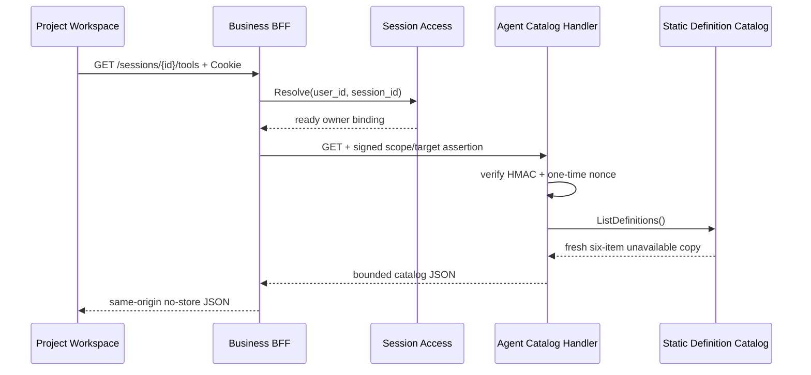

# Agent Tool Definition Catalog v1 设计评审

> 状态：Implemented and smoke-verified for W1-B2 static unavailable projection / 2026-07-14
>
> 覆盖范围：Session 级六 Tool 定义目录、Business 同源 BFF、前端不可用投影
>
> 明确不在范围：Graph、Prompt、Runner、Run、Tool Pin、Executable Registry、计费、Approval、Operation、Worker

## 1. 结论与边界

W1-B2 只实现 `Definition Catalog Projection`。它回答“产品目录中有哪些稳定 Tool，以及当前为什么不可使用”，不回答“服务启动时注册了哪些可执行 Tool”。六份 Graph Tool 设计仍为 Draft，任何一项都不得返回可执行 Definition Version、Schema、Run 入口或伪造的可用状态。

本评审批准实现静态、不可变、无数据库依赖的目录读取纵切；不批准创建 `Executable Registry`、Eino Tool、Graph、Prompt、Runner 或运行记录。

## 2. 固定目录

目录 exact-set、产品名称和顺序固定如下：

| `order` | `tool_key` | `display_name` | `availability` | `reason_code` |
| ---: | --- | --- | --- | --- |
| 1 | `plan_creation_spec` | 流程规划 | `unavailable` | `DESIGN_REVIEW_PENDING` |
| 2 | `analyze_materials` | 素材分析 | `unavailable` | `DESIGN_REVIEW_PENDING` |
| 3 | `plan_storyboard` | 故事板设计 | `unavailable` | `DESIGN_REVIEW_PENDING` |
| 4 | `generate_media` | 媒体生成 | `unavailable` | `DESIGN_REVIEW_PENDING` |
| 5 | `write_prompts` | 提示词写法 | `unavailable` | `DESIGN_REVIEW_PENDING` |
| 6 | `assemble_output` | 视频剪辑 | `unavailable` | `DESIGN_REVIEW_PENDING` |

该集合不能由 Skill、数据库、环境变量或前端 Mock 增删、重排或改为可用。静态 Provider 每次返回独立副本，调用方修改返回值不得污染后续请求。

## 3. HTTP 契约

### 3.1 浏览器同源接口

```text
GET /api/v1/agent/sessions/:session_id/tools
Cookie: Business Web Session
Query: 禁止
Response Cache-Control: no-store
```

Business 必须复用现有 `AgentSessionAccessService.Resolve`，只有当前登录用户拥有 ready Project/Session Binding 时才允许签发内部断言。未登录返回 `401 UNAUTHENTICATED`；非 Owner、未知或未 ready Session 统一返回 `404 SESSION_NOT_FOUND`；Agent 或内部依赖失败返回 `503 DEPENDENCY_UNAVAILABLE`。浏览器携带的内部身份 Header、Cookie、Authorization 和 CSRF 不得透传到 Agent。

### 3.2 Agent 内部接口

路径同上，只接受 Business 新建请求携带的三身份 Header，要求：

- Method 固定为 `GET`；
- `session_id` 是规范小写 UUIDv7；
- `RawQuery` 为空，Escaped Path 必须与规范路径完全一致；
- Canonical Target 为 `/api/v1/agent/sessions/<session_id>/tools`；
- Scope 固定为 `agent.session.tools.read`；
- Assertion 中的 principal、project、Agent Session、Web Session 与 Canonical Target 继续由现有 16 行协议和一次性 Nonce 绑定。

Agent 对非法路由返回 `400 INVALID_ARGUMENT`；内部断言无效返回 `401 INTERNAL_IDENTITY_INVALID`；Nonce/身份校验依赖不可用返回 `503 IDENTITY_ASSERTION_UNAVAILABLE`。成功不访问 PostgreSQL、Redis 业务数据或 Graph Registry；Redis 只承担既有身份 Nonce 防重放。

### 3.3 成功 DTO

```json
{
  "schema_version": "tool_definition_catalog.v1",
  "request_id": "019f0000-0000-7000-8000-000000000001",
  "items": [
    {
      "tool_key": "plan_creation_spec",
      "display_name": "流程规划",
      "order": 1,
      "availability": "unavailable",
      "reason_code": "DESIGN_REVIEW_PENDING"
    }
  ]
}
```

所有字段必需且只允许上述字段。`request_id` 使用已校验 Assertion 中的 UUIDv7，不由 Agent 再生成。`schema_version` 是目录 DTO 版本，不是 Tool Definition Version。响应编码上限为 16 KiB；Agent 和 Business 均设置 `Cache-Control: no-store`，Business 只接受 `application/json`、HTTP 200、合法有界 JSON，其他上游结果失败关闭。

禁止增加或返回：

- executable definition/schema/prompt/model/graph version；
- input/output JSON Schema、风险或执行权限元数据；
- price、budget、billing、provider 或 Approval 引用；
- Run URL、Action、`requested_tool_key` 写入口；
- Graph Compile、Executable Registry 或服务就绪状态。

## 4. 组件与数据流



建议实现文件：

- Agent：`internal/tool/catalog.go`、`internal/httpserver/tool_catalog_handler.go`，并在 `bootstrap` 和 HTTP Server 显式装配；
- Business：扩展现有 `agentidentity` Scope 和固定 allowlist `AgentProxyHandler`；
- Frontend：独立 `features/tools` 契约、API 与目录面板，不复用 Skill 能力常量补齐响应。

Catalog Provider 不是 Registry，不读取配置，不探测 Graph，也不向主 Agent 注册 Tool。

## 5. 前端失败关闭

Project Workspace ready 后读取目录。前端必须精确验证：

- Envelope 只有 `schema_version/request_id/items`；
- `request_id` 为规范 UUIDv7；
- items 恰好六项，key、中文名称、order、availability 和 reason 全部逐项匹配；
- 缺项、重复、乱序、未知字段、未知状态、可用项或执行字段均作为契约错误处理；
- 成功时六项全部可见、禁用，并显示“设计评审中”；失败时显示可重试的目录不可用状态，不用本地 Mock 补齐。

前端不得把目录、选择或可用性写入 LocalStorage，不得提供运行按钮或 Tool Pin 写入口。

## 6. 测试与验收

必须覆盖：

1. Provider exact-set/order/name/reason 和返回副本隔离；
2. Agent 仅接受规范 GET/UUIDv7/无 Query/精确 Scope 与 Target，非法身份不返回目录；
3. Business 仅允许已登录 ready Owner，伪造内部 Header 不透传，上游类型/大小/JSON/状态异常统一失败关闭；
4. 前端严格拒绝缺项、重复、乱序、未知字段、未知状态和任何执行字段；
5. 真实浏览器证明六项可见、禁用、原因正确，跨 Owner 与未登录失败；
6. Evidence 明确标记 `W1-B2 catalog projection passed`，不得把 `SMK-007` 或 `SMK-008` 标为通过。

## 7. W2 门禁

进入 Graph/Runner 前仍需：六份 Graph Tool 设计分别 Approved；补齐独立的 Tool 调用/回执状态机；修正 `accepted` 与 Operation 状态混用以及 `analyze_materials` 状态图/迁移表冲突；冻结 `aigc.contract.v1alpha1`、Executable Definition Schema、风险、权限、预算、计费、Runner、Tool Pin、Receipt 与 A2UI 契约。

## 8. 实现与验收状态

当前 Agent 静态 Provider/HTTP/身份 Scope、Business 同源 BFF、前端严格契约与不可用目录面板均已接线。全量 Agent/Business 测试、前端 332 项测试与生产构建通过；`w1.skill-foundation.smoke.evidence.v3` 以真实 API、跨 Owner 404 和 `@w1-real-review` Chromium 链路证明六项 exact-set 均为 `unavailable / DESIGN_REVIEW_PENDING`。该结果只关闭 W1-B2/W1-C1 的静态目录纵切，不关闭 `SMK-007/008`。
