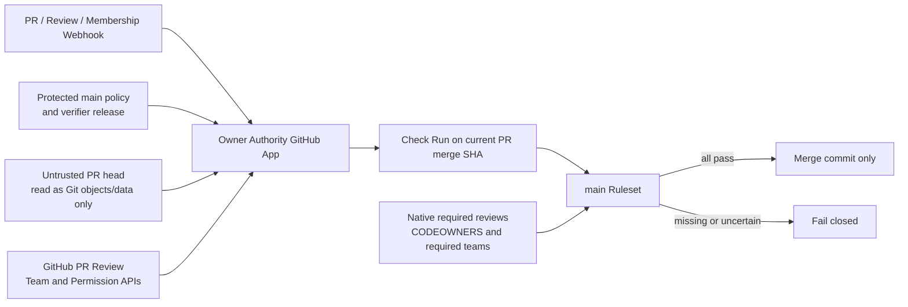

# W2 Review Freeze GitHub Owner Authority v1

> 状态：Draft / 未审核 / 未启用
> 文档版本：v1
> 适用范围：W2 Review Freeze 的 `review_frozen`、`approved`、`reopened` 与 reapproval Owner authority
> 不适用范围：生产 Agent Runtime、业务 HITL Approval、Graph Tool 实现
> 当前结论：外部 GitHub 身份、团队、GitHub App、Ruleset 与 CODEOWNERS 尚未配置；在本文“激活门槛”全部关闭前，任何 Gate 都不得因本方案被表述为 Review Frozen 或 Approved。

## 1. 背景与问题

当前候选治理模型把 `owner_role`、`approver_role`、`review_url`、`commit_sha` 写入仓库 JSON，再由本地测试检查格式和 Git ancestry。它能够约束文件形状，却不能证明：

1. `approver_role` 真的由该领域 Owner 持有；
2. `review_url` 真的属于当前仓库、当前 PR 和当前 GitHub Review；
3. 写入 JSON 的人就是 Review 的 GitHub actor；
4. Review 在当前 PR head 上提交，且之后没有被 dismiss、edit 或新 push 失效；
5. 同一个 actor 没有同时冒充多个必须相互独立的 Owner；
6. fork PR、可修改 workflow、API 不可用或 Ruleset bypass 没有绕过门禁。

因此，仓库内自报角色和 URL 只能是非权威审计投影，不能产生 Owner approval authority。v1 推荐把 authority 放到 GitHub 原生 Review、受保护 numeric actor/team policy、base-owned verifier 和来源锁定的 required Check Run 组合上。

## 2. 目标与非目标

### 2.1 目标

- 用 GitHub numeric user ID、numeric team ID、numeric repository/organization ID 建立稳定身份绑定；login、team slug 和 URL 只作诊断显示。
- 每个 Required Owner Role 必须由当前有资格的 GitHub actor 在当前 PR head 上提交有效 `APPROVED` Review。
- `submitted`、`dismissed`、`synchronize`、PR/review `edited`、draft/ready、base 更新和团队成员变更都能使门禁重算；无法证明时失败关闭。
- head 仓库内容永远只作为不可信数据读取；不得在带 authority token 的环境执行 PR head workflow、Makefile、Go 测试、依赖或脚本。
- required check 明确关联当前 PR 的合并测试提交，并锁定到唯一 GitHub App 来源。
- Ruleset、CODEOWNERS 与 App verifier 形成纵深防御；任何单层失效都不应直接形成正式 authority。
- 支持 fork PR、policy bootstrap、正常 rotation 和紧急恢复，并保留可审计谱系。

### 2.2 非目标

- 本文不填写任何真实 GitHub 用户、团队、组织或仓库 ID。
- 本文不注册 GitHub App、不创建团队、不修改 Ruleset/CODEOWNERS、不实现 verifier。
- 本文不把 GitHub Review 替代产品运行时的 PostgreSQL HITL Approval。
- 本文不修改现有 W2 Gate 的 Required Owner exact-set，也不裁决 R01/R04 等业务争议。
- 本文不承诺 GitHub API 跨 Review、Membership、Git ref 的事务一致性；v1 用事件重算、双读校验和 GitHub 原生保护缩小竞态窗口。

## 3. 推荐决策

### 3.1 权威来源

正式 Owner authority 必须同时满足四层：

1. **base-owned policy**：受保护 `main` 上的 active policy，把 role 映射到 numeric actor/team；PR head 版本不得参与当前 PR 判定。
2. **GitHub live state**：GitHub API 返回的 PR、Review、actor、team membership、repository permission 和 branch rules 当前状态。
3. **base-owned verifier**：只允许已经合入受保护 `main`、由可信发布流水线部署的 verifier release 执行；PR 不得改变本次执行代码。
4. **GitHub-native merge gate**：来源锁定到该 GitHub App 的 required Check Run，加 Ruleset required review/CODEOWNERS/strict/no-bypass。

仓库内 approval 文件只保存“请求核验什么”的不可变摘要，不自行宣称“谁已经批准”。Review ID、actor ID、role credit 和最终结论由 verifier 从 GitHub 重新获取并写入 Check Run/外部审计记录。

### 3.2 推荐运行形态

推荐使用安装在 base organization/repository 的私有 GitHub App：



“base-owned verifier”指：执行中的 binary/source release 必须已经存在于受保护 base，且 deployment identity 与 release digest 可审计。它不表示从 PR head checkout 后再执行同名代码。

## 4. 信任边界与强制不变量

### 4.1 身份不变量

- `repository.id`、`organization.id`、`review.user.id`、team numeric ID 是身份比较值；login、slug、`html_url` 不参与授权。
- Review `user.type` 必须是允许的人类 User；Bot、Mannequin、匿名或缺失 actor 默认不合格。
- actor 必须是 active organization member，并对仓库具有 `write` 或更高基础权限。
- team 必须属于 policy 绑定的 organization、当前存在、对仓库具有 `write` 或更高权限；actor 必须是该 team 的 active member。
- 直接 actor mapping 与 team mapping 都来自 base policy；Review body 中的 `role=...`、checkbox、评论、label 或 approval JSON 不参与授权。
- PR author、最近一次 reviewable push 的 sender，以及 policy 明确 deny 的 implementation actor/team 不得获得 Owner role credit。

GitHub 的 Review API 返回 numeric user ID、Review ID、state、`submitted_at` 与 `commit_id`；这些字段应从 API 读取而非由仓库文件复述。[GitHub Pull Request Reviews REST API](https://docs.github.com/en/rest/pulls/reviews)

### 4.2 Role exact-set 与一个 actor 多角色

v1 固定采用 `distinct_actor_per_role`：

- 一个 actor 可以在 policy 中同时符合多个 role，但在一个 authority evaluation 中最多贡献一个 role credit。
- 同一 actor 提交多个 Review 仍只算一个 actor，不增加 credit。
- verifier 对 `required_owner_roles` 与 policy eligibility 构造二分图，并寻找“每个 role 一个不同 actor”的完整匹配。
- 匹配结果必须确定性：role key 升序；同等候选按 numeric actor ID 升序；eligibility source 优先 direct actor，再按 numeric team ID 升序。
- 找不到 distinct perfect matching 时失败 `OWNER_ROLE_DISTINCT_ACTOR_MISSING`，不得让同一 actor 自动覆盖多个角色。
- v1 不提供 multi-role exception。确需同一人覆盖多个 role 时，必须设计新的 policy schema 版本并经过独立安全评审，不得在 Review body 或 approval manifest 临时声明。

### 4.3 Review 绑定与 freshness

一个 Review 只有同时满足下列条件才可参与匹配：

1. Review 属于 policy 中 numeric repository ID 的当前 PR number；
2. Review numeric ID 和 actor numeric ID 均来自 GitHub API；
3. state 当前为 `APPROVED`，`submitted_at` 非空、格式合法；
4. `review.commit_id == current pull_request.head.sha`；ancestor SHA 不合格；
5. Review 在当前 head 首次被 App 观察之后提交；bootstrap 前的历史 Review 不合格；
6. Review 在当前 policy activation、当前 authority request digest 生效之后提交；
7. Review 没有被 dismissed；
8. v1 中，曾收到 `pull_request_review.edited` 的 Review ID 永久不再计入，必须提交一个新的 APPROVED Review；
9. 对同一 actor，只取当前 head 上最后一个 decisive Review；`CHANGES_REQUESTED` 覆盖更早的 `APPROVED`，`COMMENT` 不产生 approval；
10. actor 在 evaluation 时仍满足 organization/team/repository permission 与 deny 规则。

GitHub workflow 的 `pull_request_review` 事件包含 `submitted`、`edited`、`dismissed`，但该 Actions workflow 的 SHA 是 PR merge ref；v1 只把这些事件交给 App 触发重算，不把可由 PR 修改的 workflow 当 authority。[GitHub Actions review events](https://docs.github.com/en/actions/reference/workflows-and-actions/events-that-trigger-workflows#pull_request_review)

### 4.4 事件语义

| 事件 | 必须动作 | 旧结论 |
| --- | --- | --- |
| `pull_request.opened/reopened` | 读取 base policy、head request、changed files，创建或重置 evaluation | 不继承其他 PR |
| `pull_request.synchronize` | 先把新 merge SHA 对应 check 置为 `in_progress`；旧 Review 因 `commit_id != head.sha` 全部失效 | 不可复用 |
| `pull_request.edited` | 重新读取 base ref、draft、head/base/merge SHA 与 request；base 不再是 `main` 立即失败 | 只在所有权威字段不变时可重算成功 |
| `converted_to_draft` | check 结论设为 failure/action-required | 全部 role credit 暂停且 ready 后必须重新批准 |
| `ready_for_review` | 记录 ready epoch，要求之后的新 Review | Draft 期间 Review 不计入 |
| `pull_request_review.submitted` | 不信任 payload 结论，完整重新分页读取 Reviews 和 memberships | 按 live state 重算 |
| `pull_request_review.edited` | 标记该 Review ID 不合格并立即重算 | 该 Review 永久失效 |
| `pull_request_review.dismissed` | 立即排除并重算 | 失效 |
| `membership/team/member` 变化 | 找出引用相关 numeric team/actor 的全部 open PR 并重算 | 移除立即失效；新增只接受事件后的新 Review |
| base branch 更新 | 新 merge SHA 无旧 check；记录 base epoch 并要求重新批准 | 旧 base 上 Review 不计入 |
| Ruleset/CODEOWNERS/App permission 变化 | 全仓 open PR 重算并执行配置自检 | 配置不满足即失败 |

Webhook 只负责唤醒。每次 evaluation 都必须重新读取 GitHub live state，不能把 webhook payload 本身当最终事实。Webhook delivery ID 必须幂等，签名必须验证，乱序事件以 live state 和单调 evaluation generation 收敛。

### 4.5 双读和竞态处理

GitHub API 不提供跨 PR、Reviews、team membership 与 Ruleset 的单事务快照，verifier 必须：

1. 把当前 merge SHA 的 canonical Check Run 先更新为 `in_progress`；
2. 读取 PR snapshot A：numeric repository/organization、PR number、base/head repo、base/head SHA、merge SHA、draft、updated time；
3. 从 snapshot A 的 base SHA 读取 policy/verifier declaration，从 head SHA 读取 authority request 与治理数据；
4. 完整分页读取 Reviews、actor permissions、team permissions/memberships 和 branch rules；任何分页不完整都失败；
5. 重新读取 PR snapshot B 和 Reviews ETag/generation；A/B 的 head、base、merge、draft 或 relevant generation 不同则丢弃本次结果并有界重试；
6. 只有稳定快照才能把同一 Check Run 更新为 `success`；超时、限流或持续变化均写 failure，不写 neutral/skipped。

原生“dismiss stale approvals”“require most recent reviewable push approval”和 strict up-to-date 继续在 GitHub merge 时检查当前状态，用于缩小 webhook 到达前的竞态窗口。

## 5. `pull_request`、`pull_request_target` 与 required check 关联

| 方案 | 优点 | 权威缺陷 | v1 决策 |
| --- | --- | --- | --- |
| `pull_request` / `pull_request_review` Actions | check 自然位于 PR merge ref；fork 默认只读 token | workflow 定义来自 PR merge/head，可被 PR 修改为跳过 verifier 或伪造成功；merge conflict 时事件行为也不同 | 不作为 Owner authority |
| `pull_request_target` Actions | workflow 与默认 checkout 来自 base；可安全读取 head 为数据 | `GITHUB_SHA` 是 default/base branch commit，不是 PR head/merge SHA；不接收 Review submitted/edited/dismissed activity；若执行 head 代码会形成 pwn-request | 只作 base-owned 结构校验或 App 唤醒，不作为唯一 required authority check |
| Base-installed GitHub App | 同时订阅 PR/Review/Team 事件；verifier 不受 PR 修改；可在指定 SHA 创建 Check Run并锁定 App 来源 | 需要外部服务、密钥、持久事件账本与组织配置 | **推荐** |

GitHub 明确说明 `pull_request_target` 在 default/base context 运行，`GITHUB_SHA` 是 default branch 最后提交；它适合处理 fork 元数据，不适合执行不可信 head 代码。[GitHub Actions event reference](https://docs.github.com/en/actions/reference/workflows-and-actions/events-that-trigger-workflows#pull_request_target) [Securely using pull_request_target](https://docs.github.com/en/actions/reference/security/securely-using-pull_request_target)

### 5.1 Check Run 关联策略

- App 为当前 PR 的 synthetic merge commit SHA 创建/更新固定名称 `w2-review-freeze-owner-authority` 的 Check Run。
- Check output 同时绑定 `base_sha`、`head_sha`、`merge_sha`、policy digest 和 authority request digest；merge SHA 变化必须形成新的 evaluation。
- 对 same-repository PR 可额外在 head SHA 发布诊断 check，但 Ruleset authority 只使用 merge SHA 上、来源为指定 App 的固定 check。
- fork head 不执行、不注入 token；merge SHA 位于 base repository 的 PR merge ref，作为 required-check 关联点。
- merge conflict、merge SHA 缺失或 GitHub mergeability 为 unknown 时不得写 success。
- 若未来启用 Merge Queue，必须另行支持 `merge_group/checks_requested` 并绑定 merge-group head SHA；v1 未启用 Merge Queue。

GitHub required checks 在 test merge commit 有状态时要求该 merge commit 通过；旧 head 上的成功不能替代最新 SHA。[Troubleshooting required status checks](https://docs.github.com/en/pull-requests/collaborating-with-pull-requests/collaborating-on-repositories-with-code-quality-features/troubleshooting-required-status-checks) Check Run 可由 GitHub App 用明确 `head_sha` 创建。[Checks REST API](https://docs.github.com/en/rest/checks/runs)

## 6. Base-owned policy

### 6.1 推荐路径与保护范围

建议后续实现时使用以下路径；本文不创建它们：

```text
.github/review-freeze/owner-authority-policy.v1.json
.github/review-freeze/verifier-release.v1.json
.github/CODEOWNERS
agent/tests/reviewfreeze/**
.github/workflows/w2-review-freeze-transition.yml
docs/design/agent/approvals/w2-review-freeze-manifest.json
docs/design/agent/approvals/w2-review-freeze-authority-requests/**
docs/design/agent/approvals/w2-review-freeze-exceptions/**
```

本次 evaluation 必须从 PR base SHA 读取 active policy；不得从 head overlay 读取。若 PR 同时修改 policy/verifier/CODEOWNERS 与任何 Gate 正式状态，失败 `TRUST_ROOT_AND_FORMAL_TRANSITION_MIXED`。

### 6.2 Policy 规则

- policy 绑定 numeric organization/repository、base ref、单调 `policy_version` 与前一版本 digest。
- 所有 base-owned Actions 依赖必须使用审核过的完整 commit SHA，不得使用 `@v4`、分支或其他可移动 tag；verifier release declaration 同时固定 action SHA、Go patch 版本与 binary/source digest。
- role key 必须是稳定小写 snake_case，且能够覆盖 Gate `required_owner_roles` exact-set。
- 每个 role 至少有一个 direct numeric actor 或 numeric team；空 eligibility 只能存在于 Draft policy，active policy 拒绝。
- actor/team 数组严格升序、无重复；同一 numeric ID 的 login/slug 变化不构成 policy rotation。
- team membership 包括 child team 的语义必须明确固定；v1 推荐 `include_child_teams=false`，防止父子 team 隐式扩权。
- eligibility 新增不追溯认可旧 Review；新 actor/team member 必须在 eligibility epoch 后重新 Review。
- deny 集优先于 allow；PR author、latest pusher 是运行时 deny，不依赖 policy 列表。
- active policy 固定 `actor_credit_mode=distinct_actor_per_role`。
- policy `status=draft` 永远不能产生 authority；只有完成外部激活并位于受保护 base 的 `status=active` policy 才可参与判定，真实 activation epoch 由 App 控制面记录而非文件自报时间。

GitHub 的团队与成员 API 能返回 numeric IDs，并要求 organization `Members: read`；团队对仓库的权限也可用 numeric organization/team route 核验。[Team members REST API](https://docs.github.com/en/rest/teams/members) [Teams REST API](https://docs.github.com/en/rest/teams/teams)

## 7. Authority request 与审计记录

### 7.1 为什么不能在同一 head 写 Review receipt

若先 Review 再把 Review ID/actor/URL 写入 PR，新 commit 会改变 head 并使刚才的 Review 过期；再次 Review 后再写 receipt 会形成无限反馈。因此：

- head 中只提交 authority request，绑定 Gate、Freeze、Corpus/approval summary、required roles 与 base policy digest；
- request 不填写 Review ID、actor ID、Review URL，也不自报批准结果；
- App 在最后一个 head 上实时查 Review，并把 evaluation result 写入 Check Run 与外部 append-only audit store；
- PR 合并后可异步生成审计 projection，但 projection 不反向成为该次 merge 的授权前提。

现有 `w2_review_freeze_owner_approval.v1` 的自报 `owner_role/approver_role/review_url/commit_sha` 不满足本方案。后续实现必须引入新的 authority request schema，并在 checker 中禁止 v1 自报文件产生正式状态；在此之前不得激活 formal transition。

### 7.2 审计数据

Check Run/外部审计结果至少保存：

- numeric repository/organization/PR/Review/actor/team IDs；
- base/head/merge SHA；
- policy path、version、raw SHA256；
- authority request path、raw SHA256、approval summary SHA256；
- 每个 role 的唯一 actor credit、Review `commit_id`、`submitted_at` 与 eligibility source；
- draft、event generation、evaluation time、GitHub API version、verifier release digest；
- conclusion 和稳定失败码。

login、slug、URL 可以显示，但必须标记 `diagnostic_only`，不得进入授权比较。

## 8. GitHub App 权限、Secret 与 fork 行为

### 8.1 最小权限

推荐单独的 Owner Authority GitHub App installation token：

| 范围 | 权限 | 用途 |
| --- | --- | --- |
| Repository metadata | Read | repository ID、collaborator base permission、branch effective rules |
| Contents | Read | 从 base/head SHA 读取 policy、request、manifest 与 changed Git objects；不写仓库 |
| Pull requests | Read | PR、changed files、Reviews、Review webhook |
| Checks | Read & write | 只创建/更新固定 Owner authority Check Run |
| Commit statuses | Read & write | GitHub 当前要求 expected-source App 具备 `statuses:write`；verifier 不调用 legacy commit-status 写接口 |
| Organization members | Read | numeric team、active membership 与 team/repository permission |

明确不授予：Contents write、Pull requests write、Actions、Workflows、Administration、Secrets、Deployments、Issues。GitHub App 默认没有权限，应只选择实际需要的最小集合。[Choosing permissions for a GitHub App](https://docs.github.com/en/apps/creating-github-apps/registering-a-github-app/choosing-permissions-for-a-github-app)

GitHub 当前的 Ruleset 文档要求，被选为 required status check expected source 的 App 已安装、近期提交过 Check Run，且具有 `statuses:write`。因此 v1 必须授予 Commit statuses read/write，但 verifier release 与 API allowlist 仍只允许写固定名称的 Check Run，不允许写 legacy commit status；若平台后续取消该配置前提，应在独立 permission rotation 中移除该权限。[Available rules for rulesets](https://docs.github.com/en/repositories/configuring-branches-and-merges-in-your-repository/managing-rulesets/available-rules-for-rulesets#require-status-checks-to-pass-before-merging)

若 Metadata read 不能读取部署版本所需的 effective Ruleset 字段，配置自检应由独立只读审计任务完成，不能直接给运行 App 增加 Ruleset write/admin 权限。GitHub 的 effective branch rules 与 repository permission 查询均支持 Metadata read。[Repository rules REST API](https://docs.github.com/en/rest/repos/rules) [Collaborator permission REST API](https://docs.github.com/en/rest/collaborators/collaborators#get-repository-permissions-for-a-user)

### 8.2 Secret 管理

- App private key 和 webhook secret 只存放在外部 Secret Manager，不进入 repository、Actions artifact、日志或 PR。
- installation token 短期生成、限制到目标 repository，禁止输出到日志。
- webhook 必须校验签名、delivery ID、防重放窗口和 payload 大小。
- verifier 日志只记录 numeric IDs、摘要、状态码和 request ID，不记录 token、Review body、用户邮箱或不必要的个人信息。
- App 不接受 PR 提供的 callback URL、API base URL、token audience 或 verifier command。

### 8.3 Fork

- App 只安装在 base organization/repository；fork 不需要安装 App，也不会获得 token。
- fork head 只通过 GitHub API 或 Git object database 按 SHA 读取为数据；不得 checkout 后执行。
- changed files 必须完整分页；超过 API/平台上限、head object 不可读、submodule/symlink/executable trust-root shape 异常均失败关闭。
- required Check Run 写到 base repository 的当前 PR merge SHA；output 显式记录 fork numeric repository ID 与 head SHA。
- “Allow edits from maintainers”不改变规则；任何 push 都触发 `synchronize` 并使旧 Review 失效。

## 9. Ruleset 与 CODEOWNERS 强制配置

### 9.1 `main` Ruleset

激活时必须由 repository/organization 管理员在 GitHub 外部配置并导出证据：

1. Enforcement 为 Active，target 只包含正式 `main`；
2. Require a pull request before merging；
3. Required approving reviews 开启；
4. Dismiss stale approvals when new commits are pushed；
5. Require approval of the most recent reviewable push；
6. Require review from Code Owners；
7. Require conversation resolution；
8. Required status check `w2-review-freeze-owner-authority`，source 锁定到 Owner Authority App；
9. Required status checks 使用 strict / require branch up to date；
10. Allowed merge method 只有 merge commit；仓库同时关闭 squash/rebase；
11. Block force pushes、block deletion；
12. 不配置 bypass actor、team、App 或 deploy key；管理员同样不能绕过；
13. 禁止 direct push，以 PR merge 作为唯一更新路径；
14. required check 对所有指向 `main` 的 PR 运行，不使用会导致 required workflow 永久 Pending 的 path filter。

GitHub Ruleset 支持 stale dismissal、most recent push approval、required Code Owner/team review、strict checks 与 merge method；Code Owner 多人同列时任意一个 approval 即可，因此 CODEOWNERS 不能替代本方案的跨 role exact-set verifier。[Available rules for rulesets](https://docs.github.com/en/repositories/configuring-branches-and-merges-in-your-repository/managing-rulesets/available-rules-for-rulesets) [About CODEOWNERS](https://docs.github.com/en/repositories/managing-your-repositorys-settings-and-features/customizing-your-repository/about-code-owners)

### 9.2 CODEOWNERS

- `.github/CODEOWNERS` 必须位于 base branch，并由真实治理团队保护；本文不填写团队名。
- 至少覆盖 `.github/**`、`agent/tests/reviewfreeze/**`、Review Freeze policy/manifest/request/approval/exception 路径。
- CODEOWNERS 文件自身和整个 `.github/` 必须有 Owner。
- team 必须 visible 且对仓库有 write；不满足时 GitHub 不会形成有效 Code Owner request。
- Native required reviewer teams 应尽量与 policy team IDs 对齐，作为实时 membership 的第二层检查；App 仍负责 distinct actor 与 role exact-set。

## 10. Bootstrap、rotation 与恢复

### 10.1 首次 bootstrap

bootstrap 必须分阶段，不能在同一个 PR 同时引入 authority 并把 Gate 变成正式状态：

1. **D0 文档阶段**：本文保持 Draft；所有 Gate 仍 pre-formal。
2. **外部身份阶段**：管理员确认 numeric organization/repository、真实 actor/team、team write 权限和职责分离；形成待激活 policy，但不写虚构 ID。
3. **App 阶段**：注册私有 App、配置最小权限/webhook secret、部署 base-owned verifier 与 durable event ledger。
4. **Trust-root PR**：仅引入 active policy、verifier declaration、CODEOWNERS 和 checker schema；不得包含 formal Gate transition。该 PR 必须由两名不同的 repository/organization administrator 完成外部 bootstrap 审批并留下证据；若当前没有两名合格管理员，则继续阻塞而不是降低门槛。
5. **Ruleset 阶段**：启用 required App check、native review、strict、merge-only、no-bypass；导出 effective rule 证据。
6. **Canary 阶段**：同仓与 fork 各跑一次无 authority/完整 authority/失效 authority PR，证明 head/merge check 关联正确。
7. **Formal 阶段**：只有后续独立 PR 才允许 `awaiting_review -> review_frozen`；所有 Review 必须晚于 App/policy activation epoch。

若 base 已存在任何正式 authority，而 App/policy 尚未激活，bootstrap 必须先由现有治理流程将 Gate 受控重开或保持禁止推进，不能把旧自报 JSON 自动升级为 GitHub authority。

### 10.2 Policy rotation

- rotation 使用独立 PR，禁止与 Gate transition、CFE 或业务实现混合。
- rotation PR 由 **旧 base policy + 旧 verifier release** 判定；head 中的新 policy 只能作为候选数据。
- `policy_version` 严格加一，`supersedes_policy_sha256` 精确绑定旧 raw digest；organization/repository/base ref 不得顺带变化。
- 删除 Owner、扩展 team、改变 deny 或职责分离都按扩权处理，必须满足旧 policy 的治理/security role exact-set。
- rotation merge 后，所有 open authority PR 的旧 check 立即失效；必须基于新 policy 重新 Review。
- 新 team member/actor 不能让 rotation 前的 Review 追溯生效。

### 10.3 Verifier rotation

- 新 verifier 先以 candidate release 并行 shadow，对固定对抗 corpus 输出与旧版一致或给出已审核差异。
- 激活 PR 由旧 verifier 校验，只允许 verifier release declaration、受保护测试与必要 workflow 变化；不得形成 formal Gate transition。
- 合并并部署新 release 后，App 必须回读 base declaration 校验 digest；不一致则全局失败关闭。
- 不允许 PR head 自己选择 verifier version、feature flag 或兼容模式。

### 10.4 紧急恢复

旧 Owner 全部离职、App 私钥丢失、GitHub API 长期不可用时，不允许通过 Ruleset bypass 直接写 formal state。恢复流程必须：

1. 将受影响 Gate 保持 pre-formal/reopened；
2. 由 organization/repository 管理员执行双人恢复并记录 incident；
3. 轮换 App key、重建 policy 或 verifier；
4. 重走 canary 和 Ruleset effective-rule 核验；
5. 所有 Owner 在新 activation epoch 后重新 Review。

## 11. API 不可用时失败关闭

以下任一情况都不得返回 `success`、`neutral` 或 `skipped`：

- GitHub API 401/403/404/409/5xx、secondary rate limit、超时、GraphQL partial error；
- REST/GraphQL API version 未固定或响应 schema 出现未知关键字段；
- Reviews、changed files、team members 任一分页不完整；
- Review、actor、team、repository numeric ID 缺失或交叉查询不一致；
- team 不可见、membership state 非 active、仓库权限低于 write；
- webhook signature 无效、delivery ledger 存在缺口或事件 generation 不能收敛；
- base policy、verifier release、authority request、manifest raw digest 不一致；
- current head/base/merge SHA 在 evaluation 中变化；
- merge ref 缺失、冲突或 fork head object 不可读取；
- App installation permission 被收窄、Ruleset source 不再锁定或发现 bypass actor；
- durable audit store 写入失败。

可进行有界指数退避和抖动重试；超过 deadline 后 Check Run 结论必须是 failure/action-required，并输出稳定错误码与 retry hint。不得因为“GitHub 暂时不可用”沿用旧成功。

## 12. 推荐机器 Schema

以下为后续实现的规范化 shape；字段名和严格解码规则在实现前仍需独立评审。所有 JSON 必须拒绝未知字段、重复 key、尾随值、未排序/重复数组和非 canonical SHA256。

### 12.1 `w2_review_freeze_owner_authority_policy.v1`

```json
{
  "$schema": "https://json-schema.org/draft/2020-12/schema",
  "$id": "urn:dora:w2-review-freeze-owner-authority-policy:v1",
  "type": "object",
  "additionalProperties": false,
  "required": [
    "schema_version",
    "status",
    "policy_version",
    "supersedes_policy_sha256",
    "organization_id",
    "repository_id",
    "base_ref",
    "actor_credit_mode",
    "include_child_teams",
    "role_bindings",
    "deny_actor_ids",
    "deny_team_ids"
  ],
  "properties": {
    "schema_version": {
      "const": "w2_review_freeze_owner_authority_policy.v1"
    },
    "status": {
      "enum": ["draft", "active"]
    },
    "policy_version": {
      "type": "integer",
      "minimum": 1
    },
    "supersedes_policy_sha256": {
      "type": "string",
      "pattern": "^$|^sha256:[0-9a-f]{64}$"
    },
    "organization_id": {
      "type": "integer",
      "minimum": 1
    },
    "repository_id": {
      "type": "integer",
      "minimum": 1
    },
    "base_ref": {
      "const": "refs/heads/main"
    },
    "actor_credit_mode": {
      "const": "distinct_actor_per_role"
    },
    "include_child_teams": {
      "const": false
    },
    "role_bindings": {
      "type": "array",
      "minItems": 1,
      "items": {
        "type": "object",
        "additionalProperties": false,
        "required": ["role", "actor_ids", "team_ids"],
        "properties": {
          "role": {
            "type": "string",
            "pattern": "^[a-z][a-z0-9_]*_owner$"
          },
          "actor_ids": {
            "type": "array",
            "items": {"type": "integer", "minimum": 1},
            "uniqueItems": true
          },
          "team_ids": {
            "type": "array",
            "items": {"type": "integer", "minimum": 1},
            "uniqueItems": true
          }
        }
      }
    },
    "deny_actor_ids": {
      "type": "array",
      "items": {"type": "integer", "minimum": 1},
      "uniqueItems": true
    },
    "deny_team_ids": {
      "type": "array",
      "items": {"type": "integer", "minimum": 1},
      "uniqueItems": true
    }
  }
}
```

JSON Schema 无法完整表达“每个 role 唯一、actor/team 列表升序、每个 role 至少一个 eligibility、版本谱系、与 Gate exact-set 一致”，这些必须由 base-owned semantic verifier 额外校验。

### 12.2 `w2_review_freeze_owner_authority_request.v1`

```json
{
  "schema_version": "w2_review_freeze_owner_authority_request.v1",
  "request_id": "AR-W2-Rnn-vn",
  "gate": "W2-Rnn",
  "freeze_id": "CF-W2-Rnn-vn",
  "transition": "awaiting_review_to_review_frozen",
  "contract_manifest_path": "<repository-relative-path>",
  "contract_manifest_sha256": "sha256:<64-lower-hex>",
  "approval_summary_sha256": "sha256:<64-lower-hex>",
  "policy_path": ".github/review-freeze/owner-authority-policy.v1.json",
  "policy_sha256": "sha256:<64-lower-hex>",
  "required_owner_roles": ["<sorted-role-key>"],
  "reapproval_exception_id": ""
}
```

上例中的尖括号是文档占位，不是可提交实例。实现 schema 必须按 transition 区分首次 freeze、`review_frozen -> approved`、reopen 与 reapproval，并把 CFE ID/parent Freeze 纳入 approval summary。request 不含 Review ID、actor ID、URL 或 `approved_at`。

### 12.3 `w2_review_freeze_owner_authority_evaluation.v1`

该结果由 App 生成并进入 Check Run/外部审计存储，不由 PR author 提交：

```json
{
  "schema_version": "w2_review_freeze_owner_authority_evaluation.v1",
  "evaluation_id": "<app-generated-immutable-id>",
  "repository_id": "<numeric-repository-id>",
  "organization_id": "<numeric-organization-id>",
  "pull_number": "<numeric-pr-number>",
  "base_sha": "<40-lower-hex>",
  "head_repository_id": "<numeric-repository-id>",
  "head_sha": "<40-lower-hex>",
  "merge_sha": "<40-lower-hex>",
  "policy_version": "<positive-integer>",
  "policy_sha256": "sha256:<64-lower-hex>",
  "authority_request_sha256": "sha256:<64-lower-hex>",
  "verifier_release_sha256": "sha256:<64-lower-hex>",
  "role_credits": [
    {
      "owner_role": "<role-key>",
      "actor_id": "<numeric-user-id>",
      "review_id": "<numeric-review-id>",
      "review_commit_id": "<same-as-head-sha>",
      "submitted_at": "<github-rfc3339-time>",
      "eligibility_source": "direct_actor_or_team",
      "eligibility_team_id": "<numeric-team-id-or-null>"
    }
  ],
  "evaluated_at": "<app-rfc3339-time>",
  "conclusion": "success_or_failure",
  "failure_codes": ["<stable-machine-code>"]
}
```

字段以字符串占位只是为了避免虚构真实身份；正式 schema 中 numeric ID/PR number 应使用正整数，SHA 与时间使用严格 pattern/format。`role_credits` 必须与 request Required Owner exact-set 一一对应，actor ID exact-set 必须无重复。

## 13. 稳定失败码

至少定义：

| Code | 含义 |
| --- | --- |
| `AUTHORITY_NOT_ACTIVATED` | App/policy/Ruleset/CODEOWNERS 任一未激活 |
| `AUTHORITY_PR_DRAFT` | PR 为 Draft 或尚未在 ready epoch 后重新批准 |
| `AUTHORITY_BASE_REF_MISMATCH` | target 不是受保护 `main` |
| `AUTHORITY_HEAD_CHANGED` | evaluation 期间 head/base/merge 变化 |
| `AUTHORITY_REVIEW_NOT_HEAD_BOUND` | Review `commit_id` 不等于 current head |
| `AUTHORITY_REVIEW_STALE` | Review 早于 head/policy/request/ready/eligibility epoch |
| `AUTHORITY_REVIEW_EDITED` | Review ID 曾被 edited，必须新 Review |
| `AUTHORITY_REVIEW_DISMISSED` | Review 当前已 dismissed |
| `AUTHORITY_ACTOR_INELIGIBLE` | actor 非 active member、无 write 或命中 deny |
| `AUTHORITY_TEAM_INELIGIBLE` | team 不存在、不可见、无 write 或 membership 非 active |
| `OWNER_ROLE_EXACT_SET_MISMATCH` | Gate/request/policy role 集不一致 |
| `OWNER_ROLE_DISTINCT_ACTOR_MISSING` | 无法用不同 actor 覆盖全部 role |
| `TRUST_ROOT_AND_FORMAL_TRANSITION_MIXED` | 同 PR 修改 trust root 与正式 Gate |
| `AUTHORITY_RULESET_MISMATCH` | effective Ruleset、check source 或 no-bypass 不符合 |
| `AUTHORITY_GITHUB_API_UNAVAILABLE` | API、分页、限流或 schema 无法可靠完成 |
| `AUTHORITY_AUDIT_WRITE_FAILED` | durable audit 写入失败 |

## 14. 对抗测试矩阵

| 类别 | 对抗场景 | 预期 |
| --- | --- | --- |
| 身份伪造 | PR 自填 `approver_role=security_owner` | 忽略自报 role，失败 |
| URL 伪造 | 指向其他仓库/PR/Review 的 HTTPS URL | URL 不作 authority，失败 |
| 祖先提交 | Review/JSON 绑定 current head 的 ancestor | `commit_id != head.sha`，失败 |
| 新 push | 全部批准后 `synchronize` | 新 merge check in-progress；旧 Review 全失效 |
| force push | head SHA 被替换 | Ruleset block；若事件到达仍按新 head 全失效 |
| Review dismiss | 满足角色的 Review 被 dismissed | 立即失败 |
| Review edit | 批准后编辑 Review body | 该 Review ID 永久失效，须新 Review |
| PR edit | 修改 base branch、Draft 状态或 authority request 关联 | 重算；非 main/Draft/摘要不一致失败 |
| 多角色 | 一人同时在 finance/security team | 最多一个 role credit；缺另一 actor 则失败 |
| 多 Review | 同一 actor 提交多个 APPROVED | 仍只算一个 actor |
| 后续反对 | actor 先 APPROVED 后 CHANGES_REQUESTED | actor 不再贡献 credit |
| Team 移除 | 批准后移出 team | open PR 重算失败 |
| Team 新增 | 先批准后加入 team | 旧 Review 不追溯生效，须新增后重新 Review |
| 权限下降 | actor/team 从 write 降为 read | 重算失败 |
| implementation self-approval | PR author/latest pusher/deny actor 批准 | 不计入 |
| Draft | Draft 中获得全部 Review | 不计入；ready 后重新 Review |
| Fork pwn | fork 修改 workflow/Makefile/verifier test | 不执行 head；App check 不受影响 |
| Workflow spoof | head 删除 verifier step并输出 success | Ruleset只接受指定 App source，失败 |
| Check name collision | 其他 actor/App 写同名 status/check | source 不匹配，不满足 required check |
| Path bypass | PR 只改未列入 path filter 的治理文件 | App 对所有 main PR 运行并完整算 changed files |
| Symlink/submodule | trust-root 路径变为 symlink、submodule、100755 | base structural verifier 失败 |
| API partial page | 第 101 个 Review/changed file 未读取 | 检测分页不完整，失败 |
| API outage | Reviews 或 Members API 超时/429/5xx | 有界重试后失败，不沿用 success |
| Event replay | 同 delivery ID 重放旧 submitted | 幂等忽略并按 live state 重算 |
| Event reorder | dismissed 先于 submitted webhook 到达 | live API state收敛为 dismissed，失败 |
| Evaluation race | fetch 后 head 再变化 | snapshot B 不同，丢弃并重试 |
| Base update | 批准后 main 前进 | 新 merge SHA/strict/stale rule 要求重算与重批 |
| Policy self-change | PR 同时换 Owner policy并批准 Gate | 使用旧 base policy且 mixed-change 失败 |
| Policy rotation | 新 team 试图批准引入自己的 rotation | 旧 policy 判定，不计新 team |
| App permission loss | Checks/Members/Pulls/Contents 被撤销 | 配置自检失败，所有 formal transition 阻断 |
| Ruleset bypass | 管理员加入 bypass actor | effective-rule 检测失败；激活门禁不成立 |
| Merge method | squash/rebase/direct push 尝试进入 main | Ruleset 拒绝，只允许 merge commit |
| Merge conflict | 无稳定 merge SHA | 不写 success，PR 阻断 |
| Audit failure | check 可写但外部审计存储不可写 | 失败关闭 |

测试必须至少覆盖 same-repository 与 fork、两次连续 `synchronize`、Review edit/dismiss、team add/remove、policy rotation、API pagination/rate limit，以及 Ruleset source mismatch。Canary 证据必须记录 numeric ID 的脱敏摘要和 Check Run URL，不记录 Secret。

## 15. 激活门槛与外部阻塞

本文保持 Draft，直至以下事项全部由真实 Owner/管理员完成：

- [ ] 确认 GitHub organization/repository numeric IDs；
- [ ] 为每个现有 Required Owner Role 确认真实 numeric actor/team exact-set；
- [ ] 证明每个 team 可见、具有 write，且职责分离能形成 distinct actor perfect matching；
- [ ] 确认 implementation deny actor/team、PR author/latest pusher规则；
- [ ] 注册并安装私有 GitHub App，权限严格符合第 8 节；
- [ ] 配置外部 Secret Manager、webhook signature、delivery ledger 与 audit retention；
- [ ] 实现并审核 base-owned verifier、严格 schema、分页、双读和稳定错误码；
- [ ] 将 checkout/setup/runtime 等 base-owned Action 固定到审核过的完整 commit SHA，并核验 Go patch 版本与 verifier release digest；
- [ ] 将现有 self-reported owner approval v1 迁移为 authority request v1，并禁止旧 schema 形成正式状态；
- [ ] 配置 `.github/CODEOWNERS` 的真实用户/团队；
- [ ] 配置并导出 Active Ruleset：required App source、native reviews、strict、merge-only、no direct push/no bypass；
- [ ] same-repo/fork/rotation/API failure 对抗测试全部通过；
- [ ] canary PR 证明 Check Run 关联 current merge SHA，而不是 base SHA或旧 head；
- [ ] Integration、Security 与 repository administration Owner 正式审核本文及运行配置；
- [ ] 远端 default `main` 已包含并保护 trust root，且 required check 已实际生效。

任一项未完成时，verifier 应返回 `AUTHORITY_NOT_ACTIVATED`；本地 JSON、文档勾选、Review URL 或人工口头确认不能替代。

## 16. 审核结论

当前结论为 **Draft / 外部配置阻塞 / 不允许激活正式 Review Freeze authority**。

推荐方向是 GitHub App + protected numeric role policy + exact-head Review + merge-SHA Check Run + Ruleset/CODEOWNERS。现有 `pull_request_target` base-owned Git object checker 可以保留为结构门禁，但在 actor/team policy、Review freshness、required-check source/head association 和 no-bypass 外部配置关闭前，不得把它表述为完整 Owner approval 门禁。
