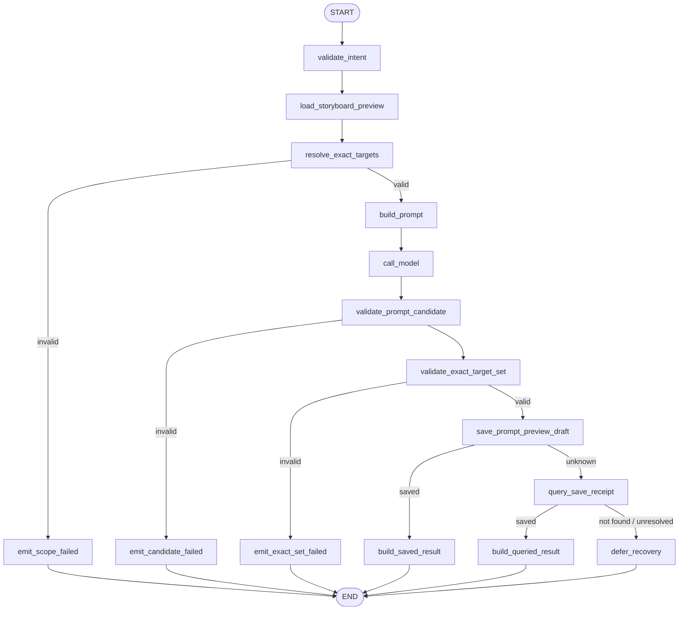
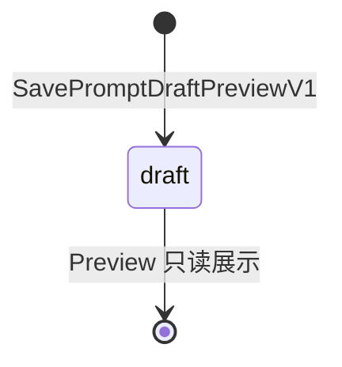

# `write_prompts` Tool-enabled Runtime 最小 Profile 设计

> 文档状态：Approved for Development Preview / 不授权生产实现
>
> Profile：`write_prompts.runtime.v2preview1`
>
> Tool Definition：`write_prompts.v2preview1`
>
> Graph Key：`write_prompts_graph_v2preview1`
>
> 设计与产品行为批准日期：2026-07-17
>
> Owner：Business 拥有隔离 Prompt Preview Draft；Agent 拥有 Input/Run/Receipt/Event 与 Graph 执行
>
> 批准依据：用户要求继续按统一开发计划推进并使用多 Agent 分工。本批准只覆盖本文 exact-set，不改变完整生产 `write_prompts.v1alpha1` 的 Draft 结论。

> 实现状态（2026-07-17）：M0～M4 Development Preview 已完成。canonical Run `20260717T043513Z-58302` 已通过；这不改变完整生产 `write_prompts.v1alpha1` 的 Draft 结论。

关联文档：[唯一开发计划](../../requirements/full-function-smoke-development-plan.md)、[完整生产 Prompt Graph Tool 设计](graphtool/write_prompts-design.md)、[`plan_storyboard.runtime.v2preview1`](plan-storyboard-runtime-v2-design.md)、[AIGC 跨 Module 契约目录](../cross-module/aigc-contract-catalog.md)。

## 1. 本批目标与批准结论

本 Profile 只完成一条可启动、可恢复且不触碰生产 Prompt 语义的 Storyboard Preview → Prompt Preview Draft 纵切：

1. 用户从当前 Project Workspace 已显示的 Storyboard Preview Draft 发起结构化 Prompt 写作请求；
2. HTTP 只校验身份、Owner、CSRF、幂等和严格 DTO，并把 typed Input 持久化；
3. 后台 Processor 经 PostgreSQL Session HOL、Lease/Fence 和唯一主 Eino ChatModelAgent 调用唯一 `write_prompts` Graph Tool；
4. Graph 读取当前用户、当前 Project 下指定版本的 Storyboard Preview Draft，把其中全部 Slot 冻结为 exact target set；
5. 唯一 Graph ChatModel Node 为 exact target set 生成 Prompt 候选，两个独立 Validator 分别复核候选协议和目标全集；
6. Business 在隔离 Preview 聚合中保存一个不可变 Prompt Draft JSON 与 Command Receipt，状态固定为 `draft`；
7. Agent first-write-wins 冻结 Router Model、Graph Model、Tool Result 和安全 Card，并通过 Snapshot/SSE 恢复；
8. 本地 Fake Router 与 Fake Prompt Model 是本批唯一模型路由，不调用真实 DeepSeek 或媒体 Provider。

本批准明确不包含：独立 `standalone` 模式、Active Storyboard、生产稳定 Element/Slot、PromptArtifact/PromptRevision、用户锁定 Prompt、编辑/历史/回滚、计费、Approval、变量模板、Asset/Evidence/Binding、`generate_media`、Operation/Batch/Job、Worker、Provider 或生产静态 Catalog 注册。

`standalone` 是生产需求，但当前纵切先验证 Storyboard Preview exact-set 主链；它必须在后续独立 Profile 中拥有自己的可信 Scope、Business Preview 聚合和验收，禁止用空 Storyboard 或虚构 Slot 绕过本批门禁。

## 2. 当前事实与隔离边界

- `plan_storyboard.runtime.v2preview1` 已把严格 `storyboard.preview.draft.v1` 保存到 Business PostgreSQL，可按 Owner、Project、ID、version、digest 读取；本 Profile 只消费该 Draft，不伪装为生产 Active Storyboard。
- Storyboard Preview 的 `slot_n` 是单个 JSON Aggregate 内的局部键，不是生产稳定 Slot ID；本 Profile 只在同一 Source Draft 中引用它们。
- 完整 `write_prompts.v1alpha1` 仍是生产 Draft，要求 standalone、Active Storyboard、稳定 Slot、计费、执行 Approval、内容审核和生产 Prompt 状态机；本文不得把目标能力写成当前事实。
- 本 Profile 与 `plan_creation_spec.v1preview1`、`user_message.runtime.v2preview1`、`analyze_materials.runtime.v2preview1`、`plan_storyboard.runtime.v2preview1` 互斥启用。统一 Lane Dispatcher 未完成前，不并行运行多个 source-filtered Processor。
- 静态六 Tool Catalog 继续只展示 `unavailable/DESIGN_REVIEW_PENDING`；Development Preview 可执行 Registry 与静态生产 Catalog 是两个不同边界。

## 3. 用户入口与严格 Intent

唯一用户入口：

```text
POST /api/v1/agent/sessions/:session_id/write-prompts-previews
  -> Business BFF 重验 Principal、Project/Session Owner、CSRF
  -> POST /internal/v1/workspaces/sessions/:session_id/write-prompts-previews
  -> Agent 校验 internal assertion scope `write_prompts.preview.write`
  -> 单事务写 typed Intent、Input、Turn Context、Run identity、open Receipt、accepted Event
  -> 202 pending/replayed
```

公开 Enqueue DTO `write_prompts.preview.enqueue-request.v1` exact-set：

```json
{
  "schema_version": "write_prompts.preview.enqueue-request.v1",
  "storyboard_preview_ref": {
    "id": "<uuidv7>",
    "version": 1,
    "content_digest": "<sha256>"
  },
  "tool_intent": {
    "schema_version": "write_prompts.preview.intent.v1",
    "writing_instruction": "为每个媒体槽位编写清晰、可直接复用的生成提示词",
    "output_language": "zh-CN"
  }
}
```

约束：

- `storyboard_preview_ref` 必须来自当前 Workspace 的权威 Storyboard Preview Card，不提供自由文本 ID 产品入口；BFF 先验证 Owner，Agent 再冻结 ID/version/digest，绝不暴露到模型可控 Tool Schema；
- 本批模式固定为 `storyboard_preview`，不在 Intent 中暴露 `mode` 或 target key；
- Graph 必须消费 Source Draft 的全部 Slot，用户和模型都不能静默缩小、扩大或重排目标集；
- `writing_instruction` 为 NFC、1～1000 个 Unicode scalar，无边界空白和控制字符；
- `output_language` 可选，只允许 `zh-CN|en-US`，缺省由冻结 Runtime Policy 决定；
- BFF 与 Agent 都拒绝未知字段、重复字段、尾随 JSON、非规范 UUIDv7、非法 Unicode 和超限正文；
- `session_input.source_type = write_prompts_preview`，`message_id = NULL`，不创建或篡改 `session_message`。

同一 `Session + Idempotency-Key` 同义重放返回首次稳定身份，异义返回 `409 IDEMPOTENCY_CONFLICT`。首次事务预分配 `input_id/turn_id/run_id/tool_call_id/router_model_call_id/graph_model_call_id/business_command_id/accepted_event_id/terminal_event_id`，并把 `storyboard_preview_ref` 与 canonical `tool_intent` 分栏冻结；重试、重启和 Takeover 不换 ID。

## 4. Business 读取与写入契约

### 4.1 只读 Prompt 上下文

`GetPromptGenerationContextPreviewV1` 输入 exact-set：`schema_version/request_id/user_id/project_id/storyboard_preview_ref{id/version/content_digest}`。

返回 `prompt.generation-context.preview.v1`：

- Project `id/version/title`；
- Storyboard Preview `id/project_id/version/status/content_digest/content`；
- 只允许 `status=draft`、`schema_version=storyboard.preview.draft.v1`；
- Owner、Project、ID 任一不匹配返回安全 `NOT_FOUND`，版本或摘要不匹配返回 `VERSION_CONFLICT`；
- 单次 Repository 查询完成 Owner + exact resource 读取，不循环 SQL。

### 4.2 Exact target set

Business Context 返回的每个 Slot 只提供冻结数据：

```text
PromptTarget
  target_local_key = slot_1..slot_96
  element_local_key = element_1..element_24
  slot_type = image|video|audio|voiceover|caption
  media_kind = image|video|audio|text
  purpose
  required
```

确定性映射：`image -> image`、`video -> video`、`audio|voiceover -> audio`、`caption -> text`。目标顺序按 Element 全局 `order`，同一 Element 内按 Slot local key 的数值序冻结。

- 零 Slot 固定失败 `PROMPT_PREVIEW_NO_TARGETS`；不得调用模型或写 Business Draft；
- Slot 总数超过冻结 Runtime Policy 的 `max_targets` 固定失败 `PROMPT_PREVIEW_TARGET_BUDGET_EXCEEDED`；不得截断、抽样或分批偷跑；
- `max_targets` 必须是启动时校验的版本化 Profile Budget，取值范围 1～96，不能由用户、模型、Skill 或 Prompt 提高；
- `exact_target_set_digest` 覆盖 Source ref、排序后的 target key/element key/type/media kind/purpose/required、Intent digest、Tool Definition、Prompt、Validator 与 Runtime Policy refs；模型调用后不可改变。

### 4.3 Prompt Preview Draft 内容

模型候选 `prompt.preview.candidate.v1` 只能生成：

```text
prompts[1..max_targets]
  target_local_key
  positive_prompt
  negative_constraints[0..16]
```

模型不得生成或覆盖 Source ref、Element key、Slot type、media kind、purpose、required、状态、版本、UUID、摘要、Provider、价格或权限。Agent 在两个 Validator 均通过后，才从冻结 target 回填不可变字段并构造：

```text
PromptPreviewDraftContent (prompt.preview.draft.v1)
  mode = storyboard_preview
  source_storyboard_preview_ref
  prompts[]
    target_local_key / element_local_key / slot_type / media_kind / purpose / required
    positive_prompt / negative_constraints
    output_language
```

字段规则：positive Prompt 为 NFC、1～4000 个 Unicode scalar；negative constraint 单项 1～500、最多 16 个、非空唯一且保持模型顺序；全部文本无边界空白、控制字符或非法 Unicode。Candidate target key 必须与冻结集合完全相等，缺失、多余、重复或未知 key 全部失败，不保存部分结果。本批没有纠错模型。

Business canonical Content 使用与 Agent 相同的 HTML escape 和 UTF-8 字节语义，编码后不超过 128 KiB。

### 4.4 保存命令与幂等

`SavePromptDraftPreviewV1` 在一个 Business 事务内保存：

- `business.prompt_preview_draft`：Owner、Project、Source Storyboard Preview version/digest、状态 `draft`、版本 `1`、严格内容 JSON/digest 与来源 Tool/Prompt/Validator；
- `business.prompt_preview_command_receipt`：`command_id + request_digest` first-write-wins 安全结果。

保存 Guard：Owner/Project/Source ID、version、status 与 content digest 必须仍等于读取快照；Business 重新解析 Source 全部 Slot、重算 exact target set，并复核候选条目一一对应、字段/长度/摘要合法。两张表不占用生产 `prompt_artifact/prompt_revision` 命名，条目不分配生产稳定 Prompt ID，所有逻辑引用不建物理外键；表列具有中文 COMMENT。

同 command 同 digest 返回原 Prompt Preview Draft；同 command 异 digest 冲突。Save 结果未知时 Agent 只能先 `QueryPromptDraftCommandPreviewV1` 查询原 `business_command_id + request_digest`；只有 Business 权威 `not_found` 且持久化重发预算允许时，才可同键同正文有界重发。首批自动重发上限由 Runtime Policy 冻结，Graph 内只查询一次，不形成循环。

## 5. Tool 契约与 Typed Graph State

### 5.1 Tool Definition

```text
profile = write_prompts.runtime.v2preview1
executable_tools = [write_prompts]
tool_definition = write_prompts.v2preview1
intent_schema = write_prompts.preview.intent.v1
candidate_schema = prompt.preview.candidate.v1
result_schema = write_prompts.preview.result.v1
return_directly = true
```

启动时 Registry 必须 exact-match 恰好一个 Tool；缺失、重复、额外 Tool、Schema/Info 不一致全部失败关闭。静态生产 Catalog 仍显示 `unavailable/DESIGN_REVIEW_PENDING`。

completed Result 只公开稳定 `prompt_preview_ref{id,version=1,content_digest}`、`storyboard_preview_ref`、`target_count` 与 Invocation Ref；完整验证后内容只进入内部 Card。failed Result 只公开稳定 `result_code/summary/retryable` 与 Invocation Ref。`recovery_pending` 仅为 Processor 内部非终态，禁止冻结成 Tool Result。

### 5.2 Typed Graph State

`WritePromptsPreviewState` 字段及 Owner：

| 字段 | Owner/来源 | 写节点 | 读节点 | 持久化/Checkpoint | 敏感性与关键不变量 |
|---|---|---|---|---|---|
| `trusted_context` | Runtime | 初始化器 | 全部 | Turn Context；不进入 Eino Checkpoint | 身份、资源、命令、Fence 不可被模型覆盖 |
| `storyboard_preview_ref` | Business BFF/Runtime | 初始化器 | Query/保存/结果 | Turn Context | ID/version/digest 不进入 Tool Schema |
| `intent/intent_digest` | typed ingress | `validate_intent` | Prompt/摘要 | Input/Receipt | 只含写作字段，与入队密文一致 |
| `storyboard_context` | Business RPC | `load_storyboard_preview` | Scope/Prompt/保存 | 只持久化 Resource ref/digest | Owner、Draft version/digest exact-match |
| `exact_targets` | Agent | `resolve_exact_targets` | Prompt/Validator/保存 | Scope Receipt | 全部 Source Slot、稳定顺序、不可增删 |
| `exact_target_set_digest` | Agent | `resolve_exact_targets` | Model Receipt/保存 | Scope Receipt | 覆盖 targets、intent 与全部 pins |
| `prompt_messages/prompt_digest` | Agent Prompt | `build_prompt` | Model Receipt | 只持久化 digest/ref | 数据区与指令区分离，不含 Secret |
| `model_message/candidate` | Fake ChatModel | `call_model`/post-handler | Validator | Graph Model Receipt；不进普通日志 | 不含可信字段或 Reasoning |
| `validation_report/content` | Agent | 两个 Validator | 保存/失败结果 | Tool Receipt | 只有双重通过的 Content 可写 Business |
| `save_outcome` | Business RPC | Save/Query | 结果分支 | Business Command Receipt ref | saved/unknown/unresolved 判别联合 |
| `result/error` | Agent | Result/Error Node | END | Tool Receipt | completed/failed 唯一终态 |

State 只存在于单次 Graph 调用；PostgreSQL Receipt 和 Business Draft 才是权威恢复事实，不使用 Eino Checkpoint 冒充业务状态。普通日志/Trace 只允许 ID、digest、count、Node key、状态和稳定错误码，禁止完整 Prompt、候选、Draft、Graph State 或 Reasoning。

## 6. Graph 流程与稳定 Node 清单



Graph 使用 Eino `compose.Graph`、经典 `*schema.Message` 和 `AllPredecessor` 无环 DAG。没有 ToolsNode、SubGraph、并行、循环、Interrupt 或 Checkpoint。Save unknown 只查询一次原命令后结束本次 Graph；后续同键重发由 Processor 在新的 Claim 中依据持久化预算恢复。

| Node Key | 中文名称 | 业务分类 | Eino 实现 | 单一职责 | 输入/输出 | State 读写 | 副作用/风险 | Invoke/Stream | 预算/回执 | 错误码/失败目标 | Checkpoint |
|---|---|---|---|---|---|---|---|---|---|---|---|
| `validate_intent` | 校验写作意图 | guard | Invokable Lambda | 严格解码、NFC、长度和语言 | GraphInput→ValidatedInput | W intent/digest | 无 | Invoke | Input digest | `PROMPT_PREVIEW_INVALID_ARGUMENT` | 否 |
| `load_storyboard_preview` | 加载 Source Draft | query | Invokable Lambda/RPC | 单次读取 Owner 校验后的 Storyboard Preview | Ref→Context | W storyboard_context | Business 敏感读取 | Invoke | RPC read receipt | not found/version conflict | 否，仅 ref |
| `resolve_exact_targets` | 冻结全部目标 | guard/transform | Invokable Lambda | 映射全部 Slot、排序、预算和 scope digest | Context→TargetSet | W targets/scope digest | 不得截断或扩大 | Invoke | Scope Receipt | no targets/budget exceeded | 否 |
| `build_prompt` | 构造 Prompt 模板 | prompt | ChatTemplate 等价 typed builder | 分隔指令与 Source 数据，构造唯一模型输入 | TargetSet→Messages | W messages/digest | Prompt injection | Invoke | prompt ref/digest | `PROMPT_PREVIEW_RENDER_FAILED` | 否 |
| `call_model` | 生成 Prompt 候选 | inference | ChatModel Node | 为 exact targets 生成一次结构化候选 | Messages→Assistant Message | W model_message | 本地 Fake；M2 才接 Graph Model Receipt | Invoke | 一次模型预算/Receipt | `PROMPT_PREVIEW_MODEL_FAILED` | 否，Receipt 恢复 |
| `validate_prompt_candidate` | 校验候选协议 | validator | Invokable Lambda | 校验 Schema、NFC、文本长度和负面约束 | Message→Candidate Route | W candidate/report | 无 | Invoke | Validator ref | candidate failed | 否 |
| `validate_exact_target_set` | 校验目标全集 | validator | Invokable Lambda | 校验多/少/重复/未知 target，回填可信字段 | Candidate→Content Route | W content/report | 模型不能改 Scope | Invoke | exact-set validator ref | exact-set failed | 否 |
| `save_prompt_preview_draft` | 保存 Prompt Draft | command | Invokable Lambda/RPC | 先冻结 Command，再原子保存 Business Draft/Receipt | Content→SaveOutcome | W save_outcome | Business DB 写入 | Invoke | Command Receipt | conflict/unknown | 否，仅 Receipt |
| `query_save_receipt` | 查询保存回执 | query | Invokable Lambda/RPC | 只查询原 command，不创建新键 | Command→SaveOutcome | W save_outcome | 无新副作用 | Invoke | Command Receipt | unresolved/conflict | 否 |
| `build_saved_result` | 构造直接成功结果 | result | Invokable Lambda | 生成 completed Ref 与内部 Card | Resource→Result | W result | Tool Result Freeze | Invoke | ToolReceipt/Event | contract failure | 否 |
| `build_queried_result` | 构造核对成功结果 | result | Invokable Lambda | Unknown 被权威 Receipt 消除后生成同一结果 | Resource→Result | W result | 不重复模型/保存 | Invoke | ToolReceipt/Event | contract failure | 否 |
| `emit_scope_failed` | 输出 Scope 失败 | error | Invokable Lambda | 冻结零目标/预算失败 | Scope Error→failed | W result/error | 无 | Invoke | Failure Receipt | stable scope code | 否 |
| `emit_candidate_failed` | 输出候选失败 | error | Invokable Lambda | 冻结候选协议失败 | Report→failed | W result/error | 无 | Invoke | Failure Receipt | candidate invalid | 否 |
| `emit_exact_set_failed` | 输出全集失败 | error | Invokable Lambda | 冻结目标集合不一致失败 | Report→failed | W result/error | 无 | Invoke | Failure Receipt | exact-set invalid | 否 |
| `defer_recovery` | 延迟 Unknown 恢复 | recovery | Invokable Lambda | 返回内部非终态，等待新 Claim 同键恢复 | SaveOutcome→Recovery | W error | 不伪造 Tool Result | Invoke | prepared Receipt | Processor recovery | 否 |

上述 15 个 Node 的互斥分支各自使用独立终点，禁止让互斥 Branch 共同指向同一 Error Node；这是 `AllPredecessor` 下避免不可达等待的启动期拓扑约束。`graph.go` 只装配拓扑、Node options 与 Branch，业务逻辑分文件实现并可独立测试。

## 7. Turn Context、Receipt 与执行状态

### 7.1 不可变 Turn Context

`write_prompts.turn_context.v2preview1` 至少冻结：

```text
profile/context_schema_version
session_id/input_id/turn_id/run_id/tool_call_id/business_command_id
router_model_call_id/graph_model_call_id/user_id/project_id/fence_token
intent_ciphertext/intent_key_version/intent_digest
storyboard_preview_id/version/content_digest
access_scope_ref/digest
tool_registry_ref/digest / tool_definition_ref/digest
intent/candidate/result/card schema refs
prompt_ref/digest / validator_ref/digest / exact_set_validator_ref/digest
router_model_route_ref/digest / prompt_model_route_ref/digest
runtime_policy_ref/digest / budget_ref/digest / context_digest
```

Context、Run identity、open Tool Receipt 与 accepted Event 在入队事务 append-once；Claim/retry/restart 只能认证解密并复验原 pins。

### 7.2 Model 与 Tool Receipt

```text
Router Model Receipt: reserved -> completed | failed
Graph Model Receipt:  reserved -> completed | failed
Tool Receipt:         open -> prepared -> completed | failed
                                  \-> business_unknown -> completed | failed
```

- Router 只产生一个稳定 `write_prompts` ToolCall，逐字复制认证后的 Intent，`ReturnDirectly=true`，无第二次 Router 调用；
- Graph Model 调用恰好一次；首批没有纠错 Model、Retry、Failover 或真实 Provider unknown；
- 完整 Business 命令正文密文、request digest 与重发预算必须在 Save RPC 前冻结到 prepared Receipt；
- Tool completed/failed first-write-wins；投影失败只补 Projection/Event，不重调 Router、Graph Model 或 Business RPC；
- `recovery_pending` 是 Processor 内部非终态，不写成 completed/failed Tool Result。

### 7.3 Agent 执行状态

```text
Input: pending -> claimed -> running -> resolved | dead | recovery_pending
       recovery_pending -> claimed
Run:   created -> running -> completed | failed | recovery_pending
```

Tool 的确定性业务 `failed` 仍可让 Input `resolved`；只有密文损坏、Context/Receipt 冲突、Eino 契约破坏或技术尝试耗尽进入 Runtime `dead`。旧 Fence、非 Owner 和非 HOL 写入必须零增量。

## 8. Business Prompt Preview Draft 状态机



| Aggregate/Owner | 权威来源 | 原状态 | 触发事件 | 执行方 | Guard/动作 | 目标状态 | 终态/可重试 | 事务/幂等键 | Fence/版本/Outbox | 失败处理 |
|---|---|---|---|---|---|---|---|---|---|---|
| PromptPreviewDraft/Business | Business PostgreSQL 隔离 Preview 表 | 不存在 | 保存双 Validator 通过的固定目标集 | Business Service | Owner、Project、Source Draft version/digest、全部 Slot exact-set、内容与摘要全部匹配 | `draft` | Preview 只读终态；同义重放可读 | `command_id + request_digest`；Draft/Receipt 单事务 | Draft version=1；本批无 Outbox | 任一冲突整批零写入；Unknown 只查原 Receipt |

本 Profile 没有 `reviewing/ready/rejected/stale/superseded`。Draft 不能被 `generate_media`、生产 Storyboard 或发布流程当作 ready Prompt；后续升级必须新建版本化迁移与独立生产状态机，不能原地改写本批语义。

## 9. Projection、事件与前端

事件 exact-set：

```text
write_prompts.preview.accepted
write_prompts.preview.completed
write_prompts.preview.failed
write_prompts.preview.runtime_failed
```

Snapshot nullable 字段为 `write_prompts_preview`。Card `prompt.preview.card.v1` exact-set：

- 公共：`input_id/turn_id/run_id/tool_call_id/status/result_code/updated_at`；
- completed：`prompt_preview_id/project_id/storyboard_preview_ref/version/content_digest/target_count/prompts`；
- 每项 Prompt：`target_local_key/element_local_key/slot_type/media_kind/purpose/required/positive_prompt/negative_constraints/output_language`；
- failed：`failure_kind=tool|runtime/summary/retryable`；
- 不包含模型原始响应、Intent 密文、内部错误、Provider metadata、Access Scope、Business Command 正文、Secret 或 Reasoning。

前端入口只出现在当前 Storyboard Preview Card 至少有一个 Slot 时；表单自动绑定 Source ID/version/digest，用户只填写 writing instruction 与可选输出语言。Snapshot/SSE 共用严格递归 Parser 和 reducer；未知字段、Schema、状态、Slot 枚举或 target 引用失败关闭。硬刷新恢复同一 Card；accepted 不得覆盖 terminal。

## 10. 配置与本地启用门禁

```text
DORA_AGENT_WRITE_PROMPTS_RUNTIME_ENABLED=false
DORA_AGENT_WRITE_PROMPTS_RUNTIME_PROFILE=write_prompts.runtime.v2preview1
DORA_BUSINESS_WRITE_PROMPTS_RUNTIME_ENABLED=false
```

启用必须同时满足：

- `DORA_ENV=local`；Business/Agent HTTP 与 RPC 为 exact loopback；
- PostgreSQL DSN 指向本地专用数据库，Redis/etcd 也只使用 loopback Endpoint；
- 双端 flag/profile exact-match；
- `DORA_AGENT_PLAN_SPEC_PREVIEW_ENABLED=false`；
- `DORA_AGENT_USER_MESSAGE_RUNTIME_ENABLED=false`；
- `DORA_AGENT_ANALYZE_MATERIALS_RUNTIME_ENABLED=false`；
- `DORA_AGENT_PLAN_STORYBOARD_RUNTIME_ENABLED=false`；
- 静态 Catalog 继续不可用；SSE 上限足以容纳最大合法 Card；
- `max_targets`、`max_command_resends`（当前只允许 0～1）、Token、模型调用、Tool 调用、总时间、Node timeout 和并发硬预算均由版本化 Runtime Policy 注入并在启动时校验。

宿主机直接连接 Docker 已暴露的 PostgreSQL `127.0.0.1:15432`、Redis `127.0.0.1:16379`、etcd `127.0.0.1:12379`。canonical Smoke 不访问 Docker Socket、Compose、`psql`、`redis-cli` 或 `etcdctl`。

## 11. 明确禁止项

- `standalone`、自由模式或用空/伪 Storyboard 补 Scope；
- Active/生产 Storyboard、Revision、稳定 Element/Slot、锁定 Prompt；
- PromptArtifact/PromptRevision、ready/reviewing/active、编辑、版本历史或回滚；
- 计费、积分、Quote、执行 Approval、内容审核、HITL；
- 变量模板、Asset、Evidence、Binding、MaterialAnalysis；
- `generate_media`、Provider、Operation/Batch/Job/Worker；
- 真实 DeepSeek、纠错 Model、Retry/Failover、Model unknown 自动重发；
- Checkpoint/Interrupt、第二个 Tool、ToolsNode、动态 Tool Search、子 Agent、DeepAgent、AgentAsTool；
- 从 QuickCreate、`user_message` 或自由文本自动伪造 Source/target；
- 共享/生产环境启用，或以本地 Trial Evidence 宣称生产可用。

## 12. 实施批次与验收

| 批次 | 初始状态 | 交付 |
|---|---|---|
| `M0` | **已批准** | 本文、单一 storyboard_preview 模式、Intent/Result、15 Node、Typed State、三套 Receipt、独立 Business Draft 状态机、禁止项和验收 exact-set |
| `M1` | **已完成** | 默认不注册的 Agent `write_prompts` Graph Tool Core；Business Preview 接口只以消费方端口和测试 Fake 表达，不修改 Runtime/Profile/IDL/数据库 |
| `M2` | **已完成** | Business Prompt Preview Migration/Repository/Service/Foundation RPC 与 Agent RPC Adapter；真实 PostgreSQL 幂等并发验收 |
| `M3` | **已完成** | typed ingress、全 Source HOL/Fence、单 Tool ChatModelAgent、两层 Model/Tool Receipt、Unknown Outcome 恢复、BFF、Workspace Snapshot/SSE/Card/Form 与硬刷新 |
| `M4` | **已完成** | direct-host PostgreSQL/Redis/etcd + Business/Agent/Vite/Chromium canonical Trial Evidence；Run `20260717T043513Z-58302` |

最低验收：

1. 同键并发/重放只有一组 Input/Context/Run/Receipt/Event 和一个 Business Prompt Preview Draft；异义 409；
2. Source Storyboard Preview 必须属于同 Owner/Project、状态 draft、version=1、digest exact-match；
3. Registry 恰好一个 Tool，Router 与 Graph Model 各恰好一次，ReturnDirectly 后无二次 Router；
4. exact target set 是 Source Draft 的全部 Slot；零 Slot或超过冻结预算失败，不调用模型、不保存 Draft；
5. 模型多、少、重复、未知 target 全部失败；Schema、NFC、长度、负面约束和 Prompt 注入由两个独立 Validator 复核；
6. Business Draft/Receipt 单事务，无物理 FK、无 N+1、中文 COMMENT 完整；
7. Save 响应丢失只查询原 command；同键恢复不更换 Draft ID、Source、target 或正文；
8. 冻结 Tool Result 后崩溃只补 Projection/Event，不重调模型或 Business Save；
9. Snapshot/SSE/Card、断线重连、硬刷新和 Agent 重启恢复同一 Prompt Preview Draft；
10. PromptArtifact/Revision、Approval、Billing、Operation/Batch/Job/Worker 增量为零，静态 Catalog 仍 unavailable；
11. Business/Agent `GOWORK=off test/race/vet/build`、前端 test/build 和既有 canonical 回归保持通过；
12. 新 canonical Smoke 只保存脱敏 ID、摘要、计数和布尔断言，Evidence 权限 `0600`，证明源码零漂移和端口/etcd 清理。

## 13. 评审结论

- 产品：批准本批只支持 `storyboard_preview`、全部 local Slot、零 Slot失败；`standalone` 后置独立 Profile；
- Business：批准隔离 Preview Draft/Receipt 语义，不授权生产 PromptArtifact/Revision；
- Agent：批准 15 Node、Typed State、单次 Fake Model、双 Validator 与默认不注册 Tool Core；
- 财务：本批不计费、不产生积分或收益事实；
- 安全：可信 Source/target 不进入 Tool Schema，普通日志/Trace 不保存 Prompt 正文；
- 测试：M0 exact-set、M1 Tool Core、M2 跨 Module 持久化/RPC、M3 Runtime/UI 与 M4 canonical Trial 已全部通过；Evidence 为 `.local/smoke/write-prompts-runtime-v2.json`，权限 `0600`，包含 20 项全真断言。

当前结论：**`M0`～`M4` 已按 Development Preview exact-set 完成。Run `20260717T043513Z-58302` 在专用测试库和真实 PostgreSQL/Redis/etcd、Business/Agent/Vite/Chromium 上验证 authoritative Storyboard Source、完整 target exact-set、两层 Receipt、SSE、硬刷新、Agent 断线重连与清理；Evidence SHA-256 为 `sha256:c8749574973b046e700782de660f51ff2a1ca31be03c1bb563ef4414c94b2871`。完整生产 `write_prompts.v1alpha1` 仍为 Draft；本 Trial 不得把 standalone、生产 Prompt、计费、Approval、Active Storyboard 或生产发布标记为已完成。**
