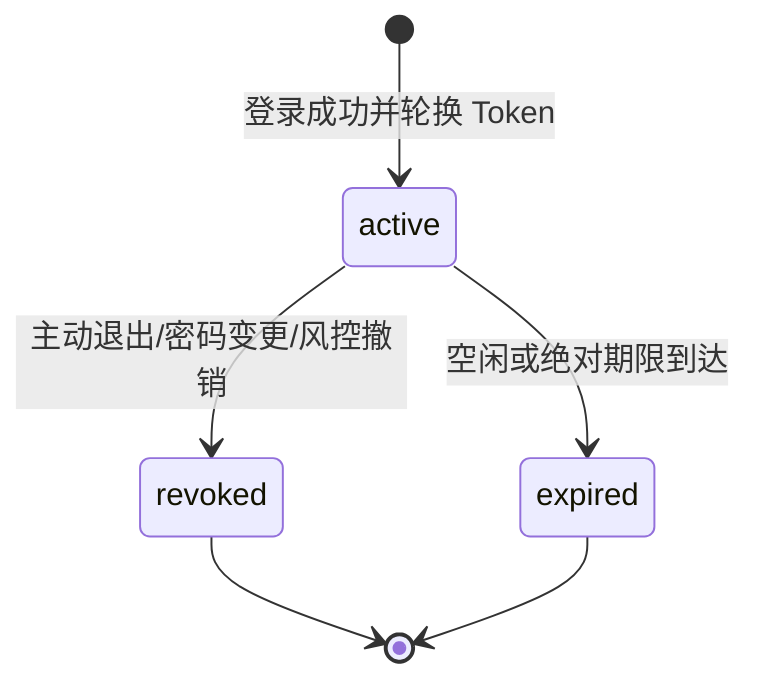
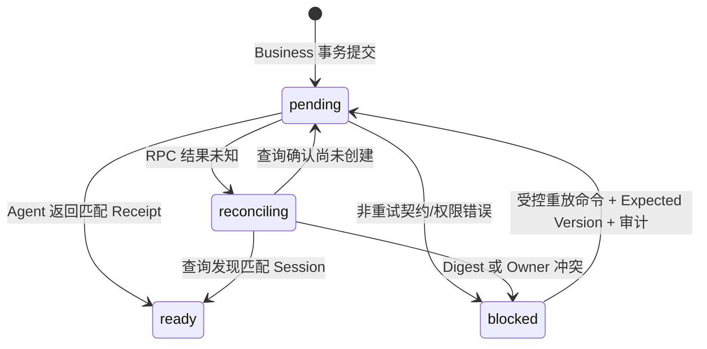
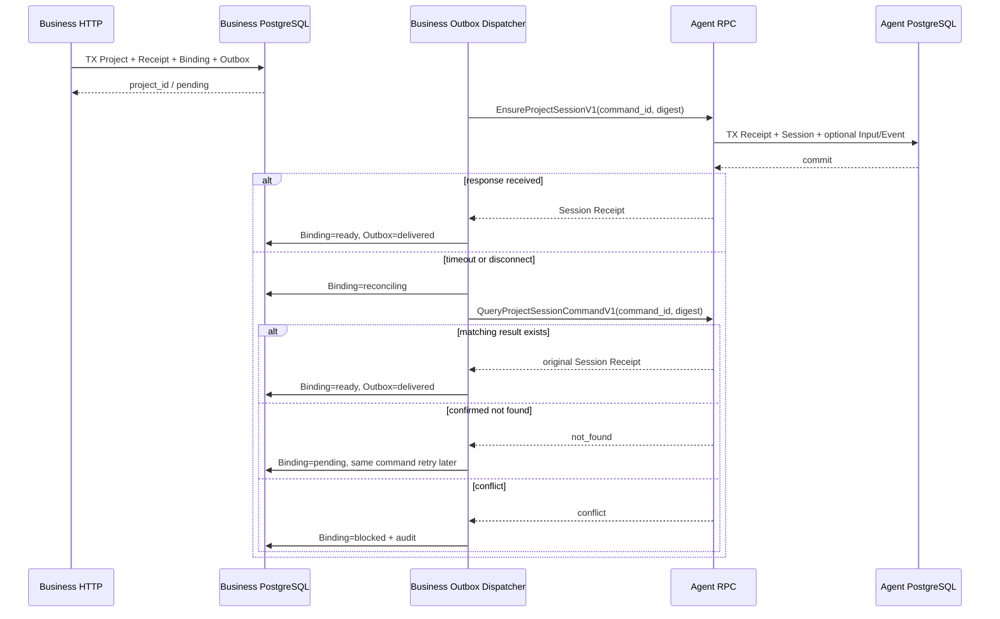

# Business 鉴权与 Project 快速创建基础评审包

> 文档状态：W0 冻结子集已批准；其余候选仍待专项评审
>
> 建议契约版本：`business.auth-project.v1alpha1`
>
> 更新日期：2026-07-14
>
> 适用范围：SMK-001、SMK-002、SMK-003 的 Business 侧，以及 Business 与 Agent 的 Session 初始化边界
>
> 实现门禁：W0 已冻结范围以 [W0 身份与工作台契约 v1](../cross-module/w0-identity-workspace-contract-v1.md) 为准，允许实现已批准的 Migration/Domain/Repository；Auth HTTP、Agent RPC、Dispatcher 和 Local Smoke Fixture 仍受后续批次门禁，不能把持久化基础当作真实登录能力。

## 1. 评审目标

本评审包回答从当前基础 Runtime 推进到首条可冒烟纵切时，Business 侧必须先固定的六个问题：

1. 浏览器登录态如何成为服务端可信身份，且前端不保存 Bearer Token。
2. 普通用户和管理员如何共享账号事实，又不依赖客户端角色判断完成授权。
3. Project 所有权、生命周期和最近运行摘要由谁维护。
4. 快速创建如何在 100 次并发重放下只创建一个 Project。
5. Business 与 Agent 使用独立数据库时，如何最终只创建一个默认 Session 和可选首 Input。
6. Agent RPC 响应丢失时如何核对 Unknown Outcome，而不是使用新键盲目重试。

本文不设计注册、找回密码、实名认证、账号注销、完整管理端资源、Graph Tool、计费、故事板或资产领域。

## 2. 已读取的规范和需求依据

本次评审已完整读取：

- `.agents/skills/dora-server-development/SKILL.md`；
- Business Service 开发规范；
- Agent Service 开发规范；
- `docs/requirements/common-requirements-baseline.md`；
- `docs/requirements/user-requirements-overview.md`；
- `docs/requirements/server-requirements-overview.md`；
- `docs/requirements/admin-requirements-overview.md`；
- `docs/requirements/full-function-smoke-development-plan.md`；
- Foundation RPC、持久化基础和全功能冒烟工程设计。

关键需求约束：

- Business 是 User、Auth、Project 和管理员权限的权威 Owner。
- Agent 是 Session、Input、Turn、Receipt 和 EventLog 的权威 Owner。
- Project 生命周期与最近运行摘要是两个独立状态轴。
- 快速创建必须在 `P95 <= 1s` 返回 `project_id`；Agent 暂不可用时仍可按 `project_id` 打开工作台。
- 同一请求标识和同一语义并发 100 次，只能产生一个 Project、默认 Session、首消息和 Agent Input。
- 空白提示词只能创建 Project、Session 和空工作台，不创建 Input、Turn、Invocation 或扣费。
- 客户端或模型提交的 `user_id`、角色和权限均不可信。
- PostgreSQL 是权威来源；Redis 只负责缓存和唤醒；etcd 只负责服务发现。
- 跨 Module 不得 import 其他 Module 的 `internal` 包，也不得跨库事务或跨库 JOIN。

“一次业务提交中建立 Project、Session、首消息和 Input”与“三个独立数据库、Agent 暂不可用仍返回 Project”不能解释为数据库原子提交。W0 已确认成功语义为：Business 原子接受 Project 与唯一初始化命令，Agent 最终按同一命令只建立一次 Session/Input；前端在两者之间展示 `creation_status=provisioning`。

## 3. 当前仓库事实

截至本文取证时，当前分支的事实如下：

| 范围 | 当前事实 | 影响 |
| --- | --- | --- |
| Business HTTP | 只有 `/livez`、`/readyz` | 尚无 `/api/v1` 业务 Router、错误包络、认证或 Project Handler |
| Business RPC | 只有已冻结的只读 `FoundationProbe` | 尚无 Auth Introspection，也没有 Agent Session 命令 Client |
| Business Schema | 已新增 W0 User、Email Identity、Password Credential、Web Session、Project、Idempotency Receipt、Binding 与加密 Outbox 表 | Auth UseCase/Session Repository/Dispatcher 尚未实现，不能据表结构宣称登录或跨服务编排可用 |
| Agent HTTP | 只有健康接口 | 尚无 Session/Workspace/SSE API |
| Agent RPC | 当前无 RPC Server | Business 无法通过公开契约创建或核对 Session |
| Agent Schema | 已新增 W0 Session、空 Skill Snapshot、Message/Input、Lease、Command Receipt 和 EventLog 表及 Ensure Repository | 尚无 Session IDL/RPC、Workspace/SSE 或 Runner |
| 前端认证 | 已有严格 Auth v1 四态 `AuthSessionProvider`，凭据预期由 HttpOnly Cookie 管理 | 页面登录按钮仍未接真实服务端 Handler |
| 前端 API | 已有统一 API Client、Auth/QuickCreate/Bootstrap Client、`credentials: include`、401 事件和 `stream.reset` | 后端正式 Auth/Project API 与页面接线尚未完成 |
| 设计状态 | W0 身份/工作台契约已冻结；AIGC、Smoke Runner 与六个 Graph Tool 仍待各自评审 | W0 冻结不能推导其他领域契约已通过 |

因此 SMK-001、SMK-002、SMK-003 当前都仍是“待实现”，不能用现有 UI Mock 或 Foundation Probe 计入通过证据。

## 4. 推荐纵切范围

### 4.1 SMK-001：先拆成认证基础和真实 RBAC 验收

第一阶段建议只交付：

- 使用预置 Smoke Fixture 账号执行真实密码登录；
- 浏览器使用服务端安全 Cookie 保存登录凭据；
- 刷新后通过服务端 Session Bootstrap 恢复用户展示快照；
- 退出后服务端 Session 立即失效，Cookie 清除；
- Business HTTP 中间件能生成可信 `AuthenticatedPrincipal`；
- Agent 能通过已认证的 Business RPC 解析同一 Web Session；
- 权限 Guard、拒绝审计和资源所有权校验有单元/集成测试。

以下内容不能在这一纵切中冒充已经完成：

- 生产注册、找回密码、改密、MFA、异常登录和账号恢复；
- 最终管理员角色、数据范围和双人复核规则；
- 仅靠“登录响应里返回了 admin 字段”证明管理员权限隔离；
- 仅为了测试而新增生产 `/admin/access-probe` 后门。

SMK-001 的“普通用户/管理员权限隔离”必须最终命中至少一个真实管理资源 API。首条 Auth 纵切只能关闭登录、退出和公共 Guard 基础；完整 SMK-001 仍需绑定后续真实管理端业务接口。

### 4.2 SMK-002：带首提示词快速创建

最小业务结果：

- Business 事务内只创建一个 Project、一个快速创建 Receipt 和一个 Session 初始化 Outbox Command；
- HTTP 在 Business 事务提交后返回稳定 `project_id`，不等待 Agent RPC；
- Agent 按 Outbox Command 幂等创建一个 Session、一个 `UserMessage` Input 和必要的首事件；
- Agent 的 PostgreSQL 扫描负责在 Redis 唤醒丢失时恢复 Input；
- 前端按 `project_id` 立即进入工作台，Session 尚未就绪时显示明确的初始化状态；
- 同键同语义并发 100 次均返回同一个 `project_id`；Agent 最终只有一个 Session 和一个 Input。

### 4.3 SMK-003：空提示词快速创建

最小业务结果：

- 空字符串、纯空白、只含换行或规范化后为空均按“无首提示词”处理；
- Business 仍创建 Project、Receipt 和 Session 初始化 Outbox Command；
- Agent 只创建默认 Session，不创建 Input、Turn、Invocation、Operation 或任何扣费事实；
- Project 的最近运行摘要为 `idle`；工作台显示空 Chat 状态。

## 5. 鉴权和安全会话推荐方案

### 5.1 选择服务端不透明 Web Session

本评审推荐首版使用服务端不透明 Session，而不是把 Access Token 存入前端：

- 登录成功后生成至少 256 bit CSPRNG 随机 Token；
- 浏览器只通过 HttpOnly Cookie 持有原始 Token；
- Business PostgreSQL 只保存 Token 摘要，不保存原始值；
- 前端内存只保存用户展示 DTO 和 CSRF Token，不写入 LocalStorage/SessionStorage；
- 用户禁用、退出、密码变更或风险处置可以立即撤销 Session；
- Agent 不读取 Business 数据库；同源 Gateway 将原始 Cookie 交给 Business 解析，并只向 Agent 注入短期、受众绑定的内部身份断言。

生产 Cookie 候选：

| 属性 | 推荐值 |
| --- | --- |
| Name | `__Host-dora_session` |
| Secure | 必须为 `true` |
| HttpOnly | 必须为 `true` |
| SameSite | `Lax`，若后续跨站部署需单独安全评审 |
| Path | `/` |
| Domain | 不设置 |

本地 HTTP Smoke 不能伪造 `__Host-` 安全语义。建议使用明确不同的 `dora_local_session`，只允许 localhost/local-smoke Profile；生产配置缺少 TLS 或试图使用本地 Cookie 名时失败启动。

### 5.2 CSRF、Origin 和 CORS

- 所有 Cookie 认证的写请求同时校验 Origin/Referer Allowlist 和 `X-CSRF-Token`。
- CSRF Token 与 Web Session 绑定；`GET /api/v1/auth/session` 可返回可轮换的内存 Token，但它不是身份 Bearer Token。
- 登录后轮换 Session，防止 Session Fixation。
- CORS 只允许配置中的第一方 Origin，并允许凭据；生产禁止通配符。
- Agent 的写 API 同样必须执行 CSRF 校验，不能因为它使用另一端口而省略。

### 5.3 密码和登录失败

- 密码使用 Argon2id；算法、参数、盐、Hash 和 Credential Version 分字段保存。
- Argon2id 参数来自版本化安全配置，不散落在 Handler 或测试常量中。
- 用户不存在、密码错误、用户被禁用对外统一返回 `AUTH_INVALID_CREDENTIALS`，避免账号枚举；内部审计保留稳定原因码。
- 使用固定 Dummy Hash 使不存在账号的验证路径不会明显更快。
- 登录按规范化账号和来源地址执行有界限流与退避；Redis 故障时的 fail-open/fail-closed 策略必须由安全评审决定。
- Password、Cookie、Token、CSRF、完整邮箱和原始来源地址不得进入普通日志或 Trace。

### 5.4 Session 状态候选



空闲期限、绝对期限、并发设备数量、续期窗口和“退出全部设备”仍属于详细 Auth PRD，本文不擅自冻结数值。

### 5.5 Agent 的身份解析

原始 Cookie/Session Token 不进入 Agent 领域 DTO 或普通内部 RPC。推荐由同源 Gateway 完成以下步骤：

1. 只把浏览器 Cookie、CSRF Token、Method 和 Origin 交给 Business-owned Auth Resolver；
2. Business 校验 Session、账号状态、CSRF、Origin 和权限后签发极短期内部身份断言；
3. Gateway 通过受认证内部连接向 Agent 注入该断言，浏览器不能直接设置可信 Header；
4. Agent 校验签名、Issuer、Audience、Expiration、Not-Before、Method/Path 绑定和 Session Version 后构造 Command Context。

身份断言只包含 `principal_id`、`session_id/session_version`、最小 `role/permission`、请求绑定摘要和过期时间，不包含原始 Cookie、CSRF Token、密码或完整权限策略。Assertion Key 轮换、最大 TTL、退出/禁用后的失效上限以及 SSE 长连接重新鉴权方式必须由安全评审冻结。

生产 Gateway、Business Auth Resolver 和 Agent 之间必须使用服务身份认证、TLS、最小网络权限和防 Header 伪造配置；当前 Foundation 明文 RPC 不能承载认证 Secret 或身份断言。

## 6. User、管理员和 Project 所有权

### 6.1 User 与管理员身份

- `user_account` 是个人账号权威事实；本期不建立企业、组织、团队或 Tenant。
- 管理员不是另一套登录账号真源，而是 User 绑定内部 Role/Permission 后形成的管理身份。
- 服务端权限判断使用稳定 Permission Key；前端角色只控制展示，不能作为授权证据。
- 数据范围必须独立于 Role 定义；管理员查看敏感字段、导出或越权拒绝都要审计。
- 最终 Role 划分、数据范围和双人复核额度仍是管理需求的开放问题，RBAC Migration 不应在该问题关闭前冻结。

### 6.2 Project 所有权

- `project.owner_user_id` 是 Business 内的逻辑关联字段，不创建数据库物理外键。
- Project 创建时 Owner 只来自 `AuthenticatedPrincipal`；HTTP Request、Agent Intent 和模型输出均不得包含或覆盖 `user_id`。
- Project/Workspace Bootstrap 查询使用 `project_id + authenticated_user_id` 做服务端所有权判断。
- 普通用户读取他人 Project 统一投影为 `PROJECT_NOT_FOUND`，避免泄露对象存在性。
- Agent Session 同时保存可信 `user_id/project_id`，但它们是跨 Module 契约携带的逻辑关联，不改变 Project 的 Business Owner。
- 本期不支持共享、协作、组织所有权或管理员直接修改 Project。

## 7. Quick Create HTTP 候选契约

### 7.1 Endpoint

```text
POST /api/v1/projects:quick-create
Idempotency-Key: <required>
X-CSRF-Token: <required>
Content-Type: application/json
```

`projects:quick-create` 已冻结，用于明确表达该命令会建立跨 Project/Session 的初始化流程；不得再发布同义的 `POST /api/v1/projects + creation_mode` 入口。

### 7.2 Request DTO

```json
{
  "initial_prompt": "请制作一支城市夜景短片"
}
```

| 字段 | 约束 |
| --- | --- |
| `initial_prompt` | 可缺省或为 `null`；UTF-8；NFC 后上限 65,536 字节；未知 JSON 字段拒绝 |

v1 最小 DTO 不接收 `user_id`、`project_id`、`session_id`、`title`、价格、预算、角色或可信 Skill Snapshot。建议把“初始启用 Skill 集合”冻结为空集合，以便 SMK-002/003 不依赖尚未实现的 Skill 领域；若产品要求默认启用系统 Skill，必须先完成 Skill 发布查询与 Session Snapshot 契约。

Prompt 规范化顺序已冻结：

1. 校验 UTF-8 和长度；
2. Unicode NFC；
3. 全文均为 Unicode 空白时编码为语义 `initial_prompt = null`，不得创建 Input；
4. 非空正文保留首尾空白。

不得压缩中间空格、改变大小写或改写正文，否则会改变用户语义。

### 7.3 Response DTO

首次提交建议返回 `201 Created`，同键重放返回 `200 OK`；两者使用相同 DTO：

```json
{
  "project_id": "019...",
  "session_id": null,
  "input_id": null,
  "creation_status": "provisioning",
  "workspace_ref": "/projects/019.../workspace",
  "request_id": "019..."
}
```

Quick Create 不等待 Agent，因此 provisioning 响应中的 `session_id/input_id` 允许为空；空 Prompt 的负向状态通过 Bootstrap 与数据库证据验证。需求只要求在 1 秒内返回 `project_id`，前端随后通过 Project Bootstrap 获取 Session 状态。

首次接受固定返回 `201`，同键同语义重放固定返回 `200`；100 个并发响应都必须成功并返回同一 `project_id`。

### 7.4 Workspace Bootstrap

```text
GET /api/v1/projects/{project_id}/bootstrap
```

输出 Project 展示字段、`creation_status`、可选 `session_id/input_id`、Business 资源 Snapshot 引用和 Agent Session/Event API 版本提示。该接口只投影 Business 已确认的绑定，不跨库 JOIN，也不在一次请求中先调 Agent 再猜测权威状态。

### 7.5 稳定错误

| HTTP | Code | 语义 |
| --- | --- | --- |
| 400 | `INVALID_ARGUMENT` | JSON、Prompt 或 Header 格式错误 |
| 401 | `UNAUTHENTICATED` / `SESSION_EXPIRED` | 缺少或失效的 Web Session |
| 403 | `CSRF_REJECTED` | Origin 或 CSRF 校验失败 |
| 409 | `IDEMPOTENCY_CONFLICT` | 同一 Key 对应不同规范化语义 |
| 404 | `PROJECT_NOT_FOUND` | Project 不存在或不属于当前用户 |
| 429 | `RATE_LIMITED` | 登录或创建频率超过受控阈值 |
| 503 | `PROJECT_PROVISIONING_BLOCKED` | Workspace Bootstrap 表明初始化需人工/系统恢复；Quick Create 已提交成功时不回滚 Project |

错误包络统一为 `code`、`message`、`request_id` 和可选 `details`，不得返回 SQL、RPC 地址、Prompt 或内部堆栈。

## 8. 幂等和语义摘要

### 8.1 Key 规则

- `Idempotency-Key` 必填，建议限制为 16～128 个可打印 ASCII 字符并使用明确白名单。
- 作用域为 `(authenticated_user_id, command_type, key_digest)`。
- 数据库只保存 Key 摘要，不把原始值写入普通日志。
- 客户端主动再次创作必须生成新 Key；网络重试和重复点击必须复用原 Key。

### 8.2 Semantic Digest

使用固定版本的 Canonical DTO 计算 SHA-256：

```text
schema = project.quick_create.semantic.v1
owner_user_id = authenticated principal
prompt = null | normalized UTF-8 bytes
initial_enabled_skill_ids = []
```

同 Key、同 Digest：返回已创建 Project 的当前安全投影；同 Key、不同 Digest：返回 `IDEMPOTENCY_CONFLICT`，不得覆盖 Project 或重新创建 Session。

### 8.3 Business 单事务

一次 Quick Create Business 事务必须原子写入：

1. `project`；
2. `project_agent_binding` 的 `pending` 记录；
3. `project_quick_create_receipt`；
4. `business_outbox` 中唯一的 Agent Session 初始化 Command。

事务内禁止 Agent RPC、Redis 或其他外部 I/O。并发冲突依赖数据库唯一约束收敛，不能先查再插；未拿到创建权的请求在首事务提交后读取 Receipt，并按 Digest 返回重放或冲突。

## 9. Project 与初始化状态机

### 9.1 Project 两个状态轴

Project 生命周期沿用需求基线：

```text
active / archived / trash / deleted
```

最近运行摘要沿用需求基线：

```text
idle / queued / running / waiting_user / waiting_async /
succeeded / partial_failed / failed / cancelled
```

Quick Create 的初值：

| 场景 | lifecycle | recent_run | initial_prompt |
| --- | --- | --- | --- |
| 有 Prompt | `active` | `queued` | `pending` |
| 空 Prompt | `active` | `idle` | `absent` |

### 9.2 Session Provisioning 状态



`blocked` 不删除 Project；前端仍能按 `project_id` 打开并展示可恢复错误。重放必须复用原业务语义，不能生成第二个 Project 或绕过冲突创建第二个 Session。

## 10. Business -> Agent Session RPC 建议

### 10.1 所有权和 IDL

Session 语义由 Agent 拥有，建议 IDL Source 位于：

```text
agent/api/thrift/session/v1/session.thrift
```

Agent 和 Business 各自在本 Module 生成代码，禁止互相 import。Agent 提供 Kitex RPC Server 并通过独立服务名注册 etcd；Business 作为 Consumer 使用显式 Timeout，写操作关闭框架自动重试。

### 10.2 EnsureProjectSessionV1 候选

| 请求字段 | 语义 |
| --- | --- |
| `schema_version` | `agent.session-bootstrap.v1` |
| `request_id` | 单次 RPC Attempt 的关联 ID |
| `command_id` | Business Outbox ID；所有技术恢复保持不变 |
| `semantic_digest` | Project、Owner、Prompt Presence/Content 和契约版本摘要 |
| `project_id` | Business Project ID |
| `owner_user_id` | 由 Business Auth Principal 冻结的可信 User ID |
| `creation_source` | 固定 `quick_create` |
| `skill_snapshot_mode` | W0 固定 `empty`；未来必须携带已发布快照引用与摘要 |
| `initial_user_message` | Optional；空 Prompt 时字段缺省；有值时包含受限正文 |
| `occurred_at` | Business 事务冻结的 UTC 时间 |

Agent 必须按冻结的 Canonical Schema 独立规范化请求并重算 `semantic_digest`，不能只信任 Business 传入摘要。Agent 是 Session/Input ID Owner，首次处理时生成 UUIDv7；同一 `command_id + semantic_digest` 重放返回原 Session/Input Receipt，不生成新 ID。同一 `command_id` 不同 Digest、同一 `project_id` 不同 Owner 或不同 Session 语义必须稳定冲突。

| 响应字段 | 语义 |
| --- | --- |
| `session_id` | Agent 权威 Session ID |
| `initial_input_id` | Optional；空 Prompt 必须为空 |
| `initial_input_status` | `absent` 或 `accepted` |
| `receipt_digest` | Agent 持久化结果摘要 |
| `created_at` | Agent 权威创建时间 |

### 10.3 Unknown Outcome

Business Outbox Dispatcher 是该跨服务命令的唯一重试 Owner：



禁止行为：

- RPC Timeout 后立即生成新 `command_id` 重试；
- 在 Business 事务内等待 Agent；
- Agent 先成功后因 Business 状态更新失败而创建第二个 Session；
- 把 Redis 消息当作 Session/Input 权威事实；
- Business 直接写 Agent 数据库或 Agent 直接写 Business Project 表。

### 10.4 首 Prompt 的敏感持久化

可靠投递意味着 Business Outbox 在 Agent 接收前必须暂存首 Prompt。推荐：

- Outbox 只保存加密后的 Payload、Key Version、Nonce 和 Payload Digest；
- 原始 Prompt 不进入 JSON 日志、Trace、Metric Label 或普通错误；
- Agent 成功并达到保留策略后清除可解密正文，只保留非敏感 Receipt/Digest；
- Local Smoke 使用独立测试 Key，生产 Key 来自 Secret/KMS，不写入 Git；
- 数据访问、留存和删除规则在 Auth/Privacy 设计中评审。

如果项目不准备在 M2 引入受控加密能力，必须明确接受受限 PostgreSQL 明文暂存的安全风险并经安全评审；不能默认为“Outbox Payload 不算 Prompt 存储”。

## 11. Migration、索引和中文 COMMENT 候选

所有表位于 `business` Schema，Migration 只能位于 `business/migrations`。禁止 `FOREIGN KEY`、`REFERENCES` 和数据库级联；所有逻辑关联由 Service 校验并建立必要普通索引。

### 11.1 建议拆分

| Migration | 候选表 | 前置门禁 |
| --- | --- | --- |
| Auth/RBAC | `user_account`、`user_login_identity`、`user_password_credential`、`auth_web_session`、RBAC 表、`security_audit_event` | 注册登录详细 PRD、安全 Cookie/CSRF、Role/Data Scope 评审 |
| Project Quick Create | `project`、`project_agent_binding`、`project_quick_create_receipt`、`business_outbox` | Quick Create HTTP、Agent Session RPC、敏感 Outbox Payload 评审 |

Migration 与依赖代码必须在同一 PR；若进入共享环境后禁止修改，修正使用新 Migration。

### 11.2 关键列和约束

| 表 | 关键列/约束 | 主要查询索引 |
| --- | --- | --- |
| `user_account` | UUIDv7 `id`；`user_type`；`status`；`version`；UTC 时间 | 状态治理和管理员分页的稳定 Keyset 索引 |
| `user_login_identity` | `user_id` 逻辑关联；类型；规范化标识；验证状态 | 唯一 `(identity_type, normalized_identifier)` |
| `user_password_credential` | `user_id`；Argon2id 算法/参数/盐/Hash/版本 | `user_id` 唯一；Credential 不参与普通 User 查询 |
| `auth_web_session` | Token Digest；`user_id`；状态；Idle/Absolute Expiry；Version | Token Digest 唯一；`(status, idle_expires_at, id)` 清理索引 |
| RBAC | Role、Permission、User-Role、Role-Permission 和 Data Scope | 业务唯一 Key；按 User/Role 固定数量批量读取，禁止 N+1 |
| `security_audit_event` | Append-only；Actor、Action、Result、Target、Reason、Request ID、时间 | 按 Actor/Target/时间的 Keyset 索引；不得保存 Secret |
| `project` | Owner；Title；生命周期；最近运行；首 Prompt 状态；Version | `(owner_user_id, lifecycle_status, updated_at DESC, id DESC)` |
| `project_agent_binding` | `project_id`；`command_id`；可选 Session/Input ID；Provisioning 状态；Version | `project_id` 唯一、`command_id` 唯一、Session ID 非空时唯一 |
| `project_quick_create_receipt` | User；Key Digest；Semantic Digest；Project ID；响应摘要 | 唯一 `(user_id, command_type, key_digest)` |
| `business_outbox` | Event ID/Type/Version；Aggregate；幂等键；加密 Payload；状态；Available/Lease/Attempt | 唯一 `(event_type, idempotency_key)`；扫描 `(status, available_at, id)` |

### 11.3 COMMENT 要求

每张表和每个字段在同一个 Up Migration 中使用中文 `COMMENT ON`。至少明确：

- `owner_user_id`：“Project 所有者用户标识，为 Business 内逻辑关联，不设置数据库物理外键约束”；
- `agent_session_id`：“Agent Module 权威 Session 标识，跨数据库逻辑关联，不设置数据库物理外键约束”；
- `key_digest`：“客户端幂等键摘要，不保存原始幂等键”；
- `semantic_digest`：“规范化快速创建语义摘要，用于同键异义冲突判断”；
- 状态列：列出全部英文稳定代码及含义；
- 时间列：明确使用 UTC；
- 加密列：说明内容分类、Key Version 和不得进入普通日志。

CI 继续复用现有 Catalog 门禁验证中文 COMMENT 和 `contype != 'f'`，并增加 Migration 静态扫描。

## 12. 推荐实现包和提交顺序

### 12.1 包路径

```text
business/
├── api/
│   ├── openapi/auth/v1/
│   ├── openapi/project/v1/
│   └── thrift/auth/v1/                 # Business-owned Web Session 解析
├── internal/
│   ├── user/                           # User Entity、状态和 Repository 接口
│   ├── auth/                           # Login/Logout/Resolve、Session、权限 Guard
│   ├── project/                        # Project、QuickCreate UseCase、DTO
│   ├── outbox/                         # Business Outbox 接口和有界 Dispatcher
│   ├── transport/http/                 # Router、Middleware、Handler、错误映射
│   ├── transport/rpc/                  # Auth RPC Provider
│   └── adapter/
│       ├── postgres/                   # 各消费方 Repository 实现
│       └── agentrpc/                   # Agent Session Bootstrap Client
├── migrations/
└── tests/{integration,contract}/

agent/
├── api/thrift/session/v1/              # Agent-owned IDL Source
└── kitex_gen/...                        # Agent 与 Business 各自生成
```

现有 `internal/httpserver` 继续做 HTTP 生命周期 Owner；业务 Router 与 Handler 下沉到 `internal/transport/http` 后由 Bootstrap 显式注入，避免把业务判断继续堆进 Server 构造函数。

### 12.2 建议 PR 顺序

1. `docs(auth-project)`：关闭本文决策项并冻结 Auth HTTP/Resolve RPC、Quick Create HTTP、Session Bootstrap RPC。
2. `feat(auth)`：User/Credential/Web Session/RBAC Migration、Repository、Login/Session/Logout、审计与测试。
3. `feat(project)`：Project/Receipt/Binding/Outbox Migration、QuickCreate UseCase 和 Workspace Bootstrap。
4. `feat(agent-rpc)`：Agent Session Bootstrap RPC、Agent Receipt/Session/Input 事务和契约测试。
5. `feat(outbox)`：Business 有界 Dispatcher、Unknown Outcome Query 和恢复测试。
6. `feat(frontend)`：真实 Session Bootstrap、Quick Create、Project 路由和初始化状态替换 Mock。
7. `test(smoke)`：SMK-001/002/003 API + UI Scenario、Fixture 和 Evidence。

Auth 和 Project 可以分别评审，但 Quick Create 的端到端完成依赖 Agent Session 文档及实现，不能把 Business 事务提交等同于 SMK-002/003 已通过。

## 13. 测试和 Evidence 清单

### 13.1 Auth

- Argon2id 正确/错误密码、参数升级和 Dummy Hash 路径；
- Cookie 属性、生产/本地 Profile 隔离、Session Fixation 轮换；
- GET Session 刷新恢复、单设备退出、过期、禁用用户和重复退出；
- CSRF 缺失/错误、Origin 不匹配、CORS Allowlist；
- 普通用户访问真实管理员资源返回 403 且审计，管理员仅获得授权数据范围；
- 日志和 Trace 不出现 Password、Cookie、Token、CSRF 或完整个人信息；
- Gateway/Business Auth Resolver 对失效 Session、撤销 Version 和未认证调用方失败关闭；Agent 拒绝伪造、过期或 Audience 不匹配的身份断言。

### 13.2 Quick Create Domain/Repository

- Prompt 规范化：null、空串、Unicode 空白、换行、NFC、最大长度和未知字段；
- 同一 Key/同一 Digest 单线程和并发 100 次只创建一个 Project/Receipt/Outbox；
- 同一 Key/不同 Digest 稳定 409，原 Project 不改变；
- 不同 Key/相同 Prompt 创建两个用户主动业务操作；
- 事务任一步失败时 Project、Binding、Receipt、Outbox 全部回滚；
- Project Owner 来自 Principal，客户端同名 `user_id` 被未知字段校验拒绝；
- 他人 Project 返回 404；列表 1/10/100 条时 SQL 数量固定，无 N+1；
- UUIDv7、UTC、Version/CAS 和关键 `RowsAffected` 检查。

### 13.3 Cross-module/Unknown Outcome

- Agent 首次处理生成一个 Session；同命令重放返回同 Receipt；
- 有 Prompt 时恰好一个 Input，空 Prompt 时零 Input/Turn/Invocation/Charge；
- Agent 提交后响应断连，Business 查询原结果并标记 ready；
- Agent 未提交即超时，查询 not-found 后复用同命令重试；
- 同 Command 不同 Digest、同 Project 不同 Owner 均冲突并进入 blocked；
- Business 状态更新失败后重投，不创建第二个 Session；
- Redis 不可用时 Agent PostgreSQL 扫描在需求窗口内恢复 Input；
- RPC IDL/生成代码/Mapper/错误码兼容测试；
- Outbox 加密正文不进入日志，交付后按保留策略清理。

### 13.4 Migration 和质量门禁

- PostgreSQL 16 空库 Up、Down、Up 和上一版本升级；
- 每张表/每字段中文 COMMENT；Schema 不含物理外键；
- `GOWORK=off` 下 Business/Agent 分别执行 mod verify、vet、shuffle test、race 和 build；
- OpenAPI/Thrift 重新生成后无差异；
- 幂等并发测试使用真实 PostgreSQL，不使用 SQLite。

### 13.5 Smoke Evidence

| Smoke | 必备 Evidence |
| --- | --- |
| SMK-001 | 登录/退出 HTTP、Cookie 属性、Session 权威记录、真实 Admin API 允许/拒绝、拒绝审计、UI 路由结果 |
| SMK-002 | 100 个 HTTP 响应的同一 Project ID、Business 四类唯一记录、Agent 唯一 Session/Input、首 Event、UI 打开工作台 |
| SMK-003 | Project/Session 存在，Agent Input/Turn/Invocation/Charge 数量均为 0，工作台空状态 |

## 14. 阻塞项和主 Agent 决策请求

| ID | 阻塞/决策 | 推荐 | 未关闭的影响 |
| --- | --- | --- | --- |
| AP-BLK-001 | 注册登录详细 PRD 当前明确缺失 | **W0 子集已关闭**：只实现 Email+Password、Session 生命周期；找回/改密仍后续，Smoke 账号由受控 Fixture Seeder 创建 | Auth UseCase/HTTP/Seeder 完成前不能宣称 SMK-001 完成 |
| AP-BLK-002 | 管理员 Role、Permission、Data Scope、双人复核阈值未定 | 先冻结通用 RBAC 数据模型与首个真实 Admin API Permission Key | 完整 SMK-001 无真实越权对象可验收 |
| AP-DEC-001 | Cookie Session、JWT 或 Gateway | **已关闭**：Business-owned Opaque Cookie Session + 同源 Gateway/Business Resolver + Agent 短期身份断言 | 下一批实现 Resolver/Assertion，不改冻结方向 |
| AP-DEC-002 | Quick Create HTTP 路径 | **已关闭**：`POST /api/v1/projects:quick-create` | 下一批只实现该唯一入口 |
| AP-DEC-003 | 首次/重放 HTTP Status | **已关闭**：首次 201、重放 200，DTO 相同 | 并发 UI/API 测试按此断言 |
| AP-DEC-004 | 默认启用 Skill 集合 | **已关闭**：SMK-002/003 冻结显式空集合 | 非空 Published Snapshot 走后续版本化契约 |
| AP-DEC-005 | Session Bootstrap IDL Owner 和方向 | **已关闭**：Agent owns IDL；Business Outbox 调 Agent RPC | 下一批由 Agent 生成 IDL/Server |
| AP-DEC-005A | “同一业务提交”的跨数据库成功语义 | **已关闭**：Business 原子接受并立即返回 Project；Agent 最终恰好一次完成 Session/Input | 不引入跨 PostgreSQL 原子事务 |
| AP-BLK-003 | Agent Session/Input/Receipt/Event Schema 尚未评审冻结 | **已关闭**：W0 最小表、状态、事件和摘要已冻结并实现 | 仍不得把 Business Project 提交视为 Agent 已 ready |
| AP-DEC-006 | Unknown Outcome | **已关闭**：先 Query 原 Command Result，再用同 Command 重试 | Dispatcher 必须按该顺序实现 |
| AP-BLK-004 | 首 Prompt 在 Business Outbox 的加密、Key 和保留策略未定 | **Schema 子集已关闭**：AES-256-GCM 暂存，Agent Receipt 后清除正文并记录 `payload_cleared_at` | 下一批仍需实现 KMS Adapter 与清除操作 |
| AP-BLK-005 | Agent 外部 HTTP 如何统一认证/CSRF | 原始 Cookie 仅由 Gateway/Business Resolver 解析，Agent 本地验证短期请求绑定断言 | Agent Session/SSE 仍可能成为未认证入口 |
| AP-BLK-006 | 登录/Quick Create 限流阈值和 Redis 故障策略未定 | 安全评审冻结策略配置，数值不写死代码 | 暴力登录和创建滥用边界不完整 |
| AP-DEC-007 | Project 临时标题 | **W0 已关闭**：无论 Prompt 是否为空都固定“未命名项目”，不从正文截取 | 后续改名使用独立命令与审计 |
| AP-BLK-007 | Smoke Fixture Seeder 的运行边界 | 仅 local-smoke Profile，独立启动命令/权限，生产不注册路由 | 不能用测试后门绕过真实 Auth |

## 15. 评审结论

当前结论：**W0 Persistence/Domain 已实现并通过门禁，但完整纵切仍未达到可执行 Smoke 状态**。

可以确认的架构原则：

- Quick Create 必须先提交 Business 本地事务并返回 Project，不等待跨库 RPC；
- 默认 Session 通过 Business Outbox 到 Agent 幂等命令最终建立；
- RPC Unknown Outcome 必须查询原命令结果；
- User/Project 身份只来自 Business Auth Principal；
- 空 Prompt 不得生成 Agent Input；
- Business 与 Agent 各自维护本 Module 表和 Migration，禁止跨库事务和物理外键。

进入下一批 Transport 编码前仍需要：

1. 实现已冻结的 Auth Cookie/CSRF UseCase 与 HTTP，不自行增加注册/找回能力；
2. 由 Agent Owner 生成 Ensure/Query IDL 和 Server，再实现 Business Dispatcher；
3. 实现首 Prompt KMS Adapter、交付确认清除和脱敏审计；
4. 为 SMK-001 后半段选择首个真实管理员资源 API，完整 Data Scope 留在 W5；
5. 完成 Workspace/SSE 与页面接线后再建立 Smoke Runner。
