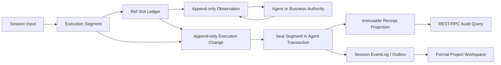

# 全功能冒烟架构与推进审计（2026-07-15）

> 状态：Architecture Audit / Recommended Baseline，尚未替代任何已有 Approved 契约
>
> 事实基线：`cc4414b0`（2026-07-15）
>
> 适用范围：`business/`、`agent/`、`worker/`、正式 Project Workspace 前端与全功能冒烟
>
> 目标：在不混淆“当前已实现”和“目标设计”的前提下，给出从当前基线推进到首条全功能纵切及后续全量冒烟的可执行架构方案
>
> 非目标：本文不批准尚处于 Draft/Review Ready 的 Graph Tool、Receipt、A2UI、Billing、Job 或支付契约，也不授权修改已发布 Migration

## 0. 审计结论

当前三个独立 Go Module、数据 Owner、PostgreSQL 真源、Outbox/Inbox、Approval 生成新 Continuation Turn、Worker 不拥有业务数据等大方向是正确的，应继续保持。

当前主要问题不是缺少更多契约测试向量，而是契约语料库已经先于生产闭环过度扩张。`W2` 的 Turn、Run、Receipt、Approval、Runner、Graph、A2UI、同步 Tool 计费仍没有生产实现，而最近多个提交主要继续增加 Receipt、Session Lane、Turn Context 与 Approval Consumption corpus。继续沿这条路径扩展，将推迟真实 PostgreSQL、RPC、崩溃恢复和浏览器反馈，并让尚未落库的对象模型越来越难调整。

本文推荐以下决策：

1. 当前 R04 corpus 提交后冻结非必要的新向量；只有真实实现暴露契约歧义或缺陷时才补充。
2. 不等待六个 Graph Tool 同时完成。先冻结共享 Runtime v1 与 `plan_creation_spec`，其余五项保持 `unavailable / DESIGN_REVIEW_PENDING`。
3. 不把当前 Receipt 全量快照直接作为唯一生产存储模型。生产写模型采用归一化 `logical_tool_execution + execution_segment + execution_ref_slot + execution_ref_observation`，每次状态变化追加审计增量；在 segment 封口时，同事务生成不可变 Receipt 兼容投影。
4. 保留现有 R01/R02/R03/R04 corpus，用它验证 Receipt 投影构建器和兼容 DTO，而不是让 corpus 反向决定所有物理表。
5. Business 副作用同时具备 transport command idempotency 与领域唯一约束；不得在两者之间二选一。
6. Approval Consumption v1 采用 Agent PostgreSQL 权威记录加受认证 Query API；暂不引入由同一 Agent 签发和验证信任来源的签名信封。
7. 将同步模型执行所需的最小扣费闭环提前到 W2；支付、充值、收益、冲正和管理宽度仍保留在 W4。
8. 前端只扩展正式 `/projects/:project_id/workspace`，旧 `/workspace` Demo 只能作为迁移参考，不得恢复为生产入口。

## 1. 事实、目标和审批语义

### 1.1 本文用词

| 标记 | 含义 |
| --- | --- |
| `已实现事实` | 能由当前分支的生产代码、Migration、可执行测试或真实冒烟证据证明 |
| `已有设计` | 已有文档或 corpus，但不代表存在生产 DTO、Repository、Migration 或 Runtime |
| `推荐目标` | 本审计建议采用的目标架构；在 Owner 审核前不得写成“已实现”或“Approved” |
| `后续目标` | 全功能冒烟最终需要，但不属于首条纵切的实现前置 |
| `明确延后` | 首条纵切不实现，且不得作为 P0 阻塞项 |

### 1.2 权威来源顺序

发生冲突时，当前事实按以下顺序核验：

1. 当前分支生产代码、只向前 Migration 和真实可执行证据；
2. 三个 Module 的项目级开发规范；
3. 已获得明确 Approved 结论的专项契约；
4. 当前全功能冒烟计划和跨 Module 契约目录；
5. Review Ready、Executable Draft、Design Draft 或 test-only corpus；
6. 历史 Demo 文档和历史分支资产。

历史文档中的“当前实现”不能覆盖当前代码事实。目标设计也不能被描述成已经上线。

## 2. 当前已实现事实

### 2.1 仓库与 Runtime

| 范围 | 已实现事实 | 尚未实现事实 |
| --- | --- | --- |
| 仓库根 | 根目录只负责多 Module 协作，`go.work` 用于本地联调 | 根目录不是生产 Go Module，不能用根 Module 替代三个独立构建 |
| Business Service | W0/W1 身份、Project、Skill、Workspace 接入底座及对应 PostgreSQL/Redis/etcd/HTTP/RPC 基础已存在 | Creation Spec Candidate、同步模型扣费、Agent-facing Decide/Query、完整账务和支付尚未形成 W2 生产闭环 |
| Agent Service | Session/Input/EventLog/Workspace/Skill Snapshot、静态 Tool Catalog 与服务基础已存在 | Turn、Run、Model/Tool Receipt、Approval、Consumption、Checkpoint、Runner Processor、Executable Registry、Graph Tool、A2UI 权威投影均不存在生产实现 |
| Business Worker | 独立 Module、配置、PostgreSQL/Redis/etcd 校验和 health Runtime 已存在 | Operation/Batch/Job claim、lease、Provider、Finalize、terminal outbox 和恢复扫描器尚未实现 |
| 正式前端 | `/projects/:project_id/workspace` 已接 W0.5 Workspace Snapshot/SSE 和不可用 Tool Catalog | 正式 Tool 运行入口、A2UI Card、Approval Action 和 Creation Spec 状态尚未接入 |
| 旧 AIGC 前端 | DEV 下仍保留历史 `/workspace` 与 `/api/aigc/**` 资产 | 旧页面没有匹配的当前生产后端，不是兼容承诺，也不是正式入口 |

当前 Eino 与 Tool 状态必须按三个轴表达，禁止再用一句“已经有 Agent”或“六 Tool 已完成”混写：

| 轴 | 当前事实 |
| --- | --- |
| 依赖 | `agent/go.mod` 已锁 Eino `v0.9.10` 与 DeepSeek Adapter `v0.1.6`；当前只有兼容测试使用，`agent-service` 生产依赖闭包没有 Eino Runtime |
| 产品目录 | 6/6 Tool key 已存在，顺序已冻结 |
| 设计审批 | 0/6 Approved，六份独立设计均仍为 Draft |
| 可执行注册 | 0/6，`agent/internal/graphtool` 不存在，六项 Catalog 全部 `unavailable / DESIGN_REVIEW_PENDING` |

证据位置：

- `agent/internal/bootstrap/bootstrap.go` 当前只装配 Session、Workspace 和静态 Tool Catalog。
- `agent/internal/tool/catalog.go` 明确声明不包含可执行 Definition、Graph、Prompt 或运行入口，六项 Tool 全部不可用。
- `worker/internal/bootstrap/bootstrap.go` 当前只启动基础依赖和 health Runtime。
- `frontend/src/app/router.jsx` 在生产关闭旧 `/workspace`，正式入口为 Project Workspace。
- `frontend/src/features/projects/ProjectWorkspacePage.jsx` 当前只渲染 W0.5 Snapshot 与 Tool Catalog。

### 2.2 当前设计资产

以下内容是有价值的已有设计或测试资产，但不能被当成生产事实：

- R01 Result/Tool Receipt exact schema、ResultCode 与 effect policy corpus；
- R02 Session Lane、Ingress、PostgreSQL、legacy upgrade、Marker 与 Turn Context corpus；
- R03 Approval、Decision、Consumption 与跨对象 evidence；
- R04 `plan_creation_spec`、Approval Consumption 和 child Receipt 草案；
- W2-R08 A2UI Event/Action 草案；
- 六个 Graph Tool 的独立中文设计草案；
- 历史 AIGC Demo 的算法、状态机、失败用例和前端组件。

这些资产应当用于验证新实现，而不是迫使生产物理模型逐字段复制所有投影字段。

### 2.3 推进偏差

在 `4034530e^..cc4414b0` 的 12 个提交中，共增加 23,294 行、删除 166 行，其中 `agent/tests/contract` 增加 17,959 行，约占新增行的 77.1%。截至本审计基线，`agent/tests/contract` 全部文件约 17,959 行，已超过 `agent/internal` 全部 Go 文件约 15,288 行，而 `worker/internal` 约 882 行。

行数本身不是质量问题；问题在于这些 corpus 尚未得到生产 Migration、Repository、Runner、RPC 和浏览器纵切的反馈。继续增加同类 corpus 的边际收益已经低于实现一条真实链路的收益。

## 3. 必须保持的架构边界

以下边界在后续方案中不重新讨论：

1. `business/`、`agent/`、`worker/` 是三个独立 Go Module，各自构建、测试、发布和拥有 Migration。
2. 任一 Module 不得导入其他 Module 的 `internal` 包；跨 Module 只使用版本化 HTTP、Thrift/Kitex RPC、Event、Job 或受控数据库契约。
3. Business 拥有用户、Project、业务 Candidate/Revision、Asset/Binding、积分、账务、收益、订单和支付。
4. Agent 拥有 Session、Input、Turn、Run、Execution、Receipt、Approval、Consumption、A2UI 权威事件和 Graph Runtime。
5. Worker 拥有 Provider 执行过程和自己的运行事实，但不拥有 Business 领域状态、Approval 或积分。
6. PostgreSQL 是权威真源；Redis 只用于缓存、限流、唤醒或短期协调，不作为不可恢复状态的唯一来源。
7. 跨数据库不追求分布式事务；使用本地事务、Outbox/Inbox、稳定幂等身份和权威 Query 恢复 unknown outcome。
8. 旧 Migration 不回改；所有表、列、索引、约束、COMMENT 与受控函数均使用只向前 Migration。
9. 数据库不建立物理外键；逻辑关系由稳定 ID、唯一约束、索引、Repository 校验和清理策略保证。
10. Approval 结束当前 Graph；用户决策形成不可变 Decision 和新的 Continuation Input，不长期保留 Graph 栈。
11. Skill Snapshot 在 Session 创建时冻结；Tool Definition 和 Prompt 必须按不可变版本 pin，不允许运行时静默漂移。
12. 正式前端不读取业务 Mock；Local Deterministic Fake 必须通过与真实 Adapter 相同的接口、Receipt 和计费路径。

## 4. Receipt 持久化架构备选

### 4.1 方案 A：当前 Receipt 全量快照直接持久化

#### 方案说明

每个 normal/continuation Turn 都写入一份完整 Receipt，重复保存 root、parent、current identity、Tool pin、Turn Context、Decision、Execution Refs、effect policy 和摘要字段。Receipt JSON 或宽表同时承担写模型、恢复真源和对外读模型。

#### 优点

- 与现有 R01/R02/R03 corpus 最接近，最容易做到 exact JSON 对齐。
- 单次查询即可获得完整上下文，审计导出直观。
- 不需要投影构建器或多表 join。

#### 问题

- root/parent/current 与 58 字段上下文在 child 链上重复，写放大和索引成本高。
- 一个字段同时可能承担业务语义、因果证明和展示投影，容易产生 digest 边界不清。
- 新增 Receipt 类型时容易复制 prepared/resolved/unknown 状态机。
- 快照一旦成为唯一真源，后续修复投影或重算摘要会与“不可变”语义冲突。
- 宽表/JSON 迁移被 corpus 细节绑定，任何字段调整都变成存储升级问题。

#### 结论

不推荐作为生产唯一写模型。可保留为不可变兼容投影。

### 4.2 方案 B：完全归一化 logical tool execution + segments

#### 方案说明

建立一个稳定 `logical_tool_execution` 聚合根；每次 normal/continuation 调用只新增 `execution_segment`；所有 R01 ref 统一写 `execution_ref_slot`，网络发送、响应与权威 Query 追加 `execution_ref_observation`。所有 Receipt 在读取时实时 join 并计算，不持久化完整快照。

#### 优点

- 业务语义只保存一次，child 只保存因果增量，重复最少。
- prepared/resolved/unknown outcome 可统一实现。
- 并发 CAS、领域唯一约束和查询索引更清晰。
- 内部 schema 演进不必逐次复制所有旧快照字段。

#### 问题

- 读取历史 Receipt 需要多表 join、版本化投影逻辑和 retained registry。
- 投影代码升级后，旧 Receipt 可能得到不同 JSON，破坏不可变审计。
- 每次导出都依赖当前代码和 Registry 可用性，事故取证风险较高。
- 现有 exact corpus 无法直接验证“数据库里的冻结对象”，只能验证临时计算结果。

#### 结论

适合作为规范化写模型，但不应只在读取时动态重算历史 Receipt。

### 4.3 方案 C：归一化写模型 + 增量审计 + 不可变投影视图

#### 方案说明

该方案组合 B 的规范化事实与 A 的不可变审计能力：

1. `logical_tool_execution` 只保存一次 Tool intent、Definition pin 和稳定业务摘要；
2. 每次 UserMessage、ApprovalContinuation 或 BatchContinuation 新增一个 `execution_segment`；
3. 每个 R01 ref 写统一 `execution_ref_slot`，由 Registry 派生 `slot_effect_class=side_effect/evidence_only`；`resolution_state` 只允许 `prepared/resolved`，网络发送、响应和 Query 只追加 `execution_ref_observation`，transport unknown 时 slot 仍为 prepared；
4. 每个状态变化追加 `execution_change` 审计增量，但领域表仍是权威状态，不采用纯 Event Sourcing；
5. segment 封口时，在同一 Agent PostgreSQL 本地事务内，从锁定的规范化事实生成 `receipt_projection`，保存 exact schema JSON 与 digest；
6. Workspace/A2UI/EventLog 读取投影或消费同事务 Outbox，不从 SSE 缓存反推权威状态；
7. 已冻结的 R01/R03 corpus 验证投影构建器，生产表不必逐字段复制投影。



#### 为什么推荐

- corpus 的价值被保留在投影层，不需要把 test-only schema 直接当成物理模型。
- root intent 与 child 因果增量分离，减少重复和后续迁移成本。
- terminal Receipt 一旦写入便不再重算，满足审计不可变性。
- 统一 ref slot/observation ledger 可以同时覆盖 `side_effect` 与 `evidence_only`，并支持模型扣费、Business Decide、Approval Consumption、Operation Dispatch 和未来 Provider Query，而不把 evidence slot 错叫成 effect。
- `execution_change` 支持事故审计和投影重建，但不会让所有业务读取都依赖事件回放。

#### 实施约束

- `receipt_projection` 是不可变投影表或同等 read model，不建议使用每次查询动态计算的 PostgreSQL View。
- segment 封口与 Receipt 投影必须处于同一 Agent 本地事务；不能出现 segment 已 terminal 而 Receipt 尚不存在的可见窗口。
- `execution_ref_observation` 只属于 Agent 内部 transport audit；v1 不进入 canonical Receipt、result refs、`receipt_digest` 或 projection payload digest。重试次数、Query 次数和网络错误文本不得改变同一 authority 的 canonical Receipt。
- Result policy 要求的任一 ref slot 仍为 prepared 时，segment/ToolReceipt 必须保持 open，Run/Input 进入 `recovery_pending` 或 `quarantine`；禁止 terminal、seal 或生成 terminal Receipt projection。
- late observation 可以继续追加，但不得改写 resolved slot、authority tuple 或已冻结投影。
- A2UI/UI 投影可以异步，但必须携带源 `receipt_id/segment_id/revision`，并能从权威 Snapshot 恢复。
- 投影构建失败时不得提交 segment terminal；进入可观测 retry/quarantine，而不是写入半份 Receipt。
- `execution_change` 不是跨 Module 公共 Event。公共 Event 必须另有版本、最小字段和兼容策略。

### 4.4 方案比较

| 维度 | A：全量 Receipt 快照写模型 | B：完全归一化、读取时计算 | C：归一化 + 增量 + 不可变投影 |
| --- | --- | --- | --- |
| 领域去重 | 差 | 优 | 优 |
| 单次审计读取 | 优 | 一般 | 优 |
| 历史不可变性 | 表面优，修复困难 | 差，受当前代码影响 | 优，封口后冻结 |
| prepared/unknown 复用 | 易重复状态机 | 优 | 优 |
| 现有 corpus 复用 | 最高 | 中 | 高 |
| schema 演进 | 差 | 优 | 优 |
| 写入复杂度 | 低至中 | 中 | 中至高 |
| 运行查询复杂度 | 低 | 高 | 中 |
| 崩溃窗口可证明性 | 取决于大对象原子写 | 可证明 | 最佳，事实与投影同事务封口 |
| 首条纵切风险 | 中，长期债务高 | 中，审计风险高 | 中，长期风险最低 |
| 推荐结论 | 仅作兼容投影 | 仅作内部写模型基础 | **推荐生产方案** |

## 5. 推荐生产模型

以下名称是架构级建议，不代表已经冻结的 SQL 表名或公共 DTO。最终命名必须在 Agent/Business Owner 评审后进入各自只向前 Migration。

### 5.1 Agent 权威对象

| 对象 | 核心职责 | 关键不变量 |
| --- | --- | --- |
| `logical_tool_execution` | 一个稳定 Tool 业务意图的聚合根 | 同一 root input + logical tool call 只创建一次；Tool/Definition/Skill pin 不可变 |
| `execution_segment` | normal 或 continuation 的一次短生命周期执行 | 同一 execution 的 segment ordinal 单调；只引用一个 parent；terminal 后不可回退 |
| `execution_ref_slot` | R01 通用 ref slot | 同 segment + ref slot 唯一；Registry 固定 `slot_effect_class`；`resolution_state` 只允许 prepared/resolved。prepared 时 authority ref/digest/outcome 全缺席；resolved 时一次性原子写 authority ref、resolved ref digest 与内部 resolution observation id |
| `execution_ref_observation` | 网络发送、响应、异常和权威 Query 的追加式观察 | 复用同一 command id；不得因 transport retry 创建新的语义 key；观察本身不冒充 authority outcome |
| `execution_change` | 本地追加式审计增量 | 每 execution 单调 seq；记录 schema version、change type、payload digest |
| `receipt_projection` | R01/R03 兼容不可变 Receipt | segment terminal 时同事务生成；schema JSON 与 digest 不可变 |
| `approval` | transport-neutral 审核对象 | 绑定 project/user/target/version/digest；可预分配稳定 card id，但不绑定 mutable card revision；终态不可回退 |
| `approval_decision` | transport-neutral 用户决定证据 | Core command 只绑定 Approval、presented version、decision id/action、可信 actor/scope；first-write-wins，同 Approval 只有一个有效 Decision。Card revision/action definition 只作为 A2UI source evidence |
| `approval_consumption` | approved Decision 的 single-use 消费事实 | 只允许 approved；同 Decision + target effect 唯一；reject 禁止创建 |

所有逻辑引用使用 UUIDv7 或已冻结稳定 ID。数据库不建立物理外键，但必须建立必要的唯一约束、组合索引、状态 CHECK、Repository 同 Owner 校验和保留策略。

### 5.2 摘要分层

不得继续用一个模糊的 `request_semantic_digest` 同时表示业务语义、Turn 因果和副作用请求。推荐固定三类摘要：

| 摘要 | 内容 | 生命周期 |
| --- | --- | --- |
| `intent_digest` | 用户目标、授权后业务输入、Tool key、intent schema；不含 run/fence/child ID | 整个 logical tool execution 稳定 |
| `receipt_digest` | segment、input、turn、run、parent、decision、fence 与 pinned context 的因果声明；不等于最终 JSON 投影摘要 | 每个 segment 唯一 |
| `effect_request_digest` | `slot_effect_class=side_effect` 时实际发送的 canonical command/query 参数；`evidence_only` 不得伪造该摘要 | 每个 side-effect ref slot 唯一，所有 observation 复用 |

Receipt projection 可以同时包含三者，并另存覆盖最终 exact JSON 的 `projection_payload_digest`；不得把其中一个摘要的值用作另一层的等价证明。

这里的 `projection_payload_digest` 只校验冻结 JSON payload 完整性，不是第四个业务/因果摘要，不参与幂等、授权或跨 authority 等价判断，也不得与现有 `tool_receipt_digest` 的语义重名。

ADR-002 必须附现有 `request_semantic_digest/tool_receipt_digest/parent_tool_receipt_digest/result_digest` 到新三类 digest 与 projection payload digest 的逐字段兼容表、canonical version 和迁移规则。尤其不得把 `parent_tool_receipt_digest` 直接重命名为新 `receipt_digest`，除非 golden vectors 证明二者 canonical domain 完全相同。

### 5.3 Ref Slot 解析状态

```text
prepared
  ├─ immutable authority 已建立 ─> resolved；原子写 authority ref + resolved ref digest + resolution observation id
  ├─ Registry 指定的 Business Decision Query
  │    ├─ 确认提交 ──────────────> resolved + authority_outcome=committed
  │    └─ 确认未提交 ────────────> 追加 query_outcome=not_committed observation，slot 保持 prepared
  └─ 响应丢失且无法确认 ────────> 仍为 prepared；Run/Input 进入 recovery_pending 或 quarantine
```

规则：

- 没有 `prepared` ref slot 不得发送模型、RPC、扣费、Dispatch 或 Provider 命令。
- transport unknown 不是第三种 `resolution_state`；追加 observation，并让 Run/Input 进入 `recovery_pending` 或 `quarantine`，随后按原 command id 调权威 Query。
- Query 的 `not_committed` 先只写 `execution_ref_observation.query_outcome`，slot 保持 prepared；此时才允许按冻结策略复用相同 command id 重发。若业务策略决定以“未发生副作用”结束，则必须另建 immutable terminal Command/Decision Receipt 并原子 resolve 为 `authority_outcome=not_committed`，之后禁止重发。
- `authority_outcome` 位于 resolved authority ref 内，只对 Registry 指定的 Business Decision authority 条件必填 `committed/not_committed`；其他 ref type 严格禁止该字段。prepared slot 的 authority ref、resolved ref digest、resolution observation id 与 outcome 必须全部缺席。
- `resolved(committed)` 后不得因为下游失败删除或覆盖 authority ref。
- `evidence_only` ref 可以直接绑定已存在的不可变 authority，不创建网络 command，也不得被统计为副作用。
- `execution_ref_observation.kind` 至少冻结 `local_authority_commit/existing_authority_bind/transport_response/authority_query` exact-set；本地 authority/evidence resolve 也必须在同一事务创建对应 observation，满足 mandatory `resolution_observation_id`。
- 本地 Agent authority 可在一个短事务内原子创建 authority、local observation 并把 ref slot 置为 resolved；事务中不得包含 RPC、Redis、模型或对象存储调用。

### 5.4 Business Candidate 与幂等

Business `DecideCreationSpecCandidate` 不应在以下两个键中二选一：

- transport command id：`tr:<child_receipt_id>:<ref_slot>:v1`，用于同一 Agent effect 的写入、重试与 Query；
- domain uniqueness：至少绑定 `candidate_id + decision_id + decision_action`，并校验 `approval_id/candidate_version/candidate_digest/user_id/project_id`。

推荐处理规则：

1. 同 command id、同 canonical digest：返回原 Decision Receipt；
2. 同 command id、不同 digest：固定冲突并审计；
3. 新 command id、相同领域 Decision：返回稳定 `DUPLICATE_DOMAIN_IDENTITY` 冲突并审计，Agent 进入 quarantine；不得创建 alias、第二次激活或第二个 Outbox；
4. Candidate 已被其他合法 Decision 改变：返回 version conflict，不覆盖状态；
5. Business 本地 Candidate、Decision Receipt 与 Outbox 在一个事务提交。

### 5.5 Approval Consumption 认证

v1 推荐采用 Agent 权威 Query：

1. Agent 在有效 Continuation fence 下，本地事务创建 immutable Consumption，并把 `approval_consumption` ref slot 原子置为 resolved；
2. Agent 为 `business_decide` 写 prepared ref slot，事务提交后调用 Business；
3. Business 通过受认证的 Agent Query API 查询 Consumption core，并逐值核对 schema、ID、user/project、Decision、Candidate、version、digest 和 single-use scope；
4. Business 不在持有数据库事务期间调用 Agent；Query 成功后再开启本地事务，锁定 Candidate 并重新校验版本与领域唯一约束；
5. Agent 响应丢失时按原 command id 调 Business 权威 Query，不盲目重发不同命令。

暂不采用签名 envelope，原因是 v1 中数据库和签名密钥都由 Agent 控制，没有形成独立信任域，却引入密钥发布、轮换、吊销和历史验签复杂度。未来只有在离线审计、跨信任域或脱离 Agent 在线查询成为明确需求时再新增版本。

### 5.6 事务边界

| 场景 | 本地事务包含 | 明确不包含 |
| --- | --- | --- |
| Agent claim | 锁定 Session Lane、claim Input、写/更新 lease 与 fence | 模型、RPC、Redis |
| Agent segment start | 创建/重放 logical tool execution、segment、Turn/Run 初始事实 | Business RPC、模型 |
| Agent prepare ref | 写 prepared ref slot 与 canonical request digest | 实际网络调用 |
| Agent seal segment | 校验全部 ref slot、写 terminal、execution change、Receipt projection、Session EventLog/Outbox | 外部网络调用 |
| Business decide | 锁 Candidate、校验领域 guard、写 Decision Receipt、Candidate 状态和 Outbox | Agent Query、Redis |
| Business charge | 锁账户、写追加式 Ledger、Charge Receipt 和 Outbox | 模型调用 |
| Agent Job contract transaction（W3） | Agent PostgreSQL 中由 Agent Migration 拥有的受控函数/视图执行 Job claim/renew/fence/terminal 与 Agent terminal Outbox | Provider、Business RPC、对象存储、Worker 私有 Attempt |
| Worker provider attempt（W3） | Worker PostgreSQL 中的 provider Attempt、私有 Inbox/Outbox 与 execution receipt | Agent 普通表、Business 账本、跨库事务 |
| Business media finalize（W3） | Business PostgreSQL 中锁定领域资源、写 Asset/Binding/Finalize Receipt 与 Outbox | Agent/Worker 数据库写入、Provider 调用 |

任何网络调用都不得跨越数据库事务。跨边界恢复依赖 prepared ref slot、stable command id、追加式 observation 和 authority Query。

### 5.7 Approval Action 与 Effect 命名

当前文档同时出现 `candidate_activation`、`creation_spec_activation` 与 `billable_execution`。进入实现前必须冻结以下映射，不能让 Graph、Approval、Consumption 和 Registry 各自猜测：

| 层级 | v1 推荐值 | 用途 |
| --- | --- | --- |
| Persisted Approval Type | `approval_type=candidate_activation` | 识别审核对象类别；不表示用户已经 approve |
| Runner Action Type | `action_type=candidate_activation` | Runner/Continuation 分支选择；描述用户正在决定哪类业务动作 |
| Decision Action | `decision_action=approve\|reject` | 用户不可变决定；也是 Business 领域唯一键中的显式字段 |
| Consumption Action | `consumption_action=activate` | 只允许 approved Decision 创建；reject 严禁创建 Consumption |
| Consumption Effect Kind | `creation_spec_activation` | single-use Consumption、ref registry、effect request digest 和 Business target guard |
| Consumption Scope | 若保留则为 `creation_spec_activation` | 只表达授权作用域；必须与 effect kind 的字段职责分别说明 |
| Billing Effect Kind | `billable_execution` | 两种授权模式都用于 Charge ref/registry；不得复用 activation 摘要域 |
| Billing Approval/Consumption | 仅 `authorization_mode=full_approval` | 使用独立 billable Core；`preauthorized` 模式严禁创建该 Core |

Graph 只按 `action_type` 路由；Consumption key 和 `approval_consumption` ref slot 按 `effect_kind` 派生；Business 领域唯一键使用 `(candidate_id, decision_id, decision_action)`。该映射必须进入 Registry exact-set、canonical digest 和正反向 Corpus。Candidate activation Core 的正反向向量始终必需。

上表只完整冻结 candidate activation。若 D0 选择 `full_approval`，必须在独立 billable R03 子契约中另行冻结其 approval type、Runner action type、decision action、consumption action、scope、ref slot、domain identity、quote/cap digest 与 single-use 规则；不得从 activation Core 复制或推导。该设计与正反向向量未 Approved 前，`full_approval` 不可被选为首切模式。任何字段含义调整都需要版本升级，不能只改字符串。

## 6. 首条纵切的最小目标架构

### 6.1 唯一首发 Tool

首发只启用 `plan_creation_spec`。其余五项继续出现在静态目录中，但保持不可运行。

首条纵切存在一个必须由产品/财务显式批准的授权分叉：

- **A（推荐，最短纵切）**：Business Owner 冻结不可变、版本化、低额 `billing_policy_ref/version/cap`；Agent Tool Definition 只 Pin policy ref，Business `PrepareBillableExecution` 校验后以 `authorization_mode=preauthorized` 扣费。无需额外 billable Approval/Consumption，但每次 primary model 调用前仍必须真实 Charge。Candidate activation Approval 保持独立。
- **B（若 A 未获批准）**：先创建 `billable_execution` Approval，批准后用独立 billable Consumption/Continuation 执行 Charge 与模型；完成 Candidate 后再创建独立 activation Approval。

以下 normal Graph 表示候选 A，不是已 Approved 事实。不能让实现按运行时配置在 A/B 之间临时切换；D0 必须冻结一个版本化模式。

推荐 normal Graph 最小拓扑：

```text
validate_request
  -> load_authorized_context
  -> load_business_billing_policy (preauthorized candidate)
  -> prepare_billable_execution
  -> execute_model_adapter (Local 使用协议等价 Fake)
  -> validate_creation_spec
  -> save_creation_spec_candidate
  -> create_approval
  -> seal_receipt_and_project_card
```

推荐 approved continuation 最小拓扑：

```text
load_immutable_decision
  -> consume_approval_once
  -> decide_creation_spec_candidate
  -> seal_child_receipt
  -> project_terminal_card_and_business_state
```

reject continuation 不创建 Consumption，只携带 immutable reject Decision 调 Business Decide。

首条纵切不需要同时实现素材分析、Storyboard、Prompt、媒体生成和装配，也不需要完整 A2UI 组件库。

### 6.2 最小同步计费

同步 Tool 的每次实际模型执行必须在模型调用前扣费，因此 W2 至少实现：

- Business seeded balance；
- `PrepareBillableExecution`，其语义是在模型调用前原子直接扣减并生成 immutable Charge Receipt，不是只预占、模型后再 Commit；
- 追加式 Ledger Entry；
- immutable Charge Receipt；
- `GetBillableExecutionReceipt`；
- terminal `FinalizeBillableExecution` 状态记录；Finalize 只记录模型执行终态，不再次扣减；
- 同 command/digest 重放与异义冲突；
- Local Fake 也走同一路径，使用确定性模型配置和确定性积分金额。

Charge commit 是 v1 的正式执行开始边界。若能由本地 marker 证明崩溃发生在 `adapter.Invoke` 入口前，恢复逻辑按原 `logical_tool_execution_id + model_call_ordinal` 查询并复用唯一 Charge 后执行首次调用；若已经进入 adapter 或网络 dispatch 后结果未知，只能使用 provider 的稳定幂等键或权威 Query 恢复。Provider 不支持时，ref slot 继续 prepared，Run/Input 进入 `recovery_pending/quarantine`，禁止自动重调、terminal seal、第二笔 Charge 或自动 reversal。Local Fake 必须实现协议等价的稳定幂等/Query；真实 DeepSeek 等 Provider 的 unknown 策略在阶段 8 独立冻结。authority 最终解析后，ModelReceipt 记录 terminal 结论。v1 首切默认禁用 correction/retry model call；后续若开放纠错，每次模型调用必须有独立 ordinal、稳定 Charge key、Charge Receipt 和 ModelReceipt。

明确延后：充值、支付回调、商品订单、创作者收益计算/结算、账务差错追加式冲正、对账后台和提现。W2 只保存未来收益所需的 immutable invocation attribution 与直调零收益事实，不生成收益账本。

### 6.3 最小 A2UI

首条纵切只实现：

- `Card`；
- safe Markdown 文本；
- `Status`；
- Creation Spec 摘要；
- `approve/reject` Action；
- `card_id + revision + action_id` 防重放；
- Snapshot 冷启动、SSE 增量、cursor reset 回源；
- loading、waiting_user、processing、approved、rejected、unknown/recovery_pending、permission denied 和 error 状态。

前端 Action 只能提交用户意图与 UI revision，不得提交 authority ref、积分金额、Tool Definition、Candidate digest 或服务端状态。

### 6.4 正式前端路线

- 继续扩展 `frontend/src/features/projects/ProjectWorkspacePage.jsx` 及新建正式 A2UI feature。
- 历史 `frontend/src/features/aigc/AigcWorkspacePage.jsx` 仅允许抽取经过复核的纯 reducer、展示组件或失败用例。
- 不迁移 localStorage Demo Session，不适配旧 `/api/aigc/**`，不在生产恢复 `/workspace`。
- 新链路覆盖旧功能后，单独删除或隔离 legacy route/tests，不在纵切 PR 中混合大规模清理。

## 7. 恢复、隔离与可观测性

### 7.1 Session HOL

同 Session 继续保持严格 head-of-line 和 lease/fence。正确性不能以跳过 unknown input 为代价，但也不能让用户只看到永久“处理中”。

必须增加以下产品和运维状态：

- `recovery_pending`：正在按权威 Query 恢复；
- `quarantined`：自动恢复达到安全边界，禁止继续同 Session 副作用；
- `reconciliation_required`：需要人工确认外部 authority；
- 新建 Session 的安全逃生入口；
- 管理侧按 session/input/segment/command id 查询和恢复；
- quarantine、lease steal、stale fence、unknown age 和 projection failure 告警。

同 Session 后续 input 不得越过未知副作用继续执行。新 Session 可以继续创作，但不得复用未确认的 Candidate/Charge/Operation 作为已提交事实。

### 7.2 Redis 与扫描器

首条纵切使用 PostgreSQL due-row 扫描器加 Redis best-effort wake 即可。Redis 消息丢失时，扫描器必须重新发现 pending/retry_wait/recovery_pending Input。

Redis Streams、Consumer Group、XACK/XAUTOCLAIM 不是 W2 前置。只有在真实容量或运维证据证明简单唤醒不足时再评审。

### 7.3 最小可观测字段

日志、指标和 trace 至少关联：

- `request_id`；
- `user_id/project_id/session_id/input_id`；
- `logical_tool_execution_id/segment_id/turn_id/run_id`；
- `tool_key/definition_version`；
- `ref_slot_id/ref_observation_id/command_id`；
- `approval_id/decision_id/consumption_id`；
- `candidate_id/charge_receipt_id`；
- `lease_owner/fence/status_version`；
- `receipt_projection_id/schema_version`。

日志不得记录 Skill plaintext、Prompt secret、Cookie、API Key、完整模型隐私输入或支付敏感字段。

### 7.4 结构化 Smoke Harness

**当前事实**：`scripts/smoke-w0-transport.sh` 已超过 4,400 行，同时承担 Runtime 编排、Fixture、SQL、浏览器步骤、断言和 Evidence。它证明了 W0/W1 的真实链路，但不适合继续线性承载 35 个 canonical 与其 derived slices。

**推荐目标**：

- Shell 只负责启动/停止真实依赖、传递一次性 Secret、收集进程退出码和清理环境；
- 场景使用版本化 YAML Registry，固定 Smoke ID、Requirement ID、Fixture、Driver、deadline、断言、禁止副作用和 Evidence schema；
- UI/API/Adapter/Infrastructure Driver 使用白名单 typed registry，未知场景字段失败关闭；
- 按现有 Smoke Engineering Draft，跨 Module/UI 场景优先落在独立 `smoke/` Node/TypeScript 测试工程，不新增生产 Go Runtime 或根 Go Module；
- 需要读取 Module 权威状态的 collector 继续以公开 API、只读数据库角色或各 Module 自有 `cmd/local-smoke-*` 辅助程序实现，不跨 Module 导入 `internal`；
- API Smoke 与 Playwright 共享同一场景 ID、Fixture 和 Evidence manifest，不维护两份业务预期；
- 先等价迁移 1～2 条现有 W0 场景，证明新旧结果一致后，才把 W2 新场景写入结构化 Harness。

Harness 不得增加生产测试后门、`X-Test-*` 业务分支、跨库写入或直接把数据库改成成功状态。Local Adapter 的故障控制面只能在隔离的 smoke 网络和 profile 中存在。

## 8. 明确反模式

后续评审和实现必须拒绝以下做法：

1. 在没有生产消费者的情况下继续无限扩展 corpus。
2. 要求六个 Tool 全部 Approved 后才允许首个 Tool 形成纵切。
3. 把 Review Ready、Draft、历史 Demo 或目标架构写成当前已实现。
4. 将 58 字段 Receipt 快照直接复制为每个 child 的唯一物理真源。
5. 为 Model、Approval、Business、Dispatch 分别实现互不兼容的 prepared/unknown 状态机。
6. 用一个 `semantic_digest` 混合业务语义、Turn 因果和 effect command。
7. 只使用 transport command id 而没有 Business 领域唯一约束，或反过来只用领域键而没有 RPC 重试身份。
8. 在持有 PostgreSQL 事务时调用 RPC、模型、Redis、Provider 或对象存储。
9. 用 Redis、SSE 缓存、前端状态或模型输出推断权威终态。
10. 通过回改已发布 Migration 修正设计。
11. 在数据库建立跨表物理外键，或让一个 Module 直接写另一个 Module 的普通表。
12. 导入其他 Module 的 `internal` 包或手工修改生成的 Kitex 代码。
13. 让 Worker 扣费、退款、拥有 Candidate/Binding 或发布 Agent A2UI 权威状态。
14. 复活旧 `/api/aigc/**` 作为正式后端兼容层。
15. Local Fake 绕过真实接口、幂等、Receipt、计费或错误恢复路径。
16. 把 A2UI 当任意 JSON/HTML 渲染器，或让前端提交服务端 authority 字段。
17. 发生 unknown outcome 后生成新 idempotency key 盲重发。
18. 让严格 HOL 进入无状态、无告警、无人工入口的永久卡死。
19. 把 `execution_change` 误用成纯 Event Sourcing，要求所有当前状态靠全量回放计算。
20. 在同一 PR 同时做首条纵切和大规模 legacy 删除、框架升级或 Redis 队列替换。

## 9. 分阶段长计划

计划以“每一阶段产生可运行证据”为准，不以文档或代码行数作为完成标准。最多同时运行一个协调 Agent 和三个实施 Agent；共享热点文件只允许指定 Integration Owner 修改。

### 阶段 0：基线提交与 corpus freeze

**当前事实**：R04 Approval Consumption candidate corpus 已在 `cc4414b0` 提交；生产 W2 Runtime 仍不存在。

**工作项**：

1. 将 `cc4414b0` 记录为本轮审计事实基线。
2. 现有 corpus 保持可执行，不删除、不静默改写。
3. ADR 关闭前不扩展大矩阵；只允许 Owner 审批明确要求的有界缺口、ADR projection 迁移和真实实现暴露的最小回归，并记录生产消费者。
4. 禁止先补 child/failed-after 的全排列再开始 Migration。
5. D0-01 立即进入 Expansion Freeze；D0-02 由 Integration Owner 在 `docs/design/agent/approvals/**` 按 R00～R08 生成 `freeze_id/contract_manifest_sha256/vector exact-set/target tests/owner approval manifest` 的 machine-readable Review Freeze baseline，并由测试只读校验。R09 Tool Release Manifest 与 Contract Freeze 分离；Review Freeze 后的漂移必须绑定最小 `CFE-W2-*` 与重新审批。

**退出标准**：

- 工作树基线明确；
- 所有后续任务都能指向生产消费者；
- 新增 corpus 的 PR 模板必须填写生产消费者、明确 Owner blocker、ADR projection 迁移或已复现缺陷之一，并限制 exact-set；
- 没有机器摘要和 Owner approval refs 的 Gate 只能称 Expansion Frozen，不能称 Review Frozen 或 Approved。

### 阶段 1：架构与契约决策收口

**工作项**：

1. 冻结方案 C：`logical_tool_execution`、`execution_segment`、`execution_ref_slot`、`execution_ref_observation`、`execution_change`、`receipt_projection`。
2. 统一 `slot_effect_class` 与 `result_effect_policy` 的名称、层级和 v1 兼容字段。
3. 冻结三类 digest 的 canonical 字段集合与版本。
4. 冻结 transport command id + Business domain uniqueness。
5. 冻结 Approval Consumption Agent Query 认证路径。
6. 冻结 `candidate_activation`、`creation_spec_activation`、`billable_execution` 的 Action/Effect/Scope 映射。
7. 新增并冻结 W2-R00 Graph Execution Billing v1；冻结首切执行授权模式：推荐 `preauthorized`，若财务拒绝则采用独立 billable Approval/Consumption，不允许运行时临时二选一。
8. 修复 contract catalog、Agent 规范和 Graph Tool 需求中 Eino/三 Module 等过时当前事实。
9. 把历史 AIGC 文档标记为指定历史 SHA 的迁移参考。
10. 将 W2 gate 改为“共享 Runtime + 当前 Tool Approved”，不要求六 Tool 同时批准。
11. 冻结首条纵切的最小 A2UI 与最小同步计费契约。

**退出标准**：

- Agent、Business、前端、安全、运维、财务 Owner 对上述决策有明确结论；
- 没有 `tr:<receipt>:<slot>` 与 `approval_id + decision_version` 互相冲突的公共契约；
- `decision_version` 已从 canonical 契约删除，presented/resulting Approval version 的职责清楚；
- 执行授权模式、Action/Effect 映射和 correction v1 禁用策略已经形成版本化决议；
- 没有把 test-only corpus 写成生产实现的状态描述；
- IDL 字段、Migration 表名和生成代码仍未抢跑。

### 阶段 1A：结构化 Smoke Harness 前移

**工作项**：

1. 从 4,400 行以上 W0 Shell 中抽出 Scenario Registry、Driver、Assertion、deadline 和 Evidence schema。
2. 保留 Shell 的生命周期编排与 Secret transport，不一次性重写已通过场景。
3. 先迁移一条 API 场景和一条真实 Chromium 场景，执行新旧双跑对比。
4. 固定 `smoke_run_id`、`smoke_slice_id`、canonical SMK 映射和脱敏 Evidence manifest；canonical closure 只聚合同一 source/binary/Migration/Definition/Graph/Adapter/Freeze 版本的 required slices。
5. 为 W2 预留 process restart、Redis loss、RPC response lost 和双击 Action 等故障 Driver，但不提供生产内置后门。

**退出标准**：

- 新旧 W0 场景在相同 Fixture 下得到等价权威断言；
- Shell 不再包含新增业务状态转换和大段内嵌 SQL；
- 未知 YAML key、Driver 或 Assertion 失败关闭；
- Evidence Collector 只有只读权限；
- Harness 自身测试和 Playwright smoke 通过。

### 阶段 2：Agent Session Lane Kernel

**进入门禁**：W2-R02 与 ADR-001/002 Approved；本阶段不依赖 R01/R03/R08。

**工作项**：

1. 扩展现有 Session lease/fence Repository 的 Claim/Renew/MarkRunning/Retry/Expire/Release。
2. 先实现 `user_message` 的严格 HOL Processor 与通用 `TurnExecutor` 端口；只保留未来 Input source 的扩展点，不接受 `approval_continuation_result`。
3. 实现稳定 claim/fence、重试调度、drain、PostgreSQL due-row scanner 与 Redis best-effort wake。
4. 增加真实 PostgreSQL 16 的 up/down、空库、重复执行、CAS、竞争、lease steal 和进程崩溃测试。
5. 暴露 pending/retry_wait/lease/fence 指标和管理查询；确定性 Executor 只通过依赖注入用于本地/测试。

**退出标准**：

- 同 Session 严格串行，不同 Session 可并发；
- lease 过期后可安全接管，旧 owner 的 fence 提交全部失败；
- Redis 关闭或消息丢失后，扫描器仍能重新发现 pending Input；
- 优雅停机不 claim 新 Input，已 claim Input 按预算完成或安全释放；
- 本阶段不提交 resolved、不创建 Receipt/Approval/Decision/Consumption、不注册业务 Graph。

### 阶段 3：Agent 执行事实与不可变投影

**进入门禁**：阶段 2、W2-R01/R02 与 ADR-001/002/008/010 Approved；本阶段不依赖 R03/R08。

**工作项**：

1. 新增只向前 Agent Migration，只创建 `logical_tool_execution`、`execution_segment`、`execution_ref_slot`、`execution_ref_observation`、`execution_change` 与 `receipt_projection`；不得创建 Approval/Decision/Consumption。
2. 为所有表和字段添加中文 COMMENT；使用 CHECK、唯一索引和查询索引，不使用物理外键。
3. 实现 Entity、Repository、canonical builder、projection builder、Checkpoint 与通用 Event/Projection 端口；不得定义 A2UI schema、Projector 或 Action。
4. 将现有 R01 corpus 接到生产 projection builder；不要求数据库表逐字段等于 JSON，也不消费尚未 Approved 的 R03 语义。
5. 实现 first-write-wins、同义重放、异义冲突、prepared slot seal blocker、authority Query 恢复和 segment seal 原子事务。
6. 增加 crash-before-call、response-lost、crash-after-authority、crash-before-projection 与真实 PostgreSQL 并发测试。

**退出标准**：

- 100 个同键并发只创建一个 logical tool execution/segment/ref slot；
- stale fence、异义 command 与存在 required prepared slot 的 seal 全部失败关闭；
- terminal segment 与 Receipt projection 不存在可观察的分离窗口；
- late observation 不改写 resolved tuple 或冻结投影；
- `GOWORK=off go test ./...`、`go test -race ./...`、`go vet ./...` 和生产二进制构建通过。

### 阶段 4A：Business 最小执行计费

**进入门禁**：W2-R00 与 ADR-005 Approved；若 D0 选择 `full_approval`，还必须先 Approved R03 billable Core/Agent Query 子契约，但真实 Agent Core 与跨 Module 集成留在阶段 5。

**工作项**：

1. 冻结并生成 Agent→Business 的 `Prepare/Get/FinalizeBillableExecution` Thrift/Kitex IDL。
2. 新增 Business forward Migration、Repository、Service、Handler 与 Outbox，保存 seeded balance、追加式 Ledger、Charge Receipt 和 terminal ModelReceipt 关联。
3. `PrepareBillableExecution` 在模型调用前直接扣减；Finalize 只记终态；`preauthorized` 直接校验 Business billing policy，`full_approval` 先实现独立 billable Consumption Query 的严格客户端/校验器并以契约桩测试，阶段 5 再接真实 Agent authority。
4. 实现同 command/digest 重放、异义冲突、余额不足零调用和真实 RPC 测试；分别覆盖可证明 `adapter.Invoke` 前崩溃时复用原 Charge 后首次调用，以及 post-dispatch unknown 仅走 provider 幂等/Query、否则保持 recovery pending 且不重调。Local Fake 必须提供协议等价幂等/Query。

**退出标准**：扣费、Ledger、Charge Receipt 与 Outbox 同事务；同 execution/ordinal 只有一笔 Charge；`preauthorized` 不创建 billable Core；`full_approval` 的 Business 校验器与 R03 契约通过，真实独立 Core/Query 在阶段 5 接通后才允许执行；账务差错冲正仍留在 W4。

### 阶段 4B：Business Creation Spec Candidate

**进入门禁**：整个 W2-R04 Approved；不使用不可机器判定的“部分 R04 Approved”。

**工作项**：

1. 冻结并生成 Agent→Business 的 Save/Get Creation Spec Candidate IDL。
2. 新增 Candidate、Command Receipt、version guard 与基础唯一约束的 Business forward Migration/Repository/Handler。
3. 实现同 command/digest 重放、异义冲突与 response-lost 后按原 command Query。

**退出标准**：唯一 Candidate 可创建和查询；本阶段不实现 Decide/Query Decision、Business→Agent Consumption authority、Candidate active 转换或 Approval/Consumption。

### 阶段 5：`plan_creation_spec` Local Fake 纵切

**进入门禁**：阶段 3、阶段 4A/4B、W2-R03/R04 与 ADR-003/004/005/006/011 Approved。所选 billing authorization mode 必须写入版本化 Tool/Scenario Registry，禁止运行时 A/B 切换。

**工作项**：

1. 在 W2-R03/R04 与相关 ADR Approved 后，为 Agent 新增 Approval、Decision、Consumption forward Migration、Repository 与 authority Query；不得回填阶段 3 的 Migration。
2. 为 Business 新增 Decide/Query Decision Receipt、Candidate active/rejected 转换与 Outbox；接入服务认证的 Agent Consumption Query 和逐字段验证。
3. Lane Processor 此时才注册 `approval_continuation_result` source，并让 approved/rejected Decision 产生新的 Continuation Turn。
4. 实现 Executable Registry，只注册已批准的 `plan_creation_spec`；启动时 Compile Graph，失败则 Tool 保持 unavailable。
5. 实现确定性 Fake ChatModel Adapter、normal Graph、approved/rejected child Graph 和 Result/Receipt seal；每次 Fake 模型调用前也走 Business PrepareBillableExecution。`full_approval` 模式必须多一个 billable Decision/Consumption continuation，不能与 candidate activation continuation 合并。
6. 实现 transport-neutral Core Decision command 的 response-lost、Business Query、Consumption 不匹配、reject 携带 Consumption 与重复 command 恢复/负向用例；本阶段不开浏览器 Action 入口。

**退出标准**：

- `preauthorized`：用户 Input 经 Business frozen policy 校验后产生唯一 Charge、Candidate、candidate activation Approval 与 normal Receipt；不创建 billable Core；
- `full_approval`：首个 Input 只产生 billable Approval，模型/Charge/Candidate 均为 0；approve 后独立 billable Consumption continuation 才依次产生唯一 Charge、模型结果、Candidate 和第二个 candidate activation Approval；两个 Core、Decision 与 Consumption 不得复用；
- 每次 primary Fake model call 与唯一 Ledger Entry、Charge Receipt、ModelReceipt 一一对应；correction v1 不可调用；
- approved 只激活一次 Candidate；缺失/不匹配 Consumption 被拒绝；rejected 不创建 Consumption，携带 Consumption 时也被拒绝；
- 服务重启、重复 Input、重复 Action、重复 RPC 均不重复扣费或激活；
- 另外五个 Tool 继续显示不可用；
- Graph、Prompt、Definition 不从 Skill 动态扩权。

### 阶段 6：正式 A2UI 与 Project Workspace

**进入门禁**：阶段 5、W2-R08 与 ADR-007 Approved；阶段 3 的通用 Projection 端口不等于本阶段的 A2UI schema/Action 批准。

**工作项**：

1. 实现 Agent A2UI Snapshot/Event/Action DTO、Repository/Projector 和 HTTP handler；Action Adapter 校验 `card_id/card_revision/action_definition` 后转换为阶段 5 的 transport-neutral Core Decision command。
2. 新建正式 A2UI reducer/renderers，接入 Project Workspace。
3. 实现 Card revision、Action idempotency、CSRF/认证、Project/Session ownership 和安全 Markdown；Card 信息只进入 Decision Receipt 的 source evidence，不进入 Approval core identity/digest。
4. 实现 waiting、processing、terminal、unknown、offline、cursor reset 和 permission denied。
5. 复用现有 Workspace Snapshot/SSE 恢复，不创建第二套 Session transport。

**退出标准**：

- 生产构建不访问旧 `/api/aigc/**`；
- 硬刷新从 Snapshot 恢复同一 Card，不产生重复 Action；
- SSE 断线、游标过期和 Reset 后状态与权威 Receipt 一致；
- 篡改 Candidate、digest、authority ref、card revision 或跨 Project Action 全部失败关闭；
- Markdown/XSS 与未知组件测试通过。

### 阶段 7：首条真实浏览器黄金冒烟

**场景**：

1. 用户登录并创建 Project；
2. 正式 Workspace 恢复唯一 Session；
3. 提交计划请求；
4. 按 Registry Pin 的唯一 Approved 授权模式进入执行：`preauthorized` 由 Business 校验冻结 policy/cap 后直接扣费；`full_approval` 必须先完成独立 billable Approval/Consumption；两种模式均在 Local Fake primary model call 前写唯一 Ledger/Charge Receipt；
5. 页面显示 Creation Spec Approval Card；
6. 用户 approve；
7. Agent 创建 Continuation、Consumption 和 Business Decide effect；
8. Business Candidate 进入 active；
9. 页面显示 terminal Card 和余额变化；
10. 硬刷新、SSE 断线、Agent/Business 重启后仍恢复同一事实。

**退出标准**：

- 干净环境连续两次全绿；
- 全程不读业务 Mock、不使用旧 Demo route；
- 同一用户快速双击、两个标签页和 response-lost 不产生重复扣费、Decision 或 Candidate 激活；
- `SMK-009B1` 证明 execution authorization 生效前模型、Ledger 与 Charge 全为零；Candidate activation Approval 仍是第二个独立授权边界；
- Evidence 逐值证明 `primary model call = 1`、`Ledger Entry = 1`、`Charge Receipt = 1`、`ModelReceipt = 1`、`Candidate = 1`；
- Evidence 能关联 HTTP/RPC、DB、Receipt、EventLog 与浏览器断言；
- 失败能定位到唯一 authority owner 和恢复动作。
- 发布按 `unavailable → ready_for_canary → canary_active → final_passed/available` 执行：pre-release Evidence 先通过，Integration Owner 才开 canary；同一 run 的 `SMK-007A` post-activation 断言通过后写 final Release Manifest，失败立即回退 unavailable。

该阶段关闭 `SMK-009A/009B1/009C/021A` 与 `SMK-004B1/007A/017A/017B/033A/033B`。其中 `SMK-007A` 按同一 release run 的 canary post-activation 断言关闭；真实媒体 Operation/Batch/Job/Asset 尚不存在时不得真空式通过 `SMK-009B2`，`SMK-004B2/007B` 也留在 W3，因此 canonical `SMK-004/007/009/021` 仍保持待实现。

### 阶段 8：真实 ChatModel 与 Sandbox

**工作项**：

1. 接入已锁定 DeepSeek Adapter，保持 Local Fake 默认可运行。
2. 实现 ModelReceipt、token/usage、超时、budget、reduction/summarization 所需最小能力。
3. 明确 provider response lost、无 usage、超时和 schema invalid 的 result policy。
4. 将真实模型配置、Secret、限流和熔断纳入 Sandbox profile。

**退出标准**：

- Local Deterministic 不依赖外部凭据；
- Sandbox 能审计真实调用、扣费、usage 和 Receipt；
- Provider 超时/错误不导致重复 Business 扣费；
- 日志、Evidence 和前端不泄露 Secret 或完整隐私 Prompt。

### 阶段 9：同步 Tool 宽度

按以下顺序逐个进入纵切：

1. `analyze_materials`；
2. `plan_storyboard`；
3. `write_prompts`。

每个 Tool 必须独立满足：中文设计 Approved、固定 Node 清单和类型、Graph State、业务状态机、Registry slots、计费、Receipt、A2UI、真实 PG/RPC、浏览器 smoke。不得因为共享 Runtime 已完成而跳过 Tool 自身审核。

**退出标准**：每加入一个 Tool，前一条黄金链路仍全绿；未加入 Tool 继续 fail-closed unavailable。

### 阶段 10：W3 Worker 与异步媒体

**工作项**：

1. 冻结 Operation/Batch/Job/Finalize/terminal event 公共契约。
2. Agent 始终拥有 Operation/Batch/Job/lease/fence/terminal Outbox 的 Migration 与权威状态；只通过已批准的 `AGT-JOB-V1` 受控函数/视图和最小数据库权限给 Worker claim、renew、terminal commit，不得让 Worker 任意写 Agent 普通表。
3. Worker 只在 Worker PostgreSQL 拥有 provider Attempt、私有 Inbox/Outbox 与 execution receipt；实现 Provider submit/poll/cancel、上传、Business Finalize 和 recovery scanner。
4. 实现 `generate_media`，再实现 `assemble_output`。
5. Redis 继续只作唤醒；先用 PostgreSQL 恢复证明，再决定是否升级 Streams。

**退出标准**：

- 崩溃、重复唤醒、stale fence、Provider unknown、上传失败、Finalize response lost 可恢复；
- Provider 成功不等于 Job 成功，只有 Business Finalize authority 后进入 succeeded；
- Worker 不扣费、不退款、不拥有 Asset/Binding/Approval；
- terminal Outbox/Inbox 最多创建一个 BatchContinuation Input。
- `SMK-009B2` 用真实 Operation/Batch/Job/Asset 副作用面证明 activation Approval 前四类事实全为零；与 A/B1/C 汇总后才能关闭 canonical `SMK-009`。
- `assemble_output` 完成后以真实 Storyboard/Asset 恢复和六 Tool exact-set 关闭 `SMK-004B2/007B`；必须在当前 build 重跑 `SMK-004A/B1/B2`、`SMK-007A/B`、`SMK-009A/B1/B2/C` closure sets，不聚合陈旧 Evidence。

### 阶段 11：账务、支付和产品宽度

在黄金创作链路稳定后再实现：

- 完整积分账户、收益归因和财务查询；
- 商品订单、支付通知、主动查单和最多一次履约；
- 充值、冲正、对账和管理审计；
- 公开作品、点赞、公告、治理、工单和账号设置；
- 完整 A2UI 组件库和运营恢复 UI。

每个领域仍按独立纵切进入 smoke，不做一次性横向铺开。

### 阶段 12：全量冒烟收口

**退出标准**：

- `SMK-001`～`SMK-035` 在 Local Deterministic 干净环境连续两次全绿；
- Provider Sandbox 覆盖真实模型、媒体和支付可用场景，并保留脱敏 Evidence；
- 三个 Module 均能 `GOWORK=off` 独立 test/race/vet/build；
- 所有 Migration 可从空库顺序执行；
- 无跨 Run、跨用户、跨 Project 污染；
- 失败可以定位到 Business、Agent 或 Worker 的唯一权威状态；
- 文档中的“当前实现”再次与代码、Migration 和 Smoke Evidence 对齐。

## 10. 多 Agent 文件 Owner 与合并顺序

### 10.1 并行原则

1. 同一波最多一个协调/集成 Agent 加三个实施 Agent。
2. 一个文件在同一波只能有一个 Owner；其他 Agent 只能阅读或通过消息提出修改建议。
3. `bootstrap.go`、Router、共享 IDL、生成代码、根 Compose/CI、全功能计划属于热点文件，只由 Integration Owner 收口。
4. 每个 Module 的 Migration 时间戳由对应 Module Owner 预留，禁止两个 Agent 同时创建相邻但顺序不明的 Migration。
5. Kitex 生成代码不得手工编辑；IDL/生成 Owner 一次生成所有受影响 Module，其他 Agent 在生成提交后 rebase/继续。
6. 每个 Agent 先在独立 Module 下使用 `GOWORK=off` 验证，再交给 Integration Owner 做跨 Module smoke。

### 10.2 文件所有权矩阵

| Agent 角色 | 独占文件/目录 | 不得修改 | 交付阶段 |
| --- | --- | --- | --- |
| A0 架构协调与 Integration Owner | `docs/**`、`agent/api/**`、`business/api/**`、`worker/api/**`、`*/kitex_gen/**`、`Makefile`、`.github/**`、`scripts/**`、`deploy/**`、`go.work`、最终门禁/提交 | 具体 Repository/Graph 业务实现；其他 Agent 正在修改的文件 | 1、各波收口、12 |
| A1 Agent Persistence/Runtime Owner | `agent/internal/**`、`agent/cmd/**`、`agent/migrations/**`、`agent/tests/**`、`agent/go.mod`、`agent/go.sum`；阶段 5/6 继续独占 Approval/Decision/Consumption、Agent A2UI backend 与 core Migration | Business/Worker、前端、共享 IDL/generated、根脚本 | 2、3、5、6、10 |
| A2 Business Candidate/Billing Owner | `business/internal/**`、`business/cmd/**`、`business/migrations/**`、`business/tests/**`、`business/go.mod`、`business/go.sum` | Agent internal、Worker、前端、共享 IDL/generated | 4A、4B、5 |
| A3 Frontend/A2UI/Browser Owner | `frontend/**` | 三个后端 Module、根脚本/CI、共享 IDL/generated、跨 Module 文档 | 6、7 |
| A3S Smoke Harness Owner（阶段 1A 临时占用 A3 槽） | `smoke/**` | 根 `scripts/**`、`Makefile`、CI、共享 IDL/generated、三个 Module 的生产代码/Migration、生产测试后门 | 1A、7、12 |
| A4 Agent Tool/Model Owner（与 A1 按包独占并行） | `agent/internal/graphtool/**`、`agent/internal/model/**`、相关独占 `agent/tests/**` | Approval/A2UI/Lane/execution core、Agent Migration/Repository、Business、前端、共享生成物 | 5、8、9 |
| A6 Worker Owner（W3 启动时占用暂停线） | `worker/internal/**`、`worker/cmd/**`、`worker/migrations/**`、`worker/tests/**`、`worker/go.mod`、`worker/go.sum` | Agent/Business 普通表和 internal、前端、共享 IDL/generated | 10 |

目录名称需在阶段 1 冻结后最终确认；矩阵表达的是所有权边界，不授权提前创建尚未批准的包或 Migration。

### 10.3 推荐波次

| 波 | 并行 Agent | 合并门槛 |
| --- | --- | --- |
| Wave A | A0 决策收口；A1/A2/A3S 分别做 Agent、Business、Harness 可实现性复核 | 关键 ADR、Expansion Freeze 与各包 Gate 获得明确结论 |
| Wave B | A1 Lane Kernel；A2 最小计费；A3S 结构化 Smoke Harness | R02/ADR-001/002、R00/ADR-005、ADR-009 分别 Approved；各线不碰共享 IDL/generated |
| Wave C | A1 execution/ref/projection；A2 Candidate Save/Get；A3S 迁移 parity 场景 | A1 先完成 Lane；R01/R02 与整个 R04 分别 Approved |
| Wave D | A1 Approval/Decision/Consumption core；A2 Decide/Query；A4 headless Fake Graph/Model | R03/R04 已 Approved；先完成无 A2UI 的 headless 闭环，A3 暂停 |
| Wave E | A1 Agent A2UI backend；A3 正式 Workspace/Browser smoke；A4 或 A2 只保留一个实际故障修复槽 | R08/ADR-007 Approved；单 Module test/race/vet/build 与首条 Local 黄金链路连续两次全绿 |
| Wave F | A4 real model/同步 Tool；A3 UI 宽度；A0 文档同步 | 每个同步 Tool 独立 Approved，不批量开放 availability |
| Wave G1 | A0 + A1 + A2 + A3 先冻结/实现 Agent Job 生产端、Business Finalize 与异步 UI 契约 | `AGT-JOB-V1` 及异步 Tool 设计 Approved；Worker 尚不启动 |
| Wave G2 | A0 + A1 + A2 + A6 Worker；A3 暂停 | Worker 只经受控函数写 Agent Job，Worker-private Attempt/Inbox/Outbox 在独立数据库通过 |
| Wave G3 | A0 + A6 + A3 + 一个实际故障 Owner（A1 或 A2） | 另一个后端线暂停；刷新、取消、迟到结果、Redis 故障、`SMK-009B2` 与 Chromium 通过 |
| Wave H | 领域 Agent 按账务/支付/治理拆分；A0 统一 smoke | 每条纵切独立满足 DoD |

### 10.4 集成热点处理

- `agent/internal/bootstrap/bootstrap.go`：属于 A1/A4 的 Agent 独占路径；Feature 提供小而稳定的 constructor，A1/A4 按显式 handoff 串行编辑，A0 只评审装配结果。
- `business/internal/bootstrap/bootstrap.go`：A2 独占并只装配已 Approved Feature。
- `frontend/src/app/router.jsx`：只有 A3 修改，A0 通过接口评审而不是直接改同文件。
- IDL 与 `kitex_gen`：A0 串行修改、生成并先合并；A1/A2/A6 只消费生成接口。
- `docs/requirements/full-function-smoke-development-plan.md`：只有 A0 更新状态，实施 Agent 通过 Evidence/消息回报，不直接抢写。
- 根 `go.work`、Compose、CI：只有 A0 在识别所有受影响 Module 并复核三份规范后修改。

## 11. 阶段通用验收门禁

每个阶段至少满足：

1. 当前事实和目标状态分开描述；不得仅凭 corpus 宣称生产能力完成。
2. 受影响 Module 使用 `GOWORK=off` 独立执行 test、race、vet 和生产二进制 build。
3. 新 Migration 从空库执行，字段具备中文 COMMENT，无物理外键，不回改旧文件。
4. 跨 Module DTO/RPC/Event/Job 都有 schema version、Owner、权限、幂等、兼容和 unknown outcome Query。
5. 外部副作用具备 prepared ref slot、稳定 command id、追加式 observation、authority Receipt 和恢复测试。
6. 前端覆盖 loading、empty、error、permission denied、processing、terminal、offline/reset，不只成功态。
7. 日志和 Evidence 脱敏，错误返回不泄露内部 topology、SQL、Secret 或跨租户资源是否存在。
8. 至少一个黑盒场景能从干净环境重复运行，不依赖开发者手工改库。
9. 变更不引用其他 Module 的 `internal`，不手工改生成代码。
10. 相关设计、计划和“当前实现”描述与本次真实交付同步。

## 12. 立即冻结、立即简化、明确延后

### 12.1 立即冻结

- 三 Module 与数据 Owner；
- PostgreSQL 真源、Redis 唤醒；
- Outbox/Inbox + authority Query；
- Approval 新建 Continuation Turn；
- Session 严格 HOL、lease/fence；
- 正式 Project Workspace；
- Skill/Tool/Prompt immutable pin；
- Local Fake 与真实 Adapter 共用协议和 Receipt 路径。

### 12.2 立即简化

- Receipt 从“每 child 复制完整快照”改为“规范化事实 + 不可变投影”；
- 一个统一 ref slot/observation ledger，明确区分 side-effect 与 evidence-only；
- 三类 digest 分层；
- transport idempotency 与 domain uniqueness 分层；
- W2 gate 改为共享 Runtime + 单 Tool；
- A2UI v1 缩至 Card/Markdown/Status/Approval；
- `plan_creation_spec` Graph 缩至首条可运行拓扑。

### 12.3 明确延后

- Approval Consumption 签名 envelope 与 key rotation；
- 六 Tool 同时 executable；
- 完整 A2UI 组件目录；
- Redis Streams/Consumer Group；
- Stage Ledger 与 PostBatchContinuation 扩展；
- 生产 Provider 全矩阵和复杂沙箱；
- 充值、支付、收益、冲正、提现和完整财务后台；
- legacy AIGC 大规模删除；
- Kitex/Eino/Redis 等独立框架升级。

## 13. 推荐决策清单

以下是本审计建议提交 Owner 审核的明确决策，不应继续以开放问题无限延后：

| 决策 ID | 推荐决策 | 理由 | 未批准前状态 |
| --- | --- | --- | --- |
| AUD-001 | 采用方案 C，并以通用 ref slot/observation 区分 side-effect 与 evidence-only | 兼顾规范化、不可变审计与 corpus 复用，避免第三套 Effect 状态机 | Recommended |
| AUD-002 | corpus review freeze；仅允许 Owner 有界缺口、ADR projection 迁移和真实实现回归 | 恢复纵切反馈，同时不绕过剩余审批门禁 | Recommended |
| AUD-003 | 首发只启用 `plan_creation_spec` | 缩小门禁，尽快形成端到端证据 | Recommended |
| AUD-004 | 三类 digest 分层 | 消除业务语义与因果/副作用混用 | Recommended |
| AUD-005 | 唯一公共 `tr:` command id + domain unique backstop；异 key 命中同一领域 Decision 固定冲突并 quarantine | 同时覆盖 RPC 重试与领域重复，不静默创建 alias | Recommended |
| AUD-006 | Consumption v1 采用 Agent Query | 避免无独立信任收益的签名复杂度 | Recommended |
| AUD-007 | 最小同步计费进入 W2；推荐 Business-owned frozen policy 的 `preauthorized`，未获财务批准则实现独立 billable Approval/Consumption；Charge commit 是正式开始边界 | 满足每次真实模型执行前扣费，并消除两套 normal topology 与发送前崩溃重复 Charge | Recommended |
| AUD-008 | A2UI v1 只实现最小白名单 | 先完成黄金链路，降低攻击面 | Recommended |
| AUD-009 | 正式 Project Workspace 唯一生产入口 | 避免历史 Demo 契约回流 | Recommended |
| AUD-010 | Worker 保留 W3；Agent 始终拥有 Job/lease/fence/terminal Outbox，Worker 只拥有私有 Attempt/Inbox/Outbox；Redis Streams 延后 | 当前首条同步纵切不需要 Worker 宽度，并保持三 Module 数据 Owner 单一 | Recommended |
| AUD-011 | 冻结 Approval type、Runner action type、decision action、Consumption action 与 activation effect 的完整映射；`billable_execution` effect 始终独立，但 billable Core 只在 `full_approval` 模式存在 | 消除 Graph 路由、Decision、Consumption 与 Digest 命名混用，也避免预授权被无关 billable Corpus 阻塞 | Recommended |
| AUD-012 | Eino/Tool 当前事实固定为“依赖已锁、设计 0/6 Approved、可执行 0/6” | 防止历史五 Tool Demo 被当成当前生产事实 | Recommended |
| AUD-013 | `decision_version` 非 canonical，统一使用 decision id 与 presented/resulting Approval version | 消除激活幂等与审核版本歧义 | Recommended |
| AUD-014 | 新增独立 W2-R00 Graph Execution Billing v1 Gate | 让 B0a 的计价、授权、Unknown Outcome 与崩溃窗具备机器可判定前置，不再依赖模糊“财务设计” | Recommended |
| AUD-015 | R00～R08 Contract Review Freeze 与 R09 Tool Release Manifest 分离；发布采用同 run 两阶段 canary | 防止实现者批准自己，也消除 `SMK-007A` 必须先 available 又不得先切换的循环 | Recommended |
| AUD-016 | canonical 状态只聚合同 source/binary/Migration/Definition/Graph/Adapter/Freeze 版本的 closure Evidence | 禁止用陈旧 derived slice 与新实现拼出虚假 canonical passed | Recommended |

Owner 将这些决策改为 Accepted 时，必须同步对应专项文档、跨 Module catalog 和全功能冒烟计划；不能只更新本文。

## 14. 首个可宣称的完成状态

在阶段 7 完成前，项目只能宣称“W0/W1 基础与 W2 设计/契约资产正在推进”，不能宣称 AIGC Runtime 或全功能冒烟已可用。

阶段 7 全绿后，可以准确宣称：

> 正式 Project Workspace 已通过 Local Deterministic 模式跑通 `plan_creation_spec` 的单工具端到端黄金链路，包含真实 PostgreSQL、Agent Session Lane/Receipt/Approval、Business Candidate/最小扣费、版本化 A2UI、用户审批、重启/断线恢复和 Chromium Evidence；其余同步 Tool、Worker 媒体链路、支付与产品宽度仍按后续阶段推进。

只有阶段 12 完成后，才能宣称“前后端已达到全功能冒烟”。
