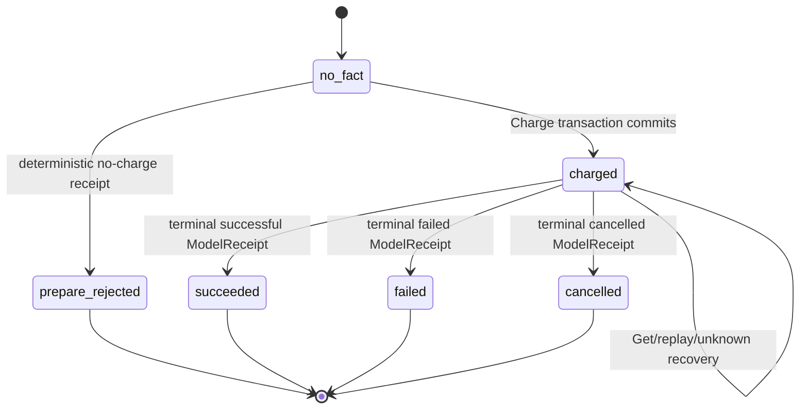
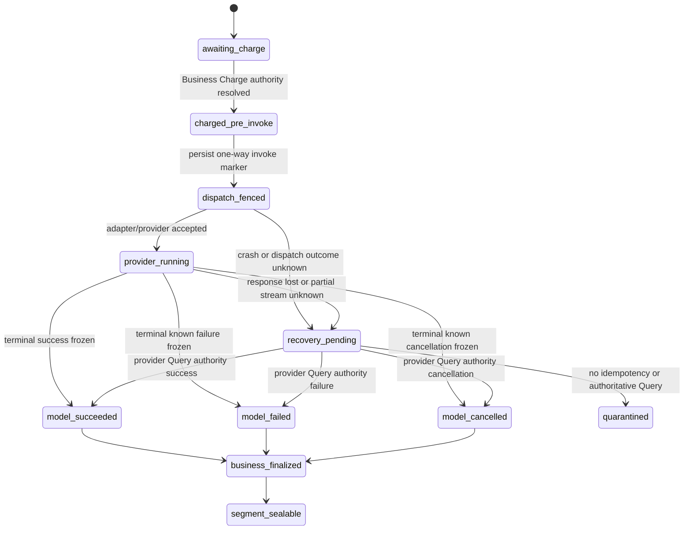
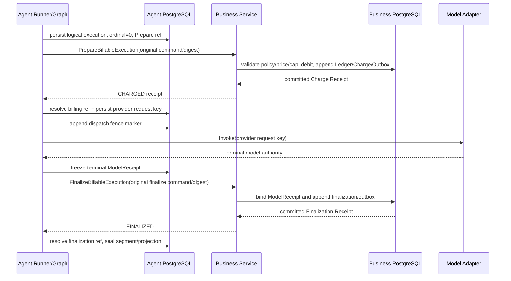
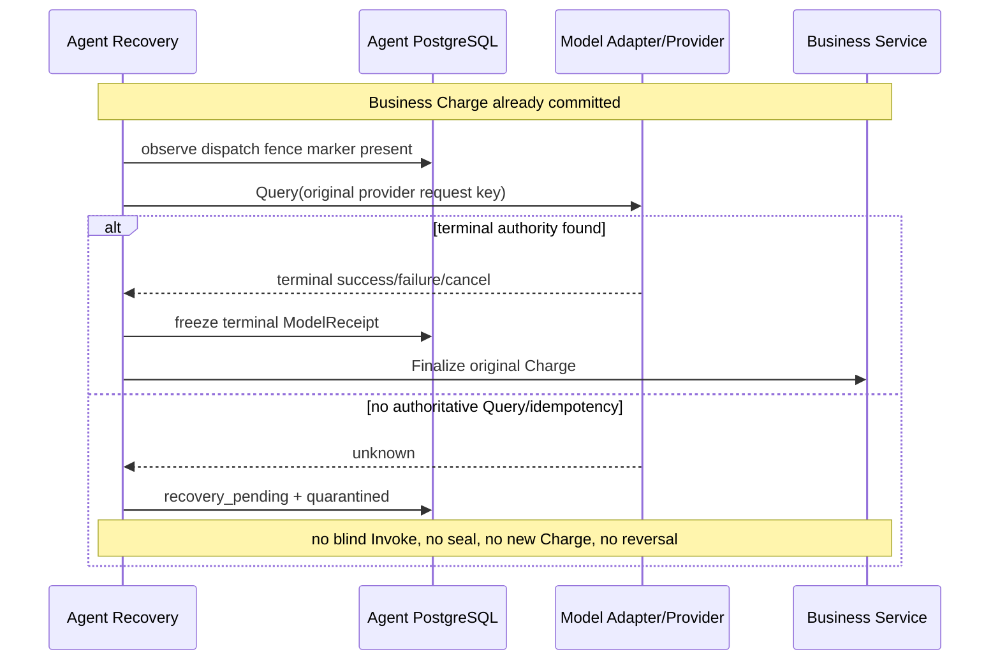
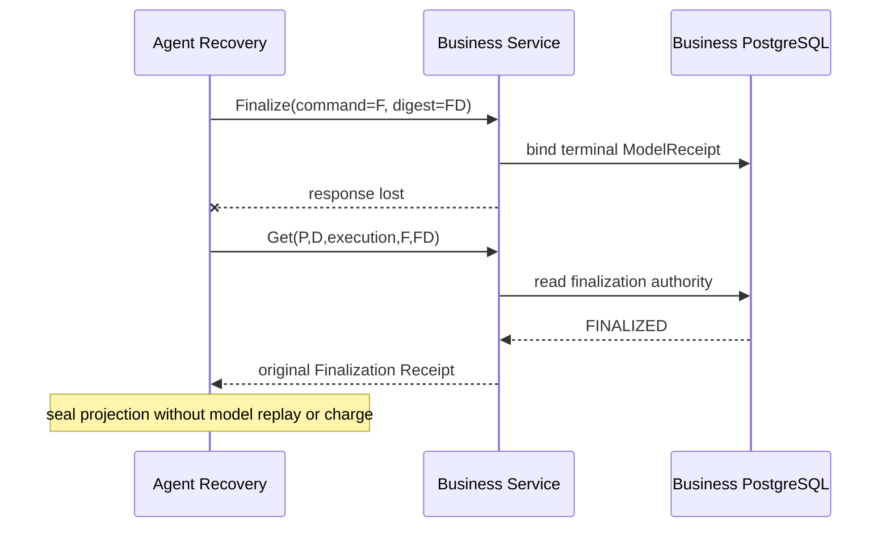

# W2-R00 Graph Execution Billing 跨模块契约 v1

> 文档状态：**Draft / Business、Agent、产品、财务、安全联合签核待完成**
>
> 契约版本：`graph-execution-billing.contract.v1-draft.1`
>
> 评审 Gate：`W2-R00`、`W2-ADR-005`
>
> 设计日期：2026-07-15
>
> 适用范围：W2 首条 `plan_creation_spec` 同步 Graph Tool 纵切中的 primary model billable execution
>
> 明确限制：本文不是 Approved 契约，不授权创建生产 Thrift IDL、生成代码、HTTP/RPC Handler、Go 实现、数据库 Migration、Ledger、Charge、ModelReceipt 或 Graph；`W2-B0a` 在本 Gate 和 ADR-005 联合 Approved、机器 Review Freeze 齐备前保持关闭。

## 0. 评审摘要

本文把 [全功能冒烟架构审计](./full-function-smoke-architecture-audit-2026-07-15.md) 中的最小同步计费候选整理为可联合评审的 W2-R00 契约。候选结论如下：

1. Business 是计价策略、积分账户、余额、追加式 Ledger、Charge Receipt、Billable Execution 终态和未来冲正的唯一权威 Owner；Agent 不决定价格、不直连 Business 数据库，也不自行生成费用事实。
2. W2 首切**推荐** `authorization_mode=preauthorized`：Business 发布不可变、版本化、低额 policy/cap，Agent Tool Definition 只 Pin 精确 policy ref/version/digest，Business 在 `PrepareBillableExecution` 中重新校验并原子扣费。该推荐仍待产品、财务和安全批准，不是当前已选事实。
3. 一个版本化 Tool Definition 只能绑定一种授权模式，禁止运行时在 `preauthorized/full_approval` 之间切换。若预授权未获批准，必须修订本文并先 Approved 独立 billable Approval/Decision/Consumption/Query 子契约；不得复用 `candidate_activation` Core。
4. 一个 logical model execution 的唯一业务身份为 `(logical_tool_execution_id, model_call_ordinal)`；Provider Attempt、RPC Attempt、恢复、Query 和投影重试都不得生成第二笔 Charge。
5. `PrepareBillableExecution` 不是 Reservation。Business 在模型调用前直接扣减积分，并在同一 PostgreSQL 事务写余额、追加式 Ledger、immutable Charge Receipt、命令回执与 Outbox。Charge commit 是 W2 v1 的正式执行开始边界。
6. `FinalizeBillableExecution` 只把已经冻结的 terminal ModelReceipt 引用及模型终态绑定到原 Charge，不再次扣费、不退款、不冲正。
7. 可证明尚未进入 `adapter.Invoke` 的崩溃恢复，可以复用原 Charge 后完成该 ordinal 的第一次模型调用；一旦 dispatch fence marker 已提交或可能已进入 Provider，结果未知只能使用同一 provider idempotency key/权威 Query 恢复。无法查询时保持 `recovery_pending/quarantined`，禁止盲调、封口、第二笔 Charge 或自动 reversal。
8. W2 v1 的 `plan_creation_spec` 只允许一个 primary logical `model_call_ordinal=0`，correction 禁用。现有旧 Node 表中的 ordinal `1` 必须在本 Gate Review Freeze 前同步，否则本 Gate 不得 Approved。
9. 模型失败、超时、取消、结果未采用或 Candidate 校验失败不退还已经正常发生的扣费；重复扣费、错扣、或权威事实证明外部执行从未开始等平台账务差错，只能在 W4 通过追加式冲正处理。

## 1. 背景、目标与非目标

### 1.1 背景

现有需求已经确认“可计费执行开始前直接扣费、失败不退款、技术恢复不重复扣费”，但当前仓库没有生产 Billing Handler、Charge/Ledger Migration、ModelReceipt 或 Agent Runner。旧设计同时存在“先 billable Approval”和“最短链路直接 Charge”两套拓扑，且完整账务原计划留到 W4，无法为 W2 首条模型纵切提供机器可判定的开工门禁。

关联基线：

- [共通业务规则与验收基线](../../requirements/common-requirements-baseline.md#3-计费与收益规则)；
- [全功能冒烟开发推进计划](../../requirements/full-function-smoke-development-plan.md)；
- [`plan_creation_spec` W2-R04 开工差距评审](../agent/graphtool/plan_creation_spec-w2-r04-gap-review.md)；
- [GraphToolResultV1 与 ToolReceipt 契约](../agent/graph-tool-result-receipt-contract-v1.md)；
- [Runner、Session Lane 与 ModelReceipt 评审](../agent/runner-session-lane-review-v1.md)。

### 1.2 目标

- 冻结 Business/Agent 的计费 Owner、信任边界和本地事务边界；
- 冻结 `Prepare/Get/FinalizeBillableExecution` 的 DTO/IDL 候选、版本、幂等和错误语义；
- 冻结 policy、pricing、cap、authorization、Charge、Ledger 与 ModelReceipt 的绑定；
- 冻结每个 logical ordinal 恰好一次扣费、失败不退款和 v1 correction 禁用规则；
- 冻结 Prepare response lost、invoke 前崩溃、dispatch 后 unknown、Finalize response lost 和投影重试的恢复路径；
- 给出真实 PostgreSQL 16、Kitex RPC、并发、崩溃和全功能 Smoke 的可执行测试方案；
- 定义 W2-R00 machine-readable Contract Review Freeze 的输入，不由本文伪造审批结果。

### 1.3 非目标

- 不实现充值商品、微信/支付宝支付、积分履约或充值退款；
- 不实现发布者收益账本、结算、冻结、五折回收、Provider 成本或对账后台；
- 不实现 W4 账务冲正、人工调账和双人复核入口；
- 不实现媒体 `PrepareGeneration/FinalizeGeneration`、Agent Job 或 Worker Provider Attempt；W3 必须扩展同一 Billing Authority，不能另建第二套 Charge/Ledger 状态机；
- 不批准 `plan_creation_spec` Graph、Candidate、Approval、A2UI 或其他五个 Graph Tool；
- 不在本文冻结物理表名、索引名、Thrift package 路径或字段号为生产事实；第 7 节只是供 IDL Review 的候选，Approved 时必须由 IDL 源与生成结果取代；
- 不支持 correction、semantic repair、自动 provider failover 或用户主动重新生成；主动重新生成未来必须创建新的 logical execution 及新的计费身份。

## 2. Owner、权威来源与信任边界

| 事实 | 权威 Owner / Migration Owner | 访问方式 | W2 约束 |
| --- | --- | --- | --- |
| Billing Policy、Price Config、cap、适用模型/Tool Pin | Business | Business 内部 Repository；Agent 只发送已 Pin 引用 | 不得由用户、Skill、模型或 Agent 提交最终价格 |
| 用户积分账户、余额 | Business | Business 本地事务 | PostgreSQL 真源；Redis 不承载余额 |
| Charge、Charge Receipt、追加式 Ledger、Billing Command Receipt、Billing Outbox | Business | `Prepare/Get/FinalizeBillableExecution` | 所有表只允许位于 `business` Schema/Migration |
| Logical Tool Execution、Segment、Execution Ref Slot | Agent | Agent Repository | Agent 只保存 Business authority ref，不复制 Business 账本真值 |
| ModelReceipt、Provider request key、dispatch marker、模型终态 | Agent | Agent Repository、受控 Model Adapter | terminal ModelReceipt 必须先冻结，再请求 Business Finalize |
| Tool Definition、Prompt/Model Config Pin、Runtime Budget | Agent | 启动时 Registry、Turn 冻结上下文 | Skill、用户输入和动态配置不得改写 |
| Candidate activation Approval/Decision/Consumption | Agent + Business 各自权威对象 | 独立 R03/R04 契约 | 与 billable execution 授权严格分离 |
| Provider Attempt | Agent Model Adapter；W2 无 Worker | Provider API/Query | Attempt 不是收费唯一键 |
| 账务冲正 | Business / W4 | 未来受控命令 | W2 只留原始引用，不提供 reversal 接口 |

强制边界：

1. Business 不直连 Agent 数据库；Agent 不直连 Business 数据库，双方不得 import 对方的 `internal` 包。
2. Business 的扣费事务内禁止调用 Agent RPC、模型、Provider、Redis 或对象存储。
3. `preauthorized` 所需的用户、Project、Policy、Price Config、账户和余额 Guard 必须全部由 Business 本地权威事实完成。
4. 若最终选择 `full_approval`，Business 对 Agent Consumption authority 的认证 Query 必须在 Business 本地扣费事务外完成；事务内只校验并固化已经取得的不可变 authority envelope/digest。该分支在独立 R03 billable 子契约 Approved 前不可执行。
5. 浏览器、A2UI、模型、Prompt、Skill、Provider response 和日志均不是计费 authority。

## 3. 待联合签核的 ADR-005 决策

### 3.1 唯一授权模式

| 决策项 | 推荐候选 | 当前状态 | 必须签核的 Owner |
| --- | --- | --- | --- |
| W2 首切授权模式 | `preauthorized` | `recommended_pending_approval` | 产品、Business、财务、安全 |
| Policy Owner | Business | 待签核 | Business、财务 |
| Policy 性质 | immutable、versioned、published、低额 cap | 待签核 | 产品、财务、安全 |
| 扣费时点 | Charge commit，早于 dispatch fence marker 与 `adapter.Invoke` | 待签核 | Business、Agent、财务 |
| 失败退款 | 不支持 | 需求已确认，仍需 R00 显式确认实现口径 | 产品、财务 |
| correction | W2 v1 禁用 | 推荐待签核 | Agent、Business、财务 |
| 账务差错修复 | W4 append-only reversal | 边界待签核，能力延后 | Business、财务、安全 |

`preauthorized` 不表示“客户端可以免审核提交任意金额”。它表示：产品、财务和安全预先批准一个 Business-owned policy scope；每次执行仍由 Business 在服务端根据精确 User/Project/Tool/Definition/Model/Price/预算绑定重新校验，且实际价格不得超过 policy cap 和 Runner 下调预算 cap。

一个 `tool_key + definition_version` 只能 Pin 一个 `authorization_mode`。启动 Registry、RPC 请求和 Business Policy 三者必须逐值一致；任何不一致均在扣费前失败关闭。禁止使用 Feature Flag、环境变量或用户参数在同一 Definition 内切换模式。

### 3.2 `full_approval` 退路不是隐式兼容分支

如果产品、财务或安全拒绝 `preauthorized`：

1. 本文状态保持 Draft，并将候选模式修订为 `full_approval`；
2. 先新增并 Approved 独立 billable Approval/Decision/Consumption/Agent Query 子契约；
3. billable Core 必须独立冻结 approval type、action type、decision action、consumption action、scope、effect kind、ref slot、quote/cap digest、single-use 和过期规则；
4. billable Core 不得复用或推导 `candidate_activation/creation_spec_activation` Core；
5. 首个 Input 在 billable Consumption authority 确认前必须保持 Charge、Ledger、模型、ModelReceipt 和 Candidate 全为零；
6. IDL、canonical vectors、Graph topology、Smoke slice 和 Review Freeze 全部重新审核，不能只把 `authorization_mode` 字符串改为 `full_approval`。

本文后续 DTO 为 future full-approval 预留有类型 envelope 位置，但该位置当前是 `DESIGN_REVIEW_PENDING`，不构成该模式可用证据。

## 4. 核心术语与不可变不变量

### 4.1 核心术语

| 术语 | v1 定义 |
| --- | --- |
| Logical Model Execution | Graph Tool 中一个由稳定 `model_call_ordinal` 标识的模型逻辑调用；Provider Attempt 只是其技术子尝试 |
| Billing Execution Identity | `(logical_tool_execution_id, model_call_ordinal)`，由 Agent 创建逻辑身份，Business 以领域唯一约束兜底 |
| Prepare Command | Agent 在 retained `charge.primary` slot 中持久化的唯一 `tr:<receipt_id>:<ref_slot>:v1` command key；相同技术重试必须复用该 key 与 request digest |
| Charge Commit | Business 同一事务已经扣减余额、追加 Ledger、写 Charge Receipt/命令回执/Outbox 的提交点；W2 的正式执行开始边界 |
| Charge Receipt | Business immutable authority，冻结用户、业务身份、authorization、policy/price 版本、amount、余额前后值、Ledger 和 committed time |
| ModelReceipt | Agent immutable logical model authority；terminal 前可有技术 Attempt，terminal 后冻结输出/错误、usage 和 provider authority 摘要 |
| Finalization | Business 把 terminal ModelReceipt 引用与原 Charge 绑定；不改变积分余额或原 Ledger |
| Correction | Validator 驱动的第二次语义模型调用，不等于同一 Provider request 的幂等恢复；W2 v1 禁用 |
| Reversal | 平台账务差错的追加式反向 Ledger；不是退款，W2 不实现 |

### 4.2 强制不变量

1. Business 领域唯一键候选固定为 `(logical_tool_execution_id, model_call_ordinal)`；W2 `plan_creation_spec` primary ordinal 候选固定为 `0`。
2. 同一 Billing Execution Identity 最多一笔正常 Charge、一个 debit Ledger Entry、一个 immutable Charge Receipt 和一个最终 ModelReceipt 引用。
3. `provider_attempt_no`、RPC attempt、lease/fence、process instance、trace、时间重读和投影次数均不进入计费唯一键。
4. Charge commit 必须发生在 Agent dispatch fence marker commit 和模型调用之前。主要正确性证据是 authority/ref 的 happens-before 链；跨服务 wall clock 仅作附加审计，不能取代该因果链。
5. 余额不足、policy 不匹配、cap 超限、授权模式不匹配或请求绑定冲突时，Charge、Ledger、ModelReceipt、Provider 调用和 Candidate 全为零。
6. 一旦 Charge 正常提交，模型失败、超时、取消、Validator 拒绝、Candidate 未采用或后续 activation reject 均不退款。
7. `FinalizeBillableExecution` 不接受 amount、balance、reversal、refund 或新的 pricing input，不得再次扣费。
8. ModelReceipt 未 terminal、Provider 结果 unknown 或 Business Finalize authority 未确定时，Agent Tool Segment 不得 terminal seal。
9. 同一 command id 同 digest 只重放冻结结果；同一 command id 异 digest 固定冲突。不同 command id 命中同一 Billing Execution Identity 也固定冲突并 quarantine，不创建 alias 或第二笔费用。
10. `preauthorized` 模式严禁创建 billable Approval/Decision/Consumption Core；candidate activation Approval 仍然独立存在，并且不能反向授权此前模型费用。
11. W2 不生成发布者收益 Ledger。只保存未来可核对的 immutable invocation attribution；平台直接调用必须冻结 `direct_zero_earning` 事实。
12. `model_call_ordinal` 与 R01 `slot_ordinal` 是两套不能互换的序号：前者属于 Billing/ModelReceipt 逻辑调用且 W2 primary 候选为 `0`；后者属于 retained Tool Definition Registry 的正整数阶段顺序且从 `1` 开始。
13. R01 的 Execution Slot 唯一键为 `(tool_receipt_id, ref_slot)`，因此 Prepare Charge authority 与 Finalization authority 必须使用两个不同的固定 Registry slot；未来 correction 也必须新增独立 slot 对，不能把多个 authority 塞入同一 slot。

## 5. Billing Policy、计价与 cap

### 5.1 Business immutable Policy Snapshot 候选

每个可用 Policy Snapshot 至少冻结下列字段；字段名是设计语义，不是已批准数据库列：

| 字段 | 语义 |
| --- | --- |
| `billing_policy_ref` | 稳定 Policy 名称空间引用，不包含 Secret |
| `billing_policy_version` | 单调正整数版本；发布后不可原地修改 |
| `billing_policy_digest` | Policy canonical digest |
| `authorization_mode` | 当前 Definition 只允许一个值；本 Draft 推荐 `preauthorized` |
| `tool_key/definition_version/definition_digest` | 允许的精确 Tool Pin |
| `execution_kind` | W2 固定 `primary_model_call` |
| `model_config_ref/version/digest` | 允许的精确 Model Config Pin |
| `price_config_ref/version/digest` | Business immutable Price Config Pin |
| `billing_unit` | W2 固定一次 logical primary model call，`quantity=1` |
| `currency` | 稳定积分币种代码；推荐候选 `DORA_POINT`，最终值待财务签核 |
| `policy_cap_points` | 单次 logical execution 可扣最大积分，正 `bigint/int64` |
| `eligible_scope` | 允许的产品入口、用户/Project 状态、安全等级和环境 |
| `published_at/effective_from/effective_until` | UTC 生效窗口；已发生 Charge 不受后续配置变化影响 |
| `status` | `published/suspended/retired`；新 Prepare 必须为可执行状态 |
| `review_refs` | 产品、财务、安全批准引用；不进入普通前端响应 |

Policy 发布、暂停和退役属于 Business 管理配置能力。发布后不得改写原版本；紧急暂停只能阻止尚未 Charge commit 的新执行，不得改写历史 Charge。

### 5.2 价格解析与 cap 规则

1. Agent 请求只发送精确 Policy/Tool/Model Pin 和一个由 Runner 冻结的 `runtime_budget_cap_points` 下调 Guard；不得发送可信最终 `charged_points`、余额前后值或 Ledger 内容。
2. Business 根据 immutable Price Config 解析 `charged_points`。`charged_points` 必须是正 `int64`，禁止浮点数、负数和运行时舍入。
3. Business 必须验证：

   ```text
   charged_points <= policy_cap_points
   charged_points <= runtime_budget_cap_points
   ```

4. Runner cap 只能收紧 Business Policy，不能提高 Policy cap。请求 cap 缺失、非正、溢出或高于 Registry 允许边界均失败关闭。
5. Charge Receipt 必须冻结 currency、billing unit、quantity、price config ref/version/digest、policy ref/version/digest、policy cap、runtime cap 和最终 charged points。
6. Graph Tool 终态费用汇总只能求和已去重的 Charge Receipt；不得追加 Tool completion fee。

### 5.3 Invocation Attribution v1 候选

| 模式 | 必填字段 | W2 收益语义 |
| --- | --- | --- |
| `platform_direct` | `attribution_schema_version`、`attribution_digest` | `earning_disposition=direct_zero_earning`，不得生成发布者收益 |
| `skill_invocation` | 上述字段 + `skill_invocation_id/session_skill_snapshot_id/skill_id/published_snapshot_id/publisher_user_id` | 只冻结引用，`earning_disposition=deferred_to_w4`；不得据此生成收益 |

Business 必须用本地 Skill/Published Snapshot 事实校验可核对字段。Agent 提交的 attribution 不是未来收益 authority；W4 仍需独立风险、合格明细、规则版本和结算契约。

## 6. Agent 与 Business 的执行身份

### 6.1 稳定身份

| 字段 | Owner | 生成/冻结时点 | 重试规则 |
| --- | --- | --- | --- |
| `logical_tool_execution_id` | Agent | Tool execution 首次持久化 | 技术恢复不变 |
| `model_call_ordinal` | Agent Definition/Graph | Compile 后稳定 Node 契约 | W2 R04 primary 候选 `0`；不因 Attempt 递增 |
| `prepare_command_id` | Agent retained Execution Slot | `charge.primary` slot 持久化时派生 `tr:<tool_receipt_id>:charge.primary:v1` | 所有 Prepare retry/Query 不变；不是 UUID |
| `prepare_request_digest` | Agent + Business 各自重算 | 第一次 Prepare 前 | 同 command 不变 |
| `billing_execution_id` | Business | Charge 或 terminal no-charge command 首次处理 | Business authority，不由 Agent 指定 |
| `charge_id/charge_receipt_id/ledger_entry_id` | Business | Charge 事务 | 不变、不可覆盖 |
| `provider_request_key` | Agent ModelReceipt | dispatch marker 前 | provider Query/幂等恢复不变 |
| `model_receipt_id` | Agent | 模型 logical call 首次持久化 | Attempt 不改变 |
| `finalize_command_id/finalize_request_digest` | Agent retained Execution Slot | terminal ModelReceipt 冻结后预留 `charge_finalization.primary`，派生 `tr:<tool_receipt_id>:charge_finalization.primary:v1` | Finalize retry/Query 不变；不得复用 Prepare slot/key |

### 6.2 Agent Execution Ref Registry 候选

R01 v1 的 slot 只能承载一个 prepared/resolved authority，且 `slot_ordinal` 是从 1 开始的 Definition 阶段顺序，不是模型调用序号。W2 R04 因此至少需要以下两个 retained Registry entry；名称是 R00 推荐候选，精确名称和正整数阶段序号仍待 R04/R01 联合冻结：

| Registry entry | ref slot 候选 | slot ordinal | ref type 候选 | effect class | 幂等身份 | Query |
| --- | --- | --- | --- | --- | --- | --- |
| primary Charge Prepare | `charge.primary` | `positive_integer_pending_r04_freeze` | `business.billable_execution_prepare_receipt.v1` | `side_effect` | `tr:<tool_receipt_id>:charge.primary:v1` | `GetBillableExecutionReceiptV1` |
| primary Charge Finalize | `charge_finalization.primary` | `positive_integer_pending_r04_freeze` | `business.billable_execution_finalization_receipt.v1` | `side_effect` | `tr:<tool_receipt_id>:charge_finalization.primary:v1` | `GetBillableExecutionReceiptV1` |

两个 Registry entry 均使用 `effect_kind=billable_execution`，`authority_owner=business`，但它们不能共用 `(tool_receipt_id, ref_slot)`。Business Prepare/Finalization authority payload 内都显式绑定 Billing 的 `model_call_ordinal=0`；这个值不得从 `slot_ordinal` 推导。

路径 exact-set 候选：

- Prepare 外部调用前总是预留 `charge.primary`；CHARGED 和 immutable NOT_CHARGED 都 resolve 原 slot，Get `NOT_FOUND` 不 resolve、保持 prepared；
- 只有 CHARGED 且 Agent 已冻结 terminal ModelReceipt 后才预留 `charge_finalization.primary`；Prepare rejected 路径必须没有 Finalize slot；
- Finalize response unknown 时 Finalize slot 保持 prepared 并阻止 terminal seal；Get FINALIZED 才 resolve；
- Provider unknown 时 Finalize slot尚未预留，Charge slot 已 resolved，ToolReceipt 保持 open/recovery_pending。

R01 当前把 `authority_outcome` 限定为 Business Decision authority，尚未冻结 Billing no-effect projection。R00 推荐将 `PrepareBillableExecutionReceiptV1.outcome=CHARGED/NOT_CHARGED` 分别严格投影为通用 ref 的 `authority_outcome=committed/not_committed`，从而让 generic freeze validator 区分“已扣费副作用”和“确定未扣费回执”；这需要 R01/R04 同步设计和正反向 Corpus，不能由 R00 单方面覆盖。该投影未 Approved 前，NOT_CHARGED 路径不能声称可安全 freeze。

`preauthorized` 与 `full_approval` 都使用 `effect_kind=billable_execution`，但只有 full-approval 才可能拥有独立 billable Consumption ref。不得把 billing ref 写入 `approval_consumption` slot，也不得使用 activation 摘要域。

未来若开放 correction，至少需要新的 `charge.correction` 与 `charge_finalization.correction` Registry entry、各自正整数 `slot_ordinal`、独立 R01 `tr:` key，以及新的 Billing `model_call_ordinal`。在 Registry 或 R01 升级为明确支持一槽多 authority 前，禁止复用 primary slot。

## 7. `Prepare/Get/FinalizeBillableExecution` DTO/IDL 候选

本节用于联合评审字段职责。它不创建 IDL 源，不锁定生成代码，也不允许实现者在 Approval 前自行生成 package。最终 Thrift 必须保持字段号不复用、严格版本校验、未知 enum/组合失败关闭，并由 Business/Agent 契约测试共同消费。

### 7.1 方法与版本常量候选

```thrift
const string GRAPH_EXECUTION_BILLING_RPC_SCHEMA_VERSION = "graph_execution_billing.rpc.v1"
const string PREPARE_BILLABLE_EXECUTION_SCHEMA_VERSION = "prepare_billable_execution.v1"
const string GET_BILLABLE_EXECUTION_RECEIPT_SCHEMA_VERSION = "get_billable_execution_receipt.v1"
const string FINALIZE_BILLABLE_EXECUTION_SCHEMA_VERSION = "finalize_billable_execution.v1"

service GraphExecutionBillingServiceV1 {
    PrepareBillableExecutionResponseV1 PrepareBillableExecution(
        1: PrepareBillableExecutionRequestV1 request)
    GetBillableExecutionReceiptResponseV1 GetBillableExecutionReceipt(
        1: GetBillableExecutionReceiptRequestV1 request)
    FinalizeBillableExecutionResponseV1 FinalizeBillableExecution(
        1: FinalizeBillableExecutionRequestV1 request)
}
```

### 7.2 公共嵌套 DTO

| DTO | 候选字段 | 规则 |
| --- | --- | --- |
| `BillableExecutionIdentityV1` | `logical_tool_execution_id:string`、`model_call_ordinal:i32` | ID 为 UUIDv7；ordinal 非负；W2 R04 只允许 0 |
| `ToolDefinitionPinV1` | `tool_key:string`、`definition_version:string`、`definition_digest:string` | 必须与 Agent retained Registry 和 Business Policy 逐值一致 |
| `ModelConfigPinV1` | `model_config_ref:string`、`model_config_version:i64`、`model_config_digest:string`、`provider_route_ref:string` | 不含 API Key、BaseURL 或 Prompt |
| `BillingPolicyPinV1` | `billing_policy_ref:string`、`billing_policy_version:i64`、`billing_policy_digest:string` | 必须指向 Business immutable published snapshot |
| `PreauthorizedExecutionV1` | `policy_pin`、`runtime_budget_cap_points:i64` | 不携带最终价格；仅在 preauthorized mode 合法 |
| `FullApprovalExecutionV1` | `approval_id`、`decision_id`、`consumption_id`、`consumption_digest`、`approved_cap_points`、`authority_schema_version` | 当前 `DESIGN_REVIEW_PENDING`；R03 billable 子契约未 Approved 前必须拒绝 |
| `InvocationAttributionV1` | `mode`、`attribution_schema_version`、`attribution_digest` 及条件 Skill 字段 | exact one-of；不携带收益金额 |
| `PriceSnapshotV1` | currency、billing unit、quantity、Price/Policy Pin、两个 cap、charged points | 只由 Business 产生 |
| `AuthorizationSnapshotV1` | `authorization_mode`、`authorization_id`、`authorization_digest`、source ref/version/digest | 只由 Business 产生；preauthorized 无 Approval/Consumption 字段 |

所有 digest 候选统一使用小写 `sha256:<64hex>`。UUID-typed 业务/追踪身份使用小写 RFC 9562 UUIDv7；Prepare/Finalize `command_id` 是唯一公开 `tr:` key，明确不是 UUID，也不得再映射或派生第二个公开 UUID 幂等身份。时间使用 UTC Unix milliseconds。积分使用正 `i64`，禁止 JSON/IDL 浮点。

### 7.3 Prepare request 候选

| 字段号 | 字段 | 类型 | 必填 | 语义 |
| --- | --- | --- | --- | --- |
| 1 | `schema_version` | string | 是 | `prepare_billable_execution.v1` |
| 2 | `request_id` | string | 是 | transport 追踪 UUIDv7，不进入业务幂等摘要或任何唯一约束 |
| 3 | `command_id` | string | 是 | 必须等于 retained Prepare slot 的 R01 `tr:<tool_receipt_id>:<ref_slot>:v1`；同一操作所有 attempt 不变 |
| 4 | `request_digest` | string | 是 | Agent 计算、Business 常量时间重算比较 |
| 5 | `user_id` | string | 是 | 可信 Turn Context；Business 重验账户/Project 关系 |
| 6 | `project_id` | string | 是 | Business Project 逻辑引用 |
| 7 | `session_id` | string | 是 | 审计绑定，不作为账户 Owner |
| 8 | `turn_id` | string | 是 | 冻结因果引用 |
| 9 | `run_id` | string | 是 | 首次逻辑 Run 引用；技术恢复不得重写 request digest |
| 10 | `tool_call_id` | string | 是 | Agent 逻辑 ToolCall ID；用于跨 Run/Receipt 审计，不单独作为扣费键 |
| 11 | `tool_receipt_id` | string | 是 | Agent open ToolReceipt authority ID |
| 12 | `tool_request_semantic_digest` | string | 是 | 冻结 Tool Intent/可信上下文的摘要；费用引用不得回写该摘要 |
| 13 | `graph_run_id` | string | 是 | Graph 内 ModelReceipt namespace 的冻结引用 |
| 14 | `execution_identity` | `BillableExecutionIdentityV1` | 是 | Business 领域唯一身份 |
| 15 | `execution_kind` | enum | 是 | W2 只允许 `PRIMARY_MODEL_CALL` |
| 16 | `tool_definition_pin` | `ToolDefinitionPinV1` | 是 | Tool Pin |
| 17 | `model_config_pin` | `ModelConfigPinV1` | 是 | 模型与 Provider 路由 Pin |
| 18 | `authorization_mode` | enum | 是 | 必须与 Tool Definition 和 Policy 相同 |
| 19 | `preauthorized_execution` | DTO | 条件 | mode=PREAUTHORIZED 时必须且只能存在 |
| 20 | `full_approval_execution` | DTO | 条件 | mode=FULL_APPROVAL 时必须且只能存在；当前禁用 |
| 21 | `invocation_attribution` | DTO | 是 | 平台直调零收益或 Skill attribution 引用 |
| 22 | `requested_at_unix_ms` | i64 | 是 | 审计字段，不进入 Prepare semantic digest |

不允许字段：客户端报价、`charged_points`、余额、Ledger 内容、correction ordinal、Provider API Key、Prompt、模型输入/输出、Approval 自由文本或 Candidate 数据。

### 7.4 Prepare response 与 Receipt 候选

`PrepareBillableExecutionResponseV1`：

| 字段 | 语义 |
| --- | --- |
| `schema_version/request_id` | 协议版本和 transport 关联 |
| `disposition` | `COMMITTED/REPLAYED`；不改变业务 outcome |
| `receipt` | `PrepareBillableExecutionReceiptV1` |

`PrepareBillableExecutionReceiptV1` 至少包含：

| 字段组 | 字段 | 规则 |
| --- | --- | --- |
| 命令绑定 | `command_id/request_digest/receipt_version/receipt_digest` | first-write-wins |
| 业务身份 | `billing_execution_id/logical_tool_execution_id/model_call_ordinal/user_id/project_id/session_id/turn_id/tool_call_id/tool_receipt_id/tool_request_semantic_digest` | 与请求逐值绑定 |
| outcome | `CHARGED/NOT_CHARGED`、条件 `rejection_code` | NOT_CHARGED 时 Charge/Ledger/Price amount 字段必须 absent |
| 授权 | `AuthorizationSnapshotV1` | CHARGED 必填；NOT_CHARGED 可保存失败前 policy evaluation 摘要 |
| 价格 | `PriceSnapshotV1` | 仅 CHARGED 必填 |
| 账本 | `charge_id/charge_receipt_id/ledger_entry_id` | 仅 CHARGED 必填且一一对应 |
| 余额 | `balance_before_points/balance_after_points` | 仅 CHARGED；差额必须等于 charged points |
| attribution | `InvocationAttributionV1/earning_disposition` | CHARGED 必填；W2 不创建收益 |
| 时间 | `completed_at_unix_ms`；CHARGED 条件 `charge_committed_at_unix_ms` | no-charge 只表达命令完成；只有 Charge 具有正式开始 commit time |

经过服务认证且 Schema/identity/digest 合法的业务确定性拒绝，例如余额不足、Policy 不可用、cap 超限，应写 immutable `NOT_CHARGED` command receipt。它不是 Charge Receipt，不创建 Ledger/Outbox 费用事件，也不会在未来余额变化后把同一 command 静默变成 CHARGED。用户充值后重试必须是新的用户业务动作和新的 logical execution。

### 7.5 Get request/response 候选

`GetBillableExecutionReceiptRequestV1`：

| 字段 | 规则 |
| --- | --- |
| `schema_version/request_id` | 必填 |
| `prepare_command_id/expected_prepare_request_digest` | 必填，用于 Prepare response lost |
| `execution_identity` | 必填，防止只按 opaque command 跨资源查询 |
| `expected_user_id/expected_project_id` | 必填，Business 重新鉴权并逐值比较 |
| `expected_finalize_command_id/expected_finalize_request_digest` | 可选且成对出现，用于 Finalize response lost |

`GetBillableExecutionReceiptResponseV1.status` exact-set：

| 状态 | 可携带对象 | 调用方语义 |
| --- | --- | --- |
| `NOT_FOUND` | 无 | 只是当前观察，不是永久 no-charge authority；Prepare 可在同一单一 Retry Owner 下用**原 command/digest**有界重发 |
| `PREPARE_REJECTED` | NOT_CHARGED Prepare Receipt | 确定零扣费终态；不得自动改 key 重试 |
| `CHARGED` | CHARGED Prepare Receipt | Charge authority 已存在；复用原 Charge，禁止再 Prepare 新费用 |
| `FINALIZED` | CHARGED Prepare Receipt + Finalization Receipt | Business 已绑定 terminal ModelReceipt |
| `CONFLICT` | 仅安全 conflict code/已有 authority ID 摘要 | 保持 quarantine，禁止继续模型或扣费 |

`NOT_FOUND` 后若原 Prepare 仍在网络中晚到，或调用方重发原 command，Business 的 command/domain unique 仍保证最多一笔 Charge。禁止将 NOT_FOUND 映射为“换 command id 再试”。

### 7.6 Finalize request/response 候选

| 字段号 | 字段 | 类型 | 必填 | 语义 |
| --- | --- | --- | --- | --- |
| 1 | `schema_version` | string | 是 | `finalize_billable_execution.v1` |
| 2 | `request_id` | string | 是 | transport 追踪 UUIDv7；不是幂等身份 |
| 3 | `command_id` | string | 是 | 必须等于独立 Finalize slot 的 R01 `tr:<tool_receipt_id>:<ref_slot>:v1`；Finalize attempt 不变 |
| 4 | `request_digest` | string | 是 | Business 重算 |
| 5 | `billing_execution_id` | string | 是 | 原 CHARGED Receipt authority |
| 6 | `prepare_command_id` | string | 是 | 绑定原 Prepare |
| 7 | `prepare_receipt_digest` | string | 是 | 防止错绑 Charge |
| 8 | `execution_identity` | DTO | 是 | 必须与原 Charge 完全一致 |
| 9 | `model_receipt_id` | string | 是 | Agent terminal ModelReceipt UUIDv7 |
| 10 | `model_receipt_schema_version` | string | 是 | exact version |
| 11 | `model_receipt_digest` | string | 是 | terminal immutable digest |
| 12 | `model_outcome` | enum | 是 | `SUCCEEDED/FAILED/CANCELLED`；UNKNOWN 禁止 |
| 13 | `model_started_at_unix_ms` | i64 | 是 | 必须有 Charge happens-before 证据 |
| 14 | `model_completed_at_unix_ms` | i64 | 是 | 不早于 started |
| 15 | `provider_authority_ref_digest` | string | 条件 | Provider terminal authority 或受控 Local Fake authority |
| 16 | `final_error_code` | string | 条件 | FAILED/CANCELLED 的安全稳定码，不含 Provider 原文 |
| 17 | `requested_at_unix_ms` | i64 | 是 | 审计字段，不进入 semantic digest |

Finalize response 包含 `COMMITTED/REPLAYED` disposition 和 immutable `FinalizationReceiptV1`：`command_id/request_digest/finalization_receipt_id/digest/billing_execution_id/model_receipt_id/digest/model_outcome/finalized_at`。它不得包含新金额、余额变化或 reversal 字段。

### 7.7 稳定错误候选

| 错误码 | retryable | 是否允许模型调用 | 语义 |
| --- | --- | --- | --- |
| `BILLING_SCHEMA_UNSUPPORTED` | false | 否 | 未知 Schema/enum/字段组合 |
| `BILLING_UNAUTHENTICATED_CALLER` | false | 否 | 服务身份无效 |
| `BILLING_SCOPE_FORBIDDEN` | false | 否 | User/Project/Session 绑定无权 |
| `BILLING_REQUEST_DIGEST_MISMATCH` | false | 否 | 调用方 digest 与 Business 重算不一致 |
| `BILLING_IDEMPOTENCY_CONFLICT` | false | 否 | 同 command 异语义 |
| `BILLING_DOMAIN_IDENTITY_CONFLICT` | false | 否 | 异 command 命中同 execution/ordinal |
| `BILLING_AUTHORIZATION_MODE_MISMATCH` | false | 否 | Definition/Policy/Request 模式不一致 |
| `BILLING_POLICY_NOT_ELIGIBLE` | false | 否 | Policy 不存在、暂停、过期或 scope 不匹配 |
| `BILLING_PRICE_CONFIG_MISMATCH` | false | 否 | Price/Model Pin 不一致 |
| `BILLING_CAP_EXCEEDED` | false | 否 | 价格超过 policy 或 runtime cap |
| `BILLING_INSUFFICIENT_BALANCE` | false | 否 | 原子余额校验失败；零 Charge |
| `BILLING_RECEIPT_NOT_FOUND` | true | 否 | 当前无 authority；只允许原 key Query/有界重发 |
| `BILLING_FINALIZATION_CONFLICT` | false | 否 | 已存在不同 terminal ModelReceipt/outcome |
| `BILLING_MODEL_RECEIPT_NOT_TERMINAL` | false | 否 | UNKNOWN/非终态禁止 Finalize |
| `BILLING_BINDING_MISMATCH` | false | 否 | Charge、ModelReceipt 或 execution identity 错绑 |

错误响应只包含稳定 code、安全中文 message、retryable、request id；不得暴露 SQL、账户余额明细、Policy 原文、Prompt、Provider payload、内部地址或 Secret。

### 7.8 与现有 `aigc-contract-catalog.md` 的兼容映射

本批已将 [AIGC 跨模块契约目录](./aigc-contract-catalog.md) 中 `BIZ-AIGC-003`～`BIZ-AIGC-005` 同步为 R00 Draft 候选口径。下表保留原口径到当前候选的兼容映射，便于 Owner 复核；同步 Catalog 不会把本文或 Catalog 变成已冻结事实。

| Catalog 原口径 | R00 候选修订 | 原因 / 未同步风险 |
| --- | --- | --- |
| `BIZ-AIGC-003` 幂等键为 `user_id + tool_call_id + execution_digest` | transport 幂等固定 retained `charge.primary` slot 派生的 `prepare_command_id=tr:<tool_receipt_id>:charge.primary:v1` 与 `prepare_request_digest`；Business domain unique 固定 `(logical_tool_execution_id, model_call_ordinal)`；User/ToolCall 只进入绑定与摘要 | 旧键无法稳定区分同一 Tool 内多个 logical model ordinal，也容易让 Provider Attempt/Graph 重建改变扣费身份 |
| `BIZ-AIGC-003` 同时描述“同步模型/规则执行” | W2-R00 只批准 `execution_kind=PRIMARY_MODEL_CALL`；确定性 rule 默认 non-billable | “规则执行”没有独立 Policy、单位、ordinal、价格和测试，不能被本 Gate 顺带放行 |
| `BIZ-AIGC-004` 只写“查询是否已提交”且幂等键“同上” | 固定 `NOT_FOUND/PREPARE_REJECTED/CHARGED/FINALIZED/CONFLICT` 五态；只有 immutable NOT_CHARGED receipt 是确定零扣费，裸 NOT_FOUND 只是 observation | 若把 NOT_FOUND 当永久 no-charge，原 Prepare late commit 后可能再换 key 扣第二笔；若一律当 CHARGED 又无法恢复从未到达的请求 |
| `BIZ-AIGC-005` 记录“成功、失败、取消及收入确认资格” | W2 只绑定 terminal ModelReceipt/outcome，保留 immutable attribution 与 `direct_zero_earning/deferred_to_w4` disposition；不确认、不生成收益 | 收益资格还依赖 W4 风险、规则、合格明细和结算契约，不能由 W2 Finalize 越权决定 |
| §9 “同步模型重复扣费”键为 `tool_call_id + execution_digest` | 改为本节 transport key + domain unique 双层规则 | 与 Prepare/Get 的 authority identity 必须一致 |
| §9 Provider 重复调用只指向 Worker ProviderReceipt | W2 同步模型另由 Agent ModelReceipt + stable provider request key + Provider Query 负责 | 首条同步纵切没有 Worker，不能借 Worker receipt 证明模型只调用一次 |

在 Catalog、最终 IDL、R01 Authority Ref、R04 Graph Node/ordinal 和本契约一致前，R00 只能保持 `expansion_frozen`；形成完整 canonical candidate 后也只能进入 `awaiting_review`，不得直接标记 Review Frozen 或 Approved。

## 8. Canonical Digest 与双层幂等

### 8.1 Canonical 编码

候选编码沿用 R01 的强类型 canonical 规则：UTF-8/NFC、固定字段顺序、compact JSON、无 `null`、无浮点/指数、UUIDv7 小写、digest 为 `sha256:<64hex>`，并使用：

```text
sha256(UTF8(domain) || 0x00 || canonical_json)
```

Approved 前必须由共享 golden vectors 冻结精确字段顺序、字符串转义、安全整数边界和 Go/TS/IDL 映射；本文不授权实现者使用普通 Map 或 PostgreSQL `jsonb::text` 自选 canonical。

### 8.2 Digest 域与字段

| Digest | domain 候选 | 必须覆盖 | 必须排除 |
| --- | --- | --- | --- |
| Prepare request | `dora.graph_execution_billing.prepare.v1` | schema、User/Project/Session/Turn/原始 Run、ToolCall/ToolReceipt/GraphRun/tool request digest、execution identity/kind、Tool Pin、Model Pin、authorization mode 与对应 envelope、runtime cap、invocation attribution | request id、command id、attempt、trace、lease/fence、requested/read time、最终价格/余额/Receipt |
| Prepare receipt | `dora.graph_execution_billing.prepare_receipt.v1` | command/digest、业务身份、outcome、authorization、price、Charge/Ledger、余额、attribution、commit time | receipt digest 自身、transport metadata |
| Finalize request | `dora.graph_execution_billing.finalize.v1` | schema、billing execution、prepare command/receipt digest、execution identity、terminal ModelReceipt identity/schema/digest/outcome、model started/completed、provider authority digest、稳定 error code | request/command id、attempt、trace、requested time、原始模型输出 |
| Finalization receipt | `dora.graph_execution_billing.finalization_receipt.v1` | command/digest、billing execution、ModelReceipt binding、terminal outcome、finalized time | receipt digest 自身、费用新字段 |

`command_id` 是从 retained R01 Execution Slot 派生的 transport retry identity，不进入 semantic digest；Business 同时逐值验证它与 `tool_receipt_id/ref_slot` 的公式并保存 command id 与 digest。`logical_tool_execution_id + model_call_ordinal` 是领域唯一 backstop，不是第二个公开 command id。`slot_ordinal` 不进入 Billing Execution Identity，也不能替代 `model_call_ordinal`。

Prepare/Finalize Billing request digest 通过 `execution_identity` 显式覆盖 `model_call_ordinal=0`。R01 Execution Ref digest 另行覆盖 retained Registry 的正整数 `slot_ordinal`、`ref_slot`、`tr:` key 和本节 Billing request digest。两个摘要形成外层 slot 绑定内层 Billing authority 的关系；任何实现都不得要求两个 ordinal 相等、相加或相互派生。

### 8.3 Prepare 双层幂等顺序

Business 在一个短事务内按固定锁顺序执行：

1. 严格解码、服务认证、重算 digest；
2. 按 command identity 查询/锁定 Billing Command Receipt；
3. 命中同 command + 同 digest 时重放；同 command + 异 digest 时冲突；
4. 按 `(logical_tool_execution_id, model_call_ordinal)` 查询/锁定领域 identity；
5. 异 command 已占同 identity 时返回 `BILLING_DOMAIN_IDENTITY_CONFLICT`，不得 alias 到旧命令；
6. 校验 Business 本地 User/Project、Policy、Tool/Model Pin、授权模式、cap、price 和 attribution；
7. 确定性拒绝时写 immutable NOT_CHARGED command receipt；
8. 否则按稳定顺序锁账户，原子扣余额、append Ledger、写 Charge/Receipt/command receipt/Outbox；
9. 提交后才返回 RPC；Redis 唤醒失败不得回滚 Charge。

事务内不得执行 Agent RPC、Provider、模型、Redis 或对象存储 I/O。Repository 必须使用固定数量集合查询，禁止在字段/target 循环中执行同构 SQL。

### 8.4 Finalize 幂等顺序

1. 严格解码、认证、重算 Finalize digest；
2. 锁定原 Billing Execution 和 Finalize Command Receipt；
3. 校验原 Prepare Receipt、execution identity、Charge 和 ModelReceipt binding；
4. 同 command/digest 重放；同 command 异 digest 冲突；
5. 已有不同 finalization command 或不同 terminal ModelReceipt/outcome 时固定冲突；
6. 只写 terminal binding、Finalization Receipt、audit/change 和 Outbox；
7. 不修改余额、原 Ledger、charged points、Policy/Price Snapshot 或 Charge Receipt。

## 9. 权威状态机

### 9.1 Business Billable Execution 状态机



`provider_unknown` 不是 Business terminal 状态。此时 Business 仍只看到 `charged`，Agent 保持 recovery pending；在 Provider authority 解析前不得 Finalize 为 failed 来隐藏 unknown。

| Aggregate/Owner | 原状态 | 触发 | Guard/事务 | 目标状态 | 失败处理 |
| --- | --- | --- | --- | --- | --- |
| Prepare Command / Business | absent | Prepare deterministic reject | command/domain lock；写 NOT_CHARGED receipt，无 Ledger | `prepare_rejected` | response lost 后 Get 重放 |
| Billable Execution / Business | absent | Prepare eligible | 余额、Ledger、Charge、Receipt、Outbox 同事务 | `charged` | rollback 时零费用；unknown 用原 command Get/重发 |
| Billable Execution / Business | `charged` | terminal ModelReceipt Finalize | binding/digest/outcome 全匹配；无金额写入 | `succeeded/failed/cancelled` | response lost 用原 Finalize identity Get |
| Billable Execution / Business | terminal | 重复 Finalize | 同 command/digest 才重放 | 原 terminal | 异义固定 conflict |

### 9.2 Agent Model Execution 与恢复状态机



`dispatch_fenced` marker 必须在调用 Adapter 前以当前有效 Agent Fence append-once 持久化。marker absent 可以证明未进入统一 Adapter 入口；marker present 只表示“可能已经进入”，即使崩溃实际发生在 marker commit 与函数调用之间，也必须保守走 Query/幂等恢复，不能自动首次调用。

### 9.3 correction 与技术恢复分离

- W2 R04 只允许 `model_call_ordinal=0`，Graph/Validator 不得进入 correction Node；
- 同一 Provider request 的 transport 恢复不创建新 ordinal、不创建新 Charge；
- post-dispatch 只有 Provider 明确支持同 key 幂等重放时，单一 Model Adapter Retry Owner 才可按原 `provider_request_key` 恢复；
- 用户主动重新生成未来属于新 logical execution，不能复用旧 Charge；
- 开放 correction 必须升级 Tool Definition、预算、Policy、Graph、ordinal exact-set、Charge/ModelReceipt vectors 和 Review Freeze。

## 10. 时序

### 10.1 推荐 `preauthorized` 正常路径



### 10.2 Prepare response lost

```mermaid
sequenceDiagram
    participant AR as Agent Recovery
    participant BS as Business Service
    participant BP as Business PostgreSQL

    AR->>BS: Prepare(command=P, digest=D)
    BS->>BP: commit one Charge
    BS--xAR: response lost
    AR->>BS: Get(P,D,execution identity)
    BS->>BP: read command/domain authority
    BP-->>BS: CHARGED receipt
    BS-->>AR: CHARGED
    Note over AR: reuse original Charge; never create P2
```

若 Get 返回 NOT_FOUND，Recovery 只能在单一 Owner 和原预算内重发同一 `P/D`；Business command/domain unique 继续保证最多一次扣费。

### 10.3 dispatch 后 unknown



### 10.4 Finalize response lost



## 11. 崩溃窗口与 Unknown Outcome 矩阵

| 窗口 | 可观察 authority | 唯一允许动作 | 禁止动作 |
| --- | --- | --- | --- |
| Prepare 未发送前崩溃 | 无 Business command/Charge | 恢复原 Agent ref，发送原 command | 新 logical ordinal |
| Prepare 已发送、响应未知 | Business 可能已提交 | Get 原 command；NOT_FOUND 时有界重发原 command | 换 command/ordinal、调用模型 |
| Charge 已提交、Agent 尚未 resolve ref | Business CHARGED | Get 并 append 同一 authority ref | 第二笔 Charge |
| billing ref resolved、dispatch marker absent | 可证明未经过统一 Adapter 入口 | 当前最高 Fence append marker 后完成第一次 Invoke | 生成新 Charge、增加 ordinal |
| dispatch marker 已提交、实际 Invoke 前崩溃 | “可能已执行” | Provider Query/同 key 幂等恢复 | 以“可能没调用”为由盲调 |
| Provider 已 dispatch、响应丢失 | Charge + marker，模型结果 unknown | 原 provider key Query；无能力则 quarantine | 自动 failover、blind retry、Finalize failed、seal |
| terminal ModelReceipt 已冻结、Finalize 未发送 | Agent terminal authority | 原 finalize command 发送 | 重跑模型、改 outcome |
| Finalize 已发送、响应未知 | Business 可能 finalized | Get 原 finalize identity；必要时同 key重发 | 新 finalize key、改 ModelReceipt |
| Business finalized、Agent 尚未 seal | 两侧 authority 齐全 | append ref、重建 projection、seal | 重跑模型/扣费 |
| 投影/SSE 发布失败 | terminal Receipt 已冻结 | 重放冻结投影/Outbox | 重跑 Graph、模型、Charge |

Provider `NOT_FOUND` 只有在 Provider 契约能排除 late dispatch/late commit 时才是 terminal no-execution authority；否则仍是 observation，保持 recovery pending。真实 DeepSeek Adapter 的 request id、幂等与 Query 能力必须在接真实 Model Sandbox 前单独评审；Local Fake 也必须实现协议等价的稳定 key/Query，禁止以“本地免费”绕过本契约。

## 12. ModelReceipt、Candidate 与费用关系

### 12.1 一一对应

完成 authority 解析后，必须满足：

```text
(logical_tool_execution_id, model_call_ordinal)
    -> exactly one Charge Receipt
    -> exactly one debit Ledger Entry
    -> exactly one terminal ModelReceipt
    -> exactly one Business Finalization Receipt
```

Candidate 只在 `model_outcome=SUCCEEDED` 且确定性 Validator 通过后创建，并引用该 terminal ModelReceipt。模型 known failure、cancelled 或 Validator 拒绝允许 Candidate 为零，但 Charge 仍保留，Business Finalize 记录对应 terminal ModelReceipt outcome。

Provider unknown 时上式尚未闭合，不能伪造 terminal ModelReceipt 或 Candidate；Charge 已存在且保持 unreversed。

### 12.2 时间与因果证据

Smoke 至少验证：

- Business `charge_committed_at <= agent model_started_at`；
- Agent billing ref resolved 早于 dispatch marker；
- dispatch marker 早于 Adapter 入口观测；
- terminal ModelReceipt 早于 Business Finalization Receipt；
- Business Finalization authority 早于 Tool Segment terminal seal。

生产正确性以不可变 ID/digest/ref 的 happens-before 为主。跨服务时钟必须由基础设施同步并监控；时钟异常不能通过篡改时间戳“修正”，应保留因果 authority 并产生告警。

## 13. 失败不退款与 W4 冲正边界

### 13.1 W2 明确不退款

以下情况不撤销正常 Charge：

- 模型返回 known failure、超时或安全拒绝；
- 用户在 Charge commit 后取消；
- 流式结果不可用、Validator 不通过或 Candidate 未创建；
- Candidate 被 reject、expired、superseded 或未采用；
- 后续 Graph/Projection/A2UI 失败；
- 技术恢复耗时过长但不能证明平台账务差错。

W2 不提供 `RefundBillableExecution`、`ReverseCharge`、负金额 Finalize 或删除/更新 Ledger 的兼容入口。

### 13.2 W4 才允许的账务差错冲正

只有下列候选原因可进入未来 W4 复核，不表示现在可自动执行：

- 唯一约束/系统缺陷导致重复正常扣费；
- 错误 Policy/Price Config 被平台错误发布并造成错扣；
- Charge commit 后，跨系统权威证据最终证明外部可计费执行从未开始；
- 财务/对账确认的其他平台账务错误。

W4 必须追加新的 reversal Ledger，引用原 `charge_id/ledger_entry_id`、原因、证据、审批和操作者；不得 UPDATE/DELETE 原 Charge/Ledger。模型失败、取消、不满意或未采用不是账务差错。W2 遇到“已扣费但是否开始永久未知”只能 quarantine/人工核对，不得自动 reversal。

## 14. 安全、权限与数据保护

1. RPC 使用服务身份认证、mTLS/等价内部认证和最小权限；普通浏览器不能调用内部 Billing RPC。
2. Business 必须重新校验 User、Project Owner/权限、账户状态、Policy scope、Tool/Model Pin 和 cap，不信任 Agent 传入的最终价格。
3. `full_approval` 若被选择，Agent authority Query 必须有独立服务权限、严格 expected binding、超时/熔断、NOT_FOUND/late commit 语义和审计。
4. 日志/Trace 只允许 request/command/execution/Charge/Receipt ID、安全 digest、状态、积分数值、版本、耗时和稳定错误码；禁止记录 Prompt、模型输出、Policy 规则原文、Provider payload、Token、Cookie、签名、账户敏感详情或 Agent Checkpoint。
5. Charge/Ledger/审计按财务数据保留策略管理；普通 Agent Event/A2UI 只投影用户可见的去敏费用摘要，不暴露内部 Policy 或账户锁信息。
6. 所有 ID/digest/binding 使用常量时间比较或等价安全校验；未知 Schema/enum/字段组合失败关闭。
7. 当前系统无 Tenant，DTO、表候选和摘要不得引入无业务意义的 `tenant_id/TenantID`。

## 15. 真实 PostgreSQL、RPC 与故障测试方案

以下测试是 Review Freeze 输入，不表示当前已经实现或通过。

### 15.1 Business 单元与真实 PostgreSQL 16

- Policy/Price/Authorization/Attribution strict Validator 表驱动测试；
- Prepare/Finalize canonicalizer Go golden 与非法 UTF-8、UUID、digest、safe integer、unknown enum 测试；
- `postgres:16-alpine` 空库 Up、上一发布版本升级、Down 保护与重复执行；
- 所有新表/字段具有中文 COMMENT，不存在物理外键、数据库级联或浮点金额；
- 100 个同 command/digest 并发只产生一个 Charge、一个 Ledger、一个 Charge Receipt、一个 Outbox；
- 100 个不同 command 命中同 execution/ordinal，只有一个首次 authority，其余固定 domain conflict；
- 余额行锁与 Ledger/Charge/Outbox 原子回滚；
- 余额不足、Policy suspended/expired、Tool/Model Pin mismatch、cap exceeded 全部零 Charge/Ledger；
- Finalize 同义重放、异义 conflict、不同 terminal ModelReceipt conflict，且余额/Ledger 完全不变；
- SQL 次数在 1/10/100 条查询下固定，不出现循环 SQL/N+1；
- `GOWORK=off` 独立执行 Business mod verify/vet/test/race/build。

### 15.2 Agent 单元与真实 PostgreSQL 16

- billing execution ref slot first-write-wins、same-ref replay、different-ref conflict、stale fence 拒绝；
- ordinal exact-set：Billing authority 只允许 primary `model_call_ordinal=0`；对应两个 Execution Slot 的 `slot_ordinal` 必须是 retained Registry 各自冻结的不同正整数，`0`、相等值或把模型 ordinal 复制到 slot ordinal 均失败关闭；
- Prepare 与 Finalize 必须预留两个不同 `ref_slot` 并分别使用各自 `tr:` key；同一 `(tool_receipt_id, ref_slot)` 复用、换 slot 绕过冲突或从 slot key 再派生 UUID 均失败关闭；
- CHARGED/NOT_CHARGED 必须投影为 R01 能机器判定的 committed/not_committed authority；Get NOT_FOUND 保持 slot prepared，不能伪装成 not_committed；
- dispatch marker append-once，marker absent/present 两个恢复分支；
- terminal ModelReceipt 先于 Finalize，unknown ModelReceipt 禁止 Finalize；
- Provider Query success/failure/cancel、NOT_FOUND late uncertainty、无 Query quarantine；
- projection/SSE/进程重启只重放 Receipt，不触达 Business Prepare 或 Adapter；
- Local Fake 与真实 Adapter 使用同一 Billing/ModelReceipt 端口和 provider request key 语义；
- `GOWORK=off` 独立执行 Agent mod verify/vet/test/race/build。

### 15.3 真实 Kitex RPC 与故障注入

- Agent→Business 真 Kitex 编解码、服务认证、超时、取消和未知字段/版本失败关闭；
- Prepare response 在 Business commit 后丢失，Get 返回原 CHARGED Receipt；
- Prepare 到达前/事务回滚后 Get NOT_FOUND，只允许同 command 有界重发；
- RPC 超时期间 100 并发恢复，Charge 数仍为 1；
- Agent 在 Charge response 后、billing ref resolve 前崩溃；
- Agent 在 ref resolve 后、dispatch marker 前崩溃，恢复后只执行一次首次 Invoke；
- Agent 在 marker commit 后、Adapter 入口前崩溃，保守进入 Query/quarantine，不能盲调；
- Adapter dispatch 后响应丢失，支持 Query 时按原 key 恢复，不支持时保持 recovery pending；
- terminal ModelReceipt 后 Finalize response 丢失，Get 返回原 Finalization Receipt；
- Business/Agent/Redis 分别重启，Redis 丢失唤醒不改变费用真值；
- Network fault 后所有服务日志和 Evidence 均无 Secret/Prompt/Provider 原文。

### 15.4 W2 derived Smoke 断言

`SMK-009B1/009C/017B/021A` 至少冻结：

- preauthorized policy/cap 未满足前 Charge、Ledger、模型、ModelReceipt、Candidate 均为 0；
- primary call count=1、Charge=1、Ledger=1、terminal ModelReceipt=1；
- `balance_before - balance_after = charged_points`；
- Charge Receipt 的 Policy/Price/Authorization/Attribution 与 Tool/Model Pin 逐值一致；
- known model failure：Charge=1、failed ModelReceipt=1、Candidate=0、reversal=0；
- concurrent replay、process restart、SSE replay 和 projection retry 后 Charge 仍为 1；
- insufficient balance：Charge/Ledger/ModelReceipt/Provider/Candidate 全为 0；
- post-dispatch unknown 且 Provider 无 Query：Run/Input 为 recovery pending/quarantined，segment 未 seal，Charge=1，new Charge/reversal/model retry=0；
- 平台 direct invocation 的 earning disposition 为 direct zero，W2 publisher earning Ledger=0。

## 16. W2-R00 Contract Review Freeze 输入

R00 的 machine-readable baseline 由 Integration Owner 在 `docs/design/agent/approvals/**` 串行维护；Business/Agent 实施者和本文作者不得自行把审批状态改为 Approved。R09 Tool Release Manifest 与本 Contract Freeze 分离。

### 16.1 Manifest 必填字段

| 字段 | R00 要求 |
| --- | --- |
| `freeze_id` | Integration Owner 分配的稳定 ID；本文不预填 |
| `gate` | 精确 `W2-R00` |
| `status` | 正式 Freeze 前只能 `expansion_frozen/awaiting_review`；当前因尚无完整 canonical candidate 固定为 `expansion_frozen` |
| `contract_files` | 本文、ADR-005 决议、R04 对应计费段、最终 IDL 的 path + sha256 exact-set |
| `contract_manifest_sha256` | 对规范排序 manifest 的 SHA-256 |
| `decision_snapshot` | 唯一 authorization mode；Billing `model_call_ordinal` base；R01 Prepare/Finalize ref-slot exact-set 与各自正整数 `slot_ordinal`；currency、Policy/Price/cap、failure/no-refund、correction、unknown、W4 reversal 边界 |
| `idl_manifest` | 最终 Thrift 源、字段号、生成器/runtime 版本、生成代码 SHA；当前必须 absent |
| `vector_exact_set` | 第 16.2 节所有批准向量 ID、fixture SHA 与 expected digest |
| `target_tests` | Business/Agent/跨 RPC/Smoke 测试 fully-qualified exact-set |
| `owner_approvals` | Business、Agent、产品、财务、安全的不可变 approval ref；缺一不可 |
| `required_module_heads` | Business/Agent Migration head 与 source digest；不得使用根 Go Module 替代 |
| `known_deferred` | W4 reversal/收益/支付、W3 Generation 和真实 Provider Sandbox |
| `exceptions` | 仅允许绑定最小 `CFE-W2-*`、原因、生产消费者和重新审批 |

缺少 manifest SHA、vector exact-set、target tests 或任一 Owner approval 时，只能称 Expansion Frozen，不能称 Review Frozen 或 Approved。

### 16.2 候选 vector exact-set

最终 Corpus 可以调整命名，但 Review Freeze 必须固定等价 exact-set，不能只写“覆盖相关场景”：

| Vector ID | 场景 |
| --- | --- |
| `BILL-R00-PREP-001` | preauthorized happy Charge |
| `BILL-R00-PREP-002` | same command/same digest replay |
| `BILL-R00-PREP-003` | same command/different digest conflict |
| `BILL-R00-PREP-004` | different command/same execution identity conflict |
| `BILL-R00-PREP-005` | insufficient balance terminal no-charge |
| `BILL-R00-PREP-006` | policy suspended/expired |
| `BILL-R00-PREP-007` | authorization mode mismatch |
| `BILL-R00-PREP-008` | policy/runtime cap exceeded |
| `BILL-R00-PREP-009` | Tool/Model/Price Pin mismatch |
| `BILL-R00-PREP-010` | Prepare committed response lost + Get |
| `BILL-R00-PREP-011` | Get NOT_FOUND + exact command resend |
| `BILL-R00-PREP-012` | 100-way same-key concurrency |
| `BILL-R00-PREP-013` | cross-owner/scope forbidden |
| `BILL-R00-MODEL-001` | crash after Charge before dispatch marker |
| `BILL-R00-MODEL-002` | crash after marker before Adapter entry conservatively unknown |
| `BILL-R00-MODEL-003` | post-dispatch response lost + provider Query |
| `BILL-R00-MODEL-004` | provider lacks Query → quarantine/no retry |
| `BILL-R00-MODEL-005` | known model failure retained Charge/no Candidate |
| `BILL-R00-FINAL-001` | successful terminal ModelReceipt finalize |
| `BILL-R00-FINAL-002` | failed/cancelled terminal finalize without refund |
| `BILL-R00-FINAL-003` | same finalize replay |
| `BILL-R00-FINAL-004` | conflicting ModelReceipt/outcome rejected |
| `BILL-R00-FINAL-005` | finalize committed response lost + Get |
| `BILL-R00-PROJ-001` | projection/SSE retry zero new Charge |
| `BILL-R00-ATTR-001` | platform direct zero earning fact |
| `BILL-R00-SLOT-001` | billing model ordinal 0 与两个正整数 Registry slot ordinal 独立绑定 |
| `BILL-R00-SLOT-002` | slot ordinal 0、等同 model ordinal 或重复 slot ordinal rejected |
| `BILL-R00-SLOT-003` | Prepare/Finalize 共用同一 ref slot/key rejected |
| `BILL-R00-SLOT-004` | CHARGED→committed、NOT_CHARGED→not_committed、NOT_FOUND→prepared exact projection |
| `BILL-R00-CORR-001` | correction model ordinal 及缺失独立 charge/finalization slot 对 rejected |

`full_approval` 若被选择，以上集合不足以 Approved；必须追加独立 billable Approval/Decision/Consumption/Query 的正反向 exact-set，并删除 preauthorized-only 假设后重新联合签核。

## 17. 当前未决项与签核清单

| ID | 未决项 | 推荐 | 未关闭影响 | Owner |
| --- | --- | --- | --- | --- |
| `BILL-OPEN-001` | R04 primary ordinal 在差距评审为 0、旧 Node 表为 1 | 统一为 0，correction 禁用 | 摘要/唯一键/向量无法 Freeze | Agent、测试 |
| `BILL-OPEN-002` | 首切授权模式 | 批准低额 preauthorized | B0a/Graph topology 保持关闭 | 产品、财务、安全、Business |
| `BILL-OPEN-003` | 积分 currency 稳定代码 | 候选 `DORA_POINT` | Price/Receipt DTO 无法 Freeze | 财务、Business |
| `BILL-OPEN-004` | Policy cap 数值、作用域、生效/紧急暂停规则 | 版本化 Business Policy | 安全与费用上限无法验收 | 产品、财务、安全 |
| `BILL-OPEN-005` | Price Config/Model Config 精确关联 | Business 显式映射并冻结 digest | Agent 可能提交不可核价模型 |
| `BILL-OPEN-006` | 真实 Provider request id/idempotency/Query 能力 | Model Sandbox 前专项评审 | post-dispatch unknown 只能 quarantine | Agent、安全、运维 |
| `BILL-OPEN-007` | ModelReceipt terminal schema/digest | 与 R01/R02 联合冻结 | Finalize DTO 无法 Approved | Agent、Business |
| `BILL-OPEN-008` | Skill attribution W2 最小字段 | 只存引用，收益延后 | 未来收益无法可靠回溯 | Business、Agent、财务 |
| `BILL-OPEN-009` | 跨服务时钟监控与允许偏差 | 因果 ref 为主、时钟为附加告警 | 时间证据可能误报 | 运维、Agent、Business |
| `BILL-OPEN-010` | W4 reversal evidence/RBAC/double review | 只定义边界，能力留 W4 | W2 不得自动修正差错 | 财务、安全、Business |
| `BILL-OPEN-011` | R04 retained Prepare/Finalize ref-slot 名称与正整数阶段序号未冻结 | 候选 `charge.primary/charge_finalization.primary`，由完整 Registry 分配不同正整数 | `tr:` command key、Execution Ref digest 与目标测试无法 Freeze | Agent、R01/R04 Integration Owner、测试 |
| `BILL-OPEN-012` | R01 `authority_outcome` 尚只允许 Business Decision，不能表达 Billing NOT_CHARGED no-effect | 联合扩展 Registry/Authority Ref：CHARGED=`committed`、NOT_CHARGED=`not_committed`、NOT_FOUND=prepared | Generic freeze 可能把零扣费回执误判为已发生副作用，或错误封口 NOT_FOUND | R01/R04 Integration Owner、Agent、Business、测试 |

联合签核必须明确回答，而不是用“后续配置”代替：

- [ ] 是否批准 `authorization_mode=preauthorized`；
- [ ] policy/cap 是否足以表达用户知情、产品入口和安全限制；
- [ ] Charge commit 是否确认是 W2 正式开始边界；
- [ ] 是否确认 known failure/cancel/validator reject 不退款；
- [ ] 是否确认 dispatch marker present 后必须保守 Query/quarantine；
- [ ] 是否确认 W2 R04 primary ordinal=0 且 correction 禁用；
- [ ] 是否确认 Billing `model_call_ordinal` 与 R01 `slot_ordinal` 完全分离，并冻结两个独立 Prepare/Finalize slot 及 `tr:` key；
- [ ] 是否确认 Billing CHARGED/NOT_CHARGED 在 R01 Authority Ref 中的 committed/not_committed 映射，且 NOT_FOUND 永不 resolve；
- [ ] 是否确认 Finalize 只绑定 terminal ModelReceipt、不再次扣费；
- [ ] 是否确认账务差错 reversal 严格延后 W4；
- [ ] 是否确认 Local Fake 不能绕过计费/Receipt/Unknown Outcome；
- [ ] 是否确认 Review Freeze 与 R09 Release Manifest 分离。

## 18. 开工、兼容与演进门禁

1. 本文 Draft 合并后仍只算 W2-R00 评审输入；不得把 W2-B0a 标记为 started/implemented。
2. 联合 Approved 后，先提交正式 Thrift IDL、生成代码和跨 Module golden；IDL 与生成代码必须同一变更，已发布字段号永不复用。
3. Business forward Migration、Repository、Service/Handler/Outbox 只能在 R00/ADR-005 Approved 后开始；不得回改已发布 Migration，不得创建物理外键。
4. Agent Billing Client/Execution Ref/ModelReceipt 接入必须等待其依赖的 R01/R02 状态和 DTO Approved；不得用 test-only evaluator 代替生产 canonicalizer。
5. `preauthorized` 模式不要求 billable R03 Core，但 candidate activation R03 仍是 `plan_creation_spec` 完整纵切前置。
6. `full_approval` 模式必须额外先 Approved billable R03 Core/Agent Query，不能依赖本文的 reserved DTO 名称直接实现。
7. 新增 correction、第二个 primary 模型调用、自动 failover、新 Provider、媒体 Generation 或公开 Tool 费用都必须分配独立 Billing ordinal/identity 和独立 Prepare/Finalize Registry slot 对，升级 Policy/Definition/Corpus/Review Freeze；不得复用 ordinal 0 Charge 或 primary slot。
8. W3 的 `PrepareGeneration/FinalizeGeneration` 必须复用 Business Billing Authority、Ledger 和 Charge Receipt 基础语义；Worker 仍不得扣费或退款。
9. W4 只能以 append-only reversal 扩展，不得让新版本 Finalize 修改历史 Charge。
10. 只有真实 PostgreSQL、真实 Kitex RPC、故障注入、Module 独立门禁和 machine Review Freeze 全部通过后，R00 才具备关闭证据；文档内容齐全本身不等于 Approved。

## 19. 评审结论占位

当前结论固定为：

```text
W2-R00 = DRAFT / AWAITING JOINT OWNER APPROVAL
W2-ADR-005 = RECOMMENDED, NOT ACCEPTED
W2-B0a = BLOCKED
production IDL/Go/Migration = NOT AUTHORIZED
recommended authorization mode = preauthorized
selected authorization mode = UNDECIDED
```

Owner 将本契约改为 Approved 时，必须同时提交：明确 Decision、同步后的 R04 ordinal/Graph 计费段、正式 IDL 与 canonical vectors、真实测试目标、machine-readable Review Freeze 和五方 approval refs。禁止只修改本文状态行。
