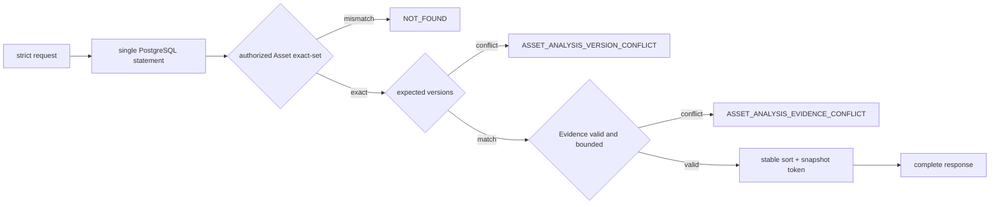

# Material Analysis Evidence Development Preview 契约 v1

> 状态：Implemented and Verified for Local Development Preview
>
> 契约编号：`BIZ-PREVIEW-004`
>
> RPC 方法：`BatchGetAssetAnalysisInputsPreviewV1`
>
> RPC Schema：`asset_analysis_inputs.preview.rpc.v1`
>
> Agent 内部 Snapshot Schema：`asset_analysis_inputs.preview.v1`
>
> Owner：Business（Asset/Evidence 真值、授权、版本、PostgreSQL、RPC）；Agent（RPC Mapper、Graph 内部 DTO 与二次校验）

## 1. 目的与非目标

本契约只为默认不注册的 `analyze_materials.v2preview1` 提供一条可在本地真实 PostgreSQL 上验证的 text/image Evidence 读取纵切。它不是生产 `BIZ-AIGC-002`，不改变后者的 Draft 状态，也不证明用户已经能上传素材或触发提取。

本批不实现上传、对象存储、OCR、视觉理解、安全审核 Provider、Evidence 写 API、后台任务、PDF/音频/视频、MaterialAnalysis 保存、计费、Approval、Session Runtime、HTTP 页面或 Tool Registry。Migration 不自动插入演示正文；集成测试只能显式写入已知测试正文/视觉描述，并按正文计算真实 SHA-256。

当前 Foundation Preview 没有独立 Agent→Business 服务身份认证和 TLS，因此本方法仅允许本地环境并由 Business 显式开关 `DORA_BUSINESS_ASSET_ANALYSIS_PREVIEW_ENABLED` 保护，默认关闭。Agent Tool 在正式 Runtime 接线前继续未注册；生产化必须迁移到正式业务 RPC Owner，并补服务身份认证、TLS 与网络最小权限。

## 2. Business 权威模型

### 2.1 单 Project Asset

Preview Asset 固定属于一个 `owner_user_id + project_id`，不支持跨 Project 复用或绑定表。Business 先使用可信 Project Owner 关系授权，再读取 Asset；Project 不存在、非 Owner、Asset 不存在、Asset 不属于该 Project 或不可用全部返回同一个 `NOT_FOUND`，不得泄漏资源存在性。只有授权成功后才能检查 `expected_asset_version`。

### 2.2 PostgreSQL 表

为避免把 Preview 结构误当作生产 Asset 模型，本批只新增：

- `business.asset_analysis_preview_assets`：`id`、`owner_user_id`、`project_id`、`asset_version`、`media_type=text|image`、`status=ready`、创建时间；
- `business.asset_analysis_preview_evidence`：不可变的 `id + asset_id + asset_version` Evidence，保存 media/evidence kind、availability、稳定 reason、真实 content digest、extractor 版本、有类型 locator、最小摘要正文与创建时间。

不建立物理外键；表和每个字段必须有中文 COMMENT。Evidence 的逻辑关联、版本一致性与 exact-set 由 Repository/Service 严格校验。当前没有生产写入口，测试 Fixture 使用 SQL 显式插入；后续如增加 Evidence 写入必须另行设计 append-only/版本跃迁和 redaction 保留策略。

### 2.3 Evidence 判别联合

媒体与证据 exact-set：

| media_type | evidence_kind | locator |
|---|---|---|
| `text` | `text_segment` | `text_range` |
| `image` | `visual_description` / `safety_label` | `image_whole` / `image_region` |

availability exact-set 为 `ready/missing/failed/redacted/unsupported`：

- `ready` 必须有小写 SHA-256 `content_digest`、两个 extractor 版本、合法 locator 和 NFC 的 1～2000 rune `content`，digest 必须等于 UTF-8 content 原字节摘要；
- 非 ready 只允许非空稳定 `reason_code`，禁止 content、digest、extractor 版本和 locator；
- 某个 Evidence kind 完全没有持久化记录时不自动生成假 Evidence 行；Agent 根据冻结 Policy 产生确定性 missing requirement。

`text_range` 满足 `0 <= start < end <= source_length`；`image_whole` 不携带坐标；`image_region` 使用 0～10000 整数基点，`width/height > 0` 且不越界。Evidence ID 全局唯一，响应中的 Asset/Evidence 按稳定复合键排序。

## 3. RPC 契约

### 3.1 请求

`BatchGetAssetAnalysisInputsPreviewV1` 一次接收 1～8 个按 `asset_id` 升序、无重复的 Target：

- `schema_version` 必须精确为 `asset_analysis_inputs.preview.rpc.v1`；
- `request_id/user_id/project_id/asset_id` 必须是规范小写 UUIDv7；
- `expected_asset_version` 是 optional i64：缺省表示未 pin，存在时必须 `>= 1`；
- Target 未排序、重复、空集或超过 8 个均为 `INVALID_ARGUMENT`。

### 3.2 响应

响应必须回显 `schema_version/request_id`，并携带非空 `snapshot_token`、`response_complete=true` 与请求 Asset exact-set。Asset 不超过 8 个、Evidence 总数不超过 32，不分页、不截断、不部分成功。

响应枚举 exact-set：

- MediaType：`TEXT=1`、`IMAGE=2`；
- EvidenceKind：`TEXT_SEGMENT=1`、`VISUAL_DESCRIPTION=2`、`SAFETY_LABEL=3`；
- Availability：`READY=1`、`MISSING=2`、`FAILED=3`、`REDACTED=4`、`UNSUPPORTED=5`；
- LocatorKind：`TEXT_RANGE=1`、`IMAGE_WHOLE=2`、`IMAGE_REGION=3`。

`snapshot_token` 是 Business 对规范排序后的 Asset 版本与 Evidence ID/content digest/availability/locator/extractor 版本计算的小写 SHA-256；它用于本次响应关联，不承诺跨写事务的 durable snapshot。Agent Mapper 把 RPC Schema 显式映射为内部 `asset_analysis_inputs.preview.v1`，生成类型不得进入 Graph State。

### 3.3 单次一致读取

Repository 必须用一个集合 SQL 同时完成 Project Owner、Asset exact-set 与 Evidence 读取，查询次数不得随 Asset 数增长。单条 PostgreSQL 语句提供一个 MVCC statement snapshot；禁止逐 Asset 查询或先授权后 N+1 读取。

处理顺序固定为：

1. 严格校验请求和 Target 集合；
2. 在同一 SQL 中按 `owner_user_id + project_id + target asset_ids + ready` 读取；
3. 若授权后的 Asset exact-set 不等于 Target exact-set，整批 `NOT_FOUND`；
4. 再检查所有存在的 `expected_asset_version`，不符整批 `ASSET_ANALYSIS_VERSION_CONFLICT`；
5. 校验行内 Evidence 判别联合、上限和冲突；
6. 稳定排序、生成 snapshot token，并一次性返回完整响应。

该方法只读，不产生业务状态转换、Outbox、幂等写或 Unknown Outcome 查询；相同数据库状态与请求得到相同规范内容和 token。

## 4. 错误与 Agent 映射

| Business/Transport | Agent `analyzematerials` |
|---|---|
| `NOT_FOUND` | `MATERIALS_NOT_AVAILABLE` |
| `ASSET_ANALYSIS_VERSION_CONFLICT` | `MATERIAL_ANALYSIS_SNAPSHOT_INVALID` |
| `LIMIT_EXCEEDED` | `MATERIAL_ANALYSIS_SNAPSHOT_INVALID` |
| `ASSET_ANALYSIS_EVIDENCE_CONFLICT` | `MATERIAL_ANALYSIS_EVIDENCE_CONFLICT` |
| `FEATURE_DISABLED`、`PREVIEW_UNAVAILABLE`、`PERSISTENCE_UNAVAILABLE`、未知 Service/Transport Error | `MATERIAL_ANALYSIS_INTERNAL` |
| `context.Canceled` / `context.DeadlineExceeded` | 原样返回 |

Adapter 每次只发起一次 RPC，使用显式请求超时且不重试；映射后必须再次调用 `ValidateEvidenceSnapshot`。任何 Schema、request ID、complete、枚举、Asset/Evidence exact-set、版本、digest 或 locator 异常均失败关闭。普通日志不得包含 Evidence 正文、文件名、MIME、URL、原始 Service Error 或数据库信息。

## 5. 兼容与验收

- 现有 Foundation Probe 与 `BIZ-PREVIEW-001..003` 的方法、字段号和语义保持不变；本方法只追加新类型与 Service 方法。
- PDF、音频、视频、对象引用、分页或放宽 Target/Evidence 上限必须发布新版本，不能复用本 v1 字段语义。
- [x] IDL、双 Module 生成代码、Business Handler/Repository、Agent Mapper 和契约测试已在同一批完成。
- [x] Business 单元测试覆盖 strict request、授权折叠、版本顺序、Evidence 判别联合、稳定排序/token 和单查询上限。
- [x] Agent 测试覆盖请求映射、全部枚举/locator、deep copy、一次调用、超时/取消、安全错误映射和完整 Snapshot 二次校验。
- [x] 真实 PostgreSQL 16 集成测试执行 Migration 并插入已知 Fixture，证明真实 digest、exact-set、Owner 隐藏和 Evidence 不可变；Fixture 未进入生产 Migration。
- [x] 2026-07-17 当前代码启动 Business/Agent Runtime，连接 `15432/16379/12379`，Foundation Probe、Agent 经真实 etcd/Kitex 调用 `BIZ-PREVIEW-004` 的统一 NOT_FOUND 映射及双端 Ready 均通过；Tool 未注册。

## 6. 评审结论

**`BIZ-PREVIEW-004` 的本地开发预览 Migration、只读 Business Repository/Service/Handler 与 Agent Adapter 已按批准范围实现并验证。** 仍不批准 Evidence 生产链、生产 `BIZ-AIGC-002`、Tool Runtime/Registry 接线、MaterialAnalysis 持久化或用户可用声明。Tool 必须保持未注册，直至独立 Runtime、认证/TLS、真实摄取链和页面验收另行通过。
