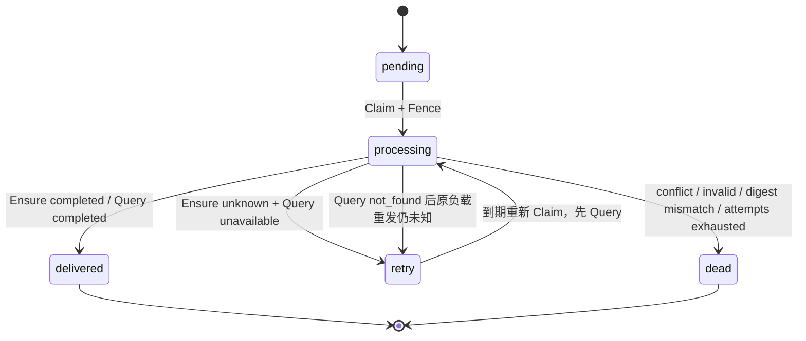

# Project Skill Binding 与 Session Snapshot Producer 契约 v1

> 文档状态：**Conditionally Approved / 条件通过**
>
> 契约版本：`project-skill-binding.contract.v1`
>
> 设计日期：2026-07-14
>
> 覆盖范围：W1-B1 所需的 Business Project Skill Binding、Published Snapshot 解析、Session Bootstrap v2 Producer、Outbox 与 Unknown Outcome
>
> 上游契约：[W1 Skill 与 Tool 入口基础契约 v1](./w1-skill-tool-entry-contract-v1.md)
>
> 下游契约：[Agent Session Skill Snapshot v2 设计评审](../agent/session-skill-snapshot-v2-review.md)
>
> 重要限制：本文不批准 Graph、Runner、Skill Loader、Executable Registry、公共 Tool、计费、收益、管理员 RBAC 或治理 HTTP 实现。

## 1. 冻结结论

W1-B1 的生产 Producer 采用 **Business Push**：Business 在 Project QuickCreate v2 的本地事务中冻结 Project 初始 Skill Binding、当前 Published Snapshot 解析结果和加密 Session Bootstrap Outbox，事务外 Dispatcher 只把同一份冻结负载发送给 Agent `EnsureProjectSessionV2`。

本契约冻结以下结论：

1. Business 是 Project Skill Binding、Skill 当前 Published Snapshot、权限判定结果、Runtime Policy 引用、治理状态与 Bootstrap Outbox 的唯一写入者。
2. Agent 是 Session Skill Snapshot Header/Item 与 Session Command Receipt 的唯一写入者；Agent 不直连 Business 数据库，也不在 Session 创建时重新解析当前 Binding。
3. W1 只允许 Project Owner 绑定自己拥有、已经发布且治理状态为 `active` 的用户 Skill；跨 Owner 市场 Skill、系统 Skill、企业/团队共享和管理员代绑全部失败关闭。
4. W1 `public_tool_refs` 必须为非 nil 空列表。`allowed_graph_tool_keys` 只是六能力字段的声明投影，不证明 Graph 已审核、已编译、已注册或可调用。
5. Runtime Policy 固定为 `skill-runtime-policy:v1`；它不能扩权、增加 Tool、提高预算、选择 Provider、决定价格或绕过 HITL。
6. QuickCreate v1 的 HTTP 请求、Agent v1 RPC、空 Snapshot digest 和存量行保持不变。只有显式 `project_quick_create.v2` 请求才进入 Binding + Bootstrap v2 路径。
7. 相同 Command 的重试、恢复和 Query 只能使用同一 Outbox 密文及同一 Snapshot digest；禁止重新读取当前 Binding 或最新 Published Snapshot。
8. Snapshot 一经 Agent 提交不可更新。后续 Binding、Draft、Published Snapshot 或治理变化不得回写历史 Session Snapshot。

### 1.1 关于 `ResolveProjectSkillSnapshotsV1` RPC

本文不注册 Agent→Business 的 `ResolveProjectSkillSnapshotsV1` 网络 RPC。冻结名称 `ResolveProjectSkillSnapshotsV1` 仅表示 Business Module 内部的有类型解析应用契约，供 QuickCreate v2 的同一数据库事务调用。

原因如下：

- 如果 Agent 在创建 Session 前反向读取 Business 当前态，Business 无法保证该读取与 Project、Binding、Outbox 同事务冻结；
- RPC 超时后再次解析可能得到新的发布快照，使同一 `command_id` 产生不同 `request_digest`；
- Agent 事务内不得执行 Business RPC；事务外读取再事务内写入仍存在状态漂移；
- 当前 W0/W1 一个 Project 只有一个默认 Session，生产创建入口已经由 Business QuickCreate Outbox 主动驱动，不需要第二个权威 Producer。

未来若增加“同一 Project 新建第二个 Session”，应单独设计 Business 持久化 Resolution Receipt 及 Query RPC；不得把当前态只读 RPC 直接当作冻结证明。本结论需要同步修正 W1 上游文档中“必须新增 Resolve RPC”的措辞，但不改变其字段冻结目标。

## 2. 目标与非目标

### 2.1 目标

- 让 Project 的期望 Skill 集合具有 Business 权威状态、CAS、幂等、审计与确定性排序。
- 把精确 Published Snapshot、Runtime Content、权限摘要、Runtime Policy 和治理 Epoch 冻结进 Session Bootstrap v2。
- 保证 Project、初始 Binding、解析元数据和 Outbox 在一个 Business 事务内提交或全部回滚。
- 保证 Agent 在一个本地事务内创建 Session 与不可变 Session Skill Snapshot。
- 保证 W0 v1 与 W1 v2 可以滚动共存，V2 失败不降级为 V1。
- 提供 Business/Agent 可独立实现的 Canonical、Golden Vector、Migration 和测试门禁。

### 2.2 非目标

- 不实现 Agent Skill Middleware、Loader、Runner、Turn 或 Skill Invocation。
- 不创建六个 Graph Tool 的 Executable Registry、Definition Version 或 Run。
- 不支持非空公共 Tool 引用。
- 不定义模型、媒体、Graph Tool 或公共 Tool 的价格与扣费。
- 不定义管理员 RBAC、跨用户公开 Skill 使用授权、企业共享或系统 Skill 分发。
- 不定义历史 Session 的强制撤销、Kill Switch 消费或治理事件协议。
- 不允许修改 W0 已发布 Migration 或静默改变现有 v1 字段语义。

## 3. 数据所有权与信任边界

| 事实 | Owner / Migration Owner | 其他 Module 的访问方式 |
| --- | --- | --- |
| Project 与 Project Owner | Business | Business HTTP；Agent 只接收可信 Bootstrap DTO |
| Project Skill Binding Set、Binding 与审计 | Business | Business HTTP/应用契约；不得跨库读取 |
| Skill Draft、Published Snapshot、治理状态/Epoch | Business | Business 本地解析；未来跨 Module 只能版本化 RPC |
| Bootstrap Resolution 元数据与加密 Outbox | Business | Business Dispatcher 读取；Agent 不访问 Business 表 |
| Session、Session Skill Snapshot、Command Receipt | Agent | Agent Repository；Business 只接收 v2 Receipt |
| Graph Tool Registry、Run、Tool Receipt | Agent | W1-B1 不创建 |
| 公共 Tool、计费策略与管理员 RBAC | 未冻结 | W1 一律 unavailable |

可信输入只来自：

- Business 已认证的 Project Owner Principal；
- Business PostgreSQL 的 Project、Binding、Skill 与 Published Snapshot；
- 固定契约常量和启动时验证的 `session_skill_snapshot_limits.v1` 配置；
- Business/Agent 各自预加载、用途隔离的加密器。

浏览器、模型、Skill 文本均不能提交可信 `owner_user_id`、namespace、priority、permission digest、Runtime Policy、governance epoch、价格、预算或 Tool 可执行状态。

## 4. Business 权威模型

所有新表属于 `business` Schema，由 `business/migrations` 的前向 Migration 创建。所有关联均为逻辑外键，禁止 `FOREIGN KEY`、`REFERENCES` 和数据库级联；每张表、每列都必须有中文 COMMENT。

### 4.1 `business.project_skill_binding_set`

该表是 Project 期望 Skill 集合的聚合根，即使集合为空也保留一行。

| 列 | 类型 | 语义 |
| --- | --- | --- |
| `project_id` | `uuid` PK | Business Project 逻辑引用 |
| `owner_user_id` | `uuid` | 冻结的 Project Owner，用于 owner-safe 查询 |
| `schema_version` | `varchar(64)` | W1 固定 `project_skill_binding_set.v1` |
| `set_version` | `bigint` | 从 1 开始的 CAS 版本 |
| `selection_digest` | `bytea` | 当前启用项 Canonical SHA-256，固定 32 字节 |
| `enabled_count` | `integer` | 当前启用项数量，受 limits 限制 |
| `created_at` | `timestamptz` | UTC 创建时间 |
| `updated_at` | `timestamptz` | UTC 最近变更时间 |

`set_version` 只在集合语义发生变化时递增。相同集合的幂等重放或 no-op 不递增版本。

### 4.2 `business.project_skill_binding`

该表保存 Project 与 Skill 的当前绑定状态；历史动作进入独立 append-only 审计表。

| 列 | 类型 | 语义 |
| --- | --- | --- |
| `id` | `uuid` PK | 应用生成 UUIDv7 |
| `project_id` | `uuid` | Project 逻辑引用 |
| `skill_id` | `uuid` | Business Skill 逻辑引用 |
| `namespace` | `varchar(16)` | W1 只允许 `user` |
| `priority` | `integer` | W1 固定 `100`，不得由客户端覆盖 |
| `status` | `varchar(16)` | `enabled` 或 `disabled` |
| `source` | `varchar(32)` | `quick_create` 或 `owner_replace` |
| `enabled_by_user_id` | `uuid` | 最近一次启用的可信 Owner |
| `enabled_at` | `timestamptz` | 最近一次启用时间 |
| `disabled_by_user_id` | `uuid NULL` | 最近一次停用的可信 Owner |
| `disabled_at` | `timestamptz NULL` | 最近一次停用时间 |
| `version` | `bigint` | 行 CAS/审计版本，从 1 开始 |
| `created_at` | `timestamptz` | UTC 创建时间 |
| `updated_at` | `timestamptz` | UTC 最近变更时间 |

唯一约束为 `(project_id, skill_id)`。状态组合必须满足：`enabled` 时 disabled 字段为空；`disabled` 时 disabled 字段完整。W1 不允许同一 Skill 以多个 namespace 重复绑定。

### 4.3 `business.project_skill_binding_audit`

该表 append-only 记录 `enabled/disabled/re_enabled/replaced` 动作，至少保存：

- `id/project_id/binding_id/skill_id`；
- `binding_set_version`；
- `action/from_status/to_status/source`；
- `actor_user_id/occurred_at`；
- 可选的稳定 `reason_code`，禁止保存用户 Prompt、完整 Skill 正文或权限策略原文。

审计行禁止 UPDATE/DELETE。一次集合替换使用同一 `command_receipt_id` 关联本次全部变更，但批量写入必须使用一个 batch insert，禁止逐 Skill 循环 SQL。

### 4.4 `business.project_skill_binding_command_receipt`

后续 Binding Replace 命令使用独立回执，不复用 `skill_command_receipt`：

- 唯一作用域：`actor_user_id + project_id + command_type + key_digest`；
- `command_type=replace_project_skill_bindings`；
- `semantic_digest` 覆盖 Project、Expected Set Version 和目标 `selection_digest`；
- 冻结响应保存 `result_set_version/result_selection_digest/result_enabled_count`；
- 同键同义重放冻结响应，同键异义返回 `IDEMPOTENCY_CONFLICT`。

### 4.5 `business.project_session_skill_resolution`

该表保存某个 Session Bootstrap Command 已冻结的解析 Header；它不是当前 Binding 读模型。

| 列 | 类型 | 语义 |
| --- | --- | --- |
| `id` | `uuid` PK | Resolution UUIDv7 |
| `command_id` | `uuid` UNIQUE | 对应 Business Outbox / Agent Command |
| `project_id` | `uuid` | Project 逻辑引用 |
| `owner_user_id` | `uuid` | 解析时可信 Owner |
| `binding_set_version` | `bigint` | 解析时 Binding Set CAS 版本 |
| `binding_selection_digest` | `bytea` | 解析时启用集合摘要 |
| `snapshot_schema_version` | `varchar(64)` | `session_skill_snapshot.v1` |
| `snapshot_kind` | `varchar(32)` | `empty` 或 `published_refs` |
| `skill_count` | `integer` | 冻结 Skill 数量 |
| `snapshot_set_digest` | `bytea` | Agent v2 契约的集合摘要 |
| `runtime_policy_ref` | `varchar(256)` | W1 固定 `skill-runtime-policy:v1` |
| `resolved_at` | `timestamptz` | 同一 Business 事务中的 UTC 时间 |

空集合必须使用 W0 固定 digest，且 Item 为 0 行。该表和 Item 均不可更新或删除。

### 4.6 `business.project_session_skill_resolution_item`

Item 保存不可变 metadata，不复制 Runtime Content 明文：

- `resolution_id/project_id/command_id/load_order/priority/namespace`；
- `binding_id/binding_version/skill_id/publisher_user_id`；
- `published_snapshot_id/publication_revision/definition_schema_version/content_digest`；
- `runtime_content_schema_version/runtime_content_digest`；
- `allowed_graph_tool_keys/public_tool_refs`；
- `permission_snapshot_digest/runtime_policy_ref/governance_epoch`；
- `published_at_unix_ms/created_at`。

主键建议为 `(resolution_id, load_order)`，并唯一约束 `(resolution_id, skill_id)` 和 `(resolution_id, published_snapshot_id)`。JSONB 只保存两个有界数组，必须检查 array 类型；W1 `public_tool_refs='[]'::jsonb`。

Published Definition 和 Runtime Content 明文仍由不可变 `skill_published_snapshot` / `skill_content_revision` 事实承载。Resolution Item 只保存跨 Module 重放和审计所需 metadata，避免在 Business 多复制一份正文。

### 4.7 Skill Governance Epoch

在新的 Business 前向 Migration 中为 `business.skill` 增加：

```text
governance_epoch bigint NOT NULL
```

- 存量 `active` Skill 机械回填为 `1`；
- 新 Skill 初始值为 `1`；
- 每次治理有效性发生变化时，在同一治理事务中递增；
- 发布新内容不递增 governance epoch，由 publication revision 表达；
- W1 尚无治理 HTTP，不能借该字段创建未授权管理入口。

`governance_epoch` 只是历史快照和未来治理失效协议的输入。W1-B1 不实现对历史 Session 的主动终止或在线 epoch 回查。

## 5. Binding 生命周期与写入时机

### 5.1 QuickCreate v1 保持不变

现有请求：

```json
{"initial_prompt":"..."}
```

继续使用 `project_quick_create.v1`、`EnsureProjectSessionV1` 和显式 empty Snapshot。缺少 `schema_version` 的请求不得因 Feature Flag 或部署时间自动切换为 v2，避免同一 Idempotency-Key 在滚动升级前后产生不同语义摘要。

### 5.2 QuickCreate v2 显式选择

同一路径 `POST /api/v1/projects:quick-create` 增加严格的显式 v2 request variant：

```json
{
  "schema_version": "project_quick_create.v2",
  "initial_prompt": "...",
  "enabled_skill_ids": ["019f0000-0000-7000-8000-000000000101"]
}
```

规则：

- `schema_version` 必填且只能为 v2；
- `enabled_skill_ids` 必须存在且为非 nil 数组，可以为空；
- ID 必须为规范小写 UUIDv7，重复值直接拒绝；
- 客户端顺序不构成 priority；Business 规范化为 skill ID 升序；
- W1 每项 `namespace=user, priority=100`；
- 即使数组为空，显式 v2 仍调用 Agent v2 并产生 v2 Receipt，不转换为 v1。

QuickCreate v2 的 `Idempotency-Key` 语义同时覆盖 Prompt 与规范化 Binding Set。相同键但 Skill 集合不同必须返回 `409 IDEMPOTENCY_CONFLICT`。

### 5.3 QuickCreate v2 事务

Business 在事务前完成：

- Prompt NFC/空白处理、ID/时间生成；
- `session_skill_snapshot_limits.v1` 配置校验；
- Outbox v2 key/encryptor 预加载；
- 原始 Idempotency-Key 摘要计算。

同一 Business 事务内执行：

1. Claim QuickCreate Receipt；同键重放或冲突在写候选事实前收敛。
2. 创建 Project。
3. 创建 Binding Set Header 和初始 Binding rows；空集合也创建 Header。
4. 用一个集合查询锁定/读取全部 enabled Binding、Skill 当前 Published Snapshot 与不可变 Definition。
5. 执行权限、治理、Runtime Policy、Canonical 和 limits 校验。
6. 构造 Runtime Content、Permission digest、Snapshot Items 和 set/request digest。
7. batch 写入 Resolution Header/Items。
8. 使用事务前已就绪的本地 encryptor 加密完整 Bootstrap v2 plaintext。
9. 创建 Project Session Binding 与 v2 Outbox。
10. 写入冻结 QuickCreate Receipt 并提交。

任一步失败时 Project、Binding、Resolution、Outbox 和 Receipt 全部回滚。事务内禁止 KMS、RPC、etcd、Redis、文件或其他外部 I/O。

### 5.4 Project 创建后的 Binding Replace

目标 Owner API 采用全量替换：

```text
PUT /api/v1/projects/{project_id}/skill-bindings
If-Match: <opaque binding_set_etag>
Idempotency-Key: <stable key>
```

```json
{
  "schema_version": "project_skill_binding_replace.v1",
  "enabled_skill_ids": ["..."]
}
```

它只更新“后续新 Session 的期望集合”，绝不修改当前 Agent Session Snapshot。更新事务必须：

- owner-safe 校验 Project；
- 先 Claim 回执，再校验 Expected Set Version；
- 批量校验所有 Skill；
- 用固定数量 SQL 完成 enable/disable/upsert、Header CAS 和 batch Audit；
- 相同集合为 no-op，不递增版本；
- 返回新的 opaque ETag、set version、selection digest 和安全 Item 投影。

当前 Agent Schema 具有 `UNIQUE(project_id)`，且产品尚无“同一 Project 新建第二 Session”契约。因此该 HTTP 路由在新 Session 创建语义冻结前必须保持未注册；实现无运行效果的假更新会误导用户。W1-B1 的非空生产路径只允许 QuickCreate v2 初始选择。

## 6. W1 Eligibility、Permission、Runtime Policy 与 Governance

### 6.1 全量失败关闭

解析 enabled Binding 时，只要任一项不满足条件，整个 Session Bootstrap 失败；不能静默丢弃失败 Skill 后继续创建部分或空 Snapshot。

只有“Binding Set 本来就是空集合”才能产生合法 empty Snapshot。

### 6.2 Skill Eligibility

每个 enabled Binding 必须同时满足：

1. Project 为当前可信 Owner 所有且生命周期为 `active`。
2. Binding `status=enabled`、`namespace=user`、`priority=100`。
3. Skill 存在且 `skill.owner_user_id == project.owner_user_id`。
4. Skill 具有非空 `current_published_snapshot_id`。
5. 当前 Published Snapshot 与 Skill 指针、publication revision、source revision 一致。
6. Skill `governance_status=active`。
7. Published Definition schema 为 `skill_definition.v1`，重算完整 Canonical digest 与数据库一致。
8. `public_tool_refs` 是非 nil 空列表。
9. Runtime Content、metadata 和总量均未超过 `session_skill_snapshot_limits.v1`。

错误对外统一为 owner-safe / existence-safe 稳定代码，不向调用方区分“他人 Skill 存在但不可用”和“Skill 不存在”。

### 6.3 Permission Snapshot v1

W1 唯一允许的 permission basis 是已经冻结的资源所有权规则 `owner_private`。它不是通用 RBAC，也不是 bearer token。

Permission Canonical 对象固定字段顺序：

```text
schema_version
decision
basis
subject_user_id
project_id
project_owner_user_id
binding_id
binding_version
binding_set_version
namespace
skill_id
skill_owner_user_id
published_snapshot_id
allowed_actions
policy_ref
```

固定值：

```text
schema_version = project_skill_permission_snapshot.v1
decision       = allow
basis          = owner_private
namespace      = user
allowed_actions = ["session_snapshot"]
policy_ref     = project-skill-permission:owner-private:v1
```

`permission_snapshot_digest` 是上述 compact canonical JSON 的 SHA-256 小写十六进制。它只用于历史证明和摘要绑定；Agent 只检查格式并纳入 Snapshot set digest，不凭该 digest 扩权。

以下能力 W1 明确不可用：

- 绑定其他用户发布的市场 Skill；
- system namespace 或管理员默认 Skill；
- 企业、团队、共享 Project 或代理操作；
- 管理员 Reviewer 身份自动拥有 Project 使用权；
- 浏览器或模型提交 permission digest/policy ref。

### 6.4 Runtime Policy v1

W1 每个 Item 的 `runtime_policy_ref` 固定为：

```text
skill-runtime-policy:v1
```

该引用冻结以下安全含义：

- Skill 只允许 inline 注入，不允许 `fork` 或 `fork_with_context`；
- Skill 不注册 Tool、不改变六 Tool 白名单；
- `allowed_graph_tool_keys` 只来自六个 capability applicability；
- `public_tool_refs=[]`；
- Skill 不提高模型、Tool、Token、时间、并发、异步任务或费用预算；
- Skill 不决定 Provider、价格、扣费、权限、HITL 或业务状态机；
- 当前无 Executable Registry 时，不得把声明 key 当作可调用能力。

未知 policy ref、配置缺失或 Business/Agent 对 ref 的支持集合不一致时，V2 Feature Flag 不得开启。

### 6.5 Governance

新 Session 解析只接受 `governance_status=active`，并冻结当前 `governance_epoch`。`suspended/offline` 一律阻止整个 Bootstrap。

历史 Session：

- 不切换到新 Published Snapshot；
- 不删除或改写 Session Snapshot；
- W1-B1 不宣称具备在线治理终止能力；
- 后续治理事件/epoch 校验必须独立设计，明确 continue/stop、Outbox、Unknown Outcome 和审计后再实现。

## 7. Runtime Content 与稳定排序

### 7.1 Runtime Content 投影

Business 从精确 Published `SkillDefinitionV1` 投影 `SkillRuntimeContentV1`：

- `name` 来自 Published Definition `name`；
- `input_description/output_description/invocation_rules`；
- 六个 `CapabilityGuidanceV1`；
- `examples/starter_prompts`；
- 不包含 summary/category/tags/market_listing/public_tool_refs/价格/权限原文。

Runtime Content Canonical、字段顺序、NFC 和 digest 完全遵循 Snapshot v2 评审，不共享 Go 类型。

### 7.2 Allowed Graph Tool Keys

按以下产品固定顺序遍历六个 capability，`applicability=enabled` 时加入：

1. `plan_creation_spec`
2. `analyze_materials`
3. `plan_storyboard`
4. `generate_media`
5. `write_prompts`
6. `assemble_output`

结果不可重复，且必须与 enabled guidance 集合严格一致。空列表允许，但不表示存在可执行 Tool。

### 7.3 Binding 与 Snapshot 排序

Binding Selection Canonical Item 字段顺序固定为：

```text
priority
namespace
skill_id
```

W1 所有项 priority=100、namespace=user，因此 Binding Set 按 `skill_id ASC` 排序。

Snapshot Item 的最终 `load_order` 为规范排序后的稠密序列 `1..N`。通用排序冻结为：

```text
priority DESC, namespace_rank ASC, skill_id ASC
```

W1 `namespace_rank(user)=1`；system namespace 尚不可用，不能自行加入排序。

Agent 只验证 wire 顺序与稠密 load order，不能重新排序。

## 8. Business 内部解析契约

### 8.1 输入

`ResolveProjectSkillSnapshotsV1` 是 Business 内部有类型应用契约，输入至少包含：

| 字段 | 来源 |
| --- | --- |
| `project_id` | 当前 QuickCreate 聚合 |
| `owner_user_id` | Auth Principal / Project Owner |
| `command_id` | 待写 Outbox 稳定 UUIDv7 |
| `binding_set_version` | 同事务 Binding Header |
| `binding_selection_digest` | 同事务 Binding Header |
| `resolved_at` | QuickCreate 冻结 UTC 时间 |

它不得接受客户端提供的 Published Snapshot ID、permission digest、policy ref、governance epoch、publication revision 或 allowed Tool key。

### 8.2 输出

输出为与 Agent `SessionSkillSnapshotV1` 一一映射的 typed DTO，并包含 Business 审计所需的 `binding_id/binding_version/binding_set_version`。跨 Module wire 不发送这些内部绑定字段，只把它们纳入 permission digest 与 Resolution Item。

### 8.3 集合查询

非空解析使用一次参数化集合查询读取：

```text
Project
JOIN enabled Project Skill Binding
JOIN Skill aggregate/current published pointer
JOIN immutable Published Snapshot
JOIN immutable Content Revision
```

查询必须显式选择字段并映射到专用 ReadDTO，不使用 `SELECT *`。使用 `FOR SHARE`/等价稳定事务隔离锁定 Skill 当前 Published 指针，避免发布切换与解析交错；一次请求不得按 Skill 循环查询。

Runtime Content 映射、Canonical 和加密属于有界本地 CPU/内存操作，不产生外部 I/O。Resolution Items 使用一次 batch insert。

## 9. Canonical Digest 与 Golden Vector

所有摘要规则继承 Snapshot v2 评审：UTF-8 NFC、compact JSON、禁止 HTML escape、固定字段顺序、整数十进制、数组非 nil、禁止 `map` 作为编码源。

### 9.1 Binding Set Vector

Canonical bytes：

```json
[{"priority":100,"namespace":"user","skill_id":"019f0000-0000-7000-8000-000000000101"}]
```

```text
selection_digest
  = 0eafe12d92686ad70c9d55f8cf2963dfe12570a6e31e90a1f28931df7e3e96fd
```

空 Binding Set 继续使用 `sha256("[]")`：

```text
4f53cda18c2baa0c0354bb5f9a3ecbe5ed12ab4d8e11ba873c2f11161202b945
```

### 9.2 Permission Vector

```json
{"schema_version":"project_skill_permission_snapshot.v1","decision":"allow","basis":"owner_private","subject_user_id":"019f0000-0000-7000-8000-0000000000cd","project_id":"019f0000-0000-7000-8000-0000000000ab","project_owner_user_id":"019f0000-0000-7000-8000-0000000000cd","binding_id":"019f0000-0000-7000-8000-000000000104","binding_version":1,"binding_set_version":1,"namespace":"user","skill_id":"019f0000-0000-7000-8000-000000000101","skill_owner_user_id":"019f0000-0000-7000-8000-0000000000cd","published_snapshot_id":"019f0000-0000-7000-8000-000000000103","allowed_actions":["session_snapshot"],"policy_ref":"project-skill-permission:owner-private:v1"}
```

```text
permission_snapshot_digest
  = 785ae395603deae2c7daf8d183e27b2f2ca21c082a906cb1bab07b2e45c5280e
```

### 9.3 Producer Snapshot Vector

该向量复用 Snapshot v2 评审的 Runtime Content digest，并把 publisher 与 permission 替换为 W1 owner-private 生产语义：

```json
[{"load_order":1,"priority":100,"namespace":"user","skill_id":"019f0000-0000-7000-8000-000000000101","publisher_user_id":"019f0000-0000-7000-8000-0000000000cd","published_snapshot_id":"019f0000-0000-7000-8000-000000000103","publication_revision":2,"definition_schema_version":"skill_definition.v1","content_digest":"dc18b1bbe2824f462cbef7373e48074d609cdd4d57897dd87e1b26c85b96d513","runtime_content_schema_version":"skill_runtime_content.v1","runtime_content_digest":"d81700e078c331dc271db6d9c7c169f75f48f9fd89f944671883316044594168","allowed_graph_tool_keys":["write_prompts"],"public_tool_refs":[],"permission_snapshot_digest":"785ae395603deae2c7daf8d183e27b2f2ca21c082a906cb1bab07b2e45c5280e","runtime_policy_ref":"skill-runtime-policy:v1","governance_epoch":3,"published_at_unix_ms":1784011500123}]
```

```text
snapshot_set_digest
  = 6242c4e449a2f2c9aba4880d7d3ea614b48e3fa652f38ab11be7cbde45e8c905
```

对应 `ensure_project_session.v2` request digest：

```text
2a12a43e1a774216fb3828a9caac6ba55a6c1a02f5f77ec9addeeadf997c4091
```

Snapshot v2 评审中使用 `sha256("permission-fixture")` 的向量继续作为 Agent 传输层“opaque permission digest”测试；本节新增的是 Business Production Producer 向量。两组向量不能互相覆盖或为了通过测试随意改值。

### 9.4 QuickCreate v2 Semantic Vector

QuickCreate v2 Semantic Canonical 字段顺序：

```text
schema_version
prompt_present
prompt_digest
binding_set_schema_version
binding_set_digest
```

Fixture canonical：

```json
{"schema_version":"project_quick_create.v2","prompt_present":true,"prompt_digest":"273f7787225c057d3b40cecfdad67cefd35e4b0fa95eacff5668011fc44497df","binding_set_schema_version":"project_skill_binding_set.v1","binding_set_digest":"0eafe12d92686ad70c9d55f8cf2963dfe12570a6e31e90a1f28931df7e3e96fd"}
```

```text
quick_create_semantic_digest
  = 3d2bc7c4c655457d1bcb3df25c31b7c65bf5ad3caad36d68ad1ce54a5b35bba7
```

## 10. Session Bootstrap v2 Producer DTO

### 10.1 Cross-module RPC

Business 调用 Agent-owned：

- `EnsureProjectSessionV2`
- `QueryProjectSessionCommandV2`

Thrift 字段号、enum、schema version、Receipt 和错误 envelope 完全采用 Snapshot v2 评审。本文不另建 Business→Agent 第二套 DTO，也不修改 v1 字段。

Business Mapper 必须逐字段映射内部 Resolution 到生成的 Thrift DTO；禁止通过 JSON 往返或共享 Agent `internal` 类型。

### 10.2 Outbox v2 Plaintext

Outbox plaintext schema 固定：

```text
session_bootstrap_outbox_payload.v2
```

字段至少包含：

- `schema_version/command_id/project_id/owner_user_id/creation_source`；
- 可选规范化 `initial_prompt` 与 `prompt_digest`；
- 完整 `SessionSkillSnapshotV1`；
- `accepted_at_unix_ms`；
- `request_digest`。

Plaintext 使用有类型 Canonical Encoder；`payload_digest` 对完整 plaintext canonical bytes 求 SHA-256。Dispatcher 解密后必须重算 payload、prompt、runtime、snapshot 和 request digest，任何不匹配都失败关闭。

### 10.3 Outbox 持久化字段

扩展现有 `business.project_session_outbox`，按 `schema_version` 区分语义：

| 字段 | v1 | v2 |
| --- | --- | --- |
| `schema_version` | `agent.session-bootstrap.v1` | `session_bootstrap_outbox_payload.v2` |
| `payload_*` envelope | 只保护 Prompt | 保护完整 Bootstrap plaintext |
| `request_digest` | Ensure v1 digest | Ensure v2 digest |
| `skill_snapshot_digest` | 回填 empty digest | 冻结 set digest |
| `skill_count` | 回填 0 | 冻结 count |
| `binding_set_version` | `NULL` | 冻结 set version |
| `resolution_id` | `NULL` | Resolution 逻辑引用 |

V2 envelope 使用 `algorithm/key_version/nonce/ciphertext_and_tag`。AAD 固定字段顺序：

```text
schema_version
command_id
project_id
owner_user_id
request_digest
skill_snapshot_digest
```

数据库和日志禁止保存 v2 initial prompt、Runtime Content、guidance、examples 或 starter prompts 的明文副本。

### 10.4 Project Session Binding 扩展

扩展现有 `business.project_session_binding`：

- `request_schema_version`：v1/v2；
- `skill_snapshot_digest`：v1 回填 empty digest；
- `skill_count`：v1 回填 0；
- `binding_set_version`：v1 为 NULL、v2 非空；
- `resolution_id`：v1 为 NULL、v2 非空。

`ready` 仍要求 Agent Session ID；v2 MarkDelivered 还必须核对 Receipt 中 snapshot digest/count。

## 11. Idempotency、事务与 Unknown Outcome

### 11.1 幂等边界

| 命令 | 唯一作用域 | Semantic Digest |
| --- | --- | --- |
| QuickCreate v2 | `owner + quick_create + key_digest` | Prompt 语义 + Binding Set digest |
| Binding Replace | `actor + project + command_type + key_digest` | Project + Expected Set Version + target set digest |
| Agent Ensure v2 | `command_id` | Snapshot v2 `request_digest` |

全部命令遵循：同键同义重放冻结结果；同键异义稳定冲突；100 并发最多一个业务事实。

### 11.2 Dispatcher 状态机



### 11.3 Unknown Outcome 固定顺序

1. Ensure v2 completed：核对 command、request digest、snapshot digest/count，MarkDelivered。
2. Timeout、EOF、连接重置或 retryable service error：进入 unknown，Query v2。
3. Query completed：核对同一 Receipt，MarkDelivered。
4. Query not_found：解密同一 Outbox plaintext，以相同 command/request/snapshot 重发 Ensure v2。
5. Query conflict/version conflict：停止自动重试，Outbox 进入 dead 并告警。
6. Query unavailable：保留密文并退避 Query；不能先重发。

禁止：

- 创建新 command 掩盖冲突；
- 重算当前 Binding/Permission/Published Snapshot；
- V2 失败后调用 V1；
- Query 未确认 not_found 时重发写请求；
- Agent completed Receipt 未核对 digest/count 就清除密文。

### 11.4 Delivered 与密文清理

Business 在同一事务中：

1. 以 Outbox lease owner/version Fence 标记 delivered；
2. 更新 `project_session_binding` 为 ready；
3. 校验并保存 Agent session/message/input 安全引用；
4. 清空 v2 `algorithm/key_version/nonce/ciphertext_and_tag`；
5. 写 `payload_cleared_at`；
6. 保留 command/request/snapshot/payload digest、skill count、Resolution、attempt 和 Receipt 审计字段。

清理失败必须重试本地提交，不重新调用 Agent。密钥在 delivered 前丢失属于不可自动恢复告警，不能降级为空 Snapshot。

## 12. Session 隔离与失败关闭

### 12.1 旧新 Session

| 场景 | 结果 |
| --- | --- |
| W0 QuickCreate v1 | Agent v1 empty Snapshot，digest 不变 |
| QuickCreate v2 + 空集合 | Agent v2 empty Snapshot，V2 Receipt |
| QuickCreate v2 + 非空集合 | Agent v2 published_refs Snapshot |
| Session 创建后编辑 Skill Draft | 旧 Session 不变 |
| Session 创建后发布新 Snapshot | 旧 Session 不变；未来新 Session 使用新发布 |
| Session 创建后 Binding Replace | 旧 Session 不变 |
| Session 创建后 Skill suspended/offline | Snapshot 不改写；W1 尚无在线终止机制 |

Migration 不给 W0 Session 补 Skill，不把 v1 Receipt 改写为 v2，也不从当前 Binding 回填历史 Session。

### 12.2 失败关闭矩阵

| 条件 | 稳定结果 | 禁止副作用 |
| --- | --- | --- |
| Binding ID 重复/超限 | `PROJECT_SKILL_BINDING_INVALID` | 不创建 Project/Outbox |
| Skill 不存在或跨 Owner | `PROJECT_SKILL_UNAVAILABLE` | 不泄露存在性 |
| Skill 未发布 | `PROJECT_SKILL_UNAVAILABLE` | 不退化为 Draft |
| suspended/offline | `PROJECT_SKILL_GOVERNANCE_UNAVAILABLE` | 不静默丢弃 Item |
| 非空 public refs | `PROJECT_SKILL_PUBLIC_TOOL_UNAVAILABLE` | 不创建 Snapshot |
| 未知 runtime policy | `PROJECT_SKILL_RUNTIME_POLICY_UNAVAILABLE` | 不使用默认猜测 |
| digest/Canonical 不一致 | `PROJECT_SKILL_SNAPSHOT_INVALID` | 不持久化部分 Resolution |
| limits 超限 | `SNAPSHOT_LIMIT_EXCEEDED` | 不截断 Item/正文 |
| Agent v2 capability 未就绪 | `PROJECT_SESSION_V2_UNAVAILABLE` | 不降级 v1 |
| 加密/key 不可用 | `CONTENT_PROTECTION_UNAVAILABLE` | 不保存明文 |

对外错误只能包含稳定 code、安全中文 message、request_id 和可选字段错误；不得包含 SQL、内部地址、权限策略原文、Prompt 或 Skill 正文。

## 13. Limits

Business producer 和 Agent consumer 必须共同支持 `session_skill_snapshot_limits.v1`。Business effective limit 不得大于任何 Agent 实例的接收 limit。

采用 Snapshot v2 评审的默认值与 hard ceiling，包括：

- `max_items` 默认 16、ceiling 32；
- 单 Item Runtime Content 默认 64 KiB、ceiling 128 KiB；
- 总 Runtime Content 默认 256 KiB、ceiling 1 MiB；
- Snapshot metadata 默认 128 KiB、ceiling 256 KiB；
- examples/starter prompts 默认各 16、ceiling 32；
- allowed Graph Tool keys 最大 6；
- W1 public Tool refs 最大 0；
- RPC/Outbox plaintext 默认 2 MiB、ceiling 4 MiB。

启动时必须验证 limits profile、runtime policy ref 和 Agent capability；不一致时 V2 Feature Flag 保持关闭。

## 14. Migration、兼容与发布顺序

### 14.1 Business Forward Migration

不得修改 `20260714000200` 或 W1 Skill Foundation 已执行 Migration。新增前向 Migration：

1. 创建 Binding Set、Binding、Binding Audit、Binding Command Receipt。
2. 创建 Session Skill Resolution Header/Item。
3. 为 Skill 增加 governance epoch 并机械回填 active 存量。
4. Expand `project_creation_receipt` 的 quick-create schema/snapshot 审计列。
5. Expand `project_session_binding` 的 request schema、snapshot digest/count、binding version、resolution ref。
6. Expand `project_session_outbox` 的 v2 schema、snapshot metadata 与整包 envelope 约束。
7. W0 行回填 v1 schema、empty digest、count=0；已有 prompt envelope 语义不变。
8. 添加所有中文 COMMENT、CHECK、唯一约束和已知查询索引。
9. 集成测试断言 `business` Schema 无物理外键。

### 14.2 Down Migration

Down 必须先检查：

- 任一 QuickCreate v2 Receipt；
- 任一 v2 Outbox/Session Binding；
- 任一非空 Resolution/Binding；
- 任一 governance epoch 不可机械恢复的治理动作。

存在任一生产 v2/Binding 数据时必须 `RAISE EXCEPTION`，不得把非空集合改成 empty、删除审计或伪装为 W0。

### 14.3 发布顺序

```text
Business schema expand
→ Agent Snapshot v2 schema + V1/V2 双版本 binary 全量上线
→ Agent v2 capability/readiness 验证
→ Business 双版本 producer/dispatcher binary 上线
→ 两端 limits/runtime policy 一致性验证
→ 开启 Business v2 feature flag
→ 前端发送显式 project_quick_create.v2
```

回滚时先关闭 v2 新流量，再回滚到仍支持 V1/V2 Query 和存量 Outbox 的双版本 binary。只要存在 v2 数据，不能回滚到不认识 v2 的 Agent/Business 版本。

## 15. 测试与 Evidence

### 15.1 Canonical / Contract

- Snapshot v2 原五组 golden vector 不变；
- 本文 Binding、Permission、Producer Snapshot、QuickCreate v2 四组 vector；
- Business/Agent 独立 encoder，不共享生产包；
- NFC、nil/empty list、重复 ID、顺序、未知 enum、整数边界和 HTML escape；
- Definition full digest、Runtime subset digest、set/request digest 逐层篡改。

### 15.2 Business Domain / Repository

- QuickCreate v1 完整回归；
- v2 empty/non-empty；
- 100 并发同键同义只产生一个 Project/Binding/Resolution/Outbox；
- 同键不同 Skill 集合冲突；
- Project/Binding/Resolution/Outbox 任一步失败全部回滚；
- Published pointer 并发切换时只冻结一个完整 revision；
- 一个集合查询读取 1/10/16 项，SQL 数固定；
- Binding/Resolution Items batch insert，无 N+1；
- owner-private 成功，cross-owner/system/public Tool/RBAC/计费全部失败关闭；
- Binding Replace CAS、no-op、幂等重放与审计 batch。

### 15.3 Agent / Cross-module

- V1 empty create/query/replay 字节与数据库结果不变；
- V2 empty/nonempty create/query/replay；
- 同 command 跨 V1/V2 返回 version conflict；
- Business Producer DTO 经 Kitex 到 Agent 后独立重算完全一致；
- commit 后丢响应 → Query completed；
- commit 前失败 → Query not_found → 原密文重发；
- Query unavailable/conflict 保留 Outbox，不换键、不重解析；
- 发布、解绑、编辑 Draft 后旧 Session 仍读取冻结 Item；
- DB、日志、Event、Receipt 中检索不到 Prompt/Runtime Content fixture 明文；
- 真实 PostgreSQL 16 Migration、锁、并发、COMMENT 和无外键测试。

### 15.4 Evidence 最小字段

允许记录：`request_id/command_id/project_id/session_id`、schema version、binding set version、snapshot digest、skill count、状态、attempt、稳定错误码和字节数。

禁止记录：Cookie、CSRF、原始 Idempotency-Key、Prompt、Runtime Content、Definition 正文、permission canonical、密文、nonce、key version、完整 RPC payload 或数据库凭据。

## 16. 未决阻塞与建议评审结论

| ID | 阻塞/决策 | 本文建议 | 未关闭影响 |
| --- | --- | --- | --- |
| PSB-DEC-001 | Producer pull 还是 push | **关闭：Business push + v2 encrypted Outbox** | 禁止 Agent 反向解析当前态 |
| PSB-DEC-002 | `ResolveProjectSkillSnapshotsV1` 是否注册 RPC | **关闭：W1 不注册，仅 Business 内部 typed contract** | 上游文档需同步措辞 |
| PSB-DEC-003 | W1 permission | **关闭：仅 owner-private** | 跨 Owner/市场 Skill 不可用 |
| PSB-DEC-004 | Runtime Policy | **关闭：固定 `skill-runtime-policy:v1`** | 未知 ref 阻止 V2 |
| PSB-DEC-005 | Graph Tool 声明含义 | **关闭：只做 declaration snapshot** | 不得宣称 SMK-007/008 可执行 |
| PSB-BLK-001 | 跨 Owner市场 Skill 授权/RBAC 未冻结 | 保持 unavailable | 不能冒烟公共市场 Skill 使用 |
| PSB-BLK-002 | system Skill 管理、选择与优先级未冻结 | namespace `system` 拒绝 | W1 只支持用户自有 Skill |
| PSB-BLK-003 | public Tool Definition/Permission/Billing 未冻结 | `public_tool_refs=[]` | 不能启用 `@Tool` runtime |
| PSB-BLK-004 | Graph Tool Executable Registry 未审核 | keys 仅声明 | 不创建 Runner/Graph/Run |
| PSB-BLK-005 | 历史 Session 在线治理/kill 协议未冻结 | 只冻结 epoch，不回写历史 | 不能宣称暂停会即时终止旧 Session |
| PSB-BLK-006 | 一个 Project 新建第二 Session 未冻结 | Binding Replace 路由不注册 | 创建后改 Binding 暂无可见 runtime 效果 |
| PSB-BLK-007 | Agent v2 capability 与双端 limits 尚未部署 | Feature Flag 默认关闭 | Business 不得发送 v2 |

评审结论：**条件通过，已解除 Snapshot v2 的 Production Producer 设计阻塞**。允许下一步实现：

1. Business QuickCreate v2、Binding/Resolution Migration、Canonical 与加密 Outbox；
2. Agent Session Snapshot v2 评审中已经限定的 IDL/Migration/Repository/Service；
3. Business→Agent v2 Dispatcher 与 Unknown Outcome 契约测试。

仍禁止：Binding Replace HTTP、跨 Owner Skill、system Skill、非空 Public Tool、Graph/Runner/Executable Registry、计费与历史 Session 治理执行。上述能力必须分别关闭对应阻塞并更新本契约版本后才可实现。
