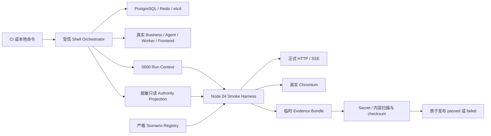

# W2-ADR-009：结构化 Smoke Harness v1

> 决策状态：Draft / awaiting owner approval
>
> 决策编号：`W2-ADR-009`
>
> 治理 Gate：`W2-S0-G0`
>
> 版本：`w2.adr.009.v1`
>
> 更新日期：2026-07-15
>
> 实现状态：`implementation_unlocked=false`
>
> 信任根状态：`candidate_unactivated`
>
> 关联文档：[全功能冒烟工程设计](../testing/full-function-smoke-engineering-design.md)、[Smoke Context 与 Scenario Registry 契约](../testing/w2-smoke-context-registry-contract-v1.md)、[SMK-004A shadow baseline](../testing/approvals/w2-s0-g0/smk-004a-shadow-baseline-v1.json)、[W2-S0-G0 审批清单](../testing/approvals/w2-s0-g0/approval-manifest.json)

## 1. 当前结论

本 ADR 提议把全功能冒烟从持续增长的单体 Shell，逐步迁移到独立的 Node 24 + TypeScript + Playwright Harness。迁移后的职责边界为：

- Shell 只负责编排真实 PostgreSQL、Redis、etcd、真实 Runtime、前端进程、一次性 Secret、现有 Seeder 和有界清理；
- 结构化 Harness 负责严格 Scenario Registry、白名单 typed step、API/UI Driver、断言编排、故障命中确认和脱敏 Evidence；
- 各 Module 继续拥有自己的权威状态与只读 Evidence 投影，Harness 不跨 Module 写库，也不成为第四个生产 Runtime 或 Go Module；
- 首切只做 `SMK-004A` 的 `api`、`ui` 两个 `shadow_parity` profile，固定 26 项 shadow 断言，均为 `contributes_to_status=false`；
- 既有 canonical Evidence 中的另外 8 项断言明确留在 canonical-only 集合，不能被首切 shadow 结果冒充。

以上均是待七方 Owner 审核的候选决定，不是已经批准或已经实现的事实。`W2-S0-G0` 保持 `awaiting_owner_approval` 时，禁止创建 `smoke/**`、`test-adapters/**`、`deploy/local-smoke/**`，也不得把本 ADR 表述为 SMK-P0 已可执行。

当前仓库中的 Go 校验器仅是 `candidate_unactivated` 候选：它可以在本地校验当前 worktree，也可以在显式提供 base/head commit object 时校验 Git tree；但当前没有 Smoke Governance workflow、Ruleset 或 required check。本地测试通过不等于远端门禁生效。

## 2. 背景与问题

当前 W0/W0.5 冒烟已经通过真实 PostgreSQL、Redis、etcd、Business/Agent Runtime 和 Chromium 验证了身份、Project/Session、Workspace Snapshot/SSE、重启恢复、Retention Reset、跨 Owner 隔离和退出撤销。现有权威路径主要集中在：

| 路径 | 当前规模 | 当前职责 |
| --- | ---: | --- |
| `scripts/smoke-w0-transport.sh` | 4457 行 | Runtime 编排、构建、Seed、Secret、SQL 权威断言、API Driver、Evidence、清理 |
| `frontend/e2e/w0-transport.spec.js` | 567 行 | 真实 Chromium、Workspace 恢复、Retention Reset、跨 Owner UI |

两条路径已经提供有效的 W0.5 canonical Evidence，但继续把后续 35 条 canonical Smoke、derived slice、Provider 故障、账务、Worker 和 A2UI 全部堆入同一 Shell，会产生以下风险：

1. Scenario、基础设施生命周期、Secret 和权威查询混在同一文件，变更影响面无法按场景隔离；
2. Shell、Playwright 与 Evidence 各自维护断言集合，容易出现名称、数量和 canonical 状态漂移；
3. 任意脚本、SQL、Header 或模块路径一旦进入场景文件，就会形成生产测试后门或跨 Module 写入通道；
4. 第一次失败、重试、版本摘要和 closure stale 语义难以被严格机器校验；
5. 当前 CI 路径过滤不能天然阻止新增纯 `smoke/**` 文件绕过联合审批。

本 ADR 只处理测试工程边界，不批准任何 Graph Tool、业务 DTO、Migration、计费、Approval、A2UI 或 Worker Job 契约。

## 3. 决策驱动因素

- 保留现有 W0/W0.5 canonical Evidence 的权威性，不以重写测试的方式重写历史结论；
- 让场景 ID、Requirement ID、profile、断言 exact-set、版本摘要和 Evidence 由机器失败关闭；
- 保持三个 Go Module 和三个生产 Runtime 的边界，不创建共享业务真源；
- Harness 默认无跨数据库写权限、无生产域名、无任意脚本执行、无 Secret 落盘；
- API 与 UI profile 共享同一个 Scenario/Assertion Registry，不维护两套业务语义；
- 支持后续 `SMK-001`～`SMK-035`、derived slice、故障注入和 Provider Sandbox 渐进迁移；
- 第一次失败不可被自动重试覆盖，Evidence 可脱敏、可追踪、可保留；
- 未获联合批准前，机器门禁必须阻止实现目录提前出现。

## 4. 候选决策

### 4.1 工程形态

获批后创建独立 `smoke/` Node package，使用 Node 24、TypeScript、Playwright、严格 YAML/JSON Schema、Node 内置 `fetch`、`crypto` 与 `node:test`。它不是生产 Runtime，不加入根 Go Module，也不得被任一生产二进制 import 或启动。

首切允许的第三方依赖仅限：

- YAML 严格解析；
- JSON/YAML Schema 校验；
- TypeScript 与 Node 类型；
- Playwright。

首切不引入动态脚本引擎、任意模块加载、第二套 CLI 框架、ORM、数据库写 Client、通用 Shell 执行器或测试 Header 注入设施。新增依赖必须独立说明安全边界、锁定版本与回滚方式。

目标结构是后续实现形态，不表示当前仓库已创建这些路径：

```text
Dora-Agent/
├── smoke/
│   ├── scenarios/
│   ├── registry/
│   ├── drivers/
│   ├── assertions/
│   ├── evidence/
│   └── package.json
├── test-adapters/
└── deploy/local-smoke/
```

`test-adapters/**` 与 `deploy/local-smoke/**` 不属于 W2-S0 首切实现范围；它们仍受各自后续设计与 Owner 审批约束。

### 4.2 责任分层



| 组件 | 必须负责 | 明确禁止 |
| --- | --- | --- |
| Shell Orchestrator | 真实依赖和 Runtime 生命周期、现有 Seed、一次性 Secret、生成/删除 Context、失败清理 | 继续新增场景业务语义；把 Secret 或完整内容写入 Evidence |
| Smoke Harness | 严格 Registry、白名单 Driver/Assertion、状态等待、Evidence 编排 | 启动生产 Runtime；任意 Shell/SQL/模块执行；跨 Module 写库 |
| UI Driver | 真实 Chromium、真实请求、可见状态、刷新/重连 | 请求拦截伪造业务响应；注入 capability 或 `X-Test-*` Header |
| API Driver | 正式 Business BFF/API/SSE 调用与稳定错误断言 | 调用 Repository、内部调试路由或绕过鉴权 |
| Module Evidence Owner | 提供本 Module 的只读、脱敏、最小权威投影 | 暴露普通业务表写权限；替其他 Module 定义权威事实 |
| Evidence Publisher | checksum、脱敏扫描、第一次失败保留、原子发布 | 用后续重试覆盖第一次失败；发布未扫描原始日志 |

### 4.3 Context 交接

Shell 与 Harness 只通过版本化、权限 `0600` 的 Run Context 交接。Context 只能包含：

- 本次 `smoke_run_id` 与不可复用 `fixture_namespace`；
- loopback endpoint；
- 已公开的 Project/Session/Input 等资源 ID；
- Runtime binary digest、Migration head、source digest 和已批准的 Definition/Graph/Adapter/Freeze version；
- 一次性凭据文件的引用，不包含凭据原文；
- Shell 已完成脱敏的只读 authority projection 引用。

Harness 必须拒绝生产域名、非 loopback endpoint、目录逃逸、符号链接、非 `0600` Context/Secret 文件、未知字段和尾随内容。Context 原文不得进入 Evidence；Harness 和 Shell 退出时都必须尝试删除，删除失败使本次运行失败。

当前 W0 Shell 仍使用 `dora_admin` 完成部分权威查询。在专用只读 Evidence Role 与最小查询面建立前，首切 Harness 只能读取 Shell 生成的脱敏投影，不得获得数据库 DSN，也不得宣称 Shell 已经只剩 Runtime 编排职责。

### 4.4 Scenario Registry

Scenario 由结构化声明和白名单 typed step 组成，不是自由脚本。Registry 必须失败关闭地验证：

- `scenario_kind=canonical|derived_slice`；
- `canonical_smoke_id`、`slice_id`、profile、Requirement ID 与 owner；
- `required_slice_ids` 无环、无重复，derived slice 只能映射一个 canonical；
- `mode`、`contributes_to_status` 与 baseline 一致；
- Driver、Assertion、Collector 和 Deadline Policy 均来自编译期白名单；
- ID、profile 和 assertion exact-set 唯一且稳定排序；
- 未知字段、未知枚举、重复 YAML/JSON Key、尾随值和动态模块路径全部拒绝；
- 场景不得内嵌 SQL、Shell、JavaScript、Secret、任意 Header、生产域名或业务状态转换。

canonical 状态只能由同一次 closure run 或版本摘要完全一致的不可变 Evidence 计算。`missing`、`skipped`、`stale`、Gate reopened 或任一 digest 漂移都不贡献通过。

### 4.5 首切 `SMK-004A`

首切固定使用机器基线 `w2_s0_g0_smk_004a_shadow_baseline.v1`：

| Profile | 模式 | Shadow 断言数 | 状态贡献 | 权威来源 |
| --- | --- | ---: | --- | --- |
| `api` | `shadow_parity` | 14 | `false` | `scripts/smoke-w0-transport.sh` |
| `ui` | `shadow_parity` | 12 | `false` | `frontend/e2e/w0-transport.spec.js` |

另外 8 项断言固定为 `canonical_only_assertion_ids`。它们覆盖并发/幂等、Prompt 清理、Agent 唯一事实、空 Prompt 禁止副作用与退出撤销，首切 Harness 不得通过复制布尔值、读取旧 Evidence 或缩小验证面来宣称已迁移。

首切 profile 通过只证明 Registry、Driver、Assertion 和 Evidence 编排能够与既有路径做 shadow 对照，不替代 `w05.workspace-transport.smoke.evidence.v3` 的 34 项 canonical 闭集，不改变 `SMK-004` 或 SMK-P0 状态。

W2-S0 退出前，测试 Owner 还必须在后续审批中二选一冻结：

1. 完整迁移既有 W0.5 34 项 canonical 门禁；或
2. 建立新的完整 parity exact-set，并明确旧门禁的兼容和退役证据。

本 ADR 不预先替 Owner 做出该选择。

### 4.6 Evidence 与重试

Evidence 状态机固定为：

```text
pending -> passed
pending -> failed
```

- `passed` 和 `failed` 都必须经过逐文件 checksum、Secret/内容扫描和同文件系统原子 rename；
- 第一次失败先形成不可变 Attempt，再允许使用新 fixture namespace 重试；后续通过不能覆盖第一次失败；
- 未完成脱敏闭环的 Cookie、密码、Context、完整 Prompt/Message 和原始日志必须删除，不得作为 Artifact 上传；
- 已完成脱敏闭环的失败包可以保留，但保留期限、访问权限和删除责任仍待安全/运维 Owner 批准；
- Evidence 必须绑定 source、Runtime binary、Migration、Definition/Graph/Adapter/Freeze 与 assertion exact-set；任一漂移使 closure `stale`；
- 故障场景必须保存“故障已命中”的脱敏回执；未命中时即使表面结果正确也判为失败。

### 4.7 CI 与治理

`W2-S0-G0` 是创建 Harness 之前的独立治理 Gate，不依赖 W2-R00～R08、领域 IDL 或 Graph Tool 设计。当前候选规则为：

- PR：只在批准后运行 Registry/Schema/单元测试与 API parity；
- nightly：只在批准后运行 Chromium parity；
- Provider Sandbox：独立受保护手动作业，Secret 由运维管理，不进入普通 PR；
- 未批准：任何新增 `smoke/**`、`test-adapters/**`、`deploy/local-smoke/**` 的 Git 变更都失败关闭。

上述三个目录是当前候选校验器锁定的 canonical roots，不是对仓库内任意路径的语义分类器。把 Harness 放到其他路径的规避风险，必须在激活前通过 CODEOWNERS/语义路径策略和受信审核补齐。

当前批次不创建或激活 Smoke Governance workflow，也不创建 `.github/smoke-governance/**` release/pointer/handoff。候选校验器会拒绝这些 trust-root 路径和 `w2-smoke-governance*.yml|yaml` 提前出现。正式启用必须拆成独立阶段：

1. **Candidate**：只合并 ADR、契约、baseline、`candidate_unactivated` manifest 和候选校验器；
2. **Bootstrap**：由现有外部治理合并版本化 release、base-owned workflow、CODEOWNERS 与 active pointer，固定 workflow 原始摘要、Action 40 位 commit SHA、Validator 源码和构建输入 exact-set；随后配置 source-locked/no-bypass Ruleset，并完成同仓和 fork canary；
3. **Unlock**：单独治理 PR 只做 `awaiting/locked -> approved/unlocked` 与 authority request 迁移，不携带 Harness 实现；七方不同受信 actor 对最终 head 审核，Owner Authority App 把结果写入当前 merge SHA。

任一候选校验器升级必须使用 `stage -> cutover -> retire` 的 generation/handoff，先由旧信任根绑定新 release 摘要，再双 required check 切换，最后退役旧版；不得用“激活后永久禁止修改 checker”制造无法修补的死锁。

PR/nightly 频率、Node/Playwright 锁定方式、Artifact 权限以及“失败 30 天、通过摘要 14 天”的候选期限，都必须由安全和运维 Owner 明确批准后才能成为正式配置。

## 5. 不在本 ADR 范围内

- 不批准或实现 `plan_creation_spec` 及其他 Graph Tool；
- 不新增 Business、Agent、Worker 的生产 DTO、RPC、Event、Job 或 Migration；
- 不新增对象存储、Model、Media、Payment Adapter；
- 不改变 W0/W0.5 当前 canonical Evidence 或 Smoke 状态；
- 不建立跨数据库事务、跨 Module Repository 或共享业务表；
- 不把 Fixture、Clock、ID Generator 或故障控制面编译进生产配置；
- 不决定 Provider Sandbox 凭据、生产保留策略或发布可用性。

## 6. 备选方案与取舍

### 6.1 继续扩展单体 Shell

优点是短期改动少，已有运行链路成熟。缺点是场景、Secret、SQL、生命周期和 Evidence 继续耦合，无法可靠建立 Registry exact-set 和逐场景 Owner 边界，因此不作为推荐目标。

### 6.2 新建第四个 Go Module

Go 对后端测试基础设施友好，但会让 Smoke 工程更容易与三个生产 Module 建立不当内部依赖，也不能自然复用 Playwright。项目根已明确只协调三个生产 Go Module，因此不采用。

### 6.3 直接使用 Playwright Test 承担全部 API/权威断言

统一测试运行器看似简单，但会把数据库权威断言、故障编排和 UI 重试语义混入浏览器层。API 与 UI 应共享 Registry，而不是让 UI Runner 成为所有业务真源，因此不采用。

### 6.4 一次性重写全部 W0/W1 Smoke

一次迁移会丢失与现有 canonical Evidence 的可比性，并扩大失败定位面。推荐先 shadow parity，再由 Owner 决定完整迁移或兼容退役。

## 7. 分阶段落地候选

| 阶段 | 允许动作 | 退出证据 |
| --- | --- | --- |
| G0 当前阶段 | 只创建/评审 ADR、契约、shadow baseline、审批清单和未激活候选校验器 | 状态保持 `awaiting_owner_approval / candidate_unactivated`；无 workflow/Ruleset；实现目录不存在 |
| G1 联合批准 | 七方 Owner 通过受信身份对绑定摘要产物给出不可变审批 | 新的版本化审批迁移显式解锁，不由当前清单自报 Approved |
| S0-1 Harness Kernel | 创建 Node 24 package、严格 Registry/Context/Evidence Kernel | Schema、路径、安全、stale、第一次失败测试通过 |
| S0-2 API Shadow | 迁移 14 项 API shadow assertion | 与同一 source/runtime/migration 版本下旧路径一致 |
| S0-3 UI Shadow | 迁移 12 项 UI shadow assertion | 真实 Chromium，无请求拦截/Header 注入，结果一致 |
| S0-4 Owner 决议 | 冻结完整迁移或新 parity exact-set | 不再依赖未决口径提升 canonical 状态 |

## 8. Owner 联合审批项

正式批准必须覆盖以下排序后的七方 exact-set，且每个 role 由受信仓库身份独立签署：

| Owner role | 必须明确批准的边界 |
| --- | --- |
| `agent_owner` | Agent Context、Session/Event 权威投影和 BFF 访问不被 Harness 越权 |
| `business_owner` | Business Auth/Project、Seed、BFF 与只读 Evidence 投影边界 |
| `frontend_owner` | Playwright 复用、真实请求、刷新/重连和无请求拦截 |
| `operations_owner` | Node/Playwright 版本、CI 频率、Artifact 权限/期限、Sandbox 环境 |
| `security_owner` | Secret 生命周期、loopback/生产失败关闭、路径防逃逸、脱敏扫描 |
| `test_owner` | 26/8 exact-set、canonical closure、第一次失败保留和后续迁移选项 |
| `worker_owner` | Worker 未参与首切时的明确非范围，以及后续 Evidence/Adapter 不越权 |

当前 v1 manifest 刻意不提供 `owner_approval_refs` 或任何可自报的批准字段。文档作者、实现者、自报 role、普通 URL 或本地测试通过都不能替代正式 Owner authority；后续解锁必须使用新的版本化 manifest 和外部 App 绑定的 authority request。

## 9. 审核前检查清单

- [ ] 七方 Owner 已核对本 ADR 与绑定摘要；
- [ ] `SMK-004A` 26 项 shadow 与 8 项 canonical-only exact-set 无遗漏或重复；
- [ ] Context 不含原始 Secret、生产 endpoint 或数据库写权限；
- [ ] Scenario Registry 禁止任意脚本、SQL、Header 与动态模块路径；
- [ ] API/UI Driver 都使用正式接口或真实 Chromium；
- [ ] Evidence 第一次失败、脱敏、checksum、原子发布和 stale 语义明确；
- [ ] W0 当前 `dora_admin` 查询的临时边界被准确描述，未伪装成只读 Role 已实现；
- [ ] CI 频率、依赖锁定、Artifact 权限与保留期限已由安全/运维确认；
- [ ] manifest 中的十项 activation blockers 已由可验证证据逐项关闭；
- [ ] workflow 激活是不携带 checker/manifest/Harness 修改的独立 Bootstrap PR；
- [ ] 同仓与 fork canary 均证明 base-owned checker 不 checkout 或执行 PR head 代码；
- [ ] 批准与解锁通过后续受信版本化迁移完成，而不是修改当前待审事实。

## 10. 当前状态

本 ADR 保持 **Draft / awaiting owner approval / candidate_unactivated**。它只建立可评审的结构化 Harness 候选与未激活校验边界；当前无 Smoke Governance workflow、Ruleset 或 required check，未创建 Harness、未运行 shadow parity、未产生新 Evidence、未获得任何 Owner 批准，也未改变任何 canonical Smoke 状态。
