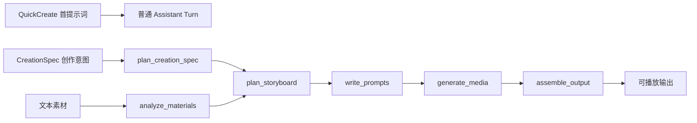
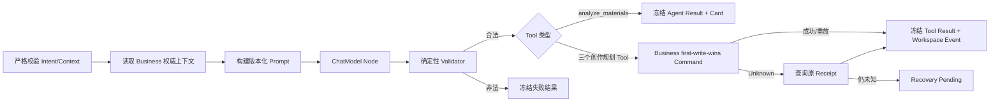

# 创作工作流设计

> 状态：Current Implementation / local Development Preview 范围
>
> 当前验收结论只见[交付阶段与当前状态](../../requirements/delivery-status.md)。

## 1. 功能目标

创作工作流把一个 Project 的 QuickCreate 首提示词、文本素材和六个高层 Graph Tool 串成同一条持久化 Session 主链。当前没有向既有 Session 继续发送普通消息的公开 POST；生产模型、正式审批、计费和通用 Catalog 尚未开放。

## 2. 用户流程

前端允许用户按需调用 Tool，但服务端不会根据页面顺序放松源对象、版本和摘要校验。例如 `write_prompts` 必须绑定已保存的 Storyboard Preview，`generate_media` 必须绑定 Prompt Preview 的精确目标，`assemble_output` 必须绑定已完成的图片 Asset。

## 3. 唯一主 Agent

`agent/internal/chatmodelagent.NewMVPAllTools` 创建唯一主 `ChatModelAgent`：

- 基础 Profile 的 Registry 精确包含四个同步 Tool；启用媒体扩展后精确包含六个高层 Tool。
- QuickCreate 首提示词形成的 `user_message` 走无 Tool Assistant 分支；它不是既有 Session 的通用聊天入口。
- Tool 串行执行，避免同一 Turn 内副作用次序漂移。
- 模型只能产生 Tool Intent；可信 User/Project/Session/Input/Fence 由 Runtime 注入。
- 本地 Dispatcher 和领域模型均为确定性 Fake，实现用于验证路由、Receipt 和恢复。
- Skill 不能动态新增 Tool、提高预算或绕过服务端校验。

生产环境目前不注册 Preview Tool，不能把本地主 Agent 视为生产 Catalog。

## 4. Session Lane 与 Coordinator

基础 Profile 只有一个 `mvpruntime.Coordinator`，按以下顺序注册五个 source-specific Processor；媒体扩展再追加后三个：

1. QuickCreate 首提示词 `user_message`；
2. Creation Spec Preview；
3. Analyze Materials Preview；
4. Plan Storyboard Preview；
5. Write Prompts Preview；
6. Generate Media Preview；
7. Assemble Output Preview；
8. Media Job Terminal。

每个 Handler 调用 `ProcessNext` 时都遵循全来源 Head-of-Line：同一 Session 只能推进最早可执行输入。Coordinator 的 Wake 可合并或丢失，周期性 PostgreSQL 扫描负责恢复；停止时先关闭 Intake，再在 Deadline 内 Drain 当前处理。

## 5. 同步创作链

四个同步 Tool 都严格读取 Business 权威上下文、执行模型并校验候选。校验通过后，`analyze_materials` 只冻结 Agent Result/Card；另外三个创作规划 Tool 才执行 Business first-write-wins 草稿命令：

各 Tool 的 Node、Branch、State 和状态机以[六 Tool 设计索引](../agent/graphtool/README.md)为准。

## 6. 异步媒体链

`generate_media` 与 `assemble_output` 不调用 ChatModel，也不在 Graph 中等待文件生成。它们冻结源引用后执行 Business Prepare，创建一组 Operation/Batch/Job 并返回 `accepted`。Worker 完成后由 Media Terminal Processor 写入新的 Session 终态事件。

媒体细节见[媒体与资产设计](media-and-assets.md)。

## 7. 权威状态与回执

| 状态 | Owner | 说明 |
| --- | --- | --- |
| Session/Input/HOL | Agent PostgreSQL | 决定同一 Session 的执行顺序 |
| Model/Tool/Command Receipt | Agent PostgreSQL | 防止恢复时重复模型或 Tool 副作用 |
| CreationSpec/Storyboard/Prompt 草稿 | Business PostgreSQL | 用户可见业务草稿真源 |
| Material/Evidence | Business PostgreSQL | 素材所有权和分析输入真源 |
| Operation/Batch/Job | Agent PostgreSQL | 异步媒体执行真源 |
| Asset/Finalize Receipt | Business PostgreSQL | 文件元数据、Owner 和发布状态真源 |
| Workspace Event | Agent PostgreSQL | 浏览器增量投影真源 |

模型输出、Graph Local State 和前端 Card 都不是业务真源。

## 8. 状态规则

- Input 从待处理进入 running，最终进入 resolved 或 dead；状态更新必须匹配 Lease/Fence。
- 同一命令相同 digest 可重放；不同 digest 冲突，不允许换键覆盖。
- 模型候选校验失败不会冻结成功结果或执行 Business 写命令，只冻结失败结果。
- 三个创作规划 Tool 的 Business 写命令响应丢失时只查询原 Command，不做盲重试；素材分析没有该写命令。
- 媒体 Tool 的 `accepted` 是异步受理，不是 Asset 已完成。
- Worker terminal 是新的持久化输入，不是旧 Graph 的函数返回。

## 9. 当前边界

现有实现包括：QuickCreate 首提示词 `user_message`、项目内六 Tool、三类 Business 同步草稿、只读素材分析 Result/Card、媒体异步受理、Terminal Event 和 Workspace V5 恢复。

尚未实现或未获生产批准：

- 真实 DeepSeek 质量门禁和模型 Failover；
- 正式 Approval、费用冻结、扣费和发布者收益；
- 通用生产 Tool Catalog、动态 Skill 场景评测；
- 完整 Checkpoint/Interrupt/Resume 与进程重启矩阵；
- 生产 Provider、TOS、内容审核和跨区域容灾。

## 10. 验收

- Graph 在启动时 Compile，Node/Branch exact-set 与独立设计一致。
- Validator、幂等冲突、Unknown Outcome 和恢复路径有单元/集成测试。
- `make test-smoke-contracts` 验证五条 standalone Profile 的静态契约。
- `make trial-basic` 验证同一 Session 的完整本地主链。
- `make test`、`make vet build` 和前端全量测试/构建是独立质量门禁。
