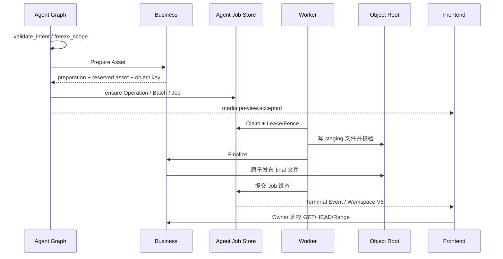

# 媒体生成与资产设计

> 状态：Current Implementation / local Development Preview 范围
>
> 当前验收结论只见[交付阶段与当前状态](../../requirements/delivery-status.md)。

## 1. 功能范围

当前媒体链支持两个 Agent-facing Graph Tool：

- `generate_media`：从 Prompt Preview 的精确目标生成 640×360 PNG。
- `assemble_output`：从已完成的图片 Asset 生成固定参数 MP4。

这条链用于验证 Job、Worker、Finalize、受保护内容和浏览器播放。它不包含真实图片/视频 Provider、跨主机对象存储、计费或正式 Approval。

## 2. 端到端流程

## 3. Graph 设计

两个 Graph 共享同一 11 Node、5 Branch 的确定性 DAG，只替换 Intent 和 source pin：

`validate_intent → freeze_scope → ensure_operation → prepare_asset/query_preparation → build_job → dispatch_job/query_dispatch → emit_accepted|emit_failed|defer_recovery`

- `generate_media` 的 source 是 Prompt Preview、版本、内容摘要和 `target_local_key`。
- `assemble_output` 的 source 是 ready 图片 Asset、版本和内容摘要。
- Prepare 或 Dispatch 出现 Unknown Outcome 时查询原 Command；结果仍未知则进入 recovery pending。
- Graph 只创建任务并返回 `accepted`，不等待 Worker。

详细 Node/State 分别见 [`generate_media`](../agent/graphtool/generate_media-design.md) 和 [`assemble_output`](../agent/graphtool/assemble_output-design.md)。

## 4. 数据所有权

| 数据 | Owner | 约束 |
| --- | --- | --- |
| Operation/Batch/Job/Dispatch Receipt | Agent | Agent Migration；Worker 只用版本化 View/Function |
| Asset/Preparation/Finalization Receipt | Business | first-write-wins，绑定 Owner/Project/Command digest |
| Worker 技术执行回执 | Worker | Worker Migration，不复制 Agent/Business 表 |
| 文件 | Business 元数据 Owner | Preview 中 Business 与 Worker 共享一个安全本地对象根 |

Worker 不 import Agent/Business `internal` 包，不修改 Storyboard、Prompt、积分或业务 Asset 表。

## 5. Job、Lease 与恢复

- Claim 使用 PostgreSQL 短事务和已过期 Lease 接管。
- 每次 Claim 递增 Fence/Lease Version；Heartbeat、Finalize 和终态提交都必须匹配当前租约。
- Redis 不承载 Job 真值；轮询能够在 Wake 丢失时恢复。
- 错误分为 retryable、permanent、unknown outcome 和 lease lost。
- Retry 有次数和退避上限；Lease Lost 后不得继续提交结果。
- Finalize Unknown Outcome 查询原 Finalization Receipt，不能重复发布另一个 Asset。

当前 happy path 和部分回执恢复已有测试；完整进程崩溃、Fence takeover、故障注入和压力矩阵仍是 P1。

## 6. 产物规则

### 6.1 PNG

- 尺寸固定为 640×360。
- 使用纯 Go 确定性生成，输出可被标准解码器读取。
- Worker 校验 MIME、尺寸、大小上限和 SHA-256 后才能 Finalize。

### 6.2 MP4

- 输入必须是当前 Project 下已完成的图片 Asset。
- ffmpeg 使用固定 argv 生成约 2 秒 H.264、`yuv420p`、faststart MP4。
- ffprobe 校验容器、Codec、像素格式、尺寸和时长。
- 禁止把用户文本拼接进 Shell；可执行路径和资源上限来自启动配置。

## 7. 对象与内容读取

- Preview 对象根必须是已存在的绝对目录、权限 0700、非符号链接。
- Object Key 由服务端生成，禁止用户提供路径。
- Staging 到 Final 使用同一根目录内原子发布。
- 内容端点为 `GET/HEAD /api/v1/projects/:project_id/media-preview-assets/:asset_id/content`。
- 读取前校验登录用户、Project Owner、Asset 状态和真实文件元数据。
- 无 Range 返回 `200`；合法单 Range 返回 `206`；非法、越界、suffix 或多 Range 返回 `416`。
- 响应设置安全 MIME、长度、`Accept-Ranges` 和 `Cache-Control: no-store`。

## 8. Business 内部端点

local-only Profile 冻结五个回环端点：

- `POST /internal/v1/media-preview-assets/prepare`
- `POST /internal/v1/media-preview-assets/query-preparation`
- `POST /internal/v1/media-preview-assets/finalize`
- `POST /internal/v1/media-preview-assets/query-finalization`
- `GET /internal/v1/media-preview-assets/readiness`

它们不是生产公网 API。共享或生产环境必须改为经过正式服务身份、TLS、审计和最小权限的内部契约。

## 9. 前端投影

Workspace V5 使用高层 Card 展示 `accepted/completed/failed`，不展开底层 Attempt，也不投影独立 `running` Card。图片使用同源受保护 URL；视频控件支持浏览器 Range 请求。刷新后 Snapshot 能恢复 Asset ID、MIME、状态和终态，不依赖内存 URL。

## 10. 生产差距

- 真实 Provider 与费用/配额控制；
- 正式对象存储、上传校验、签名 URL/CDN；
- Approval、计费、取消和人工重放；
- 内容安全、版权和病毒扫描；
- 多 Worker 压力、跨机 Lease、崩溃恢复和孤儿对象清理；
- 音频、多段剪辑、真实转场和编码 Profile Catalog。
