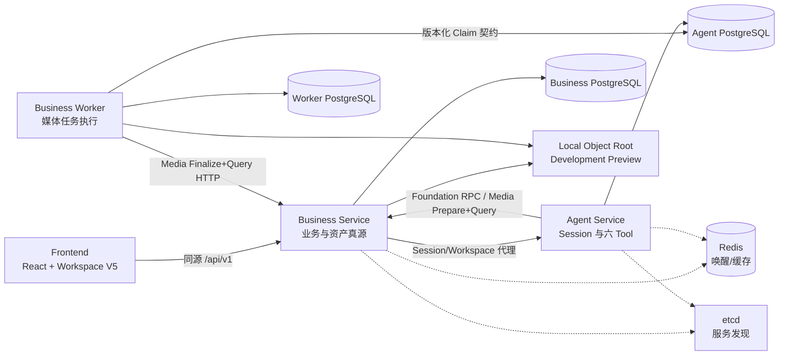
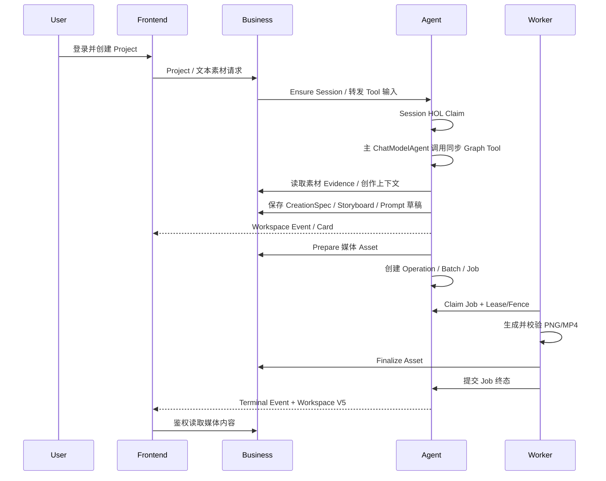

# Dora 系统架构设计

> 状态：Current / 当前实现真源
>
> 更新时间：2026-07-17

## 1. 设计目标

Dora 当前是一套面向桌面 Web 的本地 Development Preview。系统用一条可重复主链完成登录、项目、文本素材、六个创作 Graph Tool、媒体 Worker、资产读取和工作台恢复。本设计只描述当前代码已经存在的边界；生产 Provider、计费、正式 Approval、完整 A2UI 和容灾能力列为后续工作，不作为已实现能力。

## 2. 系统组成

仓库根目录只负责多 Module 协作，生产 Runtime 分别是：

- `business/cmd/business-service`：用户、鉴权、项目、Skill、创作草稿和资产。
- `agent/cmd/agent-service`：Session、输入、工作台投影、主 Agent 和六个 Graph Tool。
- `worker/cmd/business-worker`：领取已持久化媒体 Job，生成文件并请求 Business Finalize。
- `frontend/`：通过 Business BFF 访问服务，不在浏览器中持有内部服务凭据。

三个 Go Module 必须能够在 `GOWORK=off` 下独立构建。根 `go.work` 只用于本地联调。

## 3. 功能与 Owner

| 功能 | 权威 Owner | 当前实现 |
| --- | --- | --- |
| 用户、登录会话、Owner 权限 | Business | 本地账号登录、Session Cookie、受保护 API |
| Project、QuickCreate | Business | 创建、列表、Owner-only 访问、Session 初始化 |
| Skill 草稿、发布、市场和项目绑定 | Business | W1 基础链路；Session 创建时冻结已发布快照 |
| 文本素材、分析 Evidence | Business | 文本素材创建/选择，Preview Evidence 查询 |
| CreationSpec、Storyboard、Prompt 草稿 | Business | first-write-wins Preview 草稿和查询回执 |
| Session、Input、HOL、Tool/Model Receipt | Agent | PostgreSQL 权威状态；Redis 只唤醒 |
| 六个 Graph Tool | Agent | 基础 Profile 叠加媒体扩展后可执行；生产 Catalog 仍关闭 |
| Operation、Batch、Job | Agent | 媒体 Preview 创建与状态推进 |
| Job 执行、Attempt 技术回执 | Worker | Lease/Fence、确定性 PNG/MP4、有限重试 |
| Asset 元数据与内容授权 | Business | Prepare/Finalize、Owner-only GET/HEAD/Range |
| Workspace Snapshot/Event | Agent | `session.workspace.v5`、SSE、Reset 后回源 |

任何 Module 都不得引用另一个 Module 的 `internal` 包。跨 Module 交互只能使用 Thrift、HTTP、Event DTO 或明确版本化的持久化消费契约。

## 4. 当前主链

三个创作规划 Tool 在一次 Agent 处理内冻结输出并写入 Business 草稿；`analyze_materials` 只读 Business Evidence，在 Agent 冻结分析 Result/Card，不创建 Business 草稿。媒体 Tool 只返回 `accepted`，不等待 Worker。Worker 终态作为新的持久化输入进入 Session Lane，不恢复已经结束的 Graph 调用栈。

## 5. 数据与一致性

- PostgreSQL 是业务、Session、Job、Receipt 和 Event 的权威来源。
- Redis 只负责低延迟唤醒或缓存；通知丢失后必须通过 PostgreSQL 轮询恢复。
- etcd 只负责服务注册发现。
- Runtime 禁止 `AutoMigrate`；Schema 仅由各 Owner Module 的版本化 SQL Migration 管理。
- 数据库不创建物理外键或级联；逻辑关联 ID、唯一约束、状态检查、版本和索引仍必须保留。
- 写命令使用稳定 Command ID 和 canonical digest。相同 ID/相同摘要返回既有结果；相同 ID/不同摘要失败关闭。
- RPC/HTTP Unknown Outcome 必须查询原命令回执，不能换键重发。
- Agent 与 Worker 的 Claim、Heartbeat 和终态更新必须校验旧状态、Lease Owner 与 Fence/Version。

## 6. Agent 与 Eino 约束

- 项目只有一个主 `ChatModelAgent`，不使用子 Agent、DeepAgent 或 AgentAsTool。
- Eino 固定为 v0.9.10，使用经典 `*schema.Message`。
- Graph 在启动期 Compile；当前六个 Graph 都是 `AllPredecessor` 无环 DAG。
- ChatModel 输出必须经过独立确定性 Validator，不能直接进入持久化或外部副作用。
- Tool Intent 与可信 Turn Context 分离；UserID、ProjectID、Fence、预算和幂等基键不允许由模型填写。
- 本地 Profile 使用确定性 Fake Model 和确定性媒体引擎；它验证编排，不等于真实模型/Provider 质量。

## 7. 安全边界

- Browser 只访问 Business 同源接口；Business 到 Agent 使用受信内部身份。
- 媒体内部 Prepare/Finalize 端点只允许 local loopback Profile。
- Asset 内容按登录用户、Project 和 Asset 三者绑定鉴权。
- 日志、Event、Evidence 和普通 Trace 不保存 Cookie、Token、Secret、完整 Prompt、完整 Tool Payload 或模型 Reasoning。
- 通用 HTTP Tool、宿主文件 Tool、Shell、任意 SQL、动态 Tool Search 和未审核 MCP 默认禁用。
- 当前媒体链没有生产计费和正式 Approval，因此仅允许显式 local Development Preview。

## 8. 运行 Profile

| Profile | 用途 | 边界 |
| --- | --- | --- |
| `mvp_all_tools.runtime.v1preview1` | QuickCreate 首提示词 `user_message`、四个同步 Tool、五个 Processor | local-only、全 loopback、确定性模型 |
| `media.runtime.v3preview1` | 增加 Generate/Assemble、Media Terminal、Worker 和 Asset，合计六 Tool/八 Processor | 必须依附基础 Profile、共享安全对象根 |
| 五个 standalone Preview | 单能力回归和恢复契约 | 互斥启动，不由 `trial-basic` 串行执行 |

生产静态 Catalog 仍保持不可用。Preview 开关不得成为绕过生产审批、预算、计费和 Provider 配置的后门。

## 9. 设计入口

- 当前产品范围：[产品范围](../requirements/product-scope.md)
- 当前阶段：[交付状态](../requirements/delivery-status.md)
- 功能设计：[文档索引](../README.md)
- 六 Tool 详细设计：[Graph Tool 索引](agent/graphtool/README.md)
- 开发约束：仓库根 `AGENTS.md` 与 `.agents/skills/dora-server-development/`

冻结 Approval Manifest 及其引用文档是历史决策证据，不是当前架构入口；不得为了整理目录而修改其内容摘要。
