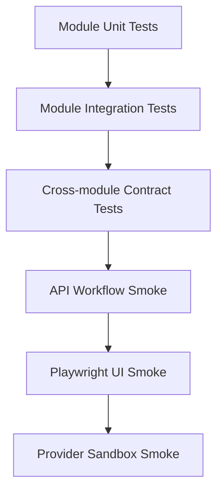

# 全功能冒烟工程设计

> 状态：Draft / 待 Business、Agent、Worker、前端、测试、运维与安全评审
>
> 版本：`smoke.engineering.v1alpha1`
>
> 更新日期：2026-07-14
>
> 适用范围：`SMK-001`～`SMK-035`
>
> 实现门禁：本文评审通过前可以继续细化场景，不创建会被误认为生产 Runtime 的测试服务或不受控测试后门。

## 1. 目标与通过定义

本文把[全功能冒烟开发推进计划](../../requirements/full-function-smoke-development-plan.md)中的 35 条 SMK-P0 场景落成可实施的测试工程、Fixture、确定性 Adapter、故障注入和 Evidence 规范。

目标：

- 在干净环境中启动真实 `business-service`、`agent-service`、`business-worker` 和真实前端；
- 使用真实 PostgreSQL、Redis、etcd 和三个 Module 的真实 Migration/Repository/Outbox/Inbox；
- 对模型、媒体、对象存储和支付使用协议等价、可控制、可审计的本地 Adapter；
- 每条 Smoke 同时验证用户结果、API/RPC、数据库权威状态、Event/Receipt、费用和禁止副作用；
- 失败时产出可定位到 Smoke ID、Requirement ID、Trace、Run/Operation/Job 和账本的最小证据包；
- 同一环境和固定 Seed 可重复运行，不依赖人工点击、外部账号或不稳定网络。

Local Deterministic Smoke 全绿的含义：35 条场景在一次干净环境运行中全部通过，重复运行不产生跨 Run 污染，失败重跑不会掩盖第一次失败证据。它不替代 Provider Sandbox、压力、灾备和上线安全门禁。

## 2. 测试层级和责任



| 层级 | 运行对象 | 主要断言 | 合并要求 |
|---|---|---|---|
| Module Unit | 单包、Fake Clock/ID/Client | 状态转换、Validator、幂等键、错误映射 | 每个 Module PR 必跑 |
| Module Integration | 单 Module + 自有 PostgreSQL/Redis | Migration、Repository、事务、Outbox/Inbox | 每个 Module PR 必跑；`GOWORK=off` |
| Contract | Producer/Consumer Schema + Adapter | HTTP/Thrift/Event/Job/支付签名兼容 | 契约变更必跑 |
| API Workflow Smoke | 三 Runtime + 基础设施 + Adapter | 权威状态、副作用次数、费用、恢复 | 合并主干必跑的 SMK-P0 核心集合，最终扩为 35 条 |
| UI Smoke | 真实前端 + 三 Runtime | 菜单、表单、状态、SSE、可访问性、错误恢复 | SMK-P0 全量 |
| Provider Sandbox | 真实外部测试账号 | 协议、签名、限流、真实媒体可用性 | 凭据具备时；对应能力上线前必跑 |

UI Smoke 不重复实现所有数据库规则；它调用共享 Scenario Driver，并在 UI 断言后读取同一 Evidence Collector 的权威快照。API Smoke 与 UI Smoke 共享 Smoke ID、Fixture 和期望，不维护两套相互漂移的业务场景。

## 3. 目标目录布局

以下是 M1/M2 应创建的目标布局，不表示当前仓库已经实现：

```text
Dora-Agent/
├── business/
│   ├── internal/testkit/
│   └── testdata/fixtures/
├── agent/
│   ├── internal/testkit/
│   └── testdata/fixtures/
├── worker/
│   ├── internal/testkit/
│   └── testdata/fixtures/
├── frontend/
│   └── e2e/
├── smoke/                         # 独立 Node/Playwright 测试工程，不是生产 Go Module
│   ├── scenarios/
│   ├── fixtures/
│   ├── drivers/
│   ├── evidence/
│   └── package.json
├── test-adapters/                 # 仅 local-smoke profile 构建/启动
│   ├── model-openai-compatible/
│   ├── media-provider/
│   ├── object-storage/
│   └── payment-gateway/
├── deploy/local-smoke/
│   ├── compose.yaml
│   ├── env.example
│   └── healthcheck/
└── artifacts/smoke/               # 运行产物，默认 gitignore
```

根目录继续不作为生产 Go Module。`smoke/` 使用独立 Node package；各 Go Module 测试帮助代码只能位于本 Module 的 `internal/testkit`，不得跨 Module import `internal`。

## 4. Local Deterministic 环境

### 4.1 必须启动的真实组件

| 组件 | 实例 | 权威数据/用途 |
|---|---|---|
| PostgreSQL | 一个本地集群、独立 `business_db/agent_db/worker_db` 和角色 | 所有领域、执行、Receipt、Outbox/Inbox、账本权威 |
| Redis | 独立测试实例/DB 前缀 | Cache、Stream/List 唤醒和短期协调；可故障关闭 |
| etcd | 单节点测试集群 | 三 Runtime 注册发现；可验证 Lease/摘除 |
| Business Service | `business/cmd/business-service` | 真实 HTTP/Thrift、Migration、Repository |
| Agent Service | `agent/cmd/agent-service` | 真实 Session/Graph/Approval/Operation/A2UI |
| Business Worker | `worker/cmd/business-worker` | 真实 Claim/Lease/Fence/Provider/Finalize |
| Frontend | Vite build 后的静态服务或真实 dev server | 真实 API/SSE Client 和用户交互 |

每个数据库使用不同应用角色。Worker 对 `agent_db` 只有 `AGT-JOB-V1` 所需视图 SELECT/函数 EXECUTE 权限；Evidence Collector 使用只读审计角色，不拥有写权限。

### 4.2 可控 Adapter

| Adapter | 协议面 | 必备确定性行为 | 必备故障注入 |
|---|---|---|---|
| Model | OpenAI-compatible Chat Completions/Stream | 按 Request Digest 返回固定结构化候选、usage 和 provider request ID | 超时、429、5xx、断流、无效 Schema、响应提交后断连 |
| Media Provider | Dora Worker Provider Adapter 的真实 HTTP 协议 | 固定图片/音频/视频 Fixture，稳定 checksum、状态查询和 Idempotency Key | accepted 后超时、重复回调、乱序、失败、限流、迟到成功 |
| Object Storage | S3/TOS 等价最小协议 | multipart/upload/head/download、checksum、短期签名、对象隔离 | 上传成功响应丢失、校验失败、临时 5xx、权限拒绝 |
| Payment Gateway | 微信/支付宝 Adapter 抽象 | 下单、二维码/收银台、验签通知、主动查单、渠道交易号 | 创建响应未知、重复/乱序通知、伪造签名、错金额、迟到支付 |

Adapter 控制面只监听 local-smoke 内网，使用一次性 Test Run Token。生产配置不编译/注册控制路由，生产 Runtime 也不得接受 `X-Test-*` Header 改变行为。

测试先通过控制面为稳定业务键登记 Scenario，再让生产 Client 走正常协议面。例如 Model Adapter 以 `provider_idempotency_key/request_digest` 取已登记响应，而不是让 Prompt 出现测试指令。

### 4.3 Clock、ID 与随机性

- 生产代码依赖注入 `Clock`、UUIDv7 Generator 和 Random Source；测试实现只在 local-smoke profile 装配。
- 跨服务时间默认使用真实单调时钟；需要过期、迟到、租约或支付关闭时，通过测试控制面推进策略 Clock，不修改系统时钟。
- Fixture 主键使用预生成的合法 UUIDv7；运行期 ID 由 `run_seed + namespace + sequence` 的测试 Generator 稳定生成。
- 不允许在测试中依赖“等待足够久”；所有异步等待都轮询权威状态并有场景级 Deadline。

## 5. Fixture 设计

### 5.1 命名与隔离

每次执行分配 `smoke_run_id` 和不可复用的 `fixture_namespace`。所有用户邮箱、Provider Key、支付订单号、Project 名称和幂等键包含该 namespace；数据库查询必须同时按已知 ID 或 namespace 限定。

Fixture 分三类：

- `baseline`：只读平台配置、Tool Definition、模型/媒体/支付配置版本；
- `scenario`：某个 SMK 的 Given 数据，由各 Module 自有 Seeder/API 创建；
- `ephemeral`：When 期间产生的 Run、Order、Job、Asset 和 Event，测试结束后保留到 Evidence 完成。

禁止一个 Module 的 Seeder 直接写另一个 Module 的数据库。跨 Module 初始事实通过公开契约创建，或分别装载能由契约测试证明一致的只读 Fixture。

### 5.2 标准账号

| Fixture Key | 角色 | 用途 |
|---|---|---|
| `user.basic` | 普通用户 | Project、Graph Tool、资产、钱包、工单 |
| `user.publisher` | Skill 发布者 | Skill 发布、Invocation 收益、回收 |
| `user.other` | 其他普通用户 | 越权资产/Project/作品验证 |
| `admin.reviewer` | 内容/Skill 审核 | 审核与最小 RBAC |
| `admin.finance` | 财务运营 | 支付、账本、收益、冲正、对账 |
| `admin.ops` | 平台运维 | Tool 版本、任务、公告治理 |

账号密码、支付签名私钥和 Provider 密钥只存在于 local-smoke Secret；Evidence 中只保存脱敏账号 Key 和用户 ID。

### 5.3 标准领域 Fixture

| Fixture Key | 初始状态 | 覆盖范围 |
|---|---|---|
| `project.empty` | 空 Project/Session | `SMK-002/003` |
| `project.creation_ready` | Published Skill Snapshot、余额充足 | `SMK-006/009` |
| `assets.mixed_ready` | 文本、图片、PDF、音频、视频及 Evidence refs | `SMK-010/034` |
| `assets.mixed_partial` | 部分 OCR/ASR/抽帧缺失 | `SMK-010` partial |
| `storyboard.active_with_slots` | Active Spec/Storyboard、缺失 Prompt、部分锁定 | `SMK-011/012/013` |
| `prompts.ready` | ready PromptRevision/Artifact | `SMK-013/014` |
| `assembly.ready` | ready Assets、Active AssemblyPlan | `SMK-015/016` |
| `wallet.sufficient/insufficient` | 冻结价格版本和明确余额 | `SMK-021/022` |
| `payment.products` | 已发布充值商品与测试商户配置 | `SMK-024`～`SMK-028` |
| `public.pending/approved` | 待审/公开作品与点赞计数 | `SMK-029` |
| `announcement.active` | 版本、频率、撤回策略 | `SMK-030` |

Fixture 必须声明所属 Module、创建方式、稳定 IDs、初始版本/digest、可变字段和清理策略。

## 6. Scenario 文件规范

每条 `smoke/scenarios/SMK-NNN.yaml` 至少包含：

```yaml
id: SMK-013
requirement_ids:
  - GTL-MEDIA-002
  - GTL-MEDIA-003
profiles:
  - local-deterministic
fixtures:
  - storyboard.active_with_slots
  - wallet.sufficient
given:
  adapter_scenarios: []
when:
  driver: ui.generate_storyboard_media
  idempotency_key_template: "${smoke_run_id}:SMK-013:generate"
then:
  assertions: []
forbidden:
  - provider_called_before_charge
evidence:
  collectors: []
deadline_policy_ref: smoke.async.default
owner: agent-worker
```

YAML 只描述场景，不内嵌 SQL、Secret、任意脚本或业务状态转换。Driver 和 Assertion 必须来自白名单 Registry；未知键失败关闭。

## 7. Driver、断言与等待

### 7.1 Driver

| Driver 类型 | 职责 | 禁止事项 |
|---|---|---|
| UI Driver | Playwright 操作、可见状态、无障碍和 SSE 重连 | 不直接改数据库造成功状态 |
| API Driver | 调公开 HTTP、支付回调入口和 Approval Action | 不调用内部 Repository |
| Adapter Control Driver | 预置外部响应、故障和查询结果 | 不改变生产服务内部状态 |
| Infrastructure Driver | 停启 Redis/服务、重启 Worker、网络故障 | 不删除权威数据库绕过恢复 |

### 7.2 权威断言

每条 Smoke 至少包含：

1. 一个用户可见结果或明确无 UI 场景说明；
2. 一个公开 API/RPC Result 或稳定错误码；
3. 一个权威 PostgreSQL 状态/版本断言；
4. 对副作用数量的断言，例如 Charge、Provider Request、Finalize、Event、Continuation；
5. 至少一个禁止副作用，例如余额不足时 `provider_call_count=0`；
6. 涉及异步时的 Receipt、Lease/Fence、Terminal Event 和 A2UI EventLog 断言；
7. 涉及支付/计费时的追加式账本和汇总断言。

### 7.3 等待策略

- 等待对象只能是公开 Read API 或只读 Evidence Query 的权威状态；
- 每次轮询记录 observed version/status 和时间，不只记录最终值；
- Deadline 来自 Policy Ref，测试文件不散落硬编码等待；
- 到期时立即采集数据库、队列、服务健康、Adapter Receipt 和最近 EventLog；
- 不用固定 sleep 代替状态等待。

## 8. Evidence Bundle

每次运行产出：

```text
artifacts/smoke/<smoke_run_id>/
├── run-manifest.json
├── environment.json
├── junit.xml
└── SMK-013/
    ├── manifest.json
    ├── timeline.jsonl
    ├── ui/
    │   ├── trace.zip
    │   ├── screenshot-final.png
    │   └── accessibility.json
    ├── protocol/
    │   ├── http.jsonl
    │   ├── rpc.jsonl
    │   └── sse.jsonl
    ├── authority/
    │   ├── business.json
    │   ├── agent.json
    │   └── worker.json
    ├── receipts/
    │   ├── adapters.jsonl
    │   └── events.jsonl
    └── logs/
        └── correlated.jsonl
```

`manifest.json` 必须记录 Smoke/Requirement IDs、Git SHA、配置 digest、Migration versions、Tool Definition/Prompt/Adapter versions、Fixture namespace、起止时间、结果和每个证据文件 checksum。

Evidence Collector 默认脱敏：Authorization、Cookie、Secret、完整 Prompt/素材正文、签名 URL、支付私钥和 Provider 原始敏感 Payload 不落盘。CI 产物有保留期限和访问权限；通过用例可只保留摘要，失败用例保留完整脱敏包。

## 9. 故障注入矩阵

| 故障点 | 必测行为 | 主要 Smoke |
|---|---|---|
| Business 扣费响应提交后断连 | 查询原 Charge/Preparation Receipt，不重复扣费 | `SMK-013/021` |
| Agent Dispatch 提交前/后崩溃 | 未提交由原 Operation 补派；已提交不重复 Job | `SMK-013/016/018` |
| Redis 整体不可用 | PostgreSQL 扫描恢复 Claim，恢复后不重复 | `SMK-020` |
| 多 Worker 同时 Claim | 仅当前 Fence 执行/提交 | `SMK-018` |
| Provider accepted 后超时 | 查询原 Provider Request，不盲重发 | `SMK-018` |
| Upload 成功响应丢失 | Head/checksum 恢复，不重复绑定 | `SMK-018` |
| Terminal Event 重复/乱序 | Inbox 去重，Card version 不回退 | `SMK-019` |
| SSE 断线/前端刷新 | 按 Cursor 重放，无重复 Action | `SMK-004/016/033` |
| 支付下单响应未知 | 原订单主动查单，不建第二订单 | `SMK-026` |
| 支付通知重复/伪造/错金额 | 合法通知最多履约一次，非法失败关闭 | `SMK-025/027` |
| Tool/Skill 版本暂停 | 新 Run 失败关闭，在途按冻结策略 | `SMK-031` |

故障注入必须发生在可证明的协议边界，并在 Evidence 中记录“故障已命中”；若故障未命中，即使用例表面通过也判为无效。

## 10. SMK-P0 分组和工程依赖

| 分组 | Smoke | 核心依赖 |
|---|---|---|
| 身份/工作台/Skill | `SMK-001`～`SMK-006` | Business auth/project/skill、Agent session、前端路由/SSE |
| Tool 目录与同步创作 | `SMK-007`～`SMK-012` | Definition Catalog、Graph 审核后形成的 Executable Registry、四个同步 Graph、Approval、模型 Adapter |
| 异步生成与恢复 | `SMK-013`～`SMK-020` | Preparation、Operation/Job、Worker、媒体/存储 Adapter |
| 计费与收益 | `SMK-021`～`SMK-023` | Business 追加式账本、归因和冲正 |
| 支付充值 | `SMK-024`～`SMK-028` | 商品/订单/通知/查单/履约、支付 Adapter |
| 公开内容与公告 | `SMK-029`～`SMK-030` | 审核快照、点赞风控、公告投影 |
| 管理治理 | `SMK-031`～`SMK-032` | RBAC、Tool/Skill/支付配置、审计和重放 |
| A2UI/资产/账户 | `SMK-033`～`SMK-035` | EventLog/SSE、Markdown 安全、资产权限、工单/设置 |

场景实现顺序按依赖推进，不按编号机械并行；每个分组进入 UI Smoke 前先通过对应 Module Integration 和 Contract Tests。

## 11. CI 与目标命令

以下是 M1/M2 的目标命令名，不是当前仓库可用命令：

```bash
make test-business
make test-agent
make test-worker
make test-contracts
make smoke-up
make smoke-api SMOKE_IDS=SMK-002,SMK-009
make smoke-ui SMOKE_IDS=SMK-001-SMK-035
make smoke-down
```

要求：

- 三个 Go Module 命令内部使用 `GOWORK=off go test ./...`；
- `smoke-up` 从空数据库启动、执行 Migration、装载 baseline，再等待所有 Readiness；
- `smoke-api/ui` 自动生成新的 smoke_run_id，不复用上次数据；
- `smoke-down` 不删除失败 Evidence；
- CI 合并任务至少上传 JUnit、run manifest 和失败 Evidence；
- Provider Sandbox 使用独立手动/受保护任务，不把真实 Secret 暴露给普通 PR。

### 11.1 当前已落地的渐进式命令

独立 `smoke/` 工程和 35 条 Scenario 尚未全部建立，但当前仓库已有以下真实基础门禁；它们是最终工程的前向子集，不得被误写成 SMK-P0 全绿：

```bash
make foundation-smoke
make w0-smoke
make w05-smoke
make w05-browser-smoke
make w1-smoke
make w1-browser-smoke
```

`w1-smoke` 是 `w1-browser-smoke` 的兼容别名，两者必须执行同一套 W1-C2 canonical 门禁：使用真实 PostgreSQL、Redis、etcd、Business Runtime 与 Agent Runtime，显式开启默认关闭的 Project Skill Snapshot v2 feature/capability 双门禁，并执行 `@w1-real-review` 真实 Chromium 链路。仅 `localsmoke` 可编译的 Seeder 只负责通过正式密码用户与 Authorization Service 创建相互隔离的 Creator、Reviewer、Provisioner 及持久化 `skill_reviewer` 分配；之后 Reviewer 必须通过真实 Login 和每次 Session Resolve 的生产权限投影访问正式队列/冻结详情/批准发布 HTTP，再执行 100 个同幂等键的非空 Skill QuickCreate v2。在单一真实 Chromium context 中还必须证明 Creator 提交、Reviewer 批准、Creator 选择已发布 Skill、进入 Workspace，并从同一 ready Session 读取六项全禁用 Tool Definition Catalog；不得拦截业务请求、注入 capability 或用前端常量补齐目录。任何只执行 API/数据库链路的 W1 调用都必须失败关闭，不得生成 `w1.skill-foundation.smoke.evidence.v3` passed Evidence。W1 Evidence 固定包含 47 项断言，其中 42 项为必须等于 `true` 的布尔门禁。Evidence 必须同时证明：

- Skill 审核、发布指针、命令回执和治理审计各自唯一；
- Business Receipt、Binding、Resolution、Outbox 与 Agent Header/Receipt/Item 使用逐值相同的 Snapshot digest、Runtime digest、Content digest 和 count；
- Agent Runtime Content 只以专用 AES-GCM envelope 保存，且 `localsmoke` verifier 必须通过正式 Session Service Load 路径完成解密、Canonical 与 Runtime/set digest 重算；Business 交付后清除完整 Bootstrap envelope；
- 同键重放返回同一 Project/Session/Input，同键异义稳定冲突；
- 已存在的 V1 Session 仍保持 empty Snapshot，不被 W1 发布或绑定回写；
- Reviewer 角色与 `skill.review` capability 来自持久化分配；队列、冻结详情、强 ETag、批准发布和同义重放均走正式 HTTP；
- 部署控制的窄权限角色管理 CLI 撤销分配后，同一 Cookie 再次 Resolve 必须投影为空，管理 API 必须以 `SKILL_REVIEW_CAPABILITY_REQUIRED` 返回 403；
- Browser Driver 必须真实完成 Creator → Reviewer → Published Skill 选择 → QuickCreate v2，不得使用 API mock、请求拦截或 skip；
- Tool Catalog API 与 Browser Driver 必须逐项证明六个 key/中文名称/顺序精确一致、全部 `unavailable / DESIGN_REVIEW_PENDING`，且跨 Owner 返回不泄漏目录事实的 404；
- Browser Driver 必须输出仅含资源/目录请求 ID、目录布尔结论与 A/B sentinel 的权限 `0600` 临时结果；Smoke 随后通过正式 Owner/Reviewer API、Business/Agent 数据库和 Agent Service Load 解密重验，证明提交 A 后保存的草稿 B 未替换本次发布，Project/Session 冻结的 Published Snapshot 仍精确引用 A；
- Smoke 脚本从当前 worktree 强制重建 Business/Agent Runtime 后再计算二进制摘要和启动，不能接受旧预构建产物；
- Evidence 不包含 Cookie、CSRF、密码、完整 Prompt、完整 Skill Definition、密文/Nonce、密钥材料或内部身份断言。

本地 Seeder 只允许 `DORA_ENV=local`、loopback、专用本地库/角色和 Creator/Reviewer/Provisioner 三身份分离，不注册 HTTP、RPC 或生产 Runtime 路由，也不得直接发布 Skill。生产 Runtime 的权限解析、审核事务、内容摘要重算、CAS、不可变快照和原子审计均走正式路径；生产角色写入只由部署控制的窄权限离线 CLI 承担，不在本阶段暴露角色管理 HTTP。Evidence Schema 固定为 `w1.skill-foundation.smoke.evidence.v3`，其中 `reviewer_rbac`、`reviewer_revocation`、`tool_catalog_cross_owner_not_found`、`browser_formal_api_frozen_revision`、`browser_business_frozen_revision`、`browser_agent_snapshot_matches_published`、`browser_tool_catalog_static_unavailable` 与 `browser_review_publish_quickcreate_v2` 必须从脱敏响应、数据库、验证器、目录 API 和浏览器结果派生为 `true`，不得硬编码。

## 12. 通过、重试与清理规则

- 单场景第一次失败即记录失败；自动重试只用于确认基础设施偶发性，不能把第二次通过覆盖第一次失败。
- 重试必须使用新 Fixture Namespace，但关联原 Attempt ID；报告显示 flaky。
- 测试清理优先丢弃整个数据库/对象前缀/Redis namespace，不编写可能误删生产数据的通用清理 SQL。
- 环境必须有不可绕过的 `local-smoke` 标记、随机实例名和非生产凭据；检测到生产域名/账号立即失败关闭。
- 35 条全部通过前，计划中的状态只能是 `可执行`，不能标 `通过`。

## 13. 开发门禁

单条 Smoke 进入实现前：

- [ ] Requirement IDs、Given/When/Then/Forbidden/Evidence 已冻结；
- [ ] Fixture Owner、创建方式和稳定版本/digest 已定义；
- [ ] Adapter 场景和故障命中证据已定义；
- [ ] 权威查询由对应 Module 提供只读测试投影或审计 API；
- [ ] UI/API Driver 与 Assertion Registry 已命名；
- [ ] Deadline 和失败采集策略已定义；
- [ ] 无生产测试后门、无跨 Module 直写、无 Secret 落盘。

SMK-P0 全量通过前：

- [ ] 三 Module 独立测试和 Contract Test 全绿；
- [ ] 干净环境全量运行全绿；
- [ ] 再运行一次无跨 Run 污染和重复副作用；
- [ ] Redis/服务重启、unknown outcome、Fence、重复事件故障均实际命中；
- [ ] 支付/账本/收益可对账；
- [ ] 真实 preview/export 可解码、播放和下载；
- [ ] Evidence 脱敏抽检通过。

## 14. 当前结论

本文已给出推荐的测试工程形态、Fixture 分类、Adapter 协议、Evidence 和故障注入边界，但以下项目仍需评审：

- 测试工程是否统一使用独立 Node/Playwright package；
- local object storage 采用协议 Fake 还是 MinIO 等 S3-compatible Runtime；
- 策略 Clock 控制协议和可注入时间范围；
- CI 的核心 Smoke 子集、全量执行频率和 Evidence 保留期限；
- Provider Sandbox 的凭据 Owner 和运行环境。

当前结论：**Draft / 待评审，不得以本文存在为由宣称 SMK-P0 已可执行。**
