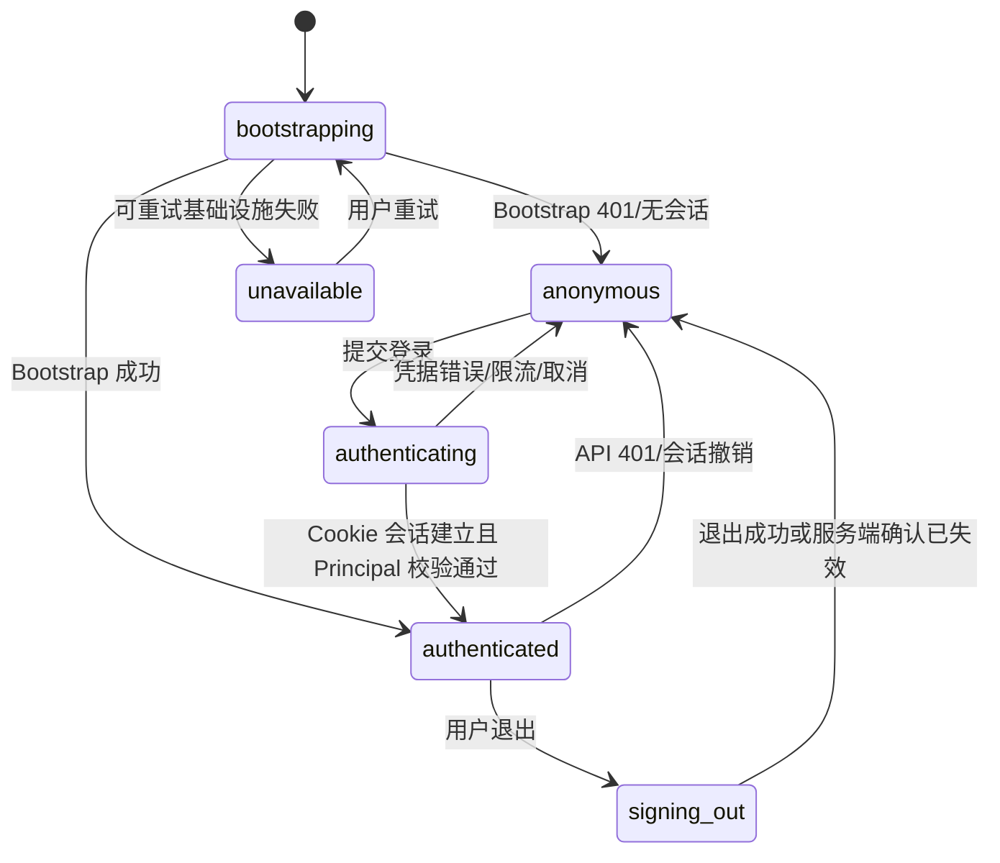
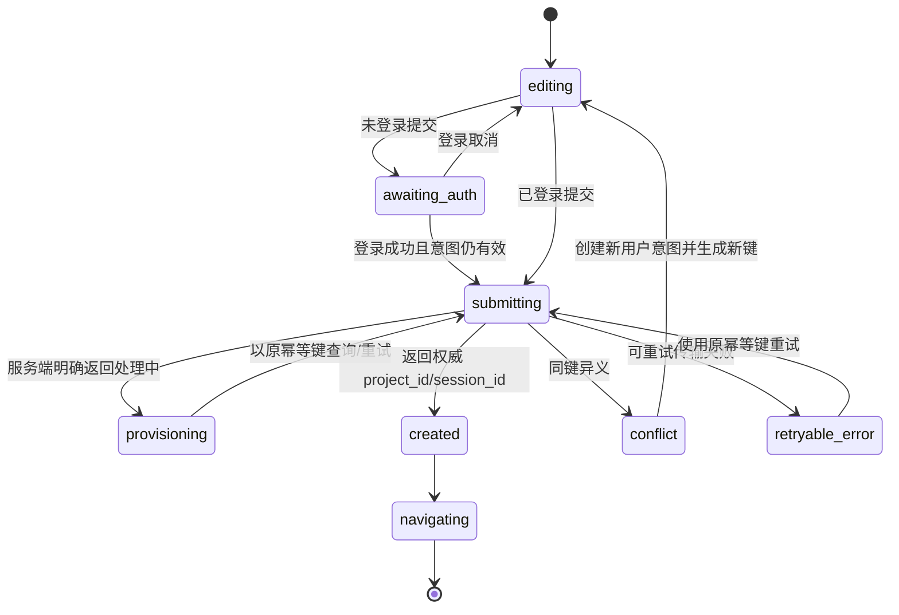
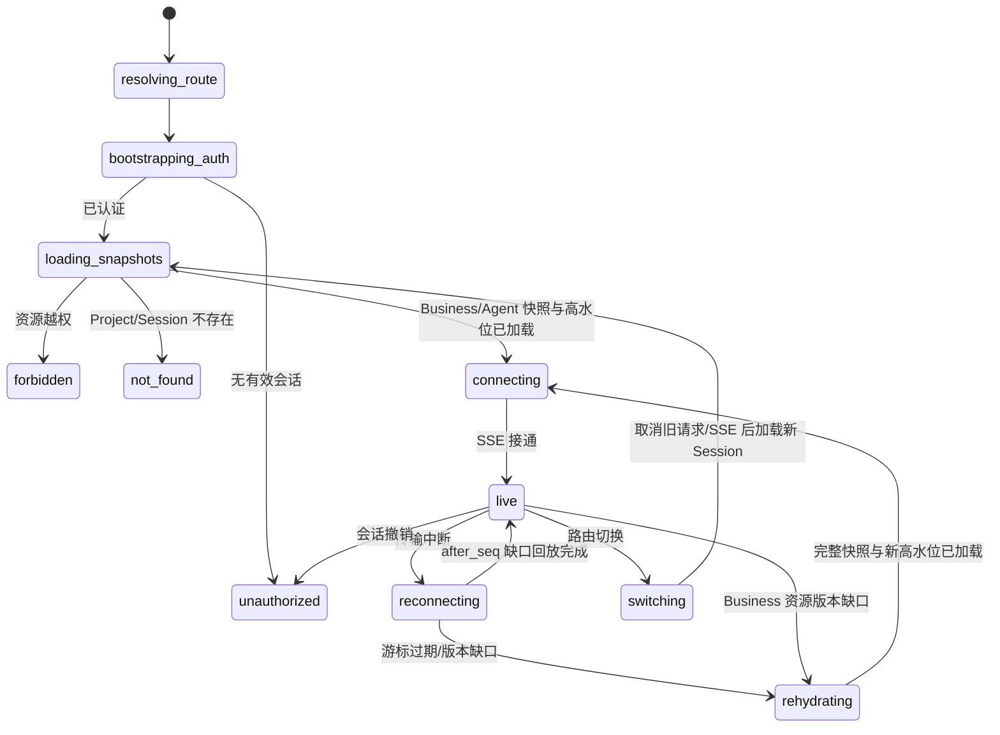
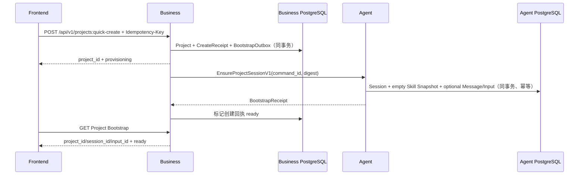

# SMK-001～SMK-004 垂直切片评审包

> 状态：W0 场景契约已冻结；Smoke Runner 与执行证据未实现
>
> 版本：`smoke.identity-workspace.v1alpha1`
>
> 更新日期：2026-07-14
>
> 范围：身份与权限、快速创建、空工作台、工作台刷新与 SSE 恢复
>
> 实现门禁：身份/快速创建/工作台基础以 [W0 身份与工作台契约 v1](../cross-module/w0-identity-workspace-contract-v1.md) 为准；本批已允许 Persistence/Domain/Client，生产 HTTP/RPC/SSE 与 Smoke Runner 必须按后续批次完成后才能产生执行证据。

## 1. 评审目标与当前结论

本评审包把以下四条场景拆成可独立开发、可跨服务联调、最终可自动化验收的第一组垂直切片：

- `SMK-001`：登录、退出、普通用户/管理员权限隔离与越权失败；
- `SMK-002`：带提示词并发快速创建只产生一个 Project、Session 和 Agent Input；
- `SMK-003`：空提示词只创建空工作台，不启动执行或扣费；
- `SMK-004`：工作台刷新和 SSE 重连恢复 Chat/A2UI、故事板、资产和高层运行状态。

推荐把这四条作为领域 API 开发的第一组纵向链路，但不能把现有前端 Demo 接口直接固化成生产契约。当前结论如下：

1. 前端接入底座已经具备 Cookie 请求、结构化错误、共享认证快照和带游标 SSE 重连能力，可以复用。
2. Business 和 Agent 当前 HTTP 仍只实现 `/livez`、`/readyz`；W0 Business/Agent 表与 Repository 已实现，但正式鉴权、Project、Session RPC、工作台读模型和 SSE 尚未实现。
3. 当前登录弹窗只把 Mock 用户写入内存；没有会话 Bootstrap、真实登录、退出入口、管理员应用外壳或 RBAC 路由。
4. 当前 `/workspace` 会从 URL 或 LocalStorage 读取历史 Demo `session_id`，找不到时直接创建 Demo Session；它没有 `project_id` 资源边界，也会把必需资源 `404` 当作可选空值。
5. `SMK-001` 的注册登录详细 PRD 在共通需求中明确延后，Cookie 属性、CSRF、防暴力尝试、会话撤销、管理员登录入口和权限快照仍需产品/安全评审。
6. `SMK-002/003` 的 Business→Agent Ensure/Query、Unknown Outcome 和空 Prompt 语义已冻结，但 IDL/Server/Dispatcher 尚未实现。
7. `SMK-004` 的 EventLog 单调序号、Snapshot 高水位、Cursor 规则与无 `id` 的 `stream.reset` 已冻结；Workspace/SSE Transport 和 Business 资源刷新实现尚未完成。

因此四条场景当前统一保持为 `待设计/待实现`，不得标记为 `可执行` 或 `通过`。

## 2. 需求映射与范围边界

| Smoke ID | 直接需求 | 必须继承的共通规则 | 本切片不包含 |
|---|---|---|---|
| `SMK-001` | `ADM-RBAC-001` | 资源级授权、越权审计、稳定错误码、Cookie/Secret 脱敏、WCAG 2.1 AA | 完整注册、实名、找回密码、SSO、企业组织权限 |
| `SMK-002` | `USR-CREATE-001`、`SRV-CREATE-001` | 100 次同键并发只产生一个事实、Project 创建 `P95 ≤ 1s`、所有输入先持久化 | 真模型处理结果、Skill/Graph Tool 运行、计费 |
| `SMK-003` | `USR-CREATE-002`、`SRV-CREATE-002` | 空白规范化、负向副作用断言、Project/Session 可恢复 | 后续用户发送第一条消息后的 Agent 行为 |
| `SMK-004` | `USR-WORKSPACE-001`、`SRV-READ-001` | SSE 缺口回放 `P95 ≤ 3s`、EventLog 单调序号、权威状态回源、重复事件幂等 | Graph Tool 业务正确性、Worker 任务执行、支付/计费业务 |

本切片涉及 Business、Agent 和前端，不涉及 Worker 生产职责。`SMK-003` 对“没有扣费”的断言查询 Business 权威账本，对“没有 Turn/Invocation”的断言查询 Agent 权威状态；不为此启动或实现 Worker。

## 3. 当前实现审计

### 3.1 可直接复用的前端基础

| 现有能力 | 当前事实 | 本切片复用方式 |
|---|---|---|
| `apiClient` | 默认 `credentials: include`，支持 JSON/FormData、结构化 `ApiError`、401 会话失效广播，保留调用方 Header | 所有正式 Business/Agent 请求复用；快速创建由调用方提供稳定 `Idempotency-Key` |
| `AuthSessionProvider` | 全站共享 `anonymous/authenticated` 快照，不持久化 Access Token | 扩展为 `bootstrapping/anonymous/authenticated`，接入 Bootstrap/Login/Logout 后页面消费方式保持一致 |
| `reconnectingSSE` | 使用 Cookie，读取协议 `seq` 或 `Last-Event-ID`，重连携带 `after_seq`，有界指数退避和旧连接隔离 | 复用连接生命周期；补充永久错误、游标过期和会话失效的停止/回源策略 |
| A2UI 协议 | 已有 `1.0` 版本门禁、白名单 Action/Component、未知动作失败关闭 | 用于 `SMK-004` 实时与历史回放一致性；事件 Envelope 仍需服务端冻结 |
| 工作台快照合并 | 已有资源请求代次、Mutation Version、防止旧请求覆盖新事件、Storyboard Base Version 缺口回源 | 保留并按正式 Business/Agent 读模型拆分数据 Owner |
| 开发代理 | `/api/aigc/**` 指向 Agent，其余 `/api/**` 指向 Business | 正式路径全部使用 `/api/v1`；是否继续使用 `/api/aigc` 前缀必须在契约评审决定 |

### 3.2 必须替换或补齐的历史行为

| 当前行为 | 风险 | 目标处理 |
|---|---|---|
| 登录弹窗点击后直接 `authenticate(currentUser)` | 没有服务端身份、Cookie、失败状态和审计 | 调 Business 登录 API，成功后以 Bootstrap/响应中的安全 Principal 更新 Provider |
| 前端无退出入口 | 无法验收 Cookie 撤销和受保护路由回退 | 增加真实退出动作；服务端成功或确认会话已失效后清空 Provider |
| `AuthSessionProvider` 初始即匿名 | 首屏可能先渲染游客态再跳变；不能区分网络失败与未登录 | 增加 `bootstrapping` 和安全失败页/重试，不在 Bootstrap 完成前渲染受保护内容 |
| `sanitizeUser` 不保留角色/权限 | 管理端菜单和路由无法消费有效权限 | 只保留已评审的安全显示字段及有效权限摘要；权限判定仍由服务端执行 |
| 当前无管理端路由/页面外壳 | `SMK-001` 无法做管理员菜单和直接 URL 越权 UI 验收 | 冻结 `/admin` 应用边界并建立最小 Admin Shell/路由守卫；不得仅隐藏菜单代替授权 |
| 快速创作只打开登录意图 | 登录后不调用 Project API，也不保留一次稳定创建请求 | 创建独立 Create Flow，冻结幂等键到成功/明确冲突，响应后导航权威 Project/Session |
| `/workspace` 不带 `project_id` | 无法进行 Project 所有权校验和 Business 资源读取 | 使用包含 Project 与 Session 的正式路由；两者都由服务端复核归属 |
| 工作台自动创建 Demo Session | 受保护路由 404 可能误建新资源，掩盖越权/数据丢失 | 正式工作台禁止自动创建；创建只能来自显式快速创建命令 |
| LocalStorage 保存 `demo_session_id` | 可能把旧用户/旧环境指针带入新身份 | 正式路由以 URL/服务端最近项目为准；不以 LocalStorage 作为授权或资源真源 |
| 多个必需资源使用 `requestOptionalJSON` | `404` 被吞成空状态，可能把不可访问误报为空工作台 | 只有真正可选子资源使用 Optional；Project/Session/Workspace Snapshot 使用严格请求 |
| EventSource 传输错误无限重连 | 初始 401/403/404、游标过期会持续重连且不能更新登录态 | 在错误探测契约冻结后区分可重试传输错误和永久错误，必要时 Bootstrap/回源后停止旧连接 |

## 4. 场景级 Given / When / Then

### 4.1 SMK-001：身份、退出与 RBAC

**Given**

- Fixture 至少包含 `user.basic`、`user.other`、`admin.reviewer`、`admin.finance`；
- 两名管理员具有不同角色、菜单能力和数据范围；
- 普通用户、管理员和禁用账号使用不同登录会话；
- 选定一个 Reviewer 可访问但 Finance 不可访问的管理对象，以及一个反向对象；
- 所有受保护 API 均启用资源级授权和审计。

**When**

1. 游客访问公开首页，并尝试直接打开用户受保护路由与 `/admin` 路由；
2. 普通用户登录、刷新页面、访问自己的 Project，再直接请求他人的 Project；
3. 普通用户直接打开管理端 URL 并调用管理 API；
4. `admin.reviewer` 与 `admin.finance` 分别登录并访问同一菜单、对象、敏感字段和导出入口；
5. 用户退出后刷新页面，再重放退出前的受保护请求；
6. 服务端主动撤销会话或返回 401，前端处理会话失效。

**Then**

- 公开页面保持可用，受保护页面在 Bootstrap 完成前不泄露旧内容；
- 登录成功后 Cookie 会话生效，刷新仍恢复同一安全 Principal；
- 管理端菜单只展示有效权限范围，但直接 URL/API 仍必须由服务端返回稳定 `403`；
- 对象越权不得用前端 `user_id` 覆盖服务端身份；按安全评审决定返回 `403` 或防枚举 `404`，同类资源保持一致；
- 越权读取不返回敏感字段，导出不能绕过同一授权；
- 越权访问产生脱敏审计，包含 actor、action、resource、decision、request_id/trace_id，不记录 Cookie/Token；
- 退出后 Cookie 被撤销或失效，Provider 进入匿名态，受保护页面和 SSE 均停止；
- `401` 触发一次会话失效，不形成跳转/请求风暴。

**Forbidden**

- 以菜单隐藏作为唯一权限控制；
- 在 LocalStorage/SessionStorage 保存 Access Token、Refresh Token 或完整权限凭据；
- 使用固定 Demo 用户、简单管理 Token 或客户端传入角色；
- 越权失败后仍在页面保留上一账号的 Project、Chat、资产或管理员敏感数据。

### 4.2 SMK-002：带提示词的幂等快速创建

**Given**

- `user.basic` 已登录；
- 首页 Prompt 为非空稳定文本；
- 客户端为同一次创建意图生成一个稳定 `Idempotency-Key`；
- Business 与 Agent 使用独立 PostgreSQL，快速创建 Bootstrap 契约已冻结；
- 测试记录创建前 Project、Session、Input、Message、Turn、Invocation 和账本基线数量。

**When**

1. API Driver 使用同一认证会话、同一幂等键和相同语义并发提交 100 次；
2. UI Driver 同时覆盖双击、按钮禁用前的重复事件和网络响应丢失后的显式重试；
3. 服务端在 Business 已提交、Agent Bootstrap 响应丢失的故障点执行一次受控重试；
4. 所有成功响应完成后，前端导航到正式工作台路由。

**Then**

- 所有成功响应返回相同 `project_id`、`session_id` 和首 Input 引用；
- Business 只存在一个 Project 和一个创建幂等回执；
- Agent 只存在一个默认 Session、一条首用户消息和一个持久化 Agent Input；
- 重试复用原 Session/Input，不创建第二个业务 Turn；
- 同一幂等键携带不同提示词或配置返回稳定 `409 IDEMPOTENCY_CONFLICT`，不覆盖旧 Project；
- 用户在 `P95 ≤ 1s` 打开工作台；工作台可以显示“已受理/等待处理”，不等待模型完成；
- 创建过程不接受客户端 `user_id`，所有资源都绑定服务端身份；
- 此场景只验证输入已可靠受理，不要求真实模型或 Graph Tool 完成。

**Forbidden**

- 每次前端 retry 生成新幂等键；
- Business 事务内调用 Agent RPC；
- 出现“Project 不存在但 Input 已执行”或“首消息重复”；
- 用 Redis 唤醒成功代替 PostgreSQL Input/Outbox 权威事实；
- 把首次创建的提示词拼接为不受信系统输入。

### 4.3 SMK-003：空提示词的空工作台

**Given**

- `user.basic` 已登录；
- 输入分别覆盖空字符串、ASCII 空格、制表符、换行和 Unicode 空白；
- 同一次意图使用稳定幂等键；
- 创建前记录 Agent 执行和 Business 账本基线数量。

**When**

- 用户点击“开始创作”，前端提交经过服务端同规则规范化的可选首提示词；
- 相同语义并发/重试 100 次；
- 创建成功后打开工作台并刷新一次。

**Then**

- 只创建一个 Project、一个默认 Session 和空工作区；
- 不创建 User Message、Agent Input、Turn、Run、Skill Invocation、Tool Run、Operation 或扣费记录；
- Agent Session 保持可接受未来输入的空闲状态；
- 工作台显示明确空状态，不伪造欢迎消息为持久化 Agent 消息；
- 刷新后仍为同一个 Project/Session，不能因历史资源 `404` 自动创建新 Session；
- 所有空白变体与服务端规范化结果一致；同键非空提示词仍构成语义冲突。

**Forbidden**

- 用 `trim()` 仅在前端决定是否执行，服务端仍必须权威规范化；
- 创建占位 Agent Turn/Invocation 以便页面显示；
- 扣除“初始化费用”或启动 Model/Provider；
- 把页面静态欢迎文案计入 Chat 权威历史。

### 4.4 SMK-004：刷新、缺口回放与权威回源

**Given**

- `project.workspace_ready` 属于 `user.basic`，包含 Business 权威 Storyboard/Asset Snapshot 和 Agent 权威 Chat/A2UI/EventLog；
- Session EventLog 已存在连续序号 `1..N`，Snapshot 返回明确高水位；
- Snapshot 完成后追加 `N+1..N+K`，覆盖 Chat、A2UI Card、Storyboard/Asset 刷新提示和高层 Run 状态；
- 记录执行、副作用和账本基线数量；
- 另准备一个游标已超出在线保留窗口的 Session。

**When**

1. 用户直接刷新正式工作台 URL；
2. 页面并发加载 Business 与 Agent 权威快照，并从已确认高水位建立 SSE；
3. 传输中断后，客户端用最后确认 `after_seq` 重连；
4. 服务端重复发送最后一条 Event，并在重连中发送缺口事件；
5. 注入 Storyboard `base_version` 不匹配或 Asset 版本跳跃；
6. 使用过期游标触发完整读模型回源；
7. 在旧连接延迟回调到达前切换 Session。

**Then**

- 刷新后恢复同一个 Project/Session，不创建任何新资源；
- Chat/A2UI、Storyboard、Asset 和高层运行状态与各自 PostgreSQL 权威事实一致；
- 重连携带最后确认游标，`P95 ≤ 3s` 完成缺口回放并进入实时流；
- 相同 Event ID/Seq 重放只应用一次，Card/资源版本不回退，Action 不重复提交；
- Business 资源版本出现缺口时回源 Business Read API，不把 A2UI/EventLog 当作最终业务真源；
- 游标过期时服务端给出可机读 Reset 语义，前端重新加载完整快照后从新高水位连接；
- 旧 Session 的请求、SSE 和延迟回调不能污染新 Session；
- 故障前后 Model、Tool、Provider、扣费和 Continuation 数量不增加。

**Forbidden**

- 只依赖 Redis 或浏览器内存恢复终态；
- 收到重复事件时再次提交 Approval/A2UI Action；
- 把所有 EventLog Payload 当成 Business Storyboard/Asset 真源永久保存；
- 遇到 401/403/404/游标过期仍无限重连；
- 使用固定 sleep 代替权威状态和游标等待。

## 5. 页面、路由与前端状态机

### 5.1 候选路由

以下只是评审候选，不是已冻结 API 或产品决策：

| 页面 | 当前路由 | 候选正式路由 | 评审点 |
|---|---|---|---|
| 用户首页 | `/` | `/` | 保持游客可访问 |
| 用户项目 | `/projects` | `/projects` | 登录态路由守卫及 Bootstrap Loading |
| 创作工作台 | `/workspace` | `/projects/:project_id/workspace?session_id=:session_id` | Project/Session 必须同时校验；是否当前标签页打开尚未确认 |
| 管理端 | 不存在 | `/admin/*` | 与用户端共用构建还是独立入口；普通用户进入时返回 403 页面 |
| 管理端登录 | 不存在 | `/admin/login` 或统一登录弹窗 | 管理员是否独立认证入口由安全 PRD 决定 |

`user-requirements-overview.md` 仍把“独立创作页面当前标签页还是新标签页”列为待确认参数。UI Smoke 在该决策冻结前不得把 popup 或单页跳转写成固定断言。

### 5.2 AuthSession 状态机



前端不得把 `unavailable` 当成 `anonymous`，否则 Business 故障会被误报为用户未登录。`authenticated` 只保存安全 Principal 快照，不保存认证 Token。

### 5.3 QuickCreate 状态机



幂等键从 `submitting` 第一次进入时冻结，直到 `created`、用户明确放弃或 `conflict` 后开始新意图。按钮禁用只优化体验，服务端唯一约束才是正确性门禁。

### 5.4 Workspace 恢复状态机



页面必须明确显示 Loading、重连、回源、永久失败和空工作台，不得用单一 `error` 字符串覆盖所有状态。

## 6. 候选 HTTP、RPC 与 SSE 契约映射

### 6.1 契约状态说明

本节路径、字段和错误码是为了暴露依赖和评审问题的候选集合。正式实现前必须由 Business、Agent、前端、测试和安全共同冻结，并按 Owner 输出 OpenAPI/Thrift 源契约。候选 DTO 不允许通过复制 Go `internal` 类型跨 Module 共享。

### 6.2 身份与会话候选 HTTP

| 候选能力 | Owner | 候选方法/路径 | 最小成功结果 | 关键失败与约束 |
|---|---|---|---|---|
| Session Bootstrap | Business | `GET /api/v1/auth/session` | `status`、安全 `principal`、有效权限摘要、CSRF/会话策略元数据（若方案需要） | 401 表示无有效会话；基础设施失败不得伪装为 401 |
| Login | Business | `POST /api/v1/auth/session` | 安全 Principal；通过 `Set-Cookie` 建立会话 | 凭据错误、账号禁用、限流使用稳定错误码；不返回 Token 给 LocalStorage |
| Logout | Business | `DELETE /api/v1/auth/session` | 204 或退出回执 | 重复退出幂等；撤销服务端会话并清理 Cookie |
| Effective Permissions | Business | Bootstrap 内嵌或 `GET /api/v1/admin/me/permissions` | roles、capabilities、data scopes 的安全摘要 | 前端只用于路由/菜单体验，API 仍逐次授权 |
| Protected Resource | 对应 Owner | `/api/v1/...` | 资源 DTO | 401/403/防枚举 404 语义保持一致；所有越权决策可审计 |

认证 PRD 至少需要冻结：账号标识与凭据、用户和管理员是否共用入口、会话存储与撤销、Cookie `HttpOnly/Secure/SameSite/Path/Domain`、CSRF 防护、Origin 校验、密码 Argon2id 参数、JWT 或不透明 Session 方案、失败限流、禁用账号、并发会话、退出全部设备、审计和测试账号 Seeder。没有这些结论，`SMK-001` 只能细化场景，不能实现生产鉴权。

`AuthSessionProvider` 的安全 Principal 候选字段只包括 `id/display_name/avatar_ref/account_status/roles/capabilities` 等展示和路由所需字段。是否返回 data scope 摘要由安全评审决定；密码摘要、Token 摘要、内部风控原因和全量权限策略不得进入前端 DTO。

### 6.3 快速创建候选 HTTP

推荐由 Business 对前端提供唯一的快速创建入口，前端不分别调用 Business 创建 Project、再调用 Agent 创建 Session：

| 候选能力 | Owner | 候选方法/路径 | 请求 | 响应 |
|---|---|---|---|---|
| Quick Create | Business | `POST /api/v1/projects:quick-create` | Header `Idempotency-Key`；Body `initial_prompt?`、`source=quick_create`；W0 Skill Snapshot 固定为空集合 | `project_id`、可空 `session_id/input_id`、`creation_status`、`workspace_ref`、`request_id` |
| Get Create Result | Business | `GET /api/v1/project-creation-requests/{request_id}` 或按幂等键查询的受控能力 | 创建请求引用 | 原 Project/Session/Input 结果或明确处理中/失败状态 |

候选规范化和幂等规则：

1. 服务端对首提示词执行统一 Unicode 空白规范化；空白结果视为“未提供”，但不得修改非空内容的业务语义。
2. Semantic Digest 至少覆盖服务端 Principal、规范化提示词、创建来源和初始 Skill/配置；不包含随机 Request ID。
3. 同一 Principal、同一 Idempotency-Key、同一 Digest 返回原结果；同键不同 Digest 返回 `409 IDEMPOTENCY_CONFLICT`。
4. 前端在一次用户意图内保留原键；传输失败或 5xx 不能自动生成新键。
5. 首次成功结果必须包含服务端权威 `project_id`；provisioning 时 `session_id/input_id` 允许为空，ready 后由 Bootstrap 返回，前端不得从本地拼接或猜测。
6. `workspace_ref` 若返回 URL，仍只能作为导航提示；路由加载时重新执行资源授权。

### 6.4 Business→Agent Session Bootstrap 候选 RPC

快速创建横跨两个独立数据库，不能使用伪分布式事务。推荐评审一个“Business 负责前端命令与 Project，Agent 幂等确保 Session/Input”的可恢复编排：



候选 RPC 语义：

| 编号 | 候选方法 | 调用方 | 最小字段 | 幂等/Unknown Outcome |
|---|---|---|---|---|
| `BIZ-AGT-SESSION-001` | `EnsureProjectSessionV1` | Business→Agent | `command_id/project_id/user_id/source/semantic_digest/skill_snapshot_mode=empty/initial_message?` | Agent 重新规范化并计算摘要，以 command + digest first-write-wins；同键异义冲突 |
| `BIZ-AGT-SESSION-002` | `QueryProjectSessionCommandV1` | Business→Agent | command 引用 + 预期摘要 | RPC 超时先查询原 Receipt，不用新键重试 |

仍需跨 Module 评审的关键点：

- `session_id/input_id` 由最终 Owner Agent 生成并冻结在 Command Receipt，Business 不预写 Agent 聚合 ID；
- Business 提交成功但 Agent 暂不可用时，HTTP 返回 `project_id + provisioning`；前端先打开工作台骨架并查询 Bootstrap；
- Outbox 恢复与同步 RPC 的单一重试 Owner，避免两条路径并发产生冲突；
- Business 的 Project 初始化状态是否需要 `provisioning/ready/failed`，以及失败后用户是否可见空 Project；
- Agent Session 创建时原子冻结显式空 Skill Snapshot；后续非空 Published Snapshot 使用版本化契约扩展；
- `user_id` 由 Business 认证上下文注入并由 Agent 只作为可信 RPC 字段接收，前端不能提供。

无论选择同步 Ensure、Outbox 最终一致或二者组合，都必须证明：Project 不存在时 Input 不执行、重复请求不重复 Session/Input、响应丢失可查询原结果、空提示词不生成 Input、服务重启可以恢复。本文不把上述候选序列视为已经冻结。

### 6.5 工作台读模型候选 HTTP

建议保留数据 Owner，不建立“前端从 Agent EventLog 重建全部 Business 领域”的隐式契约：

| 候选能力 | Owner | 候选方法/路径 | 关键结果 |
|---|---|---|---|
| Project Workspace Snapshot | Business | `GET /api/v1/projects/{project_id}/workspace` | Project 元数据、Storyboard 摘要/版本、Asset 摘要/版本、权限、读模型版本 |
| Session Workspace Snapshot | Agent | `GET /api/v1/sessions/{session_id}/workspace` | Session/Project 绑定、Chat、A2UI Card、高层 Run 状态、EventLog `high_watermark_seq`、可回放窗口起点 |
| Session Event Stream | Agent | `GET /api/v1/sessions/{session_id}/events` | 从 `after_seq` 回放后进入实时流 |
| Resource Detail Refresh | Business | `/api/v1/projects/{project_id}/storyboard`、`.../assets` 等 | 按权威资源版本回源；具体资源边界另评审 |

冷启动推荐顺序：

1. 解析并严格校验 `project_id/session_id`；
2. 等待 Auth Bootstrap 完成；
3. 并发读取 Business Project Snapshot 和 Agent Session Snapshot；
4. 校验两边 `project_id/session_id/user` 绑定且均授权；
5. 以 Agent Snapshot 返回的 `high_watermark_seq` 作为 `initialCursor`；
6. 建立 SSE，回放 Snapshot 后到达的事件；
7. Event 指示 Business 资源变化时按资源版本刷新 Business Read API；
8. 版本缺口或游标过期时取消旧流、重新取完整 Snapshot，再从新高水位连接。

前端可以并发调用两个 Owner 的 HTTP，但需要一个统一 `WorkspaceBootstrap` 协调层处理 Loading、取消、权限失败和一致性。若评审选择由 Agent 聚合 Business RPC 为单一 HTTP Read Model，也必须保留 Business 权威版本、RPC 超时/降级和资源授权，且不得把聚合 DTO 当作 Agent 对 Business 表的所有权。

### 6.6 SSE Event Envelope 与缺口协议候选

```json
{
  "schema_version": "workspace.event.v1",
  "event_id": "uuidv7",
  "session_id": "uuidv7",
  "project_id": "uuidv7",
  "seq": 42,
  "event": "a2ui.action",
  "occurred_at": "2026-07-14T00:00:00Z",
  "aggregate_type": "a2ui_card",
  "aggregate_id": "uuidv7",
  "aggregate_version": 3,
  "payload": {}
}
```

协议必须冻结：

- SSE `id:` 与 JSON `seq` 是否都使用同一十进制序号；当前前端可以读取两者，但服务端应避免歧义；
- `after_seq` 是“最后已确认”还是“下一条”，推荐为最后已确认，服务端返回严格大于该值的事件；
- Snapshot 的 `high_watermark_seq` 与数据库快照读取的一致性边界；
- 事件 `event_id`、`seq` 的去重优先级，重复 Seq 不同 Event ID 必须失败关闭；
- EventLog 在线窗口起点和无 `id` 的 `stream.reset(reason=cursor_expired)` 可机读机制；
- Heartbeat、代理缓冲关闭、最大事件大小、连接时长、并发限制和慢消费者处理；
- 401/403/404 与临时 5xx 的客户端停止/重连语义。

原生 EventSource 无法直接读取非 2xx 响应正文。W0 推荐“Snapshot/鉴权预检 + 受控 `stream.reset`”组合：

1. 连接前先调用 Session Snapshot/Stream Ticket Read API，得到有效游标窗口；传输错误后用轻量 Read API 判定 401、404 或游标过期；
2. 已建立连接遇到 Cursor 过期时发送无 SSE `id` 的 `stream.reset` 并关闭；
3. `reconnectingSSE` 收到 Reset 后进入 terminal 状态，停止当前自动重连；Workspace 完整回源后显式创建新连接；
4. 若预检仍无法稳定识别初次握手错误，再评审 Fetch Streaming，不默认扩大 W0 范围。

浏览器原始 Cookie 只到同源 Gateway/Business Auth Resolver。Agent 接收并校验短期、签名、Audience/Method/Path 绑定的内部身份断言；Cookie/CSRF Token 不进入 Agent 领域 DTO 或普通内部 RPC。

当前工具可以安全处理临时断线，但尚不能单独满足永久错误和游标过期的关闭路径。

### 6.7 统一错误映射候选

| HTTP | 候选稳定错误码 | 前端行为 |
|---|---|---|
| 400 | `INVALID_ARGUMENT`、`INVALID_PROMPT` | 字段级提示，不重试 |
| 401 | `UNAUTHENTICATED`、`SESSION_EXPIRED` | 终止受保护请求/SSE，清空安全快照并进入登录流程 |
| 403 | `FORBIDDEN`、`RESOURCE_SCOPE_DENIED` | 显示无权限；不得自动重试或回到旧缓存 |
| 404 | `PROJECT_NOT_FOUND`、`SESSION_NOT_FOUND` | 必需资源显示不存在；禁止自动新建 Session |
| 409 | `IDEMPOTENCY_CONFLICT`、`VERSION_CONFLICT`、`PROJECT_SESSION_MISMATCH` | 保留原请求信息，引导新意图或完整回源 |
| 已建立 SSE 控制事件 | `stream.reset`，无 `id` | 停止旧流，完整加载 Snapshot，再从新高水位显式建新连接 |
| 429 | `RATE_LIMITED` | 使用服务端建议的有界等待，不绕过幂等键 |
| 503/504 | `SESSION_PROVISIONING`、`DEPENDENCY_UNAVAILABLE`、`UNKNOWN_OUTCOME` | 查询原创建回执或使用原幂等键显式重试 |

错误 Envelope 继续使用 `{code,message,request_id,details,retryable}` 或 `{error:{...}}`，避免扩散新的前端错误格式。`details` 只能包含安全可展示字段。

## 7. 前端模块拆分与复用计划

### 7.1 推荐模块

| 模块 | 职责 | 依赖现有基础 |
|---|---|---|
| `platform/auth/authApi` | Bootstrap/Login/Logout 和 Principal Mapper | `requestJSON`、`AuthSessionProvider` |
| `platform/auth/ProtectedRoute` | 等待 Bootstrap、处理 401/403、保存安全导航意图 | AuthSession 状态机 |
| `features/projects/quickCreateApi` | Quick Create DTO、幂等请求和创建回执查询 | `requestJSON`，保留 `Idempotency-Key` |
| `features/projects/useQuickCreate` | 单次意图键、状态机、失败重试、成功导航 | QuickCreate 状态机 |
| `features/workspace/workspaceApi` | Business/Agent Snapshot 读取与严格错误区分 | `requestJSON`，必需资源不用 Optional |
| `features/workspace/useWorkspaceBootstrap` | 并发快照、Abort、Route Generation、高水位和回源 | 当前 Session Generation/资源版本思路 |
| `features/workspace/workspaceEventStream` | SSE 事件验证、重复/缺口、永久错误探测 | `reconnectingSSE`、A2UI 版本门禁 |
| `features/admin/AdminShell` | 最小管理端导航、Route Guard、403 页面 | AuthSession 安全 Principal；服务端 RBAC |

目录名为候选，实施时遵循现有前端组织方式即可。关键是不要继续在 3000 行工作台组件中叠加认证、创建编排和跨 Owner Bootstrap；应先抽出边界，再替换历史路径。

### 7.2 前端实现顺序

1. 为 `AuthSessionProvider` 增加 Bootstrap/Unavailable 状态和单次初始化；
2. 接入真实 Login/Logout，移除 `currentUser` 对登录结果的控制；
3. 增加退出入口、用户/管理端 Route Guard 和 401 清理测试；
4. 冻结正式工作台路由解析，不再自动创建 Demo Session；
5. 建立 QuickCreate API/状态机，同一意图稳定复用幂等键；
6. 登录后恢复创建意图时复用原 Prompt，并在真正提交时生成/冻结创建键；
7. 建立 Workspace 双 Snapshot Bootstrap 和明确 Loading/Empty/Forbidden/NotFound 状态；
8. 把现有工作台历史路径映射到正式 DTO，先覆盖 Chat/A2UI/Storyboard/Assets 的只读恢复；
9. 接入正式 SSE Envelope、Snapshot 高水位和游标过期回源；
10. 删除正式路径对 `demo_session_id` 的读写；历史 Demo 若保留必须位于显式开发路由，不能自动进入生产流程。

## 8. Fixture 与隔离设计

### 8.1 标准账号 Fixture

| Fixture Key | 角色/状态 | 用途 |
|---|---|---|
| `user.basic` | 正常普通用户 | 登录、创建、工作台 Owner |
| `user.other` | 正常其他用户 | Project/Session 越权 |
| `user.disabled` | 禁止登录 | 登录失败关闭与审计 |
| `admin.reviewer` | Skill/内容审核能力、Reviewer 数据范围 | 管理菜单/对象允许与 Finance 禁止路径 |
| `admin.finance` | 财务只读/处置能力、Finance 数据范围 | 与 Reviewer 交叉验证 |

账号凭据只进入 local-smoke Secret。Scenario YAML 和 Evidence 只保存 Fixture Key 与脱敏 User ID，不保存密码、Cookie 或完整权限策略。

### 8.2 场景 Fixture

| Fixture Key | Owner | 初始状态 | 主要场景 |
|---|---|---|---|
| `project.none` | Business | Namespace 下无 Project | `SMK-002/003` |
| `project.workspace_ready` | Business | Project、Storyboard Snapshot、图片/视频/文本 Asset 摘要 | `SMK-004` |
| `session.workspace_ready` | Agent | 绑定同一 Project，Chat/A2UI/高层状态和 Event `1..N` | `SMK-004` |
| `session.cursor_expired` | Agent | Event Window 起点高于客户端 Cursor | `SMK-004` 回源 |
| `admin.scope_objects` | Business | Reviewer/Finance 各自允许和禁止对象 | `SMK-001` |

创建方式遵循 Owner：Business Seeder/API 只写 Business DB，Agent Seeder/API 只写 Agent DB。两边通过预生成稳定 UUIDv7 和契约测试证明 Project/Session 绑定，不允许一个 Seeder 跨库直接写入。每次运行使用新的 `smoke_run_id/fixture_namespace`。

### 8.3 SMK-004 事件 Fixture

至少准备：

- Snapshot 高水位 `N` 前的 Chat Message、A2UI Card、Storyboard/Asset 高层投影；
- Snapshot 后事件 `N+1`：追加 Chat/A2UI Card；
- `N+2`：同 Card 更高 `aggregate_version` 更新；
- `N+3`：Business Storyboard/Asset 资源刷新 Hint；
- 对 `N+2` 的重复投递；
- 一个 Storyboard Patch `base_version` 高于当前版本，触发权威回源；
- 一个低版本迟到事件，验证不回退；
- 一个过期游标场景，验证完整 Snapshot Reload。

事件 Payload 只使用经过契约验证的最小 DTO，不塞入完整 Prompt、素材正文或 Provider Payload。

## 9. 自动化分层与 Evidence

### 9.1 测试分层

| 层级 | 必测内容 | 不应承担 |
|---|---|---|
| 前端 Unit/Component | Auth Bootstrap、401 失效、路由守卫、QuickCreate 幂等键生命周期、Workspace 状态机、重复/乱序 Event、版本缺口回源 | 跨数据库唯一性 |
| Business Integration | 登录/退出/会话撤销、RBAC/资源授权、Project 创建幂等回执、空白规范化、审计/Outbox 原子性 | Agent Session 事实 |
| Agent Integration | Session Bootstrap first-write-wins、空/非空 Input、EventLog 单调序号、Snapshot 高水位、SSE 回放/窗口过期 | Business Project/Asset 权威事实 |
| Cross-module Contract | Bootstrap RPC DTO/错误/Unknown Outcome、Project/Session 绑定、HTTP Error Envelope、SSE Envelope | UI 视觉布局 |
| API Workflow | 同键并发 100 次、Business 提交后 Agent 响应丢失、负向副作用计数、刷新前后权威状态 | 菜单可见性和浏览器生命周期 |
| Playwright UI | 登录/退出、路由恢复、双击/Retry、空工作台、刷新、断线重连、403/404、键盘和焦点 | 用 UI 推断账本/数据库正确性 |

API 与 UI 使用同一个 Smoke ID、Fixture Namespace 和期望定义。`SMK-002` 的 100 并发由 API Driver 准确施压，UI Driver 只补充真实双击、登录意图恢复和导航体验，不用 100 个浏览器点击替代并发契约测试。

### 9.2 场景 Evidence

| Smoke | 用户/UI Evidence | 协议 Evidence | 权威 Evidence | Forbidden Evidence |
|---|---|---|---|---|
| `SMK-001` | 登录/退出、不同管理员菜单、403 页截图与 Playwright Trace | Bootstrap/Login/Logout、受保护 API 的 200/401/403 摘要 | 服务端会话状态、角色/范围决策、越权审计摘要 | 响应无敏感字段；退出后旧请求/SSE 失败；Cookie/Token 不落 Evidence |
| `SMK-002` | Prompt 保留、提交状态、最终工作台 URL 和可见已受理状态 | 100 响应的 ID 集合、Idempotency-Key digest、Bootstrap RPC/Receipt 时间线 | Project/CreateReceipt=1；Session/Message/Input=1；同一稳定 IDs | Invocation/Charge/Provider 调用不因创建本身产生；同键异义不覆盖 |
| `SMK-003` | 空工作台、刷新后同一 URL/ID、空状态截图 | 各空白变体的请求/响应摘要 | Project=1、Session=1；Message/Input/Turn/Run/Invocation/Ledger=0 | Model/Tool/Provider/Charge 调用计数均为 0 |
| `SMK-004` | 刷新、重连提示、最终 Chat/A2UI/Storyboard/Asset 状态、Trace | Snapshot 高水位、SSE `seq/event_id`、断线/重连/Reset 时间线 | Agent EventLog 与 Card 版本；Business Storyboard/Asset 版本；前后 Snapshot 摘要 | 重复 Action/Execution/Charge=0；旧 Session 回调未写入新页面 |

Evidence 必须能按 `smoke_id → requirement_id → request_id/trace_id → project_id/session_id/input_id/event_id` 关联。协议和数据库证据只保存 DTO 摘要、稳定 ID、状态、版本和 digest，不保存密码、Cookie、Authorization、完整 Prompt、素材正文或 A2UI 敏感表单值。

### 9.3 等待和性能判定

- Project 创建 `P95 ≤ 1s` 与 Event 缺口回放 `P95 ≤ 3s` 使用多次可重复采样和单调时钟，不用一次本机截图宣称达标；
- 异步等待轮询公开 Read API 或只读 Evidence Query，记录每次 observed status/version；
- 到期立即采集 Business/Agent Readiness、创建回执、Session/Input、EventLog 高水位和前端连接状态；
- 自动重试使用新 Fixture Namespace，并保留第一次失败为 flaky Evidence，不能覆盖。

## 10. 实施 Work Packages

以下顺序用于评审后推进，不代表当前已经完成：

| WP | 工作包 | 主要产物 | 进入条件 | 退出条件 |
|---|---|---|---|---|
| `WP-01` | 冻结 Auth/RBAC PRD | Cookie/CSRF/会话/RBAC/错误/审计决定 | 产品、安全、Business 到场 | 无开放的高风险认证决策 |
| `WP-02` | 冻结 QuickCreate 契约 | Business HTTP、Agent Bootstrap RPC、幂等/Unknown Outcome | Business/Agent Owner 确认 | OpenAPI/Thrift/状态/错误可生成测试 |
| `WP-03` | 冻结 Workspace Read/SSE | 双 Snapshot、高水位、Event Envelope、Reset | Agent/Business/前端确认 Owner | 冷启动与缺口算法无歧义 |
| `WP-04` | Business Auth/RBAC | Migration、Repository、会话、Middleware、HTTP、审计测试 | `WP-01` | Business 独立门禁与契约测试通过 |
| `WP-05` | Agent Session/Event 基础 | Session/Input/EventLog/Snapshot/SSE/Receipt | `WP-02/03` | Agent 独立门禁与回放测试通过 |
| `WP-06` | Business Project/Create 编排 | Project/CreateReceipt/Outbox、QuickCreate HTTP、Agent Client | `WP-02/05` | 同键并发/Unknown Outcome 集成通过 |
| `WP-07` | 前端身份纵切 | Bootstrap/Login/Logout、Route Guard、Admin Shell | `WP-01/04` | `SMK-001` UI/API 可执行 |
| `WP-08` | 前端创建纵切 | QuickCreate 状态机、正式工作台路由、移除自动 Demo Session | `WP-02/05/06` | `SMK-002/003` UI/API 可执行 |
| `WP-09` | 前端恢复纵切 | 双 Snapshot、SSE 高水位、Reset、永久错误 | `WP-03/05/06` | `SMK-004` UI/API 可执行 |
| `WP-10` | Smoke Driver/Evidence | Scenario、Fixture、API/UI Driver、Collector | 单条场景开发门禁满足 | 四条场景可重复执行且证据脱敏 |

每个后端工作包都要分别在 `GOWORK=off` 下验证对应 Module；跨 Module 只通过版本化契约，不引用另一 Module 的 `internal` 包。`WP-10` 只能在场景契约冻结后创建，避免把 Draft 路径和字段固化进测试 Runner。

## 11. 当前与目标命令

当前可执行、用于保护已有前端底座的命令：

```bash
make check-frontend
GOWORK=off /Users/figo/sdk/go1.26.3/bin/go -C business test ./...
GOWORK=off /Users/figo/sdk/go1.26.3/bin/go -C agent test ./...
make foundation-smoke
```

以下是契约冻结并实现后建议提供的目标命令名，当前不存在，不得写入“已通过”证据：

```bash
make test-contracts CONTRACT_SET=identity-workspace-v1
make smoke-api SMOKE_IDS=SMK-001,SMK-002,SMK-003,SMK-004
make smoke-ui SMOKE_IDS=SMK-001,SMK-002,SMK-003,SMK-004
```

## 12. 冻结门禁与待评审决策

### 12.1 进入生产实现前必须冻结

- [ ] 认证详细 PRD与安全设计：登录标识、会话方案、Cookie、CSRF、撤销、限流、账号禁用、用户/管理员入口；
- [ ] Admin Web 边界、最小 Shell、角色/能力/数据范围 DTO 和直接 URL 失败体验；
- [ ] `SMK-001` 对资源枚举使用 403 还是 404，以及越权审计最小字段；
- [ ] QuickCreate HTTP 方法/路径、请求规范化、Semantic Digest、Idempotency-Key 和冲突错误；
- [ ] Business→Agent Session Bootstrap RPC、ID 生成 Owner、Project 初始化状态、同步预算、Outbox 恢复和 Unknown Outcome 查询；
- [ ] 正式工作台 URL 及当前/新标签页产品决定；
- [ ] Business/Agent Workspace Snapshot 字段、版本、并发加载一致性和必需/可选资源边界；
- [ ] SSE Envelope、`after_seq` 语义、Snapshot 高水位、在线窗口、游标过期 Reset 和永久错误探测；
- [ ] Fixture Owner、测试账号 Secret、只读 Evidence Query 和脱敏策略；
- [ ] 四条 Scenario 的 Given/When/Then/Forbidden/Evidence 由 Business、Agent、前端、测试和安全共同签字。

### 12.2 不阻塞设计、但阻塞对应验收的参数

- Cookie 在 local-smoke HTTP 环境和生产 HTTPS 环境的差异化配置；
- 管理员是否使用独立域名/入口；
- EventLog 在线窗口的具体天数已由共通需求建议 30 天，但归档与回源接口仍需运维确认；
- Project 创建 P95 和 SSE 回放 P95 的 CI 样本数、机器规格和报告方式；
- Playwright Browser Matrix 与 Trace/Evidence 保留期限。

## 13. 评审结论

本切片已经具备可评审的场景边界、禁止副作用、前端状态机、候选契约、Fixture、自动化分层和 Evidence 要求。推荐下一步先冻结 `WP-01～WP-03`，再让 Business、Agent 和前端按 `WP-04～WP-09` 并行实现，最后进入 `WP-10`。

当前仍是 **Draft / Review Package**。现有 `apiClient`、`AuthSessionProvider`、`reconnectingSSE` 和工作台合并逻辑是可复用工程基础，但不代表正式 Auth、Project、Session、EventLog 或 `SMK-001～004` 已经可执行。
