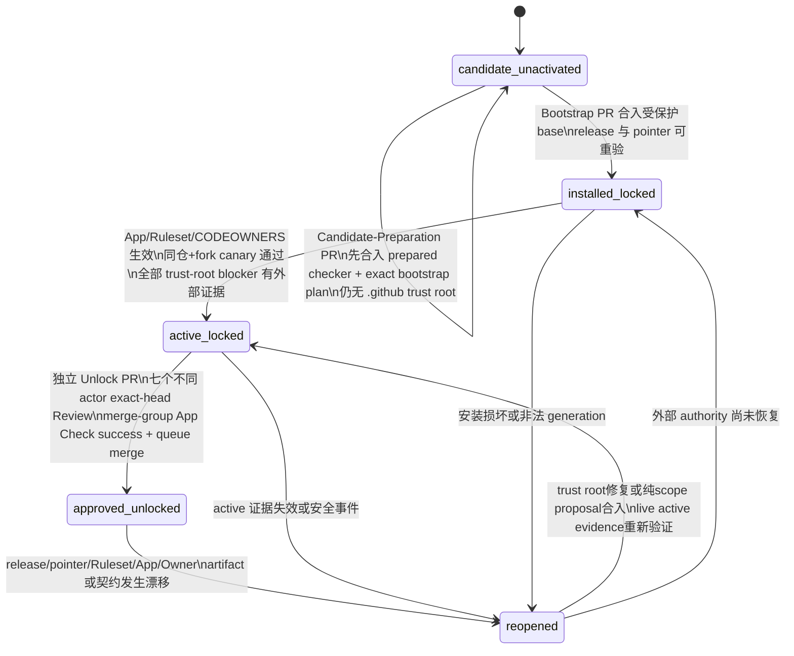
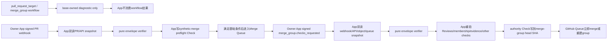

# W2 Smoke Governance Trust Root Release v1

> 状态：Draft / 未审核 / 未激活
>
> 文档版本：`w2.smoke.governance.trust_root_release.v1`
>
> 更新日期：2026-07-15
>
> 适用范围：`W2-S0-G0` Smoke Governance 校验器的版本化发布、信任根选择、generation handoff、Owner authority、远端 required check、回滚与恢复
>
> 不适用范围：生产 Agent Runtime、业务 HITL Approval、Graph Tool、Harness 实现、`SMK-004A` shadow parity 执行
>
> 当前基线：本文依据的唯一已提交 Smoke Governance 候选是 commit `997ba54e`；其状态为 `candidate_unactivated`
>
> 当前结论：仓库没有已激活的 Smoke Governance workflow、GitHub App authority、Ruleset、required check、active pointer 或 canary 证据；本文不创建这些对象，不批准 Harness 实现，也不解除任何 activation blocker。

关联文档：[W2-ADR-009](../cross-module/w2-adr-009-structured-smoke-harness-v1.md)、[Smoke Context 与 Scenario Registry 契约](w2-smoke-context-registry-contract-v1.md)、[W2-S0-G0 当前审批清单](approvals/w2-s0-g0/approval-manifest.json)、[Review Freeze Owner Authority](../agent/w2-review-freeze-owner-authority-v1.md)。

## 1. 当前事实与目标形态

### 1.1 当前事实

commit `997ba54e` 只建立了以下可审计候选：

- `agent/tests/smokegovernance/**` 中的本地 worktree 校验和显式 base/head commit object 校验入口；
- Draft ADR、Draft Context/Registry 契约、`SMK-004A` shadow baseline 与 `candidate_unactivated` 审批清单；
- 对 `smoke/**`、`test-adapters/**`、`deploy/local-smoke/**` 三个 canonical roots 的候选禁区校验；
- 对 Smoke Governance workflow 和 `.github/smoke-governance/**` 提前出现的候选拒绝逻辑。

这些能力没有远端执行者，也没有受保护 base 上的 release/pointer。开发机 `go test` 通过、PR head 自带测试通过、未提交工作区文件存在或文档写入“已激活”都不能形成远端 Gate。当前不得把状态表述为 `installed_locked`、`active_locked` 或 `approved/unlocked`。

截至2026-07-15，本worktree的`origin`为公开仓库`FigoGoo/Dora-Agent`，GitHub live metadata显示owner type为`User`。GitHub官方只向organization-owned public repository或使用GitHub Enterprise Cloud的organization-owned private repository提供Merge Queue，因此当前origin无法满足本文的核心边界。权威仓库迁移/指定完成前，即使本地完成全部代码，状态上限仍是`candidate_unactivated`；迁入organization并完成Bootstrap、但尚未满足本文Enterprise控制面与activation campaign时，上限才是`installed_locked`。任何App/Ruleset/pre-registration ID和bootstrap plan都必须等“权威repository迁入/指定为organization-owned”后重新读取并冻结，不能在迁移前先填占位值。[Managing a merge queue](https://docs.github.com/en/repositories/configuring-branches-and-merges-in-your-repository/configuring-pull-request-merges/managing-a-merge-queue)

后续只有两条合规路线：A）把权威开发/PR仓库转移到或重新指定为由GitHub Enterprise Cloud enterprise控制的Organization仓库，取得Enterprise administration可见性并配置七个不同human actor/team后，再完整实施本文严格v1；普通public Organization虽可用Merge Queue，但不能单独满足本文对enterprise-scope absence/inventory的证明，因此不是充分条件。B）另起不依赖Merge Queue/Enterprise Auditor的v2，重新提交七方governance决议，明确接受GitHub control plane/audit log或其他机制作为更窄信任根并同步修订当前approval manifest。B可以降低近期Smoke前置成本，但在新审批前不得暗中把它当作v1实现。

更关键的是，commit `997ba54e` 的 transition validator 会扫描 HEAD 全树，并无条件拒绝 `.github/smoke-governance/**` 与 `w2-smoke-governance*.yml|yaml`。因此它**不能直接校验或承载 Bootstrap PR**：若只新增 release/pointer/workflow，Bootstrap 后每个包含这些 base 路径的 HEAD 都会继续失败；若在同一 Bootstrap PR 放宽 checker，又由该 checker 接受自身变化，则形成自证。首次安装前必须先有一个仍保持 `candidate_unactivated` 的 Candidate-Preparation PR，把“未来一次性 Bootstrap 的 exact path/mode/raw digest”冻结到 base 计划，并先让能够消费该 base 计划的 checker 进入 base。

本文件本身不在当前 `approval-manifest.json` 的 `artifact_refs` 中，是一个未绑定 Draft。它不能改变当前清单的摘要、状态、`implementation_unlocked=false` 或十项 blocker exact-set。

### 1.2 目标形态

目标信任链由七个互相校验的来源组成：

1. 受保护 base 上不可变的 versioned release manifest 和 release 文件闭集；
2. 由上一代信任根授权、append-only 更新的 active pointer 与 handoff；
3. base-owned `pull_request_target` workflow，只把 PR Git objects 当不可信数据读取并封装为固定 Schema envelope，不 checkout 或执行 head；
4. 预构建 pure-envelope verifier artifact及candidate/protected-base双clean-build attestation；
5. 独立 Ruleset Auditor通过高权限可见性、只读API broker和HSM签名短TTL evidence证明完整effective-set与no-bypass；
6. 私有Owner Authority GitHub App重新核对七个不同Owner actor；PR synthetic merge SHA只形成queue preflight，最终仅在签名`merge_group.checks_requested`事件通过Queue唯一entry匹配双读证明时写固定名称authority Check；
7. Active Ruleset将required check source锁定到该App，启用strict、required review、CODEOWNERS与no-bypass；外部append-only ledger保存build/evaluation/unlock证据。

目标形态仍不把 GitHub Review 替代产品运行时 PostgreSQL HITL，也不允许 Smoke Harness 变成第四个生产 Runtime。

## 2. 威胁模型与强制不变量

### 2.1 信任边界

- PR head、synthetic merge tree、fork、same-repository feature branch、PR 标题/body/label、changed path、workflow input 和 artifact 一律是不可信输入。
- 只有已经进入受保护 base、其 raw digest 被 active pointer 绑定的 release 才能作为执行代码。
- base-owned workflow 可以读取 head 的 commit/tree/blob 对象；不得把 head/merge tree checkout 到执行工作目录，不得执行其中的 Go、Shell、JavaScript、Makefile、Action、依赖、Git hook、过滤器、submodule 或生成物。
- same-repository PR 与 fork PR 使用完全相同的 head 数据处理规则；仓库写权限不提升 PR head 的执行可信度。
- GitHub webhook 只负责唤醒。Owner App 每次 evaluation 都重新读取 PR、Review、membership、original base/head、preflight synthetic-merge或authority merge-group identity、active pointer和release，并取得 Ruleset Auditor刚从 live API生成的短 TTL签名 effective-rule evidence；任一 API/evidence不完整时失败关闭。
- 仓库 JSON 只表达请求、选择和摘要，不能自报外部 App 已安装、Ruleset 已生效、某 actor 已批准或某 canary 已通过。

### 2.2 不变量

1. Bootstrap 不能自证；首次信任根只能先安装为 locked，再由 merge 后的外部配置和 canary 证明 active。
2. trust-root 变更、正式 Unlock 和 Harness 实现不得出现在同一个 PR。
3. release manifest、pointer、handoff、authority request 都严格拒绝未知字段、重复 key、尾随值、非 UTF-8、未排序或重复数组。
4. 所有 commit SHA 使用 40 位 lowercase hex 并验证对象类型；所有内容摘要使用 `sha256:<64-lowercase-hex>` 并覆盖 raw bytes。
5. Action 只能使用审核过的完整 commit SHA；tag、branch、短 SHA 和 mutable container tag 全部拒绝。
6. verifier 只执行受信 base release 的预构建 artifact；不得在 privileged evaluation 中编译或运行 PR head。
7. PR synthetic-merge Check只决定能否进入Queue，不能直接合入；authoritative required Check只在完整Queue snapshot前后均证明恰好一个`AWAITING_CHECKS` entry与事件head/base、latest base、原PR head精确映射，pointer/release/request和全部live evidence稳定，且其他required checks已成功时写`success`。
8. 七个 Owner role 必须由七个不同的、当前仍合格的人类 numeric actor 覆盖；login、role 文本、URL 或一个 actor 的多次 Review 不增加 credit。
9. Ruleset 发现 bypass、source 漂移、required check 缺失或非 Active 时，计算状态最多为 `installed_locked` 或 `reopened`。
10. 旧 release 永不原地修改或删除；升级必须 `stage -> cutover -> retire`，回滚也通过新的 pointer generation 完成。
11. GitHub Check没有原生证据TTL；Merge Queue是防止长期PR success被直接复用的主边界，短lease/双路撤销是纵深防御。没有`merge_group.checks_requested`最终重验、single-run fencing和真实canary时Gate不得active。

## 3. 状态机

### 3.1 复合状态来源

状态不是某个可由 PR 作者填写的字符串，而是 base Git objects、App live state、受信 Ruleset 审计证据、canary 与 authority evaluation 的复合结论：



文档和 JSON 中使用展示值 `approved/unlocked`；机器枚举使用 `approved_unlocked`。

commit `997ba54e` 中的 `approval-manifest.json` v1 在 Candidate 阶段是当前候选清单；Candidate-Preparation 合入后，它转为不可变的**非权威候选基线**。其中 `candidate_unactivated` 表示“该文件本身没有激活权威”，十项 blocker 表示后续证据必须逐项覆盖的 requirement exact-set，不能解释为它能够否定已经由 protected-base release/pointer 与外部证据证明的 `installed_locked` 或 `active_locked`。其 `implementation_unlocked=false` 始终是硬上限：在独立 Unlock PR 的 manifest v2 投影、Owner Authority App evaluation 与 merge audit 全部完成前，复合状态不能超过 `active_locked`。

live state 的权威层级固定为：受保护 base 的 release/pointer/plan 原始字节确定“是否安装”；受信外部 ledger evidence、App/Ruleset live evaluation 与 canary 确定“是否 active”；最终 Unlock PR 的 raw digests、七方 exact-head Review、current authority Check、Queue merge audit和外部authority事件链确定“是否 approved/unlocked”。App必须取得两个独立witness一致的latest authority checkpoint；只有链尾是当前epoch的`unlock`、其后没有`reopen`，且每个release-bound subject component的current semantic cursor与class-specific evidence anchor仍等于或满足unlock绑定值时才是approved。routine成功取证只推进对应live/full component的`observation_sequence`，不得被误当授权漂移或替代immutable/persistent anchor；观测链必须连续、新鲜且能证明没有遗漏invalid/unknown transition。HEAD 中的状态字符串、Candidate v1、unlock payload、authority request 或 manifest v2 都只能表达边界/请求/投影，不能覆盖缺失的上层证据。

### 3.2 状态定义与允许动作

| 状态 | 必需事实 | 允许动作 | 明确禁止 |
| --- | --- | --- | --- |
| `candidate_unactivated` | 只有未激活候选；无远端 Gate；可包含先合入的 prepared checker/bootstrap plan | Candidate-Preparation、评审本文 | 直接从 `997ba54e` Bootstrap、Harness 实现、正式审批、声称远端 Gate |
| `installed_locked` | versioned release、pointer、workflow 已在受保护 base；摘要闭合 | 外部 App/Ruleset 配置、shadow/canary、修复安装 | Unlock、Harness、把自报 canary 当证据 |
| `active_locked` | App、Ruleset source lock/no-bypass、build closure、同仓/fork canary 全部有效 | 提交纯 Unlock PR并收集七方 Review | 同 PR 改 trust root 或实现 Harness |
| `approved/unlocked` | Unlock PR当前merge-group head SHA的App authority check成功，Queue独占证明成立并由Merge Queue合入；live trust root仍有效 | 后续独立实现 PR 按已批边界推进 | 扩大已批 exact-set、复用旧 Review、绕过 re-open |
| `reopened` | 任一 active/unlock 关键事实失效，或 approved 边界发生实质变化 | 受限修复、rekey、re-canary、新 authority request | 新实现、沿用旧 success、用 bypass 维持 Approved |

Candidate v1 比 live state 更保守不构成冲突；它若声称已安装、已激活或已解锁才属于越权。其余任何未知状态、缺少权威来源、同一权威层内摘要不一致，或低权威来源声称比高权威证据更宽松时，统一按 locked/reopened 处理。

## 4. 建议的信任根对象与路径

以下只是目标路径设计，本文不创建任何 `.github/**` 文件：

```text
.github/
├── CODEOWNERS
├── workflows/
│   └── w2-smoke-governance.yml
└── smoke-governance/
    ├── releases/
    │   ├── g0001/release-manifest.json
    │   └── g0002/release-manifest.json
    ├── active-pointer.json
    ├── authority-roots/
    │   └── a0001.json
    ├── handoffs/
    │   ├── releases/g0001-to-g0002.json
    │   └── authority/<authority-handoff-id>.json
    ├── authority-requests/
    │   └── W2-S0-G0/
    │       ├── <request-id>.payload.json
    │       └── <request-id>.request.json
    └── records/
        ├── release-failure/<release-id>.json
        ├── reopen/<incident-id>.json
        └── retire/<release-id>.json

docs/design/testing/approvals/w2-s0-g0/
├── approval-manifest.json
└── approval-manifests/<request-id>.json

external append-only ledger
├── protected-base-rebuild/<record-id>
├── activation/<series-id>/<record-sequence>
├── authority/W2-S0-G0/<record-sequence>
│   └── event_type=unlock|reopen
└── authority-checkpoints/W2-S0-G0/<witness-id>/<checkpoint-sequence>
```

`release-manifest.json`由其父目录generation固定且发布后不可修改；`active-pointer.json`每次变化都增加`pointer_generation`并绑定前一raw digest；handoff、request-specific projection、reopen、retire和外部authority event均append-only。`authority/<gate>`是单一CAS hash chain，不再把unlock与reopen放进互不排序的namespace；两个独立故障域witness各自只接受sequence严格加一且`previous_record_sha256`连续的签名checkpoint，并拒绝同sequence分叉或回退。若未来把外部record镜像回仓库，只能放在独立audit-only路径/PR且不参与授权。Git history不是删除旧generation、截断authority tail或覆盖旧projection的许可。

## 5. Versioned release manifest

### 5.1 职责

release manifest 冻结一个可复现 verifier release 的代码、workflow、Action、工具链、构建输入、预构建 artifact、Git-object policy、Check 名称和 canary policy。它不包含真实 Review 结果，也不自行声明 external activation。

### 5.2 顶层字段 exact-set

Schema 名为 `w2_smoke_governance_release.v1`。顶层 `required` 必须与 `properties` 完全相同，且 `additionalProperties=false`：

| 字段 | 规则 |
| --- | --- |
| `schema_version` | 精确为 `w2_smoke_governance_release.v1` |
| `release_id` | 精确匹配 `w2-sg-g[0-9]{4}`，与目录一致 |
| `generation` | 正整数，与 `release_id` 数字一致且相对上一代严格加一 |
| `candidate_baseline_commit_sha` | 设计该 release 前已经存在的受保护 base commit；初代精确绑定 `997ba54e`，避免依赖尚未知的 preparation/bootstrap commit |
| `supersedes_release_sha256` | 首代为空字符串；后续精确绑定上一 release manifest raw digest |
| `restores_release_sha256` | 普通发布为空；回滚reissue精确绑定要恢复其实现/artifact的历史release manifest raw digest |
| `bound_files` | 排序、无重复的 `{path,git_mode,raw_sha256,kind}` exact object 数组 |
| `workflow` | workflow 路径、raw digest、事件、权限、Action pins 与 runner policy |
| `validator` | Module/package/entrypoint、源码闭集、依赖闭集与 artifact digest |
| `toolchain` | Go archive、容器/runner、环境变量和构建命令闭集 |
| `git_object_policy` | head 只作数据、对象类型、mode、大小、路径和读取上限 |
| `governance_target` | repository/organization/enterprise scope inventory、effective ruleset/legacy protection exact-set与Merge Queue策略 |
| `authority_policy` | App、七方 role、distinct actor、Review/preflight/merge-group 绑定规则 |
| `required_checks` | 稳定 aggregate check 和 generation check 名称/source |
| `canary_policy` | same-repo/fork 必测 case exact-set 与 evidence Schema |
| `rollback_policy` | 可回退 release、pointer/handoff 前置条件和失败关闭规则 |

所有嵌套对象也必须 `required == properties`、`additionalProperties=false`。规范化 shape 如下；尖括号仅是设计占位，不是可提交实例：

```json
{
  "schema_version": "w2_smoke_governance_release.v1",
  "release_id": "w2-sg-g0001",
  "generation": 1,
  "candidate_baseline_commit_sha": "<full-40-lower-hex-of-997ba54e>",
  "supersedes_release_sha256": "",
  "restores_release_sha256": "",
  "bound_files": [
    {
      "path": "<repository-relative-path>",
      "git_mode": "100644",
      "raw_sha256": "sha256:<64-lower-hex>",
      "kind": "workflow"
    }
  ],
  "workflow": {
    "path": ".github/workflows/w2-smoke-governance.yml",
    "raw_sha256": "sha256:<64-lower-hex>",
    "role": "diagnostic_only_no_authority_input",
    "owner_app_consumes_workflow_result": false,
    "events": [
      {"name": "merge_group", "types": ["checks_requested"]},
      {"name": "pull_request_target", "types": ["opened", "ready_for_review", "reopened", "synchronize"]}
    ],
    "permissions": ["contents:read", "pull-requests:read"],
    "action_pins": [
      {
        "uses": "<owner/repository/path>",
        "commit_sha": "<40-lower-hex>",
        "source_repository_id": "<positive-numeric-id>"
      }
    ],
    "runner_policy": "w2_smoke_governance_ephemeral_runner.v1"
  },
  "validator": {
    "module": "agent",
    "package": "./tests/smokegovernance/releasev1/cmd",
    "library_package": "./tests/smokegovernance/releasev1",
    "entrypoint": "main",
    "source_files": ["<sorted-exact-source-path>"],
    "source_tree_sha256": "sha256:<64-lower-hex>",
    "go_mod_sha256": "sha256:<64-lower-hex>",
    "go_sum_sha256": "sha256:<64-lower-hex>",
    "vendor_policy": "forbidden",
    "dependency_closure": {
      "schema_version": "w2_smoke_governance_dependency_lock.v1",
      "lock_artifact_uri": "<immutable-release-dependency-lock-uri>",
      "lock_artifact_sha256": "sha256:<64-lower-hex>",
      "go_list_export_sha256": "sha256:<64-lower-hex>",
      "compile_attestation_policy_sha256": "sha256:<64-lower-hex>",
      "stdlib_packages": ["<sorted-build-selected-stdlib-import-path>"],
      "external_modules": [
        {
          "module_path": "<module-path>",
          "version": "<exact-version>",
          "zip_raw_sha256": "sha256:<64-lower-hex>",
          "module_h1": "h1:<base64>",
          "go_mod_raw_sha256": "sha256:<64-lower-hex>",
          "go_mod_h1": "h1:<base64>",
          "selected_packages": [
            {
              "import_path": "<import-path>",
              "source_files": [
                {"path": "<module-relative-path>", "raw_sha256": "sha256:<64-lower-hex>"}
              ]
            }
          ]
        }
      ]
    },
    "artifact_uri": "<immutable-release-artifact-uri>",
    "artifact_sha256": "sha256:<64-lower-hex>",
    "sbom_sha256": "sha256:<64-lower-hex>",
    "input_protocol": {
      "schema_version": "w2_smoke_governance_object_envelope.v1",
      "path": "/input/envelope.json",
      "encoding": "strict-json-with-base64-raw-blobs",
      "digest_algorithm": "sha256-raw-bytes",
      "max_bytes": 16777216
    },
    "output_protocol": {
      "schema_version": "w2_smoke_governance_evaluation_result.v1",
      "path": "/output/result.json",
      "digest_algorithm": "sha256-raw-bytes",
      "max_bytes": 1048576
    },
    "requires_git_binary": false,
    "requires_repository_checkout": false,
    "input_from_environment": false
  },
  "toolchain": {
    "go_version": "1.26.3",
    "go_archive_sha256": "sha256:<64-lower-hex>",
    "builder_image_digest": "sha256:<64-lower-hex>",
    "runtime_image_digest": "sha256:<64-lower-hex>",
    "sandbox_launcher_digest": "sha256:<64-lower-hex>",
    "runtime_sandbox_policy_sha256": "sha256:<64-lower-hex>",
    "sandbox_attestation_policy_sha256": "sha256:<64-lower-hex>",
    "sbom_generator_version": "<immutable-version>",
    "sbom_generator_digest": "sha256:<64-lower-hex>",
    "build_command": ["go", "build", "-trimpath", "-buildvcs=false", "-ldflags=-buildid=", "-o", "/out/w2-smoke-governance-verifier", "./tests/smokegovernance/releasev1/cmd"],
    "build_working_directory": "/workspace/agent",
    "build_umask": "0022",
    "build_environment": ["CGO_ENABLED=0", "GOARCH=amd64", "GOAMD64=v1", "GOCACHE=/gocache", "GODEBUG=", "GOENV=off", "GOEXPERIMENT=", "GOFLAGS=", "GOMODCACHE=/gomodcache", "GOOS=linux", "GOPROXY=off", "GOSUMDB=off", "GOTOOLCHAIN=local", "GOWORK=off", "HOME=/nonexistent", "LANG=C", "LC_ALL=C", "TMPDIR=/tmp", "TZ=UTC"],
    "runtime_command": ["/opt/w2/w2-smoke-governance-verifier"],
    "runtime_working_directory": "/work",
    "runtime_environment": ["HOME=/nonexistent", "LANG=C", "LC_ALL=C", "TMPDIR=/tmp", "TZ=UTC"],
    "fetch_network_policy": "allow_exact_h1_module_zip_then_close",
    "build_network_policy": "deny",
    "runtime_network_policy": "deny",
    "runner_attestation_policy": "w2_smoke_governance_runner_attestation.v1"
  },
  "git_object_policy": {
    "object_format": "sha1",
    "transport_schema_version": "w2_github_object_snapshot.v1",
    "commit_transport": "rest_structured_projection_with_response_digest",
    "tree_transport": "rest_non_recursive_complete_projection_with_response_digest",
    "blob_transport": "rest_raw_bytes_recompute_oid",
    "http_accept_encoding": "identity",
    "http_entity_digest_policy": "transfer_decoded_identity_entity_body_sha256_v1",
    "commit_oid_assurance": "github_reported_oid_plus_stable_double_read",
    "tree_oid_assurance": "github_reported_oid_plus_complete_stable_double_read",
    "blob_oid_assurance": "recomputed_git_blob_sha1",
    "head_treatment": "untrusted_data_only",
    "allowed_object_types": ["blob", "commit", "tree"],
    "allowed_git_modes": ["100644", "100755"],
    "forbidden_git_modes": ["120000", "160000"],
    "path_policy_version": "w2_smoke_governance_path_policy.v1",
    "max_changed_files": 1000,
    "max_blob_bytes": 1048576,
    "max_commit_objects": 8,
    "max_tree_objects": 4096,
    "max_tree_entries": 50000,
    "max_tree_depth": 64,
    "max_total_blob_bytes": 8388608,
    "max_http_response_bytes": 4194304,
    "max_total_http_bytes": 67108864,
    "max_envelope_bytes": 16777216,
    "max_rest_pages_per_collection": 100,
    "max_graphql_pages_per_collection": 100,
    "max_queue_entries_examined": 1000,
    "max_api_calls": 10000,
    "adapter_deadline_milliseconds": 60000,
    "max_stability_retries": 2,
    "max_output_bytes": 1048576,
    "checkout_head": false,
    "execute_head": false
  },
  "governance_target": {
    "canonical_policy_schema_version": "w2_github_ruleset_policy_projection.v1",
    "repository_id": "<positive-numeric-repository-id>",
    "organization_id": "<positive-numeric-organization-id>",
    "base_ref": "refs/heads/main",
    "enterprise_scope": {
      "mode": "<absent_verified-or-bound>",
      "enterprise_id": "<empty-or-positive-numeric-enterprise-id>",
      "inventory_attestation_policy_sha256": "sha256:<64-lower-hex>"
    },
    "expected_rulesets": [
      {
        "scope": "<repository-or-organization-or-enterprise>",
        "owner_id": "<positive-numeric-scope-owner-id>",
        "ruleset_id": "<positive-numeric-ruleset-id>",
        "target": "branch",
        "ref_name": "refs/heads/main",
        "lifecycle": "<preexisting_active-or-prepared_disabled_to_active>",
        "owns_merge_queue": "<true-only-for-the-prepared-repository-ruleset>",
        "prepared_enforcement": "<active-or-disabled-by-lifecycle>",
        "prepared_canonical_policy_sha256": "sha256:<64-lower-hex>",
        "active_enforcement": "active",
        "active_canonical_policy_sha256": "sha256:<64-lower-hex>",
        "activation_patch_sha256": "<empty-or-sha256:64-lower-hex-by-lifecycle>"
      }
    ],
    "legacy_branch_protection": {
      "mode": "<absent_verified-or-bound>",
      "canonical_policy_schema_version": "w2_github_legacy_branch_protection_projection.v1",
      "canonical_policy_sha256": "<empty-or-sha256:64-lower-hex>"
    },
    "merge_queue": {
      "required": true,
      "owning_repository_ruleset_id": "<positive-numeric-ruleset-id>",
      "github_parameters": {
        "check_response_timeout_minutes": 5,
        "grouping_strategy": "ALLGREEN",
        "max_entries_to_build": 1,
        "max_entries_to_merge": 1,
        "merge_method": "MERGE",
        "min_entries_to_merge": 1,
        "min_entries_to_merge_wait_minutes": 1
      },
      "authority_live_policy": {
        "authoritative_event": "merge_group.checks_requested",
        "identity_algorithm": "w2_merge_queue_unique_entry_match.v1",
        "require_complete_paginated_queue_snapshot": true,
        "require_exactly_one_matching_entry": true,
        "required_entry_state": "AWAITING_CHECKS",
        "require_entry_head_equals_event_head": true,
        "require_entry_base_equals_event_base": true,
        "require_entry_base_equals_latest_base": true,
        "require_pr_head_equals_review_head": true,
        "require_double_read_queue_entry_snapshot": true,
        "require_third_lightweight_read_before_success": true
      }
    },
    "mutation_control_policy_sha256": "sha256:<64-lower-hex>"
  },
  "authority_policy": {
    "authority_root_series_id": "w2-smoke-governance/authority-root/v1",
    "bootstrap_authority_root_path": ".github/smoke-governance/authority-roots/a0001.json",
    "bootstrap_authority_root_sha256": "sha256:<64-lower-hex>",
    "authority_rekey_policy_sha256": "sha256:<64-lower-hex>",
    "owner_authority_app": {
      "github_app_id": "<positive-numeric-owner-authority-app-id>",
      "installation_id": "<positive-numeric-installation-id>",
      "installation_account_id": "<same-positive-numeric-organization-id>",
      "permission_and_event_policy_sha256": "sha256:<64-lower-hex>",
      "api_broker_policy_sha256": "sha256:<64-lower-hex>",
      "installation_token_issuer_policy_sha256": "sha256:<64-lower-hex>",
      "runtime_attestation_policy_sha256": "sha256:<64-lower-hex>",
      "live_attestation_issuer_app_id": "<different-positive-numeric-auditor-app-id>",
      "live_attestation_key_ids": ["<sorted-allowlisted-key-version>"]
    },
    "evaluation_clock": {
      "schema_version": "w2_smoke_governance_evaluation_clock_attestation.v1",
      "schema_path": ".github/smoke-governance/schemas/evaluation-clock-attestation-v1.schema.json",
      "schema_raw_sha256": "sha256:<64-lower-hex>",
      "series_id": "w2-smoke-governance/evaluation-clock/v1",
      "policy_sha256": "sha256:<64-lower-hex>",
      "issuer_app_id": "<positive-numeric-owner-authority-app-id>",
      "issuer_key_ids": ["<sorted-allowlisted-key-version>"],
      "checkpoint_policy_sha256": "sha256:<64-lower-hex>",
      "maximum_uncertainty_milliseconds": 1000
    },
    "github_api_contract": {
      "rest_api_version": "<reviewed-supported-api-version>",
      "accept": "application/vnd.github+json",
      "graphql_query_sha256": "sha256:<64-lower-hex>",
      "graphql_variables_schema_sha256": "sha256:<64-lower-hex>",
      "graphql_response_projection_schema_sha256": "sha256:<64-lower-hex>",
      "required_fields_semantics_canary_policy_sha256": "sha256:<64-lower-hex>"
    },
    "owner_role_policy": {
      "schema_version": "w2_smoke_governance_owner_role_policy.v1",
      "path": ".github/smoke-governance/policies/owner-role-policy.json",
      "raw_sha256": "sha256:<64-lower-hex>",
      "projection_sha256": "sha256:<64-lower-hex>",
      "eligibility_epoch_series_id": "w2-smoke-governance/owner-eligibility/v1",
      "required_eligibility_semantic_epoch": 1,
      "matching_algorithm": "lexicographically_minimal_perfect_matching_v1"
    },
    "activation_evidence_policy": {
      "schema_version": "w2_smoke_governance_activation_evidence_policy.v1",
      "path": ".github/smoke-governance/policies/activation-evidence-policy.json",
      "raw_sha256": "sha256:<64-lower-hex>",
      "connector_policy_sha256": "sha256:<64-lower-hex>"
    },
    "component_ledger_schemas": {
      "subject_observation": {
        "schema_version": "w2_smoke_governance_subject_observation.v1",
        "path": ".github/smoke-governance/schemas/subject-observation-v1.schema.json",
        "raw_sha256": "sha256:<64-lower-hex>"
      },
      "base_revalidation": {
        "schema_version": "w2_smoke_governance_base_revalidation.v1",
        "path": ".github/smoke-governance/schemas/base-revalidation-v1.schema.json",
        "raw_sha256": "sha256:<64-lower-hex>"
      },
      "subject_semantic_transition": {
        "schema_version": "w2_smoke_governance_subject_semantic_transition.v1",
        "path": ".github/smoke-governance/schemas/subject-semantic-transition-v1.schema.json",
        "raw_sha256": "sha256:<64-lower-hex>"
      },
      "witness_checkpoint_set": {
        "schema_version": "w2_smoke_governance_witness_checkpoint_set.v1",
        "path": ".github/smoke-governance/schemas/witness-checkpoint-set-v1.schema.json",
        "raw_sha256": "sha256:<64-lower-hex>"
      },
      "component_head_snapshot": {
        "schema_version": "w2_smoke_governance_component_head_snapshot.v1",
        "path": ".github/smoke-governance/schemas/component-head-snapshot-v1.schema.json",
        "raw_sha256": "sha256:<64-lower-hex>"
      },
      "third_read_component_head_proof_set": {
        "schema_version": "w2_smoke_governance_third_read_component_head_proof_set.v1",
        "path": ".github/smoke-governance/schemas/third-read-component-head-proof-set-v1.schema.json",
        "raw_sha256": "sha256:<64-lower-hex>"
      }
    },
    "evaluation_subject_policy": {
      "schema_version": "w2_smoke_governance_evaluation_subject_policy.v1",
      "path": ".github/smoke-governance/policies/evaluation-subject-policy.json",
      "raw_sha256": "sha256:<64-lower-hex>",
      "allowed_kinds": ["activation_canary", "approval_scope_transition", "approved_implementation", "ordinary_unrelated", "trust_root_transition", "unlock_request"]
    },
    "authority_decision_series_id": "w2-smoke-governance/authority/W2-S0-G0/v1",
    "authority_ledger_policy_sha256": "sha256:<64-lower-hex>",
    "authority_empty_head_sentinel_schema": {
      "schema_version": "w2_smoke_governance_authority_empty_head_sentinel.v1",
      "path": ".github/smoke-governance/schemas/authority-empty-head-sentinel-v1.schema.json",
      "raw_sha256": "sha256:<64-lower-hex>"
    },
    "authority_checkpoint_policy_sha256": "sha256:<64-lower-hex>",
    "authority_witnesses": [
      {
        "witness_id": "<stable-witness-id>",
        "issuer_app_id": "<positive-numeric-witness-app-id>",
        "key_ids": ["<sorted-allowlisted-key-version>"]
      }
    ],
    "authority_witness_quorum": "all_bound_witnesses_minimum_two",
    "checkpoint_max_signing_window_seconds": 30,
    "ruleset_auditor_policy_sha256": "sha256:<64-lower-hex>",
    "ruleset_auditor_issuers": [
      {
        "scope": "<repository-or-organization-or-enterprise-inventory>",
        "app_id": "<different-positive-numeric-app-id>",
        "key_ids": ["<sorted-allowlisted-key-version>"]
      }
    ],
    "ruleset_evidence_ledger_namespace": "w2-smoke-governance/ruleset/v1",
    "ruleset_evidence_max_age_seconds": 300,
    "repository_id": "<positive-numeric-repository-id>",
    "organization_id": "<positive-numeric-organization-id>",
    "actor_credit_mode": "distinct_actor_per_role",
    "required_owner_roles": [
      "agent_owner",
      "business_owner",
      "frontend_owner",
      "operations_owner",
      "security_owner",
      "test_owner",
      "worker_owner"
    ],
    "review_binding": "current_pr_head_sha",
    "preflight_check_binding": "current_synthetic_merge_sha",
    "authoritative_check_binding": "current_merge_group_head_sha"
  },
  "required_checks": {
    "aggregate_name": "w2-smoke-governance",
    "generation_name": "w2-smoke-governance/g0001",
    "aggregate_required_by_ruleset": true,
    "generation_check_required_by_ruleset": false,
    "expected_source_app_id": "<same-owner-authority-app-id>",
    "other_required_checks_derivation": "effective_ruleset_required_set_minus_stable_aggregate",
    "other_required_checks": [
      {"name": "<required-check-name>", "expected_source_app_id": "<positive-numeric-app-id>", "required_conclusion": "success"}
    ],
    "check_dependency_dag_sha256": "sha256:<64-lower-hex>",
    "check_dependency_dag_must_be_acyclic": true,
    "external_id_scheme": "w2-smoke-governance-check-identity.v1",
    "single_live_run_per_source_name_sha": true,
    "success_conclusion": "success",
    "failure_conclusion": "failure",
    "neutral_and_skipped_forbidden_by_app_policy": true
  },
  "canary_policy": {
    "schema_version": "w2_smoke_governance_canary_policy.v1",
    "activation_campaign_schema_version": "w2_smoke_governance_activation_campaign.v1",
    "activation_marker_root": "docs/design/testing/approvals/w2-s0-g0/activation-canary-markers/",
    "bootstrap_temporarily_missing_blockers": ["FORK_CANARY_NOT_PASSED", "OWNER_AUTHORITY_NOT_ACTIVE", "SAME_REPO_CANARY_NOT_PASSED"],
    "same_repository_cases": ["<sorted-case-id>"],
    "fork_cases": ["<sorted-case-id>"],
    "minimum_consecutive_passes": 2,
    "evidence_schema": {
      "schema_version": "w2_smoke_governance_canary_evidence.v1",
      "path": ".github/smoke-governance/schemas/canary-evidence-v1.schema.json",
      "raw_sha256": "sha256:<64-lower-hex>"
    },
    "finalization_schema": {
      "schema_version": "w2_smoke_governance_activation_finalization.v1",
      "path": ".github/smoke-governance/schemas/activation-finalization-v1.schema.json",
      "raw_sha256": "sha256:<64-lower-hex>"
    },
    "finalization_series_id": "w2-smoke-governance/activation-finalization/v1",
    "trigger_counter_policy": {
      "schema_version": "w2_smoke_governance_canary_trigger_counter_set.v1",
      "schema_path": ".github/smoke-governance/schemas/canary-trigger-counter-set-v1.schema.json",
      "schema_raw_sha256": "sha256:<64-lower-hex>",
      "series_id": "w2-smoke-governance/canary-trigger-counter/v1",
      "issuer_app_id": "<positive-numeric-platform-observer-app-id>",
      "issuer_key_policy_sha256": "sha256:<64-lower-hex>",
      "checkpoint_policy_sha256": "sha256:<64-lower-hex>"
    },
    "finalize_three_blockers_atomically": true
  },
  "rollback_policy": {
    "previous_release_id": "",
    "previous_release_sha256": "",
    "restores_release_id": "",
    "restores_release_sha256": "",
    "requires_reissued_release_generation": true,
    "requires_new_pointer_generation": true,
    "requires_handoff_record": true,
    "preserve_failed_release": true
  }
}
```

release manifest 不把自身列入 `bound_files`，也不填写“包含自己的 commit SHA”；`bound_files` 还明确禁止反向包含 active pointer、bootstrap plan、handoff、authority request、unlock/reopen/retire record。active pointer 以 raw SHA256 绑定 manifest，App 在 evaluation 中另行记录实际承载它的 protected-base commit。`candidate_baseline_commit_sha` 只绑定设计开始前已经存在的 base；初代使用 commit `997ba54e` 的完整 40 位 SHA，后续 generation 使用 Stage 开始前的 active-base SHA，从而使 Candidate-Preparation 能在自己 merge 前算出目标 release raw digest，避免内容与未来 commit ID 循环自引用。

初代release的`previous_release_*`、`supersedes_release_sha256`和`restores_release_sha256`为空；普通后续release只填supersedes/previous；rollback reissue还必须填写restores并证明实现/artifact与历史release精确等价。数值ID在正式Schema中是正整数，示例使用字符串只为避免虚构真实身份。

`governance_target.expected_rulesets`按`scope/owner_id/ruleset_id`排序且无重复，完整列出作用于`refs/heads/main`的repository/organization/enterprise inventory exact-set；Auditor live inventory必须与其相等。所有prepared/active摘要都计算自`w2_github_ruleset_policy_projection.v1`，不是GitHub响应raw bytes：projection exact-set为Schema、numeric ruleset/scope-owner/source ID、name、target、enforcement、ref/repository conditions、排序后的bypass actor exact-set、排序后的typed rule/parameter exact-set和Merge Queue七参数；递归拒绝未知/重复/null。它明确排除`node_id`、`created_at`、`updated_at`、`_links`、ETag和响应字段顺序等server metadata。Auditor evidence另行绑定HTTP raw response digest、ETag/`updated_at`、API version与projection digest，使“语义目标”和“本次观测”不混为同一摘要。

`legacy_branch_protection.mode=bound`时，`w2_github_legacy_branch_protection_projection.v1`固定base ref、required status checks/source/strict、required reviews/Code Owner/dismissal、conversation resolution、admin enforcement、push restrictions、force-push/deletion/lock和merge method等语义字段exact-set，排除URL、node ID、时间、调用方权限投影及其他server metadata；HTTP entity digest、ETag/`updated_at`只进入live observation。`absent_verified`时canonical digest为空，但Auditor仍必须以release-bound endpoint和权限证明404/empty inventory，不能把不可见当不存在。

现有上层或repository active policy使用`lifecycle=preexisting_active`：prepared/active enforcement都为`active`、两个projection digest相同且activation patch为空。恰好一个repository-scoped目标使用`lifecycle=prepared_disabled_to_active`并在Candidate plan冻结前以同一numeric ID和`disabled` enforcement外部预创建：`prepared_canonical_policy_sha256`绑定实际disabled projection，`active_canonical_policy_sha256`绑定只把enforcement切为active后的目标projection。非空`activation_patch_sha256`绑定versioned canonical mutation envelope（固定method、numeric endpoint、REST API version、Accept、prepared projection digest和exact request body）；只允许`disabled -> active`。它也是唯一`owns_merge_queue=true`且ID等于`owning_repository_ruleset_id`的条目。mutation controller在PATCH前后双读prepared/active projection和server metadata；若平台无可用CAS precondition，双读间任何ETag/`updated_at`变化都使激活失败且不得重试旧patch。GitHub不支持用organization Ruleset承载Require Merge Queue，不能把上层Ruleset当作替代。任何preexisting policy在plan冻结后漂移都使plan作废并重新Preparation，不能把其变化塞进activation patch。

`enterprise_scope=absent_verified`要求外部scope-inventory attestation，`bound`要求非空numeric enterprise ID和对应ruleset；legacy branch protection同样只能是可证明absent或绑定canonical digest。`github_parameters`逐字段对应GitHub REST/GraphQL Merge Queue配置；其中merge limits只控制检查通过后的base merge batching，并不证明事件对应哪一项。v1采用保守的unique-entry match：authority evaluation前后都在release-bound资源上限内完整分页Queue，要求恰好一个entry同时满足`state=AWAITING_CHECKS`、entry head=事件head、entry base=事件base=本次latest protected base、PR identity/head=Review-bound request；队列可有其他entry，但不能有第二个匹配项。后续entry若以先前synthetic head为base，在base前进并收到fresh事件前不得授权。写success前再做第三次轻量读取。双PR/jump/rebuild canary若不能证明该映射稳定，或出现匹配歧义/同SHA旧success复用，Gate保持locked；不能把merge limits或commit parent shape误当成员证明。Merge Queue参数、mutation-control policy与这些inventory字段都属于handoff/rekey边界，不能在active release外热改。[REST API endpoints for rules](https://docs.github.com/en/rest/repos/rules) [GraphQL MergeQueueEntry](https://docs.github.com/en/graphql/reference/pulls#mergequeueentry)

`owner_role_policy`绑定的raw文件与canonical projection必须逐字节可重验。projection为七个固定role各自的排序numeric user ID exact-set、排序numeric team ID exact-set、最低repository permission、`human_only=true`、PR author/latest pusher deny规则以及organization/repository subject；login、team slug和显示名仅作诊断。`required_eligibility_semantic_epoch`必须等于该policy激活时由`eligibility_epoch_series_id`双witness确认的语义epoch。role policy、team membership、actor active状态或repository permission任何影响资格的变化都先推进该epoch并append `reopen`；恢复原成员列表也不能复用旧epoch。下一次接受Reviews前必须用新release和7.3 authority handoff绑定新的exact policy/epoch，不能在运行时自由解释“谁算Owner”。

`activation_evidence_policy`完整列出十项blocker各自允许的Schema、series namespace/ID、issuer App/key policy、subject projection、connector、semantic cursor算法和按subject component拆分的freshness requirements。每个requirement按`subject_component_id`排序并选择以下strict tagged union之一：

- `live_control_plane` exact-set为`{class,maximum_age_seconds,required_live_revalidation}`，只用于Ruleset、App installation/permission/event、broker/runtime等会原地变化的live配置；`maximum_age_seconds`由release逐subject固定，Ruleset/Auditor v1上限仍为300秒；
- `immutable_base_revalidation` exact-set为`{class,revalidate_from_protected_base_each_evaluation}`，用于release、pointer、workflow、source/build closure等受保护base对象；它没有短TTL，每次evaluation都从本次base Git objects重新验raw bytes、mode和digest；
- `persistent_finalization` exact-set为`{class,finalization_record_is_persistent,semantic_cursor_revalidation_required}`，用于activation campaign双witness finalization；结论不会每五分钟重跑，但其连续ledger、current semantic cursor和依赖subject仍须重验，语义变化或continuity unknown必须reopen；
- `full_behavioral_canary` exact-set为`{class,maximum_age_seconds,retrigger_on}`，用于same-repo/fork/双PR/same-SHA等真实Queue行为矩阵；release绑定严格大于该release中全部`live_control_plane.maximum_age_seconds`的正整数窗口，v1的`retrigger_on`排序exact-set固定为`github_platform_semantics_change`、`governance_policy_change`和`merge_queue_configuration_change`。日常轻量canary observation只能在last full canary尚未过期时证明continuity，不能改变该full record的`valid_until`；到期或trigger发生必须重跑完整矩阵并写新full record。

同一blocker可以有多个component，例如Owner Authority同时引用persistent finalization、live App配置和full behavioral canary，但不能把其中一个fresh record当成其他component的替代。policy中每个blocker entry exact-set为`blocker_code,component_templates`；每个template exact-set为`subject_component_id,evidence_series_id,semantic_transition_series_id,evidence_schema_version,issuer_app_id,issuer_key_policy_sha256,ledger_namespace,subject,freshness_policy,semantic_cursor_algorithm`，按component ID排序。`subject`只含稳定repository/gate/kind/id/raw-policy digest，不含本次generation/state。`semantic_transition_series_id`在全部component中必须唯一；`evidence_series_id`对live/immutable/full component同样唯一，只有被同一activation finalization record原子覆盖的persistent components可共同等于release `finalization_series_id`。release的`component_ledger_schemas`逐raw digest绑定observation、base revalidation、semantic transition、通用witness checkpoint set、component head snapshot和third-read head proof set六份正式Schema；component template的`evidence_schema_version`只能引用与其freshness class匹配的主evidence Schema，不能替换这些ledger Schema或自行声明同名版本。12.2 payload逐template复制这些稳定字段并增加本次`required_semantic_cursor`，不能由PR作者另选issuer、series、subject、freshness class或放宽窗口；动态record ID、raw digest、观测时间和full-canary固定到期点仍只进入evaluation与authority event。

`w2_smoke_governance_activation_finalization.v1`由release中`finalization_schema`绑定。record顶层exact-set固定为`schema_version,gate_id,repository_id,campaign_id,campaign_policy_sha256,ledger_namespace,series_id,finalization_sequence,previous_finalization_sha256,finalized_components,case_evidence_set_sha256,full_canary_observation_set_sha256,trigger_counter_set_sha256,finalized_at,issuer_app_id,issuer_key_id,record_signature`，`series_id`必须等于release的`finalization_series_id`。`finalized_components`按`blocker_code/subject_component_id`排序，且exact元素为`blocker_code,subject_component_id,component_template_sha256,subject_sha256,evidence_series_id,finalized_state`；首轮必须恰好覆盖Owner Authority、same-repo、fork政策声明的全部persistent components，`finalized_state`只能为`valid`。finalization不含semantic generation/transition digest：先append并取得finalization raw digest，随后才生成`source_component_evidence_kind=finalization`的semantic transition，形成单向`case evidence -> finalization -> transition -> Unlock payload cursor`。case/full-canary摘要必须由campaign exact-set全部success raw evidence重算，partial或缺case不得finalize；record append后不可修改或覆盖。

Envelope不接受只有checkpoint digest的任何component或global governance证据。`w2_smoke_governance_witness_checkpoint_set.v1`顶层exact-set固定为`schema_version,gate_id,record_kind,checkpoint_purpose,record_sha256,ledger_namespace,ledger_series_id,ledger_sequence,proof_binding,witnesses`；`record_kind`只允许release policy声明的`activation_finalization|authority_decision|authority_rekey|base_revalidation|canary_trigger_counter|evaluation_clock|subject_observation|subject_semantic_transition`，`checkpoint_purpose`只允许`current_head|historical_source`。`ledger_sequence`必须按kind分别等于finalization sequence、authority record sequence（empty-head sentinel固定为0）、rekey/root generation、base revalidation generation、counter sequence、clock sequence、observation sequence或semantic generation；checkpoint set的`record_sha256`必须等于所携raw record或release-bound authority empty-head sentinel重算值。`ledger_series_id`按kind分别精确等于finalization/base/counter/clock/observation/transition raw record的`series_id`、release `authority_decision_series_id`或authority-root/rekey raw record的root series；namespace相同但series不同的component绝不共享head、sequence或checkpoint chain，连续性key固定为`(record_kind,ledger_namespace,ledger_series_id)`。

`proof_binding`按purpose选择strict union：`historical_source`只允许exact ``；`current_head`只允许`evaluation_current`或`operation_current`。`evaluation_current` exact-set为`kind,evaluation_stage,evaluation_id,repository_id,api_projection_sha256,git_object_snapshot_sha256,component_head_snapshot_sha256,clock_attestation_sha256`，stage只允许`full_snapshot|third_read`；`operation_current` exact-set为`kind,operation_id,repository_id,operation_nonce_sha256,operation_clock_attestation_sha256`，仅用于Bootstrap/rekey/authority append等非Envelope操作，其operation ID/nonce也由release-bound CAS series唯一派生、永久不可复用，并随同使用同一clock Schema且`evaluation_id=operation_id`签发的raw operation attestation验证。Envelope中的所有current proof必须为同一`evaluation_id/repository_id`的`full_snapshot`，绝不接受operation proof，并匹配首读API/Git/component-head snapshot及本次evaluation clock；第三读必须以同一evaluation ID、更高clock和`stage=third_read`重新签发，不能复用full-snapshot proof。`witnesses`按release-bound witness ID排序且至少两个，元素exact-set为`witness_id,checkpoint_sequence,previous_checkpoint_sha256,observed_record_sha256,observed_at,issuer_app_id,issuer_key_id,signature`，signature覆盖外层kind/purpose/namespace/series/ledger sequence/record digest、完整proof binding和本元素前序。所有witness必须来自不同故障域并观察同一target raw digest/series/sequence；`current_head`各自断言该三元连续性key无更高record，且`observed_at`必须落在绑定clock的`evaluated_at - uncertainty`至`evaluated_at + checkpoint_max_signing_window_seconds + uncertainty`内。`historical_source`只允许三种用途：semantic transition明确引用的component source record、存在latest routine时其anchor full observation、或trigger-counter raw `source_evidence`明确引用的Queue semantic transition；第三种还必须让checkpoint series/sequence/digest逐项等于counter raw中的transition record并证明该record在counter生成时曾是连续head。旧evaluation、错误stage/series、缺raw proof/签名/前序checkpoint/必需current head、或任一分叉都失败。individual canary record使用release-bound`evidence_schema`，其14.3 exact-set与finalization引用的case digest算法必须一致，不能只靠`schema_version`字符串声明。

首次authority decision record尚未存在时不能用空digest自证。release-bound `w2_smoke_governance_authority_empty_head_sentinel.v1`顶层exact-set固定为`schema_version,domain_separator,gate_id,repository_id,series_id,authority_sequence,authority_epoch,latest_record_sha256`；`domain_separator`固定为`w2-smoke-governance-authority-empty-head/v1`，series必须等于`authority_decision_series_id`，sequence/epoch固定为0，latest digest固定为空。sentinel raw bytes只由active release绑定的domain/repository/gate/series及上述常量唯一派生，不含evaluation ID、issuer/key、签名或观测时间；同一release/series在首个record前的所有评价必须重算出完全相同的sentinel digest，因此`(authority_decision,ledger_namespace,series,sequence=0)`只有一个稳定identity。它只允许用于首个Unlock及此前locked/canary评价；App先完整查询空ledger并携带该稳定raw sentinel，随后两个witness以`record_kind=authority_decision,checkpoint_purpose=current_head,ledger_sequence=0`及本evaluation full-snapshot binding独立确认同一sentinel digest/series确实仍无record。评价新鲜性只来自本次checkpoint的`proof_binding`与witness签名，绝不能写回sentinel identity。已有任一authority record、非空latest、sentinel bytes不匹配release、旧evaluation checkpoint或任一witness看到非空head时立即拒绝；首个unlock append后该sentinel永久不可再用于此series，sequence 0出现第二个digest必须作为ledger fork失败关闭。

三项重触发输入不是App自报digest。release-bound `w2_smoke_governance_canary_trigger_counter_set.v1` record顶层exact-set为`schema_version,gate_id,repository_id,series_id,counter_sequence,previous_counter_set_sha256,counters,source_evidence,observed_at,issuer_app_id,issuer_key_id,record_signature`；`counters` exact-set为三个非负单调整数`github_platform_semantics_epoch,governance_policy_generation,merge_queue_configuration_generation`。`source_evidence` exact-set为`platform_semantics_canary_raw_base64,platform_semantics_canary_sha256,governance_policy_projection_raw_base64,governance_policy_projection_sha256,merge_queue_semantic_transition_raw_base64,merge_queue_semantic_transition_sha256,merge_queue_semantic_transition_checkpoint_set_raw_base64,merge_queue_semantic_transition_checkpoint_set_sha256`，每对raw/digest必须重算；record内transition checkpoint使用稳定的`record_kind=subject_semantic_transition/checkpoint_purpose=historical_source`证明counter生成时的source。每次Envelope另以该Queue component的evaluation-bound `current_head` transition proof与本次governance/API facts逐项比较；raw transition digest不同就要求counter推进，不能因record内旧proof曾是head而沿用旧counter。独立platform observer只在官方contract/required-field canary语义变化时推进platform epoch；base policy或Queue projection变化分别推进另外两项；恢复历史digest也必须推进，不能回退counter。每个counter record再连同本evaluation-bound`current_head` witness raw proof进入Envelope；verifier验签、验证previous/sequence/current三元series head并从三份raw source重算counter exact-set。平台变化通知可能延迟仍由full-canary最大窗口兜底；counter ledger不可读、source不完整或latest不可证明时立即失败，不能沿用旧full record。

`evaluation_subject_policy`以changed-path和base state确定唯一tagged kind，优先级固定为trust-root path → activation-canary marker → approval-bound artifact/versioned scope proposal → exact unlock request path → approved implementation scope → ordinary unrelated；匹配零个或多个kind都失败。它分别定义9.4每种kind必须读取的authority和Review来源，防止把Unlock PR的七方要求错误套到所有后续实现PR，也防止把trust-root/批准范围变更伪装成普通实现。

`canary_policy`预先冻结activation campaign的case DAG、唯一自举缺口、full behavioral canary窗口与重触发条件。Ruleset切为active后，普通/Unlock/implementation subject仍要求十项blocker全部valid；只有9.4 `activation_canary`可在其余七项已valid时暂时接受排序exact-set `{OWNER_AUTHORITY_NOT_ACTIVE,SAME_REPO_CANARY_NOT_PASSED,FORK_CANARY_NOT_PASSED}`尚未关闭。campaign marker只允许位于专用docs root、严格JSON且无执行语义；正例可经真实Queue合入，负例必须被拒绝并记录。全部case和连续次数完成后，由双witness单一finalization record原子把三项变为valid，不能逐项自报或把豁免带到其他purpose。该finalization是持久结论，不要求周期性重新制造marker；持续有效性由release-bound full-canary窗口、变化触发器和独立live-control-plane observations共同约束，routine observation不得把旧full canary滚动续期。

### 5.3 构建闭集

artifact 必须在 Candidate-Preparation 合入前就能被 bootstrap plan 绑定，因此构建分成两个互相校验的阶段，而不是声称“先绑定摘要、再从未来 base 首次构建”：

1. Candidate-Preparation 定稿时，从即将提交的 prepared checker/module exact source bytes 构建；两个完全隔离、cache 物理独立但内部路径相同的 clean builder 各构建一次，artifact 与 deterministic SBOM raw SHA256 必须逐字节相同，plan 才能冻结摘要。
2. Candidate-Preparation 合入后，无 PR authority token 的 protected-base builder 从 merge 后 base 重读同一 source/module/toolchain 闭集，再做两次 clean rebuild；四次结果必须与 plan 中 artifact/SBOM digest 完全相同。builder按 plan预绑定的 issuer/key/policy把实际 merge SHA与结果写入外部不可变 attestation ledger；Bootstrap动态消费该 record，plan本身不预填未来 record摘要。
3. Bootstrap PR 不编译任何 HEAD 内容，只安装 plan 已绑定的 artifact/release/workflow/pointer exact-set；evaluation 也只下载、核对摘要并在离线 sandbox 中执行该 artifact。

固定构建 argv 为 `go build -trimpath -buildvcs=false -ldflags=-buildid= -o /out/w2-smoke-governance-verifier ./tests/smokegovernance/releasev1/cmd`，cwd 为 `/workspace/agent`，umask 为 `0022`。builder image、Go archive和 SBOM generator 都按不可变 digest 固定；两个 builder 使用相同的逻辑路径，但分别挂载全新 `/gocache`、`/gomodcache` 与 `/tmp`。fetch 阶段只允许取得 `dependency_closure.external_modules` exact-set中的 module zip/go.mod，并同时校验 zip raw digest、module/go.mod h1和selected source；compile 阶段强制 `GOPROXY=off`、`GOSUMDB=off`且断网。初代release必须stdlib-only，`external_modules=[]`；未来若增加依赖，必须新generation/handoff，不能原地放宽。

环境 exact-set 至少包括 `CGO_ENABLED=0`、`GOOS=linux`、`GOARCH=amd64`、`GOAMD64=v1`、`GOEXPERIMENT=`、`GODEBUG=`、`GOENV=off`、`GOFLAGS=`、`GOTOOLCHAIN=local`、`GOWORK=off`、`GOCACHE=/gocache`、`GOMODCACHE=/gomodcache`、`TMPDIR=/tmp`、`HOME=/nonexistent`、`TZ=UTC`、`LC_ALL=C` 与 `LANG=C`。任何环境变量增删、继承宿主值或路径变化都使 attestation 失效。

当前 commit `997ba54e` 的 `TestW2S0G0TransitionGitV1FromObjects` 仍通过 `W2_*` 环境变量定位真实仓库并执行 `git`，只能作为 Candidate 本地/Git-object adapter，**不能直接成为 release artifact入口**。Candidate-Preparation 必须新增独立release-only library `agent/tests/smokegovernance/releasev1`和极薄command `releasev1/cmd`：library暴露纯`EvaluateEnvelopeV1(raw []byte)`，command只从固定`/input/envelope.json`读bytes、调用library并写固定`/output/result.json`。父级Candidate adapter改为构造同一envelope后调用该library，release library/cmd绝不反向import父包。

`go build` selected-source exact-set只允许release library/cmd的非测试Go文件；结构校验拒绝用户定义`init`、任何顶层`var`初始化、`TestMain`进入build工具链、blank/dot/cgo/embed/linkname，以及`os/exec`、`net*`、`plugin`、`syscall`、`unsafe`和任意同Module import（唯一例外是cmd精确import release library）。cmd不得解析flag/env/cwd/repository，所有path是manifest固定常量。父级Git adapter、其`os/exec`依赖及全部`*_test.go`都不进入artifact source/dependency/SBOM闭集。

envelope Schema严格拒绝未知/重复/null/尾随/非法UTF-8，并使用两个正交tag：`evaluation_phase=pr_preflight|merge_group_authority`和`evaluation_subject_kind=activation_canary|approval_scope_transition|approved_implementation|ordinary_unrelated|trust_root_transition|unlock_request`。公共字段只绑定repository/PR numeric identity、original base/head SHA、changed-path exact-set、active release/pointer与`w2_github_object_snapshot.v1`；subject-specific字段使用严格tagged union，不能让普通PR伪造request字段，也不能把trust-root变更塞入实现分支：

- `unlock_request` exact-set额外绑定payload/request/projection raw bytes及摘要、当前eligibility epoch和七方Review graph；只有该分支产生current-PR role credit和merge后unlock event。
- `activation_canary` exact-set额外绑定campaign/case policy、marker raw bytes、case predecessor evidence、当前temporarily-missing blocker exact-set和其余七项valid evidence；禁止request、trust-root、scope和implementation path。
- `approved_implementation` exact-set额外绑定base上latest witnessed unlock/checkpoint、其中的approved implementation policy raw bytes/digest、current authority semantics和current changed-path/schema projection；禁止当前PR含request、handoff或trust-root path。
- `approval_scope_transition` exact-set额外绑定旧latest unlock、scope-transition intent、reopen policy、只新增的versioned policy/design/contract artifact及old→new semantic diff；禁止request、trust-root和implementation path。它只让新候选范围进入base，不批准该范围；实际reopen只能在merge audit后产生。
- `trust_root_transition` exact-set额外绑定purpose=`release_stage|authority_rekey_preserved|authority_rekey_invalidating|recovery`、from/to release/root/pointer、release/authority handoff raw bytes和按purpose所需的witnessed reopen/rekey checkpoint；禁止implementation root。
- `ordinary_unrelated` exact-set只绑定latest live governance snapshot和current changed paths，要求与trust-root、unlock request、approved implementation roots的交集都为空；它不能改变任何W2批准边界。

output Schema重复两个tag并使用对应result union：unlock输出role credits/request digests；implementation输出base unlock digest/policy/范围证明；scope transition输出old/new artifact与witnessed reopen；trust-root transition输出handoff/reopen/rekey证明；unrelated输出disjoint-path证明。未知tag、混合字段、分类与release-bound `evaluation_subject_policy`不一致均失败。

对象snapshot是typed union，不能笼统声称REST返回所有Git raw object bytes：

- `commit_projection`只包含GitHub响应中的reported SHA、tree SHA、parent SHA有序列表和本次HTTP entity-body digest/API version。REST不提供原始commit object，verifier不尝试从author/message/signature JSON重建OID，也不依赖parent数量或顺序推断Queue成员；reported SHA↔projection关系是Owner App/GitHub API adapter的受信attestation边界。
- `tree_projection`按root/child tree SHA逐个使用non-recursive Get tree；每个响应必须`truncated=false`，条目按原path排序且exact-set为path/type/mode/reported SHA/size，递归闭合全部child tree并绑定每次HTTP entity-body digest。REST不提供原始tree bytes，verifier不重算tree OID；路径必须是release允许的严格UTF-8形式，否则失败。
- `blob_object`携带reported SHA、raw length/base64 bytes和HTTP entity-body digest；在固定`object_format=sha1`下，verifier必须重算`SHA1("blob "+decimal_length+NUL+raw)`并匹配reported SHA。未来支持SHA-256 repository必须新release/schema，不能自动猜测。

所有HTTP请求强制`Accept-Encoding: identity`；`http_entity_digest_policy`中的entity body指HTTP transfer decoding完成后、JSON/base64解析前的精确bytes，摘要同时绑定status、media type、API version和allowlisted response-header projection，不把chunk framing/TLS record当输入。commit/tree只接受GitHub reported OID并依赖受信adapter双读稳定性，blob额外本地重算Git blob OID，三者assurance不可混写。

verifier从base与target完整tree projections展平`path -> type/mode/SHA`映射并计算changed-path exact-set，要求每个引用存在、tree无重复/环/截断、所有变更blob raw bytes可验且mode/type合法。adapter在发请求、分页、递归或分配buffer**之前**执行manifest预算：commit/tree对象与entry数、tree深度、单/总blob、单/总HTTP entity、REST/GraphQL分页、API call、stability retry、deadline、envelope和输出任一达到上限或仍有next page即失败关闭；16MiB envelope不是adapter前置抓取的替代上限。preflight分支绑定current synthetic-merge commit projection；authority分支只绑定签名webhook公开的repository、head/base ref与SHA以及通过9.2 unique-entry match找到的唯一opaque Queue/Entry/PR Node ID，不使用官方未提供的merge-group ID、queue generation或constituent列表。Owner App在sandbox外按固定REST/GraphQL contract双读稳定snapshot，生成envelope raw bytes并计算`envelope_sha256`；manifest冻结Schema、endpoint、projection、预算和digest算法，动态response/evaluation digest只进入本次Check/authority event。[Git commits REST API](https://docs.github.com/en/rest/git/commits) [Git trees REST API](https://docs.github.com/en/rest/git/trees) [Git blobs REST API](https://docs.github.com/en/rest/git/blobs)

运行时 argv固定为 `/opt/w2/w2-smoke-governance-verifier`，cwd固定为只读/空的 `/work`，只有 `/input/envelope.json` 可读和 `/output/result.json` 可写；环境 exact-set、文件描述符、CPU/内存/时间/输出大小上限均由release固定。由`sandbox_launcher_digest`绑定的attested launcher以non-root UID/GID启动，drop全部capability、启用`no_new_privs`、只读rootfs、固定mount/PID/user/network namespace、固定rlimit/cgroup和无网络策略；runtime image只含launcher与verifier，不含Shell、Git或package manager。`runtime_sandbox_policy_sha256`与`sandbox_attestation_policy_sha256`绑定实际可观测配置和fail-closed attestation，不假设“主进程启动后拒绝execve”这一不可移植时序。verifier sandbox无仓库/object database checkout、credential/App token，也不把PR值拼入argv、路径、URL或环境变量。Candidate-Preparation必须用合成envelope证明父级Git adapter与release command/library对同一snapshot结果等价，并用“init/global side effect、缺对象、换digest、额外env、调用Git、越界base64/分页/路径”对抗失败关闭。

构建闭集至少还包括：

- 全部直接/间接 Go 源码、build-tag 选择、embed 输入、汇编/cgo/syso 输入；不适用项显式为空 exact-set；
- `agent/go.mod`、`agent/go.sum`、禁止 vendor 与禁止 local `replace` 的结论；
- dependency lock artifact本身的raw digest、`go list -deps -json`规范化输出摘要、stdlib package exact-set；每个外部module（初代必须为空）完整绑定path/version、zip raw SHA256、module/go.mod h1、go.mod raw digest、build-selected package/source exact-set与import graph；
- Go `1.26.3` archive raw digest、builder/runtime image digest和上述 build/runtime环境 exact-set；
- build/runtime command argv、cwd、umask、文件系统/网络能力、resource limit、artifact SHA256 和 deterministic SBOM digest；
- Action `uses` 的完整 commit SHA及其来源 repository numeric ID；
- workflow raw digest、runner group/ephemeral policy 与实际 runner image attestation。

`ubuntu-latest`、Action tag、运行时自动下载未知 toolchain、未绑定 vendor、单次/不可复现构建、从 head 编译 verifier或允许 PR 修改 build command，均不能关闭 `VALIDATOR_BUILD_CLOSURE_NOT_FROZEN`。

lock artifact URI与artifact registry namespace由release allowlist派生，不能来自PR URL。builder在fetch阶段从校验过的zip计算module h1而非信任manifest自报，再用锁定Go archive执行`go list`/typecheck/compile；selected source/import graph、compile attestation、artifact和SBOM必须共同匹配。只绑定`go.mod/go.sum`或只列import path都不构成dependency closure。

GitHub 官方安全指南说明，完整 commit SHA 是使用 Action 不可变发布的唯一方式，并建议 privileged workflow 不 checkout 不可信 PR 代码。[GitHub Actions secure use reference](https://docs.github.com/en/actions/reference/security/secure-use)

### 5.4 Envelope 与 Result 正式机器契约

Bootstrap必须把下列两份正式JSON Schema作为`target_files.kind=schema`安装，并由release `bound_files`绑定path/raw digest：

```text
.github/smoke-governance/schemas/object-envelope-v1.schema.json
.github/smoke-governance/schemas/evaluation-result-v1.schema.json
```

两份Schema自身使用JSON Schema draft、`required == properties`、递归`additionalProperties=false`和固定`$id`；运行时decoder还拒绝duplicate key、invalid UTF-8、尾随值、非整数数字、非canonical enum和未排序/重复数组。`w2_smoke_governance_object_envelope.v1`顶层字段exact-set为：

```text
schema_version
evaluation_id
evaluation_phase
evaluation_subject_kind
repository
pull_request
governance_snapshot
git_object_snapshot
changed_paths_exact
api_snapshot_pair
evaluation_clock
live_evidence
subject_input
```

公共嵌套exact-set如下：

| Object | Fields |
| --- | --- |
| `repository` | `repository_id,organization_id,installation_id,base_ref` |
| `pull_request` | `pr_node_id,pr_number,original_base_sha,original_head_sha,target_head_sha,event_base_sha`；Node ID为opaque string |
| `governance_snapshot` | `active_releases,active_pointer_raw_base64,active_pointer_sha256,authority_root_proof_sha256,global_head_evidence,ruleset_projection_sha256,evaluation_subject_policy_sha256`；release元素exact-set为`release_id,manifest_raw_base64,manifest_sha256`；global evidence在API projection外携带authority decision/root raw及本evaluation full-snapshot checkpoint proof |
| `git_object_snapshot` | `schema_version,commit_projections,tree_projections,blob_objects`；元素exact-set与5.3 transport定义一致且数组按OID/path排序，外层按`w2_github_object_snapshot_projection.v1`对该对象完整canonical bytes计算digest，不含任何自指`snapshot_sha256` |
| `api_snapshot_pair` | `rest_api_version,graphql_query_sha256,graphql_variables_schema_sha256,graphql_response_projection_schema_sha256,signed_webhook_observation_sha256,first_projection_raw_base64,first_projection_sha256,second_projection_raw_base64,second_projection_sha256,first_component_head_snapshot_raw_base64,first_component_head_snapshot_sha256,second_component_head_snapshot_raw_base64,second_component_head_snapshot_sha256,http_entity_digests`；两份API projection或两份component-head snapshot raw bytes不等时必须返回failure |
| `evaluation_clock` | `policy_sha256,attestation_raw_base64,attestation_sha256,witness_checkpoint_set_raw_base64,witness_checkpoint_set_sha256`；attestation必须由release-bound clock issuer在第一次完整snapshot后、第二次完整snapshot前签发，与本次`evaluation_id/repository`精确绑定，并由完整raw checkpoint proof证明是current ledger head |
| `live_evidence`元素 | 公共exact-set为`blocker_code,subject_component_id,freshness_class,component_template_sha256,subject_sha256,semantic_transition_raw_base64,semantic_transition_sha256,semantic_transition_checkpoint_set_raw_base64,semantic_transition_checkpoint_set_sha256,semantic_source_evidence_raw_base64,semantic_source_evidence_sha256,semantic_source_evidence_checkpoint_set_raw_base64,semantic_source_evidence_checkpoint_set_sha256,component_binding`，按`blocker_code/subject_component_id`排序；template digest只覆盖release policy中的稳定component template，不含12.2动态`required_semantic_cursor`，verifier从release raw policy重算；transition raw digest与`record_kind=subject_semantic_transition/checkpoint_purpose=current_head/proof_binding=evaluation_current(full_snapshot)`的raw proof必须证明本component本evaluation latest semantic head，其source raw/proof必须逐项命中transition引用的kind/series/sequence/digest并允许`historical_source`，不能由App自报 |

`governance_snapshot.global_head_evidence` exact-set为`authority_decision,authority_rekey`。`authority_decision`按链状态选择strict union：有record时exact为`kind=current_record,record_raw_base64,record_sha256,checkpoint_set_raw_base64,checkpoint_set_sha256`；首个record前exact为`kind=empty_head,empty_head_sentinel_raw_base64,empty_head_sentinel_sha256,checkpoint_set_raw_base64,checkpoint_set_sha256`。`authority_rekey` exact为`kind=current_root_or_rekey,record_raw_base64,record_sha256,checkpoint_set_raw_base64,checkpoint_set_sha256`，raw必须是bootstrap authority root或latest rekey record。两项checkpoint都必须是本evaluation `current_head/evaluation_current(full_snapshot)`，绝不接受append/rekey时的`operation_current`旧proof；raw identity进入下述head snapshot，checkpoint本身不进入API projection或snapshot，避免`API/head digest -> checkpoint proof_binding -> API/head digest`自引用。

`w2_smoke_governance_component_head_snapshot.v1`虽保留兼容名称，顶层exact-set扩展为`schema_version,evaluation_id,repository_id,global_heads,heads`。`global_heads`按`record_role`排序且恰好包含`authority_decision,authority_rekey`两项，元素exact-set为`record_role,record_kind,ledger_namespace,ledger_series_id,ledger_sequence,record_sha256`；decision的sequence/digest来自current raw event，或在首个event前来自release-bound稳定empty-head sentinel的`0/sentinel digest`，rekey项来自bootstrap root/latest rekey generation与raw digest。`heads`按`blocker_code/subject_component_id/record_role`排序且元素exact-set为`blocker_code,subject_component_id,record_role,record_kind,ledger_namespace,ledger_series_id,ledger_sequence,record_sha256`。每个component必须恰好有`semantic_transition`和`current_component_evidence`两项，full behavioral component再恰好有`canary_trigger_counter`；transition role的series必须等于template `semantic_transition_series_id`，current evidence role必须等于`evidence_series_id`，counter role必须等于release trigger series。role与record kind/freshness class映射固定，同component/role重复或遗漏均失败；跨component复用同一ledger key只允许persistent components共同引用同一finalization sequence/digest且raw `finalized_components` exact-set同时覆盖它们，或full components共同引用同一global trigger-counter sequence/digest，其他复用一律拒绝。

App先从所有connector完整读取首份raw snapshot，再取得evaluation clock与每个global/component head的evaluation-bound双witness proof，最后重新完整读取第二份；两份snapshot raw bytes必须逐字节相等。所有`proof_binding.kind=evaluation_current/evaluation_stage=full_snapshot`的`component_head_snapshot_sha256`必须等于首份摘要，且proof的role/kind/namespace/series/sequence/record digest逐项命中对应global或component head；这使不同component即使都从sequence 1开始也不能碰撞或互换，也使旧unlock/reopen/root operation checkpoint不能冒充本evaluation current head。

`component_binding`由`freshness_class`选择strict union，四个分支互不兼容：

| Freshness class | `component_binding` fields exact-set |
| --- | --- |
| `live_control_plane` | `class,evidence_series_id,observation_raw_base64,observation_sha256,observation_checkpoint_set_raw_base64,observation_checkpoint_set_sha256`；observation必须是本component latest `live_sample`，checkpoint以`record_kind=subject_observation`证明其latest head，且按policy maximum age fresh |
| `immutable_base_revalidation` | `class,evidence_series_id,base_revalidation_raw_base64,base_revalidation_sha256,base_revalidation_checkpoint_set_raw_base64,base_revalidation_checkpoint_set_sha256,base_commit_sha,git_object_snapshot_sha256,revalidated_object_set_sha256`；raw record/checkpoint必须是本次evaluation和base的latest `base_revalidation` head，object字段必须从本次Envelope重算；禁止observation/`valid_until`，当前revalidation projection必须等于latest transition state，否则必须先产生新transition |
| `persistent_finalization` | `class,evidence_series_id,finalization_record_raw_base64,finalization_record_sha256,finalization_checkpoint_set_raw_base64,finalization_checkpoint_set_sha256`；verifier按release-bound两份Schema解码record与`record_kind=activation_finalization`的latest完整witness proof，匹配本component且不应用短TTL |
| `full_behavioral_canary` | `class,evidence_series_id,full_observation_raw_base64,full_observation_sha256,full_observation_checkpoint_set_raw_base64,full_observation_checkpoint_set_sha256,routine_observation_raw_base64,routine_observation_sha256,routine_observation_checkpoint_set_raw_base64,routine_observation_checkpoint_set_sha256,trigger_counter_set_raw_base64,trigger_counter_set_sha256,trigger_counter_checkpoint_set_raw_base64,trigger_counter_checkpoint_set_sha256`；full observation固定`valid_until`并携带其双witness proof；routine四字段只能同时为空或同时存在，存在时其checkpoint证明latest observation head，否则full checkpoint证明latest head，routine不能改变full到期点 |

四个分支都由pure verifier按release-bound Schema解码raw record/checkpoint并匹配`blocker_code/subject_component_id/freshness_class/component_template_sha256/subject`；每个checkpoint的kind、purpose、namespace、series、sequence、record digest和至少两个release-bound witness必须与对应raw record逐项相等，所有current proof还必须绑定本次evaluation/full-snapshot head set/clock。verifier先从`semantic_source_evidence_*`重算latest transition的source kind/series/sequence/digest与semantic projection，再从`component_binding`重算本次latest class-specific evidence：二者可以是同一raw record，也可以是“历史transition source + 后续同语义current evidence”，后一种必须分别使用`historical_source`与本evaluation的`current_head` checkpoint，且current projection必须仍精确等于transition semantic state。class、component、series、anchor、head或deadline串用即失败。unlock分支另从payload raw bytes逐component核对`required_semantic_cursor`等于本次latest witnessed raw transition；post-unlock分支与latest witnessed unlock cursor核对。immutable分支从current raw base-revalidation对象表与本次Git snapshot重算object set；full分支必须从raw source evidence重算并以双witness证明latest trigger counter set，其raw digest必须等于last full observation绑定值，否则旧full record即使时间未到也失效。只提供任意digest、App摘要、旧evaluation checkpoint或不连续ledger一律拒绝。

`w2_smoke_governance_evaluation_clock_attestation.v1` raw record exact-set为`schema_version,repository_id,evaluation_id,series_id,clock_sequence,previous_attestation_sha256,evaluated_at,maximum_uncertainty_milliseconds,runtime_attestation_sha256,issuer_app_id,issuer_key_id,record_signature`，`series_id`必须等于release的evaluation clock series。clock sequence来自该外部CAS series并严格加一，previous digest连续；issuer/key、最大不确定度、runtime attestation和Schema raw digest必须匹配release policy。随Envelope提供的`w2_smoke_governance_witness_checkpoint_set.v1` raw proof必须以`record_kind=evaluation_clock/checkpoint_purpose=current_head/proof_binding=evaluation_current(full_snapshot)`证明该attestation是本evaluation current clock series head；只给sequence、digest或旧evaluation proof不足。RFC3339 UTC必须canonical。pure verifier只使用该验签时间，不读取sandbox系统时钟或环境变量；PR、workflow input和evidence issuer都不能选择`evaluated_at`。App/clock ledger不可用、回退、分叉、非latest sequence或签名异常均失败关闭。

对每个`live_control_plane` sample和`full_behavioral_canary` full run，verifier必须从component requirement取得`maximum_age_seconds`并证明`valid_until = observed_at + maximum_age_seconds`、`observed_at <= evaluated_at`且`evaluated_at + maximum_uncertainty < valid_until`；routine record必须继承last full的两端时间和到期点。签发方给出更长TTL、未来`observed_at`、溢出/非canonical时间或窗口已耗尽都拒绝。immutable/persistent没有`valid_until`，不能借clock字段进入expiring集合。

first/second raw API projection各自是`w2_smoke_governance_api_projection.v1` strict union。公共exact-set含repository/installation、latest base、完整分页Queue entries、current PR、other-check exact-set与`subject_facts`；Queue元素包含opaque IDs/state/position/base/head/PR fields。`subject_facts`按kind提供verifier实际重算所需raw canonical data：activation canary含campaign current state与七项evidence projection；unlock含全部Review REST字段 `{review_id,actor_id,state,commit_id,submitted_at}`、签名`pull_request_review.dismissed` delivery continuity projection、role→numeric user/team policy edges、actor/team membership、repository permission、human/deny输入和四类Review freshness anchor；implementation只含expected latest authority decision的kind/series/sequence/raw digest identity及current per-component semantic/anchor heads，不含任何checkpoint bytes/digest；scope transition含两个指定role的完整Review/eligibility/anchor输入与intent；trust-root transition含from/to root/ruleset/rekey/reopen identity projection但不含current witness proof；unrelated含全部controlled/semantic alias root projection。global authority/root raw与current checkpoints只在API projection外的`governance_snapshot.global_head_evidence`承载，verifier逐项交叉匹配，从而避免API projection与proof binding摘要自指。REST中`state=DISMISSED`直接拒绝；dismiss时间只来自验签webhook observation而不伪装成REST字段，delivery/轮询连续性有缺口就失败。verifier必须从这些raw facts自行重算review graph、canonical perfect matching、anchors、unique QueueEntry和subject verdict，再匹配`expected_*` digest；只给App自报摘要不合法。

GraphQL契约不假设GitHub提供稳定全局Schema digest。release只绑定实际query bytes、variables Schema、response projection Schema和目标仓库required-field semantics canary policy；运行时strict解析该query用到的nullable/cardinality/enum字段。无关GraphQL字段新增不改变approval语义，所需字段缺失/变型或MergeQueueEntry live语义canary失败则关闭Gate。

`subject_input`必须由`evaluation_subject_kind`选择且只能出现对应字段：

| Variant | Fields exact-set |
| --- | --- |
| `unlock_request` | `payload_raw_base64,payload_sha256,request_raw_base64,request_sha256,projection_raw_base64,projection_sha256,expected_review_graph_projection_sha256,expected_review_freshness_anchors_sha256` |
| `activation_canary` | `campaign_policy_sha256,case_id,case_predecessor_evidence_sha256,marker_raw_base64,marker_sha256,temporarily_missing_blockers,valid_non_canary_evidence_set_sha256` |
| `approved_implementation` | `expected_unlock_event_sha256,implementation_policy_raw_base64,implementation_policy_sha256,implementation_scope_projection_sha256`；unlock raw/current proof只取自global head evidence，expected digest必须相等且event type必须为unlock |
| `approval_scope_transition` | `previous_unlock_sha256,transition_intent_raw_base64,transition_intent_sha256,reopen_policy_sha256,previous_artifact_sha256,candidate_artifact_raw_base64,candidate_artifact_sha256,semantic_diff_sha256` |
| `trust_root_transition` | `purpose,from_release_sha256,to_release_sha256,from_authority_root_sha256,to_authority_root_sha256,release_handoff_raw_base64,release_handoff_sha256,authority_handoff_raw_base64,authority_handoff_sha256,reopen_or_rekey_checkpoint_sha256`；不适用raw/digest按purpose必须同时为空 |
| `ordinary_unrelated` | `controlled_roots_projection_sha256,disjoint_changed_paths_sha256` |

`subject_input`中的previous unlock/reopen/rekey digest只表达该purpose的预期历史关系，不能替代`global_head_evidence`。approved implementation的`expected_unlock_event_sha256`、scope transition的`previous_unlock_sha256`以及trust-root transition的reopen/rekey引用都必须与本evaluation fresh global authority/root raw head交叉匹配；current head不是对应event type/digest时即使旧operation checkpoint验签仍失败。

`evaluation_phase=pr_preflight`时`event_base_sha`等于本次live base，Queue-only字段采用Schema规定的空值；`merge_group_authority`时必须有signed event与9.2 Queue snapshot proof。空值只能出现在Schema明确允许的phase/purpose组合，不能用省略字段表示“不适用”。所有raw payload以base64承载，verifier先解码并重算raw SHA256，再解析strict JSON；`evaluation_id`由App CAS ledger的repository-scoped单调sequence唯一派生但不授予authority，ID永久不可复用，任何超时、retry restart或丢弃后的重新评价都先推进CAS并取得新ID。

`w2_smoke_governance_evaluation_result.v1`顶层字段exact-set为：

```text
schema_version
evaluation_id
evaluation_phase
evaluation_subject_kind
verdict
authority_capability
stable_error
verified_bindings
subject_result
```

`verdict`只允许`pass|fail`；`authority_capability`只允许`queue_eligibility_only|queue_authority_candidate`，verifier的`pass`仍不能绕过App的第三读、CAS/fence和Check broker。`stable_error` exact-set为`code,retryable,detail_projection_sha256`：pass时code/digest为空且retryable=false，fail时code必须来自15章。`verified_bindings` exact-set为`envelope_sha256,repository_id,pr_number,target_head_sha,release_set_sha256,pointer_sha256,authority_semantics_sha256,global_head_evidence_set_sha256,git_object_snapshot_sha256,api_snapshot_pair_sha256,evaluation_clock_sha256,live_evidence_set_sha256,expiring_component_set_sha256,earliest_expiring_valid_until`。`global_head_evidence_set_sha256`从authority decision/root raw identity及full-snapshot current checkpoint raw exact-set重算；任何旧operation proof或API projection内嵌checkpoint都失败。`expiring_component_set_sha256`只覆盖按component排序的`live_control_plane` observation和`full_behavioral_canary` full observation `{blocker_code,subject_component_id,freshness_class,anchor_sha256,valid_until}`；immutable/persistent进入该集合或authority phase集合为空都失败。`earliest_expiring_valid_until`只能由该exact-set的最小值重算，并按验签`evaluated_at`验证仍有正剩余窗口，不能把无短TTL的class伪造为立即到期或无限续期。

`subject_result`同样是strict union：unlock只含`payload/request/projection/review_credit_set`摘要；activation canary只含`campaign/case/marker/missing-blocker/non-canary-evidence`摘要；implementation只含`unlock/policy/scope`摘要；scope transition只含`previous_unlock/transition_intent/candidate_artifact/semantic_diff/reopen_policy`摘要；trust-root transition只含`purpose/from/to/handoff/checkpoint`摘要；unrelated只含`controlled_roots/disjoint_paths`摘要。任何其他分支字段、App补写的第三读结果、Check Run ID/URL/conclusion或Secret都不得进入verifier result。App只接受result raw bytes不超过manifest上限、Schema合法、`evaluation_id/phase/kind/envelope_sha256`精确回显且所有binding与其本次CAS snapshot相等；然后再做9.2第三读并自行决定写`success|failure`。

## 6. Active pointer

### 6.1 语义

active pointer 只选择“哪些已安装 release 必须参与 evaluation”，不自行证明 Ruleset/App 已 active，也不保存 Owner approval。App 从受保护 base 读取 pointer，并把 pointer raw digest 纳入每次 Check Run。

### 6.2 字段 exact-set

Schema 名为 `w2_smoke_governance_active_pointer.v1`，顶层字段 exact-set 为：

```json
{
  "schema_version": "w2_smoke_governance_active_pointer.v1",
  "pointer_generation": 1,
  "selection_mode": "single",
  "authoritative_release_id": "w2-sg-g0001",
  "required_releases": [
    {
      "release_id": "w2-sg-g0001",
      "manifest_path": ".github/smoke-governance/releases/g0001/release-manifest.json",
      "manifest_sha256": "sha256:<64-lower-hex>",
      "evaluation_mode": "authoritative"
    }
  ],
  "handoff": {
    "handoff_id": "",
    "path": "",
    "sha256": ""
  },
  "previous_pointer_sha256": ""
}
```

嵌套 `required_releases` 元素字段只能是 `release_id`、`manifest_path`、`manifest_sha256`、`evaluation_mode`；`handoff` 只能是 `handoff_id`、`path`、`sha256`。规则：

- `pointer_generation` 严格递增，`previous_pointer_sha256` 绑定上一 pointer raw bytes；
- `single` 模式只允许一个 `authoritative` release；`dual` 模式恰好一个 authoritative、一个 shadow，且必须有非空 handoff；
- pointer 只能指向 base tree 内存在的 `100644 blob`，release ID/path/digest/generation 必须一致；
- pointer 不自报包含自己的 commit SHA；App 在 live evaluation 中记录实际承载 commit，并验证 pointer/release 已来自 protected base；
- pointer可在Stage期间有意落后于全局max installed generation，但只能引用valid installed release并满足当前handoff mode；新release安装仍必须使用全局max+1并为所有中间generation提供disposition record。generation倒退、未授权pointer选择、修改旧manifest或同generation换digest均失败；
- 初代空 handoff/previous digest 只允许在受控 Bootstrap；其后不得为空。

## 7. Generation handoff：stage、cutover、retire

### 7.1 Handoff Schema exact-set

Schema 名为 `w2_smoke_governance_handoff.v1`：

```json
{
  "schema_version": "w2_smoke_governance_handoff.v1",
  "handoff_id": "w2-sg-g0001-to-g0002",
  "from_authoritative_release": {
    "release_id": "w2-sg-g0001",
    "manifest_sha256": "sha256:<64-lower-hex>"
  },
  "previous_installed_release": {
    "release_id": "w2-sg-g0001",
    "manifest_sha256": "sha256:<64-lower-hex>"
  },
  "to_release": {
    "release_id": "w2-sg-g0002",
    "manifest_sha256": "sha256:<64-lower-hex>"
  },
  "intermediate_releases": [],
  "compatibility_corpus_sha256": "sha256:<64-lower-hex>",
  "allowed_changed_paths": ["<sorted-exact-path>"],
  "stage": {
    "old_release_remains_authoritative": true,
    "new_release_mode": "shadow",
    "required_shadow_runs": 2
  },
  "cutover": {
    "pointer_mode": "dual",
    "ruleset_required_context": "w2-smoke-governance",
    "ruleset_policy_must_remain_unchanged": true,
    "aggregate_requires_all_pointer_releases": true,
    "same_repository_canary_required": true,
    "fork_canary_required": true
  },
  "retire": {
    "minimum_new_authoritative_runs": 2,
    "generation_checks_are_diagnostic": true,
    "ruleset_policy_must_remain_unchanged": true,
    "delete_old_release": false
  },
  "rollback": {
    "source_release_id": "w2-sg-g0001",
    "source_release_sha256": "sha256:<64-lower-hex>",
    "requires_reissued_release_generation": true,
    "requires_new_pointer_generation": true,
    "reopen_gate": true
  }
}
```

每个嵌套对象都拒绝额外字段。`from_authoritative_release`必须等于当前pointer的authoritative release；`previous_installed_release`必须等于base中全局最高已安装generation，`to_release.generation=previous_installed+1`且其manifest `supersedes_release_sha256`绑定该previous manifest。`intermediate_releases`元素exact-set为`release_id/manifest_sha256/disposition/record_path/record_sha256`，按generation排序并完整覆盖`from_authoritative+1 ... previous_installed`中未成为current authoritative的每一代；`disposition`只允许`failed_stage|retired|superseded_shadow`且record必须是base中的普通blob。正常相邻升级时两种from相同且`intermediate_releases=[]`。若g0002已immutable安装/进入shadow后失败而g0001仍authoritative，下一handoff使用`from_authoritative=g0001`、`previous_installed=g0002`、`to=g0003`，并列出g0002及其append-only `release-failure` record raw digest；不得覆盖g0002，也不得伪称g0002曾authoritative。

`rollback.source_release_*`只指出可复用的历史实现/artifact，不能让pointer代际倒退或直接重新选择旧release ID；实际回滚必须创建`global max installed+1`的新immutable reissue release，同时绑定previous installed的supersedes与历史restores摘要。

### 7.2 三阶段

1. **Stage**：在旧authoritative release下合入全局下一generation的immutable release与handoff；active pointer仍由旧版单独authoritative。新版只写非required generation shadow check，不得影响正式结论；失败时为该release写append-only failure record。
2. **Cutover**：新pointer generation进入`dual`；Ruleset从始至终只require source-locked稳定aggregate context `w2-smoke-governance`，不得临时增删generation context。Owner App读取pointer，在同一target snapshot内强制旧/新两个verifier都通过才让aggregate success；generation checks只作诊断。完成same-repo/fork canary后，后续pointer generation才把新版设为authoritative。
3. **Retire**：独立变更在观察窗口后让pointer回到新版`single`，写append-only retirement record，保留旧release、handoff、artifact和canary evidence；Ruleset canonical policy完全不变，不存在“移除旧generation required check”的步骤。

任何阶段失败都不能编辑旧release“修好”。若旧release仍authoritative，写失败record并以全局下一generation修复；若新版已authoritative，则创建全局下一generation重发已验证旧artifact，并通过新handoff/pointer generation恢复，不能把pointer直接降回旧release ID。稳定aggregate check和Ruleset policy始终不变；handoff只改变base中的release/pointer及App对aggregate的内部evaluation exact-set。

### 7.3 Authority rekey handoff

7.1只处理verifier release/pointer，不能单独授权App、Owner role policy、Auditor/witness/ledger或Ruleset policy变化。纯物理key轮换或同principal且approval语义完全不变的轮换可在当前release绑定的root series/rekey policy下只走独立authority handoff；verifier行为、Schema、App ID、Owner eligibility、Ruleset或Auditor claim语义变化必须同时创建全局下一release、普通release handoff和authority handoff。不能用“Ruleset canonical始终不变”的发布路径掩盖authority轮换，也不能让routine rekey无意义地推进pointer。

可哈希根对象为base中的`w2_smoke_governance_authority_root.v1`，exact-set如下；每代新root是新文件，release `bound_files`与`bootstrap_authority_root_path/sha256`绑定首代path/raw bytes，后续root由该锚点出发的witnessed rekey chain授权，不能由散文字段临时拼接：

```json
{
  "schema_version": "w2_smoke_governance_authority_root.v1",
  "gate_id": "W2-S0-G0",
  "authority_generation": 1,
  "approval_semantic_generation": 1,
  "previous_authority_root_sha256": "",
  "owner_authority_app": {
    "github_app_id": "<positive-numeric-app-id>",
    "installation_id": "<positive-numeric-installation-id>",
    "installation_account_id": "<positive-numeric-account-id>",
    "github_private_key_ids": ["<sorted-key-id>"],
    "authority_record_key_ids": ["<sorted-key-id>"],
    "permission_and_event_policy_sha256": "sha256:<64-lower-hex>",
    "api_broker_policy_sha256": "sha256:<64-lower-hex>",
    "installation_token_issuer_policy_sha256": "sha256:<64-lower-hex>",
    "runtime_attestation_policy_sha256": "sha256:<64-lower-hex>"
  },
  "required_gate": {
    "aggregate_name": "w2-smoke-governance",
    "expected_source_app_id": "<same-positive-numeric-app-id>",
    "ruleset_projection_sha256": "sha256:<64-lower-hex>",
    "mutation_control_policy_sha256": "sha256:<64-lower-hex>"
  },
  "owner_role_policy_sha256": "sha256:<64-lower-hex>",
  "required_eligibility_semantic_epoch": 1,
  "activation_evidence_policy_sha256": "sha256:<64-lower-hex>",
  "ruleset_auditor": {
    "policy_sha256": "sha256:<64-lower-hex>",
    "issuer_exact_set_sha256": "sha256:<64-lower-hex>"
  },
  "authority_ledger_policy_sha256": "sha256:<64-lower-hex>",
  "authority_checkpoint_policy_sha256": "sha256:<64-lower-hex>",
  "approval_semantics_sha256": "sha256:<64-lower-hex>"
}
```

`approval_semantics_sha256`由verifier对App/installation/account身份、权限/事件/broker/runtime语义、stable aggregate/source、Ruleset/no-bypass/Merge Queue语义、Owner role/eligibility与Auditor scope/claim语义的strict projection重算；物理key ID、HSM slot、时间和record sequence排除在该projection外。首代previous为空；后续`authority_generation`严格加一且previous绑定上一root raw digest。root的raw digest是rekey chain的from/to身份，不能只引用generation。

handoff Schema 名为 `w2_smoke_governance_authority_handoff.v1`，exact-set为：

```json
{
  "schema_version": "w2_smoke_governance_authority_handoff.v1",
  "handoff_id": "w2-sg-authority-<monotonic-id>",
  "rotation_kind": "<same_app_key-or-new_app_id-or-auditor_witness_ledger-or-ruleset_policy>",
  "semantic_effect": "<preserved-or-invalidating>",
  "release_handoff": {
    "required": "<false-for-pure-preserved-or-true-for-invalidating>",
    "path": "<empty-or-.github/smoke-governance/handoffs/releases/release-handoff-id.json>",
    "raw_sha256": "<empty-or-sha256:64-lower-hex>"
  },
  "stable_aggregate": {
    "context": "w2-smoke-governance",
    "remains_required_for_entire_transition": true,
    "any_source_window_forbidden": true
  },
  "from_authority": {
    "authority_generation": 1,
    "approval_semantic_generation": 1,
    "approval_semantics_sha256": "sha256:<64-lower-hex>",
    "root_path": ".github/smoke-governance/authority-roots/a0001.json",
    "root_sha256": "sha256:<64-lower-hex>",
    "release_id": "w2-sg-g0001",
    "manifest_sha256": "sha256:<64-lower-hex>",
    "authority_policy_sha256": "sha256:<64-lower-hex>",
    "owner_app_id": "<positive-numeric-app-id>",
    "installation_id": "<positive-numeric-installation-id>",
    "required_source_app_id": "<same-positive-numeric-app-id>",
    "ruleset_projection_sha256": "sha256:<64-lower-hex>",
    "owner_role_policy_sha256": "sha256:<64-lower-hex>",
    "auditor_policy_sha256": "sha256:<64-lower-hex>",
    "ledger_policy_sha256": "sha256:<64-lower-hex>",
    "checkpoint_policy_sha256": "sha256:<64-lower-hex>"
  },
  "to_authority": {
    "authority_generation": 2,
    "approval_semantic_generation": 1,
    "approval_semantics_sha256": "sha256:<64-lower-hex>",
    "root_path": ".github/smoke-governance/authority-roots/a0002.json",
    "root_sha256": "sha256:<64-lower-hex>",
    "release_id": "w2-sg-g0002",
    "manifest_sha256": "sha256:<64-lower-hex>",
    "authority_policy_sha256": "sha256:<64-lower-hex>",
    "owner_app_id": "<positive-numeric-app-id>",
    "installation_id": "<positive-numeric-installation-id>",
    "required_source_app_id": "<same-positive-numeric-app-id>",
    "ruleset_projection_sha256": "sha256:<64-lower-hex>",
    "owner_role_policy_sha256": "sha256:<64-lower-hex>",
    "auditor_policy_sha256": "sha256:<64-lower-hex>",
    "ledger_policy_sha256": "sha256:<64-lower-hex>",
    "checkpoint_policy_sha256": "sha256:<64-lower-hex>"
  },
  "ruleset_source_transition": {
    "required": false,
    "before_projection_sha256": "sha256:<64-lower-hex>",
    "after_projection_sha256": "sha256:<64-lower-hex>",
    "mutation_envelope_sha256": "",
    "allowed_changed_fields": [],
    "compare_and_swap_policy_sha256": "sha256:<64-lower-hex>"
  },
  "overlap": {
    "old_authority_remains_authoritative": true,
    "new_authority_writes_shadow_same_context": true,
    "shadow_result_cannot_satisfy_current_source_lock": true,
    "minimum_shadow_runs": 2,
    "dual_read_or_signature_required": true,
    "same_repository_canary_required": true,
    "fork_canary_required": true
  },
  "cutover": {
    "old_authority_approval_policy": {
      "schema_version": "w2_smoke_governance_authority_handoff_approval.v1",
      "series_id": "<stable-approval-series-id>",
      "issuer_app_id": "<from-positive-numeric-app-id>",
      "issuer_key_policy_sha256": "sha256:<64-lower-hex>"
    },
    "expected_before_projection_sha256": "sha256:<64-lower-hex>",
    "expected_after_projection_sha256": "sha256:<64-lower-hex>",
    "authority_policy_pointer_mutation_envelope_sha256": "sha256:<64-lower-hex>",
    "state_during_cutover": "<approved_continuous_fail_closed-or-reopened_fail_closed-by-semantic-effect>",
    "new_authority_current_sha_canary_required": true,
    "two_witness_checkpoint_required": true
  },
  "retire": {
    "minimum_new_authoritative_runs": 2,
    "minimum_observation_seconds": 3600,
    "revoke_old_key_or_installation": true,
    "append_retirement_record": true
  },
  "rollback": {
    "allowed_before_retire_only": true,
    "restore_projection_sha256": "sha256:<64-lower-hex>",
    "mutation_envelope_sha256": "sha256:<64-lower-hex>",
    "reopen_gate": true
  }
}
```

所有嵌套对象拒绝额外字段；from必须等于当前双witness确认的live authority，to必须等于新release。handoff只冻结旧authority approval的Schema/series/issuer/key policy和预计算pointer mutation envelope，不反向包含未来approval/CAS receipt。handoff raw bytes冻结后，旧authority才append一个绑定`handoff_raw_sha256`的签名approval event；实际approval record、mutation receipt和witness digest只进入cutover evaluation/rekey event，从而避免hash cycle且禁止批准移用。rekey event chain与12.4的unlock/reopen决策链分离；只有`semantic_effect=invalidating`的轮换先向决策链append `reopen`。轮换全程稳定aggregate context仍required；短暂pending/failure是允许的fail-closed窗口，移除required context、选择any source或先删除旧authority都不允许。

- `same_app_key`：App/installation/source ID和Ruleset projection必须不变，`ruleset_source_transition.required=false`且mutation digest为空；旧/新HSM key和attestation在overlap期双签/双读，policy pointer CAS后才吊销旧key。
- `new_app_id`：新App先安装并以同context写明确failure的registration/shadow Check，旧App验证其权限、runtime和canary；`required=true`，before/after只允许expected-source App ID变化，mutation controller双读/CAS后原子切source lock。切换后只能由新App在current Queue head重新评价，旧success不能复制；完成current-SHA同仓/fork/同SHA requeue canary和观察期后才删除旧App。
- `auditor_witness_ledger`：Owner App ID和Ruleset projection不变；新旧connector/issuer/witness在overlap期对同一record head双读或双签，证明无分叉/截断后CAS policy pointer，旧端在观察期后retire。
- `ruleset_policy`：Owner App source通常不变，但before/after projection、允许变化字段和exact mutation envelope都非空；旧authority批准、mutation controller双读/CAS、Auditor重读effective projection并完成active Queue canary后才能结束。若同时换App ID，必须拆成两个handoff，不能把多个根信任突变压进一个patch。

`authority_root_series_id`从首代`bootstrap_authority_root_sha256`开始，以`authority_rekey_policy_sha256`约束的独立append-only rekey chain连接每个from/to root并由双witness确认；`to.authority_generation=from+1`。`same_app_key`以及同principal、同scope/broker/claim语义的纯Auditor签名key轮换才允许`semantic_effect=preserved`，此时approval semantic generation/digest必须相等；new App ID、Ruleset canonical语义、Owner role eligibility epoch、Auditor scope/broker/claim变化必须`semantic_effect=invalidating`，`to.approval_semantic_generation=from+1`且先在12.4决策链append `reopen`再cutover。rekey phase事件不得进入只有`unlock|reopen`的决策链，因此routine物理key轮换不会仅因phase记录成为新链尾而误杀approval。

`semantic_effect=preserved`时`state_during_cutover=approved_continuous_fail_closed`：不append reopen，stage/abort由仍健康的旧root继续authority，已有approval epoch不变；需要时stable aggregate可暂时写failure阻止新merge，但不能把例行轮换本身声明成语义失效。`invalidating`时必须为`reopened_fail_closed`且cutover前已有双witness reopen。任何compromise、semantic drift、observation/transition断链或continuity unknown无论原计划类型都立即reopen。任一阶段证据、双读、CAS、canary或retire不满足时停止推进；retire前只能执行handoff中预绑定的restore patch，retire后恢复必须创建更高release和新authority handoff。

pure preserved轮换的`release_handoff.required=false`、path/digest为空，from/to release必须相同；invalidating轮换则`required=true`、from/to release与7.1 handoff精确一致。两类都要求to root generation加一和独立rekey chain，不允许通过省略release handoff把语义变化伪装成物理key rotation。

## 8. Base-owned `pull_request_target` / `merge_group` workflow

### 8.1 运行模型

base-owned workflow与Owner App是两条不相互认证的执行链。workflow只在受保护base存在并被active release digest绑定后运行，提供无Secret的diagnostic/preflight观测；它的job、artifact、output和cache一律**不作为Owner App输入**。真正的preflight与Merge Queue authority都由私有Owner App从签名webhook独立构造snapshot、运行同digest artifact并写Check：



GitHub当前说明`pull_request_target`使用base/default branch workflow且上下文权限较高；一旦checkout并执行PR head的Makefile、依赖或脚本就会形成pwn-request风险。因此workflow与App adapter都只按SHA读取对象数据，不checkout/执行head或merge-group tree。workflow最多运行不含authority-only字段的诊断，不持有App private key/OIDC，不能把结果“上传给App”建立隐含信任通道。[Secure use reference](https://docs.github.com/en/actions/reference/security/secure-use)

GitHub Merge Queue在PR入队后创建merge-group head SHA，发送`merge_group.checks_requested`并等待该SHA的required checks；重建可能产生相同或不同SHA。公开webhook不提供可依赖的group numeric ID、queue generation或constituent列表，因此v1不得声称直接读取成员或依赖commit parent shape。目标repository Ruleset绑定5.2七个官方参数；Owner App使用9.2的unique-entry match，在完整Queue snapshot中以官方GraphQL `MergeQueueEntry.headCommit/baseCommit/pullRequest/state`与签名webhook head/base精确匹配，并以live canary冻结平台语义。无法得到唯一稳定映射就失败关闭。[Managing a merge queue](https://docs.github.com/en/repositories/configuring-branches-and-merges-in-your-repository/configuring-pull-request-merges/managing-a-merge-queue) [GraphQL MergeQueueEntry](https://docs.github.com/en/graphql/reference/pulls#mergequeueentry) [Merge group webhook](https://docs.github.com/en/webhooks/webhook-events-and-payloads#merge_group)

### 8.2 强制约束

- 无`paths`/`paths-ignore`，避免required check因未触发而永久Pending；事件exact-set必须同时包含`pull_request_target`与`merge_group.checks_requested`。
- workflow顶层`permissions`精确为`contents: read`、`pull-requests: read`；默认拒绝其他`GITHUB_TOKEN`权限，不读取repository/organization Secret，不访问Merge Queue GraphQL，不写App Check。
- 若需要 base 文件，只允许使用完整 SHA pin 的 Action checkout 明确 `base.sha`，设置 `persist-credentials=false`；更推荐从 release artifact 按 digest加载 verifier。
- App adapter按固定REST/GraphQL版本取得structured commit/tree projection、raw blob与QueueEntry snapshot；workflow若做相同transport诊断也只能使用自身只读权限。两者都不得创建worktree/bare执行仓、运行checkout filter、LFS、submodule、hook或文件类型探测器。
- 不使用来自 PR 的 cache key、artifact、matrix、runner label、command、working-directory、container image、URL、Action ref 或环境变量。
- verifier唯一输入是`0444 /input/envelope.json`；argv/env不携带任何SHA、PR值或路径，command不经过Shell。
- 对changed files、non-recursive tree、QueueEntry和Reviews在manifest预算内完整分页；任一tree `truncated=true`、分页到上限仍有next page、symlink/submodule、不可读object、unknown mode或大小超限立即失败。
- same-repo/fork 使用同一路径；fork 不获得 App token、Actions write token或 Secret。
- `GITHUB_SHA`不单独作为身份来源。preflight从live PR snapshot取得current synthetic-merge SHA。authority只使用签名`merge_group.checks_requested`公开字段与可双读API事实：repository/installation ID、base/head ref与SHA、opaque Queue/Entry/PR Node ID、PR number与original head SHA；不使用不存在的group ID/generation。delivery ID/raw body digest仅是本次观测和dedupe证据，不是GitHub Check target或可复用authority subject。9.2 unique-entry match、latest base、Review head和同target SHA other checks任一变化都丢弃结果。

workflow产生的普通job结论不是preflight或Owner authority，Owner App也不得读取它。私有App必须独立读取release/pointer、构造envelope、运行artifact并重验GitHub live state；PR synthetic SHA只写preflight，merge-group head SHA才写可被Queue消费的aggregate authority Check。

## 9. GitHub App Owner authority 与 Check Run

### 9.1 七个不同 actor

Unlock 固定使用排序后的七方 exact-set：

```text
agent_owner
business_owner
frontend_owner
operations_owner
security_owner
test_owner
worker_owner
```

App 只使用release中`owner_role_policy.raw_sha256/projection_sha256`绑定的numeric organization/repository/user/team ID exact-set授权，采用 `distinct_actor_per_role`：

- 每个 role 必须映射一个不同的人类 actor；同一 actor 即使符合多个 team 也最多贡献一个 role；
- actor 必须仍是 active member、对仓库具有 write 或更高权限，且不命中 PR author/latest pusher/implementation deny policy；
- Review 必须属于当前 repository/PR，state 为 `APPROVED`，`review.commit_id` 精确等于当前 head SHA，并晚于下述四个受信时间/序列锚点，而不是把pointer或epoch整数直接与时间比较；
- edit、dismiss、后续 `CHANGES_REQUESTED`、新 push、base 变化、membership/permission 变化都触发重算；不确定时不保留旧 success；
- request 文件不保存 actor/review/URL，自报 role 和普通链接不产生 authority。

GitHub Review API 返回 numeric review/user ID、state、`submitted_at` 和 `commit_id`，目标 App 必须读取这些 live 字段。[Pull request reviews REST API](https://docs.github.com/en/rest/pulls/reviews)

匹配算法固定而不可由运行时遍历顺序决定：role按上表字节序，候选human actor按numeric ID升序；仅当actor满足该role的numeric user/team edge、active membership、最低permission和deny policy时建边。在全部perfect matching中选择role顺序下actor ID tuple字典序最小者，并把完整图projection、eligibility epoch、选中tuple和被拒原因摘要写入evaluation。不存在perfect matching就失败；policy/membership/permission变化先推进semantic epoch并reopen，不能靠恢复旧列表或重放旧Review重新获得credit。

四个Review freshness anchor exact-set为：active pointer进入protected base的witnessed merge observation `{base_commit_sha,observation_sequence,observed_at,record_sha256}`；request最终bytes/head固定并ready的signed webhook `{delivery_id,received_at,raw_sha256}`；authority request first-seen ledger `{request_sha256,observation_sequence,observed_at}`；eligibility transition `{semantic_generation,effective_at,transition_sha256}`。App取四者最大可信时间并要求`review.submitted_at`严格更晚，同时要求review ID没有出现在anchor前snapshot、current head不变且live eligibility仍匹配；任一anchor缺失/断链/时钟顺序异常都拒绝。membership/permission变化后必须产生新transition并重新Review，旧same-head approval不能因列表恢复被复用。

### 9.2 两阶段 Check 与唯一身份

required context固定为`w2-smoke-governance`，source锁定release中的numeric Owner App。三个身份投影严格分离：

1. `github_check_target`仅为repository ID、source App ID、check name和target head SHA；PR preflight写current synthetic-merge SHA，authority写webhook merge-group head SHA。Ruleset不认识delivery ID、Dora generation或Queue Node ID。
2. `authority_subject`公共投影绑定repository/base ref与latest base OID、event base/head ref与OID、opaque Queue/Entry/PR Node ID、PR number/original head、`evaluation_subject_kind`、`subject_input_sha256`、release/pointer和Dora CAS `evaluation_generation`；variant再绑定自己的stable identity：unlock为request/authority epoch，activation canary为campaign/case，scope transition为intent/candidate，implementation为base unlock/policy，trust-root transition为handoff/root，unrelated为controlled-root projection。任何字段变化都是新Dora evaluation subject，但不改变9.2稳定GitHub external ID。
3. `webhook_observation`绑定delivery GUID、raw body digest、HMAC key version、received time和API response digests，只用于验签、dedupe与审计，不得拿delivery ID冒充新的GitHub target或Queue generation。

PR preflight只决定Queue eligibility，不能直接merge。收到authority事件后，App必须按顺序执行：

1. 在解析前验证raw body的HMAC、`X-GitHub-Event=merge_group`、`action=checks_requested`、repository/installation numeric ID和delivery dedupe；不可信或重放事件直接拒绝。
2. 读取protected base ref的current OID，并在manifest预算内完整分页`Repository.mergeQueue(branch).entries`；snapshot元素固定为opaque Queue/Entry/PR Node ID、state、position、base/head OID、PR number/state/draft/base ref/head OID和page cursor/totalCount。
3. 从完整snapshot过滤，要求**恰好一个**entry同时满足`AWAITING_CHECKS`、entry head=event head、entry base=event base=latest protected base、PR=已分类evaluation subject、PR open且non-draft且base正确、PR head=current original head。零个、多个、null、额外next page或超预算均失败；不使用commit parent shape、numeric group ID、queue generation或成员列表。
4. 读取base/target object projections、pointer/release、fresh activation evidence、authority decision与authority root/rekey raw current identity，以及同target SHA的`other_required_checks`；后者每项必须来自绑定source且conclusion精确为`success`。随后按subject kind读取严格分支：`activation_canary`读取campaign/case/marker、三项missing exact-set和其余七项valid evidence；仅`unlock_request`读取current request/payload/projection和七方Review/eligibility；`approved_implementation`读取base witnessed unlock与批准scope；`approval_scope_transition`读取intent/candidate/semantic diff/reopen policy；`trust_root_transition`读取handoff/rekey/reopen；`ordinary_unrelated`证明changed-path与全部受控root不相交。完成包含global+component ledger head的第一次全量snapshot后，从release-bound clock ledger取得与本次evaluation绑定、CAS连续且验签的clock attestation，再为全部head取得full-snapshot current proof、构造pure envelope并记录HTTP/GraphQL projection digest。
5. 在同一deadline内完整重复步骤2至4的Queue/PR/base/object/pointer/evidence snapshot，要求canonical bytes与首读相等；有界retry耗尽即失败。verifier通过且其他checks成功后，写success前取得更高sequence的third-read clock attestation并做第三次轻量读取，至少核对唯一matching entry、event/base/head、PR head、pointer、authority chain head、每个component semantic cursor/class-specific anchor和expiring deadline仍相同；对每个initial `current_head`还必须以同一evaluation ID、`stage=third_read`、third-read API/Git/head snapshot与该更高clock重新取得两个witness的fresh proof，不能重放full-snapshot checkpoint。third-read trusted time加clock uncertainty必须仍早于最早到期点。

`w2_smoke_governance_third_read_component_head_proof_set.v1`顶层exact-set为`schema_version,evaluation_id,repository_id,third_read_clock_attestation_sha256,third_read_api_projection_sha256,third_read_git_object_snapshot_sha256,third_read_component_head_snapshot_raw_base64,third_read_component_head_snapshot_sha256,global_proofs,component_proofs`。`global_proofs`与initial `global_heads`按record role排序且exact元素为`record_role,record_kind,ledger_namespace,ledger_series_id,ledger_sequence,record_sha256,checkpoint_set_raw_base64,checkpoint_set_sha256`；`component_proofs`与initial `heads`按原key排序且exact元素为`blocker_code,subject_component_id,record_role,record_kind,ledger_namespace,ledger_series_id,ledger_sequence,record_sha256,checkpoint_set_raw_base64,checkpoint_set_sha256`。每份checkpoint必须是同evaluation的`evaluation_current/third_read`，绑定本set中的API/Git/global+component head snapshot与third-read clock。third-read两组head的key/sequence/digest exact-set必须分别与initial snapshot相等，proof raw签名全部通过；authority decision/root任一前进、empty变record、component变化、缺一、旧stage/evaluation或series互换都失败并丢弃verifier结果。

evaluation output公共部分绑定两个tag、上述三个身份投影、original base/head与synthetic/event SHA、release/pointer/envelope raw digest、evaluation/third-read clock attestation与各自witness checkpoint set raw digest/trusted time、third-read API projection与component-head proof set raw digest、按`blocker_code/subject_component_id`排序的class-specific component evidence/anchor raw digest、`expiring_component_set_sha256`、`earliest_expiring_valid_until`、other-check exact-set、Dora evaluation/lease generation、fence token与`check_lease_until`；分支部分只绑定对应的campaign/case、request/role credit、approved unlock/scope、scope intent/candidate、handoff/rekey或disjoint proof。Queue/Entry/PR Node ID是opaque string；除repository/organization/App/installation/PR number等官方numeric字段外不得强转数字。

每个GitHub target `(repository_id, source_app_id, context, target_sha)`的`external_id`按release固定算法稳定派生；`evaluation_phase`、`evaluation_subject_kind`、Dora generation和fence只进入外部CAS ledger与run output，不改变external ID。App create-or-reconcile前列出同source/name/SHA的全部Check Runs：不存在才创建，恰好一个且external ID匹配才原地更新；出现重复、旧fence或无法完整分页时，先把该App可写的全部同组run更新为`failure`并拒绝success。preflight SHA恰好等于Queue SHA、same-SHA重入或rebase后重新分类时也必须复用同一run并推进Dora generation，不能因phase/kind变化创建新run或把合法run永久判冲突。重启只能从ledger恢复同一run，不能创建“更晚的同名success”赌GitHub选择顺序。

dequeue/re-enqueue或Queue rebuild可能复用相同head SHA，因此fresh signed delivery到达时，App必须先CAS推进Dora `evaluation_generation`并把该SHA已有run从旧`success`更新为`in_progress`或`failure`，再开始新评价；delivery ID本身不能生成第二个同名run。这个动作仍无法消除“GitHub在webhook到达前先消费旧success”的平台竞态，14章必须在目标repository真实证明same-SHA re-enqueue不会复用旧结论。若能复用、无法稳定重现或source/name/SHA之外没有可由Ruleset识别的新鲜度边界，v1不得进入active。

GitHub原生把`success`、`neutral`和`skipped`都视为successful，因此`neutral/skipped`失败语义不是Ruleset能力。Owner App出站broker只允许`completed/success`或`completed/failure`，拒绝`neutral`、`skipped`、`action_required`及其他结论；真实canary必须证明同source的neutral/skipped尝试被broker拒绝并最终写failure。[About status checks](https://docs.github.com/en/pull-requests/collaborating-with-pull-requests/collaborating-on-repositories-with-code-quality-features/about-status-checks)

### 9.3 Merge Queue 与 Check lease故障模型

七方Review可持续数日，短TTL evidence绝不进入payload/request/projection。PR preflight可周期刷新，但旧preflight success最多允许重新入Queue；每次`merge_group.checks_requested`都取得fresh record并完整重验，事件head SHA可能与历史相同或不同。App要求两次完整Queue snapshot中只有一个entry匹配event/base/PR/head，并在success前第三读；entry/base/PR/pointer或Dora evaluation generation变化都会丢弃结果，即使target SHA未变也先撤销旧run。App等待其他required checks完成后才写最后success，Queue随后merge或重建；same-SHA重入能否在旧success被消费前可靠失效由目标仓库canary决定，不能靠假设“必有新SHA”。

60秒Check lease与双scheduler只处理“GitHub Queue在authority success后异常停留”的纵深防御，不再承担长期PR success的唯一安全性：authority phase必须至少有一个expiring component，`check_lease_until`严格等于验签third-read trusted time加60秒，并且早于`earliest_expiring_valid_until`至少30秒；clock uncertainty也计入这30秒余量。immutable/persistent component没有短TTL，不参与deadline最小值。剩余窗口不足90秒加uncertainty时必须重新取证/评价，不能缩短撤销余量后写success。写success前先持久化两个故障域的同run/lease-generation撤销任务。Queue未在截止前消费、任一component anchor/semantic事实变化或续租失败时，当前fence scheduler把同一run PATCH为`completed/failure`；旧generation任务看到更高fence只能退出，不能覆盖新evaluation。

故障边界明确为：App/Auditor/scheduler/GitHub API在authority success**之前**相关故障时不写success；GitHub一旦接受current merge-group最后success，GitHub Queue/control plane负责按该已验证snapshot完成merge，这是外部根信任，不声称App能在GitHub整体不可用时撤回已接受结果。若组织不能接受该边界、套餐/仓库owner类型不支持Merge Queue、无法证明single-run CAS/fencing，或真实canary中`success -> failure`与same-SHA re-enqueue都不能在Queue消费前阻止旧结论，本v1保持`installed_locked`。

GitHub文档说明Merge Queue为group SHA发送`checks_requested`并等待required checks；Checks API允许App更新Check Run。正式canary覆盖preflight旧success入Queue后仍重新触发group Check、duplicate run、App重启、旧revoke乱序、单scheduler故障、API超时和group重建。[Managing a merge queue](https://docs.github.com/en/repositories/configuring-branches-and-merges-in-your-repository/configuring-pull-request-merges/managing-a-merge-queue) [REST API endpoints for check runs](https://docs.github.com/en/rest/checks/runs)

### 9.4 PR purpose tagged union

stable aggregate对目标branch每个PR都required，因此App必须先用base-owned `evaluation_subject_policy`和object changed-path exact-set得到唯一kind；未知、混合或PR自报purpose一律失败：

| Kind | 当前PR必须提供 | Authority来源 | 成功后语义 |
| --- | --- | --- | --- |
| `activation_canary` | active Ruleset下专用marker exact path/Schema、release-bound campaign/case和前序evidence；无request/scope/trust-root/implementation | 其余七项blocker valid；仅campaign允许三项bootstrap missing exact-set，仍走真实unique QueueEntry/CAS/fence/lease | 正例marker可merge、负例必须拒绝；全部case完成后双witness finalization一次性关闭Owner Authority+same/fork三项 |
| `unlock_request` | exact payload/request/projection三文件，且无trust-root/实现改动 | 当前PR七个distinct exact-head Reviews、fresh live evidence、unique QueueEntry match | Queue merge audit后append `unlock`；只有此分支创建七方role credit |
| `approved_implementation` | changed paths全部位于latest unlock批准的implementation policy，Schema/契约不扩大，且当前PR不改policy/trust root | base上latest witnessed unlock、相同approval semantics、每个component current valid semantic cursor/class-specific anchor；普通CODEOWNERS/required checks仍适用 | 只允许已批Harness实现，不append新unlock，不重复七方Review |
| `approval_scope_transition` | 只新增versioned scope-transition intent与policy/design/contract candidate，old→new semantic diff完整，且无实现/trust-root/request | latest witnessed unlock仍有效；intent绑定candidate digest/current head，并取得security_owner与test_owner两个不同eligible actor的exact-head Review及普通CODEOWNERS | Queue merge audit后App才append witnessed reopen；新候选进入base但未获批，状态回到`active_locked`，必须再走新Unlock七方批准 |
| `trust_root_transition` | release/pointer/root/handoff/recovery exact-set，且无implementation path | 7.1/7.3 old authority、按semantic effect所需的reopen/rekey双witness与canary | stage/cutover/retire/recovery；不能借此扩大Harness |
| `ordinary_unrelated` | changed paths与trust-root、request和approved implementation roots完全不相交 | live governance仍完整；不读取current-PR七方role credit | 不改变W2状态或approved scope，只让仓库其他工作继续 |

`approved_implementation`不是绕过审批：它必须从protected base读取latest authority decision chain，要求链尾仍是当前epoch unlock、policy digest等于该unlock、authority approval semantics未变、所有component semantic state与class-specific anchor仍valid；任一reopen、范围外path、policy修改或混合trust-root文件立即失败。若产品决定每个实现PR都重做七方，可在未来新approval policy中收紧，但v1的“先Unlock、后独立实现”默认使用base unlock credit，避免仓库永久锁死。

activation canary是唯一自举例外且不产生Unlock/implementation authority。campaign policy固定有序case DAG、正/负预期、marker schema、最大运行数与finalization条件；每次evaluation的missing exact-set必须等于仍未原子关闭的三项，不能豁免其他blocker。最后一个case完成前复合状态保持`installed_locked`，finalization record必须绑定全部same-repo/fork/Owner-App live/duplicate/fence/lease evidence并由双witness原子见证；部分record、人工勾选或普通canary PR不能把任一项提前标为valid。

scope proposal仅“被打开”不能触发reopen。`w2_smoke_governance_scope_transition_intent.v1` exact-set固定transition ID、previous unlock digest、candidate path/raw digest、semantic diff digest、reason code、merge后reopen policy和changed-path exact-set；App必须等两个指定role的current-head Review、unique QueueEntry match和真实merge audit完成后才append `reopen`。从candidate出现在protected base到reopen双witness完成，所有`approved_implementation` Check立即failure；append/checkpoint失败进入`continuity_unknown`。因此外部贡献者不能靠创建未合入PR烧毁approval，合入后的proposal也不能与旧scope并行实现。

preflight与authority phase都必须输出相同subject kind；rebase、base推进或changed-path变化导致重新分类时，旧Check立即failure并分配新Dora evaluation generation。canary至少覆盖六种合法分支、十五种两两混合、unknown tag、activation marker夹带代码/额外blocker豁免、实现PR篡改scope、scope proposal混入实现、trust-root transition混入Harness以及ordinary PR触碰semantic alias path。

## 10. Ruleset、CODEOWNERS 与 source lock

目标 `main` Ruleset 必须由 repository/organization 管理员在外部配置并导出机器可核对证据：

1. Enforcement 为 Active，target 精确覆盖正式 `main`；
2. 只允许 PR 合入，阻止 direct update、force push 和 deletion；
3. required reviews、dismiss stale、most recent reviewable push approval、conversation resolution、Code Owner review 全部启用；
4. required check 至少包含稳定 `w2-smoke-governance`，expected source 锁定 numeric Owner Authority App；
5. required checks使用strict/up-to-date；恰好一个repository Ruleset强制Merge Queue，其官方参数exact-set为`check_response_timeout_minutes=5`、`grouping_strategy=ALLGREEN`、`max_entries_to_build=1`、`max_entries_to_merge=1`、`merge_method=MERGE`、`min_entries_to_merge=1`、`min_entries_to_merge_wait_minutes=1`；Ruleset永远只require稳定aggregate context，generation context不得required；
6. bypass list 为空，管理员、role、team、App、deploy key 都没有 bypass；响应缺失/隐藏 `bypass_actors` 不等于空；
7. 只允许merge commit，禁止squash/rebase或Queue外直接消费PR preflight success；
8. 不使用导致 required check 不触发的 path filter；
9. `.github/**`、`agent/tests/smokegovernance/**`、Smoke Governance 文档/manifest/request、所有可能承载 Harness 的语义路径均由 base CODEOWNERS 覆盖；CODEOWNERS 自身也有 Owner；
10. App 每次 evaluation 都取得新鲜、完整、签名的 effective-rule evidence；source、strict、merge method 或 bypass 漂移立即 `reopened`。

GitHub Ruleset 支持 required check expected source App、strict/up-to-date 和 bypass list；配置 expected source 的 App 必须满足 GitHub 当前要求。由于任何具有写权限的集成都可能写同名状态，不能选择 `any source`。[Available rules for rulesets](https://docs.github.com/en/repositories/configuring-branches-and-merges-in-your-repository/managing-rulesets/available-rules-for-rulesets)

`other_required_checks`不是手写可选列表：Auditor从effective Ruleset required-check exact-set中减去唯一stable aggregate后派生，按name/source排序且无重复、自身aggregate绝不能出现。每个外部check owner还必须提供release-bound dependency projection，合成`check_dependency_dag_sha256`并证明有向无环；任何外部check等待`w2-smoke-governance`、间接回环、source/name漂移或无法取得完整dependency evidence都失败关闭。App只等待这个派生exact-set，不能等待非required job，也不能靠超时跳过环。

Owner Authority App 的 Metadata read **不能证明 no-bypass**。GitHub REST 当前明确：调用方没有 ruleset 写权限时，读取响应不会返回 `bypass_actors`；字段缺失时绝不能按空数组处理。[Repository Rules REST API](https://docs.github.com/en/rest/repos/rules)

关联的[`Review Freeze Owner Authority`](../agent/w2-review-freeze-owner-authority-v1.md) v1 §8.1仍写有“Metadata read读取effective rules/独立只读审计任务”，且§5.3明确未启用Merge Queue；这些旧目标不足以证明bypass或阻止长期PR success复用。若两个Gate共用authority基础设施，正式激活前必须以versioned erratum/新release对齐Auditor可见性、broker/HSM、single-run fencing和merge-group最终重验；在此之前不得把Review Freeze v1当成本Gate已闭合信任根。

因此 `RULESET_SOURCE_AND_NO_BYPASS_NOT_PROVEN` 只能由独立 **Ruleset Auditor** 关闭：

- Auditor 的GitHub身份与Owner Authority App、合并者和日常管理员分离。为了让响应实际包含`bypass_actors`，每个bound scope都必须使用官方要求的具体高权限credential：repository为`Administration: write` repository permission，organization为`Administration: write` organization permission，enterprise为`Enterprise administration: write`；不能以“可见”“read”或“等价权限”降级。这是显式高权限信任根，不能伪装成只读管理员。
- 各scope credential短时签发并隔离保存；受控egress/API broker只允许release中固定REST API version与`Accept: application/vnd.github+json`的`GET`。repository inventory固定`includes_parents=true`，完整分页list后按numeric ID逐个GET；organization/enterprise也使用各自固定list/get endpoint并完整分页，legacy branch protection与Owner App installation/permission/event identity endpoint逐条allowlist。method/path/query/subject任一偏离即拒绝；`POST`/`PUT`/`PATCH`/`DELETE`、Contents、Checks、Statuses、PR、merge和workflow API全部禁止。Auditor不持有Owner App Check能力；高权限credential、GET-only broker与签名HSM三层都进入release policy和审计。
- 每次取证都完整枚举所有可能作用于正式`main`的repository/organization/enterprise ruleset和legacy branch protection，要求source/ID exact-set与release policy一致；每个ruleset响应都必须含`bypass_actors`且projection exact-set为空，额外/缺失/不可见ruleset或branch rule均失败。签名evidence同时绑定全部numeric ID、source/target/enforcement、ETag/`updated_at`、required-check expected App ID、strict、review/CODEOWNERS、merge-only、空bypass exact-set、HTTP raw response digest、`w2_github_ruleset_policy_projection.v1` digest及aggregate digest、API version、Auditor App/installation/key、issued/observed/valid-until和ledger record。
- evidence 最长有效五分钟；Owner App 每次 evaluation 都向 Auditor取得新 evidence并验证签名、issuer/key allowlist、ledger不可变性、subject、digest和 freshness。Ruleset change通知或 Auditor轮询发现 `updated_at`/canonical digest变化时立即撤销旧 evidence并触发 9.3 的 Check failure更新；通知缺失、Auditor/API/ledger不可用、字段被隐藏、超时、Check lease撤销任务未确认或签名不匹配都失败关闭。
- 若组织不能接受该高权限隔离身份，或无法证明 broker/API allowlist和短 TTL evidence，则本 blocker 必须永久保持开放，复合状态最多为 `installed_locked`；不得用 Metadata read、自报 JSON或人工截图替代。

GitHub控制平面管理员理论上仍能修改/删除Ruleset后立即尝试合并，这是本方案必须显式承认的根信任。正式active要求规则由更高层organization/enterprise policy管理，mutation actor与七方Owner/Auditor运行身份分离，变更采用双人流程并实时送达Auditor/lease controller；无法建立该控制平面边界时不得声称抵抗恶意管理员，`RULESET_SOURCE_AND_NO_BYPASS_NOT_PROVEN`保持开放。

CODEOWNERS 使用 PR base branch 的版本；原生 Code Owner 多人同列时任意一个 approval 即可，因此它只提供纵深防御，不能替代七方 distinct-actor App。[About CODEOWNERS](https://docs.github.com/en/repositories/managing-your-repositorys-settings-and-features/customizing-your-repository/about-code-owners)

## 11. Candidate-Preparation、Bootstrap、Unlock 三个后续 PR

commit `997ba54e` 是这三个后续 PR 的 Candidate baseline，不是能够直接安装 trust root 的 Candidate-Preparation。未来发布序列必须有三个互不合并的 PR：

1. **Candidate-Preparation PR**：先让 prepared checker 与 exact bootstrap plan 进入 base，状态仍为 `candidate_unactivated`；
2. **Bootstrap PR**：checker 完全不变，只加入 plan 已精确绑定的 trust-root 文件，合入后为 `installed_locked`；
3. **Unlock PR**：外部激活和 canary 已完成后，只提交 authority request/unlock 投影。

App deployment、disabled→active Ruleset切换、CODEOWNERS effective-rule核验和canary是 Bootstrap merge后、Unlock前的外部激活阶段，不是允许混入代码的第四种PR。App和disabled Ruleset的numeric identity/final bytes必须在Candidate plan冻结前完成外部预注册，否则plan不能计算；预注册本身不产生active authority。

### 11.1 当前 Candidate baseline

commit `997ba54e` 只允许候选 checker、Draft 设计、baseline 与 `candidate_unactivated` manifest：

- 不创建 workflow/release/pointer/handoff/CODEOWNERS；
- 截至本文撰写尚未配置App/Ruleset；后续仅允许按11.2先做无authority能力的dormant/disabled外部预注册；
- 不写 Approved，不创建 Harness；
- 本地/Git-object 测试只作为候选质量证据；
- blanket trust-root 禁区意味着当前 checker不能直接接受 Bootstrap。

本文属于 Candidate 后续设计补充，但未被当前 manifest 绑定，也不改变 Candidate 状态。

### 11.2 Candidate-Preparation PR

Candidate-Preparation PR 仍不得创建 `.github/**`、workflow、CODEOWNERS、release、pointer或 Harness。它只做五件事：

1. 先修改 candidate checker，使其能从 **base tree** 读取严格的 one-time bootstrap plan，并验证 `candidate_unactivated -> installed_locked` 的一次性 exact transition；
2. 新增独立release-only envelope library/cmd并按5.3双clean-builder构建；只有artifact/SBOM逐字节一致才产出candidate build attestation，Candidate-Preparation merge后再从protected base重建；
3. 在`docs/design/testing/approvals/w2-s0-g0/`新增versioned bootstrap plan，分别绑定bootstrap checker源码与release verifier源码/dependency lock/artifact/attestation，再精确绑定未来release/workflow/pointer target files和locked状态；不能预填merge后才产生的evidence digest；
4. 新增versioned `approved-implementation-policies/<policy-id>.json`候选，只允许`smoke/**`中已设计的精确子范围，并让另外两个canonical root保持`future_approval_required`；该候选在Unlock payload绑定前没有授权能力；
5. 新增versioned governance activation erratum，保持已被manifest SHA绑定的ADR/Context原始bytes不变，只明确其旧“Candidate直接Bootstrap”激活段由`Pre-registration -> Candidate-Preparation -> Bootstrap -> Unlock`替代。bootstrap release、payload和implementation policy都必须绑定该erratum raw digest；不得用未绑定的Draft散文静默改写旧审批。

Candidate-Preparation checker 必须区分两种 HEAD：pre-bootstrap HEAD 继续拒绝任何 trust-root；installed HEAD 则要求 plan 中全部 trust-root path以精确 digest存在，并拒绝删除、替换、增补或降级。它必须在合成 Git repository 中证明：

- 从 commit `997ba54e` 到 preparation HEAD 仍无 `.github` trust root；
- 从 preparation base 到 exact planned Bootstrap HEAD 通过；
- Bootstrap 同时修改 checker、plan或加入任何计划外文件失败；
- Bootstrap 后的普通 HEAD只要完整保留 active trust root就不会因“路径存在”永久失败；
- 后续升级只能进入 handoff state machine，不能重新使用首代 one-time Bootstrap。

计划正式冻结前，管理员必须完成 **dormant / non-authoritative governance pre-registration**：注册私有Owner App与独立Auditor，确认numeric App/repository/organization/team/enterprise IDs；Owner App只可用最终固定context写一条明确标记registration且结论为failure的Check，此时目标Ruleset仍disabled，所以它不是required也不能产生authority，只用于让GitHub选择expected source；随后以最终target/rules/bypass/source/Merge Queue参数创建同一numeric ID的repository Ruleset，但enforcement固定为`disabled`。Auditor按ID读取该disabled对象、所有preexisting active上层/repository Ruleset与legacy inventory，分别计算prepared exact-set、只允许目标Ruleset`disabled -> active`的activation patch digest和目标active exact-set。任一ID、expected source或最终policy尚不可计算，Candidate plan就不得冻结；这些外部对象也不能被表述为active authority。

#### Bootstrap plan 字段 exact-set

建议 Schema 为 `w2_smoke_governance_bootstrap_plan.v1`，放在 `.github` 之外。顶层和嵌套对象都使用 `required == properties`、`additionalProperties=false`：

```json
{
  "schema_version": "w2_smoke_governance_bootstrap_plan.v1",
  "plan_id": "w2-sg-bootstrap-g0001",
  "candidate_baseline_commit_sha": "<full-40-lower-hex-of-997ba54e>",
  "bootstrap_checker": {
    "module": "agent",
    "package": "./tests/smokegovernance",
    "transition_entrypoint": "TestW2S0G0TransitionGitV1FromObjects",
    "source_files": ["<sorted-exact-bootstrap-checker-source-path>"],
    "source_tree_sha256": "sha256:<64-lower-hex>"
  },
  "release_verifier": {
    "module": "agent",
    "library_package": "./tests/smokegovernance/releasev1",
    "command_package": "./tests/smokegovernance/releasev1/cmd",
    "entrypoint": "main",
    "input_schema_version": "w2_smoke_governance_object_envelope.v1",
    "input_path": "/input/envelope.json",
    "output_schema_version": "w2_smoke_governance_evaluation_result.v1",
    "output_path": "/output/result.json",
    "source_files": ["<sorted-exact-release-source-path>"],
    "source_tree_sha256": "sha256:<64-lower-hex>",
    "dependency_lock_sha256": "sha256:<64-lower-hex>",
    "artifact_sha256": "sha256:<64-lower-hex>",
    "sbom_sha256": "sha256:<64-lower-hex>",
    "candidate_build_attestation_sha256": "sha256:<64-lower-hex>",
    "protected_base_rebuild_attestation_policy": {
      "schema_version": "w2_smoke_governance_protected_base_rebuild_attestation.v1",
      "issuer_app_id": "<positive-numeric-builder-app-id>",
      "issuer_key_ids": ["<sorted-allowlisted-key-version>"],
      "ledger_namespace": "w2-smoke-governance/protected-base-rebuild/v1",
      "required_before_bootstrap": true
    }
  },
  "bootstrap_transition": {
    "base_state": "candidate_unactivated",
    "target_state": "installed_locked",
    "checker_must_remain_unchanged": true,
    "plan_must_remain_unchanged": true,
    "implementation_unlocked": false
  },
  "target_files": [
    {
      "path": "<sorted-exact-bootstrap-path>",
      "git_mode": "100644",
      "raw_sha256": "sha256:<64-lower-hex>",
      "kind": "release_manifest"
    }
  ],
  "bootstrap_changed_paths_exact": ["<same-sorted-path-exact-set-as-target-files>"],
  "forbidden_implementation_roots": [
    "deploy/local-smoke/**",
    "smoke/**",
    "test-adapters/**"
  ],
  "external_bootstrap_merge_required": true,
  "bootstrap_cannot_self_prove": true
}
```

`target_files.kind`只允许`release_manifest`、`active_pointer`、`workflow`、`policy`、`schema`、`codeowners`；数组必须包含首代release manifest、active pointer、base-owned workflow、CODEOWNERS和所有policy/schema最终raw digest。release manifest再绑定bootstrap checker source、独立release verifier source/dependency/artifact、workflow和构建闭集，pointer绑定release manifest。base中的bootstrap checker读取plan并要求Bootstrap HEAD保持plan/checker/release verifier完全不变，因此checker不需要硬编码未来manifest digest，也不会与manifest对checker/verifier摘要的绑定形成hash循环。

`candidate_build_attestation_sha256` 在 plan定稿前已经存在，可以被绑定；该 candidate record只绑定 source/module/toolchain/artifact/SBOM，不得反向绑定尚未形成的plan。`protected_base_rebuild_attestation_policy` 只冻结未来 record的 Schema、issuer/key、ledger namespace和必需性。Candidate-Preparation merge后，受信 builder以实际 merge SHA重建并把签名 record写入该外部不可变 ledger，record绑定 plan raw digest、merge SHA、source/module/toolchain/artifact/SBOM摘要。Bootstrap verifier/双管理员动态解析最新匹配 record并把其 raw digest写入 bootstrap evaluation evidence；不得修改 plan补入未来摘要，也不得把该 record作为 Bootstrap PR的自报文件。

bootstrap plan 不能反向进入 release `bound_files` 或 active pointer：plan 已经绑定 release/pointer raw digest，若 release再绑定 plan就会形成 hash循环。prepared checker只在一次性 Bootstrap transition中把 protected-base plan当输入；安装完成后，release/pointer成为持续信任根，plan降为不可变审计记录且后续 HEAD必须原样保留。

### 11.3 External Bootstrap PR

Bootstrap PR 只允许安装 base plan 的 `target_files` exact-set：

- 首代 immutable release manifest、bound files、base-owned workflow、active pointer；
- GitHub App numeric policy/request Schema、CODEOWNERS、handoff/recovery Schema；
- build closure、Action full SHA、toolchain/artifact/SBOM digest；
- 明确 `implementation_unlocked=false`，不得包含 `smoke/**`、`test-adapters/**`、`deploy/local-smoke/**`、业务代码或正式 Unlock record。

最重要的约束是：**Bootstrap PR 不得修改 prepared checker、bootstrap plan、Candidate manifest或其测试期望**。base 中的 prepared checker以 base plan验证 head target files；外部管理员核对同一 exact-set并合入。任何 digest因 rebase、Action更新或配置变化而改变，都必须放弃该 Bootstrap，重新走 Candidate-Preparation PR生成新 plan，不能在 Bootstrap 内同步“修计划”。

Bootstrap 合入后，复合状态先成为 `installed_locked`。prepared checker从此验证“已安装且不可漂移”的 trust root，而不是继续无条件拒绝这些 base 路径。未修改的 Candidate manifest v1仍保留 `candidate_unactivated`、十项 requirement blocker和 `implementation_unlocked=false`；按 3.1，它只是不可变候选基线和安全上限，不是 live installation-state来源，因此不与 `installed_locked/active_locked` 冲突，也不能被用来声称已解锁。

### 11.4 Merge 后外部激活

外部激活严格分两段，避免用disabled Ruleset声称已经测试Merge Queue：

1. Bootstrap merge后部署/启用已预注册App，从protected base重算全部digest；目标Ruleset仍disabled时只运行非required shadow/preflight矩阵，并由Auditor核对prepared canonical digest、preexisting policy与legacy inventory。此时GitHub尚未启用目标Queue，任何“Queue canary通过”结论都无效。
2. shadow通过后，管理员只执行plan绑定的同ID Ruleset `disabled -> active` patch，不重建Ruleset换ID，也不顺带修改任何policy字段。**patch成功后复合状态仍是`installed_locked`**；随后Auditor核对active canonical digest/effective-set/空bypass，App再运行same-repo、fork、双PR同时入Queue、jump/rebuild、duplicate/fencing/lease的真实Queue矩阵。全部连续通过后才形成`active_locked`并允许创建Unlock PR。

若失败发生在patch前，Ruleset保持disabled且状态保持`installed_locked`。若发生在patch后，Ruleset默认保持active并以required check failure关闭合入，状态仍保持`installed_locked`；优先在已绑定外部App/Auditor/runner范围内修复并重跑。只有Gate连受限恢复PR也无法合入时才可按预绑定双人break-glass暂时恢复旧治理；一旦把目标Ruleset改回disabled或修改任何非enforcement字段，原activation patch/release evidence永久失效，必须记录incident并重新走Candidate-Preparation/Bootstrap，绝不能把第二次`disabled -> active`冒充原计划的单向激活。

### 11.5 Bootstrap 不可自证

首次 Bootstrap 存在不可消除的循环：新 `pull_request_target` workflow 位于 PR head，而该事件实际运行 base 版本；base 此时尚无该 release。commit `997ba54e` 的 checker还会拒绝目标路径，而 PR作者若在 Bootstrap 内修改 checker又能改变接受标准。因此“Bootstrap PR自己测试自己通过”不能建立信任根。

首次安装必须由现有仓库治理下两个不同的 repository/organization administrator：

1. Candidate-Preparation 阶段先把 checker+plan合入 base，不产生 active/approved结论；
2. Bootstrap 阶段离线核对 changed-path exact-set、raw digest、Action SHA、工具链、artifact/SBOM、App ID，并确认 checker/plan相对 base零变化；
3. 记录双人 bootstrap evidence，但明确该 evidence不是七方 Owner approval，也不解锁实现；
4. 合入后从受保护 base重新计算全部 digest；
5. App以non-required/shadow方式提交近期Check Run并完成不依赖Queue的same-repo/fork preflight矩阵；不得把它计作Queue canary；
6. 只把预注册的同ID expected-source Ruleset从`disabled`切为`active`，但状态继续保持`installed_locked`；
7. 独立高权限/只读API allowlist的Ruleset Auditor验证active canonical digest、完整effective-set与`bypass_actors=[]`，再完成same-repo/fork/双PR真实Queue矩阵；全部通过才进入`active_locked`，失败按11.4保持active/fail-closed或事件化break-glass。

不能为了让初次 merge“看起来已受保护”伪造 required check、临时选择 any source、复用候选本地输出、让 current `997ba54e` checker直接接受 trust root，或把 checker修改与 Bootstrap/Unlock合并。

### 11.6 Unlock PR

只有状态已经为 `active_locked` 才能创建 Unlock PR。该 PR：

- 只新增 versioned unlock payload、authority request和 manifest v2 **请求投影**；不在 PR 中创建成功 unlock record，不编辑 release/workflow/pointer/handoff，不携带 Harness/业务实现；
- changed path 必须与 authority request 的 `changed_paths_exact` 完全相同；
- 七个不同 actor 在original Unlock PR最终head上Review；App只把synthetic-merge success作为Queue preflight，并在Queue完整snapshot中唯一匹配event/base/PR/head、双读稳定且第三读仍新鲜后写authority success；任何后续push、base、entry或evaluation generation变化都使旧结果失效；
- 合入后的 `approved/unlocked` 是 authority evaluation + merge audit + 外部 append-only unlock record 的复合事实，不是 payload/request/manifest 文件自报状态；
- 下一步 Harness 必须是后续独立 `approved_implementation` PR：从base witnessed unlock取得七方credit，只能写policy中`smoke/**`的permit exact-set，不重复七方Review且不得扩大边界；
- 后续若要升级ADR/Context/Registry或开放`test-adapters/**`、`deploy/local-smoke/**`，先走无实现代码的`approval_scope_transition`并append reopen，再用新的三文件Unlock PR批准versioned policy；不得把proposal和实现合并。

## 12. Unlock Hash DAG、evidence 与 Authority request

### 12.1 单向绑定图

顺序固定为：

```text
protected-base release/pointer + Candidate manifest v1 + bound artifacts
                                 + versioned implementation policy + activation erratum
                                 + stable evidence subject/policy/series identifiers
                                 + latest witnessed authority epoch/reopen digest
    -> unlock-payload.json raw digest
    -> authority-request.json raw digest
    -> approval-manifests/<request-id>.json raw digest
    -> App live evaluation（动态取得 fresh records，绑定original PR head、unique QueueEntry/event SHA、三份request raw digest与本次 evidence raw digests）
    -> merge audit
    -> App 外部 authority chain unlock event + 双 witness checkpoint
```

禁止任何反向边：payload/request/manifest projection不能进入 active release `bound_files`，request不绑定下游 projection raw digest，仓库内 record也不能授权承载它自己的 PR合入。短 TTL evidence raw digest只出现在 App evaluation/Check和 merge后 authority unlock event，不进入需要七方 Review的仓库文件；App evaluation与 merge后 event位于 DAG末端，只能消费前序摘要。reopen不是这条申请DAG的反向边，而是外部authority chain的新尾记录；一旦出现更高epoch，所有更早payload/request/projection/unlock永久失效。

### 12.2 Unlock payload Schema

`w2_smoke_governance_unlock_payload.v1` 冻结本次申请要批准的内容和十项 blocker 的稳定 evidence requirement；它不冻结会在 Review期间过期的 record；字段 exact-set：

```json
{
  "schema_version": "w2_smoke_governance_unlock_payload.v1",
  "payload_id": "W2-S0-G0-PAYLOAD-<monotonic-id>",
  "gate_id": "W2-S0-G0",
  "authority_epoch": 0,
  "authority_chain_head_sequence": 0,
  "authority_chain_head_sha256": "",
  "latest_reopen_record_sha256": "",
  "authority_checkpoint_policy_sha256": "sha256:<64-lower-hex>",
  "authority_semantics": {
    "authority_root_series_id": "w2-smoke-governance/authority-root/v1",
    "approval_semantic_generation": 1,
    "approval_semantics_sha256": "sha256:<64-lower-hex>"
  },
  "base_pointer_generation": 1,
  "base_pointer_sha256": "sha256:<64-lower-hex>",
  "active_releases": [
    {
      "release_id": "w2-sg-g0001",
      "manifest_sha256": "sha256:<64-lower-hex>"
    }
  ],
  "candidate_manifest_v1": {
    "path": "docs/design/testing/approvals/w2-s0-g0/approval-manifest.json",
    "sha256": "sha256:<64-lower-hex>"
  },
  "approved_implementation_policy": {
    "schema_version": "w2_smoke_governance_approved_implementation_policy.v1",
    "path": "docs/design/testing/approvals/w2-s0-g0/approved-implementation-policies/<policy-id>.json",
    "raw_sha256": "sha256:<64-lower-hex>"
  },
  "bound_artifacts": [
    {
      "path": "<repository-relative-path>",
      "sha256": "sha256:<64-lower-hex>",
      "kind": "<approved-kind>"
    }
  ],
  "blocker_evidence_requirements": [
    {
      "blocker_code": "<one-of-the-ten-activation-blocker-codes>",
      "component_requirements": [
        {
          "subject_component_id": "<stable-live-control-plane-component-id>",
          "component_template_sha256": "sha256:<64-lower-hex>",
          "evidence_series_id": "<stable-append-only-series-id>",
          "semantic_transition_series_id": "<stable-component-unique-transition-series-id>",
          "evidence_schema_version": "<allowlisted-schema-version>",
          "issuer_app_id": "<positive-numeric-app-id>",
          "issuer_key_policy_sha256": "sha256:<64-lower-hex>",
          "ledger_namespace": "w2-smoke-governance/activation/v1",
          "subject": {
            "repository_id": "<positive-numeric-repository-id>",
            "gate_id": "W2-S0-G0",
            "kind": "<ruleset-or-release-or-canary-or-authority-or-policy>",
            "id": "<stable-numeric-or-versioned-subject-id>",
            "sha256": "sha256:<64-lower-hex>"
          },
          "required_semantic_cursor": {
            "semantic_generation": 1,
            "semantic_state": "valid",
            "semantic_state_sha256": "sha256:<64-lower-hex>",
            "semantic_transition_sha256": "sha256:<64-lower-hex>"
          },
          "freshness_policy": {
            "class": "live_control_plane",
            "maximum_age_seconds": "<policy-specific-positive-seconds>",
            "required_live_revalidation": true
          }
        }
      ]
    }
  ]
}
```

`blocker_evidence_requirements` 与 Candidate v1 的十项 blocker exact-set一一对应并排序；每个`component_requirements`按`subject_component_id`排序且至少一个。`component_template_sha256`由release-bound template canonical bytes计算；除`required_semantic_cursor`外，其余稳定字段必须逐字段等于该template，template digest明确排除cursor以避免finalization/transition哈希环。cursor由Owner App在request bytes冻结前从`semantic_transition_series_id`的latest双witness transition head读取，state必须为`valid`，并与同一payload绑定的authority epoch/head一致。上例只展示`live_control_plane`分支；正式Schema允许5.2定义的四种freshness strict union。payload只能引用逐component stable evidence/transition series、namespace、issuer/key policy/subject、当前semantic cursor与freshness policy，不能自行选择信任根，也不携带动态record ID/raw digest、`issued_at`、`valid_until`或last-full-canary到期点。任一component semantic generation变化都会先产生reopen并使旧payload的authority head与cursor同时stale；routine observation不改cursor，因而不迫使重新Review。`authority_semantics`绑定当前root chain的approval语义而不绑定可preserved轮换的物理key/root generation。`authority_epoch`、`authority_chain_head_sequence/sha256`与`latest_reopen_record_sha256`是申请开始前的稳定authority chain identity：首轮payload仍为sequence/epoch 0与空digest，但每次preflight/authority evaluation必须携带release-bound稳定empty-head sentinel，并用本evaluation full/third fresh双witness proof证明ledger确实仍为空；已有record时则必须携带current raw event与同等fresh proof。每次event都推进sequence，每次reopen还严格增加epoch。三者不能由PR任意选择，checkpoint policy必须等于release绑定值。Owner App在preflight、merge-group evaluation与merge后append前都要求fresh global head proof的sequence/head/epoch与payload完全相同；因此两个并发request即使绑定同一reopen，首个unlock append也会推进head并永久使另一个request stale。Owner App每次 evaluation按`blocker_code/subject_component_id`通过固定connector取得class-specific evidence与current semantic transition，核对链、签名、issuer、template、subject、semantic cursor、base/pointer/release/ruleset语义与freshness，再重读live state；immutable component必须从本次base重验并携带current base-revalidation raw proof、latest transition及其source raw proof，persistent finalization必须验证current raw record/checkpoint、latest transition及其source，full behavioral component必须证明last full canary仍在固定窗口内且没有trigger。本次record ID/raw digest/time只进入evaluation output与最终authority unlock event。仅有任意 SHA、截图、PR artifact、自签名仓库文件、过期 evidence或不可解析 series一律不能关闭 blocker。

`approved_implementation_policy`由本次七方Unlock共同批准，strict projection至少冻结三个canonical root逐项disposition、允许的文件类型/Schema、W2-ADR-009与Context/Registry契约raw digest、Candidate-Preparation governance activation erratum raw digest、禁止的trust-root/业务Runtime路径、跨Module边界和必须通过的普通检查exact-set。W2-S0首切只允许`smoke/**`中政策列出的精确子范围使用`permit_exact_paths`；`test-adapters/**`与`deploy/local-smoke/**`必须保持`future_approval_required`，不能因为它们是canonical root就一起解锁。后续实现PR只能引用base上latest witnessed unlock中的该policy digest，不能在同PR修改它；扩大root、契约或权限必须先走9.4 `approval_scope_transition`并创建新Unlock request。

### 12.3 Authority request Schema

`w2_smoke_governance_authority_request.v1` 只绑定已经完整形成的 payload，并指定 request-specific下游 projection路径；它不重复或反向绑定 projection bytes：

```json
{
  "schema_version": "w2_smoke_governance_authority_request.v1",
  "request_id": "W2-S0-G0-UNLOCK-<monotonic-id>",
  "gate_id": "W2-S0-G0",
  "transition": "active_locked_to_approved_unlocked",
  "target_state": "approved_unlocked",
  "unlock_payload": {
    "path": ".github/smoke-governance/authority-requests/W2-S0-G0/<payload-id>.payload.json",
    "raw_sha256": "sha256:<64-lower-hex>"
  },
  "projection_manifest_path": "docs/design/testing/approvals/w2-s0-g0/approval-manifests/W2-S0-G0-UNLOCK-<same-monotonic-id>.json",
  "required_owner_roles": [
    "agent_owner",
    "business_owner",
    "frontend_owner",
    "operations_owner",
    "security_owner",
    "test_owner",
    "worker_owner"
  ],
  "changed_paths_exact": ["<sorted-repository-relative-path>"],
  "previous_request_sha256": ""
}
```

嵌套对象同样 exact-set。request刻意不含 `head_sha`、Review ID、actor ID、URL、`approved_at`、conclusion或 projection digest：request bytes稳定后，request-specific projection才能单向绑定它；App再把 payload/request/projection raw digest绑定original PR final head、unique opaque Queue/Entry/PR identity和signed event/base/head SHA。`changed_paths_exact` 必须精确包含三份新增文件且无其他路径，`projection_manifest_path`中的 ID必须等于 `request_id`；禁止覆盖任何旧 projection。implementation policy和activation erratum已经在Candidate-Preparation以versioned文件进入base，本Unlock只引用其raw digest，不把它们作为第四/第五个changed path。

### 12.4 Manifest v2 与 authority event chain

每个 manifest v2 projection使用 append-only `approval-manifests/<request-id>.json`，只允许包含：自身 Schema/gate/request/projection ID、单调 `projection_generation`、`supersedes_manifest_v1_sha256`、`supersedes_projection_sha256`、`unlock_payload_sha256`、`authority_request_sha256`、`requested_state=approved_unlocked`与 `implementation_unlocked_requested=true`。首个 projection的 `supersedes_projection_sha256`为空；reopen/reapproval必须新增更高 generation并绑定上一 projection raw digest，同时 request的 `previous_request_sha256`绑定上一 request。字段名使用 `requested`，因为它在 PR中仍无授权能力；App必须从 HEAD raw bytes重算所有摘要，先写只用于入Queue的preflight，再于`merge_group.checks_requested`重新验证七方Review、group映射和fresh live evidence后写authority Check。

外部`authority/<gate>/<sequence>`决策链只允许严格tagged `unlock|reopen`。公共exact-set包含Schema、gate、正整数`record_sequence`、`authority_epoch`、`event_type`、`previous_record_sha256`、repository ID、release/pointer/ruleset/approval-semantics digest、`global_head_evidence_set_sha256`、`evaluation_clock_attestation_sha256`、`evaluation_clock_checkpoint_set_sha256`、`third_read_clock_attestation_sha256`、`third_read_clock_checkpoint_set_sha256`、`third_read_evaluated_at`、`third_read_api_projection_sha256`、`third_read_component_head_proof_set_sha256`、排序后的`component_evidence_bindings`、`expiring_component_set_sha256`、`earliest_expiring_valid_until`、`check_lease_until`、created time、issuer/key和record签名。两个clock attestation必须同series连续、各有本evaluation/stage绑定的current raw checkpoint proof、且后者sequence更高；global digest必须等于Envelope中authority decision/root raw+full-snapshot proofs，third-read proof set必须完整复证每个initial global与component current head，lease/deadline公式与9.3一致。每个binding公共exact-set为`blocker_code,subject_component_id,freshness_class,component_template_sha256,subject_sha256,semantic_transition_series_id,semantic_cursor,semantic_transition_checkpoint_set_sha256,semantic_source_evidence_sha256,semantic_source_evidence_checkpoint_set_sha256,evaluation_anchor`；`semantic_cursor` exact-set固定为`semantic_generation,semantic_state,semantic_state_sha256,semantic_transition_sha256`，transition series与三个proof digest必须对应Envelope中证明该transition为latest head及重算其source的raw records/sets。`evaluation_anchor`按class选择以下digest-only strict union，不重复Envelope中的大块raw bytes：

| Freshness class | Authority `evaluation_anchor` fields exact-set |
| --- | --- |
| `live_control_plane` | `class,evidence_series_id,observation_sequence,observation_sha256,observation_checkpoint_set_sha256,observed_at,valid_until` |
| `immutable_base_revalidation` | `class,evidence_series_id,base_revalidation_generation,base_revalidation_sha256,base_revalidation_checkpoint_set_sha256,base_commit_sha,git_object_snapshot_sha256,revalidated_object_set_sha256` |
| `persistent_finalization` | `class,evidence_series_id,finalization_record_sha256,finalization_checkpoint_set_sha256` |
| `full_behavioral_canary` | `class,evidence_series_id,full_observation_sequence,full_observation_sha256,full_observation_checkpoint_set_sha256,completed_at,valid_until,routine_observation_sequence,routine_observation_sha256,routine_observation_checkpoint_set_sha256,trigger_counter_set_sha256,trigger_counter_checkpoint_set_sha256`；无routine时sequence为0且两个digest均为空 |

live/full anchor必须分别绑定本component observation或full observation及对应raw checkpoint digest；immutable绑定本次base/object revalidation record及checkpoint；persistent绑定finalization及checkpoint。routine observation只能作为full anchor的continuity附属项，不能替换full digest或`valid_until`。authority event中的digest-only anchor必须逐项等于本次已验证Envelope raw proof的摘要，不能在App端另选head。CAS要求sequence等于当前尾+1且previous digest精确命中；成功append后必须取得两个独立witness对`gate/sequence/epoch/event type/record digest`的一致签名checkpoint，任一缺失、落后、分叉或不可读都不能计算approved。7.3 rekey phase使用独立root chain，不得成为这里的第三种event。

每个`immutable_base_revalidation` component使用release-bound `w2_smoke_governance_base_revalidation.v1` 写入独立CAS series；record顶层exact-set为：

```json
{
  "schema_version": "w2_smoke_governance_base_revalidation.v1",
  "blocker_code": "<one-of-the-ten-activation-blocker-codes>",
  "subject_component_id": "<stable-component-id>",
  "freshness_class": "immutable_base_revalidation",
  "series_id": "<stable-series-id>",
  "subject": {"repository_id": "<positive-numeric-id>", "gate_id": "W2-S0-G0", "kind": "<subject-kind>", "id": "<stable-subject-id>", "sha256": "sha256:<64-lower-hex>"},
  "revalidation_generation": 1,
  "previous_revalidation_sha256": "",
  "evaluation_id": "<same-envelope-evaluation-id>",
  "base_commit_sha": "<40-lower-hex>",
  "git_object_snapshot_sha256": "sha256:<64-lower-hex>",
  "revalidated_objects": [
    {
      "path": "<repository-relative-path>",
      "git_mode": "100644",
      "blob_oid": "<40-or-64-lower-hex>",
      "raw_sha256": "sha256:<64-lower-hex>",
      "release_bound_expected_sha256": "sha256:<64-lower-hex>"
    }
  ],
  "revalidated_object_set_sha256": "sha256:<64-lower-hex>",
  "result": "valid",
  "failure_code": "",
  "canonical_semantic_projection_sha256": "sha256:<64-lower-hex>",
  "issuer_app_id": "<positive-numeric-app-id>",
  "issuer_key_id": "<allowlisted-key-id>",
  "record_signature": "<signature>"
}
```

`revalidated_objects`按path排序且至少一个，元素只允许上述五字段；record `series_id`必须等于component template `evidence_series_id`。path/mode/blob OID/raw digest必须从本次Envelope Git object snapshot重算，expected digest必须来自active release/pointer/policy绑定对象，集合摘要对完整canonical数组计算。generation从1开始严格递增，previous digest命中同component/series前一raw record；`evaluation_id`、base和snapshot必须与本次Envelope逐项相等。base record刻意不引用随后签发的clock attestation：App先固定evaluation/Git snapshot并append revalidation，才读取首份component head snapshot、签发clock和取得current proofs，避免clock↔head顺序环。verifier自行重算`valid|invalid|unknown`、failure code与canonical projection，不能信任issuer给出的结论。raw record必须连同`record_kind=base_revalidation`、`checkpoint_purpose=current_head`、`ledger_sequence=revalidation_generation`的latest双witness checkpoint set进入component binding。只有本record导致semantic state变化时，transition的source kind/sequence/digest才精确指向它；projection与latest transition state相同时禁止制造新transition，Envelope另以`semantic_source_evidence_*`携带并验证该旧transition的历史source。即使同一base重复evaluation也产生新generation，后发evaluation推进head后，使用旧generation的并发evaluation必须stale/failure并重取，不能把旧base proof冒充current head。

每个`live_control_plane`或`full_behavioral_canary` component另有严格连续的observation chain，record exact-set为：

```json
{
  "schema_version": "w2_smoke_governance_subject_observation.v1",
  "blocker_code": "<one-of-the-ten-activation-blocker-codes>",
  "subject_component_id": "<stable-component-id>",
  "freshness_class": "<live_control_plane-or-full_behavioral_canary>",
  "observation_kind": "<live_sample-or-full_behavioral_run-or-routine_continuity>",
  "anchor_full_observation_sha256": "<empty-or-sha256>",
  "trigger_counter_set_sha256": "<empty-or-sha256>",
  "series_id": "<stable-series-id>",
  "subject": {"repository_id": "<positive-numeric-id>", "gate_id": "W2-S0-G0", "kind": "<subject-kind>", "id": "<stable-subject-id>", "sha256": "sha256:<64-lower-hex>"},
  "observation_sequence": 1,
  "previous_observation_sha256": "",
  "observed_at": "<RFC3339-UTC>",
  "valid_until": "<RFC3339-UTC>",
  "result": "<valid-or-invalid-or-unknown>",
  "failure_code": "",
  "raw_evidence_sha256": "sha256:<64-lower-hex>",
  "canonical_semantic_projection_sha256": "sha256:<64-lower-hex>",
  "issuer_app_id": "<positive-numeric-app-id>",
  "issuer_key_id": "<allowlisted-key-id>",
  "record_signature": "<signature>"
}
```

只有`live_control_plane/live_sample`与`full_behavioral_canary/{full_behavioral_run|routine_continuity}`组合合法；immutable/persistent不得伪造observation，record `series_id`必须等于component template `evidence_series_id`。live sample要求两个anchor字段都为空；full run要求anchor为空且trigger counter digest非空；routine continuity要求anchor等于latest full observation digest且trigger counter digest与该full record及当前latest witnessed counter set均相等。每次采样、attestation或canary run都只让本component的`observation_sequence+1`并绑定同series、同component前一raw digest。live sample与full run都要求`valid_until=observed_at+对应component maximum_age_seconds`；full run的`observed_at`还等于完整矩阵completed time，routine continuity必须逐字节继承latest full run的`observed_at/valid_until/trigger_counter_set_sha256`，不能用自己的时间重算。所有时间再按5.4 evaluation clock校验。ETag、`updated_at`、HTTP raw/entity digest、record ID、签名时间和routine pass序号只属于observation，不进入canonical semantic projection。每个被evaluation消费的observation raw record都必须携带`record_kind=subject_observation`的双witness raw checkpoint set：live sample使用`current_head`；full run无routine时使用`current_head`，有routine时full checkpoint使用`historical_source`且routine checkpoint使用`current_head`。`semantic_source_evidence_*`引用的旧observation同样只能使用`historical_source`。回退、断链、component/class串用、checkpoint落后、issuer无法给出latest head或fresh record不可得都失败关闭。

只有canonical语义或有效性状态变化才写`w2_smoke_governance_subject_semantic_transition.v1`，exact-set为：

```json
{
  "schema_version": "w2_smoke_governance_subject_semantic_transition.v1",
  "blocker_code": "<same-blocker-code>",
  "subject_component_id": "<same-stable-component-id>",
  "freshness_class": "<same-freshness-class>",
  "series_id": "<component-unique-semantic-transition-series-id>",
  "subject": {"repository_id": "<same-positive-numeric-id>", "gate_id": "W2-S0-G0", "kind": "<same-subject-kind>", "id": "<same-stable-subject-id>", "sha256": "sha256:<same-64-lower-hex>"},
  "semantic_generation": 1,
  "previous_transition_sha256": "",
  "previous_semantic_state_sha256": "",
  "semantic_state": "<valid-or-invalid-or-unknown>",
  "semantic_state_sha256": "sha256:<64-lower-hex>",
  "cause_code": "<bootstrap-or-projection_changed-or-validity_failed-or-freshness_expired-or-continuity_unknown-or-recovered>",
  "source_component_evidence_kind": "<observation-or-base_revalidation-or-finalization>",
  "source_component_evidence_sequence": 1,
  "source_component_evidence_sha256": "sha256:<64-lower-hex>",
  "effective_at": "<RFC3339-UTC>",
  "issuer_app_id": "<positive-numeric-app-id>",
  "issuer_key_id": "<allowlisted-key-id>",
  "record_signature": "<signature>"
}
```

新component evidence的projection与当前semantic state完全相同且仍valid时禁止写transition；transition raw `series_id`必须等于template中component唯一的`semantic_transition_series_id`。source kind必须与freshness class匹配，source evidence raw series必须等于`evidence_series_id`，sequence取observation sequence、Dora base-revalidation generation或finalization ledger sequence，source digest必须等于同一Envelope `semantic_source_evidence_*`中已由raw checkpoint证明的record。routine Ruleset/App attestation和轻量canary pass不会reopen，但轻量canary observation不得延长last full behavioral canary的固定`valid_until`。projection变化、`valid -> invalid|unknown`、`invalid|unknown -> valid`都使generation严格加一；恢复历史相同digest仍是新generation，不能复活旧approval。短暂API错误在旧record freshness窗口内先让本次Check failure但不改semantic state；超过release-bound deadline，或full canary到期/重触发条件出现而未完成新full record，必须写`unknown/freshness_expired` transition。transition可从连续class-specific component evidence和固定projection算法重算，issuer不能任意自报。每次evaluation还必须携带transition raw record及`record_kind=subject_semantic_transition/checkpoint_purpose=current_head`的latest双witness raw checkpoint set；checkpoint series/sequence必须分别等于template transition series/semantic generation且record digest命中transition，旧valid transition即使其source仍可读也不能作为payload/current authority cursor。

`unlock` event只能由App在目标merge实际进入受保护base并完成merge audit后写入；它还绑定当前`latest_reopen_record_sha256`、request/payload/projection raw digest、repository/PR/base/head/authority-target identity、七个role credit、每个component latest valid semantic cursor与class-specific evaluation anchor、expiring exact-set/deadline、Check Run identity和时间。append前再次CAS确认chain sequence/head/epoch仍等于payload，避免并发reopen或另一个unlock后写入旧授权。持续approved允许live/full component的最新observation sequence高于unlock绑定值，但其连续链、class、fixed full expiry、freshness和canonical projection必须仍指向同一valid semantic state；immutable/persistent分别重验current base对象与finalization/witness，不能要求或接受伪造的短TTL observation。

检测到release/pointer/Ruleset/App授权语义、Owner eligibility、canary valid状态、契约边界或任一active/unlock关键事实产生新semantic transition时，App在写后续success前必须append`reopen` event：`authority_epoch=previous+1`，绑定cause code、source component evidence/transition digest、previous unlock digest（无则空）和incident ID；该event及双witness checkpoint永久烧毁所有较低epoch的unlock。live配置恢复、App重启或新pass observation都不能降低semantic generation/authority epoch。若semantic transition存在却没有连续reopen、reopen append失败或任一witness失败，所有Check写failure且authority series进入`continuity_unknown`；自动恢复被禁止，只能按release绑定的双人recovery轮换新series/key并重新建立continuity。纯7.3 preserved rekey只改变物理root generation且approval semantics digest不变，不产生这里的transition；credential compromise、identity/permission/broker语义变化则必须invalidating/reopen。

后续若需要仓库内镜像，只能是独立audit-only PR；镜像永远不参与授权、continuity判断或恢复旧success。

## 13. 最小权限与 API allowlist

### 13.1 Workflow token

| 权限 | 值 | 用途 |
| --- | --- | --- |
| Contents | Read | 读取受保护 base 与 PR Git objects |
| Pull requests | Read | 读取 PR metadata/changed files |
| 其他 | None | workflow 不写 Contents、PR、Check、Status、Action 或 Secret |

workflow 不持有 App private key。若未来需要 workflow→App 的不可伪造 attestation，必须另行设计 GitHub OIDC audience/claims/nonce，并在独立 release 中增加 `id-token: write`；v1 默认不授予。

### 13.2 Owner Authority GitHub App

| 范围 | 权限 | 允许 API |
| --- | --- | --- |
| Repository metadata | Read | repository numeric ID、collaborator permission与基础元数据；不用于证明完整 Ruleset/bypass |
| Contents | Read | 按 base/head SHA读取 pointer/release/request/tree/blob |
| Pull requests | Read | PR、changed files、Reviews与对应 webhook |
| Merge queues | Read | 订阅`merge_group.checks_requested`并核对group/queue-entry/head SHA |
| Checks | Read & write | 只创建/更新 manifest 固定名称的 Check Run |
| Commit statuses | Read & write | 仅满足 GitHub expected-source App 当前配置前提；API allowlist 禁止 legacy status write |
| Organization members | Read | numeric team/actor membership 与 team repository permission |

该表不是散文建议，而是`permission_and_event_policy_sha256`所绑定policy的permission exact-set；同一policy还冻结installation/account numeric ID、`merge_group`及PR/Review/base/installation/team变化所需webhook subscription exact-set、webhook secret/HMAC rotation、delivery dedupe ledger和缺口轮询策略。明确不授予Contents write、Pull requests write、Workflows、Actions write、Administration write、Secrets、Deployments、Issues。`api_broker_policy_sha256`冻结method/path/query/name/target SHA allowlist；token issuer与runtime attestation policy冻结HSM/key、installation token audience/TTL、image和egress。任何额外权限、事件缺失、installation/account/App ID变化、key/issuer/broker/runtime漂移都触发authority reopen，不能只凭App ID继续接受。

GitHub App 默认无权限，官方建议只选择实际需要的最小权限。[Choosing permissions for a GitHub App](https://docs.github.com/en/apps/creating-github-apps/registering-a-github-app/choosing-permissions-for-a-github-app)

GitHub 当前 Ruleset 文档要求 expected-source App 已安装、近期提交过 Check Run，并具有 `statuses:write`。因此权限清单保留 Commit statuses read/write，但 App 的 API allowlist 仍禁止写 legacy commit status；若平台以后取消该前提，必须通过独立 permission rotation移除该权限，而不是静默扩缩权。[Available rules for rulesets](https://docs.github.com/en/repositories/configuring-branches-and-merges-in-your-repository/managing-rulesets/available-rules-for-rulesets#require-status-checks-to-pass-before-merging)

App运行时API allowlist固定为：读取repository/PR/reviews/changed-files/merge-group webhook所引用identity/queue-entry/commit/tree/blob/collaborator/team/membership；从固定mTLS Auditor endpoint读取签名Ruleset与Owner-App-policy evidence；创建、读取和更新自身固定Check Run。所有delete、merge、review write、contents write、workflow dispatch、legacy commit status write与Ruleset读取/变更API都拒绝。每次authority evaluation都必须取得独立Auditor刚生成的Owner App live attestation，证明installation、permission/event exact-set、key/issuer/broker/runtime policy与release一致；字段不可见、credential不足或attestation过期时失败关闭。

### 13.3 Ruleset Auditor

| 范围 | 权限 | 允许 API |
| --- | --- | --- |
| Repository rules | `Administration: write` | broker只代理已绑定repository的list/get ruleset、`includes_parents=true`与branch-protection GET |
| Organization rules | `Administration: write` organization permission | 绑定organization scope或证明其inventory时代理固定list/get |
| Enterprise rules | `Enterprise administration: write` | `bound`或`absent_verified`需要上层inventory时由独立Enterprise Auditor代理固定list/get |
| Repository metadata | Read | 核对 repository/organization numeric subject |
| 其他 | None | 无 Contents、PR、Checks、Statuses、Actions、Workflows、Members、merge权限 |

Auditor GitHub credential与evidence signing key分离：前者只在短生命周期采集任务中出现，后者位于不可导出的签名服务/HSM。`enterprise_scope=absent_verified`也必须由具备相应Enterprise administration write可见性的隔离credential生成allowlisted scope-inventory attestation；无法取得该可见性就不能声称absence。`bound`还必须绑定numeric enterprise/ruleset IDs，不能让repository credential假装具备上层可见性。broker记录每次API version/method/path/query/scope/repository/ruleset ID并拒绝未绑定目标；Auditor service只向allowlisted Owner App返回短TTL evidence。任何credential/broker/scope/signing策略变化都触发独立rekey/handoff和canary。

## 14. Canary 计划

### 14.1 Same-repository canary

至少覆盖：

- commit `997ba54e` 直接加入 trust root失败；`997ba54e -> Candidate-Preparation` 仍无 `.github` 且通过；preparation base -> exact Bootstrap通过；Bootstrap 中 checker/plan任一 byte变化失败；
- 合法 Candidate PR 被结构 checker 接受，但在无 authority request 时保持 locked；
- 禁止 canonical root、alternate semantic Harness path、workflow/release/pointer 非法修改被拒绝；
- manifest unknown/missing/null/duplicate field、digest/mode/symlink/submodule、Action tag、toolchain/build-input 漂移被拒绝；
- Candidate双 clean-build、protected-base双 rebuild与外部 attestation record均匹配；未来 record摘要未被预写进plan；
- pure envelope入口与Candidate Git-object入口对同一snapshot等价，固定input/output path、Schema、raw digest、无Git/env/network约束均被实际sandbox证明；
- push后旧head Review/preflight失效；入Queue后不论event head SHA与历史相同或不同都必须fresh评价，PR preflight success不能直接满足最终authority；
- 七个不同 actor按canonical perfect matching通过；六人、一人多角色、遍历顺序扰动失败或结果稳定；dismiss/edit/permission下降推进eligibility semantic epoch并立即reopen；
- 其他 App/用户写同名 Check，因 expected source 不匹配不能满足 Ruleset；
- Ruleset Auditor的高权限token只能经broker执行allowlisted GET，缺失/隐藏/非空 `bypass_actors`、错误HSM key、过期TTL都失败；fresh record轮换不修改payload/head或清空Review；
- repository Ruleset的七个Merge Queue官方参数与release exact-set一致；缺`merge_group.checks_requested`、完整分页中unique entry match为零/多个、entry/event/latest-base/PR-head不一致或other required check非current target都失败关闭；
- effective required-check派生会排除stable aggregate且与manifest exact-set相等；直接把自身放入other list、外部check间接等待本App、重复/source漂移或dependency evidence缺失均以DAG cycle失败关闭；
- 两个及以上PR同时入Queue并覆盖jump/rebuild；每个事件只接受唯一head/base/PR匹配entry，后续entry以先前synthetic head为base时在fresh rebuild前拒绝，绝不把merge limits误当身份保证；
- 同一PR dequeue/re-enqueue并刻意保持相同event head SHA；证明旧success在Queue消费前必被GitHub或App fresh generation可靠失效，否则v1保持locked；
- activation campaign从三项bootstrap missing exact-set开始，证明其余七项缺任一即失败、marker夹带任意代码即失败、正例真实merge/负例拒绝、partial evidence不改变blocker，最终双witness record一次性关闭Owner Authority+same/fork三项；
- 同一source/context/target SHA的duplicate run、App重启、旧fence乱序和并发evaluation均不能留下可消费success；neutral/skipped/action_required被出站broker拒绝并最终写failure；
- authority Check真实完成 `success -> failure`更新并在Queue停留期间立即阻止merge；双scheduler分别单故障仍能在lease截止前撤销，未持久化双撤销任务时不得写success；
- 六种evaluation subject分别通过；十五种两两path/字段混合、unknown purpose、activation marker夹带代码/扩大豁免、实现PR修改批准scope、scope proposal混入实现、trust-root transition混入Harness和ordinary semantic alias都失败；approved implementation从base unlock取credit而不要求current PR重复七方；
- routine Ruleset/App fresh attestation与轻量canary pass只推进observation sequence而不reopen；轻量pass不能延长last full canary窗口；projection/validity变化、full-canary到期或重触发后未重跑都推进semantic generation并必须有连续reopen；断链、回退、freshness超时失败关闭。

### 14.2 Fork canary

至少覆盖：

- fork 修改 workflow、Makefile、Go test、package lifecycle script、Git hook、submodule、LFS/filter配置；确认没有 head checkout、执行、依赖安装、cache写入或 Secret/token 暴露；
- fork 使用超大 tree/blob、对象/entry/API/HTTP/envelope总量、分页/树深/deadline边界、路径 Unicode/bidi/冒号/尾随点空格、symlink/submodule/mode异常；adapter在递归/分配前按release预算稳定失败且不耗尽无界资源；
- fork构造缺对象、换object/raw digest、畸形/超限base64 envelope或诱导调用Git/环境变量；纯envelope verifier稳定拒绝且无进程/网络逃逸；
- fork head force-push 两次，旧Review、object snapshot、preflight和旧merge-group authority Check全部失效；
- fork 无法让 App 在 fork repository 或旧/base SHA写 authority success。

### 14.3 Evidence

Canary evidence 只能由 App/受信 verifier 生成。release-bound `w2_smoke_governance_canary_evidence.v1`顶层exact-set为`schema_version,evidence_id,gate_id,case_id,case_predecessor_evidence_sha256,repository,queue_identity,evaluation_identity,governance_identity,check_identity,component_evidence_set_sha256,expiring_component_set_sha256,earliest_expiring_valid_until,evaluation_clock_binding_sha256,third_read_clock_binding_sha256,runner_attestation_sha256,sandbox_attestation_sha256,started_at,completed_at,conclusion,stable_error`。嵌套exact-set分别固定numeric repository/App/installation/PR number；opaque Queue/Entry/PR Node ID与original base/head、synthetic/event SHA；evaluation phase/subject kind/envelope/result/Dora generation/fence；release/pointer/release+authority handoff raw digest；preflight/authority Check Run ID/URL/external ID。`component_evidence_set_sha256`从按blocker/component/class排序的anchor+semantic exact-set重算。`conclusion`只允许`success|failure`，success时`stable_error`为空，failure时必须是15章错误码。full run与routine observation必须分别标识并共同绑定固定full expiry；delivery GUID只进入observation；Secret、token、Review body、用户邮箱、完整日志和 PR head 文件内容不得进入 evidence。

disabled阶段的shadow结果只提供激活前诊断，不计入关闭blocker。同仓和fork必须在目标Ruleset已经active后各至少连续两次通过完整矩阵，双PR Queue/jump/rebuild也必须在active配置下通过；否则不能进入`active_locked`。

## 15. 稳定错误码

| Code | 可重试 | 含义 |
| --- | --- | --- |
| `SMOKE_TRUST_ROOT_NOT_INSTALLED` | 否 | base 没有有效 release/pointer |
| `SMOKE_TRUST_ROOT_PREPARATION_REQUIRED` | 否 | base 仍是 `997ba54e` checker或缺少有效 bootstrap plan，不能直接安装 |
| `SMOKE_TRUST_ROOT_BOOTSTRAP_PLAN_MISMATCH` | 否 | Bootstrap path/mode/raw digest不等于 base plan exact-set |
| `SMOKE_TRUST_ROOT_BOOTSTRAP_CHECKER_CHANGED` | 否 | Bootstrap 同时修改 prepared checker、plan或测试期望 |
| `SMOKE_TRUST_ROOT_BASE_REBUILD_ATTESTATION_MISSING` | 是 | protected-base rebuild record缺失、未来摘要被预写或issuer/policy不匹配 |
| `SMOKE_TRUST_ROOT_POINTER_INVALID` | 否 | pointer Schema、谱系或 digest 不合法 |
| `SMOKE_TRUST_ROOT_RELEASE_DIGEST_MISMATCH` | 否 | release 或 bound file raw digest 漂移 |
| `SMOKE_TRUST_ROOT_GENERATION_INVALID` | 否 | generation 回退、跳号或同代换内容 |
| `SMOKE_TRUST_ROOT_HANDOFF_REQUIRED` | 否 | 非初代变更缺 handoff |
| `SMOKE_TRUST_ROOT_WORKFLOW_MISMATCH` | 否 | base workflow path/mode/raw digest 不匹配 |
| `SMOKE_TRUST_ROOT_ACTION_NOT_FULL_SHA` | 否 | Action 使用 tag、branch、短 SHA或来源错误 |
| `SMOKE_TRUST_ROOT_TOOLCHAIN_MISMATCH` | 否 | Go/container/runner/environment闭集不匹配 |
| `SMOKE_TRUST_ROOT_BUILD_CLOSURE_MISMATCH` | 否 | source/dependency/artifact/SBOM 闭集漂移 |
| `SMOKE_TRUST_ROOT_ENVELOPE_INVALID` | 否 | 固定输入Schema/path/object/raw digest/边界不匹配或verifier尝试Git/env输入 |
| `SMOKE_TRUST_ROOT_EVALUATION_SUBJECT_MISMATCH` | 否 | purpose tag未知、混合、与changed-path分类不一致或variant字段越界 |
| `SMOKE_TRUST_ROOT_ACTIVATION_CANARY_POLICY_MISMATCH` | 否 | campaign/case/marker/DAG或暂缺三项exact-set越界，或普通purpose尝试使用自举豁免 |
| `SMOKE_TRUST_ROOT_IMPLEMENTATION_SCOPE_MISMATCH` | 否 | 实现PR超出latest witnessed unlock批准policy或在同PR修改scope |
| `SMOKE_TRUST_ROOT_HEAD_EXECUTION_FORBIDDEN` | 否 | 检测到 checkout/执行 head或消费 head artifact/cache |
| `SMOKE_TRUST_ROOT_GIT_OBJECT_UNREADABLE` | 是 | head tree/blob 不可完整读取或分页不完整 |
| `SMOKE_TRUST_ROOT_OBJECT_ATTESTATION_MISMATCH` | 是 | HTTP entity/projection/OID assurance或双读对象snapshot不一致 |
| `SMOKE_TRUST_ROOT_RESOURCE_BUDGET_EXCEEDED` | 否 | 对象/entry/分页/API/bytes/depth/deadline/retry/output超过release预算 |
| `SMOKE_TRUST_ROOT_PATH_POLICY_MISMATCH` | 否 | canonical/semantic path policy 被绕过 |
| `SMOKE_TRUST_ROOT_MERGE_SHA_UNAVAILABLE` | 是 | merge ref 缺失、冲突、unknown 或 evaluation 中变化 |
| `SMOKE_TRUST_ROOT_RULESET_MISMATCH` | 是 | Ruleset 非 Active、strict/check/review配置漂移 |
| `SMOKE_TRUST_ROOT_RULESET_BYPASS_PRESENT` | 否 | 发现任何 bypass actor/team/App/key |
| `SMOKE_TRUST_ROOT_RULESET_EVIDENCE_EXPIRED` | 是 | live Ruleset record缺失、过期、签名/series/subject不匹配 |
| `SMOKE_TRUST_ROOT_EVALUATION_CLOCK_INVALID` | 否 | clock Schema/policy/issuer/signature/CAS/checkpoint/时间或不确定度不匹配，或verifier依赖未绑定系统时钟 |
| `SMOKE_TRUST_ROOT_EVIDENCE_COMPONENT_MISMATCH` | 否 | blocker/component/class/requirement/series、semantic source或class-specific raw anchor/checkpoint不匹配，或immutable/persistent伪造短TTL observation |
| `SMOKE_TRUST_ROOT_WITNESS_PROOF_REPLAYED` | 否 | current-head proof的evaluation/stage/clock/API/Git/head snapshot不匹配，ledger series互换，或full-snapshot proof被用于third read |
| `SMOKE_TRUST_ROOT_BASE_REVALIDATION_INVALID` | 否 | base revalidation Schema/generation/previous/base/snapshot/object exact-set/result或latest双witness proof不可重算 |
| `SMOKE_TRUST_ROOT_EVIDENCE_DEADLINE_INVALID` | 是 | expiring component集合为空/不完整、最早到期点不可重算、routine续期full canary或Check lease未留30秒撤销余量 |
| `SMOKE_TRUST_ROOT_CANARY_TRIGGER_COUNTER_INVALID` | 否 | trigger counter raw source/sequence/signature/latest witness不完整、回退/分叉或与full observation绑定值不等 |
| `SMOKE_TRUST_ROOT_CHECK_SOURCE_MISMATCH` | 否 | required check 不是指定 App source |
| `SMOKE_TRUST_ROOT_CHECK_DEPENDENCY_CYCLE` | 否 | other-required派生含自身、重复、source漂移或dependency DAG成环/不可证明 |
| `SMOKE_TRUST_ROOT_MERGE_QUEUE_REQUIRED` | 否 | repository Ruleset未强制Queue、七个官方参数不匹配、merge_group事件缺失或套餐不支持Queue |
| `SMOKE_TRUST_ROOT_QUEUE_SNAPSHOT_INCOMPLETE` | 是 | Queue分页不完整、null、超预算或无法证明完整snapshot |
| `SMOKE_TRUST_ROOT_QUEUE_ENTRY_NOT_UNIQUE` | 是 | 与event/base/PR/head匹配的entry为零或多个 |
| `SMOKE_TRUST_ROOT_QUEUE_ENTRY_HEAD_MISMATCH` | 是 | matching entry head不等于signed event target head |
| `SMOKE_TRUST_ROOT_QUEUE_ENTRY_BASE_MISMATCH` | 是 | entry/event base不等于evaluation开始时latest protected base |
| `SMOKE_TRUST_ROOT_QUEUE_SNAPSHOT_CHANGED` | 是 | 两次完整读或success前第三读发生变化 |
| `SMOKE_TRUST_ROOT_QUEUE_SAME_SHA_REUSE_UNSAFE` | 否 | 目标仓库dequeue/re-enqueue可在fresh评价前消费相同SHA旧success |
| `SMOKE_TRUST_ROOT_CHECK_IDENTITY_DUPLICATE` | 否 | 同source/context/target存在重复run、external ID冲突或分页无法证明唯一 |
| `SMOKE_TRUST_ROOT_CHECK_FENCE_STALE` | 否 | 旧lease generation/fence尝试覆盖当前evaluation或撤销任务乱序 |
| `SMOKE_TRUST_ROOT_CHECK_LEASE_REVOKE_FAILED` | 否 | 双撤销任务未确认、续租失败或无法在截止前把Check更新为failure |
| `SMOKE_TRUST_ROOT_OWNER_ROLE_EXACT_SET_MISMATCH` | 否 | request/policy 七方 role 集不一致 |
| `SMOKE_TRUST_ROOT_DISTINCT_ACTOR_MISSING` | 否 | 无七个不同合格 actor 的完整匹配 |
| `SMOKE_TRUST_ROOT_REVIEW_NOT_HEAD_BOUND` | 否 | Review 不属于 current head或 epoch 已过期 |
| `SMOKE_TRUST_ROOT_CANARY_PENDING` | 是 | 同仓/fork canary 尚未达到要求 |
| `SMOKE_TRUST_ROOT_CANARY_FAILED` | 否 | canary 有对抗 case 失败 |
| `SMOKE_TRUST_ROOT_BOOTSTRAP_SELF_PROOF_FORBIDDEN` | 否 | 尝试让首代 head 自证并直接 active/unlock |
| `SMOKE_TRUST_ROOT_UNLOCK_AND_IMPLEMENTATION_MIXED` | 否 | Unlock PR 混入 trust-root/Harness/业务实现 |
| `SMOKE_TRUST_ROOT_PROJECTION_CHAIN_INVALID` | 否 | request-specific projection覆盖旧文件、generation或supersedes链错误 |
| `SMOKE_TRUST_ROOT_AUTHORITY_HANDOFF_REQUIRED` | 否 | root/App/Auditor/Ruleset语义或key轮换缺少有效rekey handoff |
| `SMOKE_TRUST_ROOT_AUTHORITY_CHAIN_INVALID` | 否 | authority sequence/previous digest/epoch/tagged event不连续或unlock CAS落后 |
| `SMOKE_TRUST_ROOT_AUTHORITY_WITNESS_MISMATCH` | 否 | 双witness checkpoint缺失、落后、分叉、回退、series/evaluation binding错误或无法证明latest head |
| `SMOKE_TRUST_ROOT_OBSERVATION_CHAIN_INVALID` | 否 | observation sequence/digest断链、回退、分叉或latest/freshness不可证明 |
| `SMOKE_TRUST_ROOT_SEMANTIC_TRANSITION_MISSING` | 否 | canonical语义/validity变化却未推进semantic generation或未append reopen |
| `SMOKE_TRUST_ROOT_AUTHORITY_CONTINUITY_UNKNOWN` | 否 | semantic transition、reopen、root chain或任一witness continuity无法完整证明 |
| `SMOKE_TRUST_ROOT_GITHUB_API_UNAVAILABLE` | 是 | API、限流、分页或 schema无法完整核验 |
| `SMOKE_TRUST_ROOT_AUDIT_WRITE_FAILED` | 是 | append-only audit/canary evidence 写入失败 |
| `SMOKE_TRUST_ROOT_REOPENED` | 否 | live trust root 已失效，必须修复和重新审批 |

“可重试”只表示 App 可在同一受限 deadline 内指数退避；超过 deadline 后 Check Run 必须写`completed/failure`，不沿用旧success；出站broker禁止`neutral`、`skipped`、`action_required`及其他结论。

## 16. 对抗矩阵

| 类别 | 场景 | 预期 |
| --- | --- | --- |
| 越过准备 | 从 commit `997ba54e` 直接加入 release/pointer/workflow | `PREPARATION_REQUIRED`；current checker不能执行Bootstrap |
| 计划漂移 | Bootstrap 的任一路径/mode/raw digest不等于 base plan | `BOOTSTRAP_PLAN_MISMATCH` |
| 同 PR 放宽 | Bootstrap 同时修改 checker/plan/测试期望 | `BOOTSTRAP_CHECKER_CHANGED`，不得以新规则接受自己 |
| 自激活 | Bootstrap PR 同时新增 workflow/pointer 并写 Approved | `BOOTSTRAP_SELF_PROOF_FORBIDDEN`，保持 candidate/locked |
| 头部执行 | `pull_request_target` checkout fork head 后运行测试 | `HEAD_EXECUTION_FORBIDDEN`，无 token/Secret 暴露 |
| Same-repo 偏见 | 内部分支 head 被当成 trusted 并执行 | 与 fork 同样拒绝 |
| Action 漂移 | `uses: actions/checkout@vX` 或短 SHA | `ACTION_NOT_FULL_SHA` |
| 工具链漂移 | `ubuntu-latest` + 自动下载最新 Go | `TOOLCHAIN_MISMATCH` |
| Build 逃逸 | 新增 ignored/tagged/embed/asm/cgo/syso/vendor 输入 | 未进入 exact closure 即 `BUILD_CLOSURE_MISMATCH` |
| 未来摘要 | plan预填merge后才产生的base rebuild record digest | `BASE_REBUILD_ATTESTATION_MISSING`；只允许冻结policy/issuer |
| Envelope逃逸 | release入口读取`W2_*` env、定位repo、执行git或缺对象digest | `ENVELOPE_INVALID`，Candidate入口不得冒充release入口 |
| Pointer 篡改 | 同 generation 换 release digest | `POINTER_INVALID`/`GENERATION_INVALID` |
| 跳代 | g0001 直接切 g0003 | `GENERATION_INVALID` |
| 无 handoff | 新 release 直接替换 active pointer | `HANDOFF_REQUIRED` |
| Cutover 降级 | 新 check 成功但旧 check 失败 | aggregate 与 Ruleset 均失败 |
| 提前 retire | 新版未完成观察即把pointer切回single或停止旧verifier参与aggregate | handoff retire policy失败；Ruleset本身不增删generation check |
| Check 冒名 | 其他 App/用户写同名 success | source mismatch，Ruleset不满足 |
| 错 SHA | preflight写到base/旧head，或authority写到非signed event head | required check不满足，App失败关闭并重算 |
| 绕过Queue | PR synthetic-merge preflight success后尝试直接merge | Ruleset必须拒绝；只有unique QueueEntry match后的authority success可被Queue消费 |
| Queue漂移 | 双读间entry/base/PR/head变化、匹配为零/多个或base前进 | 对应`QUEUE_*`错误；丢弃结果并由fresh event重验，不假设必有新SHA |
| Same-SHA重入 | dequeue/re-enqueue相同head SHA并让旧success保留 | fresh Dora generation先撤销；真实canary若GitHub仍可提前消费则`QUEUE_SAME_SHA_REUSE_UNSAFE`且不得active |
| Merge-limit误判 | 只把`max_entries_to_merge=1`或`max_entries_to_build=1`当身份映射 | 拒绝激活；merge limits不替代完整分页unique-entry match与双PR canary |
| Check重复 | 同source/context/target制造多个run或重启后创建新success | 全部同组run先置failure；`CHECK_IDENTITY_DUPLICATE` |
| Fence乱序 | 旧scheduler在新evaluation后续租或撤销 | 旧fence只退出；不能覆盖当前run结论 |
| 宽松结论 | neutral/skipped/action_required伪装通过 | broker拒绝并最终写failure |
| 新 push | Review/check 后 push | 旧 credit/check 全失效 |
| 多角色 | 同一 actor 覆盖七个 role | 最多一个 credit，distinct matching失败 |
| Review 过期 | ancestor commit、edited、dismissed、后续反对 | 不计 credit |
| Membership 漂移 | actor/team permission降为 read | live重算失败并 reopened |
| Ruleset bypass | 管理员/App/deploy key 加入 bypass | `RULESET_BYPASS_PRESENT`，reopened |
| Live evidence轮换 | release-bound短TTL control-plane record过期，刷新要求改payload/head | 禁止volatile digest入payload；App动态换record且Reviews保留 |
| Immutable evidence | release/workflow/build每300秒重跑完整发布流程 | 不设短TTL；每次evaluation直接从受保护base重验对象与closure |
| Full Canary到期 | routine observation持续成功并试图滚动延长旧full record | `valid_until`保持不变；到期或policy/platform trigger后重跑完整矩阵，否则reopen |
| Lease过期 | live/full-canary evidence失效但旧success仍留在GitHub | 截止前PATCH同一Check为failure；失败则Gate不可active |
| Path 绕过 | Harness 放到三个 canonical root之外 | semantic path policy/CODEOWNERS拒绝 |
| JSON 欺骗 | duplicate key、unknown、null slice、invalid UTF-8 | strict decoder拒绝 |
| Git shape | symlink、submodule、特殊 mode、目录替换 | object policy拒绝 |
| API 部分页 | changed files/Reviews/team 第 N+1 页缺失 | API unavailable，不沿用旧 success |
| Evaluation race | 双读之间 head/base/merge变化 | 丢弃结果并有界重试 |
| Artifact 替换 | 相同 URI返回不同 verifier bytes | artifact digest失败 |
| Fork pwn | 恶意 Makefile/package script/filter/hook | 只作 object data，不执行 |
| Unlock 混改 | Authority request 与 Harness代码同 PR | `UNLOCK_AND_IMPLEMENTATION_MIXED` |
| Purpose混淆 | implementation、unlock、transition或ordinary字段/path混合 | `EVALUATION_SUBJECT_MISMATCH`；unknown/multiple kind拒绝 |
| 实现越界 | 后续Harness PR扩大approved roots/Schema或修改scope policy | `IMPLEMENTATION_SCOPE_MISMATCH`；先reopen和新Unlock |
| Projection覆盖 | reopen复用固定manifest v2路径 | `PROJECTION_CHAIN_INVALID`；每request新增append-only projection |
| Routine刷新误杀 | Ruleset/App fresh attestation或canary pass只更新时间/record序号 | 只推进observation，不改semantic generation、不reopen |
| 配置恢复复活 | Ruleset/App先漂移后恢复原canonical值并重启App | 更高semantic generation/reopen epoch永久烧毁旧unlock；必须新request/七方Review |
| Authority截断 | ledger隐藏reopen tail、回放旧unlock或给两个reader不同分叉 | 双witness latest checkpoint不一致即`AUTHORITY_WITNESS_MISMATCH`，全部Check failure |
| Global head重放 | approved implementation提供旧unlock raw/append时operation checkpoint，或隐藏latest invalidating rekey | API外global decision/rekey full+third evaluation proof不匹配即`AUTHORITY_WITNESS_MISMATCH`；旧operation proof无current能力 |
| Component串线 | 用同namespace下另一component的相同sequence checkpoint替换当前proof | ledger series/component role不匹配即`EVIDENCE_COMPONENT_MISMATCH` |
| Current证明重放 | valid record旧时作为head签过，后来已有invalid tail；新evaluation重放旧`current_head` bytes | evaluation/clock/head-snapshot binding不匹配即`WITNESS_PROOF_REPLAYED`；historical proof不能充当current |
| 第三读复用 | 写success前直接复用full-snapshot checkpoint，或只刷新clock不刷新component witness | 缺同evaluation `stage=third_read` proof exact-set即`WITNESS_PROOF_REPLAYED`，丢弃verifier pass |
| Audit 故障 | Check 可写但 audit store不可写 | `AUDIT_WRITE_FAILED`，失败关闭 |
| App 故障 | key丢失、权限收窄、webhook缺口 | required check失败，状态 reopened/locked |

## 17. 回滚与恢复

### 17.1 发布回滚

- Stage失败：不改pointer，旧release继续authoritative；为失败release写append-only disposition record，修复使用`global max installed+1`，handoff同时绑定旧authoritative、previous installed和全部中间失败代，不覆盖失败release。
- Dual cutover失败：若旧release仍authoritative，中止cutover并保留稳定aggregate requirement；若新release已authoritative，创建`global max installed+1`的rollback reissue release，绑定previous installed的supersedes和历史`restores_release_sha256`并复用同digest artifact，再走新handoff/pointer。Gate进入`reopened`，失败handoff/evidence保留，Ruleset canonical policy不变。
- Retire后发现回归且当前authority仍健康：先创建全局下一generation的immutable rollback reissue（source/toolchain/artifact精确恢复历史release，但manifest/release ID单调新增），再由当前authority以shadow stage；generation check始终只作诊断，稳定aggregate在pointer dual期间内部要求current+reissue都通过。完成same-repo/fork canary后，以再下一pointer generation把reissue设为authoritative，最后独立retire回归release；Ruleset不增删generation context，绝不能直接选回旧generation。
- Retire后发现回归且当前authority已失效：进入17.3双人break-glass，只能从已绑定历史artifact生成全局下一generation reissue，并在旧治理/受限恢复流程下先证明其shadow结果；恢复后Ruleset仍只require同一稳定aggregate context。不得永久移除Gate、选择any-source、伪造success、合入Harness、恢复旧pointer文件、直接选择旧release ID或force-push。
- artifact registry不可用：只有 manifest 中已绑定且本地/镜像仓可按同 digest恢复的旧 artifact可以使用；无法证明 bytes相同则保持 locked。

### 17.2 App/Ruleset 恢复

- App key丢失：吊销旧 key、双人轮换、核对 installation/App numeric ID、重放同仓/fork canary；恢复前不写 success。
- App 被删除或 App ID变化：视为新 trust root，必须走 Bootstrap/handoff；不能把同名 App slug当同一身份。
- Ruleset误配置：管理员双人恢复 expected source、strict和空 bypass，导出新 evidence；不得通过 bypass merge formal state。
- GitHub API/审计存储长期不可用：required check持续失败。恢复后重新读取全部 open PR live state，不批量复制旧结论。
- Owner/team大规模变化：reopened，使用旧 active policy治理新的 policy rotation；新成员的旧 Review不追溯生效。

### 17.3 已 Unlock 后的恢复

`approved/unlocked`只在live trust root持续成立且latest双witness authority checkpoint仍指向当前epoch unlock时有效。发生release/pointer digest漂移、App permission/key/event loss、Ruleset bypass、canary回归、关键契约摘要变化或安全事件时，App必须先按12.4 append更高epoch的`reopen`并取得双witness checkpoint，再处理后续evaluation；Check同时failure。恢复原配置不会删除该event。恢复PR只允许修复/rekey/re-canary；修复后回到`active_locked`，新payload必须绑定latest epoch/reopen digest，必须新建authority request并由七个不同actor重新Review，不能复用旧unlock或旧projection。

如果reopen append/checkpoint失败，状态为`continuity_unknown`且旧authority series不得自动恢复；必须在双人recovery中轮换series/key并以新release/handoff重新建立continuity。如果远端Gate故障导致连修复PR也无法正常合入，只允许repository/organization administrator执行预绑定双人break-glass恢复旧治理或修复trust-root；break-glass不能写`approved/unlocked`、不能合入Harness/业务实现，必须在两个witness记录incident。任何disable/bypass都使当前activation/release evidence失效，恢复后重新Preparation/Bootstrap、active canary和七方审批。

## 18. 当前十项 blocker 与关闭证据

本文不关闭下列任何一项：

| 当前 blocker | 未来最低关闭证据 | 本文结果 |
| --- | --- | --- |
| `BASE_OWNED_WORKFLOW_NOT_ACTIVE` | workflow 已在受保护 base、digest匹配 active release且同时订阅`pull_request_target`与`merge_group.checks_requested` | 保持开放 |
| `FORK_CANARY_NOT_PASSED` | active campaign的fork全矩阵 evidence，并与Owner Authority/same-repo由双witness finalization原子转valid | 保持开放 |
| `OWNER_AUTHORITY_NOT_ACTIVE` | 私有App、numeric policy、unique QueueEntry live evaluation、single-run CAS/fencing与authority Check lease双路撤销有效，并由activation campaign原子finalize | 保持开放 |
| `RULESET_SOURCE_AND_NO_BYPASS_NOT_PROVEN` | 独立Ruleset Auditor从live API取得短TTL签名摘要、expected App/显式空`bypass_actors`、Merge Queue完整参数、unique QueueEntry live proof与legacy protection inventory，且过期能撤销Queue中authority success | 保持开放 |
| `SAME_REPO_CANARY_NOT_PASSED` | active campaign的same-repo全矩阵 evidence，并与Owner Authority/fork由双witness finalization原子转valid | 保持开放 |
| `SEMANTIC_PATH_POLICY_NOT_ACTIVE` | canonical+semantic path policy、六purpose classifier/十五混合拒绝、CODEOWNERS和对抗测试 | 保持开放 |
| `TRUST_ROOT_REKEY_HANDOFF_NOT_FROZEN` | authority root/rekey chain、preserved/invalidating handoff Schema与首个 stage/cutover/retire演练 | 保持开放 |
| `TRUST_ROOT_RELEASE_NOT_INSTALLED` | versioned release+pointer合入并由base重验 | 保持开放 |
| `VALIDATOR_BUILD_CLOSURE_NOT_FROZEN` | 完整源码/依赖/toolchain/artifact/SBOM、正式Envelope/Result Schema、adapter预算、attested sandbox与双clean rebuild exact closure | 保持开放 |
| `WORKFLOW_DIGEST_AND_ACTION_SHA_NOT_FROZEN` | workflow raw digest和所有 Action完整 SHA闭集 | 保持开放 |

关闭 evidence 必须由 Bootstrap 后的 base/App/Ruleset/canary事实产生，不能把本文、候选测试或人工勾选本身作为 evidence。

## 19. 激活前审核清单

- [ ] 七方已选择严格v1路线；权威repo已位于Enterprise-controlled GitHub Organization，Enterprise Auditor credential与七个不同human actor/team均真实可用；当前user-owned origin不能勾选；
- [ ] release/pointer/release+authority handoff/root/request、Envelope/Result、activation campaign、observation/semantic transition正式 JSON Schema 已实现严格 exact-set decoder；
- [ ] Candidate-Preparation PR 已先合入 prepared checker与`.github`外的 exact bootstrap plan，且状态仍为 `candidate_unactivated`；
- [ ] Candidate-Preparation同时新增versioned activation erratum与approved implementation policy；旧ADR/Context raw bytes不变，policy只permit已批`smoke/**`精确子范围，其他两root仍future approval；
- [ ] plan只绑定candidate build attestation和protected-base rebuild policy；merge后实际rebuild record来自外部immutable ledger且未回写plan；
- [ ] 从 `997ba54e` 直接 Bootstrap、Bootstrap 内修改 checker/plan、计划外 target file均有失败测试；
- [ ] verifier build closure覆盖全部直接/间接源码、依赖、build constraint、embed/cgo/asm/syso/vendor与环境；
- [ ] workflow和全部 Action固定完整 commit SHA，runner/toolchain/artifact可重验；
- [ ] 独立`tests/smokegovernance/releasev1`库的`EvaluateEnvelopeV1`和`releasev1/cmd`已实现；固定`/input/envelope.json`/`/output/result.json`六variant Schema与十五混合拒绝已验证，release artifact不读`W2_*`、不找repo、不执行Git；
- [ ] adapter在分配/递归前执行对象/entry/tree/blob/HTTP/API/page/deadline/retry/envelope/output预算；sandbox launcher digest、non-root/drop-cap/no-new-privs/read-only rootfs/namespaces/rlimit/cgroup和attestation均闭合；
- [ ] privileged workflow从不 checkout/执行 head或消费 head artifact/cache；
- [ ] GitHub App最小权限、API allowlist、webhook签名、delivery ledger和audit retention完成安全评审；Ruleset Auditor broker、高权限token隔离、HSM key和5分钟TTL均通过故障注入；
- [ ] owner role policy raw/projection、eligibility semantic epoch和四类Review freshness anchor均release-bound；七个role由七个不同真实numeric actor按lexicographically-minimal perfect matching形成且结果不受API遍历顺序影响；
- [ ] PR preflight只决定Queue eligibility；Ruleset强制Merge Queue，App对完整分页中唯一匹配event/base/PR/head的opaque QueueEntry双读并第三读后才最后写authority success，push/base/entry或Dora generation变化均使旧结果失效；
- [ ] Check external ID唯一、CAS lease generation/fencing、duplicate reconciliation和App重启恢复均已实测；60秒authority lease已证明双路到期`success -> failure`会在Queue停留期间立即阻止merge；
- [ ] GitHub将neutral/skipped视为successful的差异已由出站broker与真实canary失败关闭，App只会写completed success/failure；
- [ ] effective other-required exact-set由Ruleset减去stable aggregate派生，source/name唯一且dependency DAG无环；self/indirect cycle canary失败关闭；
- [ ] App/Auditor/Ruleset numeric identity已在plan冻结前预注册；disabled/active canonical digest及唯一activation patch闭合，Bootstrap后只执行同ID `disabled -> active`；
- [ ] Ruleset Active、strict、expected App source、required reviews/CODEOWNERS、空 bypass和七个Merge Queue官方参数均有effective evidence；双PR Queue canary证明unique-entry match，same-SHA dequeue/re-enqueue不能复用旧success；
- [ ] Auditor完整枚举repository/organization/enterprise ruleset与legacy branch protection exact-set；Ruleset mutation采用与Owner/Auditor分离的高层双人控制并能实时触发Check撤销；
- [ ] activation campaign仅在其余七项valid时临时接受Owner Authority+same/fork三项missing；专用marker、case DAG和正/负结果闭合，双witness finalization一次性关闭三项；
- [ ] same-repo与fork canary连续通过完整对抗矩阵；
- [ ] 首次 Bootstrap双人证据与“不可自证”边界已被仓库管理员接受；
- [ ] generation stage/cutover/retire和回滚演练通过，旧 release仍可按digest恢复；
- [ ] authority root从bootstrap digest到current root的独立rekey chain连续；pure preserved rotation不误reopen，App ID/Ruleset/eligibility/Auditor claim语义变化先witnessed reopen；
- [ ] Candidate-Preparation 无 `.github` trust root；Bootstrap checker/plan零变化且不含Unlock/Harness；Unlock不含trust-root/Harness；Harness在后续独立PR；
- [ ] Unlock payload只绑定stable evidence requirement及latest witnessed authority epoch/reopen digest，fresh record digest只进入evaluation/authority event；外部unlock/reopen共享CAS hash chain与双witness checkpoint，配置恢复/ledger截断/App重启均不能复活旧unlock；仓库projection按request append-only并使用supersedes链；
- [ ] authority decision/root global heads与每个component的evidence/semantic transition heads均以raw identity进入API外head set；series按kind/namespace/series隔离，current proof绑定本evaluation首读与clock，二读raw相等，第三读以更高clock重新双witness，旧operation/evaluation/full-snapshot proof均不可重放；
- [ ] observation与semantic transition分层：routine fresh pass只推进observation；projection/validity/freshness语义变化推进generation并reopen；approved implementation/scope transition/trust-root transition/ordinary四条post-unlock live路径可达；
- [ ] 当前十项 blocker逐项由外部可重验 evidence关闭；
- [ ] 安全、运维、测试、Agent、Business、Frontend、Worker Owner均理解本文仍不等于实际批准。

## 20. 审核结论

本文结论保持 **Draft / 未审核 / 未激活**。

当前唯一已提交 Smoke Governance 基线仍是 commit `997ba54e` 的 `candidate_unactivated` 候选；它的 blanket trust-root禁区不能直接执行 Bootstrap。当前origin还是user-owned public repository，既没有可用Merge Queue，也没有远端 workflow、GitHub App authority、source-locked/no-bypass Ruleset、opaque QueueEntry authority proof、active pointer或同仓/fork canary。严格v1还要求Enterprise-controlled Organization、Enterprise Auditor可见性和七个不同human actor/team；这些外部决策未完成前状态上限为`candidate_unactivated`，不得开始pre-registration或冻结numeric ID。本文只给出路线决议后的Candidate-Preparation、external Bootstrap、activation campaign、Unlock及handoff目标设计，不创建任何trust root，不允许Harness实现，不把本地测试提升为远端门禁，也不解除当前`approval-manifest.json`中任何blocker。
