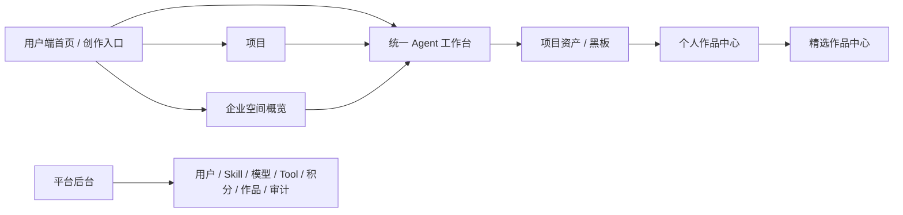

# 前端 PNG 草图归档索引

状态：archived
owner：产品与需求责任域
更新时间：2026-06-28
适用范围：Dora-Agent Web 第一版 image2 PNG 视觉草图评审材料，覆盖用户端首页、项目、统一 Agent 工作台、企业空间、平台后台、作品中心与精选作品页
相关代码路径：用户端 `frontend/**`；管理端 `admin_frontend/**`
相关契约：[契约文档索引](../../contracts/README.md)；本目录不定义后端字段、RPC 字段、API 字段或 AG-UI payload

## 背景

本目录承接 `docs/product/prd/` 和 `docs/design/00-11` 的产品与体验约束，只用于页面视觉和信息架构历史评审。当前已归档，不作为前端实现的默认事实源；正式字段以 API 和 AG-UI 契约为准。

本轮 Markdown 线框草图和 image2 生成的 PNG 草图保留为历史材料。进入前端阶段时，应以 `docs/design/README.md`、当前契约和实际实现约束重新复核。

## 草图列表

| 草图 | 页面范围 | 主要评审点 |
| --- | --- | --- |
| [01-用户端首页与创作入口草图](./01-用户端首页与创作入口草图.md) | `/app` 首页和快速创作入口 | 左侧导航、当前空间、Prompt 入口、热门 Skill、最近项目、精选作品露出 |
| [02-统一Agent工作台草图](./02-统一Agent工作台草图.md) | `/app/workspace`、会话恢复 | 顶部项目工具条、故事板、预览区、对话区、AG-UI 流式状态、确认、资产和黑板 |
| [03-企业空间成员积分Skill概览草图](./03-企业空间成员积分Skill概览草图.md) | 企业概览、成员、积分、企业 Skill | 企业拥有者和成员权限差异，企业空间不扩展成员资产可见性 |
| [04-平台后台管理页草图](./04-平台后台管理页草图.md) | `/admin` 管理后台 | 高密度管理端、敏感信息脱敏、确认和审计 |
| [05-作品中心与精选作品页草图](./05-作品中心与精选作品页草图.md) | `/app/works`、`/explore` | 个人作品管理、公开快照、免登录精选作品、点赞与分享 |
| [06-项目详情与资产归属草图](./06-项目详情与资产归属草图.md) | `/app/projects`、`/app/projects/:projectId` | 项目容器、项目详情、资产归属、工作台项目上下文 |
| [首页 PNG](./png/01-home-creation-entry.png) | `/app` 首页和快速创作入口 | image2 生成的暗色电影级首页草图 |
| [Agent 工作台 PNG](./png/02-agent-workspace.png) | `/app/workspace`、会话恢复 | image2 生成的三栏创作页草图 |
| [项目 PNG](./png/03-projects.png) | `/app/projects`、`/app/projects/:projectId` | image2 生成的项目列表和项目详情草图 |
| [企业空间 PNG](./png/04-enterprise-space.png) | 企业概览、成员、积分、企业 Skill | image2 生成的企业空间草图 |
| [个人作品中心 PNG](./png/05-works-center.png) | `/app/works` | image2 生成的作品中心草图 |
| [精选作品公开页 PNG](./png/06-explore-public.png) | `/explore`、`/explore/:publicWorkId` | image2 生成的公开精选作品草图 |
| [平台后台 PNG](./png/07-admin-console.png) | `/admin` 管理后台 | image2 生成的平台后台管理草图 |

## 总体信息架构

## 全局状态覆盖

| 状态 | 草图覆盖位置 | 说明 |
| --- | --- | --- |
| loading | 六张草图均覆盖 | 页面、表格、网格、工作台初始化使用 Skeleton 或稳定占位。 |
| empty | 首页最近项目、工作台空会话、企业成员/Skill/积分、后台表格、作品网格 | 空态必须给出清晰恢复入口。 |
| error | 六张草图均覆盖 | 展示用户可理解原因和重试入口，不暴露后端细节。 |
| success | 表单、分享、兑换、确认、后台操作 | 使用 Toast、结果区或状态刷新反馈。 |
| streaming | 统一 Agent 工作台 | 文本增量、Tool 状态、生成进度由 AG-UI 驱动。 |
| interrupt | 统一 Agent 工作台、企业空间下的工作台入口 | 扣费、高风险 Tool、业务写入确认由确认面板承接。 |
| resume | 统一 Agent 工作台、会话恢复 | 断线重连、Last-Event-ID、事件补偿或快照恢复。 |

## 共用约束

- 字段、枚举、权限和事件 payload 以后续 API、RPC、AG-UI 契约为准。
- 用户端桌面草图默认左右结构：左侧 AppSideNav / PublicSideNav，右侧 ContextHeader + PageBody；Agent 创作页为沉浸式三栏工作台。
- 非 Agent 实时页面默认不消费 AG-UI。
- 平台后台不进入普通用户 Agent 工作台，不代登录用户。
- 企业空间第一版只共享企业积分和企业 Skill，不做企业资产或成员创作记录后台。
- 项目是创作目标容器；会话、资产、黑板和作品都需要能解释项目归属。
- 精选作品公开展示必须基于公开快照，不暴露源会话、黑板、提示词、积分、模型成本或用户隐私。

## 验收标准

- [ ] 至少覆盖用户端首页、项目、统一 Agent 工作台、企业空间、平台后台、作品中心与精选作品页，并提供对应 PNG。
- [ ] 用户端首页、项目、企业空间和作品页草图采用左右结构；Agent 工作台采用顶部项目工具条 + 三栏创作结构。
- [ ] 每张草图标注目标用户、主任务、页面区域、关键组件、状态覆盖、契约依赖和待确认项。
- [ ] 明确本目录为 archived，只作为历史评审材料。
- [ ] 明确不发明后端字段，字段以 API、RPC、AG-UI 契约为准。
