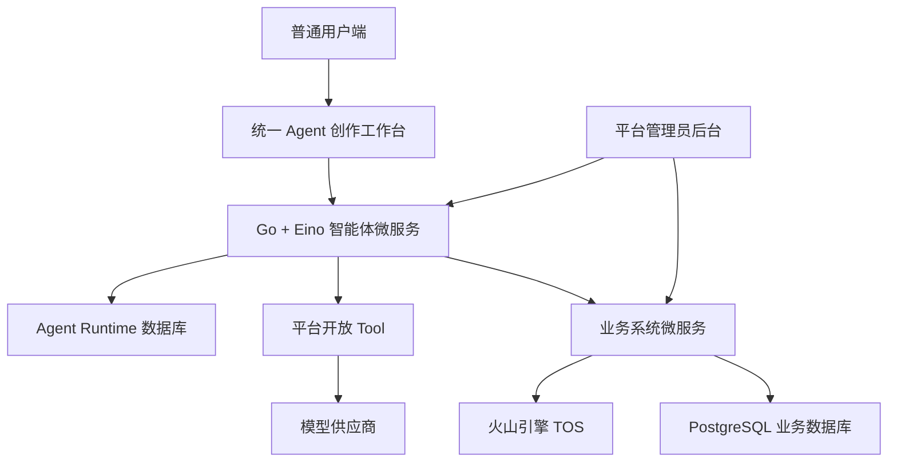
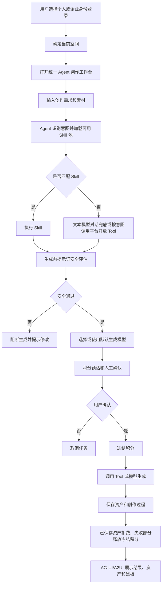

# 系统概要与功能大纲 PRD

状态：active
owner：产品与需求责任域
更新时间：2026-06-25
适用范围：AIGC 智能体 SaaS 第一版整体产品范围、模块关系和功能大纲
product_status：Done

## 关联文档

- [AIGC 智能体产品设计索引](../AIGC智能体产品设计索引.md)
- [统一 Agent 产品系统设计](../统一Agent产品系统设计.md)
- [页面范围与交互状态产品系统设计](../页面范围与交互状态产品系统设计.md)
- [工程交付输入清单产品系统设计](../工程交付输入清单产品系统设计.md)
- [PRD 文档索引](./README.md)

## 背景

Dora-Agent 是面向个人和企业用户的 AIGC 智能体 SaaS。用户通过一个统一 Agent 完成音乐、图片、视频等创作，并可以组合 Skill、平台开放 Tool、模型、积分、资产和黑板完成音乐创作、MV 制作、短视频制作、电商商品图、电商广告视频、文旅宣传视频、品牌 LOGO 等常见场景。

当前产品阶段需要先完成 PRD 级产品定义。后续页面设计、RPC/API/AG-UI 契约、Agent 数据模型、SQL 脚本、本地开发和测试均基于本 PRD 套件推进。

## 功能目标

- 用一个统一 Agent 覆盖多种 AIGC 创作场景。
- 用 Skill 表达可配置创作能力，但 Skill 不干涉业务规则。
- 用平台开放 Tool 控制 Agent 可执行能力边界。
- 用平台管理员配置模型供应商、模型、Tool、系统 Skill、积分和兑换码。
- 用个人空间和企业空间区分 Skill 池、积分账户、资产归属和历史记录。
- 用资产元素和黑板保存不同创作场景下的结构化创作过程。
- 用积分预估、冻结、扣减、释放闭环控制生成成本。
- 用 AG-UI/A2UI 统一承接 Agent 实时输出、组件渲染、确认、进度、错误和断线重连。
- 用个人作品中心承接用户自己的作品集，用精选作品中心承接分享后的公开作品。

## 非目标

- 第一版不做多 Agent 体系。
- 第一版不允许用户自带模型 API Key。
- 第一版不允许普通用户或企业用户创建 Tool。
- 第一版不做在线支付、购买积分包、订单、发票和退款。
- 第一版不做复杂组织架构、部门、岗位、多企业归属和 RBAC。
- 第一版不做外部内容安全服务、人审队列或生成文件内容审核。
- 第一版不做企业资产、会话、黑板、任务和生成记录管理后台。
- 第一版不做线上 SLO、告警、可观测性运行手册。

## 用户角色

| 角色 | 身份来源 | 核心权限 | 核心诉求 |
| --- | --- | --- | --- |
| 平台管理员 | 平台后台独立登录 | 系统 Skill、Skill 审核、模型、Tool、积分、兑换码、审计日志 | 管控平台能力和运营配置 |
| 个人用户 | 普通用户个人登录 | 使用统一 Agent、个人 Skill、个人积分、个人资产 | 完成个人创作 |
| 企业拥有者 | 企业注册创建者或被转让者 | 企业成员、企业 Skill、企业积分 | 为企业共享积分和 Skill |
| 企业成员 | 企业邀请加入 | 使用企业空间能力、查看本人资产和本人消耗 | 使用企业积分完成创作 |
| 未登录访客 | 无登录态 | 免登录查看与用户无关的公开内容 | 浏览公开分享作品、首页公开作品和公开展示信息 |

说明：产品层面只有平台管理员和普通用户两类顶层用户。企业拥有者和企业成员是普通用户在企业空间内的角色。未登录访客不是账户体系中的第三类用户，只代表匿名浏览状态，不产生用户空间、项目、积分、资产或会话。

## 系统概要

系统由三类核心服务协作：

- 前端应用：普通用户端、企业空间、平台管理员后台、Agent 创作工作台和 A2UI 渲染。
- 智能体微服务：统一 Agent、Skill 路由、Eino 编排、Tool 调用、AG-UI 事件、创作过程保存。
- 业务系统微服务：账户、企业、积分、模型配置、Tool 配置、Skill 审核业务、资产事实、审计日志。

## 功能大纲

| 模块 | 功能点 | 用户角色 | 优先级 | 对应 PRD |
| --- | --- | --- | --- | --- |
| 账户与空间 | 个人注册登录、企业登录、身份切换、当前空间 | 普通用户 | P0 | [01](./01-账户身份企业与空间PRD.md) |
| 企业管理 | 企业注册、邀请成员、移除成员、拥有者转让 | 企业拥有者 | P0 | [01](./01-账户身份企业与空间PRD.md) |
| 平台后台 | 后台独立登录、管理员账号、审计日志 | 平台管理员 | P0 | [02](./02-平台后台与运营管理PRD.md) |
| 用户管理 | 查询用户、查看基础信息、启用或禁用用户账号 | 平台管理员 | P0 | [02](./02-平台后台与运营管理PRD.md) |
| 模型管理 | 供应商 API Key、连通性测试、模型类型、默认模型 | 平台管理员 | P0 | [03](./03-模型供应商模型选择与单价PRD.md) |
| 模型选择 | 用户在聊天输入框选择图片、音乐、视频模型 | 普通用户 | P0 | [03](./03-模型供应商模型选择与单价PRD.md) |
| Tool 管理 | 平台内置 Tool 开关、白名单、风险等级、范围、超时 | 平台管理员 | P0 | [04](./04-Tool边界与平台开放能力PRD.md) |
| Skill Builder | 系统、企业、个人 Skill 创建、测试、发布、版本 | 平台管理员、企业拥有者、个人用户 | P0 | [05](./05-SkillBuilder与审核PRD.md) |
| Skill 审核 | 企业 Skill、个人 Skill 平台审核和站内信触达 | 平台管理员、Skill 创建者 | P0 | [05](./05-SkillBuilder与审核PRD.md) |
| 统一 Agent | 意图识别、Skill 路由、无 Skill 兜底、Tool 调用 | 普通用户 | P0 | [06](./06-统一Agent创作工作台PRD.md) |
| 创作工作台 | 对话、输入控件、确认、进度、资产、黑板 | 普通用户 | P0 | [06](./06-统一Agent创作工作台PRD.md) |
| 积分扣费 | 预估、确认、冻结、扣减、释放、流水 | 普通用户、企业拥有者 | P0 | [07](./07-积分账户兑换码与扣费PRD.md) |
| 积分来源 | 后台发放、兑换码、有效期、即将过期积分 | 平台管理员、普通用户、企业拥有者 | P0 | [07](./07-积分账户兑换码与扣费PRD.md) |
| 资产与素材 | 上传、生成资产保存、预览、下载、资产元素 | 普通用户 | P0 | [08](./08-资产素材与创作过程PRD.md) |
| 创作过程 | 会话、黑板、分镜、脚本、提示词、事件恢复 | 普通用户 | P0 | [08](./08-资产素材与创作过程PRD.md) |
| 个人作品中心 | 从已保存资产创建作品、编辑作品信息、分享和取消分享 | 普通用户、企业成员 | P0 | [12](./12-作品中心与精选作品PRD.md) |
| 公开内容浏览 | 首页公开作品、精选作品、公开作品详情、分享链接、分类和标签 | 未登录访客、普通用户 | P0 | [12](./12-作品中心与精选作品PRD.md) |
| AG-UI/A2UI | 事件、组件、payload、断线重连、未知事件兼容 | 普通用户、前端 | P0 | [09](./09-AG-UI与A2UI交互PRD.md) |
| 内容安全 | LLM 提示词安全评估、阻断、失败处理 | 普通用户 | P0 | [10](./10-内容安全治理PRD.md) |
| 站内信 | Skill 审核结果通知、系统通知 | 普通用户 | P1 | [11](./11-站内信与通知PRD.md) |

## 用户故事

- 作为个人用户，我希望只通过一个 Agent 输入创作需求，就能生成图片、音乐或视频，并保存为可复用资产。
- 作为企业成员，我希望用企业积分完成创作，但只能查看自己的产物、会话和积分消耗。
- 作为企业拥有者，我希望邀请成员、管理企业积分和企业 Skill，让团队共享企业能力。
- 作为平台管理员，我希望在后台查询用户并管理账号状态，但不查看用户私有创作内容。
- 作为 Skill 创建者，我希望完整配置 Skill 的意图、步骤、Tool、输出元素和测试样例，并通过审核发布。
- 作为平台管理员，我希望配置模型、Tool、系统 Skill、积分、兑换码和审核，控制平台能力边界。
- 作为前端开发者，我希望所有 Agent 实时输出都通过明确 AG-UI/A2UI 事件和组件来消费。
- 作为登录用户，我希望把自己创作的资产整理成个人作品集，并选择是否分享。
- 作为未登录访客，我希望不登录也能查看首页公开作品、精选作品和公开作品详情。
- 作为未登录访客，我触发创作、点赞、个人资产、个人项目等需要登录的动作时，希望系统弹出登录弹窗并在登录后继续原动作。

## 总体功能逻辑

## 页面范围概要

| 页面区域 | 页面 | 说明 |
| --- | --- | --- |
| 普通用户端 | 登录注册、个人中心、统一 Agent 工作台、个人作品中心、产物历史、产物详情、会话历史、站内信、个人 Skill、个人积分 | 面向个人和企业成员共用 |
| 公开页面 | 首页公开内容、精选作品中心、精选作品详情 | 支持免登录查看与用户无关的公开内容 |
| 企业空间 | 企业工作台、企业成员管理、拥有者转让、企业 Skill、企业积分、成员个人消耗明细 | 与普通用户端共享 Agent 工作台 |
| 平台后台 | 后台首页、平台管理员账号、用户管理、系统 Skill、Skill 审核、模型供应商、模型管理、Tool 管理、积分发放、兑换码、精选作品管理、审计日志 | 独立入口、独立代码 |

## 核心业务约束

- 当前空间决定 Skill 池、积分账户、资产归属和历史可见范围。
- 身份切换等价于退出当前身份并重新登录目标身份。
- 企业空间第一版只体现共享企业积分和企业 Skill，不扩展成员资产可见权限。
- Agent 不直接访问业务数据库，不保存积分、订单、企业权限等业务事实。
- 业务事实必须由业务微服务通过 RPC/API 维护。
- 未登录访客只能读取与用户无关的公开内容，例如首页公开作品、精选作品列表和公开作品详情。
- 未登录访客触发创作、点赞、创建项目、查看个人资产 / 作品 / 积分 / 通知等需要登录的动作时，前端必须弹出登录弹窗，不直接跳走丢失上下文。
- 公共内容接口不得返回用户私有字段、源会话、黑板、提示词、积分、模型成本、内部用户 ID、手机号、邮箱或私有素材。
- 资产元素使用平台内置固定元素类型，不能按创作场景散落硬编码。
- 生成完成且资产保存成功后才确认扣费。
- 安全评估必须发生在积分预估、冻结和生成前。

## 工程交付顺序建议

1. 完成全部 PRD Review 和 Done Gate。
2. 以 `docs/current/README.md` 进入当前文档体系。
3. 先更新技术设计、RPC/API 契约、AG-UI 事件协议和 Agent 领域数据模型。
4. 再准备本地 SQL 脚本、测试夹具和测试用例。
5. 第一阶段服务端历史设计只从 `docs/releases/phase-01-server/README.md` 追溯。
6. 按功能点进入本地开发、联调和测试。

## 注意事项

- 本 PRD 是总览，不替代各模块 PRD。
- 各模块如有冲突，以更细模块 PRD 和后续契约文档为准。
- 当前文档已确认 Done；后续变更应按当前文档体系维护产品、技术、契约和测试入口。
- 后续 UI 视觉和设计系统在产品功能确认后再落地。

## 验收标准

- [x] 已列出第一版完整模块和功能点。
- [x] 已明确顶层用户、企业角色和平台管理员范围。
- [x] 已明确未登录访客可访问公开内容，登录态动作通过登录弹窗承接。
- [x] 已明确统一 Agent、业务微服务、前端和平台后台边界。
- [x] 已明确当前空间、积分、资产、Skill、Tool、模型之间的核心关系。
- [x] 已明确第一版非目标。
- [x] 已提供可用于后续模块 PRD、契约和当前工程文档的功能大纲。

## Done Gate

- [x] 系统范围确认。
- [x] 功能大纲确认。
- [x] 角色边界确认。
- [x] 总体流程确认。
- [x] 与所有模块 PRD 链接确认。
- [x] product_status 已更新为 Done，允许进入工程设计、契约和测试文档维护。
