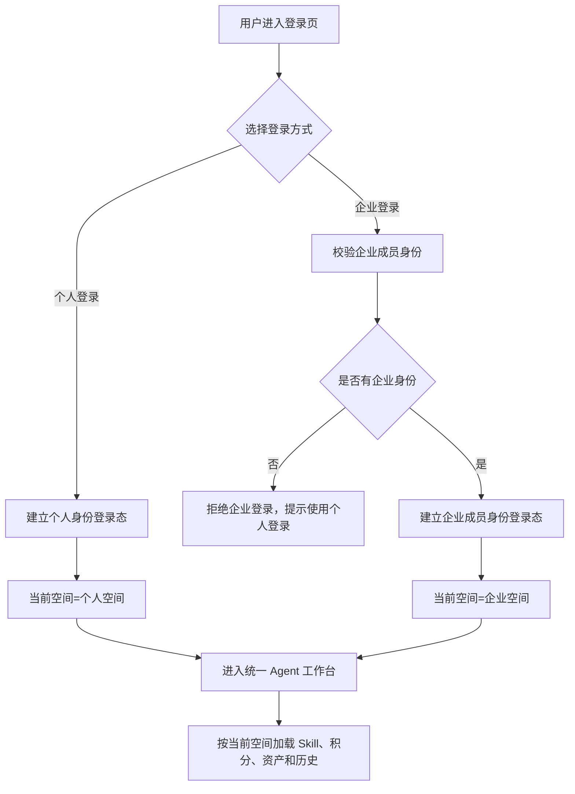
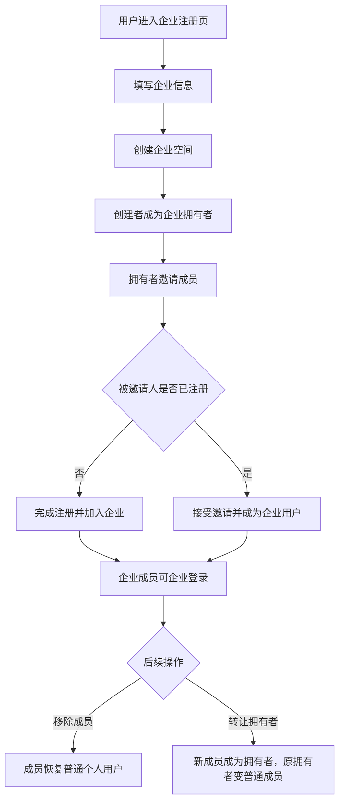

# 账户身份企业与空间 PRD

状态：draft  
owner：产品体验设计师  
更新时间：2026-06-25  
适用范围：普通用户账户、个人空间、企业空间、企业成员、当前登录身份和资源归属  
product_status：Draft

## 关联文档

- [账户体系产品系统设计](../账户体系产品系统设计.md)
- [系统概要与功能大纲 PRD](./00-系统概要与功能大纲PRD.md)
- [积分账户兑换码与扣费 PRD](./07-积分账户兑换码与扣费PRD.md)
- [资产素材与创作过程 PRD](./08-资产素材与创作过程PRD.md)

## 背景

产品同时服务个人用户和企业用户。企业不是复杂组织管理系统，第一版核心价值是让多个企业成员共享企业积分和企业 Skill。账户体系需要先定义登录身份、当前空间、资源归属和企业成员流转，否则 Agent、Skill、积分、资产和权限都会失去统一依据。

## 功能目标

- 支持个人登录和企业登录。
- 用户注册后默认拥有个人空间。
- 企业通过专用企业注册页面创建，创建者成为企业拥有者。
- 企业成员只能通过邀请加入。
- 用户通过个人中心切换身份，切换等价于退出并重新登录目标身份。
- 当前空间统一决定 Skill 池、积分账户、产物归属和历史可见范围。
- 第一版企业管理只覆盖成员、拥有者转让和企业积分，不覆盖成员资产管理。

## 用户角色

| 角色 | 权限/特征 | 核心诉求 |
| --- | --- | --- |
| 个人用户 | 拥有个人空间、个人积分账户、个人 Skill | 用个人能力完成创作 |
| 企业拥有者 | 企业创建者或被转让者 | 邀请成员、移除成员、转让拥有者、管理企业积分和企业 Skill |
| 企业成员 | 受邀加入企业 | 使用企业空间和企业积分创作，查看自己的资产和消耗 |
| 平台管理员 | 不进入普通用户空间 | 管理平台能力，不参与企业成员管理 |

## 用户故事

- 作为新用户，我希望注册后立即拥有个人空间，可以开始个人创作。
- 作为企业创建者，我希望通过企业注册页面创建企业，并自动成为企业拥有者。
- 作为企业拥有者，我希望邀请成员加入企业，让他们共享企业积分创作。
- 作为企业成员，我希望切换到企业身份后，使用企业 Skill 和企业积分。
- 作为企业拥有者，我希望可以把企业拥有者身份转让给其他成员。
- 作为被移除的企业成员，我希望个人空间、个人积分和个人资产不受影响。

## 功能范围

| 功能 | 描述 | 优先级 |
| --- | --- | --- |
| 个人注册登录 | 注册后创建个人空间和个人积分账户 | P0 |
| 企业登录 | 登录时选择企业身份并进入企业空间 | P0 |
| 身份切换 | 在个人中心切换个人身份或企业身份 | P0 |
| 企业注册 | 专用页面创建企业，创建者成为企业拥有者 | P0 |
| 企业邀请 | 企业拥有者邀请未注册或已注册用户加入 | P0 |
| 成员移除 | 企业拥有者移除非拥有者成员 | P0 |
| 拥有者转让 | 企业拥有者转让给当前企业成员 | P0 |
| 企业积分入口 | 企业拥有者查看企业积分，成员查看本人消耗 | P0 |
| 企业 Skill 权限 | 企业拥有者创建企业 Skill，成员只能使用 | P0 |

## 功能逻辑

## 企业生命周期流程

## 页面交互逻辑

### 登录 / 注册页

- 展示个人登录和企业登录入口。
- 用户选择企业登录但没有企业身份时，提示暂无企业身份，不进入企业空间。
- 邀请链接进入注册时，需要展示邀请企业名称、邀请状态和过期状态。
- 邀请无效或过期时，不创建企业成员关系。

### 个人中心 / 身份切换

- 展示当前登录身份和当前空间。
- 个人用户只显示个人身份。
- 企业用户显示个人身份和企业成员身份。
- 切换身份时提示将重新进入目标身份上下文。
- 切换成功后刷新用户信息、权限、空间、积分账户、Skill 池和产物归属。
- 切换失败时保持原身份和原空间。

### 企业成员管理

- 仅企业拥有者可访问。
- 支持邀请成员、查看邀请状态、移除成员。
- 移除成员前需要确认。
- 不能移除企业拥有者。
- 企业成员不能主动退出企业。

### 企业拥有者转让

- 仅企业拥有者可操作。
- 只能选择当前企业成员。
- 转让前必须确认影响：原拥有者会变为普通企业成员。
- 转让成功后当前用户权限刷新。

## 功能描述与规则

- 用户注册后默认是普通个人用户，并拥有个人空间。
- 第一版一个用户同一时间最多属于一个企业。
- 企业成员只能通过邀请加入，不能主动申请加入。
- 未注册用户通过邀请完成注册后，自动成为企业用户。
- 已注册个人用户接受邀请后，自动成为企业用户。
- 企业用户被移除后，自动恢复为普通个人用户。
- 个人空间资源不因加入或离开企业而变化。
- 企业空间资源留在企业，成员被移除后失去访问权限。
- 企业拥有者转让后，原拥有者变为企业普通成员。
- 企业拥有者不额外查看成员资产、会话、任务、黑板或生成记录。
- 企业成员只查看自己的企业空间资产、会话、任务、黑板和积分消耗明细。

## 当前空间规则

| 当前空间 | Skill 池 | 积分账户 | 产物归属 | 历史可见 |
| --- | --- | --- | --- | --- |
| 个人空间 | 系统 Skill、个人 Skill | 个人积分账户 | 个人空间 | 本人可见 |
| 企业空间 | 系统 Skill、企业 Skill、个人 Skill | 企业积分账户 | 企业空间 | 创建者本人可见 |

企业空间允许使用个人 Skill，但该 Skill 必须满足企业权限、套餐和 Tool 白名单约束，且生成产物归属企业空间、扣企业积分。

## 异常场景

| 场景 | 触发条件 | 用户提示 | 系统行为 |
| --- | --- | --- | --- |
| 企业登录失败 | 用户无企业成员身份 | 暂无企业身份 | 拒绝企业登录 |
| 身份切换失败 | 目标身份不可用 | 身份切换失败 | 保持原身份和空间 |
| 重复加入企业 | 用户已有企业身份 | 当前已加入企业 | 阻止加入 |
| 邀请过期 | 邀请链接超过有效期 | 邀请已过期 | 拒绝加入 |
| 移除拥有者 | 尝试移除企业拥有者 | 不能移除企业拥有者 | 阻止操作 |
| 转让对象非法 | 转让给非成员 | 只能转让给企业成员 | 阻止操作 |
| 成员主动退出 | 成员尝试退出企业 | 暂不支持主动退出 | 阻止操作 |
| 企业积分不足 | 企业空间生成时余额不足 | 企业积分不足 | 不自动扣个人积分 |

## 注意事项

- 前端不能只靠本地状态判断当前空间，后端返回的当前登录身份才是事实源。
- 身份切换后必须清空或刷新旧空间缓存，避免串用 Skill、积分或资产。
- 企业拥有者的积分管理权限不等于成员资产可见权限。
- 平台管理员账号不属于本 PRD 的普通用户登录体系，平台后台详见 [02](./02-平台后台与运营管理PRD.md)。

## 验收标准

- [ ] 用户注册后自动拥有个人空间。
- [ ] 登录页面支持个人登录和企业登录。
- [ ] 没有企业身份的用户不能企业登录。
- [ ] 企业注册创建者自动成为企业拥有者。
- [ ] 企业成员只能通过邀请加入。
- [ ] 企业拥有者可以邀请和移除非拥有者成员。
- [ ] 企业成员不能主动退出企业。
- [ ] 企业拥有者可以转让给当前企业成员。
- [ ] 企业拥有者转让后原拥有者成为普通成员。
- [ ] 身份切换等价于重新登录目标身份，并刷新当前空间。
- [ ] 当前空间决定 Skill 池、积分账户、资产归属和历史可见范围。
- [ ] 企业成员只能查看自己的资产、会话、黑板、生成记录和积分消耗明细。
- [ ] 企业拥有者不额外查看成员资产和创作记录。

## Done Gate

- [ ] 登录身份规则确认。
- [ ] 当前空间规则确认。
- [ ] 企业创建、邀请、移除、转让流程确认。
- [ ] 企业资源可见范围确认。
- [ ] 验收标准可测试。
- [ ] product_status 更新为 Done 后，才允许进入正式工程开发。

