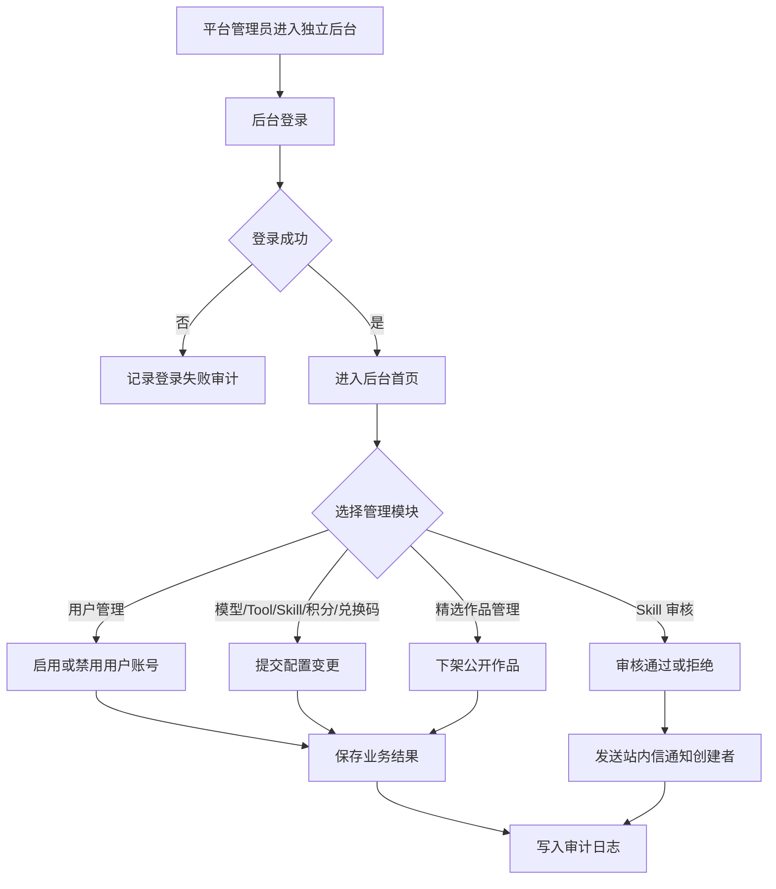

# 平台后台与运营管理 PRD

状态：draft  
owner：产品体验设计师  
更新时间：2026-06-25  
适用范围：平台管理员后台、平台管理员账号、运营配置、审核和审计日志  
product_status：Draft

## 关联文档

- [页面范围与交互状态产品系统设计](../页面范围与交互状态产品系统设计.md)
- [账户身份企业与空间 PRD](./01-账户身份企业与空间PRD.md)
- [模型供应商模型选择与单价 PRD](./03-模型供应商模型选择与单价PRD.md)
- [Tool 边界与平台开放能力 PRD](./04-Tool边界与平台开放能力PRD.md)
- [Skill Builder 与审核 PRD](./05-SkillBuilder与审核PRD.md)
- [积分账户兑换码与扣费 PRD](./07-积分账户兑换码与扣费PRD.md)
- [作品中心与精选作品 PRD](./12-作品中心与精选作品PRD.md)

## 背景

第一版平台管理员后台用于配置平台级能力，而不是作为普通用户创作入口。平台后台需要独立入口、独立代码、独立登录态，并支撑用户管理、模型供应商、模型、Tool、系统 Skill、Skill 审核、积分发放、兑换码和审计日志等能力。

## 功能目标

- 支持初始平台管理员账号和新增平台管理员账号。
- 第一版平台管理员不做 RBAC，所有平台管理员拥有相同权限。
- 支持平台管理员查询用户、查看用户基础信息、启用或禁用用户账号。
- 提供系统 Skill、Skill 审核、模型、Tool、积分、兑换码等后台页面。
- 提供精选作品下架能力，处理公开作品的运营风险。
- 支持关键后台操作进入审计日志。
- 防止 API Key、兑换码明文、用户隐私、模型内部推理链路等敏感信息进入审计日志。

## 用户角色

| 角色 | 权限/特征 | 核心诉求 |
| --- | --- | --- |
| 平台管理员 | 后台唯一角色，不做 RBAC | 配置平台能力、审核 Skill、发放积分、查看审计日志 |
| 初始平台管理员 | 系统初始化产生 | 创建其他平台管理员账号 |

## 用户故事

- 作为平台管理员，我希望通过独立后台管理模型、Tool、系统 Skill 和积分，避免影响普通用户端。
- 作为平台管理员，我希望查询用户并处理账号禁用、启用等基础管理动作。
- 作为平台管理员，我希望用户管理不展示用户私有资产、会话、黑板和创作内容，避免越权查看。
- 作为平台管理员，我希望审核用户提交的个人 Skill 和企业 Skill，并用站内信告知结果。
- 作为平台管理员，我希望每次修改模型单价、Tool 白名单或积分发放都能进入审计日志。
- 作为平台管理员，我希望审计日志可追踪操作但不泄露密钥或用户私密内容。

## 功能范围

| 页面 | 功能点 | 优先级 |
| --- | --- | --- |
| 平台后台登录 | 独立入口、独立登录态 | P0 |
| 平台管理员账号 | 新增、停用平台管理员 | P0 |
| 用户管理 | 查询用户、查看基础信息、启用或禁用用户账号 | P0 |
| 系统 Skill 管理 | 创建、编辑、测试、发布、废弃系统 Skill | P0 |
| Skill 审核队列 | 审核企业 Skill 和个人 Skill，意见非必填 | P0 |
| 模型供应商管理 | API Key 配置、连通性测试、启停 | P0 |
| 模型管理 | 模型类型、默认模型、内部成本、用户积分单价 | P0 |
| Tool 管理 | 平台内置 Tool 开关、白名单、风险等级、超时、范围 | P0 |
| 积分发放 | 给个人或企业手动发放积分 | P0 |
| 兑换码管理 | 创建、停用、绑定、批量导出、查看状态 | P0 |
| 精选作品管理 | 查询公开作品、下架风险作品 | P1 |
| 审计日志 | 查看后台关键操作日志 | P0 |

## 功能逻辑

## 页面交互逻辑

### 平台后台首页

- 展示平台能力配置入口。
- 不展示普通用户创作工作台入口。
- 错误或无权限时展示后台登录页或权限提示。

### 平台管理员账号

- 展示账号列表、状态、创建时间和最近登录时间。
- 支持新增平台管理员账号。
- 支持停用平台管理员账号。
- 停用前需要确认。
- 第一版不支持细分角色权限。

### 用户管理

- 展示普通用户列表。
- 支持按用户 ID、手机号或邮箱脱敏值、公开昵称、账号状态、用户类型、注册时间、最近登录时间筛选。
- 用户详情展示账号基础信息、个人/企业身份状态、所属企业摘要、账号启用状态、注册时间、最近登录时间。
- 支持启用或禁用用户账号。
- 禁用用户账号前必须确认影响：该用户不能登录个人空间或企业空间，已公开分享作品是否继续公开按作品状态处理，不自动删除。
- 启用或禁用用户账号必须记录操作原因。
- 用户管理不展示用户私有资产、会话、黑板、生成记录、提示词、上传私有素材、积分明细正文或创作内容。
- 用户积分发放仍通过“积分发放”模块完成，不在用户详情中直接修改积分。
- 第一版不支持平台管理员代登录用户账号。
- 第一版不支持平台管理员直接修改用户密码；如后续需要，单独设计重置流程。

### 系统 Skill 管理

- 平台管理员创建系统 Skill。
- 系统 Skill 不需要审核。
- 发布前仍需配置完整内容和至少 3 个测试样例。
- 测试通过后可直接发布。
- 支持废弃，不物理删除历史版本。

### Skill 审核队列

- 展示企业 Skill 和个人 Skill 的待审核列表。
- 审核操作包括通过、拒绝。
- 审核意见非必填。
- 审核完成后通过站内信通知创建者。
- 平台管理员不能在审核时篡改创建者 Skill 内容；如不合规则拒绝并由创建者修改后重新提交。

### 积分发放与兑换码

- 积分发放必须选择个人或企业目标账户、积分数量、过期时间和发放原因。
- 兑换码创建必须配置积分数量、兑换码有效期、兑换后积分有效期、可兑换账户类型和数量。
- 支持批量导出兑换码。
- 导出操作必须进入审计日志，但审计日志不保存完整兑换码列表。

### 精选作品管理

- 展示已分享公开作品列表。
- 支持按作品标题、作者公开昵称、资源类型、分类、标签和分享状态筛选。
- 第一版只支持下架公开作品，不做推荐算法、榜单运营或人工审核队列。
- 下架前需要确认。
- 下架后作品不再出现在精选作品中心，公开链接不可访问。
- 下架操作进入审计日志。

### 审计日志

- 支持按操作人、模块、操作类型、时间范围筛选。
- 展示操作摘要、结果、时间、trace_id。
- 不展示敏感明文。

## 审计日志覆盖范围

| 模块 | 审计操作 |
| --- | --- |
| 管理员账号 | 登录、退出、登录失败、新增管理员、停用管理员 |
| 用户管理 | 用户账号启用、禁用、状态变更原因 |
| 系统 Skill | 创建、编辑、测试、发布、废弃 |
| Skill 审核 | 审核通过、审核拒绝 |
| 模型供应商 | API Key 新增、编辑、连通性测试、停用 |
| 模型管理 | 新增、编辑、启用、停用、默认模型切换、内部成本修改、用户积分单价修改 |
| Tool 管理 | 启用、停用、白名单修改、风险等级修改、超时修改、可用范围修改 |
| 积分 | 手动发放积分 |
| 兑换码 | 创建、停用、批量导出 |
| 精选作品 | 公开作品下架 |
| 资产元素类型 | 平台内置资产元素类型配置发布或变更 |

## 敏感信息规则

审计日志不得记录：

- API Key 明文。
- 完整兑换码列表。
- 用户私密创作内容。
- 用户完整手机号、完整邮箱等敏感个人信息。
- 模型内部推理链路。
- 系统提示词。
- 平台安全策略细节。
- 供应商原始响应全文。

可以记录：

- 操作对象 ID 或脱敏摘要。
- 操作前后状态变化。
- 操作结果。
- 操作人、时间、trace_id。

## 异常场景

| 场景 | 触发条件 | 用户提示 | 系统行为 |
| --- | --- | --- | --- |
| 后台登录失败 | 账号密码错误或账号停用 | 登录失败 | 记录登录失败审计 |
| 权限不匹配 | 普通用户访问后台 | 无权访问 | 拒绝访问 |
| 停用自身风险 | 管理员停用当前账号 | 当前账号不能直接停用 | 阻止或要求其他管理员操作 |
| 用户不存在 | 平台管理员查询不存在用户 | 用户不存在 | 不展示详情 |
| 用户禁用确认取消 | 管理员取消禁用确认 | 已取消 | 不改变用户状态 |
| 禁用用户失败 | 业务服务状态变更失败 | 用户状态更新失败 | 保持原状态并记录失败 |
| API Key 连通失败 | 连通性测试失败 | 连通性测试失败 | 标记异常，不暴露密钥 |
| 默认模型停用 | 停用当前默认模型 | 请先切换默认模型 | 阻止停用 |
| Skill 审核失败 | 保存审核结果失败 | 审核失败，请重试 | 保持待审核 |
| 积分发放失败 | 业务服务写入失败 | 发放失败 | 不增加积分，记录失败审计 |
| 兑换码导出失败 | 批量导出异常 | 导出失败 | 保留已创建状态并提示重试 |

## 非目标

- 第一版不做平台后台 RBAC。
- 第一版不做平台运营数据看板。
- 第一版不做精选作品推荐算法、排行榜和人工审核队列。
- 第一版不让平台管理员直接进入普通用户 Agent 工作台。
- 第一版不支持平台管理员代登录用户账号。
- 第一版不在用户管理中查看用户私有资产、会话、黑板、生成记录和提示词。
- 第一版不在用户管理中直接修改用户积分。
- 第一版不做在线支付和订单管理。
- 第一版不做告警、SLO、可观测性后台。

## 注意事项

- 平台后台与普通用户端必须是独立入口和独立代码。
- 平台管理员登录态不能复用普通用户登录态。
- 用户管理是账号状态管理，不是用户内容审查后台。
- 后台所有 Secret 展示必须脱敏。
- 批量导出兑换码是高风险操作，需要审计。
- 审计日志是业务追踪，不是调试日志，不保存大 payload。

## 验收标准

- [ ] 系统初始化存在初始平台管理员账号。
- [ ] 平台管理员可以新增和停用其他平台管理员账号。
- [ ] 第一版后台只有一个平台管理员角色，不做 RBAC。
- [ ] 平台后台为独立入口、独立代码、独立登录态。
- [ ] 平台后台支持用户查询和用户详情查看。
- [ ] 平台后台支持启用和禁用用户账号。
- [ ] 禁用用户账号前需要确认并记录原因。
- [ ] 用户管理不展示用户私有资产、会话、黑板、生成记录、提示词或私有素材。
- [ ] 用户管理不支持平台管理员代登录用户。
- [ ] 平台后台覆盖用户管理、系统 Skill、Skill 审核、模型、Tool、积分发放、兑换码、精选作品管理和审计日志。
- [ ] 平台后台支持下架公开精选作品。
- [ ] 系统 Skill 可由平台管理员测试后直接发布。
- [ ] 企业 Skill 和个人 Skill 审核结果通过站内信通知创建者。
- [ ] 平台管理员可以批量导出兑换码。
- [ ] 审计日志覆盖关键后台操作。
- [ ] 审计日志不记录 API Key 明文、完整兑换码列表或用户私密创作内容。

## Done Gate

- [ ] 后台页面范围确认。
- [ ] 平台管理员账号规则确认。
- [ ] 审计日志覆盖范围确认。
- [ ] 敏感信息规则确认。
- [ ] 验收标准可测试。
- [ ] product_status 更新为 Done 后，才允许进入正式工程开发。
