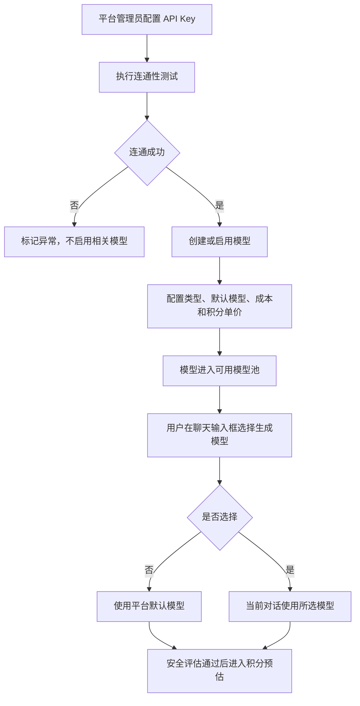

# 模型供应商模型选择与单价 PRD

状态：active
owner：产品体验设计师
更新时间：2026-06-25
适用范围：模型供应商、模型类型、模型管理、用户模型选择、模型积分单价
product_status：Done

## 关联文档

- [模型供应商产品系统设计](../模型供应商产品系统设计.md)
- [模型选择产品系统设计](../模型选择产品系统设计.md)
- [积分扣费产品系统设计](../积分扣费产品系统设计.md)
- [统一 Agent 创作工作台 PRD](./06-统一Agent创作工作台PRD.md)

## 背景

平台需要接入文本、视觉理解、图片生成、音乐生成、视频生成等模型能力。产品已确认模型供应商只由平台管理员配置，普通用户不能接入自己的 API Key。用户只能在生成图片、音乐、视频时，在聊天输入框内选择当前对话生效的模型。

## 功能目标

- 支持平台管理员配置供应商 API Key 并做连通性测试。
- 支持模型类型、显示名称、启停状态、默认模型、内部成本和用户积分单价管理。
- 支持不同生成模型配置不同积分单价。
- 支持普通用户在聊天输入框内选择图片、音乐、视频生成模型。
- 用户只看模型名称，不看供应商、API Key、内部模型 ID、成本和完整价格表。
- 用户选择的模型只对当前对话生效，进入扣费确认后锁定。

## 模型类型

| 类型 | 第一版状态 | 用途 | 用户是否可选择 |
| --- | --- | --- | --- |
| 文本模型 | 支持 | 对话、意图识别、Skill 路由、文案、脚本 | 否 |
| 视觉理解模型 | 支持 | 图片理解、封面分析、图像内容识别 | 否 |
| 图片生成模型 | 支持 | 文生图、图生图、风格化 | 是 |
| 音乐生成模型 | 支持 | 文生音乐、歌词生成歌曲、BGM | 是 |
| 视频生成模型 | 支持 | 文生视频、图生视频、分镜转视频 | 是 |
| 语音模型 | 后续 | TTS、ASR | 否 |

## 用户故事

- 作为平台管理员，我希望配置供应商 API Key 并验证可用性，确保模型调用可控。
- 作为平台管理员，我希望为不同模型设置不同用户积分单价，因为不同模型成本不同。
- 作为普通用户，我希望在生成图片、音乐或视频时能选择模型名称，但不需要看到复杂供应商信息。
- 作为普通用户，我希望不选择模型时系统自动使用默认模型。

## 功能范围

| 功能 | 描述 | 角色 | 优先级 |
| --- | --- | --- | --- |
| 供应商 API Key | 新增、编辑、停用、连通性测试 | 平台管理员 | P0 |
| 模型管理 | 创建模型、启停、类型、显示名称、内部模型标识 | 平台管理员 | P0 |
| 默认模型 | 图片、音乐、视频分别配置默认模型 | 平台管理员 | P0 |
| 内部成本 | 记录并向平台管理员展示模型内部成本 | 平台管理员 | P0 |
| 用户积分单价 | 图片按张、音乐按首、视频按秒配置 | 平台管理员 | P0 |
| 聊天输入模型选择 | 在聊天输入框按图片、音乐、视频分组选择 | 普通用户 | P0 |
| 当前对话生效 | 模型选择只在当前对话有效 | 普通用户 | P0 |

## 功能逻辑

## 页面交互逻辑

### 平台后台：模型供应商管理

- 列表展示供应商名称、状态、连通性状态、最近测试时间。
- API Key 输入和展示必须脱敏。
- 连通性测试展示 testing、connected、failed 状态。
- 连通性失败时展示可理解原因摘要，不展示供应商原始密钥或敏感响应。

### 平台后台：模型管理

- 创建模型时选择模型类型。
- 模型显示名称允许重名。
- 生成类模型必须配置用户积分单价。
- 用户积分单价允许为 0。
- 图片、音乐、视频生成类型分别需要一个默认模型。
- 停用默认模型前必须先切换默认模型。
- 平台管理员可查看内部成本，普通用户不可见。

### 用户端：聊天输入框模型选择

- 模型选择在聊天输入框内完成，不作为独立 A2UI 组件。
- 仅当任务被识别为图片、音乐或视频生成时展示对应分组。
- 模型列表只展示模型名称。
- 用户不选择时展示默认模型名称。
- 进入扣费确认后，模型选择控件锁定。
- 如需修改模型，用户必须取消确认并重新发起预估。

## 模型积分单价规则

| 资源类型 | 单价单位 | 预估方式 |
| --- | --- | --- |
| 图片 | 积分/张 | 单价 x 图片数量 |
| 音乐 | 积分/首 | 单价 x 歌曲或 BGM 首数 |
| 视频 | 积分/秒 | 单价 x 视频秒数 |

- 不同模型可以配置不同积分单价。
- 内部成本和用户积分单价是两个概念。
- 普通用户只看本次预计消耗积分和当前可用积分。
- 第一版不做质量、分辨率、视频时长上限等倍率。

## 功能描述与规则

- 只有平台管理员可以配置模型供应商和模型。
- 普通用户、企业拥有者、企业成员不能接入自己的 API Key。
- 普通用户不能选择文本模型。
- 视觉理解模型由平台和 Tool 决定，普通用户不直接选择。
- 后台不配置默认图片、音乐、视频生成参数；生成参数由用户本次输入或 Tool/供应商默认值决定。
- 模型停用后不能出现在用户可选列表。
- 文本模型用于对话、意图识别、Skill 路由、文案生成、脚本生成。

## 异常场景

| 场景 | 触发条件 | 用户提示 | 系统行为 |
| --- | --- | --- | --- |
| API Key 无效 | 连通性测试失败 | API Key 连通性测试失败 | 标记异常，不启用模型 |
| 无默认模型 | 生成类型未配置默认模型 | 当前暂无可用模型 | 阻止生成 |
| 模型已停用 | 用户选择后模型被停用 | 该模型当前不可用 | 要求重新选择 |
| 价格缺失 | 生成模型未配置积分单价 | 模型价格未配置 | 不进入用户可选池 |
| 确认后修改模型 | 用户进入扣费确认后修改 | 请取消后重新选择 | 控件锁定 |
| 供应商调用失败 | 生成调用失败或超时 | 生成失败，可稍后重试 | 释放冻结积分 |

## 非目标

- 第一版不做普通用户自带 API Key。
- 第一版不做长期模型偏好。
- 第一版不展示完整模型价格表给普通用户。
- 第一版不做语音模型 TTS/ASR。
- 第一版不做后台默认生成参数管理。
- 第一版不做供应商告警和 SLO。

## 注意事项

- 模型显示名称允许重名，因此内部选择必须依赖模型 ID，但普通用户只看到名称。
- 用户积分单价为 0 时仍需进入确认流程，以便用户理解本次生成影响。
- 模型选择当前对话生效，不应写入长期用户偏好。
- 文本模型选择不能暴露给普通用户，否则会影响路由和成本边界。

## 验收标准

- [ ] 平台管理员可以配置供应商 API Key。
- [ ] API Key 支持连通性测试。
- [ ] 平台管理员可以创建、启停模型。
- [ ] 模型归属文本、视觉、图片、音乐、视频等类型。
- [ ] 图片、音乐、视频生成模型可配置用户积分单价。
- [ ] 用户积分单价允许为 0。
- [ ] 平台管理员可查看内部成本。
- [ ] 普通用户只看到模型名称。
- [ ] 用户可在聊天输入框选择图片、音乐、视频生成模型。
- [ ] 用户不选择模型时使用默认模型。
- [ ] 模型选择只对当前对话生效。
- [ ] 进入扣费确认后模型选择锁定。
- [ ] 停用模型不可选，默认模型停用前必须切换。

## Done Gate

- [x] 模型类型确认。
- [x] 供应商 API Key 范围确认。
- [x] 用户模型选择范围确认。
- [x] 模型积分单价规则确认。
- [x] 用户可见和平台内部字段边界确认。
- [x] product_status 已更新为 Done，允许进入工程需求映射与契约先行阶段。

