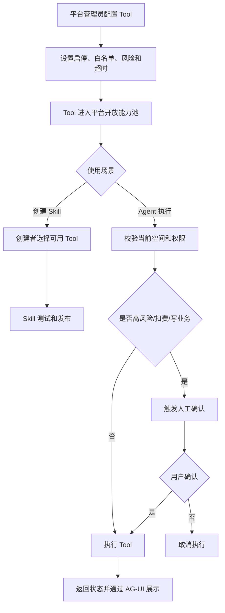

# Tool 边界与平台开放能力 PRD

状态：active
owner：产品与需求责任域
更新时间：2026-06-25
适用范围：平台开放 Tool、Skill 可绑定 Tool、Agent 直接调用 Tool、风险等级、可用范围、超时重试取消
product_status：Done

## 关联文档

- [Tool 边界产品系统设计](../Tool边界产品系统设计.md)
- [Skill Builder 与审核 PRD](./05-SkillBuilder与审核PRD.md)
- [统一 Agent 创作工作台 PRD](./06-统一Agent创作工作台PRD.md)
- [积分账户兑换码与扣费 PRD](./07-积分账户兑换码与扣费PRD.md)

## 背景

Tool 是 Agent 执行动作的边界。产品已确认第一版只允许平台内置 Tool 的开关和白名单，不允许任意 HTTP Tool。普通用户、企业拥有者和企业成员不能创建 Tool。所有 Skill 只能使用平台开放 Tool。

## 功能目标

- 平台管理员统一管理平台开放 Tool。
- Skill 创建者只能绑定当前可用且有权限的 Tool。
- Agent 没有匹配 Skill 时，也只能按用户意图调用平台开放基础 Tool。
- Tool 支持风险等级、可用范围、超时、重试和取消策略。
- 高风险、扣费、业务事实写入必须人工确认。
- 业务事实变更必须通过业务 RPC Tool，不允许 Agent 直写业务数据库。

## 用户角色

| 角色 | 权限/特征 | 核心诉求 |
| --- | --- | --- |
| 平台管理员 | 启停 Tool、配置白名单、风险等级、超时、范围 | 控制平台能力边界 |
| Skill 创建者 | 在 Skill 中选择已开放 Tool | 构建可执行 Skill |
| 普通用户 | 使用 Agent 间接触发 Tool | 安全完成创作任务 |

## 用户故事

- 作为平台管理员，我希望只开放经过平台确认的 Tool，避免 Agent 执行不可控动作。
- 作为 Skill 创建者，我希望创建 Skill 时只能看到当前可用 Tool。
- 作为普通用户，我希望高风险操作或扣费前系统先让我确认。
- 作为业务服务负责人，我希望所有业务事实写入都通过业务 RPC Tool，而不是 Agent 直接写数据库。

## 功能范围

| 功能 | 描述 | 优先级 |
| --- | --- | --- |
| 平台内置 Tool 列表 | 由平台维护，不允许用户创建任意 Tool | P0 |
| Tool 启停 | 平台管理员启用或停用 Tool | P0 |
| Tool 白名单 | 按企业、用户等级、套餐、空间限制可用范围 | P0 |
| 风险等级 | low、medium、high | P0 |
| 执行策略 | 超时、重试、取消默认策略 | P0 |
| Skill 绑定 | Skill 只能绑定平台开放 Tool | P0 |
| Agent 直接调用 | 无 Skill 但意图匹配时可调用平台开放基础 Tool | P0 |
| 人工确认 | 高风险、扣费、业务写入确认 | P0 |

## 功能逻辑

## Tool 类型

| 类型 | 描述 | 关键边界 |
| --- | --- | --- |
| 模型 Tool | 调用文本、视觉、图片、音乐、视频模型 | 依赖模型配置和积分规则 |
| 文件 Tool | 读取或处理用户上传文件 | 必须校验权限和文件约束 |
| 产物 Tool | 保存、查询、展示产物引用 | 不替代业务资产规则 |
| 业务 RPC Tool | 查询或改变业务事实 | 唯一业务事实写入通道 |
| 人工确认 Tool | 高风险、扣费、写业务前确认 | 与 AG-UI 确认组件联动 |
| 媒体处理 Tool | 转码、裁剪、拼接等 | 后续可扩展 |

## 执行策略

| Tool 类别 | 默认超时 | 自动重试 | 取消策略 |
| --- | --- | --- | --- |
| low 风险只读 Tool | 10 秒 | 最多 1 次 | 可取消，不产生业务影响 |
| medium 风险处理 Tool | 30 秒 | 幂等失败可重试 1 次 | 可取消，已完成步骤保留 |
| high 风险 Tool | 60 秒 | 默认不自动重试 | 取消前必须确认，成功部分不自动回滚 |
| 模型生成 Tool | 按模型或任务配置 | 默认不自动重试 | 取消后已完成资产结算，未完成释放冻结积分 |
| 业务 RPC 写入 Tool | 按 RPC 契约 | 默认不自动重试 | 已确认成功写入不因取消回滚 |

## 页面交互逻辑

### 平台后台 Tool 管理

- 展示 Tool 名称、类型、启停、风险等级、可用范围、超时配置。
- 风险等级修改前需要确认影响。
- 停用 Tool 前提示可能影响已发布 Skill。
- 白名单可按企业、用户等级、套餐、空间配置。
- 任意 HTTP Tool 创建入口第一版不出现。

### Skill Builder 中的 Tool 选择

- 只展示当前创建者有权限选择的 Tool。
- Tool 停用、无权限或风险不允许时不可选。
- 已发布 Skill 绑定的 Tool 后续被停用时，Skill 执行时不可用，并需要在 Skill 管理页展示风险提示。

### Agent 执行时

- Tool 调用前校验当前空间、用户等级、套餐、企业范围和风险等级。
- high 风险、扣费、业务写入先展示确认组件。
- Tool 运行中展示状态、进度、可取消性和失败原因。
- Tool 超时、失败、取消通过 AG-UI 事件驱动前端展示。

## 业务规则

- 只有平台管理员能配置 Tool。
- 第一版只允许平台内置 Tool 开关和白名单。
- 第一版不允许任意 HTTP Tool。
- Skill 只能绑定平台开放 Tool。
- Agent 直接调用 Tool 也必须满足平台开放、当前空间、权限和风险规则。
- 内容安全治理不是 Skill 可绑定 Tool，由统一 Agent 固定执行。
- 业务写入 Tool 必须支持幂等键，具体由 RPC 契约定义。
- 高风险 Tool 必须人工确认。
- 只有幂等 Tool 才允许自动重试。
- 用户取消后不再发起新 Tool；已完成结果按业务规则保留。

## 异常场景

| 场景 | 触发条件 | 用户提示 | 系统行为 |
| --- | --- | --- | --- |
| Tool 停用 | Tool 被平台停用 | 当前能力不可用 | 不允许绑定或执行 |
| 权限不足 | 当前空间无权使用 | 无权使用该能力 | 拒绝调用 |
| 用户拒绝确认 | 高风险或扣费确认拒绝 | 已取消 | 不执行 Tool |
| Tool 超时 | 超过配置超时 | 操作超时 | 按重试策略处理 |
| 非幂等重试 | 高风险或写业务失败 | 当前操作不可自动重试 | 不自动重试 |
| RPC 错误 | 业务 RPC 返回失败 | 操作失败 | 展示业务错误摘要 |
| 取消生成 | 用户取消长任务 | 已取消 | 已完成资产结算，未完成释放 |

## 非目标

- 第一版不允许用户创建 Tool。
- 第一版不做任意 HTTP Tool。
- 第一版不让 Tool 直接访问业务数据库。
- 第一版不把内容安全治理做成 Skill 可绑定 Tool。
- 第一版不在 PRD 中定义具体 RPC 字段。

## 注意事项

- Tool 是平台安全边界，不是 Skill 私有能力。
- 白名单变更可能影响已发布 Skill，需要在后台提示影响范围。
- 业务 RPC Tool 的方法应该表达业务能力，不表达数据库表操作。
- Tool 返回给用户的信息需要脱敏，不展示密钥、供应商内部响应和平台配置。

## 验收标准

- [ ] 平台管理员可启停 Tool。
- [ ] 平台管理员可配置 Tool 风险等级、白名单、可用范围和超时。
- [ ] 普通用户、企业拥有者、企业成员不能创建 Tool。
- [ ] 第一版没有任意 HTTP Tool 创建入口。
- [ ] Skill 只能绑定平台开放 Tool。
- [ ] Agent 直接调用平台基础 Tool 也受权限和风险限制。
- [ ] 高风险、扣费、业务写入前必须人工确认。
- [ ] 业务事实写入必须通过业务 RPC Tool。
- [ ] Tool 超时、重试、取消策略可被前端展示和测试。

## Done Gate

- [x] Tool 类型确认。
- [x] 风险等级和执行策略确认。
- [x] 白名单和可用范围确认。
- [x] Agent 直接调用 Tool 边界确认。
- [x] 验收标准可测试。
- [x] product_status 已更新为 Done，允许进入工程需求映射与契约先行阶段。

