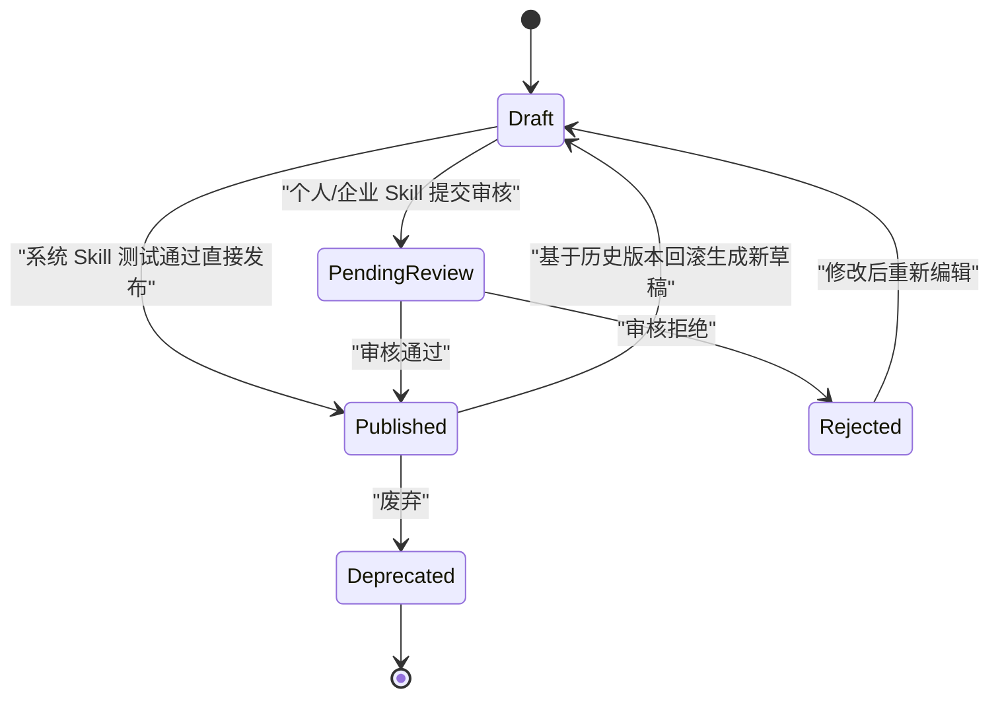
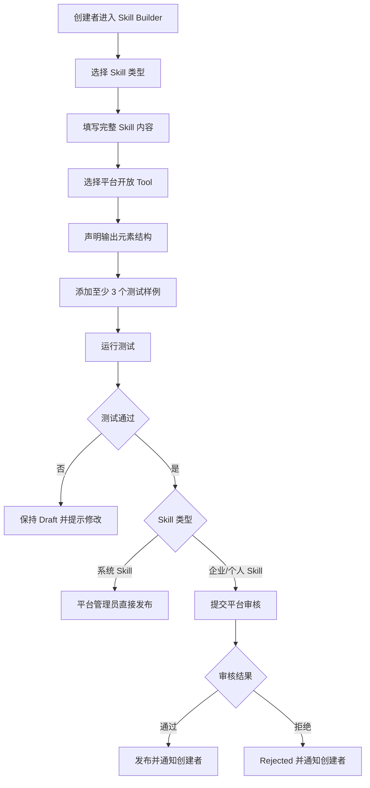

# Skill Builder 与审核 PRD

状态：draft  
owner：产品体验设计师  
更新时间：2026-06-25  
适用范围：系统 Skill、企业 Skill、个人 Skill 的创建、测试、审核、发布、版本和回滚  
product_status：Draft

## 关联文档

- [Skill Builder 产品系统设计](../SkillBuilder产品系统设计.md)
- [Tool 边界与平台开放能力 PRD](./04-Tool边界与平台开放能力PRD.md)
- [资产素材与创作过程 PRD](./08-资产素材与创作过程PRD.md)
- [站内信与通知 PRD](./11-站内信与通知PRD.md)

## 背景

Skill 是统一 Agent 可路由和执行的配置化能力。产品已确认 Skill 不是一段 prompt，而是一套完整能力定义，包括意图、行为、输入、输出、资产元素、Tool、执行步骤、Memory、确认、安全、测试和版本。

## 功能目标

- 支持平台管理员创建系统 Skill。
- 支持企业拥有者创建企业 Skill。
- 支持个人用户创建个人 Skill。
- 企业成员不能创建企业 Skill。
- 企业 Skill 和个人 Skill 必须经平台管理员审核。
- 系统 Skill 不需要审核，平台管理员测试通过后可直接发布。
- Skill 发布前至少需要 3 个测试样例。
- Skill 输出元素必须使用平台内置固定资产元素类型。
- Skill 默认展示最新版本，支持按历史版本回滚。

## 用户角色

| 角色 | 权限/特征 | 核心诉求 |
| --- | --- | --- |
| 平台管理员 | 创建系统 Skill、审核企业/个人 Skill | 建立平台能力和审核质量 |
| 企业拥有者 | 创建企业 Skill | 为企业成员提供共用能力 |
| 个人用户 | 创建个人 Skill | 配置个人创作习惯 |
| 企业成员 | 使用企业 Skill | 使用企业能力创作 |

## 用户故事

- 作为平台管理员，我希望创建系统 Skill 并直接发布，让所有用户使用平台默认能力。
- 作为企业拥有者，我希望创建企业 Skill，让企业成员可以共享创作流程。
- 作为个人用户，我希望创建个人 Skill，把常用创作要求沉淀为可复用能力。
- 作为平台管理员，我希望审核用户提交的 Skill，避免越权 Tool、不可渲染输出和不安全指令发布。

## 功能范围

| 功能 | 描述 | 优先级 |
| --- | --- | --- |
| Skill 基础信息 | 名称、描述、类型、作用域、版本、状态 | P0 |
| 适用意图 | Agent 路由时识别何时使用该 Skill | P0 |
| 行为指令 | 执行目标、限制和禁止事项 | P0 |
| 输入结构 | 用户提供或 Agent 推断的输入 | P0 |
| 输出结构 | 文本、图片、音乐、视频、文件、任务状态 | P0 |
| 输出元素结构 | 使用平台内置元素类型声明黑板和资产详情内容 | P0 |
| Tool 绑定 | 只能选择平台开放 Tool | P0 |
| 执行步骤 | 表单化步骤列表 | P0 |
| Memory | 默认开启，可配置作用域 | P0 |
| 人工确认 | 扣费、高风险、业务写入确认规则 | P0 |
| 测试样例 | 发布前至少 3 个 | P0 |
| 审核发布 | 系统 Skill 免审核，企业/个人 Skill 审核 | P0 |
| 版本回滚 | 默认展示最新版本，支持按版本回滚 | P0 |

## Skill 生命周期

## 功能逻辑

## 页面交互逻辑

### Skill 列表

- 按系统、企业、个人 Skill 分入口展示。
- 展示名称、状态、版本、更新时间、审核状态。
- 默认展示最新版本。
- 支持查看历史版本和回滚。
- Draft、PendingReview、Rejected、Deprecated 不参与 Agent 路由。

### Skill 创建 / 编辑

- 按模块填写 Skill 内容。
- Tool 选择只展示当前可用 Tool。
- 输出元素结构只展示平台内置资产元素类型。
- 缺少必填项时不能提交测试或发布。
- Memory 默认开启。
- 执行步骤第一版为表单化列表，不做拖拽编排。

### Skill 测试

- 发布前至少添加 3 个测试样例。
- 测试需要验证 Skill 是否能产出必填输出元素。
- 测试失败时展示失败原因摘要。
- 测试通过不等于审核通过，企业和个人 Skill 仍需平台审核。

### Skill 审核

- 平台管理员审核企业 Skill 和个人 Skill。
- 审核意见非必填。
- 审核通过后 Skill 进入 Published。
- 审核拒绝后 Skill 进入 Rejected。
- 审核结果通过站内信通知创建者。

## Skill 输出元素结构

Skill 输出元素结构用于声明创作过程和最终资产详情里的结构化内容。

| 元素类型 | 用途示例 |
| --- | --- |
| 短文本 | 标题、名称、口号、关键词 |
| 长文本 | 歌词、剧本、旁白、文案 |
| 富文本 | 分段脚本、方案说明 |
| 结构化对象 | 商品信息、品牌信息、景点信息 |
| 列表 | 卖点列表、镜头列表、素材列表 |
| 图片引用 | 参考图、封面、分镜图、生成图片 |
| 音频引用 | 音乐、BGM、旁白 |
| 视频引用 | 成片、片段、参考视频 |
| 文件引用 | 附件、工程文件 |
| 提示词 | 图片、音乐、视频提示词 |
| 分镜 | 镜头画面、脚本、提示词、状态 |
| 时间线 | 视频段落、音频段落、字幕段落 |
| 标签组 | 风格、情绪、受众 |
| 参数组 | 生成参数摘要 |

规则：

- Skill 不能自定义任意资产元素类型。
- Skill 不能要求前端实现未开放自定义组件。
- Skill 输出元素不能绕过内容安全评估。
- 草稿态元素展示在黑板。
- 最终元素随资产由业务微服务保存。

## 业务规则

- 平台管理员创建系统 Skill。
- 企业拥有者创建企业 Skill。
- 企业成员不能创建企业 Skill。
- 普通用户创建个人 Skill。
- 系统 Skill 不需要审核。
- 企业 Skill 和个人 Skill 需要平台管理员审核。
- 审核意见非必填。
- 企业 Skill 对企业成员全部可见，不支持部门/成员级范围。
- Skill 只能绑定平台开放 Tool。
- Skill 不能写入业务规则或业务事实。
- Skill 不能暴露模型供应商、API Key、内部成本或平台内部配置。

## 异常场景

| 场景 | 触发条件 | 用户提示 | 系统行为 |
| --- | --- | --- | --- |
| 权限不足 | 企业成员创建企业 Skill | 无权创建企业 Skill | 拒绝操作 |
| 测试样例不足 | 少于 3 个样例 | 请至少添加 3 个测试样例 | 阻止提交 |
| Tool 不可用 | 绑定停用 Tool | 当前 Tool 不可用 | 阻止保存或发布 |
| 输出元素非法 | 使用非内置元素类型 | 输出元素类型不可用 | 阻止保存、测试、发布 |
| 审核拒绝 | 平台管理员拒绝 | Skill 审核未通过 | 状态 Rejected，通知创建者 |
| 版本回滚失败 | 历史版本不可用 | 回滚失败 | 保持当前版本 |
| 发布后 Tool 停用 | 已绑定 Tool 被停用 | 该 Skill 当前部分能力不可用 | 执行时不参与或失败提示 |

## 非目标

- 第一版不做可视化拖拽 Workflow/Graph 编排。
- 第一版不让用户创建 Tool。
- 第一版不让 Skill 配置模型 API Key。
- 第一版不支持企业 Skill 部门或成员级可见范围。
- 第一版不允许 Skill 自定义任意资产元素类型或前端组件。

## 注意事项

- Skill 是 Agent 可路由能力，不是业务权限系统。
- Skill 不能替代业务微服务的规则校验。
- Skill 审核关注 Tool 边界、输出结构、安全策略、测试样例和用户可理解性。
- 历史版本回滚应形成新的可审计版本，不应覆盖历史记录。

## 验收标准

- [ ] 平台管理员可创建系统 Skill 并测试后直接发布。
- [ ] 企业拥有者可创建企业 Skill 并提交审核。
- [ ] 企业成员不能创建企业 Skill。
- [ ] 个人用户可创建个人 Skill 并提交审核。
- [ ] Skill 创建必须包含完整内容，不只是 prompt。
- [ ] Skill 发布前至少有 3 个测试样例。
- [ ] Skill 测试验证必填输出元素。
- [ ] Skill 只能绑定平台开放 Tool。
- [ ] Skill 输出元素只能使用平台内置固定资产元素类型。
- [ ] 企业/个人 Skill 审核结果通过站内信通知创建者。
- [ ] 默认展示最新版本，支持历史版本回滚。
- [ ] Draft、PendingReview、Rejected、Deprecated 不参与 Agent 路由。

## Done Gate

- [ ] Skill 类型和权限确认。
- [ ] Skill 内容字段确认。
- [ ] 输出元素结构确认。
- [ ] 测试和审核流程确认。
- [ ] 版本回滚规则确认。
- [ ] product_status 更新为 Done 后，才允许进入正式工程开发。

