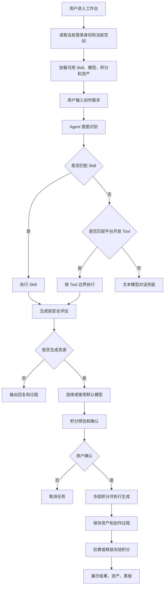

# 统一 Agent 创作工作台 PRD

状态：active
owner：产品与需求责任域
更新时间：2026-06-25
适用范围：统一 Agent、创作工作台、意图识别、Skill 路由、对话、生成、确认、资产和黑板
product_status：Done

## 关联文档

- [统一 Agent 产品系统设计](../统一Agent产品系统设计.md)
- [AG-UI 与 A2UI 交互 PRD](./09-AG-UI与A2UI交互PRD.md)
- [资产素材与创作过程 PRD](./08-资产素材与创作过程PRD.md)
- [积分账户兑换码与扣费 PRD](./07-积分账户兑换码与扣费PRD.md)
- [内容安全治理 PRD](./10-内容安全治理PRD.md)

## 背景

第一版只使用一个统一 Agent。用户不需要理解多个 Agent 的差异，只需要在创作工作台输入需求、选择必要模型或素材、确认扣费，即可完成图片、音乐、视频和组合式创作。

## 功能目标

- 提供一个普通用户和企业空间共用的统一 Agent 创作工作台。
- Agent 基于当前空间加载可用 Skill 池。
- Agent 基于用户意图选择 Skill；无合适 Skill 时用文本模型对话兜底。
- 用户可在聊天输入框选择图片、音乐、视频生成模型，当前对话生效。
- 生成前完成提示词安全评估、积分预估和人工确认。
- 生成过程通过 AG-UI/A2UI 展示思考状态、Tool、进度、资产和黑板。
- 生成完成后保存资产和创作过程。

## 用户角色

| 角色 | 权限/特征 | 核心诉求 |
| --- | --- | --- |
| 个人用户 | 个人空间创作 | 使用个人积分生成个人资产 |
| 企业成员 | 企业空间创作 | 使用企业积分生成企业空间资产 |
| 企业拥有者 | 企业空间创作和积分管理 | 使用企业能力创作并管理企业积分 |

## 用户故事

- 作为用户，我希望打开一个工作台就能完成音乐、图片、视频和组合式创作。
- 作为用户，我希望模型、积分、确认和进度都在对话里自然出现。
- 作为用户，我希望视频类创作能在黑板中看到分镜、脚本、提示词和素材。
- 作为用户，我希望创作完成后资产自动保存，后续能在原会话里继续引用。

## 功能范围

| 功能 | 描述 | 优先级 |
| --- | --- | --- |
| 对话输入 | 文本、文件、素材引用、输入控件 | P0 |
| 意图识别 | 文本模型理解用户要做什么 | P0 |
| Skill 路由 | 从当前空间 Skill 池选择 Skill | P0 |
| 对话兜底 | 无 Skill 时文本模型继续对话 | P0 |
| 直接 Tool 意图 | 无 Skill 但意图匹配平台开放基础 Tool 时可调用 | P0 |
| 模型选择 | 图片、音乐、视频模型在聊天输入框选择 | P0 |
| 内容安全 | 生成前提示词安全评估 | P0 |
| 积分确认 | 预估、确认、冻结 | P0 |
| 生成进度 | 图片、音乐、视频生成任务状态 | P0 |
| 资产视图 | 展示生成或上传素材 | P0 |
| 黑板视图 | 展示 Skill 产出的元素、故事线、分镜、提示词 | P0 |
| 会话恢复 | 从历史进入原会话并恢复对话、资产和黑板 | P0 |

## 功能逻辑

## 页面交互逻辑

### 工作台布局

- 左侧或主区域为聊天区域，承载消息流、思考状态、输入控件、确认、进度和错误。
- 聊天外部只有一个工作区组件，支持资产视图和黑板视图切换。
- 普通用户端和企业空间共用同一个工作台，通过当前空间改变上下文。
- 当前空间应在页面中可识别，但不应让用户在工作台内做复杂企业管理。

### 聊天输入框

- 支持文本输入。
- 支持上传文件或选择已有资产。
- 支持模型选择、单选、多选、输入框等控件。
- 模型选择只展示图片、音乐、视频生成模型。
- 进入扣费确认后输入控件锁定。

### 思考状态与 Tag

- 思考状态打印机只展示可公开处理状态。
- 支持 Skill、Tool、Model、Risk、Status Tag。
- Tag 只展示公开名称、状态和风险，不展示内部 ID、供应商、成本、密钥。

### 确认与生成

- 生成前必须展示预计消耗积分、可用积分和即将过期积分。
- 高风险 Tool、扣费、业务写入必须确认。
- 用户确认后先冻结积分，再执行生成。
- 用户取消后不再发起新 Tool。
- 长任务生成中可展示进度和取消入口。

### 资产视图与黑板视图

- 资产视图展示图片、音乐、视频、上传素材和中间素材。
- 黑板视图展示 Skill 输出元素草稿、故事线、分镜、脚本、提示词和生成状态。
- 视频类 Skill 按分镜展示图片、脚本、提示词和任务状态。
- 资产和黑板按平台内置资产元素类型渲染，不按具体场景硬编码字段。

## 支持的典型创作场景

第一版不为以下场景单独建立业务模块，但统一 Agent 必须通过 Skill、Tool 和资产元素组合覆盖：

- 音乐创作。
- MV 制作。
- 短视频制作。
- 电商商品图。
- 电商广告视频。
- 文旅宣传视频。
- 品牌 LOGO。

## Agent 能力清单

| 能力 | 输入 | 输出 | 依赖 | 是否确认 |
| --- | --- | --- | --- | --- |
| 意图识别 | 用户消息、上下文 | 意图分类、候选 Skill | 文本模型 | 否 |
| Skill 路由 | 当前空间、Skill 池、意图 | 选中 Skill 或无匹配 | 文本模型 | 否 |
| 文本对话 | 用户消息 | 文本回复 | 文本模型 | 否 |
| 图片生成 | prompt、参考图、模型、数量 | 图片资产 | 图片模型 Tool、积分 | 是 |
| 音乐生成 | prompt、歌词、风格、模型 | 音乐资产 | 音乐模型 Tool、积分 | 是 |
| 视频生成 | prompt、分镜、图片、模型、时长 | 视频资产 | 视频模型 Tool、积分 | 是 |
| 视觉理解 | 图片、分析目标 | 图片分析结果 | 视觉模型 Tool | 按风险 |
| 资产引用 | 已有资产 | 引用关系和输入素材 | 业务资产 API/RPC | 否 |

## 业务规则

- 系统只提供一个统一 Agent。
- Agent 每次执行必须绑定当前空间。
- 当前空间由登录或身份切换决定。
- 个人空间加载系统 Skill 和个人 Skill。
- 企业空间加载系统 Skill、企业 Skill 和个人 Skill。
- 无匹配 Skill 时不提示用户创建 Skill，使用文本模型对话兜底。
- 无匹配 Skill 但意图匹配平台开放 Tool，可按 Tool 边界调用。
- 生成类任务必须先安全评估，再积分预估和确认。
- 生成完成且资产保存成功后才扣费。
- 会话、消息、运行、事件、Tool 调用、黑板和资产引用持续保存。
- 产物详情第一版不提供独立继续创作入口，只能在原会话中引用资产继续创作。

## 异常场景

| 场景 | 触发条件 | 用户提示 | 系统行为 |
| --- | --- | --- | --- |
| 无可用 Skill | 无匹配 Skill | 正常对话回复 | 文本模型兜底 |
| Skill 不可用 | Skill 非 Published 或停用 | 该能力当前不可用 | 不参与路由 |
| Tool 不可用 | Tool 停用或无权限 | 当前能力不可用 | 中止执行 |
| 安全评估不通过 | 提示词不安全 | 请修改提示词 | 不冻结、不生成 |
| 积分不足 | 可用积分不足 | 积分不足 | 不确认、不冻结 |
| 用户取消确认 | 拒绝扣费或高风险确认 | 已取消 | 不执行 Tool |
| 生成失败 | 模型失败或超时 | 生成失败 | 释放冻结积分 |
| 部分完成 | 批量或长任务部分成功 | 部分内容已生成 | 已保存扣费，未完成释放 |
| 断线重连失败 | 事件不可补偿 | 已恢复到最新状态 | 用快照恢复 |

## 非目标

- 第一版不做多 Agent。
- 第一版不让用户创建 Agent。
- 第一版不支持脱离会话的继续创作按钮。
- 第一版不做多人协作编辑。
- 第一版不在工作台内展示供应商、成本、密钥和内部模型 ID。

## 注意事项

- Agent 不是业务规则最终解释者，业务事实必须由业务微服务维护。
- 工作台中所有实时状态必须来自 AG-UI/A2UI 事件。
- 断线重连后前端不能假定任务失败，应先走事件补偿或快照恢复。
- 用户选择模型当前对话生效，不跨会话保留。

## 验收标准

- [ ] 用户只面对一个统一 Agent 工作台。
- [ ] 工作台能按当前空间加载 Skill 池。
- [ ] 无匹配 Skill 时使用文本模型对话兜底。
- [ ] 生成任务可在聊天输入框选择模型。
- [ ] 模型选择当前对话生效，确认后锁定。
- [ ] 生成前完成提示词安全评估。
- [ ] 安全评估不通过时不冻结积分、不生成。
- [ ] 扣费前展示积分预估并要求确认。
- [ ] 生成中展示进度、Tool 状态和取消入口。
- [ ] 生成完成后保存资产和创作过程。
- [ ] 资产视图和黑板视图可展示 Skill 输出元素。
- [ ] 会话历史可进入原会话并恢复对话、资产和黑板。
- [ ] 典型创作场景可由 Skill 和 Tool 组合覆盖。

## Done Gate

- [x] 工作台主流程确认。
- [x] Agent 能力清单确认。
- [x] 模型选择、积分确认、安全评估顺序确认。
- [x] 资产和黑板交互确认。
- [x] 验收标准可测试。
- [x] product_status 已更新为 Done，允许进入工程需求映射与契约先行阶段。

