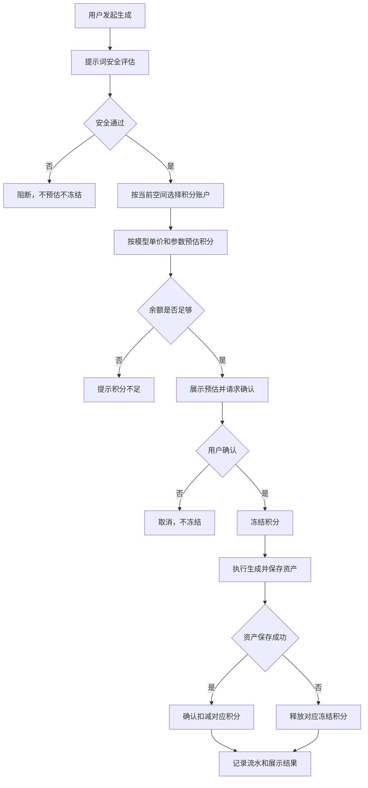
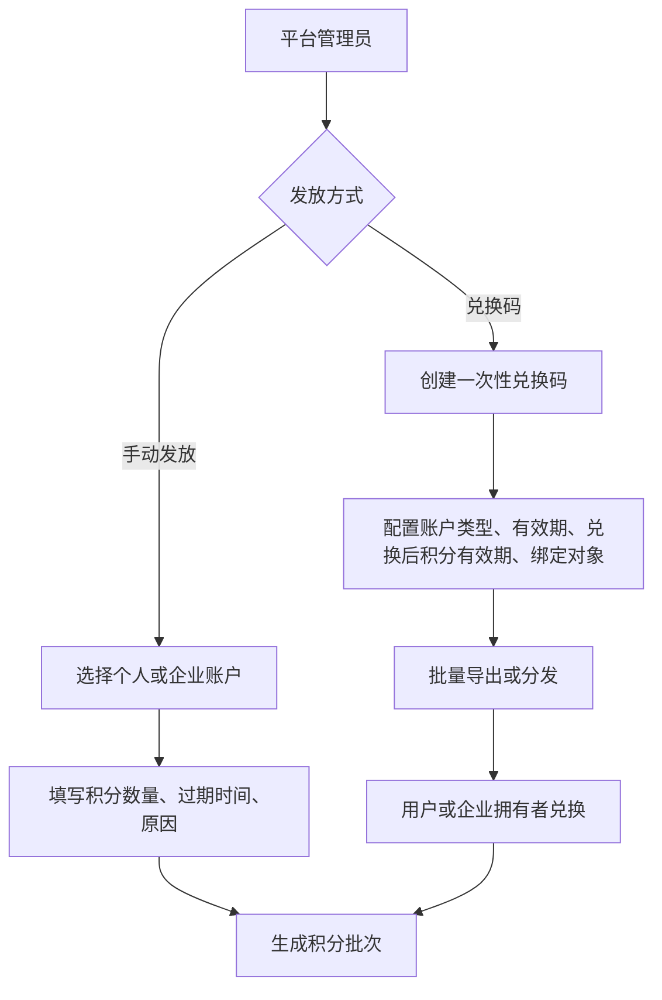

# 积分账户兑换码与扣费 PRD

状态：draft  
owner：产品体验设计师  
更新时间：2026-06-25  
适用范围：个人积分、企业积分、积分来源、兑换码、有效期、预估、冻结、扣减、释放、流水  
product_status：Draft

## 关联文档

- [积分扣费产品系统设计](../积分扣费产品系统设计.md)
- [积分来源与有效期产品系统设计](../积分来源与有效期产品系统设计.md)
- [账户身份企业与空间 PRD](./01-账户身份企业与空间PRD.md)
- [模型供应商模型选择与单价 PRD](./03-模型供应商模型选择与单价PRD.md)

## 背景

图片、音乐、视频生成会产生成本，需要用积分体系控制用户侧消耗。第一版不做在线购买积分包，积分来源为平台管理员手动发放和兑换码兑换。积分有有效期，不允许永久有效。

## 功能目标

- 支持个人积分账户和企业积分账户。
- 支持平台管理员手动给个人或企业发放积分。
- 支持一次性兑换码兑换积分。
- 支持积分有效期和即将过期积分展示。
- 支持图片按张、音乐按首、视频按秒计费。
- 支持生成前积分预估、人工确认、冻结、扣减、释放。
- 支持企业拥有者查看企业积分、流水、账单和成员消耗明细。
- 支持企业普通成员查看自己的企业空间积分消耗明细。

## 用户角色

| 角色 | 权限/特征 | 核心诉求 |
| --- | --- | --- |
| 个人用户 | 使用个人积分 | 查看余额、兑换码、消耗明细 |
| 企业拥有者 | 管理企业积分 | 查看企业余额、流水、账单、成员消耗，兑换企业码 |
| 企业成员 | 消耗企业积分 | 查看自己的消耗明细 |
| 平台管理员 | 发放积分、创建兑换码 | 运营发放和控制有效期 |

## 用户故事

- 作为用户，我希望生成前知道预计消耗多少积分，避免误扣费。
- 作为用户，我希望失败或取消后未完成部分自动释放积分。
- 作为企业拥有者，我希望查看企业积分余额和成员消耗。
- 作为平台管理员，我希望用后台手动发放和兑换码发放第一版积分。

## 功能范围

| 功能 | 描述 | 优先级 |
| --- | --- | --- |
| 积分账户 | 个人账户、企业账户 | P0 |
| 后台发放 | 平台管理员给个人或企业发放积分 | P0 |
| 兑换码 | 一次性兑换码、绑定对象、有效期、导出 | P0 |
| 有效期 | 积分批次过期、即将过期展示 | P0 |
| 预估 | 生成前按模型单价和数量/秒数预估 | P0 |
| 确认 | 扣费前人工确认 | P0 |
| 冻结 | 用户确认后先冻结积分 | P0 |
| 扣减 | 资产保存成功后确认扣费 | P0 |
| 释放 | 失败、取消、超时、保存失败释放 | P0 |
| 流水明细 | 账户流水、成员消耗明细 | P0 |

## 计费规则

| 资源类型 | 计费单位 | 单价来源 |
| --- | --- | --- |
| 图片 | 张 | 图片生成模型积分单价 |
| 音乐 | 首 | 音乐生成模型积分单价 |
| 视频 | 秒 | 视频生成模型积分单价 |
| 文本 | 不对用户单独展示 | 平台内部成本 |
| 视觉理解 | 不对用户单独展示 | 平台内部成本 |

## 功能逻辑

## 积分来源流程

## 页面交互逻辑

### 用户端积分页

- 展示当前空间积分余额。
- 展示即将过期积分数量和过期时间。
- 展示积分流水和消耗明细。
- 个人空间可兑换个人兑换码。
- 企业空间只有企业拥有者可兑换企业兑换码。
- 企业成员只看自己的企业空间消耗明细。

### 扣费确认组件

- 展示资源类型、数量或秒数、模型名称、预计积分、可用积分、即将过期积分。
- 积分不足时不展示确认按钮。
- 进入确认后模型和生成参数锁定。
- 用户取消后返回可编辑状态。

### 平台后台积分发放

- 选择目标账户类型：个人或企业。
- 填写积分数量、过期时间、发放原因。
- 发放前确认。
- 发放结果进入审计日志。

### 兑换码管理

- 创建兑换码时配置积分数量、兑换码有效期、兑换后积分有效期、可兑换账户类型、可选绑定对象。
- 支持批量创建和导出。
- 已兑换、过期、停用状态可查看。

## 业务规则

- 积分账户、批次、冻结、扣减、释放、过期和流水由业务微服务负责。
- Agent 不保存积分账户或扣费事实。
- 当前空间决定扣费账户。
- 个人空间扣个人积分。
- 企业空间扣企业积分，不自动切换个人积分。
- 第一版不做在线购买积分包。
- 后台手动发放和兑换码兑换都必须产生积分批次。
- 不允许永久有效积分。
- 扣减优先消耗最早过期积分。
- 冻结后过期的积分，生成成功仍可确认扣减；任务失败释放后按原过期时间处理。
- 释放冻结积分不延长有效期。
- 生成完成且资产保存成功后才扣费。
- 批量或部分完成时，已保存资产扣费，失败或未完成部分释放。

## 兑换码规则

- 第一版只支持一次性兑换码。
- 一个兑换码只能成功兑换一次。
- 可选绑定指定用户、企业或渠道。
- 个人兑换入口只能充入个人积分账户。
- 企业兑换入口只能由企业拥有者操作，充入当前企业积分账户。
- 兑换码自身有效期和兑换后积分有效期是两个概念。
- 平台管理员可批量导出兑换码。

## 异常场景

| 场景 | 触发条件 | 用户提示 | 系统行为 |
| --- | --- | --- | --- |
| 积分不足 | 预估大于可用余额 | 积分不足 | 不冻结不生成 |
| 安全评估失败 | LLM 评估失败或超时 | 暂时无法评估安全性 | 不预估不冻结 |
| 冻结失败 | 业务服务冻结失败 | 暂时无法生成 | 不执行生成 |
| 生成失败 | 模型或 Tool 失败 | 生成失败 | 释放冻结积分 |
| 资产保存失败 | 生成完成但保存失败 | 资产保存失败 | 释放该资产积分 |
| 兑换码无效 | 不存在、过期、停用、已使用 | 兑换码无效 | 拒绝兑换 |
| 账户类型不匹配 | 企业码个人兑换 | 不适用于当前空间 | 拒绝兑换 |
| 企业成员兑换 | 企业成员兑换企业码 | 无权兑换到企业账户 | 拒绝兑换 |

## 非目标

- 第一版不做在线购买积分包。
- 第一版不做支付、订单、发票、退款。
- 第一版不做注册赠送和企业开通赠送自动规则。
- 第一版不做积分转赠、个人转企业、企业转个人。
- 第一版不做多次使用兑换码。
- 第一版不做质量、分辨率、时长上限倍率。

## 注意事项

- 用户积分价格和平台内部成本是两套概念。
- 模型单价为 0 也要走确认和记录流程。
- 企业积分管理权限不带来成员资产可见权限。
- 资产保存失败不能扣费，因为用户没有得到可用资产。

## 验收标准

- [ ] 平台管理员可给个人和企业手动发放积分。
- [ ] 平台管理员可创建、停用、批量导出兑换码。
- [ ] 用户可在个人空间兑换个人可用兑换码。
- [ ] 企业拥有者可在企业空间兑换企业可用兑换码。
- [ ] 兑换码一次性使用，过期、已用、停用不可兑换。
- [ ] 积分按批次拥有有效期，不允许永久有效。
- [ ] 用户侧显示即将过期积分。
- [ ] 图片按张、音乐按首、视频按秒预估积分。
- [ ] 生成前先安全评估，再预估和确认。
- [ ] 用户确认后先冻结积分，再执行生成。
- [ ] 资产保存成功后确认扣费。
- [ ] 失败、取消、超时、保存失败释放未完成冻结积分。
- [ ] 企业成员可看自己的企业空间消耗明细。

## Done Gate

- [ ] 积分来源确认。
- [ ] 有效期和兑换码规则确认。
- [ ] 扣费闭环确认。
- [ ] 企业积分权限确认。
- [ ] 验收标准可测试。
- [ ] product_status 更新为 Done 后，才允许进入正式工程开发。

