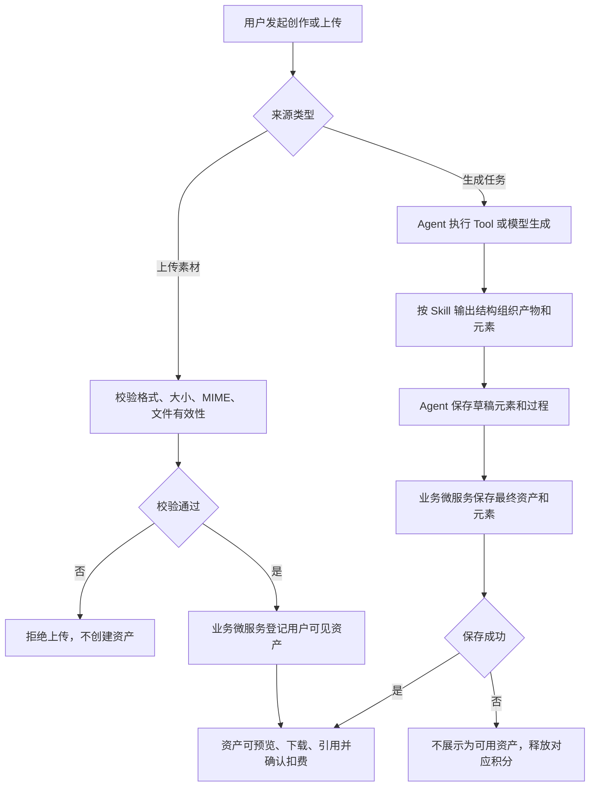
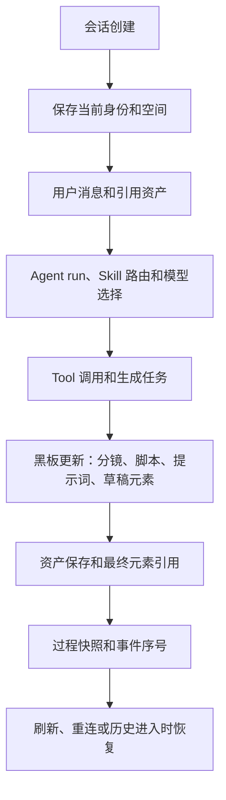

# 资产素材与创作过程 PRD

状态：draft  
owner：产品体验设计师  
更新时间：2026-06-25  
适用范围：生成资产、上传素材、资产元素、黑板、会话、创作过程、预览下载和权限  
product_status：Draft

## 关联文档

- [资产与创作过程保存产品系统设计](../资产与创作过程保存产品系统设计.md)
- [统一 Agent 创作工作台 PRD](./06-统一Agent创作工作台PRD.md)
- [积分账户兑换码与扣费 PRD](./07-积分账户兑换码与扣费PRD.md)
- [AG-UI 与 A2UI 交互 PRD](./09-AG-UI与A2UI交互PRD.md)
- [作品中心与精选作品 PRD](./12-作品中心与精选作品PRD.md)

## 背景

AIGC 创作会产生图片、音乐、视频、脚本、歌词、分镜、提示词、参考素材等内容。不同场景的资产元素不同，不能把音乐名称、音乐歌词、剧本名称、剧本详情等字段写成固定场景表单。第一版需要用平台内置资产元素类型和 Skill 输出元素结构承接多场景内容。

## 功能目标

- 自动保存生成图片、音乐、视频和需要复用的中间素材。
- 支持上传图片、音频、视频、文档素材。
- 用平台内置资产元素类型表达不同场景下的标题、歌词、剧本、分镜、提示词等内容。
- 保存会话、消息、Agent run、Tool 调用、黑板、分镜、脚本、提示词和资产引用。
- 支持资产预览、下载和会话内引用。
- 支持断线重连后恢复创作过程。
- 明确业务微服务保存资产事实，Agent 微服务保存创作过程和引用。
- 支持已保存资产被用户加入个人作品中心；公开分享逻辑由作品中心 PRD 承接。

## 用户角色

| 角色 | 权限/特征 | 核心诉求 |
| --- | --- | --- |
| 个人用户 | 个人空间资产 | 查看、预览、下载、引用个人资产 |
| 企业成员 | 企业空间本人资产 | 查看、预览、下载、引用自己创建的企业空间资产 |
| 企业拥有者 | 企业空间本人资产和企业积分 | 不额外查看成员资产 |
| Skill 创建者 | 声明 Skill 输出元素 | 让黑板和资产详情可渲染 |

## 用户故事

- 作为用户，我希望生成完成后图片、音乐、视频自动保存，不需要手动另存。
- 作为用户，我希望在原会话中继续引用已生成资产，例如基于图片做视频。
- 作为用户，我希望视频创作过程中的分镜、脚本和提示词能保存在黑板。
- 作为 Skill 创建者，我希望用通用资产元素类型定义不同场景的输出。

## 功能范围

| 功能 | 描述 | 优先级 |
| --- | --- | --- |
| 生成资产保存 | 图片、音乐、视频生成成功后保存 | P0 |
| 上传素材 | 图片、音频、视频、文档上传约束 | P0 |
| 资产元素 | 平台内置固定元素类型和 Skill 输出结构 | P0 |
| 黑板 | 保存故事线、分镜、脚本、提示词、草稿元素 | P0 |
| 会话过程 | 保存消息、run、事件、Tool、任务和引用 | P0 |
| 预览下载 | 有权限资产都可预览和下载 | P0 |
| 会话恢复 | 从会话历史进入原会话恢复资产和黑板 | P0 |
| 权限 | 当前空间、创建者和成员状态控制访问 | P0 |
| 加入作品中心 | 从已保存资产创建个人作品 | P0 |

## 资产与过程逻辑

## 创作过程保存逻辑

## 资产类型

| 资产类型 | 来源 | 保存规则 | 展示位置 |
| --- | --- | --- | --- |
| 生成图片 | 图片生成 Tool | 生成完成且保存成功后自动保存 | 资产视图、产物历史、详情 |
| 生成音乐 | 音乐生成 Tool | 生成完成且保存成功后自动保存 | 资产视图、产物历史、详情 |
| 生成视频 | 视频生成 Tool | 生成完成且保存成功后自动保存 | 资产视图、产物历史、详情 |
| 上传素材 | 用户上传 | 上传校验通过后保存 | 资产视图、输入素材选择 |
| 中间素材 | Skill 过程产出 | 需要展示或复用时保存 | 黑板、资产视图 |

## 上传素材约束

| 类型 | 允许格式 | 单文件上限 | 失败处理 |
| --- | --- | --- | --- |
| 图片 | jpg、jpeg、png、webp | 20MB | 拒绝上传，提示格式或大小 |
| 音频 | mp3、wav、m4a | 100MB | 拒绝上传，提示格式或大小 |
| 视频 | mp4、mov、webm | 500MB | 拒绝上传，提示格式或大小 |
| 文档/文本 | txt、md、pdf、doc、docx | 50MB | 拒绝上传，提示格式或大小 |

上传文本信息如标题、说明、标签需要进行 LLM 提示词安全评估。第一版不对上传媒体文件本身做多模态安全审核。

## 资产元素类型

| 类型 | 用途示例 |
| --- | --- |
| 短文本 | 名称、标题、口号、关键词 |
| 长文本 | 歌词、剧本详情、旁白、文案 |
| 富文本 | 带段落结构的脚本、方案 |
| 结构化对象 | 商品信息、品牌信息、景点信息 |
| 列表 | 卖点、镜头、素材列表 |
| 图片引用 | 参考图、封面、分镜图、生成图片 |
| 音频引用 | 音乐、BGM、旁白、音效 |
| 视频引用 | 成片、片段、参考视频 |
| 文件引用 | 附件、工程文件 |
| 提示词 | 图片、音乐、视频生成提示词 |
| 分镜 | 镜头画面、脚本、提示词、状态 |
| 时间线 | 视频段落、音频段落、字幕 |
| 标签组 | 风格、场景、情绪、受众 |
| 参数组 | 生成参数摘要 |

规则：

- 第一版不提供资产元素类型后台配置入口。
- 资产元素类型不能散落硬编码在业务代码中，应作为平台内置配置或系统字典维护。
- Skill 只能组合平台内置资产元素类型。
- 前端按元素类型渲染，不按音乐、MV、电商图等场景写死字段。

## 页面交互逻辑

### 资产视图

- 展示当前用户有权限访问的图片、音乐、视频和上传素材。
- 支持预览、下载、选择为输入素材、查看详情。
- 生成中资产展示保存中状态。
- 保存失败资产不展示为可用资产。

### 黑板视图

- 展示 Skill 产出的草稿态资产元素。
- 视频类 Skill 按分镜展示图片、脚本、提示词和生成状态。
- 支持从黑板引用素材到后续会话输入。
- 黑板更新由 AG-UI 事件驱动。

### 产物历史与详情

- 产物历史展示已保存资产。
- 详情展示资产预览、下载、元素、来源会话、生成状态。
- 支持从已保存资产创建个人作品，作品管理和公开分享见 [作品中心与精选作品 PRD](./12-作品中心与精选作品PRD.md)。
- 第一版不提供独立“继续创作”按钮。
- 用户可从来源会话进入原会话并引用资产继续创作。

### 会话历史

- 展示历史会话列表。
- 进入原会话后恢复对话、资产视图和黑板。
- 断线重连通过事件补偿或 run 快照恢复。

## 保存边界

| 数据 | 保存方 |
| --- | --- |
| 用户可见资产事实 | 业务微服务 |
| 最终资产元素 | 业务微服务 |
| 资产归属、权限、预览、下载 | 业务微服务 |
| 上传素材登记 | 业务微服务 |
| 会话、run、消息、事件、Tool 调用 | Agent 微服务 |
| 黑板和草稿态资产元素 | Agent 微服务 |
| 产物引用、资产引用关系 | Agent 微服务 |
| 积分账单和资产扣费关联 | 业务微服务 |

## 权限规则

- 个人空间资产仅本人可见。
- 企业空间第一版资产仅创建者本人可见。
- 企业拥有者不额外查看成员资产。
- 被移出企业后，用户失去企业空间资产和创作过程访问权限。
- 有权限访问的资产都支持预览和下载。
- 资产文件存储在火山引擎 TOS，第一版不设置业务有效期。

## 异常场景

| 场景 | 触发条件 | 用户提示 | 系统行为 |
| --- | --- | --- | --- |
| 上传失败 | 格式、大小、MIME、空文件或损坏 | 文件不可上传 | 不创建资产 |
| 保存失败 | 生成完成但业务保存失败 | 资产保存失败 | 不展示可用资产，不扣费 |
| 引用无权限 | 选择不可访问资产 | 无权使用该资产 | 阻止引用 |
| 元素缺失 | 必填资产元素缺失 | 内容不完整 | 阻止转为最终资产或提示重试 |
| 元素类型不支持 | Skill 声明非法类型 | 输出结构不可用 | 阻止审核或保存 |
| 预览失败 | 预览服务异常 | 预览失败，请重试 | 保留资产，允许下载 |
| 重连补偿失败 | 事件超过补偿窗口 | 已恢复到最新状态 | 用快照恢复 |

## 非目标

- 第一版不做资产删除、回收站、恢复。
- 第一版不做多人协作编辑。
- 第一版不做资产跨空间转移。
- 第一版不做企业资产库管理。
- 第一版不保存模型内部推理链路、系统提示词、密钥和供应商原始响应。
- 公开分享不在本 PRD 内实现，由 [作品中心与精选作品 PRD](./12-作品中心与精选作品PRD.md) 承接。

## 注意事项

- 资产保存成功是扣费确认的前置条件。
- 资产元素用于多场景表达，不能把单个场景字段写死为数据库字段或前端组件。
- 创作过程保存失败不应影响已保存资产，但需要向用户提示过程保存状态。
- TOS 文件链接可以短期签名，但业务资产本身不设置有效期。

## 验收标准

- [ ] 生成图片、音乐、视频成功后保存为用户可见资产。
- [ ] 上传素材校验格式、大小、MIME 和文件有效性。
- [ ] 上传失败不创建资产、不扣费。
- [ ] Skill 输出元素只能使用平台内置固定资产元素类型。
- [ ] 草稿态元素保存在黑板，最终元素由业务微服务保存。
- [ ] 前端按资产元素类型渲染资产详情和黑板。
- [ ] 资产保存成功后才确认对应扣费。
- [ ] 资产保存失败时不展示可用资产并释放冻结积分。
- [ ] 用户可从会话历史进入原会话恢复对话、资产和黑板。
- [ ] 有权限资产可预览和下载。
- [ ] 企业拥有者不额外查看成员资产和创作过程。
- [ ] 已保存资产可以作为创建个人作品的来源。

## Done Gate

- [ ] 资产范围确认。
- [ ] 资产元素类型确认。
- [ ] 上传约束确认。
- [ ] 保存边界确认。
- [ ] 权限和预览下载规则确认。
- [ ] product_status 更新为 Done 后，才允许进入正式工程开发。
