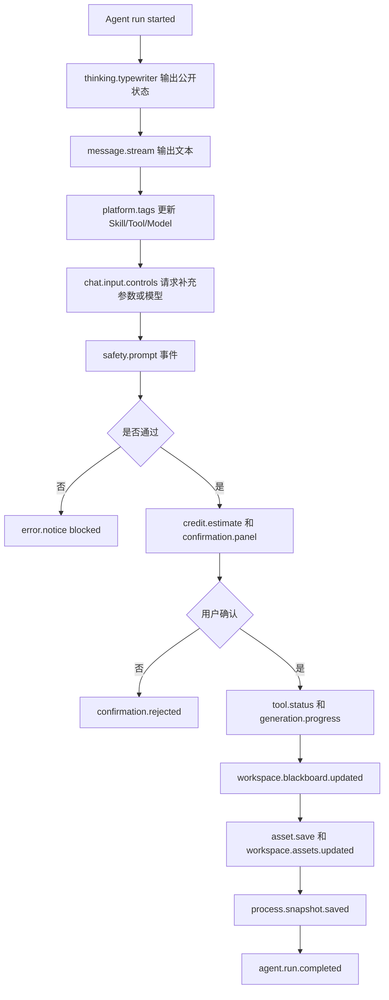
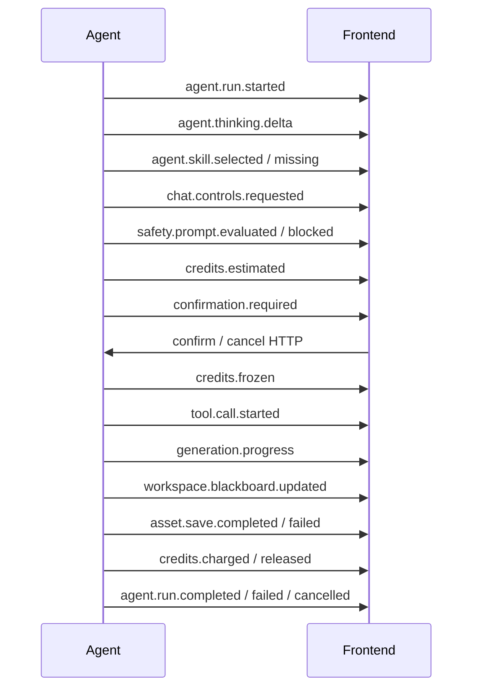

# AG-UI 与 A2UI 交互 PRD

状态：draft  
owner：产品体验设计师  
更新时间：2026-06-25  
适用范围：统一 Agent 到前端的实时事件、组件、payload、顺序、断线重连和前端消费规则  
product_status：Draft

## 关联文档

- [AG-UI 与 A2UI 交互契约产品系统设计](../AG-UI与A2UI交互契约产品系统设计.md)
- [统一 Agent 创作工作台 PRD](./06-统一Agent创作工作台PRD.md)
- [资产素材与创作过程 PRD](./08-资产素材与创作过程PRD.md)
- [AG-UI 事件规范](../../standards/AG-UI事件规范.md)

## 背景

统一 Agent 的对话、思考状态、Skill、Tool、模型、积分、确认、生成进度、资产保存、黑板更新和错误都需要实时展示。AG-UI/A2UI 是智能体微服务到前端的事件和组件边界，前端不能自行解释 Eino 内部事件。

## 功能目标

- 定义工作台需要的聊天区域组件和聊天外部组件。
- 定义事件类型、公共 payload、事件顺序和断线重连口径。
- 支持思考状态打印机输出，但不暴露内部推理链路。
- 支持 Skill、Tool、Model、Risk、Status 等平台能力 Tag。
- 支持积分预估、人工确认、Tool 状态、生成进度、资产和黑板。
- 支持未知事件兼容忽略、事件幂等、顺序消费和补偿恢复。

## 用户角色

| 角色 | 权限/特征 | 核心诉求 |
| --- | --- | --- |
| 普通用户 | 消费工作台 UI | 理解任务状态、确认操作、查看结果 |
| 前端开发工程师 | 消费 AG-UI 事件 | 稳定渲染组件和状态 |
| Agent 微服务 | 生产 AG-UI 事件 | 将 Eino/Agent 过程映射为前端契约 |

## 用户故事

- 作为用户，我希望看到 Agent 正在做什么，但不需要看到内部推理链路。
- 作为用户，我希望生成进度、Tool 状态和资产保存状态清楚可见。
- 作为用户，我希望网络断开后页面能恢复到最新状态。
- 作为前端开发者，我希望所有组件和字段都有契约，不需要猜后端事件。

## 组件范围

### 聊天区域组件

| 组件 key | 作用 | 关键状态 | 主要动作 |
| --- | --- | --- | --- |
| `message.stream` | Agent 文本增量输出 | streaming、completed、failed | 停止、复制 |
| `thinking.typewriter` | 可公开处理状态打印机 | typing、completed、collapsed | 展开、折叠 |
| `platform.tags` | Skill、Tool、Model、Risk、Status Tag | visible、active、disabled | 查看说明 |
| `credit.estimate` | 积分预估和余额 | estimating、ready、insufficient | 查看明细 |
| `confirmation.panel` | 扣费、高风险、业务写入确认 | required、accepted、rejected、expired | 确认、取消 |
| `tool.status` | Tool 调用状态 | running、succeeded、failed、timeout | 重试、查看详情 |
| `generation.progress` | 生成任务进度 | queued、running、partial_completed、completed | 取消、查看已完成 |
| `error.notice` | 错误提示 | user_error、permission_denied、tool_error、model_error、system_error | 重试、修改 |
| `chat.input.controls` | 模型选择、单选、多选、输入、素材选择 | idle、editing、locked、invalid | 选择、填写、提交 |

### 聊天外部组件

| 组件 key | 作用 | 关键状态 | 主要动作 |
| --- | --- | --- | --- |
| `workspace.panel` | 展示资产视图和黑板视图 | empty、assets、blackboard、updating、error | 切换、预览、引用 |

聊天外部第一版只有一个外部工作区组件，不再拆多个独立外部组件。

## 功能逻辑

## 事件建议清单

| 事件类型 | 触发时机 | 消费组件 |
| --- | --- | --- |
| `agent.run.started` | run 开始 | `message.stream` |
| `agent.thinking.started` / `agent.thinking.delta` / `agent.thinking.completed` | 公开思考状态 | `thinking.typewriter` |
| `agent.message.delta` / `agent.message.completed` | 文本输出 | `message.stream` |
| `agent.skill.selected` / `agent.skill.missing` | Skill 选择或缺失 | `platform.tags` / `message.stream` |
| `platform.tags.updated` | 平台能力标签变化 | `platform.tags` |
| `chat.controls.requested` / `chat.controls.locked` | 输入控件展示或锁定 | `chat.input.controls` |
| `safety.prompt.evaluated` / `safety.prompt.blocked` | 安全评估 | `error.notice` |
| `credits.estimated` / `credits.frozen` / `credits.charged` / `credits.released` | 积分状态 | `credit.estimate` |
| `confirmation.required` / `confirmation.accepted` / `confirmation.rejected` | 人工确认 | `confirmation.panel` |
| `tool.call.started` / `tool.call.progress` / `tool.call.completed` / `tool.call.failed` | Tool 调用 | `tool.status` |
| `generation.progress` / `generation.artifact.completed` | 生成进度和单个产物 | `generation.progress` |
| `asset.save.started` / `asset.save.completed` / `asset.save.failed` | 资产保存 | `workspace.panel` / `error.notice` |
| `workspace.assets.updated` / `workspace.blackboard.updated` | 工作区更新 | `workspace.panel` |
| `process.snapshot.saved` | 创作过程快照 | `workspace.panel` |
| `agent.run.completed` / `agent.run.failed` / `agent.run.cancelled` | run 结束 | `message.stream` / `error.notice` |

## 公共 Payload

每个事件至少需要包含：

| 字段 | 说明 |
| --- | --- |
| `event_id` | 全局唯一，用于幂等 |
| `event_type` | 事件类型 |
| `sequence` | 同一 run 内单调递增 |
| `timestamp` | 事件时间 |
| `session_id` | 会话标识 |
| `run_id` | Agent run 标识 |
| `space_id` | 当前空间 |
| `actor_user_id` | 当前操作用户 |
| `component` | 建议消费组件 key |
| `payload` | 业务载荷 |
| `trace_id` | 排障链路 |

payload 只允许包含前端可展示或可判断状态的信息，不允许包含 API Key、内部成本、系统提示词、模型推理链路、供应商原始响应。

## 事件顺序

## 断线重连

- 第一版实时事件默认使用 SSE。
- 确认、取消、重试、补偿查询使用 HTTP API。
- 前端断线后优先携带 `Last-Event-ID` 重连。
- 如果没有 `Last-Event-ID`，使用 `run_id + after_sequence` 拉取缺失事件。
- 如果事件超过补偿窗口，服务端返回当前 run 快照。
- 前端按 `event_id` 去重，按 `sequence` 合并。
- 发现 sequence 缺口时进入 reconnecting 状态并暂停增量渲染。
- 未知事件忽略展示并记录排障日志，不导致页面崩溃。

## 页面交互规则

- A2UI 样式必须符合站点主题样式，不单独创建视觉风格。
- 模型选择在聊天输入框内，不是独立 A2UI 组件。
- 思考状态打印机只展示可公开处理状态。
- 平台能力 Tag 只展示公开名称、类型、状态、风险。
- 高风险、扣费和业务写入必须用确认组件承接。
- 积分不足时不进入确认和生成。
- 生成取消后展示已完成部分是否扣费和未完成部分释放。
- 工作区黑板按 Skill 输出元素结构展示，不按场景硬编码字段。

## 异常场景

| 场景 | 触发条件 | 用户提示 | 系统行为 |
| --- | --- | --- | --- |
| 未知事件 | 前端收到未定义事件 | 不打扰用户 | 忽略展示，记录日志 |
| 事件重复 | 重连后收到重复 event_id | 无提示 | 幂等忽略 |
| sequence 缺口 | 事件序号不连续 | 正在恢复连接 | 触发补偿 |
| 补偿失败 | 超过补偿窗口 | 已恢复到最新状态 | 使用快照 |
| payload 缺字段 | 必填字段缺失 | 页面展示异常 | 展示兜底错误并记录 |
| 敏感字段误传 | payload 含敏感内容 | 不展示 | 前端脱敏兜底，后端需修复 |

## 非目标

- 本 PRD 不定义最终工程字段，后续由 AG-UI 契约文档承接。
- 第一版不强制 WebSocket。
- 第一版不输出模型内部推理链路。
- 第一版不为 A2UI 单独定义独立视觉系统。

## 注意事项

- 前端只能消费文档化事件和 payload。
- 事件兼容策略必须在前端和后端同时实现。
- AG-UI 是边界契约，不应泄露 Eino 内部结构。
- A2UI 组件尺寸和状态需要稳定，避免流式输出导致布局跳动。

## 验收标准

- [ ] 聊天区域组件和外部工作区组件范围明确。
- [ ] 模型选择在聊天输入框内完成。
- [ ] 思考状态打印机不暴露内部推理链路。
- [ ] Skill、Tool、Model、Risk、Status Tag 可展示公开信息。
- [ ] 积分、确认、Tool、生成、资产、黑板都有事件承接。
- [ ] 事件包含公共 payload 字段。
- [ ] 同一 run 内 sequence 单调递增。
- [ ] 支持 Last-Event-ID 和 run_id + sequence 补偿。
- [ ] 未知事件不会导致页面崩溃。

## Done Gate

- [ ] 组件范围确认。
- [ ] 事件清单确认。
- [ ] payload 公共字段确认。
- [ ] 断线重连规则确认。
- [ ] 与正式 AG-UI 契约入口确认。
- [ ] product_status 更新为 Done 后，才允许进入正式工程开发。

