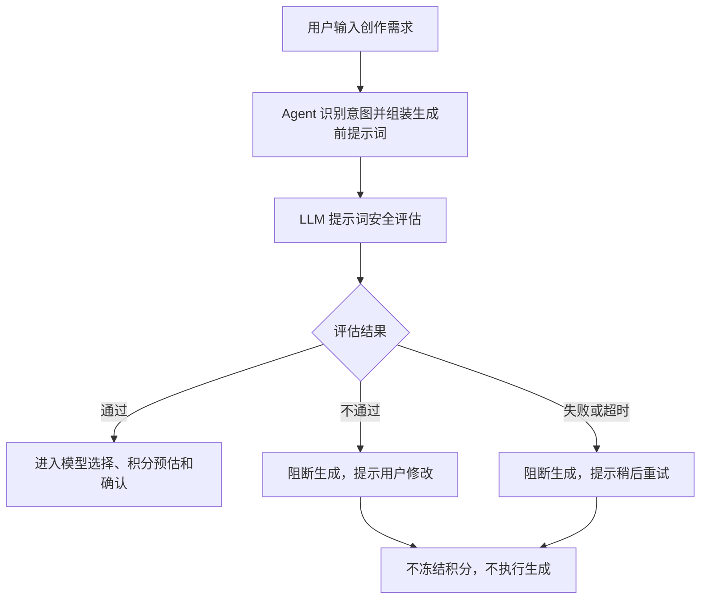

# 内容安全治理 PRD

状态：active
owner：产品体验设计师
更新时间：2026-06-25
适用范围：用户提示词、生成前提示词、上传文本信息的 LLM 安全评估和生成阻断
product_status：Done

## 关联文档

- [内容安全治理产品系统设计](../内容安全治理产品系统设计.md)
- [统一 Agent 创作工作台 PRD](./06-统一Agent创作工作台PRD.md)
- [积分账户兑换码与扣费 PRD](./07-积分账户兑换码与扣费PRD.md)
- [AG-UI 与 A2UI 交互 PRD](./09-AG-UI与A2UI交互PRD.md)

## 背景

AIGC 创作需要在生成前阻止明显不安全的提示词进入生成模型。第一版内容安全治理只使用 LLM 对提示词进行安全评估，不接入外部内容安全服务，不做人审队列，不审核已生成媒体文件内容。

## 功能目标

- 在积分预估、冻结和生成执行前完成提示词安全评估。
- 安全评估不通过时阻断生成，不冻结积分。
- 安全评估失败或超时时阻断生成，不冻结积分。
- 提供用户可理解的修改提示。
- 不暴露安全策略细节、系统提示词、模型内部推理链路或供应商原始响应。
- Skill 不能关闭或绕过提示词安全评估。

## 用户角色

| 角色 | 权限/特征 | 核心诉求 |
| --- | --- | --- |
| 普通用户 | 输入创作提示词 | 知道为什么不能继续并可修改 |
| Skill 创建者 | 配置 Skill 行为和输出提示词 | Skill 不能绕过安全评估 |
| 平台管理员 | 管理模型和系统 Skill | 第一版不配置复杂安全规则 |

## 用户故事

- 作为用户，我希望如果提示词不符合平台规则，系统在扣费前告诉我修改。
- 作为用户，我希望安全评估失败时不会冻结我的积分。
- 作为平台方，我希望所有生成前提示词都经过统一安全评估。

## 评估范围

| 内容 | 是否评估 |
| --- | --- |
| 用户输入的创作提示词 | 是 |
| 聊天输入控件中的文本参数 | 是 |
| Skill 组装后的生成前提示词 | 是 |
| 图片、音乐、视频生成前最终提示词摘要 | 是 |
| 上传素材的标题、说明、标签 | 是 |
| 已生成图片、音乐、视频文件本身 | 否 |
| 上传图片、音频、视频文件本身 | 否 |
| 模型内部推理链路 | 否 |
| 系统提示词和平台安全策略细节 | 否 |

## 功能逻辑

## 页面交互逻辑

- 用户输入后，在需要生成前展示安全评估中状态。
- 安全通过时不需要打断用户，继续进入积分预估。
- 安全不通过时展示 blocked 状态和可理解提示。
- 安全失败或超时时展示系统暂时无法完成安全评估。
- 不展示命中策略细节、内部评分、模型推理链路。
- 用户修改提示词后可以重新发起评估。

## 业务规则

- 内容安全评估使用平台指定文本模型。
- 普通用户不能选择或配置安全评估模型。
- 安全评估必须发生在积分预估、冻结和生成前。
- 安全评估不通过时，不预估积分、不冻结积分、不执行生成、不保存可用资产。
- 可以保存会话中的失败状态和用户可见提示。
- 保存的安全评估结果只包含必要状态、时间、评估对象摘要和用户可见原因。
- 不保存 LLM 内部推理链路、安全策略细节、系统提示词或供应商原始响应。
- Skill 不能关闭、覆盖或绕过安全评估。

## 异常场景

| 场景 | 触发条件 | 用户提示 | 系统行为 |
| --- | --- | --- | --- |
| 提示词不安全 | LLM 判断不通过 | 提示词不符合平台规则，请修改后重试 | 阻断生成，不冻结积分 |
| 评估失败 | LLM 调用失败 | 暂时无法完成安全评估 | 阻断生成，不冻结积分 |
| 评估超时 | 超过评估超时 | 暂时无法完成安全评估 | 阻断生成，不冻结积分 |
| 提示词为空 | 缺少必要文本 | 请补充创作要求 | 不进入评估和确认 |
| Skill 组装失败 | 生成前提示词缺失 | 当前 Skill 输出不完整 | 阻断生成 |

## 非目标

- 第一版不接入外部内容安全服务。
- 第一版不做人审队列。
- 第一版不审核已生成媒体文件内容。
- 第一版不审核上传媒体文件本身。
- 第一版不向用户展示安全策略细节。
- 第一版不做普通用户或企业用户可配置安全规则。

## 注意事项

- 内容安全治理不是 Skill 可绑定 Tool。
- 安全评估应该在扣费前完成，避免用户误以为被扣费。
- 不安全提示词只给用户可操作的修改建议，不暴露规则绕过线索。
- 安全评估失败时采用保守策略阻断生成。

## 验收标准

- [ ] 用户提示词在生成前经过 LLM 安全评估。
- [ ] Skill 组装后的生成前提示词经过 LLM 安全评估。
- [ ] 上传素材标题、说明、标签文本经过安全评估。
- [ ] 安全评估不通过时不冻结积分、不执行生成。
- [ ] 安全评估失败或超时时不冻结积分、不执行生成。
- [ ] 用户能看到可理解的修改提示。
- [ ] 不暴露模型内部推理链路、系统提示词或安全策略细节。
- [ ] Skill 不能关闭或绕过安全评估。

## Done Gate

- [x] 评估范围确认。
- [x] 与积分和生成执行顺序确认。
- [x] 失败和阻断策略确认。
- [x] 用户提示口径确认。
- [x] product_status 已更新为 Done，允许进入工程需求映射与契约先行阶段。

