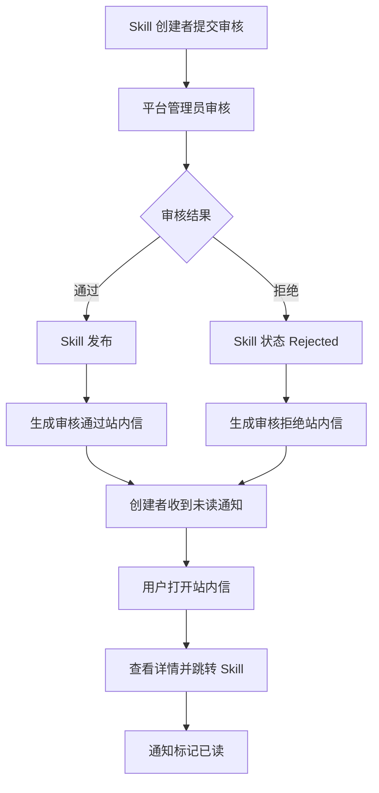

# 站内信与通知 PRD

状态：active
owner：产品与需求责任域
更新时间：2026-06-25
适用范围：普通用户端站内信、Skill 审核结果通知、系统通知和已读未读状态
product_status：Done

## 关联文档

- [Skill Builder 与审核 PRD](./05-SkillBuilder与审核PRD.md)
- [平台后台与运营管理 PRD](./02-平台后台与运营管理PRD.md)
- [页面范围与交互状态产品系统设计](../页面范围与交互状态产品系统设计.md)

## 背景

产品已确认企业 Skill 和个人 Skill 审核通过或拒绝后，通过站内信通知创建者。第一版通知能力先围绕站内信完成，不引入短信、邮件、企微、飞书等外部通知渠道。

## 功能目标

- 支持 Skill 审核通过和审核拒绝站内信。
- 支持系统通知的基础展示能力。
- 支持已读、未读、全部已读。
- 支持从通知跳转到对应 Skill 或相关页面。
- 不通过通知泄露平台内部审核细节或敏感信息。

## 用户角色

| 角色 | 权限/特征 | 核心诉求 |
| --- | --- | --- |
| Skill 创建者 | 个人用户或企业拥有者 | 及时知道审核结果 |
| 平台管理员 | 审核 Skill | 审核后自动触达创建者 |
| 普通用户 | 接收系统通知 | 查看必要系统消息 |

## 用户故事

- 作为 Skill 创建者，我希望提交审核后能收到审核通过或拒绝通知。
- 作为 Skill 创建者，我希望审核拒绝时能回到 Skill 详情继续修改。
- 作为平台管理员，我希望审核完成后系统自动通知创建者，而不是手动联系。

## 功能范围

| 功能 | 描述 | 优先级 |
| --- | --- | --- |
| 通知入口 | 用户端站内信入口和未读数 | P1 |
| 审核通过通知 | 企业/个人 Skill 审核通过后发送 | P0 |
| 审核拒绝通知 | 企业/个人 Skill 审核拒绝后发送 | P0 |
| 通知列表 | 按时间倒序展示通知 | P1 |
| 通知详情 | 展示标题、摘要、时间、关联对象 | P1 |
| 已读未读 | 单条已读、全部已读 | P1 |
| 跳转动作 | 跳转到 Skill 详情或审核结果相关页 | P1 |

## 功能逻辑

## 页面交互逻辑

### 站内信入口

- 用户端全局可访问。
- 展示未读数量。
- 无通知时展示空状态。
- 企业空间和个人空间共用通知入口，但通知列表按当前登录用户展示。

### 通知列表

- 按时间倒序展示。
- 展示通知类型、标题、摘要、时间、已读状态。
- 支持筛选全部、未读。
- 支持全部已读。

### 通知详情

- 展示完整通知内容。
- Skill 审核通知展示 Skill 名称、审核结果、审核时间。
- 审核意见可能为空。
- 提供跳转到 Skill 详情的动作。
- 标记已读。

## 通知类型

| 类型 | 触发条件 | 接收人 | 跳转 |
| --- | --- | --- | --- |
| Skill 审核通过 | 企业/个人 Skill 审核通过 | Skill 创建者 | Skill 详情 |
| Skill 审核拒绝 | 企业/个人 Skill 审核拒绝 | Skill 创建者 | Skill 编辑或详情 |
| 系统通知 | 平台后续运营或系统事件 | 目标用户 | 可选 |

第一版系统通知只保留基础能力，不展开复杂运营通知配置。

## 业务规则

- 系统 Skill 不需要审核，因此不发送系统 Skill 审核通知。
- 企业 Skill 审核通知发送给创建该 Skill 的企业拥有者账号。
- 个人 Skill 审核通知发送给创建者本人。
- 审核意见非必填，通知需支持无审核意见状态。
- 通知不展示平台管理员内部备注、系统提示词、安全策略细节、模型成本或密钥。
- 用户被移出企业后，历史通知仍属于用户本人，但跳转企业 Skill 时需要按当前权限校验。

## 异常场景

| 场景 | 触发条件 | 用户提示 | 系统行为 |
| --- | --- | --- | --- |
| 通知发送失败 | 审核完成但通知写入失败 | 不展示给用户 | 记录失败，审核结果仍生效 |
| 关联 Skill 不可访问 | 用户点击通知但无权限 | 无权访问该 Skill | 阻止跳转 |
| 审核意见为空 | 平台管理员未填意见 | 无补充说明 | 正常展示结果 |
| 重复通知 | 重试造成重复 | 无提示 | 按幂等键避免重复 |

## 非目标

- 第一版不做短信、邮件、外部 IM 通知。
- 第一版不做复杂通知模板后台。
- 第一版不做营销推送。
- 第一版不做通知订阅偏好。

## 注意事项

- 通知是结果触达，不是业务事实来源。
- Skill 状态以 Skill 数据为准，通知只是入口。
- 通知跳转必须重新校验权限。
- 审核拒绝不要求审核意见必填，所以前端不能把意见作为必填展示字段。

## 验收标准

- [ ] 企业 Skill 审核通过后创建者收到站内信。
- [ ] 企业 Skill 审核拒绝后创建者收到站内信。
- [ ] 个人 Skill 审核通过后创建者收到站内信。
- [ ] 个人 Skill 审核拒绝后创建者收到站内信。
- [ ] 审核意见为空时通知仍正常展示。
- [ ] 用户可以查看通知列表、详情、未读状态。
- [ ] 用户可以将通知标记已读或全部已读。
- [ ] 通知可跳转到关联 Skill，并重新校验权限。
- [ ] 通知不展示敏感内部信息。

## Done Gate

- [x] 通知类型确认。
- [x] Skill 审核通知内容确认。
- [x] 站内信页面范围确认。
- [x] 权限和跳转规则确认。
- [x] product_status 已更新为 Done，允许进入工程需求映射与契约先行阶段。

