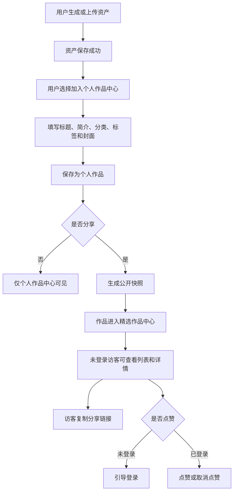
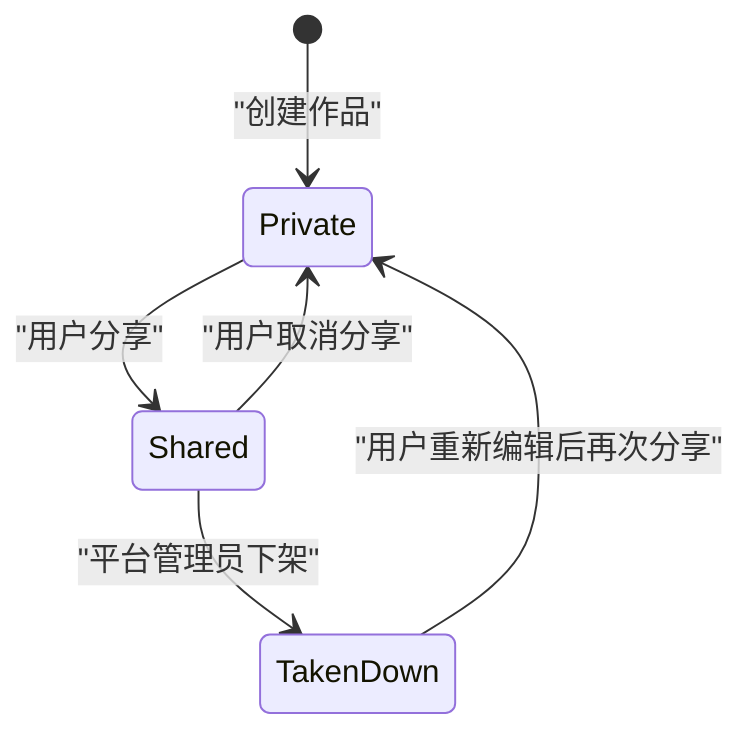

# 作品中心与精选作品 PRD

状态：draft  
owner：产品体验设计师  
更新时间：2026-06-25  
适用范围：个人作品中心、作品分享、精选作品中心、点赞、分享、作品标签、作品分类和免登录查看  
product_status：Draft

## 关联文档

- [系统概要与功能大纲 PRD](./00-系统概要与功能大纲PRD.md)
- [账户身份企业与空间 PRD](./01-账户身份企业与空间PRD.md)
- [资产素材与创作过程 PRD](./08-资产素材与创作过程PRD.md)
- [内容安全治理 PRD](./10-内容安全治理PRD.md)

## 背景

用户通过统一 Agent 生成音乐、图片、视频等资产后，需要有一个面向个人展示和管理的作品集。作品集中的作品可以被用户主动分享。分享后的作品进入精选作品中心，支持免登录查看、作品分类、标签、点赞和分享。

本 PRD 将资产和作品分开：资产是创作产生的文件和元素事实；作品是用户整理后用于展示、收藏和公开分享的作品集条目。

## 功能目标

- 提供个人作品中心，作为当前登录用户自己的作品集。
- 支持用户从已保存资产创建作品。
- 支持作品标题、封面、简介、作品分类、作品标签和关联资产。
- 支持作品分享和取消分享。
- 分享后的作品进入精选作品中心。
- 精选作品中心支持免登录查看列表和详情。
- 精选作品支持点赞、复制分享链接、分类筛选和标签筛选。
- 公开展示时不泄露源会话、黑板、提示词、私有素材、积分、模型成本或用户隐私。

## 用户角色

| 角色 | 权限/特征 | 核心诉求 |
| --- | --- | --- |
| 登录用户 | 管理自己的作品集 | 整理、预览、编辑、分享自己的作品 |
| 企业成员 | 企业身份下管理本人创建的作品 | 使用企业空间本人资产创建作品 |
| 未登录访客 | 无账户登录态 | 免登录查看精选作品 |
| 平台管理员 | 平台后台操作 | 必要时下架公开作品并审计 |

说明：未登录访客不是账户体系中的第三类用户，只是精选作品中心的匿名访问状态。产品账户体系仍保持平台管理员和普通用户两类顶层用户。

## 用户故事

- 作为登录用户，我希望把生成后的图片、音乐、视频整理到自己的作品集中。
- 作为登录用户，我希望为作品设置标题、封面、简介、分类和标签，方便后续展示。
- 作为登录用户，我希望一键分享作品，让别人免登录查看。
- 作为未登录访客，我希望打开精选作品链接后可以直接查看作品详情。
- 作为登录用户，我希望可以点赞精选作品，也可以取消点赞。
- 作为平台管理员，我希望在公开作品出现风险时可以下架并留下审计记录。

## 功能范围

| 功能 | 描述 | 角色 | 优先级 |
| --- | --- | --- | --- |
| 个人作品中心 | 当前登录用户作品列表、筛选、详情 | 登录用户 | P0 |
| 创建作品 | 从已保存资产创建作品集条目 | 登录用户 | P0 |
| 编辑作品信息 | 标题、封面、简介、分类、标签 | 登录用户 | P0 |
| 分享作品 | 将作品公开为精选作品 | 登录用户 | P0 |
| 取消分享 | 从精选作品中心移除公开访问 | 登录用户 | P0 |
| 精选作品列表 | 免登录浏览分享后的作品 | 未登录访客、登录用户 | P0 |
| 精选作品详情 | 免登录查看作品媒体、标题、简介、标签、分类 | 未登录访客、登录用户 | P0 |
| 点赞 | 登录后点赞或取消点赞 | 登录用户 | P0 |
| 分享链接 | 复制公开作品链接 | 未登录访客、登录用户 | P0 |
| 分类和标签筛选 | 按作品分类、标签、资源类型筛选 | 未登录访客、登录用户 | P0 |
| 公开作品下架 | 平台管理员下架风险公开作品 | 平台管理员 | P1 |

## 核心概念

| 概念 | 定义 |
| --- | --- |
| 资产 Asset | 用户生成或上传后保存的图片、音乐、视频、文件和资产元素 |
| 作品 Work | 用户基于一个或多个资产整理出的作品集条目 |
| 个人作品中心 | 当前登录用户自己的作品集管理入口 |
| 精选作品 | 用户主动分享后的公开作品 |
| 精选作品中心 | 分享后作品的公开浏览入口，支持免登录查看 |
| 公开快照 | 作品分享时生成的公开展示信息，避免直接暴露私有资产和过程数据 |

## 功能逻辑

## 作品分享状态

状态说明：

- Private：仅作品创建者在个人作品中心可见。
- Shared：公开展示在精选作品中心，支持免登录查看。
- TakenDown：被平台管理员下架，不在精选作品中心展示，公开链接不可访问。

## 页面交互逻辑

### 个人作品中心

- 登录后访问。
- 展示当前登录用户自己的作品集。
- 支持按资源类型、分享状态、分类、标签和时间筛选。
- 支持从已保存资产创建作品。
- 支持编辑作品标题、封面、简介、分类、标签。
- 支持预览作品详情。
- 支持分享和取消分享。
- 在企业身份下，只展示当前登录用户本人创建的企业空间作品；企业拥有者不额外查看成员作品。

### 创建 / 编辑作品

- 选择一个或多个已保存资产作为作品内容。
- 必须填写作品标题。
- 可选择封面图；未选择时系统可使用首个图片或视频封面作为默认封面。
- 作品分类为单选。
- 作品标签支持多个。
- 分享前需要对标题、简介、标签等文本做 LLM 提示词安全评估。
- 第一版不对公开媒体文件本身做多模态内容安全审核。

### 精选作品中心

- 支持免登录查看列表。
- 支持按分类、标签、资源类型筛选。
- 展示作品封面、标题、作者公开昵称、分类、标签、点赞数和分享入口。
- 不展示用户邮箱、手机号、内部用户 ID、源会话、源黑板、提示词、模型成本和积分信息。
- 支持登录用户点赞和取消点赞。
- 未登录访客点击点赞时，引导登录。
- 未登录访客可以复制分享链接。

### 精选作品详情

- 支持免登录查看公开作品内容。
- 展示公开标题、封面、简介、媒体预览、分类、标签、作者公开昵称、点赞数和分享按钮。
- 媒体预览使用公开快照或公开访问代理，不直接暴露私有 TOS 原始链接。
- 作品取消分享或下架后，公开详情页展示不可访问状态。

### 平台后台公开作品管理

- 第一版只保留下架能力，不做复杂推荐和榜单运营。
- 平台管理员可按作品标题、作者、分类、标签、分享状态筛选公开作品。
- 下架前需要确认。
- 下架操作进入审计日志。

## 分类和标签规则

- 作品分类为平台内置分类，第一版不提供后台分类配置页面。
- 分类应作为平台内置配置或系统字典维护，不能散落硬编码在业务代码中。
- 一个作品第一版只选择一个主分类。
- 标签由作品创建者填写或从资产元素建议中选择。
- 标签用于精选作品中心筛选和详情展示。
- 标签文本需要在分享前进行 LLM 提示词安全评估。

建议第一版作品分类：

| 分类 | 覆盖场景 |
| --- | --- |
| 音乐 | 歌曲、BGM、歌词歌曲 |
| 图片 | 商品图、品牌图、海报、封面 |
| 视频 | MV、短视频、广告视频、宣传视频 |
| 品牌设计 | LOGO、品牌视觉、口号 |
| 电商营销 | 商品图、广告视频、卖点素材 |
| 文旅宣传 | 景点宣传、城市宣传、活动视频 |
| 其他 | 暂未归类作品 |

## 权限规则

- 个人作品中心必须登录后访问。
- 个人身份下展示个人空间作品。
- 企业身份下展示当前登录用户本人创建的企业空间作品。
- 企业拥有者不额外查看成员作品。
- 被移出企业后，用户不能管理原企业空间作品。
- 精选作品中心免登录可查看 Shared 状态作品。
- 点赞需要登录，一个登录用户对同一作品只能点赞一次。
- 分享链接免登录可访问 Shared 状态作品详情。
- 取消分享后作品不再出现在精选作品中心，公开链接不可访问。
- 平台下架后作品不再公开展示，创建者可在个人作品中心看到下架状态。

## 业务规则

- 作品不是资产本身，作品引用一个或多个已保存资产。
- 资产保存失败不能创建作品。
- 分享作品前必须生成公开快照。
- 公开快照只包含公开展示字段和公开媒体引用。
- 分享前需要评估作品标题、简介、标签等文本是否安全。
- 公开展示不自动公开源提示词、源会话、黑板、创作过程、积分消耗、模型名称、模型成本或私有素材。
- 作品取消分享不删除源资产。
- 第一版不做评论、收藏、关注、排行榜、推荐算法和二次创作按钮。
- 平台管理员下架公开作品不删除源资产，只关闭公开展示。

## 异常场景

| 场景 | 触发条件 | 用户提示 | 系统行为 |
| --- | --- | --- | --- |
| 源资产不可用 | 资产保存失败或无权限 | 该资产不可用于作品 | 阻止创建作品 |
| 分享安全评估不通过 | 标题、简介或标签不安全 | 作品信息不符合平台规则 | 阻止分享 |
| 公开快照生成失败 | 分享时快照创建失败 | 分享失败，请重试 | 保持 Private 状态 |
| 未登录点赞 | 访客点击点赞 | 登录后可点赞 | 引导登录 |
| 重复点赞 | 同一用户重复点赞 | 已点赞 | 保持点赞状态 |
| 取消分享后访问 | 公开链接访问 Private 作品 | 作品不可访问 | 不展示详情 |
| 下架后访问 | 公开链接访问 TakenDown 作品 | 作品已下架 | 不展示详情 |
| 作者被移出企业 | 企业作品作者失去企业身份 | 无权管理该作品 | 阻止管理企业作品 |

## 非目标

- 第一版不做评论。
- 第一版不做收藏夹。
- 第一版不做关注作者。
- 第一版不做排行榜和推荐算法。
- 第一版不做公开作品审核队列。
- 第一版不做付费查看或作品售卖。
- 第一版不做作品二次创作快捷入口。
- 第一版不做匿名点赞。

## 注意事项

- 精选作品中心“免登录查看”只包含浏览列表、查看详情和复制分享链接。
- 点赞需要登录，主要用于去重和防刷。
- 公开作品必须使用公开快照，不能直接把私有资产权限放开。
- 分享行为会把作品变成公开内容，前端需要给用户明确提示。
- 企业身份下分享作品可能涉及企业资产，第一版只允许创建者本人分享和取消分享。

## 验收标准

- [ ] 用户可以从已保存资产创建个人作品。
- [ ] 用户可以编辑作品标题、封面、简介、分类和标签。
- [ ] 个人作品中心只展示当前登录用户自己的作品。
- [ ] 企业身份下只展示当前用户本人企业空间作品。
- [ ] 用户可以分享作品，分享后作品进入精选作品中心。
- [ ] 用户可以取消分享，取消后公开链接不可访问。
- [ ] 精选作品中心支持免登录查看列表和详情。
- [ ] 精选作品支持分类筛选、标签筛选和资源类型筛选。
- [ ] 未登录访客可以复制分享链接。
- [ ] 点赞需要登录，且同一用户对同一作品只能点赞一次。
- [ ] 分享前对标题、简介、标签进行 LLM 提示词安全评估。
- [ ] 公开详情不展示源会话、黑板、提示词、积分、模型成本或用户隐私信息。
- [ ] 平台管理员可以下架公开作品，并记录审计日志。

## Done Gate

- [ ] 个人作品中心范围确认。
- [ ] 精选作品中心免登录查看范围确认。
- [ ] 点赞是否需要登录确认。
- [ ] 作品分类和标签规则确认。
- [ ] 分享、取消分享和下架规则确认。
- [ ] 公开快照和隐私边界确认。
- [ ] product_status 更新为 Done 后，才允许进入正式工程开发。

