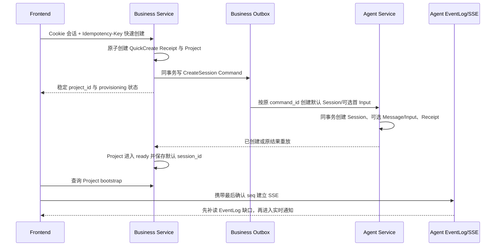

# Dora 全功能冒烟开发推进计划

> 文档状态：详细里程碑、SMK-P0 与长期 backlog；不再承担当前批次调度
>
> 当前唯一执行口径：[Dora 项目开发计划（Canonical）](project-development-plan.md)
>
> 版本：v0.26
>
> 更新日期：2026-07-16
>
> 关联文档：[2026-07-15 全功能冒烟架构与推进审计](../design/cross-module/full-function-smoke-architecture-audit-2026-07-15.md)、[用户端需求总览](user-requirements-overview.md)、[管理端需求总览](admin-requirements-overview.md)、[服务端需求总览](server-requirements-overview.md)、[Graph Tool 功能需求总览](graph-tool-requirements-overview.md)、[支付与积分充值需求总览](payment-requirements-overview.md)、[共通业务规则与验收基线](common-requirements-baseline.md)、[Graph Tool 详细设计索引](../design/agent/graphtool/README.md)、[AIGC 跨 Module 契约目录](../design/cross-module/aigc-contract-catalog.md)、[Agent Runner 与 PostgreSQL Session Lane v1 设计评审](../design/agent/runner-session-lane-review-v1.md)、[PostgreSQL Session Lane 与 Runner Runtime 可执行契约 v1](../design/agent/session-lane-runtime-contract-v1.md)、[Session Lane Ingress 与 Command Receipt 可执行契约 v1](../design/agent/session-lane-ingress-command-contract-v1.md)、[Session Lane PostgreSQL 物理设计与升级方案 v1](../design/agent/session-lane-postgresql-design-v1.md)、[GraphToolResultV1 与 ToolReceipt 可执行契约 v1](../design/agent/graph-tool-result-receipt-contract-v1.md)、[W0 身份与工作台契约 v1](../design/cross-module/w0-identity-workspace-contract-v1.md)、[W0.5 Workspace Transport 契约 v1](../design/cross-module/w05-workspace-transport-contract-v1.md)、[Business 鉴权/Project 评审包](../design/business/auth-project-foundation-review.md)、[Agent Session/Event 评审包](../design/agent/session-event-foundation-review.md)、[SMK-001～004 垂直切片评审包](../design/testing/smk-001-004-vertical-slice-review.md)

> W2 当前新增评审输入：[Graph Execution Billing v1](../design/cross-module/graph-execution-billing-contract-v1.md)、[全功能冒烟工程设计 v1alpha2](../design/testing/full-function-smoke-engineering-design.md)、[W2-R01 Owner 决策矩阵 v1](../design/agent/w2-r01-owner-decision-matrix-v1.md)、[W2-R02 Owner 决策矩阵 v1](../design/agent/w2-r02-owner-decision-matrix-v1.md)、[W2-R03 Owner 决策矩阵 v1](../design/agent/w2-r03-owner-decision-matrix-v1.md)、[W2-R04 Owner 决策矩阵 v1](../design/agent/w2-r04-owner-decision-matrix-v1.md) 与 [W2 Review Freeze 机器治理清单](../design/agent/approvals/w2-review-freeze-manifest.json)。它们均不得被解释为生产实现或 Owner Approved。

> 调度规则：本文保留完整需求覆盖、历史交付台账和长期阶段依赖。文中任何旧“下一批”、Batch 编号或并行建议若与 Canonical 计划冲突，以 Canonical 计划为准；领域实现仍必须服从对应 Design / ADR / Owner 审批门禁。

## 1. 目标与完成定义

本计划的目标是把当前需求基线推进到“前后端可以开始全功能冒烟”的状态。这里的“全功能冒烟”指：桌面 Web 用户端和管理端的主要菜单、关键状态与跨服务主链路均有真实 API、真实 PostgreSQL 持久化和可重复测试数据，可以验证每个核心业务域至少一条成功路径及关键失败关闭路径。

达到该状态不等于生产上线。需求文档当前共有 135 个唯一验收 ID；全功能冒烟只选取覆盖产品宽度和关键一致性边界的 P0 场景，剩余并发、压测、容灾、安全和长尾状态进入完整回归与发布门禁。

冒烟分为两套：

1. **Local Deterministic Smoke（合并必跑）**：使用真实 PostgreSQL、Redis、etcd 和三个真实服务 Runtime；模型、媒体 Provider、对象存储和支付渠道使用可控 Adapter，仍完整执行签名、幂等、扣费、Job、回调、履约和事件链路。
2. **Provider Sandbox Smoke（环境具备时运行）**：使用真实模型/媒体 Provider 测试账号、微信支付沙箱或验收商户能力、支付宝沙箱，验证外部协议适配；凭据缺失不阻塞本地功能开发，但阻塞对应外部能力上线。

前后端“可开始全功能冒烟”的退出条件：

- 用户端和管理端主要页面不再依赖业务 Mock 数据；只有明确标记的外部 Adapter 可以使用确定性 Fake。
- `business-service`、`agent-service`、`business-worker` 可独立构建、迁移和启动，也可在本地组合启动。
- 六个 Graph Tool 均有已评审设计、发布 Definition、稳定 Schema、权限/预算/计费引用和至少一条端到端用例。
- Project、Session、Skill Snapshot、Storyboard、Asset、计费、支付、收益、公开作品、公告和管理治理均有真实持久化主路径。
- SMK-P0 矩阵全部自动化通过；测试失败能够定位到需求 ID、服务 Trace、领域记录和前端步骤。
- 所有正常扣费、充值、收益和冲正均可从追加式账本核对，不以页面状态代替账务事实。

## 2. 当前基线事实

| 范围 | 2026-07-16 当前事实 | 推进结论 |
| --- | --- | --- |
| 需求 | 六份需求文档形成 135 个唯一验收 ID，产品范围基本完整 | 以现有需求为基线，变更必须同步追踪矩阵 |
| Graph Tool | 需求已固定六个 Tool；服务端规范此前仍写五个 | 本轮已统一为六个，改动待评审 |
| 前端 | `frontend/` 可以构建且 441 项测试通过；真实 Login/Logout、Auth v1 Provider、QuickCreate/Bootstrap、Owner Skill 创建/编辑/审核提交、Reviewer 待审队列/冻结详情/当前发布对比/批准发布、Governor 三态治理列表/只读详情/命令账本、最多 16 个 Published+Active Skill 的 QuickCreate v2 选择、匿名 Skill 市场列表/详情、跨发布者 Market 预选与登录恢复、正式 `/projects/:project_id/workspace`、严格 Snapshot DTO、Snapshot→SSE 与旧连接隔离、Session 级六 Tool 静态不可用目录均已接线；真实 Chromium 已验证四身份权限隔离、Governor 暂停/恢复/永久下架与同 Cookie 撤权、Consumer 跨 Owner 创建 ready Workspace，以及原有权限/Transport 主链 | W0.5 与 W1 当前页面子集已可真实冒烟；全量 ADM-RBAC、申诉、在线角色管理、Executable Registry 和后续业务域仍按波次补齐 |
| 服务端 | 三个独立 Module 已建立基础 Runtime；Business 已有 Auth、Project、Skill 草稿/审核/不可变发布、持久化 `skill_reviewer`/`skill_governor` 独立角色分配、Reviewer/Governor HTTP、`active/suspended/offline` 状态机、匿名 Market 白名单列表/详情、008 Keyset 与 009 Public Market 文档 Migration、Permission v1/v2 Project Skill Binding、QuickCreate v1/v2、双轨 Outbox/Dispatcher、Agent BFF 和 owner/ready Binding JOIN；Agent 已有 Session RPC v1/v2、身份断言验证/Redis 防重放、DRAE Keyring、不可变 Session Skill Snapshot Item 密文、REPEATABLE READ Workspace Snapshot 与 PostgreSQL poll-first SSE | W0.5 Transport 与 W1-A1～W1-F 主链路已真实黑盒通过；当前仍不包含在线角色管理 HTTP、Executable Tool Registry、Graph/Runner、A2UI 或计费执行 |
| 根 Go Module | 根 `go.mod`、`go.sum` 已移除，只保留本地 `go.work`；三个 Module 已在 `GOWORK=off` 下独立校验 | CI 与发布继续禁止依赖根 Module 或跨 Module `internal` import |
| 本地基础设施 | PostgreSQL、Redis、etcd Compose、三独立数据库、独立 `_test` 契约库、Schema Migration、`foundation-smoke`、`w0-smoke`、`w05-browser-smoke` 与 W1 canonical 门禁已可执行；`w1-smoke` 强制执行 `@w1-real-review` 真实 Chromium 链路。W1 Foundation canonical `v3` 固定 47 项 assertions/42 项布尔门禁；同次独立发布 Governance `v2` 九项、Market `v2` 六项和 Public Market Binding `v1` 七项闭集 sidecar。四份均校验顶层/assertions exact-set、共用 run/source/Business/Agent digest，全部通过才原子发布 passed | 继续以真实基础设施运行 canonical + 三 sidecar 四 Evidence 门禁；既有 Project Binding v2 Feature Flag 在普通配置中默认关闭，只由确认同批 Agent capability 的 Smoke/部署显式开启，W1-F 不新增 public-market 专用 Flag |
| Graph Tool 设计 | 六个独立中文设计已起草，均为 Draft / 待评审 | 文档缺失已关闭；评审结论仍是 Agent/Graph Tool 实现硬门禁 |
| AIGC 跨 Module 契约 | Owner、Business RPC、`AGT-JOB-V1`、Event、Approval、计费与 unknown-outcome 已形成草案 | 三 Module、财务、安全和运维评审通过前不得创建对应生产契约 |
| 冒烟工程 | Fixture、协议 Adapter、35 条 Scenario、Evidence 与故障注入已形成独立草案；W0.5 已有本地 Seeder、真实 HTTP/RPC/Snapshot/SSE、Agent 重启恢复、真实 Chromium Retention Reset/受控断线/跨 Owner Driver 和失败安全的脱敏摘要 Evidence v3 | W0.5 Transport API/浏览器恢复子集可重复执行并已通过；完整 A2UI/业务资源及 `SMK-001`～`SMK-004` 整体仍待实现 |
| 历史迁移资产 | 已盘点 `main@6d0fc111` 顶层资产和 `internal/aigc` 的 28 个一级目录加嵌套 `generation/handlers`，合计 29 个 Go package 目录 | 只按清单逐函数/逐测试迁移，禁止整体恢复单体目录 |
| 历史代码 | `main` 分支包含旧根 Module Demo | 只允许按已评审设计选择性迁移，不允许整分支恢复 |

## 3. 已冻结的推进边界

1. 仓库采用 `business/`、`agent/`、`worker/` 三个独立 Go Module；根目录只负责协作与本地 `go.work`。
2. 用户工具箱按以下顺序展示六个稳定 Tool：`plan_creation_spec`、`analyze_materials`、`plan_storyboard`、`generate_media`、`write_prompts`、`assemble_output`。
3. 实现依赖顺序可以与展示顺序不同：先完成规划、分析、故事板和 Prompt，再接媒体生成与装配。
4. Business 是用户、鉴权、Project、Skill、Storyboard、Asset、支付、积分、收益、公开作品和管理治理的业务真源。
5. Agent 是 Session/Input/Turn、Graph Tool Run、Approval、Operation/Batch/AIGC Job、Continuation、EventLog 和 A2UI 的执行真源。
6. Worker 不选择 Skill、不决定 Prompt、不调用 Agent、不扣费或退款；只消费已持久化任务并执行 Provider、对象存储和 Business Finalize。
7. 可计费执行必须先由 Business 按冻结版本原子扣费成功，再允许创建或执行下游副作用；技术重试不得重复扣费。
8. 已开始执行的正常费用不因失败、取消或用户改变主意退款；只有账务差错通过追加式冲正纠正。
9. PostgreSQL 是业务和执行权威状态，Redis 只用于缓存、短期协调和唤醒，etcd 只用于服务注册发现。
10. 用户端不展示 Skill 版本明细；内部发布快照、审核修订和历史冻结事实仍必须可追踪。

## 4. 关键路径与里程碑


### M0：需求与设计门禁

交付物：

- 六个 Graph Tool 口径统一，历史实现与当前分支事实分离。
- 六份独立中文 Graph Tool 设计，包含流程图、稳定 Node、类型、Graph State、业务状态机、权限、预算、幂等、失败和审核结论。
- 跨 Module 数据 Owner 与契约目录：HTTP、Thrift、Event、Job Payload、支付回调、A2UI/SSE。
- SMK-P0 场景、Fixture、测试账号、确定性 Adapter 和证据格式冻结。
- 旧 `main` 可迁移资产清单，逐项标记“复用、重写、废弃”，禁止按目录整体搬迁。

退出门槛按实现包生效，不再把六个 Tool 同时 Approved 当作 M1 或共享 Runtime 的前置：共享 Runtime 与首个/current Tool 的相关设计必须在对应实现前 Approved；其余 Tool 必须在各自实现前独立 Approved；六份 Tool 设计全部 Approved 只作为 M2 完整黄金闭环和最终全功能冒烟的退出条件。关键契约仍不得存在 Owner、状态或幂等语义冲突，目录和 Migration Owner 必须可无歧义创建。

### M1：三 Module 与契约骨架

交付物：

- 三个独立 `go.mod`、生产 Runtime、配置、健康检查、优雅关闭和独立 CI。
- Business、Agent、Worker 各自 Schema 与首个版本化 Migration；本地 PostgreSQL、Redis、etcd Compose。
- Thrift/HTTP/Event/Job 契约及生成代码；不得跨 Module import `internal`。
- 真实 PostgreSQL Repository、Outbox/Inbox 基础设施、UUIDv7、Clock、ID Generator 和 Fake Adapter 注入点。
- 前端 API Client、鉴权会话、统一错误和事件连接基础层。

退出门槛：三个 Module 在 `GOWORK=off` 下独立构建测试；空库 Migration、服务注册发现、Readiness 和契约测试通过；本地一条无业务副作用的跨服务探针可追踪。

当前进度拆分：

- **M1.1 基础 Runtime（已完成）**：三个独立 Module 与生产入口、类型化配置、PostgreSQL/Redis/etcd 启动探针、`livez/readyz`、Business/Agent 租约注册、Worker 资源边界、优雅退出、三 Schema Migration、Compose、独立 CI 和可重复基础冒烟。
- **M1.2 契约与持久化骨架（W0 第一批已完成）**：Foundation Thrift/etcd Probe、三 Module UTC Clock/UUIDv7、Runtime Schema 契约检查和真实 PostgreSQL CI 已完成；W0 又新增 Business 8 张、Agent 9 张权威表、两端固定 Canonical Digest 向量、QuickCreate/Ensure 原子 Repository、并发/回滚测试和缺表 Readiness。Business 从真实 Prompt 独立推导语义与跨服务 Digest，Agent 以冻结的 `DRAE` AEAD Envelope v1 在 Service、Repository、数据库三层拒绝裸内容；真实 PostgreSQL 契约测试已经接入 CI。W0 Transport 以外的其他领域仍受各自评审门禁约束。
- **M1.3 前端接入底座（W0.5 Workspace Transport 已完成）**：统一 API Client、Auth v1 四态内存会话、结构化错误、真实登录/退出、QuickCreate/Bootstrap、稳定幂等意图、正式路由、严格 Snapshot/Event DTO、Cursor/Reset/Probe、旧代次隔离及六态 Input 展示已完成；其他业务页面 Mock 替换进入对应领域波次。
- **M1.4 W0 身份与工作台纵切（W0.5 Transport 验收已通过）**：真实黑盒已经覆盖 Auth、100 并发同键创建、重放/冲突、generated Kitex、Prompt 清理、Business BFF owner 门禁、双用户跨 Owner Project/Workspace/Events、Agent Snapshot 解密、SSE 补读/Ready/Reset、Agent 真实 TERM/同二进制重启后的 Snapshot/Event 恢复、空 Prompt 非 null 空数组、页面首 Prompt、硬刷新同 Session、Chromium Retention Window Reset/完整 Snapshot 回源、受控离线恢复、第二用户跨 Owner UI 404 与退出撤销；组件矩阵覆盖旧连接隔离。`SMK-004A` 的 W0.5 Transport 子集已经进入 canonical Evidence v3；完整 `SMK-001`～`SMK-004` 仍不能宣称全绿，A2UI/Storyboard/Asset/Run 的 `SMK-004B` 也未关闭。
- **M1.5 W1 Skill Foundation、Reviewer 纵切与 Session Snapshot（W1-A1/W1-B1/W1-C2 主路径已通过）**：Business 已实现结构化 Skill 草稿、Owner 读取、审核提交、持久化 `skill_reviewer` 分配、登录与每次 Session Resolve 的动态权限投影、Reviewer 队列/冻结详情/当前发布对比/批准发布、正式发布事务、Project Binding/Resolution、完整加密 Bootstrap v2 和 active/previous keyring；Agent 已实现数据库级 append-only Session Snapshot Header/Item、专用用途派生 AES-GCM、Ensure/Query v2、Receipt 语义重验和 V1/V2 command 隔离；前端已实现 Owner Skill Builder、Reviewer 管理入口与 QuickCreate Skill Picker，空选择严格保持 v1、非空选择显式进入 v2，并在第 17 项前失败关闭。W1-C2 canonical 门禁命令 `make w1-browser-smoke`（以及其兼容别名 `make w1-smoke`）已用真实 PostgreSQL/Redis/etcd、当前 worktree 构建的真实 Business/Agent Runtime 和 Chromium 证明 100 并发幂等、发布/治理审计、Business/Agent/verifier 三方 digest/count 一致、Agent 正式 Load 解密重验、Outbox 密文清理、旧 V1 Session 不回写，以及单一真实浏览器中的 Creator 直达 Reviewer 管理路由失败关闭且不隐式读取队列、同 Cookie 显式读取审核 API 得到严格 403 并关联结构化拒绝审计、Reviewer 对 Creator Owner 草稿的真实 GET/PUT 均防枚举 404 且不泄漏当前草稿、Creator 提交 → Reviewer 批准 → Creator 选择已发布 Skill → QuickCreate v2。脚本对任何缺少 `@w1-real-review` 的 W1 调用失败关闭，禁止生成 canonical W1 v3 passed Evidence。Smoke 还通过部署控制的窄权限 CLI 撤销 Reviewer 分配，并证明同一 Cookie 再次 Resolve 后角色/capability 为空且管理 API 返回 403。Creator 负向链记为 `SMK-001A` Reviewer capability isolation 子集；Reviewer 对 Creator 草稿的链只加强 W1-C1 Owner 资源跨用户隔离。完整 ADM-RBAC、在线角色管理、数据范围、敏感字段/导出越权与审核驳回/撤回仍是后续工作。
- **M1.6 W1-D Skill Governance 前后端纵切与四身份 Chromium 冒烟（已通过）**：Business 已实现 `skill_governor -> skill.govern` 动态投影、治理列表/详情/决定 HTTP、Strong ETag、幂等回执、append-only 审计，以及 `active -> suspended -> active -> offline` 状态机；前端已实现 strict parser/API、三态列表、只读 current-published Definition、内存命令账本和 capability 路由。`make w1-smoke` 的独立 `w1.skill-governance.smoke.evidence.v2` 九项闭集 sidecar 已用 Creator/Reviewer/Governor/Provisioner 四身份、真实 Login/Chromium、正式 CLI grant/revoke 和只读 PostgreSQL 事实证明路由/API 隔离、Header/Body ETag 与 epoch/actions、暂停→恢复→永久下架、同义重放单迁移、QuickCreate 零部分事实、current pointer/既有 Session 冻结、offline 终态以及 Governor 同 Cookie 撤权即时失效。Owner 原因安全投影、申诉、在线角色管理、Tool/Graph Tool 治理和完整 `SMK-031` 仍未完成。
- **M1.7 W1-E Skill Market 公开只读纵切（已通过）**：Business 已实现匿名 Market 列表/详情、current published + active 可见性、严格公开白名单 DTO、无填充 Base64URL keyset cursor、全响应 `no-store`，以及 dangling guard + 008 索引驱动 valid 分支的单 SQL 查询；前端已实现 `/skills` 列表、`/skills/:skill_id` 详情和完整读取状态。真实 PostgreSQL 以 1500 条样本证明索引命中；能力扩展后 `w1.skill-market.smoke.evidence.v2` 仍以六项闭集证明公开读取、快照隔离、21 条 keyset、治理可见性、非法 cursor 和陈旧选择失败关闭。
- **M1.8 W1-F Public Market Binding（已实现并通过）**：Business 以 009 metadata-only Migration、严格 Permission v2、Publisher=Skill Owner、同事务 current Snapshot/治理重验和 mixed 全回滚扩展显式 QuickCreate v2；009 Down 以 Header/Item `SHARE` 表锁、同事务 history guard 和 SQLSTATE `55000` 防止并发写窗口下错误恢复旧注释。前端实现 Market CTA、App 级一次性登录预选、Owner Picker 共存和 authority epoch 清理。`w1.skill-market-binding.smoke.evidence.v1` 七项闭集与真实 Chromium/数据库锁竞争已证明登录预选九类数据库事实零增量、Consumer/Publisher 分离、幂等重放、治理 TOCTOU、真实 owner-private/public-market mixed、旧 Session 冻结和 Agent opaque digest 一致，`SMK-006B` 标记为通过。

M1.1 当时的 Migration 只创建各自 Schema；W0 冻结并经用户确认后才以前向 Migration 增加本批业务表。Graph Tool、Job、财务和其他跨 Module 契约门禁继续有效。

### M2：黄金创作闭环

按以下业务链路纵向实现，不按页面或服务横向堆积半成品：

```text
登录用户
  → 创建 Project / Session / 首 Input
  → 冻结 Session Skill Snapshot
  → 选择或调用六个 Graph Tool
  → Creation Spec Approval
  → Storyboard Pending Revision / Approval
  → write_prompts 生成并冻结 Prompt
  → Business PrepareGeneration 原子扣费
  → Agent Operation / Batch / Job / Outbox
  → Worker Claim / Provider / TOS / Business Finalize
  → Batch terminal event / Agent Inbox / Continuation
  → EventLog / SSE / A2UI / Storyboard / Asset 刷新
```

上图仍是 M2 完整目标，不是一个并行大批次。实现先按 W2-S0 → W2-A1/A2 → W2-B0a/B0b → W2-B1 → W2-C1/C2 交付 `plan_creation_spec` 单 Tool Walking Skeleton，再逐 Tool 扩展同步能力，最后进入 Worker。首个模型执行必须接 Business-owned 最小计费与权威 Query，不能以“完整账务在 W4”为由零费用旁路；W4 负责在该最小闭环上扩展充值、收益、支付、对账和管理能力。

退出门槛：SMK-002 至 SMK-020、SMK-033 在 Local Deterministic 环境通过；刷新、重连、重试和进程重启不重复执行或扣费。

### M3：产品宽度补齐

在黄金链路稳定后补齐：Skill 市场与创建发布、资产中心、钱包与账单、微信/支付宝充值、发布者收益回收、精选作品、点赞、公告、帮助反馈、账号设置，以及管理端 Skill/Tool/支付/财务/任务治理。

退出门槛：用户端和管理端主要页面都连接真实 API；SMK-001、SMK-005 至 SMK-006、SMK-021 至 SMK-032、SMK-034 至 SMK-035 通过。

### M4：双套全功能冒烟

- Local Deterministic Smoke 在干净数据库上可一键准备、执行、销毁和重复运行。
- Provider Sandbox Smoke 验证真实外部协议，不把同步回跳或客户端参数当作支付成功事实。
- CI 保存 JUnit、前端 Trace/截图、服务日志关联 ID 和失败时的领域状态摘要，严禁保存 Secret 或完整敏感 Payload。

退出门槛：SMK-P0 全绿且连续重复运行结果稳定；任何失败都能按 `smoke_id → requirement_id → trace_id → aggregate_id/ledger_id` 追踪。

### M5：完整回归与上线加固

完成 135 个验收 ID 的全量追踪、NFR-001 压测、NFR-002 恢复演练、安全测试、灰度/回滚、对账和运营 Runbook。本阶段是发布门禁，不阻塞前后端开始全功能冒烟。

## 5. Module Owner 与跨服务边界

| 领域事实 | 权威 Owner | 其他 Runtime 的访问方式 |
| --- | --- | --- |
| 用户、鉴权、实名、权限 | Business | HTTP DTO；Agent/Worker 通过批量 RPC 或冻结可信上下文 |
| Project、Skill 草稿/发布快照、Storyboard、Asset/Binding | Business | Agent 通过版本化 Thrift RPC；前端通过 Business HTTP |
| 积分、扣费明细、充值、收益、冲正 | Business | Agent/Worker 只能调用幂等 RPC，不直接写账本表 |
| Session、Input、Turn、Receipt、Approval、EventLog | Agent | 前端通过 Agent HTTP/SSE；Business 只交换显式 DTO/Event |
| Graph Tool Definition/Run、Operation、Batch、AIGC Job | Agent | Worker 通过待评审的版本化 Job 消费契约领取与提交，不获得 Agent 普通表所有权 |
| Worker 私有 Attempt、执行回执、Inbox/Outbox | Worker | 只由 Worker Migration 管理；终态通过版本化 Event/RPC 回流 |
| Provider 调用、对象存储上传、Business Finalize | Worker 执行，Business/Agent 分别保存各自权威结果 | 稳定幂等键、Receipt 和 Lease/Fencing；Unknown Outcome 先核对 |
| 精选作品、点赞、公告、工单、管理审计 | Business | 用户端/管理端通过 Business HTTP；公开快照与私有事实隔离 |

M0 必须把上表细化为逐契约清单，并对每项明确：生产者、消费者、Schema Version、幂等键、权限上下文、超时、重试 Owner、Unknown Outcome、兼容策略和契约测试。上表只冻结责任边界，不替代详细设计。

## 6. SMK-P0 全功能冒烟矩阵

状态枚举：`待设计`、`待实现`、`可执行`、`通过`、`阻塞`。状态以整条 Smoke 场景为单位；一个 Transport 子集通过不等于包含浏览器、Workspace/SSE 或完整 RBAC 的场景已经通过。具体功能开始前仍要满足对应设计门禁。

| Smoke ID | 端到端场景 | 需求映射 | 主要范围 | 状态 |
| --- | --- | --- | --- | --- |
| SMK-001 | 登录、退出、普通用户/管理员权限隔离与越权失败 | ADM-RBAC-001 | Business + 前端 | 待实现 |
| SMK-002 | 带提示词并发创建只得到一个 Project/Session/Input 并打开工作台 | USR-CREATE-001、SRV-CREATE-001 | Business + Agent + 前端 | 待实现 |
| SMK-003 | 空提示词只创建空工作台且不运行、不扣费 | USR-CREATE-002、SRV-CREATE-002 | Business + Agent + 前端 | 待实现 |
| SMK-004 | 工作台刷新与 SSE 重连恢复 Chat/A2UI/故事板/资产状态 | USR-WORKSPACE-001、SRV-READ-001 | Agent + Business + 前端 | 待实现 |
| SMK-005 | 创建 Skill 的结构化六能力表单与未授权 `@Tool` 失败关闭 | USR-SKILL-001、USR-SKILL-002 | Business + 前端 | 待实现 |
| SMK-006 | Skill 草稿、发布、审核及旧/新 Session 快照隔离 | USR-SKILL-003、USR-SKILL-004、SRV-SKILL-001、SRV-SKILL-002、AGT-005 | Business + Agent + 前端 | 待实现 |
| SMK-006A | 游客浏览公开 Skill 最新列表与安全详情，治理暂停/恢复/下架即时改变可见性 | USR-SKILL-005、SRV-SKILL-003、ADM-SKILL-001 | Business + 前端 | 通过 |
| SMK-006B | 其他发布者公开 Skill 经登录预选进入 QuickCreate v2，并冻结消费者/Publisher 分离的权限与 Session Snapshot；治理竞态和混合集合失败时九类事实零增量 | USR-SKILL-006、SRV-SKILL-004、USR-SKILL-004、SRV-SKILL-002、ADM-SKILL-001 | Business + Agent + 前端 | 通过 |
| SMK-007 | 工具箱按顺序展示六 Tool，缺前置条件时可发现并说明原因 | USR-TOOL-001、GTL-CAT-001、GTL-CAT-002、SRV-GTL-001 | Agent + Business + 前端 | 待实现 |
| SMK-008 | 显式选择 `write_prompts` 后冻结 Tool，不被 Agent 静默替换 | USR-TOOL-002、GTL-USE-001、GTL-USE-002、SRV-GTL-002 | Agent + 前端 | 待实现 |
| SMK-009 | 流程规划产生 Creation Spec、预算、待确认项，确认前不生成媒体 | GTL-PLAN-001 | Agent + Business + 前端 | 待实现 |
| SMK-010 | 素材分析读取真实内容并带引用，不可读内容返回 `partial` | GTL-ANALYZE-001 | Agent + Business + 前端 | 待实现 |
| SMK-011 | 故事板产生 Pending Revision，正式 Approval 后才替换 Active | GTL-STORY-001、AGT-003、SRV-AGT-003 | Agent + Business + 前端 | 待实现 |
| SMK-012 | Prompt 在故事板内保留锁定项，并支持无故事板独立结果 | GTL-PROMPT-001、GTL-PROMPT-002、USR-TOOL-003 | Agent + Business + 前端 | 待实现 |
| SMK-013 | 故事板媒体生成先扣费后派发，迟到结果不覆盖新版本 | GTL-MEDIA-002、GTL-MEDIA-003、SRV-BILL-001 | Business + Agent + Worker + 前端 | 待实现 |
| SMK-014 | 无故事板独立生成候选资产，不创建虚假 Skill Invocation | GTL-MEDIA-001、SRV-GTL-003、USR-TOOL-003 | Business + Agent + Worker + 前端 | 待实现 |
| SMK-015 | 视频剪辑生成版本化时间线并异步导出真实可播放媒体 | GTL-EDIT-001、GTL-EDIT-002 | Business + Agent + Worker + 前端 | 待实现 |
| SMK-016 | 异步 Run 刷新/重启恢复，取消只停止未开始项并核对费用 | GTL-ASYNC-001、GTL-CANCEL-001、AGT-004、SRV-AGT-004 | Agent + Worker + 前端 | 待实现 |
| SMK-017 | Session 并发输入串行；冻结 Receipt 后投影重试不再次调用或扣费 | AGT-001、AGT-002、SRV-AGT-001、SRV-AGT-002 | Agent + Business | 待实现 |
| SMK-018 | 重复唤醒、多 Worker 竞争、Provider Unknown Outcome 均不重复副作用 | WRK-001、WRK-002、SRV-WRK-001、SRV-WRK-002 | Worker + Agent + Business | 待实现 |
| SMK-019 | 旧版本结果隔离；重复 terminal event 只创建一次 Continuation | WRK-005、SRV-WRK-003、SRV-WRK-004、GTL-MEDIA-004 | Worker + Agent | 待实现 |
| SMK-020 | Redis 不可用时 PostgreSQL 恢复 Claim，Worker 优雅退出可接管 | WRK-003、WRK-004、SRV-EVENT-001 | Worker + Agent | 待实现 |
| SMK-021 | Graph Tool 并发运行只执行/扣费一次；余额不足不调用下游 | GTL-IDEM-001、GTL-BILL-001、BILL-001、BILL-002、BILL-005、USR-BILL-001、USR-BILL-002、SRV-BILL-003 | Business + Agent + Worker + 前端 | 待实现 |
| SMK-022 | 失败/部分成功/取消不退款，汇总正确；账务差错只追加冲正 | BILL-003、BILL-004、BILL-006、USR-BILL-003、SRV-BILL-002 | Business + 前端 | 待实现 |
| SMK-023 | Skill 归因收益与平台直调隔离，Dashboard 可核对，五折回收幂等且余数保留 | GTL-EARN-001、BILL-007、USR-EARN-001、SRV-EARN-001、ADM-DASH-001 | Business + 前端 + 管理端 | 待实现 |
| SMK-024 | 幂等创建冻结商品订单，展示微信二维码、支付宝收银台与同步回跳确认中 | PAY-PRODUCT-001、PAY-CREATE-001、PAY-CREATE-002、PAY-WX-001、PAY-ALI-001、USR-PAY-001、USR-PAY-002、USR-PAY-003 | Business + 前端 | 待实现 |
| SMK-025 | 合法支付通知并发重放只到账一次，伪造/错金额/错商户被拒绝 | PAY-NOTIFY-001、PAY-NOTIFY-002、PAY-SEC-001、SRV-PAY-001、SRV-PAY-002 | Business | 待实现 |
| SMK-026 | 下单未知、通知丢失或服务重启时按原订单主动查单，不创建第二笔支付 | PAY-QUERY-001、PAY-UNKNOWN-001、PAY-RECOVERY-001、SRV-PAY-003 | Business + 前端 | 待实现 |
| SMK-027 | 支付确认前后崩溃可恢复唯一积分履约 | PAY-FULFILL-001、PAY-FULFILL-002、SRV-PAY-004、USR-PAY-004 | Business + 前端 | 待实现 |
| SMK-028 | 订单关闭、迟到支付、无退款与渠道强制异常进入正确状态 | PAY-CLOSE-001、PAY-LATE-001、PAY-NOREFUND-001、PAY-EXCEPTION-001 | Business + 前端 + 管理端 | 待实现 |
| SMK-029 | 管理端审核后只公开确认快照；点赞与风控计数可核对；系统无评论入口和对象 | USR-WORK-001、USR-LIKE-001、USR-NOSOCIAL-001、SRV-PUBLIC-001、SRV-LIKE-001、ADM-WORK-001、ADM-LIKE-001、ADM-NOSOCIAL-001 | Business + 前端 + 管理端 | 待实现 |
| SMK-030 | 全局公告按版本/频率展示，撤回后停止且无消息中心入口 | USR-ANN-001、ADM-ANN-001 | Business + 前端 + 管理端 | 待实现 |
| SMK-031 | 管理端审核 Skill、发布/暂停 Tool 版本，确保新旧 Run 按冻结版本治理 | GTL-VER-001、ADM-SKILL-001、ADM-SKILL-002、ADM-TOOL-001、ADM-GTL-001、ADM-GTL-002、GTL-ADM-001 | Business + Agent + 管理端 | 待实现 |
| SMK-032 | 管理端安全发布支付配置，按权限完成对账/履约、账务、收益和任务重放 | PAY-RBAC-001、PAY-RECON-001、ADM-BILL-001、ADM-BILL-002、ADM-PAY-001、ADM-PAY-002、ADM-PAY-003、ADM-EARN-001、ADM-AGENT-001、SRV-ADMIN-001 | Business + Agent + Worker + 管理端 | 待实现 |
| SMK-033 | 已知 A2UI 可实时/回放渲染，危险 Markdown 与未知 Action 安全降级 | USR-A2UI-001、AGT-006、SRV-A2UI-001 | Agent + 前端 | 待实现 |
| SMK-034 | 资产中心命名统一，未授权资产在读取和副作用前失败关闭 | USR-ASSET-001、GTL-SEC-001 | Business + Agent + 前端 | 待实现 |
| SMK-035 | 帮助、工单、账号资料、安全、隐私和注销主路径使用真实 API | 用户端需求 6.10、6.11 | Business + 前端 + 管理端 | 待实现 |

截至 2026-07-14，`SMK-001`～`SMK-003` 的 W0.5 Transport API/浏览器子集已经真实黑盒通过，但完整场景仍保持 `待实现`。其中 `SMK-001A` Reviewer capability isolation 子集进一步覆盖：无 `skill.review` 的 Creator 直达管理路由失败关闭且审核队列隐式请求为零，同一 Cookie 显式 GET 正式审核 API 得到严格 `403 SKILL_REVIEW_CAPABILITY_REQUIRED`、`Cache-Control: no-store` 且无敏感值泄漏；它只证明当前已存在 Reviewer capability 的纵向隔离，不替代完整管理员角色/数据范围/敏感字段/导出越权闭环。`SMK-002`/`SMK-003` 已覆盖 Workspace Snapshot/SSE 水合，但真正 Runner/费用禁止副作用和完整业务 UI 尚未进入本批。`SMK-004A` 已覆盖 Session/Event Snapshot、补读、API Reset、前端 Probe/硬刷新、Agent 真实重启恢复、Chromium Retention Window Reset/完整回源、受控断线恢复和第二用户跨 Owner UI。完整 `SMK-004` 还缺 Chat/A2UI/故事板/资产投影，因此不得整体标记为可执行或通过。

截至 2026-07-16，`SMK-005/006` 的 W1 API/数据库和页面子集已经由 `w1.skill-foundation.smoke.evidence.v3` 真实黑盒通过：Skill 草稿/更新/审核、Owner-safe 读取与修改、持久化 Reviewer 角色分配与动态 Session 权限投影、真实 HTTP 队列/冻结详情/批准发布、同义回执重放、同 Cookie 撤权即时失效、`public_tool_refs` 失败关闭、100 并发非空绑定 QuickCreate v2、Business→Agent Snapshot、三方摘要与数量逐值一致、正式 Load 解密重验、密文清理、V1/V2 Session 隔离，以及不依赖 API mock 的 Creator → Reviewer → Published Skill 选择 → Workspace 单一 Chromium 全链。真实浏览器还证明 Reviewer 对 Creator Owner 草稿的路由 GET 和带合法 CSRF/ETag/Definition 的显式 PUT 都返回严格防枚举 404，不显示编辑表单或当前草稿事实，并由 Creator 后置 Owner GET 证明草稿 ETag 与 Definition 未变化；这加强 W1-C1 跨用户隔离，但不替代完整管理员数据范围与越权审计。W1-B2/W1-C1 的六 Tool 静态目录也已由同一 Evidence 的 API exact-set、跨 Owner 404 和真实浏览器六项禁用投影通过；这只是 `SMK-007/008` 的契约准备，不能宣称 Tool 可执行。独立 Governance `v2` 九项 sidecar 又真实覆盖 Governor 页面列表/详情、只读 Definition、Creator/Reviewer 隔离、Governor 暂停/恢复/offline 状态机、QuickCreate 门禁、current pointer/既有 Session 冻结、结构化拒绝审计和同 Cookie 撤权即时失效。完整 `SMK-005/006` 仍保持 `待实现`，因为 Skill 测试调用及完整浏览器失败矩阵尚未覆盖。

`SMK-006A` 已由独立 `w1.skill-market.smoke.evidence.v2` 六项 sidecar 与同次真实 Chromium 标记为 `通过`：游客和带 Cookie 用户读取同一 current-published 安全投影，Creator 后续草稿不泄漏；21 个同发布时间 fixture 验证 keyset 无重无漏；治理变化立即改变可见性，非法 cursor 与治理后陈旧选择均失败关闭。

`SMK-006B` 已由独立 `w1.skill-market-binding.smoke.evidence.v1` 七项 sidecar 标记为 `通过`：双阶段浏览器 checkpoint/ACK 证明登录恢复到显式提交前 QuickCreate HTTP 与九类数据库事实增量均为零；首个 checkpoint 与 Playwright 共用 180 秒预算，不再有更短的 30 秒前置截止。Consumer 显式提交后只产生一套 Project/Binding/Resolution/Outbox，Publisher 固定为 Skill Owner，Permission v2 digest 在 Business/Agent 一致；真实 owner-private/public-market mixed 在有效时同时冻结 v1/v2，public-market 治理失效时同两 ID 全量失败；未提交治理写与真实 QuickCreate 的锁竞争直接证明提交后 409/九类零增量。幂等重放失败安全，随后治理或新 Draft 不改写既有 Session Snapshot。该结论不表示收藏、搜索、指标或 Graph Tool 执行已实现。

需求映射用于建立交付追踪，不表示一条 Smoke 用例替代该需求 ID 的全部压力、容灾和安全验收；这些深度门禁仍在 M5 单独执行。每个 Smoke ID 最终必须至少绑定：一个前端端到端用例、相关 Module 的契约/集成测试、固定 Fixture、预期账本或状态断言，以及失败时的最小证据集合。只点开页面或只断言 HTTP 200 不算通过。

### 6.1 W2 子切片与 canonical SMK 状态规则

35 个 canonical Smoke ID 保持不变。主矩阵为保留历史 Evidence 同时展示的 `SMK-006A/006B`，以及本节所有 W2 后缀 ID，均属于 derived slice，不计入 35 个 canonical 编号。只有同一 canonical Smoke 的全部必需子切片、相关 Module 门禁、前端步骤和禁止副作用断言都成立时，主矩阵状态才可更新为 `通过`。

Scenario Registry 必须显式记录 `scenario_kind=canonical|derived_slice`、`canonical_smoke_id`、`slice_id`、`contributes_to_status`、`required_slice_ids` 与 `slice_status=pending|running|passed|failed|skipped|stale`。`required_slice_ids` 必须无环、无重复；derived slice 只能映射一个 canonical，canonical 不得引用自身。`missing/skipped/stale` 一律视为未通过；依赖 Gate reopened 时切片自动转 `stale`。

canonical 状态只能由一次 canonical closure run 计算，不允许聚合历史布尔状态。每个 required slice 必须在同一 closure run 重跑，或引用 `source_digest`、Runtime binary digests、Migration heads、Definition/Graph/Adapter versions 和 `required_freeze_ids` 完全相同的不可变 Evidence。canonical manifest 必须固定 `required_slice_evidence_digests` exact-set 与 `closure_status=passed|failed|stale`；任一版本不同、Gate reopened 或 Evidence 缺失时不得贡献通过状态。

| 子切片 ID | W2 验证内容 | canonical 映射 | 对主矩阵状态的影响 |
| --- | --- | --- | --- |
| `SMK-004B1` | Chat、Turn/Run、Receipt、A2UI 的 Snapshot/SSE/刷新恢复 | `SMK-004` | 只记子切片通过；Storyboard/Asset 恢复未完成前主项保持待实现 |
| `SMK-004B2` | Storyboard、Asset 与跨服务资源投影恢复 | `SMK-004` | 与 `SMK-004A/B1` 一起通过后，主项才可转通过 |
| `SMK-007A` | `plan_creation_spec` 从 unavailable 到 available，其他 Tool 保持准确不可用原因 | `SMK-007` | 只验证逐 Tool 发布能力，不单独关闭六 Tool 主项 |
| `SMK-007B` | 六 Tool exact-set、前置条件、逐项 availability 与禁用原因 | `SMK-007` | 与各 Tool 的发布证据共同决定主项 |
| `SMK-009A` | CreationSpec Candidate、预算、待确认项、Approval、Consumption 与激活 | `SMK-009` | 首个 Walking Skeleton 主 Evidence，不单独关闭主项 |
| `SMK-009B1` | Approved execution authorization 生效前，模型调用、Ledger 与 Charge 全为零；`preauthorized` 验证冻结 policy/cap，完整模式验证独立 billable Approval/Consumption | `SMK-009` | W2 首个纵切执行；只关闭执行授权负向面，不代表媒体副作用已存在 |
| `SMK-009B2` | Candidate activation Approval 前 Operation/Batch/Job/Asset 全为零，但已获得执行授权的规划模型 Charge 可以存在 | `SMK-009` | W3 媒体副作用面真实存在后执行；不得用“系统尚无媒体能力”真空式通过 |
| `SMK-009C` | 按唯一 Approved 授权模式执行；推荐首切使用 Business-owned、服务端冻结的低额 `authorization_mode=preauthorized`。每个 logical primary `model_call_ordinal` 在首次进入 Provider 前恰好提交一笔原子扣减与 Ledger/Charge Receipt，并最终对应唯一 terminal ModelReceipt；同 ordinal 的 transport attempt/Query/恢复复用原 Charge。成功时再对应唯一 Candidate，模型失败时允许零 Candidate | `SMK-009`、`SMK-017`、`SMK-021` | 首个纵切必须以所选模式的 fixture/evidence 正向证明计费；A/B1/B2/C 均通过后才可关闭 `SMK-009`，并为 `SMK-017B/021A` 提供证据。若采用完整模式，必须先补独立 billable Approval/Consumption 子切片 |
| `SMK-017A` | Session HOL、Fence、冻结 Receipt、投影重试不重新执行 | `SMK-017` | 关闭 Agent Runtime 子集 |
| `SMK-017B` | 重放、恢复和投影重试不重复扣费 | `SMK-017` | 最小真实计费接入后执行；A/B 均通过才可关闭主项 |
| `SMK-021A` | `plan_creation_spec` 同一 execution 并发/重放只调用和扣费一次；余额不足时 Ledger、Charge、ModelReceipt、模型调用与 Candidate 全为零 | `SMK-021` | 只关闭首 Tool 的最小计费子集；其他 Graph Tool、Worker/Provider 与完整账务汇总未完成前 canonical `SMK-021` 保持待实现 |
| `SMK-033A` | 已知 A2UI 实时、回放和刷新恢复 | `SMK-033` | 关闭正常投影子集 |
| `SMK-033B` | 危险 Markdown、未知组件/Action 失败关闭及 Action 防重放 | `SMK-033` | 与 A 均通过后才可关闭主项 |

`SMK-009C/021A` 对每个 `primary model_call_ordinal` 固定以下账务断言：Charge Receipt 的 `committed_at` 不晚于模型调用 `started_at`；冻结 currency、price config version、authorization ID 和 charged amount；`balance_before - balance_after = charged_amount`；完成 authority 解析后，Charge/Ledger/terminal ModelReceipt 按 `(logical_tool_execution_id, model_call_ordinal)` 一一对应。模型失败仍保留 terminal ModelReceipt 和正常 Charge，不创建 Candidate、不自动退款；Candidate 只在模型结果通过确定性 Validator 后创建，并引用对应成功 ModelReceipt。正式执行开始边界固定为 Charge commit：若可证明崩溃发生在 `adapter.Invoke` 入口前，则按原 execution/ordinal 复用唯一 Charge 后首次调用；若已进入 adapter 或网络 dispatch 后结果未知，只能使用 provider 稳定幂等/Query 恢复，provider 不支持时保持 ref prepared 与 Run/Input `recovery_pending/quarantine`，禁止自动重调、terminal seal、新 Charge 或自动 reversal。Local Fake 必须提供协议等价的稳定幂等/Query；真实 Provider 策略在 W2 阶段 8 独立冻结。账务差错的追加式冲正留在 W4。并发、Unknown Outcome Query、重放和投影重试后 Charge 数仍为 1；余额不足时 Charge、Ledger、ModelReceipt、Provider 调用和 Candidate 全为 0。

`SMK-008` 仍必须由 `write_prompts` 显式 Pin 的真实执行关闭，不能由 `plan_creation_spec` 代替；`SMK-010`～`SMK-012` 也分别由对应 Tool 的独立纵向 Evidence 关闭。`SMK-010` v1 使用 Business 已持久化或测试预置的真实、版本化 Evidence，OCR/ASR/抽帧提取流水线另行验收，不把 Worker 强行放进同步 Tool 冒烟。尤其禁止在媒体 Job/Asset 副作用尚不存在时，用“系统本来不能生成媒体”让 `SMK-009B2` 真空式通过。

## 7. 近期执行顺序

2026-07-15 审计后，近期目标从“继续横向补齐全部设计与 Corpus”调整为“先关闭最小架构决策，再用一个 Tool 打通可执行纵向链路”。已有 Corpus 继续作为回归资产，但不再以新增 test-only 向量数量代表交付进度。

| 顺序 | 工作包 | 交付结果 | 当前状态 / 进入下一项的门槛 |
| --- | --- | --- | --- |
| D0-00 | 固化 R04 Approval Consumption Core 候选契约 | 4 fixture、111 向量、11 个目标测试与设计 SHA 绑定 | 已完成并提交；只证明候选契约，不代表生产 Approval/Consumption 已实现 |
| D0-01 | W2 架构 ADR 关闭与 Expansion Freeze | 冻结 `logical_tool_execution/execution_segment/execution_ref_slot/execution_ref_observation/receipt_projection` 的持久化形态、三类 Digest、Action/effect 命名、双层幂等、Consumption 鉴权、最小计费和正式前端入口；立即禁止无目标扩宽 Corpus | 进行中；Expansion Freeze 已生效，未关闭 ADR 前禁止创建对应生产 Migration、IDL 与 Graph |
| D0-02 | 受限契约缺口、Owner 联合审批与 Contract Review Freeze | 按 ADR 结果迁移现有 canonical projection；只允许关闭 R01 failed-after/outcome-aware 与 child exact-set 等已知审批缺口；为 R00～R08 分别生成 machine-readable freeze baseline 与 CI guard | 本地候选门禁已覆盖 Corpus 子文件 SHA/count、设计/Validator/build 源摘要、CFE 摘要、正式状态逐步迁移、旧 Freeze/Approval/CFE append-only、两阶段 CFE diff 和签字 commit ancestry；Git `100644 blob` 检查继续失败关闭。R01/R04 都只保留 partial candidate，R00～R08 全部 `expansion_frozen`，当前没有 Gate Review Frozen/Approved。D0-04B批次二已拆分R01/R04独立package；批次三A～三D形成x/text zip-backed、真实`go list`、direct material、repository/module leaf与ELF BuildInfo组合候选。Batch 3E test-only以共享body-only raw Git CAS关闭BaseCommit object identity、commit→BaseTree与14项`100644` leaf membership；Batch 3F-A又让commit/tree语义验证器直接消费immutable body，删除兼容view并统一tree body预算，不改变`raw_object_recomputed_test_only`的三项closed claim。Batch 3F-B新增Git Database commit canonical projection pair，仅关闭调用方提供的两份投影逐字段一致性，不证明它们确由GitHub HTTP受信双读产生。当前仍不证明repository/observation authority、完整tree projection、可信expected source commit精确绑定、artifact source derivation、build-closure或SBOM，也没有真实builder、双run pair、signature或trust-root。现有checker仍把workflow“存在”误作安装边界且缺少versioned release/handoff，这是独立Blocker；受信toolchain/action、GitHub enforcement、真实PR/Ruleset、Owner identity/review映射未建立前不得创建正式 Freeze。R09 release guard 仍待后续批次 |
| D0-03 | R01 候选一致性、验证器 Source Closure 与 Owner Decision Matrix | 修正非法测试 Tool Key、replay 夹带字段短路、设计源摘要缺失；绑定 target test/validator 源码摘要；允许 pre-formal Owner exact-set 按决议受控调整；把 exact-version、authority_outcome、card owner、Registry 范围、Owner exact-set 与 GitHub identity/review authority 收敛为可逐项签字的决策矩阵 | 已把非法 `storyboard_generation` 收敛为 `plan_creation_spec`，补齐 replay piggyback 两条拒绝向量，将 R01 可靠候选子集从85条修正为87条，并建立 [`W2-R01 Owner 决策矩阵 v1`](../design/agent/w2-r01-owner-decision-matrix-v1.md) 与 [严格待决请求](../design/agent/approvals/w2-r01-owner-decision-requests/DR-W2-R01-v1.json)。请求保留 D05 candidate incomplete、D06 scope derivation，不提供接受推荐选项；独立 stdlib-only validator/guard 从两份 corpus 派生87个ID、固定4个测试名并与 live Gate/SHA-bound manifest 交叉核对。它只绑定 partial candidate，不是完整 baseline、compile attestation 或批准。R01语义validator现迁入六源码独立`w2r01` package并仍依赖x/text；下一步关闭build/trust closure与矩阵语义决定，完成前所有Gate保持pre-formal |
| D0-03B | R00/R02/R03/R04 Stable Owner Decision Matrix | 为分散 P0、identity、Query、Billing、child Receipt 与 headless Graph 问题分配稳定 ID、Owner 候选、关闭证据和源 crosswalk | 已建立 `R00-D01`～`D14`、`R02-D01`～`D19`、`R03-D01`～`D14`、`R04-D01`～`D20`。R00 已以严格 CPR 和双 validator/guard 固定六项 incomplete candidate 的缺失输入/证据，但没有提交实际候选值、candidate evidence 或 Owner 请求；R02/R03/R04 三份严格请求继续无批准能力。R03 绑定零 candidate Gate；R04 只交叉绑定当前 4 fixture/111 vectors/11 tests 的 `partial_candidate / candidate_unactivated`。所有决定仍待 Owner 逐项裁决，R00 exact candidate、R02 aggregate、R03 child Corpus、R04 full-gate baseline 与生产实现继续禁止 |
| D0-04A | Validator direct source + Module metadata 闭包 | 冻结共享 `contract_test` 包全部直接 Go 源与 Agent Module 元数据，阻止未登记源码、build-tag/filename/TestMain 测试选择、`go.mod/go.sum` 漂移和显式 dependency replacement 注入 | 历史批次已完成并已被D0-04B批次二的独立package形态取代：原共享11源码闭包不再是当前manifest事实；build constraint、忽略/平台文件名、TestMain、replace、source mode/symlink与Module漂移的失败关闭规则继续保留 |
| D0-04B | Validator transitive build-input closure | 把 R01/R04 verifier 迁入独立 entrypoint package，拆除共享 `contract_test` 包的传递缠绕；冻结 import/embed/外部模块/toolchain/workflow/action 构建输入 exact-set | 进行中、Formal Freeze blocker。批次一`19236995`建立仅允许`candidate_unactivated`的optional Schema；批次二把R04迁到stdlib-only `w2r04approvalconsumption`，把R01迁到六源码`w2r01`并只保留受管`x/text/unicode/norm`；批次三A完成zip/.mod raw、canonical h1和静态source选择候选；批次三B`a0252cff`建立single-run statement、双run claim与input snapshot；批次三C形成direct-material、真实Go 1.26.3双fresh-cache projection、BuildInfo raw与partial semantic admission；Batch 3D以同一verified statement/snapshot组合14项repository leaf、15项真实x/text module-cache leaf和ELF BuildInfo。Batch 3E继续复用同一次leaf/artifact components，并用共享body-only raw Git CAS一次List/Open重算1个commit与目标tree的body SHA-256/Git SHA-1；commit精确绑定BaseTree，tree证明14个`100644` leaf membership，组合出口校验used-OID union exact-set。Batch 3F-A已删除raw bundle→legacy loader兼容view，commit/tree直接消费immutable body；tree按唯一used OID执行2 MiB/tree、8 MiB total、64 objects、depth 16、4096 entries/tree和32768 total entries预算，active stack拒绝回边而cache允许DAG复用。Batch 3F-B建立严格canonical Git Database commit projection pair，assurance仅为`github_reported_commit_oid_stable_double_read_test_only`；该pair还没有受信adapter/HTTP观测或complete tree projection，不与raw admission合并。129对象早停、Deps闭包、HFiles、exact-case及snapshot `.info`→raw Time交叉绑定继续失败关闭；artifact source derivation、build-closure、SBOM、真实离线builder、双run pair、独立signature envelope、versioned base-owned trust-root Action/workflow release与handoff仍是blocker；两Gate blocker均保留，全部闭合前不得称为Formal Freeze |
| D1-00A | Smoke Governance 路线与远端拓扑决议 | 七方Owner签署唯一路线：A为Enterprise-controlled GitHub Organization上的严格v1；B为重新设计/审批的轻量v2 | **当前硬阻塞**：`origin`是public user-owned `FigoGoo/Dora-Agent`，无Merge Queue；严格v1还缺Enterprise Auditor可见性、七个不同human actor/team。A必须先确定权威repo/enterprise/org、迁移窗口和新ID冻结点；B必须新建governance决议并修订approval manifest，不能暗中降级v1。决议前状态保持`candidate_unactivated` |
| D1-00B | Governance Pre-registration | dormant Owner App、Ruleset Auditor、root/rekey ledger、双witness、mutation controller身份与同ID disabled repository Ruleset全部可live枚举 | 仅路线A完成后启动。冻结repository/org/enterprise/App/installation/ruleset/team numeric ID、prepared/active canonical projection、legacy protection projection和唯一`disabled -> active` patch；registration Check只能failure且非required。任一ID/可见性未知则退出失败，不进入Candidate plan freeze |
| D1-00C | Candidate-Preparation 与可复现Verifier | prepared transition checker、activation erratum、versioned implementation policy、六variant正式Envelope/Result Schema与十五两两混合拒绝、per-component freshness/finalization/trigger/clock Schema、authority decision/rekey global head与evidence/transition独立series、逐record raw latest双见证和evaluation-bound二读/第三读proof、pure `releasev1` library/cmd、依赖/toolchain/sandbox闭集、双clean build和exact bootstrap plan进入base | 不创建`.github` trust root或Harness，状态仍`candidate_unactivated`。当前可先推进不依赖远端ID的Schema/纯verifier设计；最终plan freeze必须等待D1-00B live evidence。旧ADR/Context raw bytes不改，由versioned erratum只覆盖activation顺序；W2-S0只permit `smoke/**`精确子范围，其他两root继续future approval |
| D1-00D | External Bootstrap | 两名不同管理员按base plan逐字节安装release/root/pointer/workflow/CODEOWNERS/policies/schemas，checker/plan零变化 | Bootstrap PR只含plan target exact-set，不含Unlock/Harness；merge后protected-base双rebuild匹配，状态仅`installed_locked`。任何rebase/digest/Action变更都回D1-00C，不在Bootstrap内同步修规则 |
| D1-00E | Owner Authority 控制面与Ruleset激活 | Owner App、Auditor、CAS evaluation/clock/trigger ledger、authority/rekey chains、双witness、双scheduler、GET-only broker、HSM、mutation controller实际运行；Ruleset从同ID disabled单向切active | 先disabled shadow，再唯一patch，active后仍`installed_locked`。十项blocker中除`OWNER_AUTHORITY_NOT_ACTIVE`、same-repo、fork三项外的七项必须按live/immutable/persistent/full-canary四类release-bound freshness policy关闭；App用受信clock、按kind/namespace/series隔离的evaluation-bound current proof、完整分页unique opaque QueueEntry match、双读+fresh第三读、stable external ID和Dora fencing，不依赖group ID/queue generation/commit parent |
| D1-00F | Active activation campaign与真实Queue矩阵 | release-bound `activation_canary` campaign在active Ruleset下完成same-repo/fork、双PR/jump/rebuild、duplicate/fence/lease、neutral/skipped、same-SHA dequeue/re-enqueue和六purpose分类对抗 | campaign只允许专用no-op marker，暂缺exact-set固定为Owner Authority+same/fork三项且其余七项已valid；正例真实Queue merge、负例拒绝。最终raw finalization+双witness proof一次性关闭三项并持久化；platform/policy/Queue trigger counter可重算，routine observation不得延长last-full-canary到期点；进入`active_locked`。same-SHA旧success可复用、Queue映射不唯一或lease撤销无效则v1永久locked |
| D1-00G | 七方 Unlock | versioned payload、authority request、manifest v2 projection三文件由七个不同eligible human actor在current head审批，并由Queue合入 | payload绑定activation erratum、implementation policy、authority approval semantics、十项live evidence requirement和latest witnessed reopen。App以unique QueueEntry/event proof写authority success；merge audit后append external `unlock`并获双witness，才成为`approved/unlocked`。Unlock不修改trust root或实现 |
| D1-00H | Post-unlock live purpose与演进闭环 | 在C已冻结六variant Schema、G已witnessed unlock后，与D1-01首个精确子范围并行真实演练approved implementation、approval scope transition、trust-root transition、ordinary unrelated四条post-unlock路径及observation/semantic分层 | approved implementation的live evidence由D1-01首个真实`smoke/**`PR产生：从base unlock取credit、不重复七方且只写已批范围；scope/契约升级先合入纯versioned candidate并在merge audit后reopen，再新Unlock；routine attestation/轻量canary只推进observation且不延长full-canary窗口。H不是D1-01启动前置；四条live路径闭合前不得扩大首个子范围或宣称D1整体完成 |
| D1-01 | 结构化 Smoke Harness 前移 | Shell 只编排 Runtime；独立 `smoke/` Node/TypeScript + YAML Registry 承担步骤、断言、故障注入和 Evidence；先迁移 `SMK-004A` 的 14 项 API 和 12 项 UI shadow assertion | 冒烟工程设计已收敛为 v1alpha2 Review Ready，26 项 shadow + 8 项 canonical-only 候选 exact-set 已由 baseline 绑定；但 `W2-S0-G0` 仍为 awaiting/locked，且 trust root 未激活，因此本批没有创建 `smoke/**`。D1-00C正式Schema通过且D1-00G witnessed Unlock后，可用`approved_implementation`提交首个`smoke/**`精确子范围并同时产出D1-00H的live evidence；H闭合前不得扩大该范围。`test-adapters/**`与`deploy/local-smoke/**`继续禁止 |
| D2-01 | Agent Session Lane Kernel | Forward Migration、Claim/Renew/MarkRunning/Retry/Expire/Release/Fence、HOL、Crash Recovery、`TurnExecutor` 端口及真实 PostgreSQL 竞争测试；不提交 resolved、不创建 Receipt、不注册业务 Graph | `W2-R02 + W2-ADR-001/002` Approved，且 `R02-D19` 已冻结 ADR-008/010 对 A1 的适用范围并满足其结论后开始；确定性 Executor 只通过依赖注入存在于测试/本地 Adapter |
| D2-02 | Agent 执行事实与通用投影端口 | 原子提交 resolved + Turn/Run/`logical_tool_execution/execution_segment/execution_ref_slot/execution_ref_observation`、Checkpoint、Receipt projection 与通用 Event/Projection 端口；冻结后投影重试不重新执行；不创建 Approval/Consumption/A2UI schema 或 Action | D2-01 及 `W2-R01/R02 + W2-ADR-001/002/008/010` Approved 后开始；Corpus 必须改为调用生产 canonicalizer/validator |
| D3-01A | Business 最小执行计费 | `Prepare/Get/FinalizeBillableExecution`；模型调用前直接原子扣减并写 Charge Receipt，Get/Query 恢复，Finalize 只记执行终态 | `W2-R00 + W2-ADR-005` Approved 后开始；若选择 `full_approval`，还必须先 Approved R03 billable Core/Agent Query 子契约，真实 Core 与跨 Module 集成留 D4；充值、收益和支付仍留在 W4 |
| D3-01B | Business CreationSpec Candidate | Candidate Save/Get、Command Receipt、候选版本与基础唯一约束；本包不实现 Decide/Query/Consumption | 整个 `W2-R04` Approved 后开始；未批准不得创建生产 Handler/Migration |
| D4-01 | 仅开放 `plan_creation_spec` | 单个 Eino Graph、确定性 Model Adapter、Validator；补齐 Approval/Continuation、Business Decide/Query、Consumption 验证与 Unknown Outcome 恢复 | D2-02、D3-01A/B、`W2-R01/R02/R03/R04 + W2-ADR-001～006/008/010/011` Approved 后开始；通过真实 Run Evidence 前该 Tool 仍 unavailable，其他五个 Tool 继续 unavailable |
| D5-01 | 正式 Workspace 最小交互 | 在 `/projects/:project_id/workspace` 增加 Timeline、Composer、A2UI Registry、Approval Action 和 CreationSpec 读模型 | W2-B1、`W2-R08 + W2-ADR-007` Approved 后开始；不恢复旧 `/api/aigc/**`，只迁移无业务 Mock 的纯 UI/Reducer |
| D6-01 | 首个真实浏览器纵切 | 关闭 `SMK-009A/009B1/009C/021A`，并关闭 `SMK-004B1/007A/017A/017B/033A/033B` 子切片；`SMK-009B2` 在真实媒体副作用面存在后执行，canonical `SMK-004/007/009/021` 暂不提升为通过 | API + PostgreSQL + 单一真实 Chromium pre-release Evidence 通过后只开 canary；同一 run 的 `SMK-007A` post-check 通过才 final available，失败回退 unavailable |
| D7-01 | 同步能力扩展 | 先接真实 Model Sandbox，再依次实现 `analyze_materials`、`plan_storyboard`、`write_prompts` | 每个 Tool 独立设计 Approved、独立真实 Run Evidence；不得批量开放 |
| D8-01 | Worker 与异步媒体 | 一种确定性媒体 Job 的 Agent-owned Job、Worker-private Attempt、Lease/Fence/Unknown Outcome 纵切，再独立扩展 `generate_media` 与 `assemble_output`，关闭 `SMK-004B2/007B/009B2` | D6 稳定后开始；Worker 不参与首个同步 Tool 纵切；W3 当前 build 必须重跑 canonical closure sets |
| D9-01 | 产品宽度与全量冒烟 | 账务/支付/收益、公开作品、治理、管理端与双套全量 Evidence | 按 W4～W6 推进，最终关闭全部 SMK-P0 |

### 7.1 D1-00A～H 执行台账

| 包 | Accountable Owner | 输入 / 远端依赖 | 必须产物与证据 | 验证与退出条件 |
| --- | --- | --- | --- | --- |
| D1-00A | Security、Operations、Test、Agent、Business、Frontend、Worker七方Owner | 当前remote metadata、GitHub产品能力、运维预算；需要Owner选择严格A或轻量B | versioned route decision，明确authority repository、enterprise/org plan、七个human/team、迁移/回退窗口；B还要新approval manifest提案 | `git remote get-url origin`与GitHub repository metadata留档；严格A只有Enterprise-controlled org、enterprise inventory credential和7人全部可提供才通过。当前为blocked decision，禁止进入B |
| D1-00B | Repository/Organization/Enterprise administrators，Security与Operations双Owner | A路线决议；目标repo已迁移；App/HSM/ledger/witness基础设施 | dormant App/Auditor/witness/mutation identities、disabled Ruleset、all-scope inventory、prepared/active/patch canonical digests、failure registration Check | 用固定REST version完整list/get并双读；`bypass_actors`可见且exact empty，numeric IDs稳定，disabled对象同ID可唯一patch。任一不可见/漂移即停止并重做A/B，不冻结plan |
| D1-00C | Agent、Test、Security Owner | `997ba54e`基线、B的live IDs、ADR/Context原始摘要、[`Trust Root Release v1`](../design/testing/w2-smoke-governance-trust-root-release-v1.md) | prepared checker、activation erratum、versioned implementation policy、六variant Envelope/Result、component freshness/semantic、finalization/witness、authority稳定empty-head sentinel/current decision与rekey raw global head、evidence/transition series隔离、observation/base-revalidation/transition latest-head raw proof、global+component head snapshot/third-read proof、trigger counter与clock JSON Schema、十五混合golden、pure verifier/cmd、dependency/toolchain/sandbox lock、candidate build attestation、bootstrap plan | `go test`覆盖strict decode/六purpose/十五混合/四class/clock/trigger/hash-DAG/旧unlock或rekey operation proof重放/跨series替换/旧evaluation与错误stage checkpoint重放/分叉拒绝/预算/对象transport；两个clean builder artifact+SBOM逐字节相等；worktree不出现计划外`.github`/Harness。merge后protected-base再双rebuild匹配才退出 |
| D1-00D | 两名不同Repository/Organization administrator，Test Owner见证 | base中不可变C plan/checker、protected-base rebuild record | exact Bootstrap PR、release/root/pointer/workflow/CODEOWNERS/policy/schema files、双管理员bootstrap evidence | Git-object transition以base plan逐path/mode/raw digest验证；checker/plan/test expectation零变化；合入后base重验相等且状态=`installed_locked`。任何diff漂移回C |
| D1-00E | Security、Operations、Platform管理员 | D的installed root、B的disabled Ruleset与外部服务 | Owner App/Auditor/GET broker/HSM、CAS evaluation/clock/trigger ledger、authority+rekey chain、双witness、双scheduler、mutation controller运行证据；Ruleset active evidence | disabled shadow先通过；唯一`disabled -> active` patch后Auditor双读effective policy。除Owner Authority+same/fork外七项blocker按live/immutable/persistent/full-canary四类freshness policy均为valid；首/二读global+component head raw相同，current proof绑定本evaluation，第三读用更高clock重新双witness且lease余量可重算；普通purpose无豁免。状态仍`installed_locked` |
| D1-00F | Test、Security、Operations Owner | E的active Ruleset、release-bound campaign/case DAG、full-canary窗口与platform/policy/Queue trigger counter policy | same-repo/fork、双PR、jump/rebuild、opaque QueueEntry unique match、same-SHA重入、duplicate/fence/lease、neutral/skipped、六purpose/十五混合evidence | 专用marker外无changed path；正例真实Queue merge、负例拒绝；same-SHA旧success不可消费。最终raw record+witness proof原子关闭Owner Authority+same/fork三项并持久化；trigger raw source/latest head可重算，routine observation不得延长last-full-canary到期点；得到`active_locked` |
| D1-00G | 七方Owner，Owner Authority App | F的active_locked、latest authority/rekey/observation heads、versioned policy/erratum | 三文件Unlock PR、七个canonical matched exact-head Review、preflight+authority Check、merge audit、external unlock event与双witness checkpoint | payload/request/projection raw digest、unique QueueEntry/event/base/head、ten evidence、authority semantics全部一致；merge后链尾为current epoch unlock。无trust-root/Harness混改才退出为`approved/unlocked` |
| D1-00H | Test、Security、Agent Owner；Frontend/Business/Worker参与范围审计 | G的witnessed unlock、C的六purpose正式Schema、approved implementation policy、D1-01首个精确`smoke/**`候选 | approved implementation/scope transition/trust-root transition/ordinary四条live evidence，scope candidate→merge后reopen→new Unlock，routine observation与semantic transition evidence | verifier result与App third-read/CAS binding一致；routine observation不延长full-canary窗口；D1-01首个PR证明approved implementation不重复七方且只能写permit scope；scope/contract升级有两步可达路径。H与首个D1-01并行，完成前不扩大首个范围 |

严格v1当前只允许并行推进D1-00A和D1-00C中**不依赖远端numeric ID**的Schema、纯函数与设计准备；C的plan freeze、B以及所有D～H均受A阻塞。若A选择轻量v2，本表B～H自动失效，必须先用新七方决议替换，而不是直接删减Auditor、witness、Queue或lease约束。

Corpus 冻结规则：D0-01 起不新增“为完整而完整”的大矩阵；只允许三类增量——Owner 审批明确要求的有界缺口、生产实现暴露的最小失败回归、ADR 导致的 canonical projection 迁移。每个新增向量必须注明将由哪个生产 validator/state transition 消费；Approved 后禁止保留与生产实现平行演化的 test-only evaluator。

近期编号与长计划唯一映射为：`D0-00` 是 W2-D0 的 evidence-only 前置而非实现包；`D0-01/02/03/04A/04B → W2-D0`、`D1-00A～H → W2-S0-G0`、`D1-01 → W2-S0`、`D2-01 → W2-A1`、`D2-02 → W2-A2`、`D3-01A → W2-B0a`、`D3-01B → W2-B0b`、`D4-01 → W2-B1`、`D5-01 → W2-C1`、`D6-01 → W2-C2`、`D7-01 → W2-D1/D2a/D2b`、`D8-01 → W3`、`D9-01 → W4～W6`。审批、Evidence 与提交信息必须同时写入这组映射，禁止创造第三套工作包编号。

Graph Tool 仍按依赖推进：共享 Definition/Run 契约 → `plan_creation_spec` → `analyze_materials` → `plan_storyboard` → `write_prompts` → `generate_media` → `assemble_output`。与旧计划不同，首个纵切只开放 `plan_creation_spec`，不等待六个 Tool 同时完成，也不把其他五项的静态目录状态改成 available。

## 8. 开发就绪与完成门禁

单个功能进入编码前必须满足 Definition of Ready：

- 需求 ID、业务 Owner、Module Owner 和用户可见结果明确。
- HTTP/RPC/Event/Job/A2UI 契约有版本、幂等键、权限和兼容策略。
- 表 Owner、状态机、逻辑关联、事务边界、Outbox/Inbox 和 Unknown Outcome 已设计。
- 涉及 Graph Tool 时独立中文设计已经评审通过。
- 前端状态包含 loading、empty、error、permission denied、processing 和 terminal，不只设计成功态。
- 测试 Fixture 和可观测字段在编码前确定。
- 分配稳定 `smoke_slice_id`，明确 canonical SMK 映射、本切片不会关闭的剩余子集、所需 Approval Gate 和允许使用的协议 Adapter。
- Approved Corpus 的 manifest、摘要域、合法/非法 exact-set 与生产消费入口已经明确；不得以 test-only evaluator 代替生产 Validator。

单个功能进入冒烟矩阵前必须满足 Definition of Done：

- 前端不读取业务 Mock；API 错误和断线可恢复。
- Module 单元、集成、契约、并发/幂等测试按风险通过。
- Migration 可从空库执行，表字段有中文 COMMENT，无数据库物理外键。
- 关键副作用具备幂等键、Receipt、状态记录和审计；日志不泄露 Secret。
- 对应 Smoke ID 已自动化并能在干净环境重复运行。
- 文档中的“当前实现”已用当前分支代码、Migration 和测试核验。
- Approved Corpus 直接验证生产 Decoder、Canonicalizer、Validator 或状态迁移；测试目录不得保留一套平行演化的唯一 evaluator。
- 子切片 Evidence 只能更新子切片状态；canonical SMK 未满足全部必需子集时不得提升为 `通过`。
- CI 校验 Review Frozen Corpus 的文件摘要、vector exact-set 和 target tests；发生漂移时，只有同变更中存在有效 `CFE-W2-*`、`parent_freeze_id`、最小影响集合和 Owner re-approval 才允许通过。
- Tool availability 变化必须通过独立 R09 Tool Release Manifest；Contract Freeze 或 required slice stale/reopened 后，旧 Release Manifest 自动失效。

## 9. 当前阻塞与决策记录

| 编号 | 项目 | 处理决定 |
| --- | --- | --- |
| BLK-001 | 六个 Graph Tool 独立设计尚未评审 | 六份草案已齐备；逐份评审通过前不创建对应实现或 Migration |
| BLK-002 | 跨 Module Job 消费与 Finalize 契约尚未评审冻结 | 草案选择 Agent Migration Owner 的 `AGT-JOB-V1` 受控视图/函数、CAS/Fence 和同事务 Terminal Outbox；评审前禁止 Worker 接入 |
| BLK-003 | 根 Go Module 与目标布局不一致 | 已关闭：根 `go.mod/go.sum` 已移除，三个 Module 与本地 `go.work` 已建立 |
| BLK-004 | 前端多数页面仍使用 Mock | M2/M3 按纵向链路替换；不做一次性全量重写 |
| BLK-005 | 真实模型、媒体和支付验收环境依赖外部凭据 | Local 使用协议等价 Fake 保证持续开发；Sandbox 凭据在对应能力上线前补齐 |
| RSK-001 | Kitex `v0.16.2` 的传递依赖 dynamicgo 在 Go 1.26 上输出性能降级提示 | Foundation 功能、race 与真实 RPC 已通过；按规范用独立升级变更评估新版 Kitex/dynamicgo，生产压测签核前关闭该风险 |
| DEC-001 | 五/六 Graph Tool 冲突 | 以需求基线的六个为准，新增 `write_prompts`，并同步 Agent 规范与 README |
| DEC-002 | Skill Dashboard 的版本表达冲突 | 用户端改为“发布与审核记录”，不提供版本明细；内部仍保留不可变快照和修订审计 |
| DEC-003 | 历史 `main` 代码如何使用 | 仅作为测试和实现参考，按新设计选择性迁移，不整分支恢复 |
| DEC-004 | Approval 如何跨越长等待 | 持久化 Agent Approval 并结束当前 Graph；决策产生新 Continuation Turn，不长期保留 Graph 栈 |
| DEC-005 | Worker 如何消费 Agent Job | Agent 拥有 Job/Migration，通过版本化受控数据库函数与最小权限给 Worker Claim/续租/终态提交；Worker 不直写普通表 |
| DEC-006 | 素材分析是否在 Tool 内启动提取任务 | v1 只读取 Business 已持久化提取结果；缺失时 partial/failed，OCR/ASR/抽帧属于素材接入前置流水线 |
| DEC-007 | 历史单体代码如何迁移 | 优先复用算法、协议测试向量和失败用例；Owner/持久化/Runtime 一律按新设计重写，禁止整体复制 `internal/aigc` |
| DEC-008 | 设计评审未完成时能否建立 Runtime | 可以先建立不含业务 DTO/表/Graph/Job 消费的基础 Runtime 与 Schema；任何领域契约和副作用仍受原门禁约束 |
| DEC-009 | AIGC 契约未冻结时如何验证跨服务 RPC | 单独冻结无业务副作用的 Foundation RPC v1，只验证生成、发现、超时、关联与摘除；不解除任何领域契约门禁 |

### 9.1 W2 P0 架构决策候选

以下是 2026-07-15 审计后的推荐项，不在本文中伪装成已批准事实。D0-01 必须把每项写入独立 ADR 或对应设计的明确 Decision，并取得受影响 Owner 审核；决议前保持生产门禁关闭。

| 决策 ID | 发现的问题 | 推荐候选 | 关闭证据 |
| --- | --- | --- | --- |
| W2-ADR-001 | 58 字段 canonical Receipt/Turn Context 容易被直接映射为重复数据库快照；把所有 ref slot 都叫 effect 又会混淆 `side_effect` 与 `evidence_only` | 外部仍输出当前 canonical projection；内部使用不可变 `logical_tool_execution` 根、追加式 `execution_segment`、通用 `execution_ref_slot` 与追加式 `execution_ref_observation`。observation 仅作内部 transport audit，不进入 canonical Receipt/digest/result refs。slot 的 `resolution_state` 只允许 `prepared/resolved`：prepared 时 authority tuple 全缺席并绝对阻塞 terminal/seal；resolved 时原子写 authority ref + resolved ref digest + resolution observation id。Query `not_committed` 只追加 observation 并保持 prepared，允许相同 command id 重发；只有 immutable authority 或显式 terminal no-effect Receipt 才 resolve，后者之后禁止重发。`authority_outcome` 只在 Registry 指定的 resolved Business Decision authority 内条件必填，其他 ref 禁止；observation kind 至少冻结 local commit/existing bind/transport response/authority query exact-set，late observation 不得改写 resolved slot 或投影 | ER/状态映射、查询投影、崩溃窗口和现有 Corpus 迁移评审通过 |
| W2-ADR-002 | intent、因果回执和副作用请求共用或交叉覆盖摘要，会让重放与审计边界难以解释 | 分离 `intent_digest`、`receipt_digest`、`effect_request_digest`；每类只覆盖其稳定字段并记录 canonical schema version。最终 exact JSON 另有 `projection_payload_digest`，只校验 payload 完整性，不是第四个业务/因果摘要，不参与幂等、授权或 authority 等价判断。必须给出 `request_semantic_digest/tool_receipt_digest/parent_tool_receipt_digest/result_digest` 的逐字段兼容映射与迁移版本，禁止只按名称替换 | 字段级摘要域、兼容映射、正反向 golden vectors 与版本升级规则 Approved |
| W2-ADR-003 | `plan_creation_spec` 仍同时出现非 canonical 的 `approval_id + decision_version` 与 `tr:<child_receipt_id>:<ref_slot>:v1` 两套激活身份 | 公共 Command/Query 只暴露一个稳定 `tr:` command key；`decision_version` 禁止继续使用，Approval 版本必须区分 presented/resulting。Business 另用 `(candidate_id, decision_id, decision_action)` 领域唯一约束作 backstop，它不是第二个公开幂等键；若新 `tr:` 命中同一领域身份，固定冲突并让 Agent quarantine，不创建 alias、第二次激活或第二个 Outbox | Business IDL、Command Receipt、唯一索引、同键重放/异键同资源冲突及 Unknown Outcome 测试 Approved |
| W2-ADR-004 | unsigned Consumption Core 只有 test-only 候选，直接信任调用字段或立即引入签名信封都不合适 | v1 由 Business 通过服务认证的 Agent Query 校验 Approval/Decision/Consumption 权威事实；同一信任域内暂不引入签名信封与轮换体系。离线消费或跨信任域需求出现后再评审签名 | 双向 RPC 依赖、超时/熔断、Query NOT_FOUND/late commit、权限与审计测试 Approved |
| W2-ADR-005 | 原计划把完整账务留到 W4；旧设计又要求 billable Approval，而最短拓扑直接 Charge，二者不能同时作为基线 | 把最小 Graph Execution Charge/Get/Finalize 与追加式 Charge Receipt 前移。推荐由产品/财务批准 Business-owned、不可变且版本化的低额 `billing_policy_ref/version/cap`，Agent Tool Definition 只 Pin policy ref，`PrepareBillableExecution` 必须向 Business 校验后按 `authorization_mode=preauthorized` 原子扣减；此模式无 billable Approval/Consumption，Candidate activation Approval 继续独立。若预授权不获批准，则首切实现完整 billable Approval + 独立 Consumption。Charge commit 是正式执行开始边界；仅可证明 `adapter.Invoke` 前崩溃时复用原 Charge 后首次调用，post-dispatch unknown 必须走 provider 幂等/Query，否则保持 recovery pending 且禁止自动重调。Finalize 只记终态；v1 correction 默认禁用 | 产品/财务冻结模式、计价、正式开始边界、失败不退款与崩溃窗恢复规则；每次 primary model 恰好一笔 Charge/Ledger/terminal ModelReceipt，并发同键一次扣费、invoke 前崩溃恢复、dispatch 后 unknown 不重调、余额不足零调用、投影重试零扣费测试 Approved；账务差错冲正留在 W4 |
| W2-ADR-006 | 同时开放六 Tool 会让共享 Runtime、四组 Business 资源和前端状态一起爆炸 | 首个纵切只让 `plan_creation_spec` 从 unavailable 切为 available；其余五项保持显式不可用，逐 Tool 独立验收 | 单 Tool Graph Compile、真实 Run、刷新恢复、Owner-safe Approval 与 Chromium Evidence 通过 |
| W2-ADR-007 | 正式 Project Workspace 只读，旧 AIGC Demo 功能多但调用不存在的 `/api/aigc/**` | 只扩展正式 `/projects/:project_id/workspace`；旧 Demo 仅可提取纯展示组件、Reducer 与安全渲染用例，不迁移 API、LocalStorage 真源或业务 Mock | 正式路由 E2E、未知 A2UI/Action 失败关闭、刷新/断线恢复通过 |
| W2-ADR-008 | 现有 Corpus 中 canonicalize/validate/evaluate 大量位于 `_test.go`，只能证明测试实现与 fixture 一致 | Approved 后把 canonicalizer、validator 和状态迁移移入生产包，契约测试直接调用生产入口；跨 Module 共享 IDL/golden vectors，不共享 `internal` Go 包 | 生产实现 mutation/negative tests、三 Module 独立构建与禁止平行 evaluator 扫描通过 |
| W2-ADR-009 | 4457 行 Smoke Shell 同时承担编排、Seed、SQL、浏览器与 Evidence，后续 35 场景难以维护 | Shell 只启动/停止真实依赖与 Runtime；版本化 `smoke/` Node/TypeScript + YAML Harness 管理场景 Registry、Driver、断言、故障注入和脱敏 Evidence，不新增第四个 Go Module | 先迁移 1～2 条既有 W0 场景并证明结果等价，再新增 W2 场景 |
| W2-ADR-010 | Agent/Business bootstrap 已承担较多装配职责，继续直接追加 Runner/Model/Approval/RPC 会形成超级 Composition Root | 每个纵切提供显式 Feature Builder，返回 Handler/Runner、生命周期与 readiness；顶层 bootstrap 只校验配置、排序启动和统一关闭 | 单元测试可独立构建 Feature，失败回滚和反向关闭顺序测试通过 |
| W2-ADR-011 | `candidate_activation`、`creation_spec_activation` 和 `billable_execution` 在 Approval route、Decision、Consumption scope 与 effect registry 中混用 | 先冻结 activation 字段映射：`approval_type=candidate_activation`；Runner route 为 `action_type=candidate_activation`；用户决定为 `decision_action=approve\|reject`；approved Consumption 才允许 `consumption_action=activate`；Consumption/ref registry 为 `effect_kind=creation_spec_activation`，scope 若保留则同值但职责独立；ref slot 统一叫 `approval_consumption`。计费 ref 的 `effect_kind=billable_execution` 在两种授权模式都存在。`preauthorized` 严禁创建 billable Core；若选择 `full_approval`，必须另行冻结其自身 approval/action/decision/consumption/scope/ref-slot/domain-identity 与 quote/cap digest，禁止从 activation Core 推导，未完成前该模式不可选。所有映射进入 Digest 与 exact-set 测试 | Activation 名称/字段映射、Registry 与 Digest 域 Approved；candidate activation Core 正反向向量必需。仅在 ADR-005 选择 `full_approval` 时，独立 billable 设计与正反向向量才成为 R03/W2 门禁 |

本计划在以下情况必须同步更新：需求 ID 增删、Graph Tool 白名单变化、Module Owner 变化、跨服务契约破坏性变更、Smoke 场景增删或里程碑退出条件变化。

## 10. 从当前基线到全功能冒烟的分波推进

开发不按前端、Business、Agent、Worker 四个仓库方向分别铺开，而按能独立验收的纵向业务波次推进。每一波都必须同时交付契约、Migration、后端实现、前端状态、自动化场景和 Evidence；上一波未关闭的 Owner、幂等或安全问题不得扩散到下一波。

| 波次 | 覆盖 Smoke | 主要结果 | 进入下一波的门槛 |
| --- | --- | --- | --- |
| W0 身份与工作台 | `SMK-001`～`SMK-004` | 安全登录态、Project 快速创建、默认 Session/Input、工作台恢复、EventLog/SSE | 100 次同键并发只创建一套事实；刷新/断线恢复不重复 Input 或副作用 |
| W1 Skill 与 Tool 基础 | `SMK-005`、`SMK-006`，并准备 `SMK-007/008` 契约 | Skill 草稿/发布快照、Session Snapshot v2、六 Tool 目录 DTO 与不可用原因 | 新旧 Session 快照隔离；无权限公共 `@Tool` 从前后端共同失败关闭；不得把未评审 Graph 标记为可执行 |
| W2-S0 冒烟执行骨架 | 既有 W0/W1 canonical 与 W2 子切片 | Scenario Registry、确定性 Adapter、Seed、Evidence、故障注入和真实 Runtime 编排 | 一个既有场景 parity 迁移通过；后续 W2 场景不得继续堆入单体 Shell |
| W2A 首个可执行纵切 | `SMK-009A/009B1/009C/021A`，以及 `SMK-004B1/007A/017A/017B/033A/033B` | 结构化 Smoke Harness、Session Lane、Runner、`plan_creation_spec`、最小计费、Approval/A2UI 与正式 Workspace | 只开放一个 Tool；真实 PostgreSQL、Business RPC、确定性 Model、刷新/重连/重启、单一 Chromium 与零重复调用/扣费 Evidence 通过；canonical `SMK-009/021` 仍等待后续子切片 |
| W2B 同步创作扩展 | `SMK-008`、`SMK-010`～`SMK-012` | 素材分析、Storyboard、Prompt 与显式 Tool Pin | 每个 Tool 独立 Approved、Compile、状态机、Receipt、真实 Run 和前端恢复通过；不得批量切换 availability |
| W3 异步生成与恢复 | `SMK-004B2/007B/009B2`、`SMK-013`～`SMK-016`、`SMK-018`～`SMK-020`，并回归 W2 已关闭的 `SMK-017` | PrepareGeneration、Operation/Batch/Job、Worker、Finalize、Continuation | 扣费先于执行；崩溃、重复唤醒、Unknown Outcome、Fence 和 Redis 故障可恢复；当前 W3 build 必须重跑 `SMK-004A/B1/B2`、`SMK-007A/B` 与 `SMK-009A/B1/B2/C` closure sets 后才提升三个 canonical 状态 |
| W4 完整账务、收益与支付 | `SMK-021`～`SMK-028`（`SMK-021A` 已在 W2A 提供子证据） | 在 W2A 最小执行计费上扩展多 Tool/Worker 汇总、钱包、收益、商品订单、支付通知/查单/履约 | 关闭 canonical `SMK-021` 时必须在当前版本重跑 `SMK-021A` 与其余 required slices；正常扣费、收益、充值和冲正逐笔可核对，支付重放最多履约一次 |
| W5 产品宽度与治理 | `SMK-029`～`SMK-035` | 公开作品、点赞、公告、管理治理、资产权限、工单与账号设置 | 用户端和管理端主要页面移除业务 Mock，RBAC 与高敏审计完整 |
| W6 全量收口 | `SMK-001`～`SMK-035` | Local Deterministic 全量、Provider Sandbox、Evidence、稳定性 | 干净环境连续两次全绿，无跨 Run 污染，失败可定位到权威状态 |

### 10.1 W0 的推荐技术路径

W0 先建立以后所有业务复用的身份、聚合创建和可恢复事件通道，不接入 ChatModel、Graph Tool 或 Worker。推荐的边界如下，具体字段和状态在三份评审包通过后冻结：



推荐使用“Business 先持久化、Outbox 可恢复派发、前端打开 provisioning 工作台”的方式，而不是在跨数据库长事务中同步等待 Agent。这样同时满足：

1. Business 是 Project 与公开幂等响应的唯一 Owner；
2. Agent 是 Session、Message/Input、Receipt 和 EventLog 的唯一 Owner；
3. 100 个并发请求可以重放同一 `project_id`，不会有 100 次 RPC 副作用；
4. Agent RPC 超时或返回未知时按原 `command_id` 查询，不生成新键重试；
5. Redis 不可用不影响创建事实，PostgreSQL Outbox/扫描可以恢复；
6. 前端在 1 秒目标内进入工作台骨架，并以 bootstrap 状态切换到 ready；
7. 空提示词只省略 Message/Input/Turn，不省略 Project 与默认 Session。

W0 不实现 Eino Agent、Graph Tool、Skill 选择、扣费或 Worker。首 Input 只先持久化并形成可恢复待处理事实；真正 Runner 消费在 W1/W2 接入后再启用，避免把空壳 Runtime 宣称为可执行 Agent。

### 10.2 W0 的 21 项可执行任务

| 序号 | 任务 | Owner | 产物与验证 |
| --- | --- | --- | --- |
| W0-01 | 核对 `SMK-001`～`SMK-004` 的 Given/When/Then/Forbidden/Evidence | 产品、测试、主 Agent | 需求覆盖矩阵，无未映射的登录/退出验收 |
| W0-02 | 冻结登录态方案 | Business、安全、前端 | Cookie、Session、CSRF、过期、续期、登出、封禁和审计决议 |
| W0-03 | 冻结 Auth HTTP DTO 与错误信封 | Business、前端 | `/api/v1` 路径、稳定错误码、RequestID、契约测试向量 |
| W0-04 | 冻结 Project QuickCreate DTO | Business、前端 | Idempotency-Key、提示词规范化、同键异义冲突、响应重放规则 |
| W0-05 | 冻结 Project 状态机 | Business | `provisioning/ready/failed` 合法迁移、Expected Version、重试与展示语义 |
| W0-06 | 冻结 CreateSession Thrift v1 | Business、Agent | Command/Query Result、超时、Unknown Outcome、兼容和代码生成规则 |
| W0-07 | 冻结 Agent Session/Skill Snapshot/Input/EventLog/SSE 契约 | Agent、前端 | 显式空快照、Input/Lease 状态、各类 seq、cursor、历史重放、心跳、鉴权和错误事件 |
| W0-08 | 评审 Business Migration | Business、DBA | User/AuthSession/Project/Receipt/Outbox 表、索引、中文 COMMENT、无物理外键 |
| W0-09 | 评审 Agent Migration | Agent、DBA | Session/Message/Input/Receipt/EventLog 表、索引、中文 COMMENT、无物理外键 |
| W0-10 | 实现 Business 用户与安全会话 | Business | Argon2id 凭证、Opaque Session 摘要、Cookie/CSRF、登录/退出/当前会话测试 |
| W0-11 | 实现 Business Project 与幂等创建 | Business | Entity、Repository、Service、同键重放/异义冲突/100 并发测试 |
| W0-12 | 实现 Business Outbox 与创建编排 | Business | Project 与 Outbox 同事务、重投、失败状态、脱敏审计 |
| W0-13 | 实现 Agent Session/空 Skill Snapshot/Input/EventLog Repository | Agent | Message/Input/Event Counter、append-once、每 Session 单调 seq、事务与并发测试 |
| W0-14 | 实现 Agent CreateSession RPC 与 Receipt | Agent | 原 command 重放、异义冲突、Unknown Outcome 查询、契约测试 |
| W0-15 | 实现 Agent SSE Tail | Agent | cursor 补读、实时切换、通知丢失轮询、慢消费者和取消测试 |
| W0-16 | 实现 Business→Agent Dispatcher | Business、Agent | etcd 发现、deadline、单一重试 Owner、结果核对和 Project ready 投影 |
| W0-17 | 接入前端 Session bootstrap | 前端 | 冷启动、401 失效、登录/退出、路由守卫、Cookie 凭证与 CSRF |
| W0-18 | 接入前端 QuickCreate 与工作台路由 | 前端 | provisioning/ready/failed、重复点击复用键、刷新恢复 |
| W0-19 | 接入前端 SSE 与读模型水合 | 前端、Agent、Business | cursor、旧连接隔离、事件缺口、REST 回源和错误降级 |
| W0-20 | 建立 `SMK-001`～`SMK-004` 自动化 | 测试、三端 | API Driver、UI Driver、Fixture、Evidence、禁止副作用断言 |
| W0-21 | 运行 W0 总门禁 | 主 Agent | 三 Module 独立测试、前端测试/构建、Compose、100 并发和断线恢复报告 |

### 10.3 W1～W6 的长计划

| 阶段 | 主要任务 | 关键前置 | 主要验收 |
| --- | --- | --- | --- |
| W1-A0 | 冻结 Skill、Session Snapshot 与 Tool 目录边界 | Skill 产品字段矩阵、三端 Owner 审计 | `w1-skill-tool-entry-contract-v1` 冻结；公共 `@Tool` 与六 Graph Tool 不混用 |
| W1-A1 | Business Skill 草稿、审核提交、不可变发布基础 | W1-A0、最小 Reviewer capability | 草稿与发布快照独立，发布原子替换且失败保留旧快照 |
| W1-B1 | Agent Session Skill Snapshot v2 | W1-A1 发布快照、Project Binding 与 Bootstrap v2 契约 | 新旧 Session 按创建时快照隔离，W0 empty 固定向量保持兼容 |
| W1-B2 | 六 Tool Definition Catalog 与可用性 DTO（静态不可用纵切已完成） | W1-A0、六 Tool 独立设计 | exact-set、顺序和不可用原因已由 API/浏览器稳定验证；未创建 Executable Registry，也未关闭 `SMK-007/008` |
| W1-C1 | 前端 Skill 创建/我的 Skill 与目录不可用投影（当前纵切已完成） | W1-A1 HTTP、W1-B2 DTO | 页面不展示版本明细；真实 Chromium 证明跨 Owner 读取/修改均防枚举 404；六 Tool 不由 Mock 补齐且全部禁用 |
| W1-C2 | 生产 Reviewer RBAC、管理审核纵切与真实浏览器闭环 | W1-A1、Auth v1、Project Skill Binding v2 | 持久化授权与撤权即时投影；队列/冻结详情/批准发布走正式 HTTP；Creator→Reviewer→选择→QuickCreate v2 单一浏览器通过 |
| W1-D | Skill Governor 治理前后端与四身份 Chromium 冒烟（当前纵切已完成） | W1-C2、Authorization Service、Project Skill Binding v2 | 四身份/双角色严格隔离；列表/只读详情、暂停/恢复/offline、QuickCreate 零部分事实、发布指针与既有 Session 冻结、结构化拒绝审计、同义重放与同 Cookie 撤权由独立 Governance v2 九项 Evidence 通过；Tool/Graph Tool 与完整 `SMK-031` 不在本项 |
| W1-E | Skill Market 公开只读纵切（当前纵切已完成） | W1-D、Published Snapshot、Market Read v1 | 匿名安全白名单列表/详情、keyset、治理即时可见性和坏 cursor 失败关闭由独立六项 Evidence 通过 |
| W1-F | Public Market Binding v1（当前纵切已完成） | W1-E、Project Binding、Session Snapshot v2 | Permission v1/v2 版本隔离，消费者/Publisher 分离、登录预选恢复、真实治理锁竞争、owner-private/public-market mixed 成功/失败零部分事实、009 Down 并发 guard 与旧 Session 冻结由真实 Chromium/PostgreSQL/Evidence 通过 |
| W2-D0 | 关闭架构 ADR 与受限 Owner 审批 | R04 候选已提交、三 Module Owner/安全/财务/运维参与 | 冻结存储模型、Digest、幂等、Consumption 鉴权、最小计费和正式 UI 入口；只补 ADR/Owner 明确要求的有界 Corpus |
| W2-S0 | 前移 Smoke Harness | `W2-ADR-009` 与冒烟工程设计 Approved；可与 D0-01/D0-02 并行 | Shell 仅编排；`smoke/` Node/TypeScript + YAML Registry、Driver、断言、故障注入和 Evidence 可先复用 W0 场景验证；不依赖 R00～R08、领域 IDL 或 Tool 设计 |
| W2-A1 | 实现 Session Lane Kernel | W0 Session/Input，W2-R02 与 W2-ADR-001/002 Approved；`R02-D19` 已冻结 ADR-008/010 对 A1 的适用范围并满足其结论 | 真实 PostgreSQL Claim/Renew/MarkRunning/Retry/Expire/Release、HOL、Fence、Crash Recovery 和 Redis 关闭兜底；Processor 只依赖 `TurnExecutor` 端口，本阶段不提交 resolved、不创建 Receipt、不注册业务 Graph |
| W2-A2 | 实现执行根、Receipt 与通用投影端口 | W2-A1，W2-R01/R02 与 W2-ADR-001/002/008/010 Approved | 原子提交 resolved + `logical_tool_execution/execution_segment/execution_ref_slot/execution_ref_observation`、冻结输出重放、Checkpoint、Receipt projection 与通用 Event/Projection 端口；现有 Corpus 直接消费生产 validator；不创建 Approval/Consumption/A2UI schema 或 Action，不被 R03/R08 阻塞 |
| W2-B0a | Business 最小执行计费 | W2-R00、W2-ADR-005 Approved；`full_approval` 模式再要求 R03 billable Core/Agent Query 子契约 Approved | `Prepare/Get/FinalizeBillableExecution`；调用前直接扣减并写 Charge Receipt，Get/Query 恢复，Finalize 只记终态；余额不足零模型调用，同键并发一次扣费。full-approval 的真实 Agent Core/Query 集成在 B1 完成 |
| W2-B0b | Business CreationSpec Candidate | 整个 W2-R04 Approved | Candidate Save/Get、Command Receipt、版本 guard 与基础唯一约束；不实现 Decide/Query/Consumption |
| W2-B1 | 只实现 `plan_creation_spec` 并补激活闭环 | W2-A2、W2-B0a/B0b、W2-R01/R02/R03/R04 与 W2-ADR-001～006、008、010/011 Approved | Eino Graph Compile、确定性 Model Adapter、Validator；创建 Approval/Decision/Consumption 的 Agent forward Migration，接入 headless Continuation、Business Decide/Query、Consumption authority 验证、Unknown Outcome 与真实 Run；不创建 A2UI schema/Action，其他五 Tool 继续 unavailable |
| W2-C1 | 正式 Workspace 与 A2UI 纵切 | W2-B1、W2-R08、W2-ADR-007 Approved | Timeline、Composer、CreationSpec、Approval Action、刷新/断线恢复全部使用正式 API；不恢复旧 Demo API |
| W2-C2 | `plan_creation_spec` Chromium 两阶段发布门禁 | W2-C1、W2-S0 | 先以除 `SMK-007A` post-activation 断言外的全部 required Evidence 生成 `ready_for_canary` manifest；Integration Owner 原子开启该 Tool canary，随后在同一 release run 执行 `SMK-007A` Catalog+真实执行并写 final passed manifest。任一步失败立即回到 unavailable；canonical `SMK-004/007/009/021` 仍等待后续子切片 |
| W2-D1 | 实现 `analyze_materials` | W2-C2、素材 Evidence/权限/计费设计 Approved | 真实 Business 读契约、引用、脱敏和确定性 `partial`；通过 `R09/analyze_materials` 后只切换该 Tool availability |
| W2-D2a | 实现 `plan_storyboard` | W2-D1、Storyboard Owner/RPC 与独立设计 Approved | Pending/Active 隔离、正式审批和原子写入；独立通过 `R09/plan_storyboard` |
| W2-D2b | 实现 `write_prompts` | W2-D2a 或 Approved standalone 前置、Prompt Owner/RPC 与独立设计 Approved | 显式 Tool Pin、锁定项与 standalone/storyboard 输出；独立通过 `R09/write_prompts`，不与 Storyboard 批量开放 |
| W3-A | 扩展并复用 W2-B0a Billing Authority | W2-R00、Generation 计费配置和账本扩展设计审核 | 为 Generation/Worker 增加版本化 PrepareGeneration/FinalizeGeneration；不得创建第二套 Charge/Ledger/Receipt 状态机 |
| W3-B | Agent Operation/Batch/Job/Outbox | `AGT-JOB-V1` 评审 | 状态机、CAS/Fence、原子 Dispatch、Terminal Outbox |
| W3-C | Worker Claim/Provider/TOS/Finalize | W3-A/W3-B 公共契约 | At-Least-Once、Unknown Outcome 核对、优雅退出、Redis 故障恢复 |
| W3-D1 | `generate_media` | 独立 Graph Tool 设计审核 | 有界派发、版本隔离、真实媒体结果；独立通过 `R09/generate_media` 并以非真空 Evidence 关闭 `SMK-009B2` |
| W3-D2 | `assemble_output` | `generate_media` 可用范围与独立 Graph Tool 设计审核 | 真实可解码/播放导出；独立通过 `R09/assemble_output`，不得随 D1 批量开放；以真实 Storyboard/Asset 恢复和六 Tool exact-set 关闭 `SMK-004B2/007B` |
| W4-A | 积分账本、Graph 汇总、收益与冲正 | 财务/法务/风控规则 | 追加式事实、同键唯一、五折回收和余数保留 |
| W4-B | 商品、订单、微信/支付宝 Adapter | 支付 PRD、商户与签名设计 | 客户端回跳不作为到账事实，通知/查单/履约可恢复 |
| W5-A | 精选作品、点赞、公告 | 公开快照、内容审核和频控规则 | 私有 Chat/Asset 不泄露，点赞关系真源可重建计数 |
| W5-B | 管理端治理和 RBAC | 角色、权限、数据范围、高敏导出规则 | 越权失败并审计，Tool/Skill/支付/任务操作按冻结版本治理 |
| W5-C | 资产、帮助、工单、账号与注销 | 数据保留、实名和注销 PRD | 所有主要菜单连接真实 API，删除/匿名化遵循法定保留 |
| W6-A | 扩展结构化 Smoke Harness 到全量 | W2-S0 已稳定，所有领域 Driver 可用 | 35 个 canonical + 全部登记的 derived slices 进入同一 Registry；确定性 Seed、脱敏 Evidence、无生产测试后门 |
| W6-B | Provider Sandbox 与故障演练 | 外部凭据、受保护环境 | Model/Media/Storage/Payment 协议与真实外部行为一致 |
| W6-C | 全量 Evidence、稳定性与文档收口 | 所有场景可执行 | 连续两次全绿，失败证据脱敏、可追踪、可保留 |

#### 10.3.1 W2 设计评审与开工清单

W1-B2 只完成静态不可用目录，下一批不得直接创建 Graph、Registry、Runner 或相关 Migration。W2 按依赖门禁推进：评审项可以并行准备，但每个实现包只有在自己的依赖集合全部 Approved 后才能开工；未被该实现包依赖的后续 Tool 评审不得阻塞已 Approved 的前置 Runtime，也不得被前置 Runtime 的批准顺带放行。

| 顺序 | 评审项 | 必须冻结的结论 | 关闭证据 |
| --- | --- | --- | --- |
| W2-R00 | Graph Execution Billing v1 | `Prepare/Get/FinalizeBillableExecution`、Charge/Ledger/ModelReceipt 关联、计价版本、唯一授权模式、Unknown Outcome、失败不退款、invoke 前/dispatch 后崩溃边界与 W4 冲正边界 | Business/Agent/产品/财务/安全联合 Approved；IDL、状态机、幂等键、真实 PG/RPC/故障测试方案与 machine-readable Review Freeze 齐备 |
| W2-R01 | 通用 `GraphToolResultV1` 与 Tool Receipt | `completed/accepted/waiting_user/partial/failed/cancelled` 的适用边界；Tool 调用结果、业务资源状态、Operation/Batch/Job 状态三者分离 | `aigc-contract-catalog` 跨 Module 审核通过，固定向量与非法组合表齐备 |
| W2-R02 | Runner、Session Lane 与 Turn | 单 Session HOL 串行、Turn 创建/终结、取消、重放、进程重启恢复和并发 Tool Pin 规则 | 独立中文设计、状态机、持久化 Owner、Race/恢复测试矩阵审核通过 |
| W2-R03 | Approval/Continuation | candidate activation Approval 必须冻结；billable execution Approval 仅在 ADR-005 选择 `authorization_mode=full_approval` 时进入本 Gate。冻结摘要绑定、过期、撤销、越权、服务端 Decision command 与决策后新 Continuation Turn | Candidate activation DTO/状态机/幂等键/Receipt/Audit 与 headless Decision command 审核通过；A2UI Action 由 R08 冻结；仅 full-approval 模式追加独立 billable Core 证据 |
| W2-R04 | `plan_creation_spec` | Intent/Output Schema、稳定 Node、Prompt/Model 配置引用、预算上限、逐模型 billable/non-billable policy、`preauthorized` 或完整 billable Approval 的唯一执行授权模式、Business Charge Receipt、未来收益所需的 immutable invocation attribution/直调零收益事实、v1 correction 禁用、确定性 Validator、候选与激活状态机；W2 不实现收益账本/结算，Local Adapter 不得自行零费用绕过 | Gap Review 的 headless `PLAN-P0-01`～`PLAN-P0-09` 关闭并改为 Approved；Graph Compile、纯 Validator、最小计费、唯一模型调用与 Unknown Outcome 测试方案可执行。`PLAN-P0-10` 由 R08 在 C1/R09 前关闭；收益计算、冻结与回收留在 W4 |
| W2-R05 | `analyze_materials` | 素材提取输入 Owner、Evidence 引用、`completed/partial/failed` 判定；状态图、迁移表与“失败是否持久化”口径一致 | 设计文档 Approved；缺失/脱敏/不支持/部分覆盖的固定用例冻结 |
| W2-R06 | `plan_storyboard` | CreationSpec 激活前置、Element/Slot 稳定标识、锁定项、候选/激活隔离和冲突处理 | Business Owner/RPC、Schema、Approval 与原子写入评审通过 |
| W2-R07 | `write_prompts` | standalone/storyboard 两模式、exact target set、PromptArtifact Owner、审核与 ready 条件 | Schema、Validator、预算、权限和输出 Resource Ref 评审通过 |
| W2-R08 | A2UI 与错误投影 | 组件白名单、未知组件失败关闭、Action 防重放、稳定错误码、RequestID/Receipt 关联 | 前后端契约测试与无本地 Mock/回退门禁齐备 |
| W2-R09/`<tool_key>` | 单 Tool 实际执行与发布验收 | Definition Pin、真实 Graph Run、Receipt、EventLog/SSE、刷新恢复、越权失败、同键只执行一次和该 Tool 的禁止副作用 | 两阶段 Release Manifest：pre-release 全绿后只允许 Integration Owner 开 canary；同一 run 的 post-activation Catalog+执行断言通过才写 final passed 并公开 available，失败原子回退 unavailable。首个实例固定为 `W2-R09/plan_creation_spec` |

这里的 `available` 只声明该 `tool_key` 已发布 Definition 的当前执行范围可用，不表示其映射的 canonical SMK、媒体下游或产品全功能已经通过。若剩余 derived slice 依赖尚不存在的下游能力，Catalog 与前端必须准确展示边界，不得暗示下游已就绪。

| 实现包 | 必须 Approved | 明确不要求 |
| --- | --- | --- |
| W2-S0 | W2-ADR-009、冒烟工程设计 | R00～R08、领域 IDL、Tool 设计；不得实现生产 Graph |
| W2-A1 | R02、W2-ADR-001/002、`R02-D19` 对 ADR-008/010 A1 scope 的结构化结论 | R03～R07、业务 Tool |
| W2-A2 | R01、R02、W2-ADR-001/002/008/010 | R03～R08、业务 Tool availability |
| W2-B0a | W2-R00、W2-ADR-005；仅 `full_approval` 追加 R03 billable Core/Agent Query 子契约 | `preauthorized` 不要求 R01～R08；`full_approval` 除所述 R03 子契约外不要求其他 R01～R08；Candidate、Worker Job |
| W2-B0b | 整个 W2-R04（其共享 R03 前置已随 R04 关闭） | Decide/Query/Consumption 实现、R05～R08、Worker Job |
| W2-B1 | R00、R01、R02、R03、R04 与 W2-ADR-001～006、008、010/011 | R05～R08、W2-ADR-007；headless Graph 不创建 A2UI schema/Action |
| W2-C1 | W2-B1、R08、W2-ADR-007 | R05～R07；只在本包创建 A2UI Schema/Card/Action |
| W2-C2 | W2-C1、W2-S0、除 post-activation 断言外的 required slices 可执行 | `R09/plan_creation_spec` pre-release `ready_for_canary` → 原子 canary activation → 同 run `SMK-007A` post-check → final passed；失败回退 unavailable |
| W2-D1 | R01、R02、R05、R08；若产生 Approval 再要求 R03 | R06/R07 |
| W2-D2a / Storyboard | R01、R02、R03、R06、R08 | R07 |
| W2-D2b / Prompt | R01、R02、R07、R08；涉及激活时要求 R03 | 异步 Tool 评审 |

W3 前另行关闭 `generate_media` 与 `assemble_output` 的异步语义：Graph 返回的 `accepted` 只能表达原子 Dispatch 已提交，不能作为 Operation 的业务终态，也不能冒充媒体生成或导出成功；Provider/Worker 终态必须通过新的 Continuation 形成可验证结果。

W2 开工前的当前仓库事实核对如下，后续设计和 PR 必须以此为迁移起点：

| 当前能力 | 事实状态 | W2 处理要求 |
| --- | --- | --- |
| Session、单调序号、Runtime Lease/Fence 占位 | 已有 Agent Entity、Repository 与 `20260714000200` Migration；仅建会话时初始化空租约 | 以前向 Migration 和 Repository 扩展 Claim/Renew/Release；不得修改已发布 Migration，也不得宣称 Processor 已存在 |
| Session Input | 已有 `user_message`、`pending/claimed/running/retry_wait/resolved/dead` Schema，W0/W1 生产路径只写 `pending` | 冻结 HOL Claim、Fence 提交和重试 Owner；再扩展 `approval_continuation_result`、`batch_continuation_result` 等可信来源 |
| Workspace Snapshot/EventLog/SSE | W0.5 读取、补读、Reset 与 W1 浏览器水合已通过 | W2 只追加严格版本化 Run/Receipt/A2UI 投影；不得复用 SSE 缓存推断权威终态 |
| Session Skill Snapshot v2 | 已冻结 Published Skill 引用与加密 Runtime Content | Runner 只读取会话快照；Skill 不得注册 Tool、扩权、提预算或改变既有会话 |
| Tool Definition Catalog | W1-B2 仅有六项静态 `unavailable / DESIGN_REVIEW_PENDING` | Executable Registry 与目录保持分离；只有对应设计 Approved 且真实 Run Evidence 通过后才能切换 availability |
| Turn、Run、Model/Tool Receipt、Approval、CheckpointStore | Agent 生产代码与 Migration 尚不存在 | 先完成 Owner、状态机、幂等键、恢复和数据分类评审，再以前向 Migration 实现 |
| Runner Processor、主 ChatModelAgent、Graph Tool、Prompt Registry | Agent 生产代码仍不存在；独立依赖批已锁定 Eino `v0.9.10` / DeepSeek Adapter `v0.1.6`，仅新增依赖及 `GOWORK=off` 兼容测试 | 继续保持 Runtime 未注册；共享设计 Approved 后再按单主 Agent、经典 `schema.Message` 和启动时 Compile/失败关闭实现 |
| A2UI | 前端保留历史/目标形态协议与渲染资产；Agent 无对应权威后端包和投影链路 | 只选择性迁移前端资产；先冻结后端 DTO、Card/Action 白名单、版本与 EventLog 投影，不把旧 `/api/aigc/**` Mock 契约当当前事实 |

本轮已经形成以下 W2 评审输入，但尚未获得跨角色 Approved 结论：

| 评审项 | 当前产物 | 当前状态 | 下一关闭动作 |
| --- | --- | --- | --- |
| W2 依赖锁定 | [`eino-dependency-lock-review-v1.md`](../design/agent/eino-dependency-lock-review-v1.md) | Approved（仅依赖锁定）；test/race/vet/build 在 Agent 独立 Module 通过，未创建 Runtime | 后续版本升级继续独立评审；发布前从最终二进制生成 SBOM/Notices |
| W2-R00 | [`graph-execution-billing-contract-v1.md`](../design/cross-module/graph-execution-billing-contract-v1.md)、[`w2-r00-owner-decision-matrix-v1.md`](../design/agent/w2-r00-owner-decision-matrix-v1.md)、[`CPR-W2-R00-v1.json`](../design/agent/approvals/w2-r00-candidate-preparation-requests/CPR-W2-R00-v1.json) 与 [`CI-W2-R00-D09-v1`](../design/agent/approvals/w2-r00-candidate-inputs/R00-D09-v1/candidate-input.json) | Draft / mixed ballot readiness；已将 12 个 Billing open item 去重为 `R00-D01`～`D14`，拆分 `BILL-OPEN-005` 责任与 exact mapping。严格 CPR 以双 validator/guard 固定 Policy/Price/Provider/ModelReceipt/clock/slot 六类缺失输入和证据。D09 新增 `prepared_unregistered` 的 Provider-neutral terminal ModelReceipt 输入包，以 4 合法、20 拒绝、4 uniqueness、5 Finalize 向量固定 exact schema/canonical/条件 presence，但真实 Provider、跨 Gate、IDL/PG 证据未闭合；其余五项仍只有准备清单。六项继续为 `candidate_incomplete_not_ballot_ready`，R00 仍零 live candidate、零 Owner request、零 approval | 按 CPR 补齐 D05/D07/D08/D11/D13 真正版本化的 exact candidate；为 D09 补真实 Provider capability、R01/R02/R04 disposition、正式 IDL/PG 证据后才能提交 live candidate。随后按 `R00-D01`～`D14` 逐项裁决 authorization、ordinal、currency、policy/cap、Provider Query、ModelReceipt、attribution、reversal、slot 与 authority projection；最后反推 Owner exact-set并生成 canonical manifest/vector/test。此前 B0a/B1 继续禁止生产 Handler/Migration |
| W2-S0 | [`full-function-smoke-engineering-design.md`](../design/testing/full-function-smoke-engineering-design.md) | v1alpha2 Review Ready；已选择独立 Node 24 package、有序 typed steps、`SMK-004A` API/UI shadow parity、0600 Context、脱敏 failed bundle 和 CI/保留候选；`W2-ADR-009` 与 Owner approvals 尚未完成，`smoke/**` 不存在 | 测试、前端、三 Module、安全、运维联合批准首切 exact-set、只读 Evidence 边界、CI/Retention 与 Provider Sandbox 后再实现 Harness |
| W2-R01 | [`graph-tool-result-receipt-contract-v1.md`](../design/agent/graph-tool-result-receipt-contract-v1.md)、[`runner-session-lane-review-v1.md`](../design/agent/runner-session-lane-review-v1.md)、[`w2-r01-owner-decision-matrix-v1.md`](../design/agent/w2-r01-owner-decision-matrix-v1.md)、[`DR-W2-R01-v1.json`](../design/agent/approvals/w2-r01-owner-decision-requests/DR-W2-R01-v1.json) 与 [`aigc-contract-catalog.md`](../design/cross-module/aigc-contract-catalog.md) | `expansion_frozen / partial_candidate`；8个合法Result、40个Result拒绝、26个Receipt迁移和13个跨状态evidence共87条可靠子集。严格待决请求覆盖 `R01-D01`～`D06` 与 `GOV-D01`～`D06`，以独立交叉守卫 validator/guard 绑定当前 1 fixture/87 vectors/4 tests；它不记录选择、批准、compile attestation 或解锁。语义Validator仍为六源码独立`w2r01` package并依赖受管`x/text/unicode/norm`；现有Batch 3D～3F仍只是test-only source/build/Git投影候选，尚未证明真实HTTP authority、完整source derivation、build-closure、真实builder、双run签名、trust-root或base-owned workflow/action。failed-after/outcome-aware、Billing authority、exact-version、card owner、Registry/ordinal scope及Owner exact-set仍未关闭；未创建生产DTO/Repository/Migration | 停止横向扩大test-only投影；按待决请求逐项关闭业务语义、GOV-D01～D06与受信Owner authority，并补齐artifact source derivation、build-closure/SBOM、真实离线builder、双clean-build签名pair及versioned base-owned trust root。不得以当前Batch 3F、待决请求或87条Corpus生成Formal Freeze |
| W2-R02/R03 | [`runner-session-lane-review-v1.md`](../design/agent/runner-session-lane-review-v1.md)、[`session-lane-runtime-contract-v1.md`](../design/agent/session-lane-runtime-contract-v1.md)、[`session-lane-ingress-command-contract-v1.md`](../design/agent/session-lane-ingress-command-contract-v1.md)、[`session-lane-postgresql-design-v1.md`](../design/agent/session-lane-postgresql-design-v1.md)、[`session-lane-legacy-upgrade-contract-v1.md`](../design/agent/session-lane-legacy-upgrade-contract-v1.md)、[`session-event-foundation-marker-v1.md`](../design/agent/session-event-foundation-marker-v1.md)、[`immutable-turn-context-design-v1.md`](../design/agent/immutable-turn-context-design-v1.md)、[`immutable-turn-context-decision-review-v1.md`](../design/agent/immutable-turn-context-decision-review-v1.md)、[`w2-r02-owner-decision-matrix-v1.md`](../design/agent/w2-r02-owner-decision-matrix-v1.md)、[`approval-continuation-cross-object-evidence-v1.md`](../design/agent/approval-continuation-cross-object-evidence-v1.md)、[`approval-consumption-receipt-contract-v1.md`](../design/agent/approval-consumption-receipt-contract-v1.md)、[`continuation-child-tool-receipt-contract-v1.md`](../design/agent/continuation-child-tool-receipt-contract-v1.md)、[`w2-r03-owner-decision-matrix-v1.md`](../design/agent/w2-r03-owner-decision-matrix-v1.md) 与 [`aigc-contract-catalog.md`](../design/cross-module/aigc-contract-catalog.md) | R02已形成Agent-owned Executable Draft：60条Lane、42条Ingress、17条legacy Authority、90条upgrade blocker、19条Marker，以及Message Set/Turn Context联合8 fixture、70向量和27目标测试；分散问题已映射为`R02-D01`～`D19`。R03以1 fixture、20跨对象向量和13目标测试绑定Receipt/Approval/Decision/Pin/Context，并以`R03-D01`～`D14`稳定引用Approval/Continuation/Consumption/child/Query问题；R02/R03 都已形成严格无批准能力的待决请求，R03 请求机械要求 live Gate 保持 `candidate_evidence=[]`。另有4 fixture、111向量、11测试的activation Consumption Core candidate，但归属R04 partial。child仍是Design Draft/Corpus Pending；生产/认证Consumption、child、Business Decide/Query、真实PG原子性不存在。PostgreSQL 16 Migration 005只到`REAL PG PRECONDITION READY` | 保持TC-P07全部unmet；按`R02-D01`～`D19`与`R03-D01`～`D14`逐项取得Owner结论，关闭W2-ADR-001～004/008/010/011。只补Owner明确要求的upgrade/child exact-set，随后分别生成aggregate candidate并联合审批；Approved后先实现Lane/PG Kernel，SMK-018 Worker留在W3 |
| W2-R08 | [`a2ui-event-action-contract-v1.md`](../design/agent/a2ui-event-action-contract-v1.md) | Draft；最小组件/Action 白名单、Revision、防重放、错误信封、SSE/REST 恢复和无 Mock/fallback 门禁已齐 | Agent/Business/前端/安全/运维联合冻结 Schema、迁移与发布协商 |
| W2-R04 | [`plan_creation_spec-design.md`](../design/agent/graphtool/plan_creation_spec-design.md)、[`plan_creation_spec-w2-r04-gap-review.md`](../design/agent/graphtool/plan_creation_spec-w2-r04-gap-review.md)、[`approval-consumption-receipt-contract-v1.md`](../design/agent/approval-consumption-receipt-contract-v1.md)、[`continuation-child-tool-receipt-contract-v1.md`](../design/agent/continuation-child-tool-receipt-contract-v1.md) 与 [`w2-r04-owner-decision-matrix-v1.md`](../design/agent/w2-r04-owner-decision-matrix-v1.md) | Draft；`creation_spec_activation` Consumption unsigned core已有111条test-only向量，Validator迁入两源码stdlib-only `w2r04approvalconsumption`并登记`candidate_unactivated` build closure；受信toolchain/workflow/action未闭合，blocker保留。headless scope、Intent/Candidate、Billing、Graph、Activation、Business RPC、child与发布缺口已映射为`R04-D01`～`D20`，并形成严格无批准能力的待决请求；该请求从 manifest 派生交叉核验 4 fixture/111 向量/11 测试，只绑定当前 partial candidate，不构成 compile attestation 或 full-gate closure。全部决定仍未获Owner结论；child与failed-after Corpus pending，A2UI仍由R08门禁 | 按`R04-D01`～`D20`逐项关闭唯一执行授权、最小计费、Intent/Candidate、Graph、Activation identity、双向Query与headless/R08边界；只补Owner明确要求的最小Corpus/aggregate/build closure并联合审批共享R01/R02/R03。R08在W2-C1前独立Approved；此前不实现Graph或切availability |
| W2-R05 | [`analyze_materials-design.md`](../design/agent/graphtool/analyze_materials-design.md) | Draft；五媒体 Evidence、确定性 partial、Node、状态机与故障注入候选设计已齐 | 冻结素材 Evidence 契约、minimum gate、不可变版本和计费规则 |

独立 Eino 依赖评审已经完成，但以上共享与 Tool 文档尚未 Approved。Corpus 可执行不等于 Approved，也不授权生产实现：W2-A1 以前不得在 R02/对应 ADR 未 Approved 时创建 Lane Forward Migration；W2-A2 以前不得在 R01/R02 未 Approved 时注册 Runner 或执行事实；W2-B0a 以前不得在 R00/ADR-005 未 Approved 时创建生产计费 Handler/Migration；W2-B0b 以前不得在整个 R04 未 Approved 时创建 Candidate Save/Get 生产 Handler/Migration；W2-B1 以前不得在 R03/R04 未 Approved 时创建 Agent Approval/Decision/Consumption、headless Decision command、`plan_creation_spec` Graph 或 Business Decide/Query；W2-C1 以前不得在 R08/ADR-007 未 Approved 时创建 A2UI Schema、Card 或 Approval Action。其他 Tool 始终保持 `unavailable / DESIGN_REVIEW_PENDING`，直到各自通过 `W2-R09/<tool_key>`。

#### 10.3.2 W2 Corpus Review Freeze 与受控例外

Corpus 用于冻结跨语言语义和驱动生产实现，不能持续替代生产实现。冻结按 Gate 独立进行，不要求所有 Tool 同时冻结：

- **Expansion Freeze（D0-01 起生效）**：禁止“为完整而完整”的新增矩阵；仍允许 ADR projection 迁移、Owner 明确要求的最小缺口和真实生产回归。
- **Contract Review Freeze（D0-02 按 Gate 生效）**：Integration Owner 在 `docs/design/agent/approvals/w2-review-freeze-manifest.json` 或其 Approved 后继版本中串行维护治理状态；Agent contract tests 只读取并验证，实施 Agent 不得修改自己的批准状态。`expansion_frozen` 表示没有完整 Gate candidate；`awaiting_review` 表示恰有一个完整 candidate 但缺正式 Freeze/Owner approval；两者都不能称 Review Frozen 或 Approved。

每个 Gate 的机器条目至少包含：

| 字段 | 要求 |
| --- | --- |
| `gate` | Contract Gate `W2-R00`～`W2-R08`；不包含 R09 发布 Evidence |
| `required_owner_roles` | 排序后的受影响 Owner exact-set；正式审批不得少签、多签或由 Implementation Owner 自批 |
| `status` | `expansion_frozen / awaiting_review / review_frozen / approved / reopened`；前两态的 `freeze` 必须为空 |
| `freeze_id` | 正式状态必填，稳定 `CF-W2-<gate>-v<n>` |
| `contract_manifest_sha256` | 该 Gate canonical contract/corpus manifest 的 SHA-256 |
| `vector_ids/target_tests` | 排序后的 exact-set |
| `frozen_at` | UTC 时间 |
| `owner_approval_manifest_sha256/approval_summary_sha256` | 受影响 Owner 的不可变审批清单摘要；`w2_review_freeze_approval_summary.v2` 必须绑定 status、Freeze、path、时间、manifest、vector/test exact-set，以及可选 CFE 的 path/SHA/ID/parent，不得用文档作者代替 |

D0-01 架构 ADR 优先于新增向量；只有 ADR 保留相应 projection 且 Owner 明确要求时，才补齐已登记的最小缺口。

Review Freeze 后，只有以下情况允许创建 `CORPUS-FREEZE-EXCEPTION`：

1. 发现可导致越权、Secret/内容泄漏或跨 Owner 污染的缺口；
2. 发现 Canonical Digest、Unicode、跨语言编码或 exact-version 歧义；
3. 发现 Crash/Retry/Unknown Outcome/Fence 可能重复副作用；
4. 发现 Forward/Upgrade/Down Migration 可能破坏已冻结不变量；
5. Owner 审核以明确 blocker 要求补充最小反例；
6. 生产实现暴露当前 Corpus 未覆盖的真实回归。

增加未来 Tool/Provider 宽度、为了实现方便修改契约、补充已覆盖语义的同构边界、提前泛化 Receipt/Approval、只为提高向量数量，都不属于例外。

| 例外字段 | 必填内容 |
| --- | --- |
| `exception_id` | 稳定 `CFE-W2-*` 标识 |
| `parent_freeze_id` | 被重新打开的机器冻结基线 |
| `impacted_adr_or_gate` | W2-ADR-*、R00～R08 中唯一或最小集合；R09 失效不靠 CFE 豁免 |
| `blocker` | 安全、摘要、恢复、Migration、Owner rejection 或真实生产回归 |
| `allowed_files/vector_ids` | 允许修改文件与新增/替换向量 exact-set |
| `compatibility` | 是否破坏 Schema、Digest 或已发布 Receipt |
| `production_consumer` | 将消费该向量的生产 Decoder/Canonicalizer/Validator/transition |
| `owner_approvals` | 受影响 Owner 的重新批准 |
| `manifest` | 更新文件摘要、vector exact-set、target test 与总数 |

例外只重新打开受影响 Gate，不重新打开无关 Gate；重新 Approved 前，受影响实现包不得合并。例外不豁免 Graph Tool 独立中文设计、Module Owner 和跨角色审批。Gate Approved 后，Corpus 必须由生产实现消费，test-only evaluator 不得继续作为唯一语义实现。

#### 10.3.3 W2 Tool Release Manifest

`W2-R09/<tool_key>` 是运行时发布门禁，不是 Contract Corpus Freeze。Integration Owner 根据 Smoke Agent 生成的只读 Evidence，串行写入 `docs/design/agent/approvals/w2-tool-release/<tool_key>.json` 或 Approved 后继位置；实现 Agent 与 Smoke Agent 均不得直接把 availability 改为通过。

每个 Release Manifest 至少固定：`tool_key`、`definition_version`、`graph_digest`、`source_digest`、Runtime binary digests、Migration heads、`required_freeze_ids`、`required_slice_evidence_digests`、`chromium_run_id`、`release_phase=pre_release|canary_active|final`、`closure_status`、`passed_at`、`availability_decision` 与 `owner_approval_refs`。任一 Contract Gate reopened、版本摘要漂移或 required slice stale/missing，Release Manifest 自动失效并要求重跑，不能用 Corpus Freeze Exception 代替发布 Evidence。

发布状态机固定为 `unavailable → ready_for_canary → canary_active → final_passed/available`。`SMK-007A` 的 post-activation Catalog+真实执行断言只能在 `canary_active` 后、同一个 release run 内执行；失败或超时必须原子回退 `unavailable`，不得留下“已 available 但 final manifest 未通过”的窗口。

当前分支提供两层本地候选门禁：`make check-w2-review-freeze` 在独立 `agent/tests/reviewfreeze` package 校验 HEAD shape、Corpus manifest 及其子文件 SHA/count、Gate/Owner exact-set、formal Freeze、approval summary、自批、CFE/reapproval 和路径；`make check-w2-review-freeze-transition` 使用明确 base/head commit 校验逐 Gate 历史迁移、旧正式产物 append-only、CFE 两阶段 `allowed_files` 真实 diff、签字 commit ancestry 与 Git tree 普通文件模式。目标workflow应只执行受保护base verifier并把PR head当Git object数据读取；但当前实现仅以`.github/workflows/w2-review-freeze-transition.yml`是否存在切换所谓trust-root分支，没有校验workflow raw digest、Action full SHA、runner/toolchain、被调用helper exact-set或release handoff，并把workflow/verifier永久冻结。因此它仍是候选结构门禁，不是已安装信任根；后续必须先建立versioned release与exact bootstrap plan，再允许stage/cutover/retire升级。

D0-04B Batch 3B 已提交 `w2_validator_compile_attestation_run_statement.v1` 的纯Schema/Validator、双run pair evaluator、typed input-snapshot metadata contract与对抗矩阵：每份statement只声明一个clean builder run，并绑定repository/base commit+tree、manifest与build-closure投影、validator源码、`go.mod/go.sum`、`x/text v0.34.0` archive/module/source claim、Go 1.26.3 linux/amd64隔离环境、124项stdlib名称exact-set及闭合import图。typed content ref只允许schema/kind/media type/SHA-256/有界大小，不允许URI或路径；statement拒绝authority、issuer、signature或activation语义。input snapshot从manifest派生14项repository metadata，并冻结15项module-cache provenance union、五条命令、sandbox policy和typed SBOM generator ref。删除矩阵证明15项不能统称“最小只读cache”：实际Go命令读取12项（download `.mod`、`.ziphash`和10个selected source）；`.info`与`.zip`分别属于raw/acquisition旁证，materialized root `go.mod`属于解包一致性旁证。三类purpose按12/2/1 exact-set锁定；在Batch 3B阶段，snapshot raw仍只重算metadata JSON及自身ref，尚未读取14+15叶子字节。

D0-04B Batch 3C 形成四个相互分层的test-only候选：无URI material descriptor从strict statement派生7项direct refs并对每个digest单次`size+1`有界读取、重算SHA/size和缓存immutable bytes；真实Go 1.26.3 `go list -deps -test -compiled -json`以两个fresh GOCACHE产生129个对象，raw parser在第130个对象前早停，递归拒绝大小写alias/unknown/null，重算regular Deps闭包并把Go/C/汇编/header/embed选择纳入固定projection；BuildInfo文本parser绑定固定探针、zero deps/replace/vcs和完整settings；partial admission只把snapshot JSON、go-list projection与BuildInfo raw文本列为语义已绑定，并额外要求snapshot锁定`.info`时raw Module.Time一致。截至Batch 3C，artifact、build-closure、SBOM raw和SBOM generator仍是hash/size-only，14+15叶子、binary→`debug/buildinfo`、toolchain/image、真实builder、双run trust-domain、签名/issuer和trust-root仍是open gaps；golden中的Go archive摘要也只是非空测试占位，不是实际archive provenance。

D0-04B Batch 3D 当前增加三个test-only验证层，并已落地、通过审计一个组合admission。第一层在strict input-snapshot语义通过后才派生14项repository path，执行一次exact `List`和每path一次`Open(size+1)`，重算size、SHA-256与Git `blob <len>\0<raw>` SHA-1并冻结immutable bytes；该层只证明repository blob identity，Git base-tree membership与commit ancestry明确保持open gap。第二层从固定的真实`golang.org/x/text@v0.34.0` cache逐字节读取15项leaf，复核List/Open对象身份、size/SHA-256、zip/h1、根`go.mod`、selected source语义和12/2/1 purpose exact-set，并固定4项download evidence为`0644`、11项materialized tree为`0444`；该层结论严格限于module leaf identity/internal semantics。第三层从已验compiled ELF直接调用`debug/buildinfo`派生BuildInfo projection，再与BuildInfo raw parser和strict statement做三方绑定。组合admission消费同一verified direct-material bundle，以同一份strict statement/snapshot raw依次串联direct semantic admission、14项repository leaf、15项module leaf与ELF BuildInfo，并在assemble边界逐叶复核snapshot digest、path exact-set、repo/module metadata与bytes及BuildInfo projection；任何stale或跨snapshot bundle均失败关闭。它不证明builder实际执行，也不证明artifact source derivation/source closure。build-closure与SBOM语义、真实离线builder、双run独立pair、每run signature/issuer、versioned trust-root及base-owned Action/workflow仍是blocker；当前Batch 3D、组合/partial admission或任一单测通过均不得称为Formal Freeze。

D0-04B Batch 3E 在Batch 3D同一次components结果上增加test-only raw Git object assurance。共享body-only CAS先校验严格排序的descriptor exact-set（恰好1个commit、1～64个目标tree），每个OID只`Open`一次并执行`size+1`有界读取、body SHA-256复核，再由verifier自行构造`<kind> <size>\0<body>`并重算Git SHA-1。该批初始通过内存只读view复用legacy commit/tree契约，Batch 3F-A已将组合路径替换为直接消费immutable body；commit层仍精确绑定`BaseCommitSHA -> BaseTreeSHA`，tree层按raw-byte Git语义遍历目标ancestor并证明14个固定ASCII path以`100644`指向Batch 3D已验Git blob SHA-1；组合出口要求commit/tree used-OID无重复并集与共享descriptor OID exact-set完全相等。该结论只关闭`base_commit_object_identity_verified`、`base_commit_tree_binding_verified`和`repository_14_leaf_base_tree_membership_verified`，assurance固定为`raw_object_recomputed_test_only`。它不等同于正式链路的GitHub `reported OID + stable double-read` structured projection，也不证明repository/observation authority；普通ancestry不再作为源码准入目标，下一步必须由受信anchor提供expected source commit并与`BaseCommitSHA`精确相等。artifact source derivation、build-closure、SBOM、toolchain、真实builder、双run pair、signature/issuer、versioned trust-root与base-owned Action/workflow继续保持open，Batch 3E/3F-A不得称为Formal Freeze。

Batch 3E代码复审登记的第一个工程项已由Batch 3F-A关闭：commit/tree组合路径直接消费immutable body，兼容List/Open/ReadCloser view已删除，tree的raw `2 MiB body`、`8 MiB total body`与legacy result framed-byte统计已分层；per-tree/total entry在parser继续append前失败，active recursion stack拒绝回边而cache允许已退出分支的DAG复用。legacy standalone loader verifier仍保留给隔离测试与迁移兼容，只是combined admission已不再经过它。剩余两个非soundness工程项继续登记：把外部loader升级为context-aware body读取，避免仅靠“Close必须打断Read”的强契约；保留一条真实Git/clean-worktree oracle，其余对抗逐步改为内存fixture以降低normal/race门禁成本。这些优化不得改变三项raw closed claim或提前关闭任何authority gap。

D0-04B Batch 3F-B 新增独立的`w2_github_reported_commit_projection_pair.v1`。输入必须是不超过16 KiB的canonical JSON，严格拒绝非UTF-8、duplicate/null/missing/unknown/trailing和非规范bytes；策略锁定Git Database `Get a commit`、REST `2022-11-28`、GitHub JSON Accept、`Accept-Encoding: identity`、每读4 MiB/两读8 MiB entity预算与64个ordered parent。两次投影的status、media type、entity size/digest、reported commit/tree和parent exact-sequence必须逐字段一致，reported commit又必须等于requested SHA；可选`compare_untrusted_test_value`只做明示不可信的字符串比较，不能关闭trusted expected-source。结果assurance固定为`github_reported_commit_oid_stable_double_read_test_only`，唯一closed claim是`github_reported_commit_projection_stable_double_read_verified`；repository identity、真实/独立HTTP observation、complete tree projection、signature/trust-root、authority和Formal Freeze全部保持open/false。HTTP entity SHA-256、Git canonical frame SHA-1与raw body SHA-256是三种不同表示，不得互相比对；当前pair只是纯投影验证器，没有与raw admission合并，也不得被解释为真实GitHub双读或正式object snapshot。后续composite前必须先显式冻结`http_entity_digest_policy=transfer_decoded_identity_entity_body_sha256_v1`与adapter attestation缺口；composite只能交叉绑定commit/tree/ordered parents语义，complete non-recursive tree projection与外部authority另行建立。

远端默认分支当前是`main`，但HEAD尚不包含受信release/workflow；工作树中未提交的workflow即使未来存在于base，也不能仅凭存在性证明GitHub enforcement已激活。D0-04A只关闭direct package source与Module metadata注入；必须先完成D0-04B transitive build-input closure、versioned trust-root发布门禁和Owner identity/review authority，再以独立Bootstrap合入最终信任根。随后用真实PR验证workflow事件、head/check关联与失败关闭语义，并用Ruleset固定required workflow、required Owner review、strict up-to-date、merge-commit-only、禁止direct push/bypass。未完成这些代码与外部设置前状态保持“CI候选”，任何自报role/URL都不得解释为真实联合批准。`make check-w2-tool-release`在R09 Schema/首个release manifest获批后实现；届时必须拒绝R09引用stale/reopened Freeze，以及availability已切换但Release Manifest未通过。

### 10.4 多 Agent 协作边界

W2 起固定采用“主 Agent 串行管理共享契约，三个实现 Agent 按目录独占”的并行方式。一个阶段内同一文件只有一个 Owner；共享 IDL、生成代码、根脚本、Compose、CI 和本计划由主 Agent 串行合并。

| 并行线 | 默认独占目录 / 产物 | 不允许越界 |
| --- | --- | --- |
| 主 Agent / Integration Owner | `docs/**`、`agent/api/**`、`business/api/**`、`worker/api/**`、`*/kitex_gen/**`、`Makefile`、`.github/**`、`scripts/**`、`deploy/**`、`go.work`，以及最终门禁/提交 | 不以单线草案替代 Owner 审批；共享 IDL 和 generated code 只由本线修改、生成和提交 |
| Agent Runtime Agent | `agent/internal/**`、`agent/cmd/**`、`agent/migrations/**`、`agent/tests/**`、`agent/go.mod`、`agent/go.sum` | 不定义 Business 领域状态或账务真源；不引用其他 Module `internal`；未 Approved 不创建 Graph/Migration |
| Business Domain Agent | `business/internal/**`、`business/cmd/**`、`business/migrations/**`、`business/tests/**`、`business/go.mod`、`business/go.sum` | 不写 Agent Receipt/Approval 表；不直接读取 Agent 普通表；跨服务只走 Approved IDL/Event |
| Frontend / Smoke Agent | `frontend/**`、`smoke/**` | 不修改根 `scripts/**`、`Makefile`、CI、共享 IDL 或 generated code；不恢复 `/api/aigc/**`、业务 Mock 或生产测试后门 |
| Worker Agent（D8-B 起替换暂停线） | `worker/internal/**`、`worker/cmd/**`、`worker/migrations/**`、`worker/tests/**`、`worker/go.mod`、`worker/go.sum` | 不扣费、不决定 Prompt/Tool、不调用 Agent 普通内部接口、不修改 Agent Job 表或共享生成物 |

| 阶段 | 同时活跃的四个槽（含主 Agent） | 唯一边界与暂停规则 |
| --- | --- | --- |
| D0 架构关闭 | 主 + Runtime + Domain + Frontend/Smoke | 主线汇总 ADR；三线分别验证 Agent PG、Business 领域/计费与正式 Workspace/Harness，不并行修改共享契约 |
| D1/D2 执行内核 | 主 + Runtime + Domain + Frontend/Smoke | Runtime 实现 Lane/执行事实；Domain 只提供 Approved Stub/Client 边界；Frontend/Smoke 建 Harness |
| D3/D4 首 Tool | 主 + Runtime + Domain + Frontend/Smoke | 主线串行合入 IDL/generated；其余三线只改各自独占目录 |
| D5/D6 冒烟关闭 | 主 + Runtime + Domain + Frontend/Smoke | 主线审核故障注入/Evidence/availability；三线各自修复，不跨 Owner 改权威事实 |
| D7 同步扩展 | 主 + Runtime + Domain + Frontend/Smoke | 每 Tool 单独开工/合并，不批量铺页面或开放 availability |
| D8-A Job 契约与生产端 | 主 + Runtime + Domain + Frontend/Smoke | 冻结 `AGT-JOB-V1`、Prepare/Finalize、Agent Job/Outbox 与异步前端状态；Worker Agent 尚不启动 |
| D8-B Worker 执行 | 主 + Runtime + Domain + Worker | 实现受控 Claim/Lease/Fence、Worker-private Attempt/Provider/Finalize；Frontend/Smoke 线暂停 |
| D8-C 异步浏览器冒烟 | 主 + Worker + Frontend/Smoke + 一个实际故障 Owner（Runtime 或 Domain） | 另一个后端实现线暂停；执行刷新、取消、迟到结果、Redis 故障与 Chromium，不同时保留两个“备用修复”槽 |

每个子批开始前记录文件 Owner、接口版本和合并顺序；子 Agent 只提交自己独占的可验证产物，主 Agent 在共享工作区检查用户已有改动、运行跨 Module 门禁后统一提交。若一个设计变化同时影响 DTO/RPC/Event/数据库消费契约，主 Agent 必须先暂停并行实现，重新读取所有受影响 Module 规范并冻结新版本。

### 10.5 W0 已批准的实现决策

> 决策状态：2026-07-14 用户已确认按推荐项执行；统一实现契约见 [W0 身份与工作台契约 v1](../design/cross-module/w0-identity-workspace-contract-v1.md)。

| 决策 ID | 当前推荐 | 未冻结风险 |
| --- | --- | --- |
| W0-DEC-001 | 浏览器使用随机 Opaque Session Cookie；服务端只存摘要；Cookie 为 HttpOnly、Secure、SameSite=Lax | W0 只冻结 Email/Password 与会话主路径；注册、找回密码和第三方登录仍不在本批范围 |
| W0-DEC-002 | Unsafe 请求使用 CSRF Token + Origin Allowlist，前端不持久化 Access Token | 只依赖 SameSite 无法覆盖全部部署和跨站场景 |
| W0-DEC-003 | 注册、找回密码、第三方登录不进入 W0；Local Smoke 使用正常登录接口和预置 Argon2id 账号 | Fixture 不能通过生产测试后门绕过鉴权 |
| W0-DEC-004 | QuickCreate 以用户 + `Idempotency-Key` 为唯一执行标识；同键同语义重放，同键异义 `409` | 只按 Prompt 去重会误合并用户主动创建的两个 Project |
| W0-DEC-005 | Project 先进入 `provisioning`，Business Outbox 异步创建 Agent Session；前端可先进入工作台骨架 | 同步跨库 RPC 无法提供原子性，超时后容易重复 Session/Input |
| W0-DEC-006 | 空白 Prompt 规范化后只创建 Project/Session，不创建 Message/Input/Turn | 把空字符串当输入会破坏 `SMK-003` 的禁止副作用断言 |
| W0-DEC-007 | SSE 以 PostgreSQL EventLog 为真源，`Last-Event-ID` 与 query cursor 取较大有效值 | 仅依赖进程内推送或 Redis 会在断线/重启时丢终态 |
| W0-DEC-008 | `SMK-001` 拆成身份会话子场景和完整管理员数据范围 RBAC 子场景；前者随 W0，后者在 W5 完成 | 当前需求只有 `ADM-RBAC-001`，没有可直接实现的注册登录详细验收 |
| W0-DEC-009 | 浏览器只访问同源 Gateway；原始 Cookie 仅由 Gateway/Business Auth Resolver 解析，Agent 只接收短期、签名、受众与请求绑定的内部身份断言 | 直接暴露两个跨域端口或在内部 RPC 转发 Cookie 会扩大 Secret 暴露面，并让 CORS、CSRF、SSE 鉴权冲突 |
| W0-DEC-010 | 首 Prompt 只在 Business 加密 Outbox 中暂存，Agent Receipt 确认后按保留策略清除正文 | 明文 Outbox 或普通日志会扩大用户内容暴露面；过早删除又无法可靠重投 |
| W0-DEC-011 | W0 创建 Session 时原子冻结显式空 Skill Snapshot；后续非空 Published Snapshot 通过版本化契约扩展 | 省略快照会违反“Session 创建时冻结 Skill”，也会让后续新旧 Session 隔离无法追溯 |

上述架构决策已经用户批准。未在 W0 契约 v1 中冻结的参数仍使用版本化配置或留到对应后续批次，任何实现线不得自行扩展为注册、找回密码、完整管理员 Data Scope、生产 Gateway 或 Eino Runtime。

### 10.6 三线评审汇总结论

三份评审包对以下边界已经一致，可以作为正式评审输入：

- Project 与公开 QuickCreate 幂等结果归 Business；Session/Input/Receipt/EventLog 归 Agent；
- QuickCreate 不建立跨数据库事务，Business 本地提交与 Agent 最终建立使用稳定 Command/Receipt 衔接；
- 非空 Prompt 只产生一个 Message/Input，空 Prompt 不产生任何执行或费用事实；
- Unknown Outcome 先查询原 Command，再以原键重试；
- 浏览器身份不来自 `user_id`、角色或 Token 请求字段；原始 Cookie 不进入 Agent RPC，Agent 只信任 Gateway 注入的短期内部身份断言；
- PostgreSQL EventLog 是 SSE 真源，Redis/进程通知只降低延迟；
- 工作台 Snapshot 必须返回事件高水位，Cursor 过期必须触发完整回源；
- 现有前端 API Client、Auth Session、SSE Reconnect 和版本合并可复用，但历史 Demo 路由与 LocalStorage Session 指针必须替换。

并行评审暴露的分歧已经由主线统一并冻结到 W0 契约 v1：

| 议题 | 统一候选 |
| --- | --- |
| QuickCreate 路径 | `POST /api/v1/projects:quick-create`，避免把普通 Project CRUD 与跨 Module 初始化混为一个语义 |
| 首次响应 | 首次 `201`、同键重放 `200`；DTO 都包含同一 `project_id`，`session_id` 在 provisioning 时允许为空 |
| Session 就绪 | 前端进入 `/projects/{project_id}/workspace` 后读取 bootstrap；ready 时再取得默认 `session_id` |
| Session ID Owner | Agent 创建并冻结到 Command Receipt，Business 只保存返回的逻辑引用 |
| Snapshot 聚合 | W0 由前端协调 Business Project/资源 Snapshot 与 Agent Session/Event Snapshot；暂不增加 Agent 聚合 Business 数据的 RPC |
| Cursor 过期 | SSE 发送无 `id` 的版本化 `stream.reset` 后关闭；前端完整回源并从新高水位重连 |
| SMK-001 进度 | W0 交付真实会话建立/撤销和受保护路由；W1 canonical 追加 `SMK-001A` Creator/Reviewer capability 负向隔离；完整管理员角色、数据范围、敏感字段与导出越权仍在 W5 闭环 |

`W0-DEC-001`～`W0-DEC-011` 已确认，W0 契约 v1 与 W0.5 Workspace Transport 契约 v1 已冻结。W0-08～W0-19 已完成；W0-20/W0-21 的 W0 Transport 与 W0.5 Workspace API/浏览器恢复主路径均已真实运行并通过。双用户跨 Owner API/UI、Agent 重启、Chromium Retention Reset/完整回源、断线恢复、Reset/重连组件矩阵和旧连接隔离已经补齐；但这只关闭 Transport 子集，不得把 `SMK-001`～`SMK-004` 整体标记为通过。

### 10.7 W0/W0.5 交付状态与下一批

| 子批 | 当前状态 | 已完成 | 仍需完成 |
| --- | --- | --- | --- |
| Business Identity/Project Transport | 已实现，真实黑盒通过 | Argon2id 登录、Opaque Session 摘要、Cookie/CSRF、会话查询/退出、Project QuickCreate/Bootstrap、同事务 Receipt/加密 Outbox、可恢复 Dispatcher、Prompt 交付后清理、Agent Workspace BFF、短期内部身份签名和 Local Smoke Seeder；`SMK-001A` 已验证 Creator 无 Reviewer capability 时 UI 零隐式读取与正式 API 403 | 完整管理员角色/数据范围/敏感字段/导出 RBAC 留在 W5；后续业务页面仍需逐域移除 Mock |
| Agent Session/Event Transport | 已实现，Workspace API 与重启恢复真实通过 | Agent-owned Thrift v1 与生成代码、Ensure/Query、HMAC 内部身份断言与 Redis Nonce 防重放、Session/空 Snapshot/Message/Input/Receipt/EventLog 原子持久化、Workspace Snapshot、PostgreSQL 补读优先 SSE、Cursor reset、慢消费者限制、etcd 注册/摘除，以及 TERM 后同二进制重启并恢复原 Snapshot/Event/Ready | 后续可增加低延迟通知；模型执行与 A2UI 归后续纵切 |
| Frontend Transport 页面 | 已实现并通过组件/Transport/Playwright 测试 | 真实 Login/Logout、Auth Provider、QuickCreate 稳定意图键、失败重试、正式 Project Workspace 路由、Workspace Snapshot→SSE 水合、Input 六态、刷新保持 Session、真实 Retention Reset/完整回源、同 Session/跨路由旧连接隔离、受控离线恢复和第二用户跨 Owner UI 404 | 更完整故障矩阵随完整业务 Driver 推进 |
| W0 Transport Smoke | API 与浏览器均已执行并通过 | 本地正常账号登录、100 并发同键 QuickCreate、同义重放、异义冲突、Business generated Kitex→Agent、真实数据库事实、空 Prompt 负向断言、Prompt 密文清理、页面登录/创建/正式路由和退出撤销 | 将 Transport Driver 纳入持续 CI；当前本地 `.local` Evidence 不是完整 `SMK-001`～`SMK-004` Evidence |
| W0 Workspace/SSE Smoke | W0.5 Transport 验收已通过 | 非空与空 Snapshot、未知 Session/双用户 Project/Workspace/Events Owner-safe 404、Agent 直连拒绝、SSE Event/Ready/Reset、Agent 重启恢复、Prompt 与 Input 状态、硬刷新、Chromium Retention Window Reset/完整回源、受控断线恢复、跨 Owner UI、退出后工作台 401 | 补完整 A2UI/故事板/资产等业务 Driver |

W0.5 三条文件互斥实现线已经汇合并通过交叉评审：Agent Workspace Snapshot/SSE、Business Agent BFF/身份断言、Frontend Snapshot→SSE 水合。真实 Agent 重启、Retention Window 浏览器 Reset、断线恢复和跨 Owner UI 已进入 canonical 门禁；下一批进入 `SMK-001`～`SMK-004` 的完整业务断言，不重复实现 Auth、QuickCreate、Ensure RPC、Dispatcher 或基础水合。

### 10.8 W0.5 Workspace Transport 真实黑盒证据

2026-07-14 已在本地真实基础设施上运行：

```bash
make GO=/Users/figo/sdk/go1.26.3/bin/go W0_ENV_FILE=.env.example w05-smoke
make GO=/Users/figo/sdk/go1.26.3/bin/go W0_ENV_FILE=.env.example w05-browser-smoke
```

第一条命令执行 API/RPC/数据库与 Workspace/SSE 断言；第二条还会运行前端单测与构建，并在相同真实 Runtime 上启动 Vite 和 Chromium，完成页面 Driver。`w0-smoke`、`w0-browser-smoke` 仍保留为兼容别名。两条 W0.5 命令都会构建生产入口，启动 PostgreSQL、Redis、etcd、`business-service` 和 `agent-service`，执行 Migration 与正常 Argon2id 账号 Seeder：

1. 正常登录返回服务器会话与 CSRF Token；退出为 `204`，旧会话随后访问返回 `401`。
2. 100 个相同用户、相同 `Idempotency-Key`、相同语义的并发 QuickCreate 只出现一个 `201`，其余为冻结结果重放，全部返回同一 `project_id`。
3. 同键同语义再次请求返回同一 `project_id/session_id/input_id`；同键异义返回 `409 IDEMPOTENCY_CONFLICT`。
4. Business Dispatcher 经 etcd 发现和 generated Kitex Client 调用真实 Agent RPC Listener；Agent 只保存一个 Session、一个显式空 Skill Snapshot、一个 Command Receipt，并为非空 Prompt 保存唯一 Message/Input 和对应 EventLog。
5. Agent Receipt 确认后，Business Outbox 的 Prompt 密文、Nonce 和 Key Version 已清理；空白 Prompt 只创建 Project/Session/Receipt，不创建 Message 或 Input。
6. Runtime 退出后 Agent Session RPC 的 etcd 租约键已摘除。
7. 浏览器 Driver 从匿名首页完成登录后继续创建，校验 `Idempotency-Key`、CSRF Header 和 Prompt，进入正式 `/projects/:project_id/workspace` 并等待 Bootstrap ready。
8. Workspace Snapshot 同时覆盖非空与空集合；未知 Session 对外统一为 Owner-safe `404`，缺少内部身份断言直连 Agent 返回 `401`。
9. 第二个真实用户与独立 Web Session 访问第一个用户的 Project Bootstrap、Workspace Snapshot 和 Events 均在 SSE Header 提交前返回普通 JSON Owner-safe `404`，且错误响应不包含 Project/Session/Input/Prompt 事实。
10. SSE 从指定 Cursor 补读 Event 后发送带当前高水位的 `stream.ready`；过期 Cursor 发送无 `id` 的 `stream.reset` 并结束连接。
11. 脚本向当前 Agent 发送 TERM、有界等待正常退出，再用同一当前 worktree 二进制重启；Business BFF 随后读取同一 Session Snapshot，并从 PostgreSQL 重放原 Event/Ready。
12. 浏览器工作台显示首 Prompt、唯一 Session 与 Input 状态，硬刷新仍回到同一 Session；`0700` 文件握手随后驱动 smoke-only PostgreSQL 单事务追加安全 seq 3 sentinel、裁剪 seq 1/2 并把 `last_seq/min_available_seq` 同时推进到 3。
13. Chromium CDP 在活动 Cursor 2 上捕获无 `id` 的 `stream.reset(cursor_expired)`；页面 MutationObserver 证明 Reset 期间仍保留同 Project/Session/Prompt，随后完整回源高水位 3 Snapshot、从 Cursor 3 收到 `stream.ready` 并回到同 Session `live`，且不重放已被 Snapshot 吸收的 seq 3。
14. Chromium 离线时保留已验证 Snapshot 并进入 `reconnecting`，恢复后回到同一 Session `live`。
15. 首用户退出后，第二个真实用户通过 UI 登录并访问首用户 Workspace；Project Bootstrap 返回 404，页面不显示 Project/Session/Prompt，且不继续请求 Agent Workspace/Events/Tools。
16. 退出为 `204`；旧会话访问会话 API 与 Workspace 均返回 `401`，浏览器只能看到未登录状态。

脱敏汇总证据位于 `.local/smoke/w05-workspace-transport-evidence.json`。非浏览器 `w05-smoke` 保持兼容的 `w05.workspace-transport.smoke.evidence.v1`；canonical `w05-browser-smoke` 当前发布 `w05.workspace-transport.smoke.evidence.v3`，包含 34 项 exact-set assertion，其中 `concurrent_requests=100`，其余 33 项必须逐值为 `true`，并额外记录独立浏览器 Workspace ID。Retention 子证据逐值保存水位推进、旧事件裁剪和 Agent `cursor_expired` 日志计数；Browser Result v2 只保存资源 ID 与布尔结论。每次成功运行的 Business/Agent/Agent-Restart/Playwright 日志位于 `.local/smoke/w0-transport/runs/<run_id>/`。脚本以 `umask 077` 创建 `0700/0600` Evidence，先有界停止 Runtime 并确认 etcd 摘除，再扫描不会继续追加的闭合 Evidence 集合；失败运行会删除尚未完成脱敏闭环的本地 run bundle。只有结构化 Browser Result、全部断言和泄漏扫描均通过才原子发布汇总；skipped 浏览器用例、缺失结果或任一 false 都不能发布 passed。`.local` 是本地临时证据目录，不作为提交资产；进入 CI 后仍需输出脱敏、可保留的正式 Evidence。

本次通过证明 W0 Transport 与 W0.5 Workspace Snapshot/SSE 的 API、双用户权限、Agent 真实重启恢复、Chromium Retention Window Reset/完整回源、断线恢复、跨 Owner UI 和硬刷新主路径，并以组件矩阵证明旧连接隔离。故障注入只模拟本地保留窗口，不等于生产 Retention Job；生产实现必须冻结至少保留最后一个 Event 或同步重审 `min_available_seq=last_seq+1` 时的 Cursor 边界，避免永久 Reset 循环。它仍不覆盖完整管理员 RBAC、A2UI/业务资源、Worker、Graph Tool、模型执行、扣费或支付，因此不改变 W1～W6 和完整 `SMK-P0` 的待实现状态。
