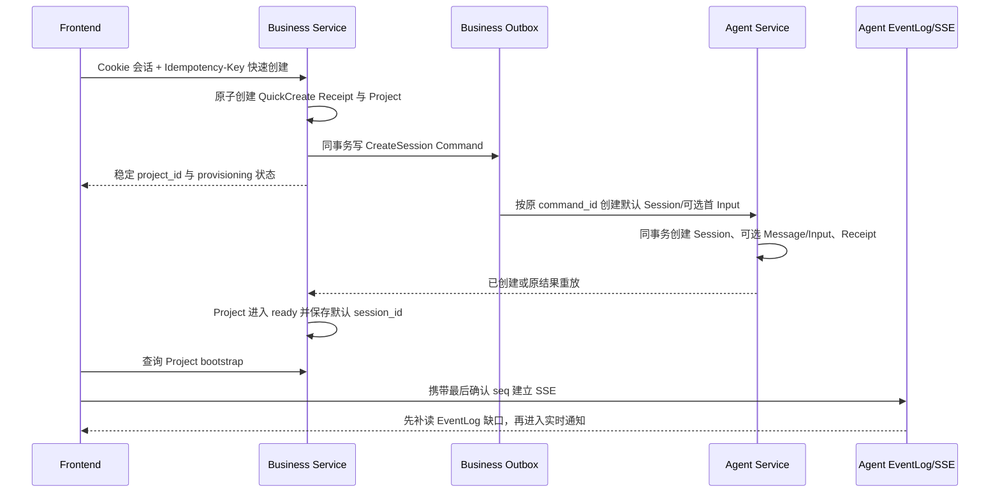

# Dora 全功能冒烟开发推进计划

> 文档状态：执行基线，M1 推进中
>
> 版本：v0.15
>
> 更新日期：2026-07-14
>
> 关联文档：[用户端需求总览](user-requirements-overview.md)、[管理端需求总览](admin-requirements-overview.md)、[服务端需求总览](server-requirements-overview.md)、[Graph Tool 功能需求总览](graph-tool-requirements-overview.md)、[支付与积分充值需求总览](payment-requirements-overview.md)、[共通业务规则与验收基线](common-requirements-baseline.md)、[Graph Tool 详细设计索引](../design/agent/graphtool/README.md)、[AIGC 跨 Module 契约目录](../design/cross-module/aigc-contract-catalog.md)、[W0 身份与工作台契约 v1](../design/cross-module/w0-identity-workspace-contract-v1.md)、[W0.5 Workspace Transport 契约 v1](../design/cross-module/w05-workspace-transport-contract-v1.md)、[Business 鉴权/Project 评审包](../design/business/auth-project-foundation-review.md)、[Agent Session/Event 评审包](../design/agent/session-event-foundation-review.md)、[SMK-001～004 垂直切片评审包](../design/testing/smk-001-004-vertical-slice-review.md)

## 1. 目标与完成定义

本计划的目标是把当前需求基线推进到“前后端可以开始全功能冒烟”的状态。这里的“全功能冒烟”指：桌面 Web 用户端和管理端的主要菜单、关键状态与跨服务主链路均有真实 API、真实 PostgreSQL 持久化和可重复测试数据，可以验证每个核心业务域至少一条成功路径及关键失败关闭路径。

达到该状态不等于生产上线。需求文档当前共有 131 个唯一验收 ID；全功能冒烟只选取覆盖产品宽度和关键一致性边界的 P0 场景，剩余并发、压测、容灾、安全和长尾状态进入完整回归与发布门禁。

冒烟分为两套：

1. **Local Deterministic Smoke（合并必跑）**：使用真实 PostgreSQL、Redis、etcd 和三个真实服务 Runtime；模型、媒体 Provider、对象存储和支付渠道使用可控 Adapter，仍完整执行签名、幂等、扣费、Job、回调、履约和事件链路。
2. **Provider Sandbox Smoke（环境具备时运行）**：使用真实模型/媒体 Provider 测试账号、微信支付沙箱或验收商户能力、支付宝沙箱，验证外部协议适配；凭据缺失不阻塞本地功能开发，但阻塞对应外部能力上线。

前后端“可开始全功能冒烟”的退出条件：

- 用户端和管理端主要页面不再依赖业务 Mock 数据；只有明确标记的外部 Adapter 可以使用确定性 Fake。
- `business-service`、`agent-service`、`business-worker` 可独立构建、迁移和启动，也可在本地组合启动。
- 六个 Graph Tool 均有已评审设计、发布 Definition、稳定 Schema、权限/预算/计费引用和至少一条端到端用例。
- Project、Session、Skill Snapshot、Storyboard、Asset、计费、支付、收益、公开作品、公告和管理治理均有真实持久化主路径。
- SMK-P0 矩阵全部自动化通过；测试失败能够定位到需求 ID、服务 Trace、领域记录和前端步骤。
- 所有正常扣费、充值、收益和冲正均可从追加式账本核对，不以页面状态代替账务事实。

## 2. 当前基线事实

| 范围 | 2026-07-14 当前事实 | 推进结论 |
| --- | --- | --- |
| 需求 | 六份需求文档形成 131 个唯一验收 ID，产品范围基本完整 | 以现有需求为基线，变更必须同步追踪矩阵 |
| Graph Tool | 需求已固定六个 Tool；服务端规范此前仍写五个 | 本轮已统一为六个，改动待评审 |
| 前端 | `frontend/` 可以构建且 332 项测试通过；真实 Login/Logout、Auth v1 Provider、QuickCreate/Bootstrap、Owner Skill 创建/编辑/审核提交、Reviewer 待审队列/冻结详情/当前发布对比/批准发布、最多 16 个 Published+Active Skill 的 QuickCreate v2 选择、正式 `/projects/:project_id/workspace`、严格 Snapshot DTO、Snapshot→SSE 与旧连接隔离、Session 级六 Tool 静态不可用目录均已接线；真实 Chromium 已验证 Creator 提交、Reviewer 批准、Creator 选择已发布 Skill、创建 Workspace 并读取六项全禁用目录的单一浏览器全链 | W0.5 与 W1 当前页面子集已可真实冒烟；Skill 市场、完整治理页面、全量 ADM-RBAC、Executable Registry 和后续业务域仍按波次补齐 |
| 服务端 | 三个独立 Module 已建立基础 Runtime；Business 已有 Auth、Project、Skill 草稿/审核/不可变发布、持久化 `skill_reviewer` 角色分配、登录与 Session Resolve 动态权限投影、Reviewer 队列/冻结详情/批准发布 HTTP、Project Skill Binding、QuickCreate v1/v2、双轨 Outbox/Dispatcher、Agent BFF 和 owner/ready Binding JOIN；Agent 已有 Session RPC v1/v2、身份断言验证/Redis 防重放、DRAE Keyring、不可变 Session Skill Snapshot Item 密文、REPEATABLE READ Workspace Snapshot 与 PostgreSQL poll-first SSE | W0.5 Transport 与 W1-A1/W1-B1/W1-C2 后端主链路已真实黑盒通过；当前仍不包含完整角色管理 HTTP、Executable Tool Registry、Graph/Runner、A2UI 或计费执行 |
| 根 Go Module | 根 `go.mod`、`go.sum` 已移除，只保留本地 `go.work`；三个 Module 已在 `GOWORK=off` 下独立校验 | CI 与发布继续禁止依赖根 Module 或跨 Module `internal` import |
| 本地基础设施 | PostgreSQL、Redis、etcd Compose、三独立数据库、独立 `_test` 契约库、Schema Migration、`foundation-smoke`、`w0-smoke`、`w05-browser-smoke` 与 W1-C2 canonical 门禁已可执行；`w1-smoke` 作为 `w1-browser-smoke` 的兼容别名，两者都强制执行 `@w1-real-review` 真实 Chromium 链路。W1 Evidence v3 覆盖持久化 Reviewer 授权、真实登录/API 批准、同 Cookie 撤权即时失效、提交 A 后继续编辑 B 仍只发布并冻结 A、100 并发非空 Skill QuickCreate v2、跨 Module Snapshot、密文清理和新旧 Session 隔离；关键布尔值与计数均由脱敏 API/数据库/Playwright/正式 Agent Load 结果聚合 | 继续以真实基础设施运行门禁；W1 Feature Flag 在普通配置中默认关闭，只由确认同批 Agent capability 的 Smoke/部署显式开启 |
| Graph Tool 设计 | 六个独立中文设计已起草，均为 Draft / 待评审 | 文档缺失已关闭；评审结论仍是 Agent/Graph Tool 实现硬门禁 |
| AIGC 跨 Module 契约 | Owner、Business RPC、`AGT-JOB-V1`、Event、Approval、计费与 unknown-outcome 已形成草案 | 三 Module、财务、安全和运维评审通过前不得创建对应生产契约 |
| 冒烟工程 | Fixture、协议 Adapter、35 条 Scenario、Evidence 与故障注入已形成独立草案；W0.5 已有本地 Seeder、真实 HTTP/RPC/Snapshot/SSE、真实 Chromium Driver 和失败安全的脱敏摘要 Evidence | W0.5 Transport API/浏览器子集可重复执行并已通过；真实受控断线、跨 owner UI、完整 A2UI/业务资源及 `SMK-001`～`SMK-004` 整体仍待实现 |
| 历史迁移资产 | 已盘点 `main@6d0fc111` 顶层资产和 29 个 `internal/aigc` 一级包 | 只按清单逐函数/逐测试迁移，禁止整体恢复单体目录 |
| 历史代码 | `main` 分支包含旧根 Module Demo | 只允许按已评审设计选择性迁移，不允许整分支恢复 |

## 3. 已冻结的推进边界

1. 仓库采用 `business/`、`agent/`、`worker/` 三个独立 Go Module；根目录只负责协作与本地 `go.work`。
2. 用户工具箱按以下顺序展示六个稳定 Tool：`plan_creation_spec`、`analyze_materials`、`plan_storyboard`、`generate_media`、`write_prompts`、`assemble_output`。
3. 实现依赖顺序可以与展示顺序不同：先完成规划、分析、故事板和 Prompt，再接媒体生成与装配。
4. Business 是用户、鉴权、Project、Skill、Storyboard、Asset、支付、积分、收益、公开作品和管理治理的业务真源。
5. Agent 是 Session/Input/Turn、Graph Tool Run、Approval、Operation/Batch/AIGC Job、Continuation、EventLog 和 A2UI 的执行真源。
6. Worker 不选择 Skill、不决定 Prompt、不调用 Agent、不扣费或退款；只消费已持久化任务并执行 Provider、对象存储和 Business Finalize。
7. 可计费执行必须先由 Business 按冻结版本原子扣费成功，再允许创建或执行下游副作用；技术重试不得重复扣费。
8. 已开始执行的正常费用不因失败、取消或用户改变主意退款；只有账务差错通过追加式冲正纠正。
9. PostgreSQL 是业务和执行权威状态，Redis 只用于缓存、短期协调和唤醒，etcd 只用于服务注册发现。
10. 用户端不展示 Skill 版本明细；内部发布快照、审核修订和历史冻结事实仍必须可追踪。

## 4. 关键路径与里程碑


### M0：需求与设计门禁

交付物：

- 六个 Graph Tool 口径统一，历史实现与当前分支事实分离。
- 六份独立中文 Graph Tool 设计，包含流程图、稳定 Node、类型、Graph State、业务状态机、权限、预算、幂等、失败和审核结论。
- 跨 Module 数据 Owner 与契约目录：HTTP、Thrift、Event、Job Payload、支付回调、A2UI/SSE。
- SMK-P0 场景、Fixture、测试账号、确定性 Adapter 和证据格式冻结。
- 旧 `main` 可迁移资产清单，逐项标记“复用、重写、废弃”，禁止按目录整体搬迁。

退出门槛：六个 Tool 设计全部评审通过；关键契约不再存在 Owner、状态或幂等语义冲突；M1 的目录和 Migration Owner 可以无歧义创建。

### M1：三 Module 与契约骨架

交付物：

- 三个独立 `go.mod`、生产 Runtime、配置、健康检查、优雅关闭和独立 CI。
- Business、Agent、Worker 各自 Schema 与首个版本化 Migration；本地 PostgreSQL、Redis、etcd Compose。
- Thrift/HTTP/Event/Job 契约及生成代码；不得跨 Module import `internal`。
- 真实 PostgreSQL Repository、Outbox/Inbox 基础设施、UUIDv7、Clock、ID Generator 和 Fake Adapter 注入点。
- 前端 API Client、鉴权会话、统一错误和事件连接基础层。

退出门槛：三个 Module 在 `GOWORK=off` 下独立构建测试；空库 Migration、服务注册发现、Readiness 和契约测试通过；本地一条无业务副作用的跨服务探针可追踪。

当前进度拆分：

- **M1.1 基础 Runtime（已完成）**：三个独立 Module 与生产入口、类型化配置、PostgreSQL/Redis/etcd 启动探针、`livez/readyz`、Business/Agent 租约注册、Worker 资源边界、优雅退出、三 Schema Migration、Compose、独立 CI 和可重复基础冒烟。
- **M1.2 契约与持久化骨架（W0 第一批已完成）**：Foundation Thrift/etcd Probe、三 Module UTC Clock/UUIDv7、Runtime Schema 契约检查和真实 PostgreSQL CI 已完成；W0 又新增 Business 8 张、Agent 9 张权威表、两端固定 Canonical Digest 向量、QuickCreate/Ensure 原子 Repository、并发/回滚测试和缺表 Readiness。Business 从真实 Prompt 独立推导语义与跨服务 Digest，Agent 以冻结的 `DRAE` AEAD Envelope v1 在 Service、Repository、数据库三层拒绝裸内容；真实 PostgreSQL 契约测试已经接入 CI。W0 Transport 以外的其他领域仍受各自评审门禁约束。
- **M1.3 前端接入底座（W0.5 Workspace Transport 已完成）**：统一 API Client、Auth v1 四态内存会话、结构化错误、真实登录/退出、QuickCreate/Bootstrap、稳定幂等意图、正式路由、严格 Snapshot/Event DTO、Cursor/Reset/Probe、旧代次隔离及六态 Input 展示已完成；其他业务页面 Mock 替换进入对应领域波次。
- **M1.4 W0 身份与工作台纵切（W0.5 API/浏览器主路径已通过）**：真实黑盒已经覆盖 Auth、100 并发同键创建、重放/冲突、generated Kitex、Prompt 清理、Business BFF owner 门禁、双用户跨 Owner Project/Workspace/Events、Agent Snapshot 解密、SSE 补读/Ready/Reset、空 Prompt 非 null 空数组、页面首 Prompt、硬刷新同 Session、404 与退出撤销；组件矩阵覆盖 Reset 完整回源和旧连接隔离。`SMK-004A` 的主体实现已具备，但在真实 TCP/服务重启、Retention Reset 与浏览器故障注入完成前不宣称全绿；A2UI/Storyboard/Asset/Run 的 `SMK-004B` 仍未关闭。
- **M1.5 W1 Skill Foundation、Reviewer 纵切与 Session Snapshot（W1-A1/W1-B1/W1-C2 主路径已通过）**：Business 已实现结构化 Skill 草稿、Owner 读取、审核提交、持久化 `skill_reviewer` 分配、登录与每次 Session Resolve 的动态权限投影、Reviewer 队列/冻结详情/当前发布对比/批准发布、正式发布事务、Project Binding/Resolution、完整加密 Bootstrap v2 和 active/previous keyring；Agent 已实现数据库级 append-only Session Snapshot Header/Item、专用用途派生 AES-GCM、Ensure/Query v2、Receipt 语义重验和 V1/V2 command 隔离；前端已实现 Owner Skill Builder、Reviewer 管理入口与 QuickCreate Skill Picker，空选择严格保持 v1、非空选择显式进入 v2，并在第 17 项前失败关闭。W1-C2 canonical 门禁命令 `make w1-browser-smoke`（以及其兼容别名 `make w1-smoke`）已用真实 PostgreSQL/Redis/etcd、当前 worktree 构建的真实 Business/Agent Runtime 和 Chromium 证明 100 并发幂等、发布/治理审计、Business/Agent/verifier 三方 digest/count 一致、Agent 正式 Load 解密重验、Outbox 密文清理、旧 V1 Session 不回写，以及单一真实浏览器中的 Creator 提交 → Reviewer 批准 → Creator 选择已发布 Skill → QuickCreate v2。脚本对任何缺少 `@w1-real-review` 的 W1 调用失败关闭，禁止生成 canonical W1 v3 passed Evidence。Smoke 还通过部署控制的窄权限 CLI 撤销 Reviewer 分配，并证明同一 Cookie 再次 Resolve 后角色/capability 为空且管理 API 返回 403。完整 ADM-RBAC、在线角色管理、拒绝/暂停/下线、Skill 市场与完整治理页面仍是后续工作。

M1.1 当时的 Migration 只创建各自 Schema；W0 冻结并经用户确认后才以前向 Migration 增加本批业务表。Graph Tool、Job、财务和其他跨 Module 契约门禁继续有效。

### M2：黄金创作闭环

按以下业务链路纵向实现，不按页面或服务横向堆积半成品：

```text
登录用户
  → 创建 Project / Session / 首 Input
  → 冻结 Session Skill Snapshot
  → 选择或调用六个 Graph Tool
  → Creation Spec Approval
  → Storyboard Pending Revision / Approval
  → write_prompts 生成并冻结 Prompt
  → Business PrepareGeneration 原子扣费
  → Agent Operation / Batch / Job / Outbox
  → Worker Claim / Provider / TOS / Business Finalize
  → Batch terminal event / Agent Inbox / Continuation
  → EventLog / SSE / A2UI / Storyboard / Asset 刷新
```

退出门槛：SMK-002 至 SMK-020、SMK-033 在 Local Deterministic 环境通过；刷新、重连、重试和进程重启不重复执行或扣费。

### M3：产品宽度补齐

在黄金链路稳定后补齐：Skill 市场与创建发布、资产中心、钱包与账单、微信/支付宝充值、发布者收益回收、精选作品、点赞、公告、帮助反馈、账号设置，以及管理端 Skill/Tool/支付/财务/任务治理。

退出门槛：用户端和管理端主要页面都连接真实 API；SMK-001、SMK-005 至 SMK-006、SMK-021 至 SMK-032、SMK-034 至 SMK-035 通过。

### M4：双套全功能冒烟

- Local Deterministic Smoke 在干净数据库上可一键准备、执行、销毁和重复运行。
- Provider Sandbox Smoke 验证真实外部协议，不把同步回跳或客户端参数当作支付成功事实。
- CI 保存 JUnit、前端 Trace/截图、服务日志关联 ID 和失败时的领域状态摘要，严禁保存 Secret 或完整敏感 Payload。

退出门槛：SMK-P0 全绿且连续重复运行结果稳定；任何失败都能按 `smoke_id → requirement_id → trace_id → aggregate_id/ledger_id` 追踪。

### M5：完整回归与上线加固

完成 131 个验收 ID 的全量追踪、NFR-001 压测、NFR-002 恢复演练、安全测试、灰度/回滚、对账和运营 Runbook。本阶段是发布门禁，不阻塞前后端开始全功能冒烟。

## 5. Module Owner 与跨服务边界

| 领域事实 | 权威 Owner | 其他 Runtime 的访问方式 |
| --- | --- | --- |
| 用户、鉴权、实名、权限 | Business | HTTP DTO；Agent/Worker 通过批量 RPC 或冻结可信上下文 |
| Project、Skill 草稿/发布快照、Storyboard、Asset/Binding | Business | Agent 通过版本化 Thrift RPC；前端通过 Business HTTP |
| 积分、扣费明细、充值、收益、冲正 | Business | Agent/Worker 只能调用幂等 RPC，不直接写账本表 |
| Session、Input、Turn、Receipt、Approval、EventLog | Agent | 前端通过 Agent HTTP/SSE；Business 只交换显式 DTO/Event |
| Graph Tool Definition/Run、Operation、Batch、AIGC Job | Agent | Worker 通过待评审的版本化 Job 消费契约领取与提交，不获得 Agent 普通表所有权 |
| Worker 私有 Attempt、执行回执、Inbox/Outbox | Worker | 只由 Worker Migration 管理；终态通过版本化 Event/RPC 回流 |
| Provider 调用、对象存储上传、Business Finalize | Worker 执行，Business/Agent 分别保存各自权威结果 | 稳定幂等键、Receipt 和 Lease/Fencing；Unknown Outcome 先核对 |
| 精选作品、点赞、公告、工单、管理审计 | Business | 用户端/管理端通过 Business HTTP；公开快照与私有事实隔离 |

M0 必须把上表细化为逐契约清单，并对每项明确：生产者、消费者、Schema Version、幂等键、权限上下文、超时、重试 Owner、Unknown Outcome、兼容策略和契约测试。上表只冻结责任边界，不替代详细设计。

## 6. SMK-P0 全功能冒烟矩阵

状态枚举：`待设计`、`待实现`、`可执行`、`通过`、`阻塞`。状态以整条 Smoke 场景为单位；一个 Transport 子集通过不等于包含浏览器、Workspace/SSE 或完整 RBAC 的场景已经通过。具体功能开始前仍要满足对应设计门禁。

| Smoke ID | 端到端场景 | 需求映射 | 主要范围 | 状态 |
| --- | --- | --- | --- | --- |
| SMK-001 | 登录、退出、普通用户/管理员权限隔离与越权失败 | ADM-RBAC-001 | Business + 前端 | 待实现 |
| SMK-002 | 带提示词并发创建只得到一个 Project/Session/Input 并打开工作台 | USR-CREATE-001、SRV-CREATE-001 | Business + Agent + 前端 | 待实现 |
| SMK-003 | 空提示词只创建空工作台且不运行、不扣费 | USR-CREATE-002、SRV-CREATE-002 | Business + Agent + 前端 | 待实现 |
| SMK-004 | 工作台刷新与 SSE 重连恢复 Chat/A2UI/故事板/资产状态 | USR-WORKSPACE-001、SRV-READ-001 | Agent + Business + 前端 | 待实现 |
| SMK-005 | 创建 Skill 的结构化六能力表单与未授权 `@Tool` 失败关闭 | USR-SKILL-001、USR-SKILL-002 | Business + 前端 | 待实现 |
| SMK-006 | Skill 草稿、发布、审核及旧/新 Session 快照隔离 | USR-SKILL-003、USR-SKILL-004、SRV-SKILL-001、SRV-SKILL-002、AGT-005 | Business + Agent + 前端 | 待实现 |
| SMK-007 | 工具箱按顺序展示六 Tool，缺前置条件时可发现并说明原因 | USR-TOOL-001、GTL-CAT-001、GTL-CAT-002、SRV-GTL-001 | Agent + Business + 前端 | 待实现 |
| SMK-008 | 显式选择 `write_prompts` 后冻结 Tool，不被 Agent 静默替换 | USR-TOOL-002、GTL-USE-001、GTL-USE-002、SRV-GTL-002 | Agent + 前端 | 待实现 |
| SMK-009 | 流程规划产生 Creation Spec、预算、待确认项，确认前不生成媒体 | GTL-PLAN-001 | Agent + Business + 前端 | 待实现 |
| SMK-010 | 素材分析读取真实内容并带引用，不可读内容返回 `partial` | GTL-ANALYZE-001 | Agent + Business + Worker + 前端 | 待实现 |
| SMK-011 | 故事板产生 Pending Revision，正式 Approval 后才替换 Active | GTL-STORY-001、AGT-003、SRV-AGT-003 | Agent + Business + 前端 | 待实现 |
| SMK-012 | Prompt 在故事板内保留锁定项，并支持无故事板独立结果 | GTL-PROMPT-001、GTL-PROMPT-002、USR-TOOL-003 | Agent + Business + 前端 | 待实现 |
| SMK-013 | 故事板媒体生成先扣费后派发，迟到结果不覆盖新版本 | GTL-MEDIA-002、GTL-MEDIA-003、SRV-BILL-001 | Business + Agent + Worker + 前端 | 待实现 |
| SMK-014 | 无故事板独立生成候选资产，不创建虚假 Skill Invocation | GTL-MEDIA-001、SRV-GTL-003、USR-TOOL-003 | Business + Agent + Worker + 前端 | 待实现 |
| SMK-015 | 视频剪辑生成版本化时间线并异步导出真实可播放媒体 | GTL-EDIT-001、GTL-EDIT-002 | Business + Agent + Worker + 前端 | 待实现 |
| SMK-016 | 异步 Run 刷新/重启恢复，取消只停止未开始项并核对费用 | GTL-ASYNC-001、GTL-CANCEL-001、AGT-004、SRV-AGT-004 | Agent + Worker + 前端 | 待实现 |
| SMK-017 | Session 并发输入串行；冻结 Receipt 后投影重试不再次调用或扣费 | AGT-001、AGT-002、SRV-AGT-001、SRV-AGT-002 | Agent | 待实现 |
| SMK-018 | 重复唤醒、多 Worker 竞争、Provider Unknown Outcome 均不重复副作用 | WRK-001、WRK-002、SRV-WRK-001、SRV-WRK-002 | Worker + Agent + Business | 待实现 |
| SMK-019 | 旧版本结果隔离；重复 terminal event 只创建一次 Continuation | WRK-005、SRV-WRK-003、SRV-WRK-004、GTL-MEDIA-004 | Worker + Agent | 待实现 |
| SMK-020 | Redis 不可用时 PostgreSQL 恢复 Claim，Worker 优雅退出可接管 | WRK-003、WRK-004、SRV-EVENT-001 | Worker + Agent | 待实现 |
| SMK-021 | Graph Tool 并发运行只执行/扣费一次；余额不足不调用下游 | GTL-IDEM-001、GTL-BILL-001、BILL-001、BILL-002、BILL-005、USR-BILL-001、USR-BILL-002、SRV-BILL-003 | Business + Agent + Worker + 前端 | 待实现 |
| SMK-022 | 失败/部分成功/取消不退款，汇总正确；账务差错只追加冲正 | BILL-003、BILL-004、BILL-006、USR-BILL-003、SRV-BILL-002 | Business + 前端 | 待实现 |
| SMK-023 | Skill 归因收益与平台直调隔离，Dashboard 可核对，五折回收幂等且余数保留 | GTL-EARN-001、BILL-007、USR-EARN-001、SRV-EARN-001、ADM-DASH-001 | Business + 前端 + 管理端 | 待实现 |
| SMK-024 | 幂等创建冻结商品订单，展示微信二维码、支付宝收银台与同步回跳确认中 | PAY-PRODUCT-001、PAY-CREATE-001、PAY-CREATE-002、PAY-WX-001、PAY-ALI-001、USR-PAY-001、USR-PAY-002、USR-PAY-003 | Business + 前端 | 待实现 |
| SMK-025 | 合法支付通知并发重放只到账一次，伪造/错金额/错商户被拒绝 | PAY-NOTIFY-001、PAY-NOTIFY-002、PAY-SEC-001、SRV-PAY-001、SRV-PAY-002 | Business | 待实现 |
| SMK-026 | 下单未知、通知丢失或服务重启时按原订单主动查单，不创建第二笔支付 | PAY-QUERY-001、PAY-UNKNOWN-001、PAY-RECOVERY-001、SRV-PAY-003 | Business + 前端 | 待实现 |
| SMK-027 | 支付确认前后崩溃可恢复唯一积分履约 | PAY-FULFILL-001、PAY-FULFILL-002、SRV-PAY-004、USR-PAY-004 | Business + 前端 | 待实现 |
| SMK-028 | 订单关闭、迟到支付、无退款与渠道强制异常进入正确状态 | PAY-CLOSE-001、PAY-LATE-001、PAY-NOREFUND-001、PAY-EXCEPTION-001 | Business + 前端 + 管理端 | 待实现 |
| SMK-029 | 管理端审核后只公开确认快照；点赞与风控计数可核对；系统无评论入口和对象 | USR-WORK-001、USR-LIKE-001、USR-NOSOCIAL-001、SRV-PUBLIC-001、SRV-LIKE-001、ADM-WORK-001、ADM-LIKE-001、ADM-NOSOCIAL-001 | Business + 前端 + 管理端 | 待实现 |
| SMK-030 | 全局公告按版本/频率展示，撤回后停止且无消息中心入口 | USR-ANN-001、ADM-ANN-001 | Business + 前端 + 管理端 | 待实现 |
| SMK-031 | 管理端审核 Skill、发布/暂停 Tool 版本，确保新旧 Run 按冻结版本治理 | GTL-VER-001、ADM-SKILL-001、ADM-SKILL-002、ADM-TOOL-001、ADM-GTL-001、ADM-GTL-002、GTL-ADM-001 | Business + Agent + 管理端 | 待实现 |
| SMK-032 | 管理端安全发布支付配置，按权限完成对账/履约、账务、收益和任务重放 | PAY-RBAC-001、PAY-RECON-001、ADM-BILL-001、ADM-BILL-002、ADM-PAY-001、ADM-PAY-002、ADM-PAY-003、ADM-EARN-001、ADM-AGENT-001、SRV-ADMIN-001 | Business + Agent + Worker + 管理端 | 待实现 |
| SMK-033 | 已知 A2UI 可实时/回放渲染，危险 Markdown 与未知 Action 安全降级 | USR-A2UI-001、AGT-006、SRV-A2UI-001 | Agent + 前端 | 待实现 |
| SMK-034 | 资产中心命名统一，未授权资产在读取和副作用前失败关闭 | USR-ASSET-001、GTL-SEC-001 | Business + Agent + 前端 | 待实现 |
| SMK-035 | 帮助、工单、账号资料、安全、隐私和注销主路径使用真实 API | 用户端需求 6.10、6.11 | Business + 前端 + 管理端 | 待实现 |

截至 2026-07-14，`SMK-001`～`SMK-003` 的 W0.5 Transport API/浏览器子集已经真实黑盒通过，但完整场景仍保持 `待实现`：`SMK-001` 还缺管理员角色/数据范围越权闭环；`SMK-002`/`SMK-003` 已覆盖 Workspace Snapshot/SSE 水合，但真正 Runner/费用禁止副作用和完整业务 UI 尚未进入本批。`SMK-004A` 的 Session/Event Snapshot、补读、Reset、前端 Probe 和硬刷新底座已通过；完整 `SMK-004` 仍缺真实受控断线/跨 owner 浏览器矩阵及 Chat/A2UI/故事板/资产投影，因此不得整体标记为可执行或通过。

同日，`SMK-005/006` 的 W1 API/数据库和页面子集已经由 `w1.skill-foundation.smoke.evidence.v3` 真实黑盒通过：Skill 草稿/更新/审核、持久化 Reviewer 角色分配与动态 Session 权限投影、真实 HTTP 队列/冻结详情/批准发布、同义回执重放、同 Cookie 撤权即时失效、`public_tool_refs` 失败关闭、100 并发非空绑定 QuickCreate v2、Business→Agent Snapshot、三方摘要与数量逐值一致、正式 Load 解密重验、密文清理、V1/V2 Session 隔离，以及不依赖 API mock 的 Creator → Reviewer → Published Skill 选择 → Workspace 单一 Chromium 全链。W1-B2/W1-C1 的六 Tool 静态目录也已由同一 Evidence 的 API exact-set、跨 Owner 404 和真实浏览器六项禁用投影通过；这只是 `SMK-007/008` 的契约准备，不能宣称 Tool 可执行。完整 Skill 场景仍保持 `待实现`，因为公开 Skill 市场/发现、Skill 测试调用及更完整的治理状态与浏览器失败矩阵尚未覆盖；这一判断不再由 Reviewer 夹具或管理入口缺失造成。

需求映射用于建立交付追踪，不表示一条 Smoke 用例替代该需求 ID 的全部压力、容灾和安全验收；这些深度门禁仍在 M5 单独执行。每个 Smoke ID 最终必须至少绑定：一个前端端到端用例、相关 Module 的契约/集成测试、固定 Fixture、预期账本或状态断言，以及失败时的最小证据集合。只点开页面或只断言 HTTP 200 不算通过。

## 7. 近期执行顺序

| 顺序 | 工作包 | 交付结果 | 当前状态 |
| --- | --- | --- | --- |
| P0-01 | 六 Graph Tool 与当前仓库事实收口 | Agent 规范、用户需求用词、README 同步 | 已修改，待评审 |
| P0-02 | 全功能冒烟执行基线 | 本文、SMK-P0 和里程碑门禁 | 已起草，待评审 |
| P0-03 | 六 Graph Tool 独立设计 | 六份设计文档及审核结论 | 已起草，待跨角色评审，仍阻塞实现 |
| P0-04 | 跨 Module 契约与数据 Owner 设计 | RPC/Event/Job/A2UI/支付回调目录及兼容策略 | AIGC 部分已起草；支付、管理和完整外部契约待补齐 |
| P0-05 | 冒烟工程设计 | Fixture、Fake/Sandbox Adapter、测试数据与证据规范 | 已起草，待测试/运维/安全评审 |
| P0-06 | 历史 `main` 迁移资产审计 | 顶层资产和 29 个 `internal/aigc` 一级包逐项分类 | 包级盘点完成；具体迁移 PR 逐文件复核 |
| P1-01 | 三 Module 和本地基础设施骨架 | 独立构建、Migration、Compose、CI、健康检查 | M1.1、W0/W0.5 与 W1-A1/W1-B1 后端主链路已完成并真实黑盒通过；Graph/Worker/财务域仍按后续波次推进 |
| P1-02 | 前端接入底座 | API Client、认证会话、错误映射、SSE 游标重连、开发代理和 CI | 正式鉴权、QuickCreate、Workspace Snapshot/SSE、Skill 创建/我的 Skill、Reviewer 管理入口、最多 16 项的 Project Skill 选择和真实发布后选择创建的单一 W1 Chromium 全链已接线；市场、完整治理和后续业务页面继续按领域波次推进 |
| P2-01 | 黄金链路最小纵切 | SMK-002 至 SMK-020、SMK-033 可执行 | 待开始 |
| P3-01 | 用户端/管理端宽度补齐 | SMK-P0 全部可执行 | 待开始 |
| P4-01 | 双套冒烟与稳定性收口 | Local 必跑、Sandbox 可审计、全绿报告 | 待开始 |

Graph Tool 设计建议按依赖推进：共享 Definition/Run 契约 → `plan_creation_spec` → `analyze_materials` → `plan_storyboard` → `write_prompts` → `generate_media` → `assemble_output`。每份设计仍独立评审，后一个工具不得靠未冻结的前一个输出猜测契约。

## 8. 开发就绪与完成门禁

单个功能进入编码前必须满足 Definition of Ready：

- 需求 ID、业务 Owner、Module Owner 和用户可见结果明确。
- HTTP/RPC/Event/Job/A2UI 契约有版本、幂等键、权限和兼容策略。
- 表 Owner、状态机、逻辑关联、事务边界、Outbox/Inbox 和 Unknown Outcome 已设计。
- 涉及 Graph Tool 时独立中文设计已经评审通过。
- 前端状态包含 loading、empty、error、permission denied、processing 和 terminal，不只设计成功态。
- 测试 Fixture 和可观测字段在编码前确定。

单个功能进入冒烟矩阵前必须满足 Definition of Done：

- 前端不读取业务 Mock；API 错误和断线可恢复。
- Module 单元、集成、契约、并发/幂等测试按风险通过。
- Migration 可从空库执行，表字段有中文 COMMENT，无数据库物理外键。
- 关键副作用具备幂等键、Receipt、状态记录和审计；日志不泄露 Secret。
- 对应 Smoke ID 已自动化并能在干净环境重复运行。
- 文档中的“当前实现”已用当前分支代码、Migration 和测试核验。

## 9. 当前阻塞与决策记录

| 编号 | 项目 | 处理决定 |
| --- | --- | --- |
| BLK-001 | 六个 Graph Tool 独立设计尚未评审 | 六份草案已齐备；逐份评审通过前不创建对应实现或 Migration |
| BLK-002 | 跨 Module Job 消费与 Finalize 契约尚未评审冻结 | 草案选择 Agent Migration Owner 的 `AGT-JOB-V1` 受控视图/函数、CAS/Fence 和同事务 Terminal Outbox；评审前禁止 Worker 接入 |
| BLK-003 | 根 Go Module 与目标布局不一致 | 已关闭：根 `go.mod/go.sum` 已移除，三个 Module 与本地 `go.work` 已建立 |
| BLK-004 | 前端多数页面仍使用 Mock | M2/M3 按纵向链路替换；不做一次性全量重写 |
| BLK-005 | 真实模型、媒体和支付验收环境依赖外部凭据 | Local 使用协议等价 Fake 保证持续开发；Sandbox 凭据在对应能力上线前补齐 |
| RSK-001 | Kitex `v0.16.2` 的传递依赖 dynamicgo 在 Go 1.26 上输出性能降级提示 | Foundation 功能、race 与真实 RPC 已通过；按规范用独立升级变更评估新版 Kitex/dynamicgo，生产压测签核前关闭该风险 |
| DEC-001 | 五/六 Graph Tool 冲突 | 以需求基线的六个为准，新增 `write_prompts`，并同步 Agent 规范与 README |
| DEC-002 | Skill Dashboard 的版本表达冲突 | 用户端改为“发布与审核记录”，不提供版本明细；内部仍保留不可变快照和修订审计 |
| DEC-003 | 历史 `main` 代码如何使用 | 仅作为测试和实现参考，按新设计选择性迁移，不整分支恢复 |
| DEC-004 | Approval 如何跨越长等待 | 持久化 Agent Approval 并结束当前 Graph；决策产生新 Continuation Turn，不长期保留 Graph 栈 |
| DEC-005 | Worker 如何消费 Agent Job | Agent 拥有 Job/Migration，通过版本化受控数据库函数与最小权限给 Worker Claim/续租/终态提交；Worker 不直写普通表 |
| DEC-006 | 素材分析是否在 Tool 内启动提取任务 | v1 只读取 Business 已持久化提取结果；缺失时 partial/failed，OCR/ASR/抽帧属于素材接入前置流水线 |
| DEC-007 | 历史单体代码如何迁移 | 优先复用算法、协议测试向量和失败用例；Owner/持久化/Runtime 一律按新设计重写，禁止整体复制 `internal/aigc` |
| DEC-008 | 设计评审未完成时能否建立 Runtime | 可以先建立不含业务 DTO/表/Graph/Job 消费的基础 Runtime 与 Schema；任何领域契约和副作用仍受原门禁约束 |
| DEC-009 | AIGC 契约未冻结时如何验证跨服务 RPC | 单独冻结无业务副作用的 Foundation RPC v1，只验证生成、发现、超时、关联与摘除；不解除任何领域契约门禁 |

本计划在以下情况必须同步更新：需求 ID 增删、Graph Tool 白名单变化、Module Owner 变化、跨服务契约破坏性变更、Smoke 场景增删或里程碑退出条件变化。

## 10. 从当前基线到全功能冒烟的分波推进

开发不按前端、Business、Agent、Worker 四个仓库方向分别铺开，而按能独立验收的纵向业务波次推进。每一波都必须同时交付契约、Migration、后端实现、前端状态、自动化场景和 Evidence；上一波未关闭的 Owner、幂等或安全问题不得扩散到下一波。

| 波次 | 覆盖 Smoke | 主要结果 | 进入下一波的门槛 |
| --- | --- | --- | --- |
| W0 身份与工作台 | `SMK-001`～`SMK-004` | 安全登录态、Project 快速创建、默认 Session/Input、工作台恢复、EventLog/SSE | 100 次同键并发只创建一套事实；刷新/断线恢复不重复 Input 或副作用 |
| W1 Skill 与 Tool 基础 | `SMK-005`、`SMK-006`，并准备 `SMK-007/008` 契约 | Skill 草稿/发布快照、Session Snapshot v2、六 Tool 目录 DTO 与不可用原因 | 新旧 Session 快照隔离；无权限公共 `@Tool` 从前后端共同失败关闭；不得把未评审 Graph 标记为可执行 |
| W2 同步创作能力 | `SMK-009`～`SMK-012` | Creation Spec、素材分析、Storyboard、Prompt 与正式 Approval | 四个同步 Graph Tool 设计审核、Compile、状态机、Receipt、A2UI 全部通过 |
| W3 异步生成与恢复 | `SMK-013`～`SMK-020` | PrepareGeneration、Operation/Batch/Job、Worker、Finalize、Continuation | 扣费先于执行；崩溃、重复唤醒、Unknown Outcome、Fence 和 Redis 故障可恢复 |
| W4 账务、收益与支付 | `SMK-021`～`SMK-028` | 追加式积分账本、收益、商品订单、支付通知/查单/履约 | 正常扣费、收益、充值和冲正逐笔可核对，支付重放最多履约一次 |
| W5 产品宽度与治理 | `SMK-029`～`SMK-035` | 公开作品、点赞、公告、管理治理、资产权限、工单与账号设置 | 用户端和管理端主要页面移除业务 Mock，RBAC 与高敏审计完整 |
| W6 全量收口 | `SMK-001`～`SMK-035` | Local Deterministic 全量、Provider Sandbox、Evidence、稳定性 | 干净环境连续两次全绿，无跨 Run 污染，失败可定位到权威状态 |

### 10.1 W0 的推荐技术路径

W0 先建立以后所有业务复用的身份、聚合创建和可恢复事件通道，不接入 ChatModel、Graph Tool 或 Worker。推荐的边界如下，具体字段和状态在三份评审包通过后冻结：



推荐使用“Business 先持久化、Outbox 可恢复派发、前端打开 provisioning 工作台”的方式，而不是在跨数据库长事务中同步等待 Agent。这样同时满足：

1. Business 是 Project 与公开幂等响应的唯一 Owner；
2. Agent 是 Session、Message/Input、Receipt 和 EventLog 的唯一 Owner；
3. 100 个并发请求可以重放同一 `project_id`，不会有 100 次 RPC 副作用；
4. Agent RPC 超时或返回未知时按原 `command_id` 查询，不生成新键重试；
5. Redis 不可用不影响创建事实，PostgreSQL Outbox/扫描可以恢复；
6. 前端在 1 秒目标内进入工作台骨架，并以 bootstrap 状态切换到 ready；
7. 空提示词只省略 Message/Input/Turn，不省略 Project 与默认 Session。

W0 不实现 Eino Agent、Graph Tool、Skill 选择、扣费或 Worker。首 Input 只先持久化并形成可恢复待处理事实；真正 Runner 消费在 W1/W2 接入后再启用，避免把空壳 Runtime 宣称为可执行 Agent。

### 10.2 W0 的 21 项可执行任务

| 序号 | 任务 | Owner | 产物与验证 |
| --- | --- | --- | --- |
| W0-01 | 核对 `SMK-001`～`SMK-004` 的 Given/When/Then/Forbidden/Evidence | 产品、测试、主 Agent | 需求覆盖矩阵，无未映射的登录/退出验收 |
| W0-02 | 冻结登录态方案 | Business、安全、前端 | Cookie、Session、CSRF、过期、续期、登出、封禁和审计决议 |
| W0-03 | 冻结 Auth HTTP DTO 与错误信封 | Business、前端 | `/api/v1` 路径、稳定错误码、RequestID、契约测试向量 |
| W0-04 | 冻结 Project QuickCreate DTO | Business、前端 | Idempotency-Key、提示词规范化、同键异义冲突、响应重放规则 |
| W0-05 | 冻结 Project 状态机 | Business | `provisioning/ready/failed` 合法迁移、Expected Version、重试与展示语义 |
| W0-06 | 冻结 CreateSession Thrift v1 | Business、Agent | Command/Query Result、超时、Unknown Outcome、兼容和代码生成规则 |
| W0-07 | 冻结 Agent Session/Skill Snapshot/Input/EventLog/SSE 契约 | Agent、前端 | 显式空快照、Input/Lease 状态、各类 seq、cursor、历史重放、心跳、鉴权和错误事件 |
| W0-08 | 评审 Business Migration | Business、DBA | User/AuthSession/Project/Receipt/Outbox 表、索引、中文 COMMENT、无物理外键 |
| W0-09 | 评审 Agent Migration | Agent、DBA | Session/Message/Input/Receipt/EventLog 表、索引、中文 COMMENT、无物理外键 |
| W0-10 | 实现 Business 用户与安全会话 | Business | Argon2id 凭证、Opaque Session 摘要、Cookie/CSRF、登录/退出/当前会话测试 |
| W0-11 | 实现 Business Project 与幂等创建 | Business | Entity、Repository、Service、同键重放/异义冲突/100 并发测试 |
| W0-12 | 实现 Business Outbox 与创建编排 | Business | Project 与 Outbox 同事务、重投、失败状态、脱敏审计 |
| W0-13 | 实现 Agent Session/空 Skill Snapshot/Input/EventLog Repository | Agent | Message/Input/Event Counter、append-once、每 Session 单调 seq、事务与并发测试 |
| W0-14 | 实现 Agent CreateSession RPC 与 Receipt | Agent | 原 command 重放、异义冲突、Unknown Outcome 查询、契约测试 |
| W0-15 | 实现 Agent SSE Tail | Agent | cursor 补读、实时切换、通知丢失轮询、慢消费者和取消测试 |
| W0-16 | 实现 Business→Agent Dispatcher | Business、Agent | etcd 发现、deadline、单一重试 Owner、结果核对和 Project ready 投影 |
| W0-17 | 接入前端 Session bootstrap | 前端 | 冷启动、401 失效、登录/退出、路由守卫、Cookie 凭证与 CSRF |
| W0-18 | 接入前端 QuickCreate 与工作台路由 | 前端 | provisioning/ready/failed、重复点击复用键、刷新恢复 |
| W0-19 | 接入前端 SSE 与读模型水合 | 前端、Agent、Business | cursor、旧连接隔离、事件缺口、REST 回源和错误降级 |
| W0-20 | 建立 `SMK-001`～`SMK-004` 自动化 | 测试、三端 | API Driver、UI Driver、Fixture、Evidence、禁止副作用断言 |
| W0-21 | 运行 W0 总门禁 | 主 Agent | 三 Module 独立测试、前端测试/构建、Compose、100 并发和断线恢复报告 |

### 10.3 W1～W6 的长计划

| 阶段 | 主要任务 | 关键前置 | 主要验收 |
| --- | --- | --- | --- |
| W1-A0 | 冻结 Skill、Session Snapshot 与 Tool 目录边界 | Skill 产品字段矩阵、三端 Owner 审计 | `w1-skill-tool-entry-contract-v1` 冻结；公共 `@Tool` 与六 Graph Tool 不混用 |
| W1-A1 | Business Skill 草稿、审核提交、不可变发布基础 | W1-A0、最小 Reviewer capability | 草稿与发布快照独立，发布原子替换且失败保留旧快照 |
| W1-B1 | Agent Session Skill Snapshot v2 | W1-A1 发布快照、Project Binding 与 Bootstrap v2 契约 | 新旧 Session 按创建时快照隔离，W0 empty 固定向量保持兼容 |
| W1-B2 | 六 Tool Definition Catalog 与可用性 DTO（静态不可用纵切已完成） | W1-A0、六 Tool 独立设计 | exact-set、顺序和不可用原因已由 API/浏览器稳定验证；未创建 Executable Registry，也未关闭 `SMK-007/008` |
| W1-C1 | 前端 Skill 创建/我的 Skill 与目录不可用投影（当前纵切已完成） | W1-A1 HTTP、W1-B2 DTO | 页面不展示版本明细，越权修改失败；六 Tool 不由 Mock 补齐且全部禁用 |
| W1-C2 | 生产 Reviewer RBAC、管理审核纵切与真实浏览器闭环 | W1-A1、Auth v1、Project Skill Binding v2 | 持久化授权与撤权即时投影；队列/冻结详情/批准发布走正式 HTTP；Creator→Reviewer→选择→QuickCreate v2 单一浏览器通过 |
| W2-A | 评审并实现 `plan_creation_spec`、`analyze_materials` | 两份独立 Graph Tool 设计审核 | Graph Compile、确定性 Validator、Receipt、partial/failed |
| W2-B | 评审并实现 `plan_storyboard`、`write_prompts` | Storyboard Owner/RPC、Approval 契约 | Pending/Active 隔离、正式审批、锁定项、原子写入 |
| W2-C | Runner、Session Lane、Turn/Receipt/A2UI 与显式 Tool Pin 接入 | W0 Session/Input、四 Graph Tool | HOL 串行、冻结输出重放、未知 A2UI 失败关闭，并以真实 Run 关闭 `SMK-007/008` |
| W3-A | Business Prepare/Finalize 与追加式扣费 | 计费配置和账本设计审核 | 扣费先于副作用、原键重放、正常失败不退款 |
| W3-B | Agent Operation/Batch/Job/Outbox | `AGT-JOB-V1` 评审 | 状态机、CAS/Fence、原子 Dispatch、Terminal Outbox |
| W3-C | Worker Claim/Provider/TOS/Finalize | W3-A/W3-B 公共契约 | At-Least-Once、Unknown Outcome 核对、优雅退出、Redis 故障恢复 |
| W3-D | `generate_media`、`assemble_output` | 两份独立 Graph Tool 设计审核 | 有界派发、版本隔离、真实可解码/播放结果 |
| W4-A | 积分账本、Graph 汇总、收益与冲正 | 财务/法务/风控规则 | 追加式事实、同键唯一、五折回收和余数保留 |
| W4-B | 商品、订单、微信/支付宝 Adapter | 支付 PRD、商户与签名设计 | 客户端回跳不作为到账事实，通知/查单/履约可恢复 |
| W5-A | 精选作品、点赞、公告 | 公开快照、内容审核和频控规则 | 私有 Chat/Asset 不泄露，点赞关系真源可重建计数 |
| W5-B | 管理端治理和 RBAC | 角色、权限、数据范围、高敏导出规则 | 越权失败并审计，Tool/Skill/支付/任务操作按冻结版本治理 |
| W5-C | 资产、帮助、工单、账号与注销 | 数据保留、实名和注销 PRD | 所有主要菜单连接真实 API，删除/匿名化遵循法定保留 |
| W6-A | 独立 Smoke 工程与协议 Adapter | 冒烟工程设计评审 | 35 个 YAML 场景、Registry、确定性 Seed、无生产测试后门 |
| W6-B | Provider Sandbox 与故障演练 | 外部凭据、受保护环境 | Model/Media/Storage/Payment 协议与真实外部行为一致 |
| W6-C | 全量 Evidence、稳定性与文档收口 | 所有场景可执行 | 连续两次全绿，失败证据脱敏、可追踪、可保留 |

#### 10.3.1 W2 设计评审与开工清单

W1-B2 只完成静态不可用目录，下一批不得直接创建 Graph、Registry、Runner 或相关 Migration。W2 按以下门禁串行评审；任一项未关闭时，对应 Tool 必须继续返回 `DESIGN_REVIEW_PENDING`：

| 顺序 | 评审项 | 必须冻结的结论 | 关闭证据 |
| --- | --- | --- | --- |
| W2-R01 | 通用 `GraphToolResultV1` 与 Tool Receipt | `completed/accepted/waiting_user/partial/failed/cancelled` 的适用边界；Tool 调用结果、业务资源状态、Operation/Batch/Job 状态三者分离 | `aigc-contract-catalog` 跨 Module 审核通过，固定向量与非法组合表齐备 |
| W2-R02 | Runner、Session Lane 与 Turn | 单 Session HOL 串行、Turn 创建/终结、取消、重放、进程重启恢复和并发 Tool Pin 规则 | 独立中文设计、状态机、持久化 Owner、Race/恢复测试矩阵审核通过 |
| W2-R03 | Approval/Continuation | billable execution、candidate activation 等 Approval 类型；摘要绑定、过期、撤销、越权、决策后新 Continuation Turn | Approval DTO、状态机、幂等键、Receipt/Audit 与 A2UI Action 契约审核通过 |
| W2-R04 | `plan_creation_spec` | Intent/Output Schema、稳定 Node、Prompt/Model 配置引用、预算上限、确定性 Validator、候选与激活状态机 | 设计文档所有复选项关闭并改为 Approved；Graph Compile 和纯 Validator 测试方案可执行 |
| W2-R05 | `analyze_materials` | 素材提取输入 Owner、Evidence 引用、`completed/partial/failed` 判定；状态图、迁移表与“失败是否持久化”口径一致 | 设计文档 Approved；缺失/脱敏/不支持/部分覆盖的固定用例冻结 |
| W2-R06 | `plan_storyboard` | CreationSpec 激活前置、Element/Slot 稳定标识、锁定项、候选/激活隔离和冲突处理 | Business Owner/RPC、Schema、Approval 与原子写入评审通过 |
| W2-R07 | `write_prompts` | standalone/storyboard 两模式、exact target set、PromptArtifact Owner、审核与 ready 条件 | Schema、Validator、预算、权限和输出 Resource Ref 评审通过 |
| W2-R08 | A2UI 与错误投影 | 组件白名单、未知组件失败关闭、Action 防重放、稳定错误码、RequestID/Receipt 关联 | 前后端契约测试与无本地 Mock/回退门禁齐备 |
| W2-R09 | `SMK-007/008` 实际执行验收 | Definition Pin、真实 Graph Run、Receipt、EventLog/SSE、刷新恢复、越权失败和同键只执行一次 | API + 数据库 + 单一真实 Chromium Evidence 通过，目录项才允许从 unavailable 切为 available |

W3 前另行关闭 `generate_media` 与 `assemble_output` 的异步语义：Graph 返回的 `accepted` 只能表达原子 Dispatch 已提交，不能作为 Operation 的业务终态，也不能冒充媒体生成或导出成功；Provider/Worker 终态必须通过新的 Continuation 形成可验证结果。

### 10.4 多 Agent 协作边界

当前 W0 使用三条并行评审线，主 Agent 统一跨 Module 决策：

| 并行线 | 独占产物 | 不允许越界 |
| --- | --- | --- |
| Business 鉴权/Project | `docs/design/business/auth-project-foundation-review.md` | 不直接定义 Agent 内部表，不在未冻结前创建生产 Migration |
| Agent Session/Event | `docs/design/agent/session-event-foundation-review.md` | 不实现 Eino/Graph Tool，不复制 Business 用户或 Project 数据模型 |
| 前端/Smoke | `docs/design/testing/smk-001-004-vertical-slice-review.md` | 不把历史 Demo API 当目标契约，不提前创建测试后门或伪生产 Runtime |
| 主 Agent | 本执行计划、Owner/依赖矩阵、冻结决议、合并验证 | 不以单线草案替代跨角色审核，不并行修改同一契约源 |

评审完成后，仍按相同边界并行实现：Business Agent 只改 `business/**`，Agent Agent 只改 `agent/**`，前端/测试 Agent 只改 `frontend/**` 与已批准的 `smoke/**`；共享 IDL、Compose、CI、根 Makefile 和跨 Module 文档由主 Agent 串行合入。每批开始前先声明文件所有权，避免共享脏工作区覆盖。

### 10.5 W0 已批准的实现决策

> 决策状态：2026-07-14 用户已确认按推荐项执行；统一实现契约见 [W0 身份与工作台契约 v1](../design/cross-module/w0-identity-workspace-contract-v1.md)。

| 决策 ID | 当前推荐 | 未冻结风险 |
| --- | --- | --- |
| W0-DEC-001 | 浏览器使用随机 Opaque Session Cookie；服务端只存摘要；Cookie 为 HttpOnly、Secure、SameSite=Lax | W0 只冻结 Email/Password 与会话主路径；注册、找回密码和第三方登录仍不在本批范围 |
| W0-DEC-002 | Unsafe 请求使用 CSRF Token + Origin Allowlist，前端不持久化 Access Token | 只依赖 SameSite 无法覆盖全部部署和跨站场景 |
| W0-DEC-003 | 注册、找回密码、第三方登录不进入 W0；Local Smoke 使用正常登录接口和预置 Argon2id 账号 | Fixture 不能通过生产测试后门绕过鉴权 |
| W0-DEC-004 | QuickCreate 以用户 + `Idempotency-Key` 为唯一执行标识；同键同语义重放，同键异义 `409` | 只按 Prompt 去重会误合并用户主动创建的两个 Project |
| W0-DEC-005 | Project 先进入 `provisioning`，Business Outbox 异步创建 Agent Session；前端可先进入工作台骨架 | 同步跨库 RPC 无法提供原子性，超时后容易重复 Session/Input |
| W0-DEC-006 | 空白 Prompt 规范化后只创建 Project/Session，不创建 Message/Input/Turn | 把空字符串当输入会破坏 `SMK-003` 的禁止副作用断言 |
| W0-DEC-007 | SSE 以 PostgreSQL EventLog 为真源，`Last-Event-ID` 与 query cursor 取较大有效值 | 仅依赖进程内推送或 Redis 会在断线/重启时丢终态 |
| W0-DEC-008 | `SMK-001` 拆成身份会话子场景和完整管理员数据范围 RBAC 子场景；前者随 W0，后者在 W5 完成 | 当前需求只有 `ADM-RBAC-001`，没有可直接实现的注册登录详细验收 |
| W0-DEC-009 | 浏览器只访问同源 Gateway；原始 Cookie 仅由 Gateway/Business Auth Resolver 解析，Agent 只接收短期、签名、受众与请求绑定的内部身份断言 | 直接暴露两个跨域端口或在内部 RPC 转发 Cookie 会扩大 Secret 暴露面，并让 CORS、CSRF、SSE 鉴权冲突 |
| W0-DEC-010 | 首 Prompt 只在 Business 加密 Outbox 中暂存，Agent Receipt 确认后按保留策略清除正文 | 明文 Outbox 或普通日志会扩大用户内容暴露面；过早删除又无法可靠重投 |
| W0-DEC-011 | W0 创建 Session 时原子冻结显式空 Skill Snapshot；后续非空 Published Snapshot 通过版本化契约扩展 | 省略快照会违反“Session 创建时冻结 Skill”，也会让后续新旧 Session 隔离无法追溯 |

上述架构决策已经用户批准。未在 W0 契约 v1 中冻结的参数仍使用版本化配置或留到对应后续批次，任何实现线不得自行扩展为注册、找回密码、完整管理员 Data Scope、生产 Gateway 或 Eino Runtime。

### 10.6 三线评审汇总结论

三份评审包对以下边界已经一致，可以作为正式评审输入：

- Project 与公开 QuickCreate 幂等结果归 Business；Session/Input/Receipt/EventLog 归 Agent；
- QuickCreate 不建立跨数据库事务，Business 本地提交与 Agent 最终建立使用稳定 Command/Receipt 衔接；
- 非空 Prompt 只产生一个 Message/Input，空 Prompt 不产生任何执行或费用事实；
- Unknown Outcome 先查询原 Command，再以原键重试；
- 浏览器身份不来自 `user_id`、角色或 Token 请求字段；原始 Cookie 不进入 Agent RPC，Agent 只信任 Gateway 注入的短期内部身份断言；
- PostgreSQL EventLog 是 SSE 真源，Redis/进程通知只降低延迟；
- 工作台 Snapshot 必须返回事件高水位，Cursor 过期必须触发完整回源；
- 现有前端 API Client、Auth Session、SSE Reconnect 和版本合并可复用，但历史 Demo 路由与 LocalStorage Session 指针必须替换。

并行评审暴露的分歧已经由主线统一并冻结到 W0 契约 v1：

| 议题 | 统一候选 |
| --- | --- |
| QuickCreate 路径 | `POST /api/v1/projects:quick-create`，避免把普通 Project CRUD 与跨 Module 初始化混为一个语义 |
| 首次响应 | 首次 `201`、同键重放 `200`；DTO 都包含同一 `project_id`，`session_id` 在 provisioning 时允许为空 |
| Session 就绪 | 前端进入 `/projects/{project_id}/workspace` 后读取 bootstrap；ready 时再取得默认 `session_id` |
| Session ID Owner | Agent 创建并冻结到 Command Receipt，Business 只保存返回的逻辑引用 |
| Snapshot 聚合 | W0 由前端协调 Business Project/资源 Snapshot 与 Agent Session/Event Snapshot；暂不增加 Agent 聚合 Business 数据的 RPC |
| Cursor 过期 | SSE 发送无 `id` 的版本化 `stream.reset` 后关闭；前端完整回源并从新高水位重连 |
| SMK-001 进度 | W0 交付真实会话建立/撤销和受保护路由；完整管理员角色、数据范围、敏感字段与导出越权在 W5 闭环 |

`W0-DEC-001`～`W0-DEC-011` 已确认，W0 契约 v1 与 W0.5 Workspace Transport 契约 v1 已冻结。W0-08～W0-19 已完成；W0-20/W0-21 的 W0 Transport 与 W0.5 Workspace API/浏览器主路径均已真实运行并通过。双用户跨 Owner API、Reset/重连组件矩阵和旧连接隔离已经补齐；真实 TCP/服务重启、Retention Reset 和跨 Owner UI 仍需故障注入，因此不得把 `SMK-001`～`SMK-004` 整体标记为通过。

### 10.7 W0/W0.5 交付状态与下一批

| 子批 | 当前状态 | 已完成 | 仍需完成 |
| --- | --- | --- | --- |
| Business Identity/Project Transport | 已实现，真实黑盒通过 | Argon2id 登录、Opaque Session 摘要、Cookie/CSRF、会话查询/退出、Project QuickCreate/Bootstrap、同事务 Receipt/加密 Outbox、可恢复 Dispatcher、Prompt 交付后清理、Agent Workspace BFF、短期内部身份签名和 Local Smoke Seeder | 完整管理员角色/数据范围 RBAC 留在 W5；后续业务页面仍需逐域移除 Mock |
| Agent Session/Event Transport | 已实现，Workspace API 真实通过 | Agent-owned Thrift v1 与生成代码、Ensure/Query、HMAC 内部身份断言与 Redis Nonce 防重放、Session/空 Snapshot/Message/Input/Receipt/EventLog 原子持久化、Workspace Snapshot、PostgreSQL 补读优先 SSE、Cursor reset、慢消费者限制、etcd 注册/摘除 | 后续可增加低延迟通知；模型执行、A2UI 与真实故障注入归后续纵切 |
| Frontend Transport 页面 | 已实现并通过组件/Transport/Playwright 测试 | 真实 Login/Logout、Auth Provider、QuickCreate 稳定意图键、失败重试、正式 Project Workspace 路由、Workspace Snapshot→SSE 水合、Input 六态、刷新保持 Session、Reset 完整回源、同 Session/跨路由旧连接隔离及真实 Chromium Driver | 补真实 TCP/服务重启、Retention Reset 和跨 Owner 的完整浏览器故障矩阵 |
| W0 Transport Smoke | API 与浏览器均已执行并通过 | 本地正常账号登录、100 并发同键 QuickCreate、同义重放、异义冲突、Business generated Kitex→Agent、真实数据库事实、空 Prompt 负向断言、Prompt 密文清理、页面登录/创建/正式路由和退出撤销 | 将 Transport Driver 纳入持续 CI；当前本地 `.local` Evidence 不是完整 `SMK-001`～`SMK-004` Evidence |
| W0 Workspace/SSE Smoke | API/浏览器主路径已通过 | 非空与空 Snapshot、未知 Session/双用户 Project/Workspace/Events Owner-safe 404、Agent 直连拒绝、SSE Event/Ready/Reset、Prompt 与 Input 状态、硬刷新保持 Session、退出后工作台 401 | 补真实 TCP/服务重启恢复、Retention Reset 浏览器完整回源、跨 Owner UI 及完整业务 Driver |

W0.5 三条文件互斥实现线已经汇合并通过交叉评审：Agent Workspace Snapshot/SSE、Business Agent BFF/身份断言、Frontend Snapshot→SSE 水合。下一批将在保留 W0/W0.5 门禁的前提下补真实故障注入与浏览器权限矩阵，再进入 `SMK-001`～`SMK-004` 的完整业务断言；不再重复实现 Auth、QuickCreate、Ensure RPC、Dispatcher 或基础水合。

### 10.8 W0.5 Workspace Transport 真实黑盒证据

2026-07-14 已在本地真实基础设施上运行：

```bash
make GO=/Users/figo/sdk/go1.26.3/bin/go W0_ENV_FILE=.env.example w05-smoke
make GO=/Users/figo/sdk/go1.26.3/bin/go W0_ENV_FILE=.env.example w05-browser-smoke
```

第一条命令执行 API/RPC/数据库与 Workspace/SSE 断言；第二条还会运行前端单测与构建，并在相同真实 Runtime 上启动 Vite 和 Chromium，完成页面 Driver。`w0-smoke`、`w0-browser-smoke` 仍保留为兼容别名。两条 W0.5 命令都会构建生产入口，启动 PostgreSQL、Redis、etcd、`business-service` 和 `agent-service`，执行 Migration 与正常 Argon2id 账号 Seeder：

1. 正常登录返回服务器会话与 CSRF Token；退出为 `204`，旧会话随后访问返回 `401`。
2. 100 个相同用户、相同 `Idempotency-Key`、相同语义的并发 QuickCreate 只出现一个 `201`，其余为冻结结果重放，全部返回同一 `project_id`。
3. 同键同语义再次请求返回同一 `project_id/session_id/input_id`；同键异义返回 `409 IDEMPOTENCY_CONFLICT`。
4. Business Dispatcher 经 etcd 发现和 generated Kitex Client 调用真实 Agent RPC Listener；Agent 只保存一个 Session、一个显式空 Skill Snapshot、一个 Command Receipt，并为非空 Prompt 保存唯一 Message/Input 和对应 EventLog。
5. Agent Receipt 确认后，Business Outbox 的 Prompt 密文、Nonce 和 Key Version 已清理；空白 Prompt 只创建 Project/Session/Receipt，不创建 Message 或 Input。
6. Runtime 退出后 Agent Session RPC 的 etcd 租约键已摘除。
7. 浏览器 Driver 从匿名首页完成登录后继续创建，校验 `Idempotency-Key`、CSRF Header 和 Prompt，进入正式 `/projects/:project_id/workspace` 并等待 Bootstrap ready。
8. Workspace Snapshot 同时覆盖非空与空集合；未知 Session 对外统一为 Owner-safe `404`，缺少内部身份断言直连 Agent 返回 `401`。
9. 第二个真实用户与独立 Web Session 访问第一个用户的 Project Bootstrap、Workspace Snapshot 和 Events 均在 SSE Header 提交前返回普通 JSON Owner-safe `404`，且错误响应不包含 Project/Session/Input/Prompt 事实。
10. SSE 从指定 Cursor 补读 Event 后发送带当前高水位的 `stream.ready`；过期 Cursor 发送无 `id` 的 `stream.reset` 并结束连接。
11. 浏览器工作台显示首 Prompt、唯一 Session 与 Input 状态，硬刷新仍回到同一 Session，访问不存在的 Project 显示 `404`，返回原工作台后状态可恢复。
12. 退出为 `204`；旧会话访问会话 API 与 Workspace 均返回 `401`，浏览器只能看到未登录状态。

脱敏汇总证据位于 `.local/smoke/w05-workspace-transport-evidence.json`，当前记录 `schema_version=w05.workspace-transport.smoke.evidence.v1`、`status=passed`、`run_id`、`produced_at`、源码摘要、Business/Agent 二进制摘要、`assertions.browser_ui=true` 和上述核心断言；每次运行的 Business/Agent/Playwright 日志位于 `.local/smoke/w0-transport/runs/<run_id>/`。脚本以 `umask 077` 创建 `0700/0600` Evidence，只在全部断言、全保留集合泄漏扫描和进程摘除检查通过后原子发布汇总，并将原始登录/Workspace 响应限制为 `0600` 临时文件且在退出时删除。`.local` 是本地临时证据目录，不作为提交资产；进入 CI 后仍需输出脱敏、可保留的正式 Evidence。

本次通过证明 W0 Transport 与 W0.5 Workspace Snapshot/SSE 的 API、双用户权限、硬刷新和浏览器主路径，并以组件矩阵证明 Reset 回源与旧连接隔离。它尚不覆盖真实 TCP/服务重启恢复、Retention Reset 与跨 Owner UI、完整管理员 RBAC、Worker、Graph Tool、模型执行、扣费或支付，因此不改变 W1～W6 和完整 `SMK-P0` 的待实现状态。
