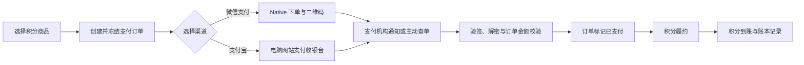

# Dora 支付与积分充值需求总览

> 文档状态：需求基线稿
>
> 版本：v0.1
>
> 更新日期：2026-07-14
>
> 关联文档：[共通业务规则与验收基线](common-requirements-baseline.md)、[用户端需求总览](user-requirements-overview.md)、[管理端需求总览](admin-requirements-overview.md)、[服务端需求总览](server-requirements-overview.md)

## 1. 文档目的与范围

本文定义 Dora 生产版桌面 Web 的人民币积分充值支付闭环。v1 必须支持：

1. 微信支付。
2. 支付宝支付。

支付仅用于用户购买 Dora 消费积分，不用于发布者收益回收、用户间转账、企业付款、自动续费或免密代扣。发布者收益回收仍是独立财务流程，不能复用充值支付订单。

本文确定产品流程、权威状态、安全边界、积分履约、异常核对和验收口径；具体 SDK、HTTP 路由、DTO、表、Migration Owner、密钥托管和部署方式在详细设计阶段确定。

## 2. 官方产品形态

| 支付渠道 | v1 桌面 Web 形态 | 用户交互 | 权威支付结果 |
| --- | --- | --- | --- |
| 微信支付 | Native 支付 | Dora 展示由官方 `code_url` 生成的二维码，用户使用微信扫码 | 微信支付服务端通知或商户主动查单 |
| 支付宝 | 电脑网站支付 | Dora 跳转或新窗口打开支付宝官方收银台，用户登录或扫码完成支付 | 支付宝服务端异步通知或商户主动查单 |

浏览器同步回跳、前端轮询参数、二维码页面状态、用户截图和客户端声称的“支付成功”都不是权威支付事实。

接入依据以支付机构最新官方文档为准：

- [微信支付 Native 下单](https://pay.wechatpay.cn/doc/v3/merchant/4012791877)
- [微信支付成功回调通知](https://pay.wechatpay.cn/doc/v3/merchant/4013070368)
- [支付宝网页/移动应用](https://open.alipay.com/module/webApp)
- [支付宝电脑网站支付接入说明](https://developer.alibaba.com/docs/doc.htm?articleId=105899&docType=1&treeId=270)

支付机构升级接口、证书或签名规则时允许在详细设计中升级 Adapter，但不得改变本文的订单幂等、可信结果、积分履约和无产品退款语义。

## 3. 用户充值流程

### 3.1 积分商品

积分充值使用平台发布的积分商品。每个商品至少包含：

- 稳定商品标识和版本。
- 展示名称、人民币价格、基础积分、活动赠送积分和最终到账积分。
- 生效时间、失效时间、用户范围和单用户购买限制。
- 是否需要实名或额外风控。
- 退款说明、服务协议和发票说明。

创建支付订单时冻结商品版本、人民币金额、基础积分、赠送积分、最终到账积分、活动规则和用户。支付过程中商品改价、下架或活动结束不能改写已有订单。

人民币金额在领域内统一使用“分”为单位的整数；积分统一使用 `bigint`。不得使用浮点数计算、保存或比较金额，也不得根据支付回调金额反推积分数量。

### 3.2 收银台

用户从“积分钱包 → 积分充值”选择商品后进入 Dora 收银台。收银台必须展示：

- 商品名称、基础积分、赠送积分、最终到账积分和人民币实付金额。
- 微信支付和支付宝支付两个可选渠道及当前可用状态。
- 订单有效期、到账说明、无产品退款说明、服务协议和客服入口。
- “确认支付”按钮；默认不得预选会造成误支付的渠道或自动唤起支付。

同一订单只能绑定一个支付渠道。用户切换渠道时应关闭原未支付渠道订单并创建新的内部支付订单或新的支付 Attempt，不能让同一商户订单号同时对应两个渠道。

### 3.3 支付主流程

默认支付有效期为 `15 分钟`，允许运营在支付机构约束内配置。订单过期后客户端停止展示可支付入口，服务端关闭仍未支付的外部订单；用户需要创建新订单，不能修改或复活旧商户订单号。

### 3.4 支付结果页

支付结果页至少区分：

- 等待支付。
- 支付结果确认中。
- 支付成功、积分入账中。
- 支付成功、积分已到账。
- 支付失败或已关闭。
- 支付异常，需要平台核对。

浏览器从支付宝回跳或用户扫码返回 Dora 时，页面必须重新查询 Dora 服务端权威状态；不得仅根据 URL 参数展示“支付成功”。用户关闭页面不影响服务端接收通知、查单和积分履约。

## 4. 渠道专项需求

### 4.1 微信支付

- 使用微信支付 APIv3 Native 支付能力，服务端创建唯一商户订单并获得 `code_url`。
- 前端只接收可展示二维码所需的短期数据，不接收商户私钥、APIv3 密钥、平台证书或完整服务端响应。
- 二维码展示订单金额、倒计时和“已完成支付，刷新结果”入口；二维码或订单过期后不得继续提示用户扫码。
- 服务端验证微信回调请求头签名，使用匹配的平台证书或微信支付公钥验签，并按官方规则解密通知资源。
- 验证通知中的 AppID、商户号、商户订单号、微信支付订单号、交易状态、币种和订单总金额；任何不匹配进入异常审计，不得入账。
- 验签并可靠保存通知后按微信要求及时应答；积分入账等后续业务异步执行，不能阻塞回调应答。
- 回调可能重复或延迟；同一通知和同一微信支付订单号必须可重入，并结合主动查单恢复遗漏结果。

### 4.2 支付宝

- 使用支付宝电脑网站支付能力生成官方支付页面请求，跳转或新窗口打开支付宝收银台。
- Dora 不采集支付宝账号、密码、验证码或银行卡信息，不仿冒支付宝收银台。
- 支付宝 `return_url` 只用于改善返回体验，不能作为支付成功依据。
- 服务端对异步通知执行官方签名验证，并校验 AppID、卖家/商户身份、商户订单号、支付宝交易号、交易状态、币种和订单金额。
- 只有官方定义的成功交易状态且全部业务字段匹配时，才能确认支付成功。
- 异步通知缺失、延迟或结果未知时，使用支付宝交易查询能力恢复；不得要求用户重复支付同一订单。
- 同一异步通知、商户订单号和支付宝交易号重复到达时，只能触发一次支付确认和一次积分履约。

## 5. 权威状态机

支付状态、积分履约状态和用户积分账本必须分离：

| 对象/状态轴 | 权威状态 | 用户投影 |
| --- | --- | --- |
| Payment Order | `created / pending_payment / paid / closed / payment_failed / reconciling / provider_exception` | 已创建 / 待支付 / 已支付 / 已关闭 / 支付失败 / 核对中 / 支付渠道异常 |
| Points Fulfillment | `unfulfilled / fulfilling / fulfilled / fulfillment_failed` | 待入账 / 入账中 / 已到账 / 入账异常 |
| Payment Notification | `received / verified / rejected / applied` | 不直接展示，仅用于审计和恢复 |

关键迁移规则：

- `created → pending_payment`：内部订单和冻结商品快照成功，渠道下单已明确受理。
- `created → reconciling`：渠道下单超时、连接中断或响应无法确认，必须按原商户订单号查单。
- `pending_payment → paid`：仅由验签并校验通过的异步通知，或受信主动查询结果触发。
- `pending_payment/reconciling → closed/payment_failed`：渠道查单/关单确认用户未支付且交易已关闭，或渠道确认交易失败；仅发起关单请求不能直接标记 `closed`。
- `pending_payment → reconciling`：渠道请求超时、返回未知、通知字段冲突或支付结果暂不确定。
- `reconciling → pending_payment/paid`：查单确认仍可支付或已经支付。
- `paid` 不得回退到未支付；后续积分异常只改变 Points Fulfillment。仅监管、司法或支付机构强制资金处置允许 `paid → provider_exception`。
- `unfulfilled → fulfilling → fulfilled`：支付已确认后按订单冻结积分写入唯一账本。
- `fulfillment_failed` 必须可自动重试或人工核对，不得要求用户再次付款。

正常产品流程不存在 `refunded`。若监管、司法、支付机构强制结果或盗刷处置导致渠道资金被退回/撤销，订单进入 `provider_exception`，通过独立受控异常流程处理积分冻结、冲正或追偿；这不是用户自助退款功能，也不能删除原支付和积分账本。

## 6. 支付确认与积分履约

### 6.1 可信支付确认

支付成功必须同时满足：

1. 通知签名有效，或主动查询响应验签有效。
2. 渠道 AppID/商户号/卖家身份属于 Dora 当前有效配置。
3. 商户订单号存在且渠道匹配。
4. 渠道交易号未绑定其他内部订单。
5. 订单状态允许从待支付进入已支付。
6. 币种为 `CNY`。
7. 订单总金额与冻结金额完全一致。
8. 渠道交易状态属于官方成功状态。

支付渠道优惠导致用户实际支付金额变化时，积分仍以 Dora 冻结商品快照为准；只有 Dora 订单总金额与渠道商户订单总金额一致并确认商户应收事实时才能履约。

### 6.2 唯一积分入账

- 每个 Payment Order 只能产生一笔正常充值积分账本，账本业务键稳定且全局唯一。
- 入账积分等于冻结的基础积分加赠送积分，分别保留来源明细，不能由回调参数、客户端或管理员临时覆盖。
- 支付订单确认、积分履约和可靠事件之间必须使用同一事务或可证明不丢失的 Outbox/Inbox 协议；具体写入契约在详细设计中确定。
- 回调、主动查单、定时对账和人工重查可以并发触发履约，但只能有一个成功结果。
- 支付已成功但积分履约失败时，优先补发积分，不自动退款；用户端持续展示“积分入账中/异常”，客服可以查询处理进度。
- 积分入账后不修改订单快照或原账本；平台错误通过追加式积分冲正或调账纠正。

## 7. 幂等、Unknown Outcome 与恢复

- 创建订单使用用户、积分商品版本、渠道和业务幂等键绑定请求语义；同键同语义返回原订单，同键不同语义返回冲突。
- 每个渠道商户订单号全局唯一，禁止跨渠道复用；同一渠道交易号只能绑定一个内部订单。
- 渠道下单超时或连接中断时先进入 `reconciling` 并按原商户订单号查询，不得直接生成新外部订单导致重复支付。
- 回调验签通过后，先可靠保存 Notification/Inbox 事实再成功应答；后续业务可以异步重试。
- Notification ID、渠道交易号、商户订单号和积分履约键分别建立幂等保护，不能只依赖单个唯一索引解释所有语义。
- Redis、SSE 或浏览器轮询失败不能影响支付确认和积分入账；PostgreSQL 和渠道权威查询负责恢复。
- 定时扫描未终态订单：临近过期查单、过期关单、支付未知核对、已支付未履约补发和长时间异常告警。

## 8. 无退款与异常边界

- v1 不提供用户自助退款、客服普通退款、失败退款、充值退款或积分兑换现金。
- 未支付订单可以关闭；关单不等于退款。
- 用户创建多个独立订单并分别完成真实支付时，每笔订单分别到账，不自动合并或退款。
- 重复回调不构成重复支付，不得重复发放积分。
- 平台重复入账、错发积分或无对应支付事实时通过不可变积分账本冲正纠错。
- 支付成功但用户未使用积分、账号受限、后续生成失败或用户改变主意，均不触发产品退款。
- 监管、司法、支付机构强制处置和盗刷争议必须保留支付、通知、查询、积分和处置证据，并走 `provider_exception`；具体法务、追偿和账户限制策略在详细财务设计中确认。

## 9. 安全、隐私与合规要求

- 微信商户私钥、APIv3 密钥、平台证书/公钥，支付宝应用私钥和支付宝公钥统一由服务端 Secret/KMS 管理，不进入代码仓库、客户端、普通日志或数据库明文字段。
- 渠道请求必须签名，响应和通知必须验签；仅依赖来源 IP、Referer、前端参数或 HTTPS 不能替代验签。
- 回调使用独立公网端点、TLS、请求大小限制、速率限制和拒绝服务防护；不得因登录 Cookie、CSRF Token 或浏览器会话阻止合法服务端通知。
- 普通日志只保存内部订单号、脱敏渠道交易号、通知 ID、状态、错误分类和 Trace，不保存二维码原文、完整通知、支付者标识、密钥或签名原文。
- 用户只能查询自己的订单和积分结果；管理员按角色和数据范围查看，敏感支付信息默认脱敏。
- 支付配置、证书轮换、主动查单、人工核对、积分补发/冲正和异常处置 `100%` 写入审计。
- 商户主体、支付产品签约、网站备案、隐私政策、用户协议、发票和消费者权益要求必须在生产上线前完成法务与运营核验。

## 10. 管理端与财务运营

管理端必须提供：

- 微信支付、支付宝渠道启停、商户应用标识、证书/公钥版本、回调健康和配置校验；密钥只允许引用 Secret，不显示明文。
- 积分商品、商品版本、价格、赠送积分、销售范围、上下架和购买限制。
- 支付订单、渠道 Attempt、Notification、主动查询、积分履约、账本和审计的因果视图。
- 按渠道、状态、时间、用户、商户订单号和渠道交易号查询；敏感字段按权限脱敏。
- 对 `reconciling`、`fulfillment_failed`、金额不匹配、验签失败、重复交易号和 `provider_exception` 建立工作队列。
- 管理员可以触发受控主动查单和积分履约重试，但不能手工把未支付订单改成已支付。
- 每日下载或获取支付渠道交易账单，对 `100%` 支付成功、积分履约、渠道手续费和异常订单进行自动对账。
- 财务差异发现后 `5 分钟`内告警；未核平对象不得被重复履约或静默关闭。

## 11. 量化非功能要求

| 维度 | v1 验收要求 |
| --- | --- |
| 可用性 | 创建支付订单、支付通知受理、主动查单和积分履约核心能力月可用性不低于 `99.95%`。 |
| 创建订单 | 不含支付渠道外部耗时，内部创建与冻结订单 `P95 ≤ 800ms`；外部下单超过同步时限时返回处理中并进入可靠核对。 |
| 回调受理 | 微信回调必须在官方 `5 秒`限制内完成验签、可靠受理和应答，平台内部目标 `P95 ≤ 2s`；支付宝按官方应答协议及时返回。 |
| 积分到账 | 验签并确认支付成功后，积分履约 `P95 ≤ 5s`；超过 `30s`进入告警观察，`P95 ≤ 5min`通过重试/扫描恢复。 |
| 幂等 | 同一创建请求、通知、查询结果或履约键并发/重放 `100` 次，只产生一个订单支付事实和一笔正常充值积分。 |
| 查单恢复 | 回调缺失或结果未知的已支付订单，通过主动查单和扫描在 `P95 ≤ 5min`恢复支付确认。 |
| 对账 | 每日自动对账覆盖 `100%`支付成功、关闭、异常、积分履约和账本记录；差异 `5min`内告警。 |
| 数据保留 | 支付订单、通知摘要、查询、积分履约、对账和审计至少保留 `7 年`或遵循更长法定要求。 |
| 容灾 | 支付和积分权威数据 `RPO ≤ 5min`、核心能力 `RTO ≤ 30min`；恢复后优先查单和补履约，不重复入账。 |

其余指标遵循[共通 v1 量化非功能基线](common-requirements-baseline.md#6-v1-量化非功能基线)。

## 12. 可执行验收用例

以下用例继承[共通 Evidence 要求](common-requirements-baseline.md#7-可执行验收规范)：

| ID | Given / When | Then |
| --- | --- | --- |
| PAY-PRODUCT-001 | Given 积分商品已发布；When 商品改价后查询旧订单 | 旧订单保留原金额和积分快照，新订单使用新版本，历史账单不被改写。 |
| PAY-CREATE-001 | Given 同一用户、商品、渠道和幂等键；When 并发创建订单 100 次 | 只创建一个内部订单和一个有效渠道订单，其余返回原订单。 |
| PAY-CREATE-002 | Given 同一幂等键已绑定微信订单；When 改为支付宝或其他商品重试 | 返回幂等语义冲突，不复用商户订单号、不创建第二笔外部支付。 |
| PAY-WX-001 | Given 用户选择微信支付；When Native 下单成功 | 展示金额一致且有倒计时的微信二维码，客户端不获得任何商户密钥。 |
| PAY-ALI-001 | Given 用户选择支付宝；When 创建电脑网站支付 | 跳转或打开支付宝官方收银台；同步回跳只显示确认中并查询服务端状态。 |
| PAY-NOTIFY-001 | Given 微信或支付宝合法支付成功通知；When 通知并发重放 100 次 | 验签、身份、订单、金额和状态校验通过，只确认一次支付并只发放一次积分。 |
| PAY-NOTIFY-002 | Given 通知签名错误、金额不符或商户身份不符；When 服务端接收 | 拒绝应用，不改变支付/积分状态，记录脱敏异常和告警。 |
| PAY-QUERY-001 | Given 用户已支付但通知丢失；When 定时主动查单 | 5 分钟 P95 内恢复为已支付并完成唯一积分履约。 |
| PAY-UNKNOWN-001 | Given 渠道下单请求超时且结果未知；When 系统恢复 | 原订单进入 `reconciling` 并按原商户订单号查询，不盲目创建第二笔渠道订单。 |
| PAY-FULFILL-001 | Given 支付已确认且积分尚未入账；When 履约执行 | 按冻结商品快照写一笔充值账本，基础/赠送积分来源清晰，余额正确。 |
| PAY-FULFILL-002 | Given 支付确认后进程崩溃；When Outbox/扫描恢复 | 补齐同一积分履约，不产生第二笔积分或要求用户再次支付。 |
| PAY-CLOSE-001 | Given 订单超过有效期且渠道仍未支付；When 关闭订单 | 状态进入已关闭，二维码/收银台入口失效，新支付必须创建新订单。 |
| PAY-LATE-001 | Given 本地已请求关单但渠道尚未确认关闭；When 主动查询返回已支付 | 订单保持核对态并以渠道权威事实确认支付、完成一次积分履约，不把真实支付静默丢弃。 |
| PAY-NOREFUND-001 | Given 支付和积分均成功；When 用户未使用、生成失败或改变主意 | 不提供退款入口，不修改支付和充值账本，展示既定无退款规则和客服解释入口。 |
| PAY-EXCEPTION-001 | Given 支付机构强制撤销或法定异常处置；When 平台收到权威结果 | 进入 `provider_exception`，保留原账本，通过受控积分冻结/冲正/追偿流程处理并完整审计。 |
| PAY-RBAC-001 | Given 普通客服和财务管理员权限不同；When 查询订单或触发查单/履约 | 普通客服只能查看脱敏状态，财务操作按权限和复核生效，全部写审计。 |
| PAY-RECON-001 | Given 渠道日账单与支付/积分记录存在差异；When 自动对账 | 差异 5 分钟内告警并进入工作队列，未核平前不重复履约或静默关闭。 |
| PAY-SEC-001 | Given 客户端伪造支付成功、渠道交易号或回调参数；When 请求积分入账 | 服务端拒绝，只有验签通知或主动查单可以确认支付。 |
| PAY-RECOVERY-001 | Given PostgreSQL 恢复或服务重启；When 扫描未终态订单 | 重新查单、补履约并保持幂等，RPO/RTO 满足基线且不重复入账。 |

## 13. 详细设计阶段门禁

实现前必须补齐并评审：

1. Payment Order、Channel Attempt、Notification Inbox、Points Fulfillment、Ledger 和 Reconciliation 的数据所有权及唯一写入方。
2. 微信/支付宝 Adapter、签名验签、证书/公钥轮换、加解密、超时、错误分类和官方 SDK 版本策略。
3. 创建订单、回调、主动查单、关单、履约、Outbox/Inbox 和对账的 DTO/API/Event 及幂等键矩阵。
4. 支付成功与积分入账的事务/最终一致性证明，以及每个崩溃点的恢复路径。
5. 商户签约、网站备案、支付域名、回调域名、Secret/KMS、证书轮换、沙箱和生产验收清单。
6. 风控、限额、盗刷、消费者投诉、强制撤销、积分追偿和法务例外流程。
7. 支付故障注入、重复回调、回调丢失、金额篡改、证书轮换、对账和灾备测试。

在这些设计完成前，不得把前端二维码或支付宝回跳页面视为支付功能已经闭环。

## 14. 待确认参数

以下参数不改变微信支付和支付宝支付的必备范围：

1. 首批积分商品的价格、基础积分、赠送积分和单用户购买限制。
2. 支付订单默认有效期是否保持 `15 分钟`，以及渠道级最大/最小金额。
3. 是否首期支持发票申请；若支持，需要独立发票 PRD。
4. 实名触发金额、单日/单月充值限额和风控阈值。
5. 支付渠道维护时是否允许另一渠道自动置顶；不得未经用户确认自动切换已选择渠道。
6. 强制撤销、盗刷或法定退款例外下的积分冻结、负债和账号限制规则。
