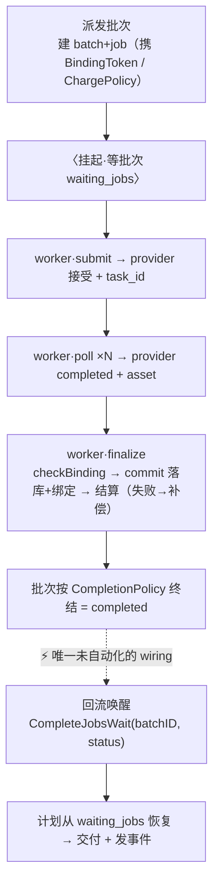
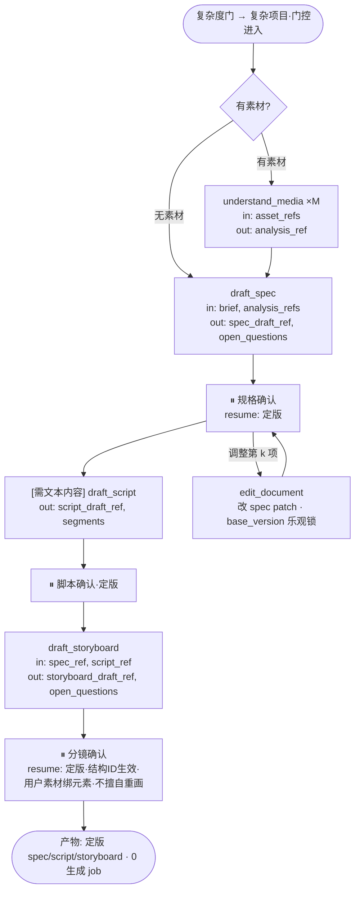
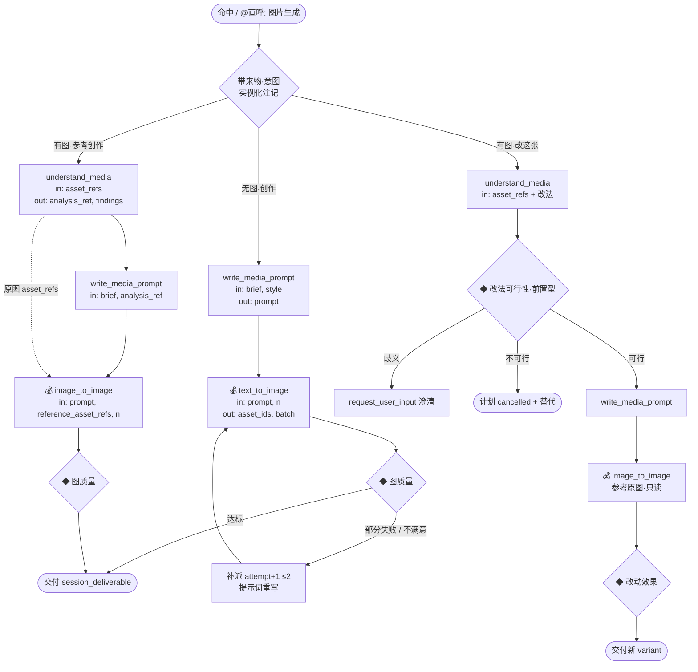
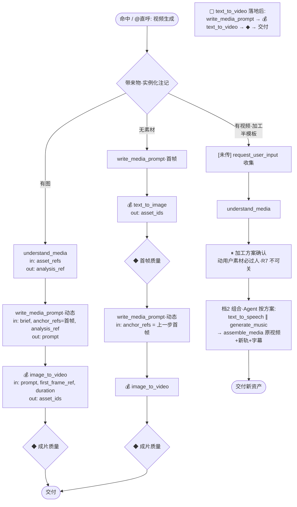
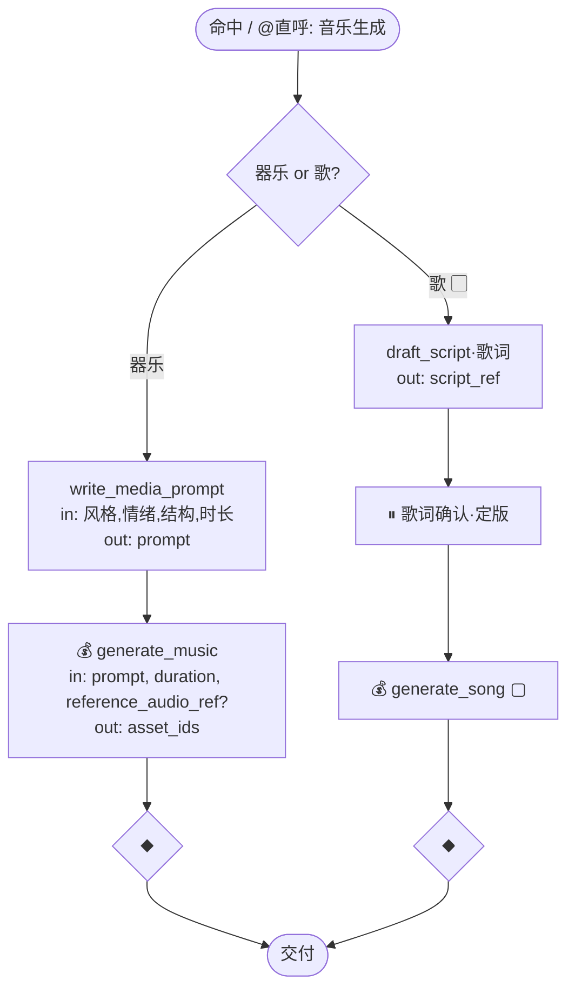
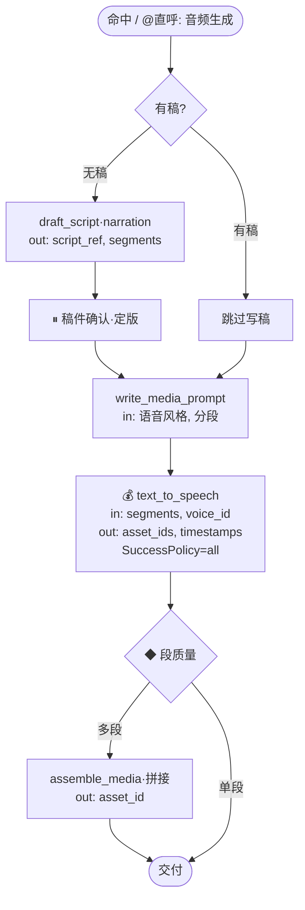
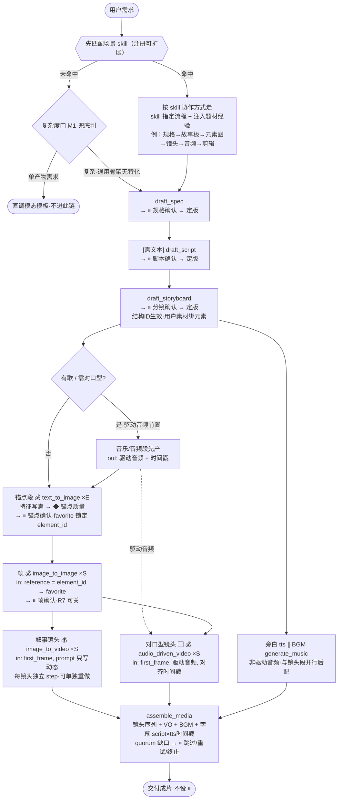
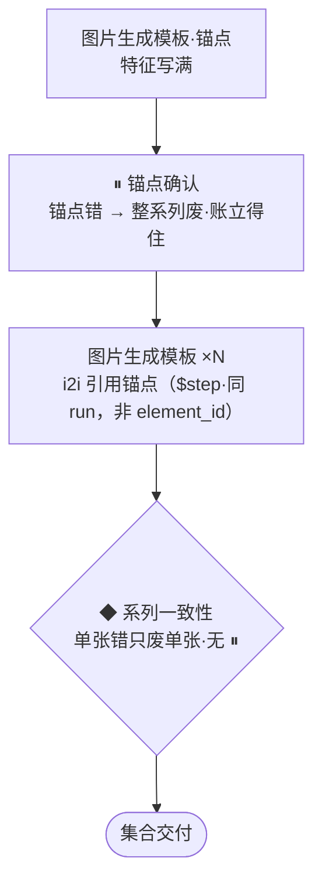
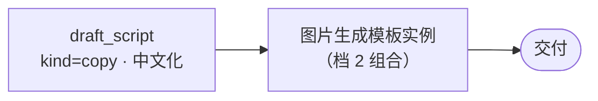

# Dora AIGC GraphTool 细化：node 词汇详定义 + 场景模板详图

> 日期：2026-07-13　状态：细化定稿（随主文档演进）
> 上游：`2026-07-11-aigc-system-design-final.md`（§1 三层词汇 / §2 场景模板与暴露面 / §6.8 大纲重排裁决）——本文是 §6.8 待细化清单第 1 项（五场景详图 + node 详定义）的交付。
> 对齐已建实现：`internal/aigc/vocabulary`（Descriptor/Call/Result/Failure/Suspension 契约）、`internal/aigc/orchestration`（`$stepID.outputKey` 引用、SuccessPolicy、ExceedsJobBudget）。冲突时以主文档 §1/§2 为准。

---

## 0. 通读约定

### 0.1 符号

💰 扣费 node（三条腿：预留→结算｜失败/取消→补偿）｜⏸ 卡点（挂起等人）｜◆ 评估点（回 Agent 续编）｜〈…〉挂起｜×N 批量并行｜∥ 分支并行｜▢ 留格子｜`[条件]` 实例化注记（Agent 实例化时按输入事实消解，计划中不存在分支）

### 0.2 所有 node 共享的语义（不逐卡重复）

- **状态机**：`待启动 → 运行中(含重试) → [挂起(等批次｜等人｜等审)] → 成功 | 失败 | 取消`；状态向计划聚合（等批次→waiting_jobs，等人/等审→waiting_user，运行/待启动→waiting_agent）。**恢复入口（实际）**：等批次 → `CompleteJobsWait(batchID,status)`（batch-finalize 回流）；等人 → `Resume(runID,resumeKey,decision)`（卡点/评估点用户决策）。
- **契约**：入参出参即 `vocabulary.Descriptor.Inputs/Outputs`（ParamSpec：Type/Desc/Required）；调用带 `Call{SessionID,UserID,PlanRunID,NodeID,Attempt,IdempotencyKey}`；失败 = `Failure{Code,Message,Retryable}` 是决策输入不是异常；写幂等、actor 审计、事件由 runtime 统一广播。
- **出参引用**：任何出参可被下游以 `$stepID.outputKey`（两段式）引用——出参名即引用面，命名稳定性是契约的一部分。
- **引用类型**：`asset_ref`（资产）/ `document_ref`（文档+版本）/ 字面值 / `$step` 引用。媒体字节永不过手。

### 0.3 定义卡 schema

每张卡只列差异项：**内核｜入参（`*`=必填）｜出参｜阶段差异｜扣费｜失败要点｜复用处**。

---

## 1. node 词汇详定义（编排面 v1 = 12 内核 node + 2 卡点呈现形态）

### 1.1 认知 node（6）——同步，调一次 ChatModel

阶段序列（共享）：`取输入(就绪校验) → [预留] → 调 ChatModel(坏输出自动重试 ≤2) → 产物落盘 → [结算] → 发事件`。v1 计费空实现，扣费声明位保留、默认不扣。

**`understand_media` 分析 node**
| 项 | 定义 |
|---|---|
| 入参 | `asset_refs*`（list[asset_ref]，待理解素材，就绪校验）｜`focus`（string，分析侧重：用途/特征/质量/与规格的适配） |
| 出参 | `analysis_ref`（document_ref，分析落盘引用，只追加域）｜`findings`（结构化：特征、建议用途、质量风险、与 spec 冲突提示） |
| 阶段差异 | 落盘走 document_store 分析域（只追加） |
| 扣费 | 按配置（"中间分析 node 也可能扣费"的落点） |
| 失败 | `unreadable_asset`（非重试）｜`model_error`（重试 ≤2） |
| 复用处 | 图片/视频/故事板模板；**上传即分析**（上传三段式完成 → 系统以"单 node 计划"触发本 node——一切执行皆计划实例，含单节点） |

**`write_media_prompt` 提示词 node**
| 项 | 定义 |
|---|---|
| 入参 | `target_kind*`（image｜video｜music｜tts）｜`brief*`（意图/内容要点，或 `$分镜.shot` 引用）｜`style`（风格锚点/负面约束/输出语言）｜`analysis_ref`（素材理解引用）｜`anchor_refs`（list[asset_ref]，参考资产：锚点图/首帧） |
| 出参 | `prompt`（结构化：positive/negative/参数建议）｜`trace_ref`（留痕引用，可审计） |
| 边界 | 不选模型不发起生成（模型栈 = provider 配置，skill 可注入写法规则） |
| 扣费 | 默认不扣 |
| 复用处 | 全部五模板（一切生成派发前） |

**`draft_spec` 规格 node**
| 项 | 定义 |
|---|---|
| 入参 | `brief*`｜`direction*`（video｜image｜music｜audio）｜`analysis_refs`｜`preferences`（画幅/时长/语言/风格偏好） |
| 出参 | `spec_draft_ref`（document_ref，**draft 态**）｜`open_questions`（list，需用户裁决项——直接喂确认卡候选芯片） |
| 边界 | 不定版不确认（定版发生在 ⏸ 的 resume 阶段） |
| 复用处 | 故事板模板 |

**`draft_script` 脚本 node**
| 项 | 定义 |
|---|---|
| 入参 | `kind*`（story｜copy｜lyrics｜narration）｜`spec_ref`｜`brief`｜`length` |
| 出参 | `script_draft_ref`（document_ref）｜`segments`（list，分段结构：旁白段/歌词行——TTS 与时间对齐的数据源） |
| 复用处 | 故事板模板（叙事类）、音乐模板（歌词支 ▢）、音频模板（无稿支） |

**`draft_storyboard` 分镜 node**
| 项 | 定义 |
|---|---|
| 入参 | `spec_ref*`（**已定版**）｜`script_ref`｜`analysis_refs` |
| 出参 | `storyboard_draft_ref`（document_ref：elements/shots/audio_layers）｜`open_questions` |
| 边界 | 用户素材的元素描述必须与素材分析一致；不生成媒体 |
| 复用处 | 故事板模板 |

**`edit_document` 修订 node**
| 项 | 定义 |
|---|---|
| 入参 | `document_ref*`+`base_version*`｜`instruction*`（含翻译/改写类变换）｜`auto_apply`（bool，默认 false） |
| 出参 | `patch`（JSON Patch）｜`impact`（影响提示：波及哪些下游/已生成资产）｜`applied_version`（仅 auto_apply=true） |
| 阶段差异 | auto_apply=true 时后置阶段应用 patch（base_version 乐观锁） |
| 失败 | `version_conflict`（非重试→Agent 重取版本重提） |
| 复用处 | 卡点"调整第 k 项"出口；中途改需求的最小返工 |

### 1.2 生成 node（5）——异步，一次调用 = 一批 job

阶段序列（共享）：`取输入(就绪校验) → 预留(按批量×sku) → 派发批次(预注册 generating 占位资产；job 幂等键=计划实例+节点+目标+attempt) → 〈挂起·等批次〉 → 批次按 SuccessPolicy 终结 → 唤醒 → 落库+绑定+结算(失败份额补偿退回) → 发事件`。

**实际运转校准（2026-07-14 端到端跑通验证；回归见 `orchestration/e2e_image_generation_test.go`）**——上句阶段序列的真实形态：派发后 worker 对每个 job 走 **submit→poll→finalize** 三个 durable 阶段（`finalize` 才做落库+绑定+按 ChargePolicy 结算）；批次终结后经 ⚡「回流唤醒」让计划从 `waiting_jobs` 恢复，这根信号线（batch-finalize → `CompleteJobsWait`）是编排与执行两半之间**唯一尚未自动化的 wiring**：

共享入参：`binding_target`（deliverable 两态：`storyboard_slot`｜`session_deliverable`，缺省后者）；共享出参：`asset_ids`（list，ready 后）、`batch`（成败计数/quorum 结果——◆ 的决策输入）。
批次语义：**`n` = 同目标备选变体**；多目标（多镜头/多元素）= 计划层多个独立 step，不用 `n`。逐 job 完成逐个广播（前端逐个点亮），批次终结才唤醒。
失败要点（共享）：`provider_rejected`（内容拒，非重试→计划层 R3：⏸ 告知原因与调整方向，硬性禁区直接终止该目标）｜`timeout`/`rate_limited`（可重试，走派发序号 attempt，重试预算与用户调整分离）。

**`text_to_image` 文生图 node** 💰
| 项 | 定义 |
|---|---|
| 内核 | image2（已有） |
| 入参 | `prompt*`（`$提示词.prompt`）｜`n`（1–4，默认 1）｜`ratio`/`size` |
| SuccessPolicy 默认 | n=1→all；n>1→at_least(1)（备选交 ◆ 裁） |

**`image_to_image` 图生图 node** 💰
| 项 | 定义 |
|---|---|
| 内核 | image2（已有） |
| 入参 | `prompt*`｜`reference_asset_refs*`（原图/锚点图）｜`n`｜`strength`（贴合度） |
| 约束 | 参考原图只读永不覆盖——产物一律新 variant |

**`image_to_video` 图生视频 node** 💰
| 项 | 定义 |
|---|---|
| 内核 | seedance（已有） |
| 入参 | `prompt*`（**只写变化与动态**，不重复静态描述）｜`first_frame_ref*`｜`duration`｜`ratio` |
| 批口径 | 单镜头 1 job（`n` 备选可用） |

**`generate_music` 生音乐 node** 💰
| 项 | 定义 |
|---|---|
| 入参 | `prompt*`（风格/情绪/结构）｜`duration*`｜`reference_audio_ref`（参考续写为入参能力，不分支） |

**`text_to_speech` TTS node** 💰
| 项 | 定义 |
|---|---|
| 内核 | demo 占位；音色 v1 预设表 |
| 入参 | `segments*`（list[{text, lang}]，来源 `$脚本.segments`）｜`voice_id*`（预设表）｜`speed` |
| 出参差异 | `timestamps`（**分段/句级时间戳**——字幕与装配对齐的数据源） |
| 批口径 | 每段 1 job；**SuccessPolicy=all**（缺段不可交付） |

### 1.3 执行 node（1）——媒体处理执行器，不调模型

**`assemble_media` 装配 node**
| 项 | 定义 |
|---|---|
| 入参 | `timeline*`（video 轨 clip 序列(in/out)、audio 轨(VO/BGM)、overlay 叠加轨、字幕轨=script×tts 时间戳转换）｜`output*`（video｜audio + 格式参数；单输入退化=格式转换） |
| 出参 | `asset_id`（成片）｜`report`（对齐/裁剪/空隙填补摘要） |
| 阶段差异 | 取输入含**齐备性 quorum 检查**（缺口→`missing_inputs` Fail 交 ◆/⏸：跳过/重试/终止）；执行走 worker（单 job 批）〈等批次〉——与生成 node 同为 generation worker 的一个 provider（`demo_assembly`），内部阶段同 §1.2 实际运转图 |
| 扣费 | [结算] 视处理量（v1 不扣，声明位保留） |
| 规则 | 静音 video 轨、按时间戳对齐；对口型片段不变速不改时间戳（▢ 格子期规则先记） |
| 复用处 | 故事板成片长链尾段（**不进路由面**）、音频模板多段拼接、视频加工支 |

### 1.4 卡点（2 呈现形态）——node 的「等人」状态，非第四种内核（2026-07-14 定案）

卡点由 node 状态决定（`挂起·等人`），不是带内核的 node；计划里由**卡点声明**落成一个纯状态步，任何步都可携带。下面两者是该状态的两种呈现形态（确认卡/收集卡），不计入内核盘子。

**`request_confirmation` 确认卡（呈现形态）**
| 项 | 定义 |
|---|---|
| 入参 | `subject*`（kind+refs：spec｜script｜storyboard｜锚点图集｜加工方案｜计划预览）｜`options`（候选决策芯片，可分页）｜`allow`（操作面：精改/跳过/回退/部分重做——**默认全开**，R7 只管密度不管权限） |
| 出参 | `decision`（confirmed｜adjusted｜rejected）｜`feedback`（调整项+反馈文本——续编输入） |
| 阶段差异 | resume 后置 **[确认即定版/锁定]**：spec/script/storyboard→document_store 定版（结构 ID 生效）；锚点图→资产 confirmed + favorite 锁定 |
| 挂起 | waiting_user；resume 幂等一次性（实际入口 `Scheduler.Resume(runID,resumeKey,decision)`）；挂起期间文档版本变更→**版本冲突检测，不硬续转确认** |
| 三出口 | 确认→续段｜调整第 k 项（带反馈：edit_document/提示词重写→重派→**回本卡点**）｜中途改需求→影响评估→授权→活计划修订 |

**`request_user_input` 收集卡（呈现形态）**
| 项 | 定义 |
|---|---|
| 入参 | `fields*`（list[{kind: upload｜text｜choice, why}]——**由场景模板的输入要素清单驱动**，引导话术数据源）｜`reason` |
| 出参 | `inputs`（收集值）｜`uploaded_asset_refs`（上传走三段式入库 + **入口审** + 自动分析单 node 计划） |
| 挂起 | waiting_user |

---

## 2. 场景模板详图（路由面 = 4 模态直呼 + 故事板复杂路径规划段·门控进入）

每节：意图 → 输入要素（引导清单）→ 实例化注记 → 详图 → 交互流 → 失败与部分成功 → 产物与预算口径。
通用交互（不逐节重复）：①语意缺必填要素→收集卡引导（要素清单即字段）；②派发即预注册占位、逐 job 点亮；③◆ 由 Agent 自查不打扰用户；④失败退费走补偿腿并在消息卡带回执；⑤@ 直呼=强制命中本模态模板（**故事板不直呼**，由复杂度门进入）。

> 下面五图里所有 💰 生成 node 的**内部实际运转**（submit→poll→finalize + ⚡回流唤醒）统一见 §1.2 校准图，图里不逐一展开。

### 2.1 故事板模板（复杂路径规划段·非用户直呼）

- **意图**：复杂创作项目先立规划：需求 → 规格 → 分镜结构。**不生成媒体**。**不对用户直呼**——由复杂度门（M1 从用户规格关键信息判为复杂项目）进入（§3.1）。
- **输入要素**：素材?｜方向｜时长｜风格｜语言。
- **实例化注记**：`[有素材]`→前置分析×M；`[需文本内容]`（叙事/歌词/解说类，由 M1 方向+需求判定）→规格与分镜之间插脚本段。

- **交互流**：规格卡的候选芯片 = `open_questions`；每个 ⏸ 三出口（确认｜调整第 k 项→edit_document patch→回本卡｜重来）；卡点成本账沿主文档 §2.6（规格错废全部下游→最强）。
- **失败**：认知 node 重试耗尽→计划 failed 并告知（R5）。
- **产物**：定版 spec（+script）+storyboard 三文档；**生成 job 数 = 0**。
- **后续**：成片走计划层组合（§3.1），复杂度门判单步需求则根本不进本模板。

### 2.2 图片生成模板

- **意图**：创作/加工图片。
- **输入要素**：素材?｜描述｜数量 n｜风格。
- **实例化注记**：`[无图]`→创作·文生图支；`[有图+参考创作]`→创作·图生图支；`[有图+改这张图]`→加工支。n=备选变体。

- **交互流**：**零 ⏸**（浅编排错误成本=一次重生成，卡点账立不住）；不满意→带反馈续段（提示词重写→attempt+1 重派）。
- **失败**：部分失败→补派 attempt+1 ≤2→达上限带缺口进 ⏸；provider 合规拦→⏸ 告知调整方向（R3）。
- **产物**：session_deliverable（或计划指定槽位）；**生成 job 数 = n**。
- **一致性系列（深）不进模板**：数量与系列结构由 Agent 上抬为计划层组合（§3.2）——薄模板尺子的直接推论。

### 2.3 视频生成模板

- **意图**：单镜头/单段视频的创作或加工（完整多镜头成片属组合 §3.1）。
- **输入要素**：素材(图/视频)?｜描述｜时长。
- **实例化注记**：`[有图]`→图生视频支；`[无素材]`→文生图先行支（▢ text_to_video 实现后直连）；`[有视频+加工]`→加工支（**半模板**：实例化到方案卡为止）。

- **交互流**：无素材支两个 ◆ 之间 Agent 自查推进不打扰用户；浅链零 ⏸；加工支唯一 ⏸ 是方案卡（权限性质）。
- **产物与预算**：有图 1 job｜无素材 2 job｜加工 = 方案定后计（音轨数+装配 1）。

### 2.4 音乐生成模板

- **意图**：器乐（BGM/主题曲）；歌曲待 ▢ generate_song。
- **输入要素**：风格｜情绪｜时长｜(歌词)。
- **实例化注记**：`[带来物=音频]`→`reference_audio_ref` 入参（续写，不分支）；`[要歌]`→歌词支（▢ 实现后生效）。

- **交互流**：器乐零 ⏸，不满意带反馈 attempt+1；歌词必过 ⏸（错了整首废，账立得住）。
- **产物与预算**：1 job。

### 2.5 音频生成模板

- **意图**：旁白/播报语音；音效待 ▢ generate_sound_effect。
- **输入要素**：稿件?｜音色｜分段。
- **实例化注记**：`[无稿]`→写稿段；`[有稿]`→跳过；`[多段]`→尾部拼接。

- **交互流**：稿件卡仅无稿支出现（用户自带稿零 ⏸）；段失败重试耗尽→缺段不可交付，⏸ 处置。
- **产物与预算**：S job（多段 +1 装配 job）；`timestamps` 出参供下游字幕/装配。

---

## 3. 计划层组合示例（档 2——链上每段仍是固化件）

### 3.1 故事板成片场景（完整细化）

> 定位：故事板是最复杂场景，也是**场景 skill 的主战场**。**入口顺序（因果关键）：先匹配场景 skill——命中即按 skill 描述的协作方式走**（skill 会写明协作流程，如「规格确定 → 故事板 → 元素图像 → 镜头视频 → 音频 → 最终剪辑」，即 skill 指定「引用本链作骨架」并按题材做阶段编排）；**未命中才由复杂度门 M1 兜底判**（单产物需求 → 直调模态模板；复杂 → 本链通用骨架、无题材特化）。命中 skill 后不再过复杂度门——skill 说了算。骨架机制来自**故事板模板**（§1.3，通用、平台中性），Agent 逐段实例化；命中的 skill 在其上**指定阶段编排 + 注入题材经验**（见 (C)）。同一副骨架 + 不同 skill = 不同题材成片；未命中走通用也能跑（泛）。**新增场景 = 注册一个新 skill，不改骨架、不改本图**。skill 定位见主文档 §6.10。

**(A) 成片长链骨架**

**(B) 镜头分野与音频时序**（node 能力/依赖的客观区分）：镜头分两类——**叙事镜头**走 `image_to_video`（v1 可跑）；**对口型/数字人镜头**必走 `audio_driven_video`（▢ 格子；其它内核嘴型同步差），且**驱动音频（歌曲/配音）必须前置**，镜头才能对齐歌词/句级时间戳。**旁白/BGM 是非驱动音频**，可与镜头段并行后配。→ **v1 诚实边界：叙事类故事板端到端可跑；对口型类要等 `audio_driven_video`/`generate_song` 格子落地。**

- **锚点寻址（#7 定案）**：锚点图 confirmed 后绑定到故事板元素（element_id）为 favorite；镜头段的提示词/图生图**通过 element_id 引用**（实例化时解析为该元素当前 favorite 的 asset_id）——durable、跨 run 存活、多镜头共享、随 favorite 切换而不失效。仅同 run 内的临时接续（如提示词→生图）才用 `$step` 引用。这正是锚点绑 `storyboard_slot`（durable）、成片绑 `session_deliverable` 的原因。
- 绑定目标：镜头/元素产物→`storyboard_slot`；成片→`session_deliverable`。
- 预算口径：`E + 2S + 段数 + 1(BGM) + 1(装配)` 个生成 job（进五查预算阈值）。
- 中途改需求（如"整体改日系"）：影响评估（元素图=风格核心须重做；纯环境镜头可保留作构图参考；spec 风格字段更新为新基准）→ 授权 → 活计划修订最小返工——机制即 §3.6②+edit_document。

**(C) 场景 skill 做什么**：命中的场景 skill 先**指定协作方式**（❶ 走哪条链 + 阶段序列的题材化编排——如「规格→故事板→元素图→镜头→音频→剪辑」，MV 还把驱动音频前置），再把题材经验**注入**这些决策点——① 素材分析侧重（提取什么：MV 存 BPM/歌词时间戳，商品片存构图/光线）② 规格·分镜规划（element 规划、镜头语言、时间规划）③ 模型偏好（元素图/关键帧/叙事镜头/对口型各用什么）④ 暂停节奏（卡点密度）⑤ 领域规则/工作流修正（如缺驱动音频→先转音频生成）。**本图不枚举具体场景**——各 skill 装什么是它自己的内容；skill 像 GraphTool 一样注册到 Agent、按需求匹配（§2.1 匹配面），**新增场景 = 注册新 skill，不改本图/骨架**。未命中任何 skill → 走通用编排（能跑但泛）。**通用编排规则**（视频只写动态、静音 video 轨、图像六要素、安全合规重写等）不属 skill，已内化在各 node 定义里（§1 `write_media_prompt`/`assemble_media`/`compliance`）。

**(D) 完整时序走查（叙事类，v1 可跑；标注交互）**：

1. 「做个 30 秒水蜜桃宣传片」→ M1 判复杂 → 进故事板。
2. `draft_spec` → ⏸规格确认（候选芯片=`open_questions`：时长/画幅/风格）→ 定版。
3. [有实拍] `understand_media` ｜ [无] 收集卡引导上传（上传即入口审+自动分析）。
4. `draft_storyboard`（element_id/镜头/音轨）→ ⏸分镜确认 → 定版（结构 ID 生效，用户素材绑为元素）。
5. 锚点段 `图片模板 ×E` → 逐张点亮 → ◆锚点质量 → ⏸锚点确认（favorite 锁定）。
6. 镜头段 帧 `×S`（i2i 引锚点 element_id）→ ⏸帧确认 → 叙事视频 `×S`（`image_to_video`）。**单镜头不满意 → 只重做 Shot_k**（参考原帧+保持音频一致；不动其它镜头、不重置时间线）。
7. ∥ 旁白 `tts`（segments=script）+ BGM `generate_music`。
8. `装配node`（quorum 齐备性检查）→ 交付成片（不设 ⏸）。
9. 中途改需求 → 见上「改需求」条（影响评估→授权→活计划修订）。

> 故事板编排的关键：后四段（锚点/镜头/音频/装配）交给 **Agent 逐段动态推进**——每镜头独立 step、可单独重做、可改需求重规划，不是固定图（mediagraph 路线已废）。骨架来自故事板模板；题材特化由命中的**场景 skill** 注入（skill 注册到 Agent、按需匹配——§2.1 匹配面 / (C) 注入点）。

### 3.2 一致性系列（图片深编排）

### 3.3 最小组合（跨认知+生成）

---

## 4. 裁量点与对齐结论（2026-07-14 用户逐条拍板）

**已认可（原样保留）**：
1. ✅ **`edit_document.auto_apply`**：小改（卡点"调整第 k 项"）允许 node 后置直接应用 patch，免再过一次卡点；默认 false。
2. ✅ **TTS 段 = 一批 job、SuccessPolicy=all**：段是同一产物的分片（非备选），缺段不可交付。
3. ✅ **视频加工 = 半模板**：实例化到 ⏸方案卡为止，后段（音轨/装配）由 Agent 按确认方案以档 2 组合——方案内容靠对话决定，进模板违反尺子。

**对齐定案**：
- **4 / 6 / 8 = 同一件事「复杂度门」**（用户点破"是一种"）：M1 从**用户规格关键信息**判单产物 vs 复杂项目 → 前者路由模态模板、后者进故事板编排；**故事板不对用户直呼**，是复杂路径规划段；多镜头成片/一致性系列是复杂侧组合产物，都不进模板。门不设独立 ⏸，判不准走 M1 反问边界。
- **5 加工不单设路由项**（维持原设计不动）：模态模板实例化注记按"带来物"消解，判定压给 M1 语意分析（认"带来物=图 + 意图=改它"）。
- **7 锚点寻址**：跨 run/多镜头共享走 storyboard element_id → favorite（durable）；同 run 临时接续用 `$step`（见 §3.1）。
- **9 卡点 = node 状态**（非第四种内核）：内核形态 3（认知/生成/执行）；卡点由等人状态决定，计划里以卡点声明落成纯状态步，2 呈现形态；内核计数不变（12 实现 / 26 总盘）。

## 5. 实现无关（设计为准，代码是待改造的 demo）

**本文所有定义以设计自身为准，不以现有代码为约束**——`internal/aigc/*` 是 demo 版待改造材料，不是事实源。下列仅记录"设计意图恰好已有 demo 雏形可改造"的提示（借鉴查漏用，非认证）：node 契约方向与 `vocabulary.Descriptor` 同形；计划结构与 `orchestration.ExecutionPlan` 同形（`$step` 引用/ExpandSpec/SuccessPolicy）；生成 node 的落库-绑定-结算-补偿在 generation 侧有可改造雏形。**若设计与 demo 冲突，改 demo，不改设计。**

**仍待细化（主文档 §6.8）**：node 阶段的持久化模型、入口审实现薄厚、**场景 skill 的注册/匹配/加载机制**（注册到 Agent、按需匹配、只与故事板对齐——见 §3.1(C)、主文档 §6.10）。
