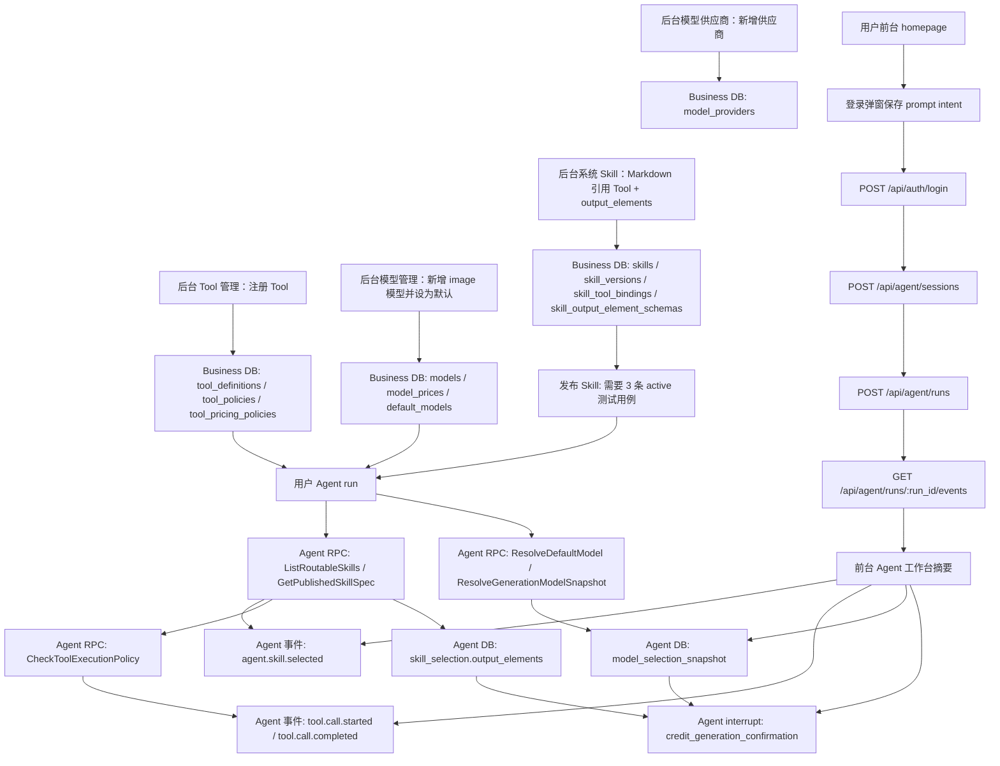

# 后台 Skill / 模型 / Tool 到用户 Agent 链路验收报告

日期：2026-06-30

结论：后端真实消费链路通过，用户前台最小产品链路已闭环。后台新增系统 Skill、模型供应商、模型管理、Tool 管理后，普通用户既可以通过 Agent API 发起复杂提示词，也可以从 `frontend` 首页输入 prompt，登录后继续创建 Agent session/run，并在页面看到 Skill、Tool、模型快照和确认事件摘要。

## 本轮复杂场景

- Tool：注册 `storyboard_extract_<suffix>:builtin`，中风险、免确认、超时 `47000ms`、0 积分，用于故事板分镜提取。
- 模型供应商：新增 `full_flow_provider_<suffix>`，`config.timeout_ms=23456`。
- 模型：新增 image 模型 `full-flow-image-<suffix>`，`route_config.e2e_marker=admin_agent_full_flow`。
- 默认模型：临时把 `image/global/active` 默认模型切到本轮新增模型，脚本退出后恢复原默认模型。
- 系统 Skill：新增并发布公开 Skill，Markdown 中引用本轮 Tool，并配置 `image_ref` 输出元素，`use_draft/use_final=true`。
- 用户提示词：普通用户创建 Agent session/run，prompt 包含唯一 hint `agent-full-flow-<suffix>`。

最后一次通过证据：

- `run_id=run_djloavhwao7c`
- `session_id=sess_djloavhgh87c`
- `skill_id=sk_a7e310a5b6fb41f1ba895460ec114eb2`
- `version_id=skv_db450a69946dac602ea583dcdde71dc4`
- `tool_key=storyboard_extract_20260629162757:builtin`
- `model_id=mdl_705b1b53568d7ca4d916bc8d45f090e8`
- `provider_id=mp_d9310ba7f2c4cfe9908496d3f9e1f33f`
- `unique_hint=agent-full-flow-20260629162757`
- `trace_id=e2e-admin-agent-full-20260629162757`

## 交互流程图

## 已验证通过的流转

| 流转 | 验证方式 | 结果 |
| --- | --- | --- |
| Tool 后台注册和策略落库 | `POST /api/admin/tools` + DB 查 `tool_definitions/tool_policies/tool_pricing_policies/tool_policy_change_records` | 通过 |
| Skill Markdown 引用 Tool 后写绑定 | DB 查 `skill_tool_bindings.tool_name/tool_type` | 通过 |
| Skill 输出元素结构落库 | DB 查 `skill_output_element_schemas.image_ref` | 通过 |
| Skill 发布门槛 | 脚本写入 3 条 active `skill_test_cases` 后发布 | 通过 |
| Agent Skill 路由 | 事件 `agent.skill.selected` 命中本轮 `skill_id`，`matched_reason=route_hint:keyword` | 通过 |
| Agent Tool 策略消费 | 事件 `tool.call.started` 包含本轮 Tool、`policy_allowed=true`、`timeout_ms=47000` | 通过 |
| Agent 默认模型消费 | 事件 `generation.progress(model_snapshot_resolved)` 指向本轮 `model_id` | 通过 |
| Agent 运行快照 | `agent_runs.skill_selection` 含 `tool_refs_count=1/output_elements_count=1`；`model_selection_snapshot` 含本轮 provider/model runtime 信息 | 通过 |
| 确认 payload | `agent_interrupts.confirmation_payload` 含模型快照和 `image_ref` 输出元素 | 通过 |
| 后台 UI 入口 | 浏览器核对 `/admin/tools`、`/admin/models/providers`、`/admin/models`、`/admin/skills/system/new` | 通过 |
| 用户前台登录后继续 | 浏览器在 `http://127.0.0.1:3200` 输入 prompt，点击“登录并继续” | 通过 |
| 用户前台创建 Agent run | 页面展示 `run_djlol7ph5dhs/session=sess_djlol7p0wyww` | 通过 |
| 用户前台消费后台新增配置 | 临时把 image 默认模型切到上次 E2E 新增模型后，前台展示 `sk_a7e310a5b6fb41f1ba895460ec114eb2`、`storyboard_extract_20260629162757`、`mdl_705b1b53568d7ca4d916bc8d45f090e8`、`生成与扣费确认` | 通过，验证后已恢复默认模型 |

## 发现的问题与解决方案

| 问题 | 影响 | 当前状态 | 解决方案 |
| --- | --- | --- | --- |
| 用户前台不能真实发起 Agent run | 用户在首页输入 prompt 后只打开“登录后继续创作”弹窗，无法登录、进入工作台或调用 `/api/agent/sessions`、`/api/agent/runs` | 已修 | `LoginModal` 的“登录并继续”接入本地 seed 登录、创建 Agent session/run、拉取 run events，并在首页展示 `Agent 工作台`摘要 |
| `LoginModal` 的“登录并继续/注册账号”按钮无行为 | 点击后仍停留弹窗，URL 不变，用户无法继续刚才 prompt | 已修“登录并继续”；注册仍非本轮范围 | 登录按钮现在会恢复 prompt intent 并发起真实 Agent run；注册按钮仍保留 UI，占位到正式注册链路 |
| 前端 dev 代理未区分 Business 与 Agent | `/api` 统一代理到 Business，前台如果调用 `/api/agent/*` 会打到错误服务 | 已修 | `frontend/vite.config.js` 增加 `/api/agent -> http://localhost:18080`，并保留 `/api -> http://localhost:19080` |
| 前台只能看接口是否返回，不能看后台配置是否被消费 | 即使创建 run 成功，也难判断 Skill/Tool/模型/确认流是否来自后台新增配置 | 已修最小可视化 | 首页新增 `Agent 工作台`摘要面板，展示 `run_id/session_id/Skill/Tool/Model/Confirmation/Events` |
| 管理端系统 Skill 新建页不支持一等配置 `output_elements` | 后台 UI 可以写 Markdown Tool 引用，但输出元素结构本轮仍通过 API 脚本传入；纯 UI 无法完整配置输出元素 | 未修，管理端体验缺口 | 在系统 Skill 编辑器增加输出元素结构编辑控件，字段对齐 `element_type/use_draft/use_final/display_slot/schema_json` |
| Tool 管理注册只创建元信息和治理策略 | Agent 可以做策略校验和独立 Tool 计费，但没有证明存在真实 Tool 执行器 | 非缺陷，边界需明确 | 文档和 UI 已提示“只注册 Tool 元信息和治理策略，不创建或部署运行时执行器”；真正执行器接入应单列任务 |
| 高风险或需确认 Tool 会提前中断 | 如果 Tool 配置 `requires_confirmation=true` 或 `risk_level=high`，Agent 会创建 `risk_confirmation` interrupt 并返回，不会继续走默认模型快照 | 非缺陷，流程分支 | 主链路验收用免确认 Tool；另补单测/脚本覆盖风险确认分支 |
| 验证脚本内联 JSON 被 shell 花括号展开破坏 | 初次脚本发送的 schema 变成 `"type":"object"`，导致接口返回 `json field must be a valid object` / `schema_json must be json` | 已修 | `scripts/e2e-admin-agent-full-flow.sh` 改为把 JSON Schema 放入变量，再通过 `jq --arg` 注入 |
| 前台完整验收时模型显示 seed 默认模型 | 全链路脚本退出会恢复原默认模型，前台之后自然消费当前默认 `mdl_seed_image` | 已明确验证边界 | 本轮浏览器验收先证明前台链路可用，再临时切默认模型到上次 E2E 新增模型，前台确认展示新增模型后恢复默认 |

## 验证命令

| 命令 | 结果 |
| --- | --- |
| `bash -n scripts/e2e-admin-agent-full-flow.sh` | 通过 |
| `scripts/e2e-admin-agent-full-flow.sh` | 通过，输出 `run_id=run_djloavhwao7c` |
| `npm --prefix frontend test -- --run` | 通过，9 tests |
| `curl http://127.0.0.1:19080/readyz` | `{"service":"business","status":"ready"}` |
| `curl http://127.0.0.1:18080/readyz` | `{"service":"agent","status":"ready"}` |
| 浏览器打开 `http://localhost:3100/admin` | 已登录后台，四个能力配置入口存在 |
| 浏览器打开 `http://127.0.0.1:3200` 并提交普通 prompt | 通过，`run_djloizvtpkog`，页面展示 `sk_a7e310a5b6fb41f1ba895460ec114eb2`、`storyboard_extract_20260629162757`、当前默认 `mdl_seed_image`、13 条事件 |
| 浏览器打开 `http://127.0.0.1:3200`，临时切 image 默认模型后提交 E2E hint prompt | 通过，`run_djlol7ph5dhs`，页面展示 `sk_a7e310a5b6fb41f1ba895460ec114eb2`、`storyboard_extract_20260629162757`、`mdl_705b1b53568d7ca4d916bc8d45f090e8`、13 条事件；验证后默认模型已恢复 `mdl_seed_image` |

## 后续读取提醒

- 以后验收“后台配置是否真的管用”，必须跑 `scripts/e2e-admin-agent-full-flow.sh` 或等价链路，不能只看后台 API 200。
- 后端已证明配置能被 Agent 消费；用户前台也已具备最小真实链路，不应再把同类问题归因到模型/Skill/Tool 后台配置。
- 当前前台仍是本地验收桥接：使用 seed 用户登录并拉取一次 events，不是正式用户工作台。生产化还需要真实登录页、会话持久化、SSE 订阅、确认 accept/reject、资产提交和项目路由。
- 后续修用户前台时，至少要补：正式登录态、订阅 run events、展示 confirmation interrupt 操作按钮、确认后继续生成与资产提交。
