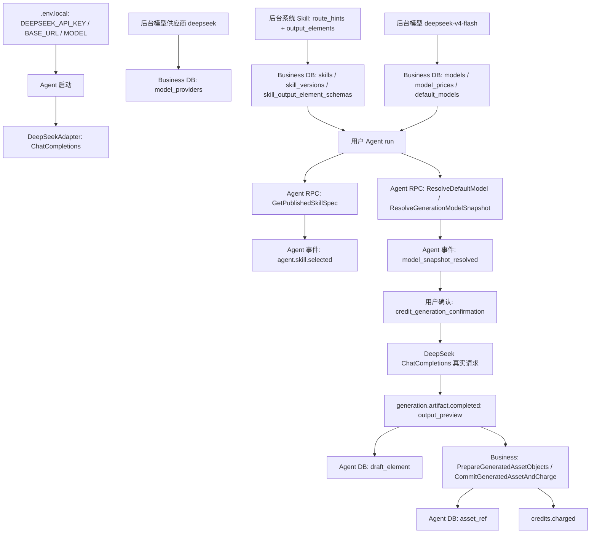

# DeepSeek V4 Flash 真实输出链路验收报告

日期：2026-06-30

结论：通过。Agent 生成链路已从本地假生成切到真实 DeepSeek ChatCompletions。后台 DeepSeek 供应商、DeepSeek V4 Flash 模型、系统 Skill、用户 Agent run、确认扣费、真实模型输出、草稿产物、最终资产引用和积分扣费均完成闭环。

## 本轮目标

- 后台保留或补齐 DeepSeek 模型供应商：`provider_code=deepseek`。
- 后台保留或补齐 DeepSeek V4 Flash image 默认模型：`provider_runtime_ref=deepseek:deepseek-v4-flash`。
- Agent 启动时必须启用 DeepSeek adapter；缺少 `DEEPSEEK_API_KEY` 直接失败，避免静默回落本地假生成。
- 用户侧通过 prompt route hint 命中本轮系统 Skill，再触发真实 DeepSeek 输出。
- 不只验证接口 200，还验证 Agent DB、Business DB、事件流、草稿 artifact、最终 asset_ref 和扣费。

## 交互流程图



## 已修问题

| 问题 | 影响 | 解决方案 | 状态 |
| --- | --- | --- | --- |
| Agent 仍可能静默使用 `LocalAdapter` | 后台模型和 Skill 看似配置成功，但用户实际拿到本地假产物 | `services/agent/cmd/agent/main.go` 启动时强制要求 `DEEPSEEK_API_KEY`，并固定注入 `DeepSeekAdapter` | 已修 |
| 缺少真实 DeepSeek adapter | 只能证明接口、DB 和事件通，不证明模型真的可用 | 新增 `modeltool.DeepSeekAdapter`，调用 `{base_url}/chat/completions`，保留 `output_preview`、`response_id`、`latency_ms`、`finish_reason` | 已修 |
| 真实 DeepSeek 文本直接按 image 保存会被业务资产校验拒绝 | 当前 Agent 主流程固定解析 image 默认模型，业务侧不接受 `text/plain` 作为 image 资产 | 对 `resource_type=image` 生成合法 PNG 载体用于资产链路，DeepSeek 原文保存在事件和草稿 artifact 的 metadata/elements summary | 已修 |
| DeepSeek provider 重复创建导致 500 | 本地已有 `provider_code=deepseek` 时脚本卡死 | `scripts/e2e-deepseek-v4-flash-real-output.sh` 改为先 DB 查询复用；不存在再通过后台 API 创建 | 已修 |
| 中文输出预览按字节截断 | `output_preview` 可能出现替换字符，影响日志/报告判断 | `trimForPreview` 改为 rune-safe，并补 `TestTrimForPreviewIsRuneSafe` | 已修 |
| DeepSeek key 容易泄露到配置中心或日志 | Secret 风险 | `DEEPSEEK_API_KEY` 只从 `.env.local`/环境读取，不进 etcd allowlist；日志只打印 provider/model/base_url | 已修 |

## 最新通过证据

- `trace_id=deepseek-v4-flash-real-20260629171720`
- `run_id=run_djlpcod82j54`
- `session_id=sess_djlpcocsxeww`
- `skill_id=sk_04e678b407d693612ac1e3f4e664959c`
- `version_id=skv_7a0675d8487fd61e5e9cced557eb21aa`
- `provider_id=mp_c78e4633c7e3d34795c332a94c2a5c73`
- `model_id=mdl_9b4eeae88e291805f651c080bbceeac1`
- `provider_runtime_ref=deepseek:deepseek-v4-flash`
- `final_artifact=artref_djlpcro4d1mo|asset_ref|final_ref|image_ref|ast_4b6082462d4f89ae00d42d7a01029639`

DeepSeek 输出预览节选：

```text
一句总结：都市即香氛：在混凝土森林中捕捉一缕失落的自然，让每个街角都成为你私人定制的气息。
三条分镜建议：0-5秒城市天际线到地铁站；6-20秒香水气味视觉化；21-30秒公园站与品牌标志。
风险提醒：避免“自然 vs 城市”的二元对立俗套，需确保香水气息视觉化不突兀。
```

## 关键事件流

| 顺序 | 事件 | 证明点 |
| --- | --- | --- |
| 4 | `agent.skill.selected` | 命中本轮 Skill，`matched_reason=route_hint:keyword` |
| 6 | `generation.progress(model_snapshot_resolved)` | 默认 image 模型解析为 `mdl_9b4eeae88e291805f651c080bbceeac1` |
| 8 | `confirmation.required` | payload 含 `output_elements=image_ref`、扣费确认和模型快照 |
| 11 | `confirmation.accepted` | 用户确认继续 |
| 13 | `credits.frozen` | 冻结 1 积分 |
| 15 | `generation.artifact.completed` | DeepSeek adapter 返回真实 `output_preview`，`finish_reason=stop` |
| 17 | `asset.save.completed` | 最终保存为 `image_ref` 资产 |
| 18 | `credits.charged` | 扣费 1 积分 |
| 21 | `agent.run.completed` | run 完成，`asset_count=1` |

## 验证命令

| 命令 | 结果 |
| --- | --- |
| `go test ./services/agent/internal/runtime/modeltool ./services/agent/internal/infra/config ./services/agent/internal/application/workbench ./services/agent/cmd/agent -count=1` | 通过 |
| `bash -n scripts/e2e-deepseek-v4-flash-real-output.sh` | 通过 |
| `scripts/e2e-deepseek-v4-flash-real-output.sh` | 通过，输出 `run_id=run_djlpcod82j54` |
| `curl http://127.0.0.1:18080/readyz` | `{"service":"agent","status":"ready"}` |
| Agent 启动日志 | `agent_model_adapter_enabled provider=deepseek model=deepseek-v4-flash base_url=https://api.deepseek.com` |

## 后续读取提醒

- 以后验证“真实模型是否管用”，优先跑 `scripts/e2e-deepseek-v4-flash-real-output.sh`，不要只看接口通不通。
- 该脚本会把本地 `image/global` 默认模型切到 DeepSeek V4 Flash，符合后续默认使用真实 DeepSeek 的方向。
- 当前 image 资产仍使用 PNG 载体保存 DeepSeek 文本输出；这解决了现有 image 主流程的业务资产校验问题，但后续更理想的方向是 Agent 支持文本/结构化输出元素直接进入最终产物，不再借 image 载体。
- `.env.local` 是唯一放真实 `DEEPSEEK_API_KEY` 的地方；报告、日志、脚本输出都不得打印 key。
